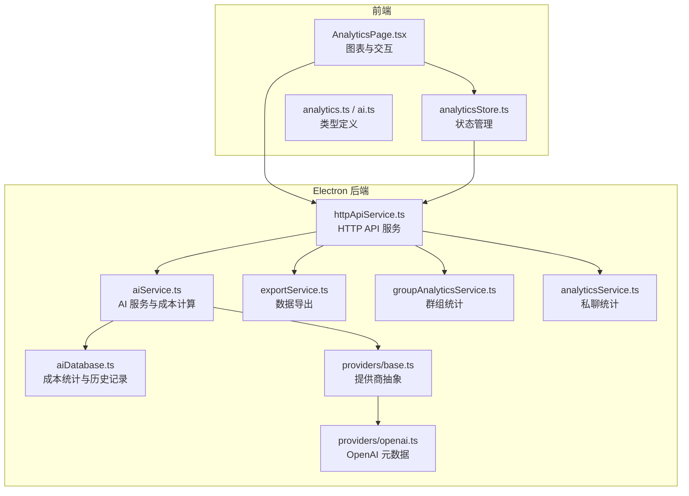
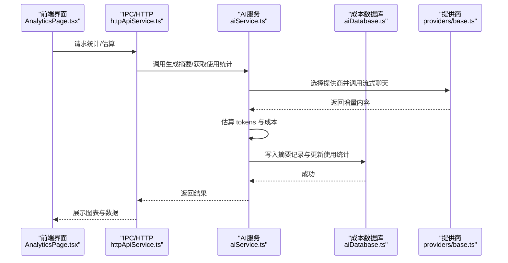
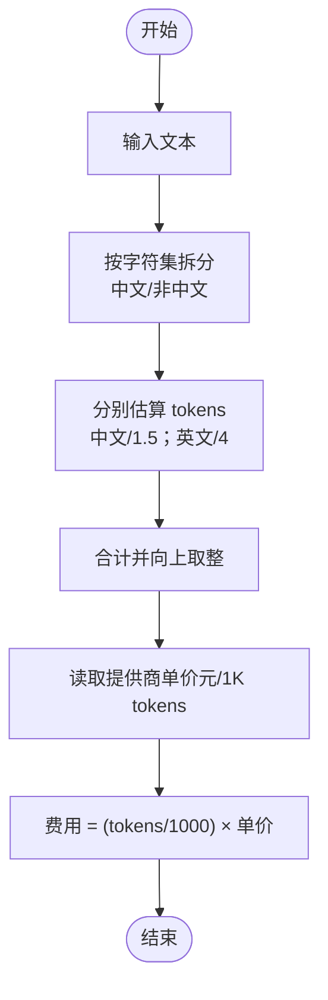
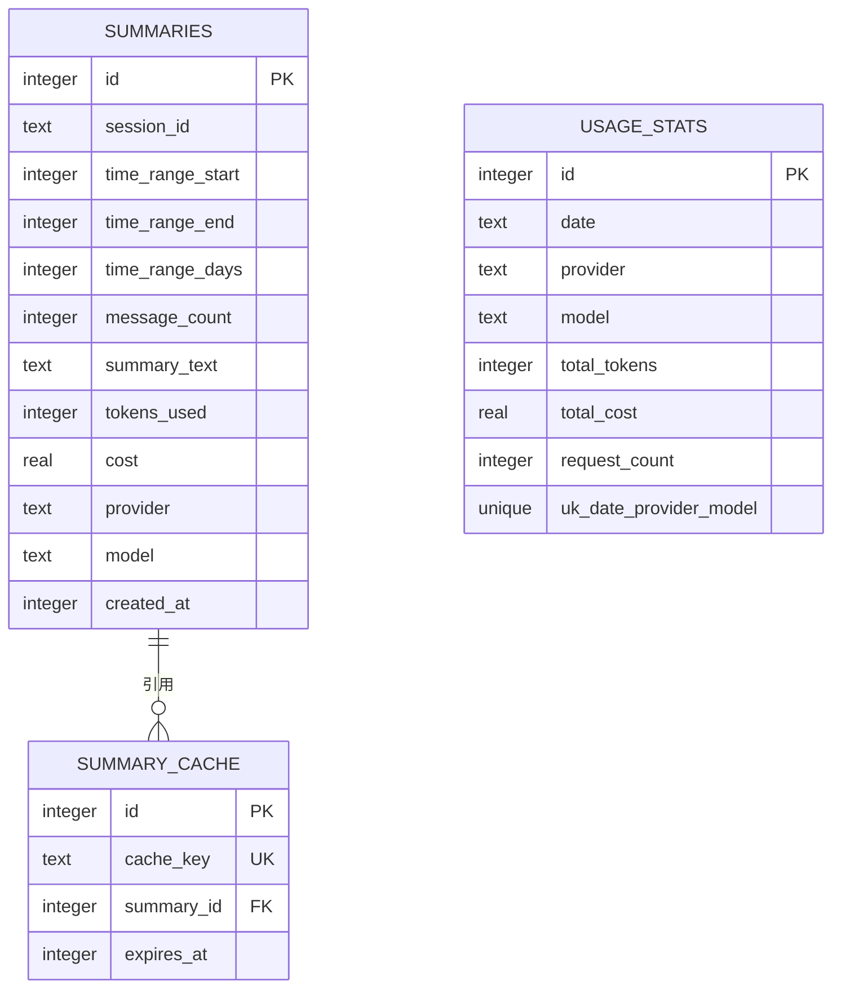
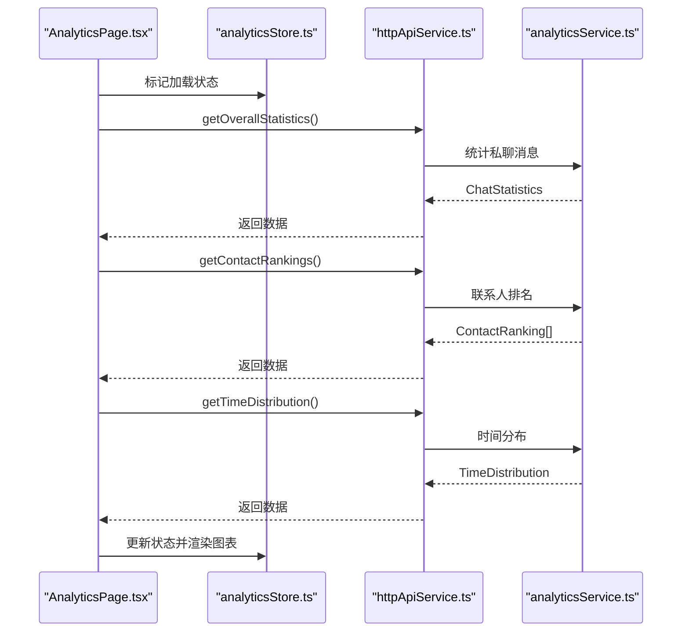
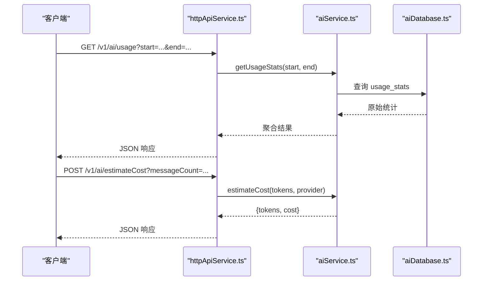
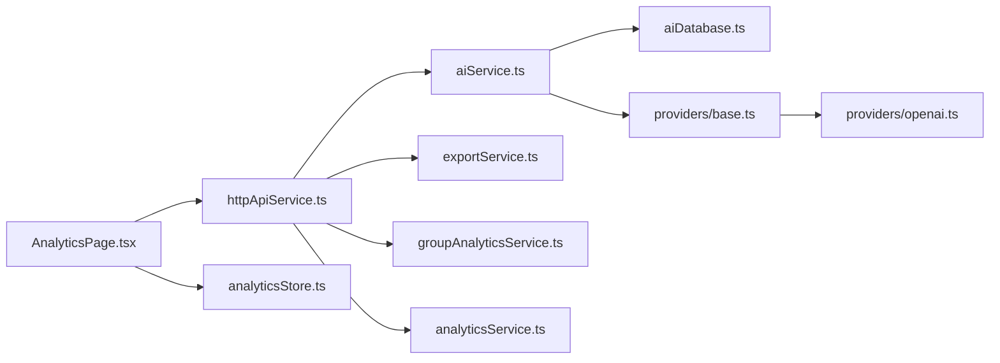

# AI 成本统计与追踪

<cite>
**本文档引用的文件**
- [analyticsService.ts](file://electron/services/analyticsService.ts)
- [groupAnalyticsService.ts](file://electron/services/groupAnalyticsService.ts)
- [AnalyticsPage.tsx](file://src/pages/AnalyticsPage.tsx)
- [analyticsStore.ts](file://src/stores/analyticsStore.ts)
- [aiDatabase.ts](file://electron/services/ai/aiDatabase.ts)
- [aiService.ts](file://electron/services/ai/aiService.ts)
- [base.ts](file://electron/services/ai/providers/base.ts)
- [openai.ts](file://electron/services/ai/providers/openai.ts)
- [httpApiService.ts](file://electron/services/httpApiService.ts)
- [exportService.ts](file://electron/services/exportService.ts)
- [analytics.ts](file://src/types/analytics.ts)
- [ai.ts](file://src/types/ai.ts)
</cite>

## 目录
1. [简介](#简介)
2. [项目结构](#项目结构)
3. [核心组件](#核心组件)
4. [架构总览](#架构总览)
5. [详细组件分析](#详细组件分析)
6. [依赖关系分析](#依赖关系分析)
7. [性能考量](#性能考量)
8. [故障排查指南](#故障排查指南)
9. [结论](#结论)
10. [附录](#附录)

## 简介
本文件面向 CipherTalk 的 AI 成本统计与追踪能力，系统化阐述以下内容：
- 成本计算模型：token 估算算法、提供商定价策略、费用计算公式
- 使用统计功能：请求次数统计、token 使用量追踪、总费用汇总、时间范围查询
- 数据库设计：统计表结构、索引优化、数据聚合、历史记录管理
- 成本优化策略：模型选择建议、提示词优化、批量处理、缓存利用
- 统计报表功能：每日统计、月度汇总、提供商对比、趋势分析
- 成本控制建议：预算设置、使用限制、告警机制
- 统计 API 的使用示例与数据导出功能说明

## 项目结构
围绕“成本统计与追踪”的核心代码分布在以下模块：
- Electron 后端服务层：负责数据库、AI 服务、HTTP API、导出服务
- 前端页面与状态：负责展示统计结果与交互
- 类型定义：统一前后端数据结构

**图示来源**
- [AnalyticsPage.tsx:1-189](file://src/pages/AnalyticsPage.tsx#L1-L189)
- [analyticsStore.ts:1-71](file://src/stores/analyticsStore.ts#L1-L71)
- [aiService.ts:1-631](file://electron/services/ai/aiService.ts#L1-L631)
- [aiDatabase.ts:1-347](file://electron/services/ai/aiDatabase.ts#L1-L347)
- [base.ts:1-241](file://electron/services/ai/providers/base.ts#L1-L241)
- [openai.ts:1-59](file://electron/services/ai/providers/openai.ts#L1-L59)
- [httpApiService.ts:1-200](file://electron/services/httpApiService.ts#L1-L200)
- [exportService.ts:1-200](file://electron/services/exportService.ts#L1-L200)
- [groupAnalyticsService.ts:1-718](file://electron/services/groupAnalyticsService.ts#L1-L718)
- [analyticsService.ts:1-759](file://electron/services/analyticsService.ts#L1-L759)

**章节来源**
- [AnalyticsPage.tsx:1-189](file://src/pages/AnalyticsPage.tsx#L1-L189)
- [analyticsStore.ts:1-71](file://src/stores/analyticsStore.ts#L1-L71)
- [aiService.ts:1-631](file://electron/services/ai/aiService.ts#L1-L631)
- [aiDatabase.ts:1-347](file://electron/services/ai/aiDatabase.ts#L1-L347)
- [base.ts:1-241](file://electron/services/ai/providers/base.ts#L1-L241)
- [openai.ts:1-59](file://electron/services/ai/providers/openai.ts#L1-L59)
- [httpApiService.ts:1-200](file://electron/services/httpApiService.ts#L1-L200)
- [exportService.ts:1-200](file://electron/services/exportService.ts#L1-L200)
- [groupAnalyticsService.ts:1-718](file://electron/services/groupAnalyticsService.ts#L1-L718)
- [analyticsService.ts:1-759](file://electron/services/analyticsService.ts#L1-L759)

## 核心组件
- 成本计算与统计
  - token 估算：基于文本字符集估算（中文与英文权重不同）
  - 成本计算：按提供商定价（每 1K tokens 输入价）计算
  - 使用统计：按日期、提供商、模型聚合请求次数、token 数与总费用
- 数据存储
  - 摘要记录表：保存每次摘要的会话、时间范围、token 使用、费用、提供商与模型
  - 使用统计表：按日聚合 token 与费用，唯一约束保证幂等更新
  - 缓存表：摘要结果缓存与过期管理
- 统计报表
  - 私聊统计：消息总数、发送/接收、活跃天数、消息类型分布、时间分布
  - 群组统计：群成员消息排行、活跃时段、媒体类型统计
- API 与导出
  - HTTP API：提供服务状态、统计查询、估算接口
  - 导出服务：支持多种格式的数据导出（Excel、JSON、HTML 等）

**章节来源**
- [aiService.ts:410-425](file://electron/services/ai/aiService.ts#L410-L425)
- [aiDatabase.ts:211-226](file://electron/services/ai/aiDatabase.ts#L211-L226)
- [aiDatabase.ts:38-102](file://electron/services/ai/aiDatabase.ts#L38-L102)
- [analyticsService.ts:269-450](file://electron/services/analyticsService.ts#L269-L450)
- [groupAnalyticsService.ts:423-531](file://electron/services/groupAnalyticsService.ts#L423-L531)
- [httpApiService.ts:1-200](file://electron/services/httpApiService.ts#L1-L200)
- [exportService.ts:1-200](file://electron/services/exportService.ts#L1-L200)

## 架构总览
AI 成本统计与追踪的整体流程如下：

**图示来源**
- [AnalyticsPage.tsx:15-45](file://src/pages/AnalyticsPage.tsx#L15-L45)
- [httpApiService.ts:1-200](file://electron/services/httpApiService.ts#L1-L200)
- [aiService.ts:438-539](file://electron/services/ai/aiService.ts#L438-L539)
- [aiDatabase.ts:117-164](file://electron/services/ai/aiDatabase.ts#L117-L164)
- [base.ts:106-175](file://electron/services/ai/providers/base.ts#L106-L175)

## 详细组件分析

### 成本计算模型
- token 估算算法
  - 中文字符：约 1.5 字符 ≈ 1 token
  - 英文字符：约 4 字符 ≈ 1 token
  - 公式：向上取整求和
- 成本计算公式
  - 单价：按提供商定价（元/1K tokens）
  - 费用 = (tokens / 1000) × 单价
- 实现位置
  - 估算：[aiService.ts:412-417](file://electron/services/ai/aiService.ts#L412-L417)
  - 成本：[aiService.ts:422-425](file://electron/services/ai/aiService.ts#L422-L425)
  - 提供商定价：[openai.ts:22-28](file://electron/services/ai/providers/openai.ts#L22-L28)

**图示来源**
- [aiService.ts:412-425](file://electron/services/ai/aiService.ts#L412-L425)
- [openai.ts:22-28](file://electron/services/ai/providers/openai.ts#L22-L28)

**章节来源**
- [aiService.ts:410-425](file://electron/services/ai/aiService.ts#L410-L425)
- [openai.ts:1-59](file://electron/services/ai/providers/openai.ts#L1-L59)

### 使用统计与数据库设计
- 表结构与索引
  - 摘要记录表：会话标识、时间范围、消息数、摘要文本、tokens、费用、提供商、模型、创建时间
  - 使用统计表：日期、提供商、模型、累计 tokens、累计费用、请求次数（唯一约束）
  - 缓存表：缓存键、摘要 ID、过期时间
- 聚合与查询
  - 按日聚合：INSERT ... ON CONFLICT(date, provider, model) DO UPDATE
  - 时间范围查询：支持起止日期筛选
- 历史记录管理
  - 保存摘要、删除摘要、重命名摘要、清理过期缓存

**图示来源**
- [aiDatabase.ts:38-102](file://electron/services/ai/aiDatabase.ts#L38-L102)
- [aiDatabase.ts:211-226](file://electron/services/ai/aiDatabase.ts#L211-L226)

**章节来源**
- [aiDatabase.ts:1-347](file://electron/services/ai/aiDatabase.ts#L1-L347)

### 统计报表功能
- 私聊统计（AnalyticsPage）
  - 总消息数、发送/接收、活跃天数、消息类型分布、发送/接收比例、每小时分布
  - 加载流程：整体统计 → 联系人排名 → 时间分布
- 群组统计（GroupAnalyticsService）
  - 群成员消息排行、活跃时段、媒体类型统计（文本/图片/语音/视频/表情/链接/文件）
  - 支持时间范围过滤
- 前端展示
  - 使用 ECharts 渲染饼图与柱状图
  - 使用 Zustand 管理状态与缓存标记

**图示来源**
- [AnalyticsPage.tsx:15-45](file://src/pages/AnalyticsPage.tsx#L15-L45)
- [analyticsStore.ts:52-70](file://src/stores/analyticsStore.ts#L52-L70)
- [analyticsService.ts:269-450](file://electron/services/analyticsService.ts#L269-L450)

**章节来源**
- [AnalyticsPage.tsx:1-189](file://src/pages/AnalyticsPage.tsx#L1-L189)
- [analyticsStore.ts:1-71](file://src/stores/analyticsStore.ts#L1-L71)
- [analyticsService.ts:269-450](file://electron/services/analyticsService.ts#L269-L450)
- [groupAnalyticsService.ts:423-531](file://electron/services/groupAnalyticsService.ts#L423-L531)

### 统计 API 与导出
- 统计 API
  - 健康检查、服务状态、会话列表、消息查询、联系人列表等
  - 成本估算接口：根据消息数量估算 tokens 与费用
- 数据导出
  - 支持 Excel、JSON、HTML、SQL 等格式
  - 可选导出媒体资源与头像

**图示来源**
- [httpApiService.ts:142-151](file://electron/services/httpApiService.ts#L142-L151)
- [httpApiService.ts:3317-3327](file://electron/services/httpApiService.ts#L3317-L3327)
- [aiService.ts:562-586](file://electron/services/ai/aiService.ts#L562-L586)
- [aiDatabase.ts:231-251](file://electron/services/ai/aiDatabase.ts#L231-L251)

**章节来源**
- [httpApiService.ts:1-200](file://electron/services/httpApiService.ts#L1-L200)
- [aiService.ts:562-586](file://electron/services/ai/aiService.ts#L562-L586)
- [exportService.ts:86-107](file://electron/services/exportService.ts#L86-L107)

## 依赖关系分析
- 组件耦合
  - aiService 依赖 aiDatabase、providers 抽象与具体提供商实现
  - 前端通过 IPC/HTTP 与后端交互，降低耦合
- 外部依赖
  - better-sqlite3：本地数据库
  - OpenAI SDK：流式聊天与代理支持
  - ECharts：前端可视化
- 潜在循环依赖
  - 无直接循环，模块职责清晰（服务层/存储层/前端）

**图示来源**
- [AnalyticsPage.tsx:1-189](file://src/pages/AnalyticsPage.tsx#L1-L189)
- [httpApiService.ts:1-200](file://electron/services/httpApiService.ts#L1-L200)
- [aiService.ts:1-631](file://electron/services/ai/aiService.ts#L1-L631)
- [aiDatabase.ts:1-347](file://electron/services/ai/aiDatabase.ts#L1-L347)
- [base.ts:1-241](file://electron/services/ai/providers/base.ts#L1-L241)
- [openai.ts:1-59](file://electron/services/ai/providers/openai.ts#L1-L59)
- [exportService.ts:1-200](file://electron/services/exportService.ts#L1-L200)
- [groupAnalyticsService.ts:1-718](file://electron/services/groupAnalyticsService.ts#L1-L718)
- [analyticsService.ts:1-759](file://electron/services/analyticsService.ts#L1-L759)

**章节来源**
- [aiService.ts:1-631](file://electron/services/ai/aiService.ts#L1-L631)
- [base.ts:1-241](file://electron/services/ai/providers/base.ts#L1-L241)
- [openai.ts:1-59](file://electron/services/ai/providers/openai.ts#L1-L59)

## 性能考量
- 数据库性能
  - 使用唯一约束与 ON CONFLICT 更新，减少重复写入
  - 为日期、会话、时间范围建立索引，加速查询
- 计算性能
  - token 估算为纯文本处理，复杂度低
  - 流式生成可边产出边渲染，降低首屏等待
- I/O 优化
  - 缓存摘要与过期清理，减少重复计算
  - 导出时按需导出媒体资源，避免冗余

[本节为通用指导，无需特定文件引用]

## 故障排查指南
- 连接问题
  - 提供商连接测试：自动识别超时、域名解析失败、401/403/429/5xx 等错误并提示
  - 代理检测：根据错误码判断是否需要代理
- 成本估算异常
  - 确认提供商配置与 API Key
  - 检查 token 估算输入文本是否为空或异常
- 统计无数据
  - 检查微信账号目录与数据库文件是否存在
  - 确认时间范围与过滤条件

**章节来源**
- [base.ts:177-239](file://electron/services/ai/providers/base.ts#L177-L239)
- [aiService.ts:544-557](file://electron/services/ai/aiService.ts#L544-L557)

## 结论
CipherTalk 的 AI 成本统计与追踪体系以“可估算、可聚合、可导出”为核心目标，结合本地数据库与流式生成，实现了从 token 估算到费用汇总的闭环。通过合理的表结构与索引设计、前端可视化与 API 对接，既满足日常使用，也为扩展统计维度（如群组、媒体类型）提供了良好基础。

[本节为总结，无需特定文件引用]

## 附录

### 成本优化策略
- 模型选择建议
  - 优先选择输入单价较低的提供商
  - 对长文本场景，考虑更高效的模型组合
- 提示词优化
  - 控制摘要长度与复杂度，减少 tokens 使用
- 批量处理与缓存
  - 合理设置时间窗口，复用缓存结果
  - 清理过期缓存，释放空间

[本节为通用指导，无需特定文件引用]

### 成本控制建议
- 预算设置
  - 在前端或配置中设定每日/每月预算阈值
- 使用限制
  - 限制摘要生成频率与时间范围
- 告警机制
  - 当接近预算阈值时触发通知

[本节为通用指导，无需特定文件引用]

### 统计 API 使用示例
- 获取使用统计（支持时间范围）
  - 方法：GET /v1/ai/usage
  - 参数：start（可选）、end（可选）
  - 返回：totalCount、totalTokens、totalCost、details
- 成本估算
  - 方法：POST /v1/ai/estimateCost
  - 参数：messageCount、provider
  - 返回：tokens、cost

**章节来源**
- [httpApiService.ts:142-151](file://electron/services/httpApiService.ts#L142-L151)
- [httpApiService.ts:3317-3327](file://electron/services/httpApiService.ts#L3317-L3327)
- [aiService.ts:562-586](file://electron/services/ai/aiService.ts#L562-L586)

### 数据导出功能说明
- 支持格式：Excel、JSON、HTML、SQL、ChatLab 等
- 可选导出项：媒体资源、头像、语音转写等
- 使用场景：合规审计、备份归档、二次分析

**章节来源**
- [exportService.ts:86-107](file://electron/services/exportService.ts#L86-L107)