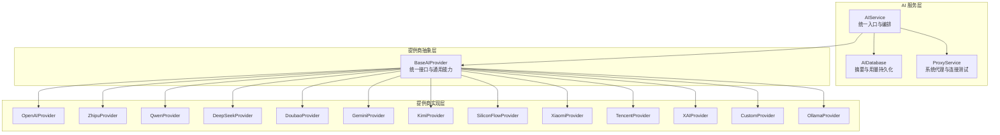
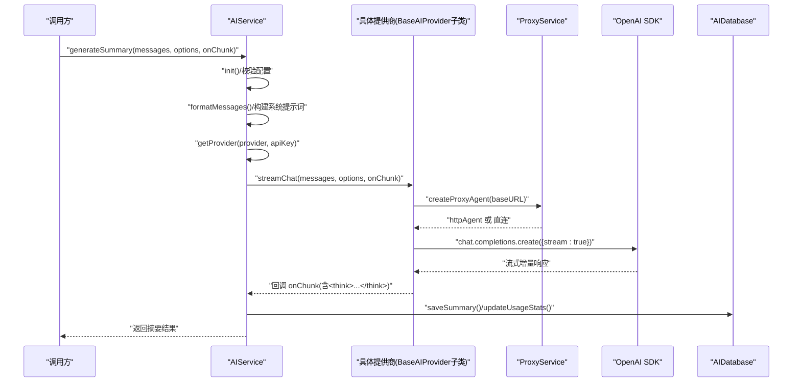
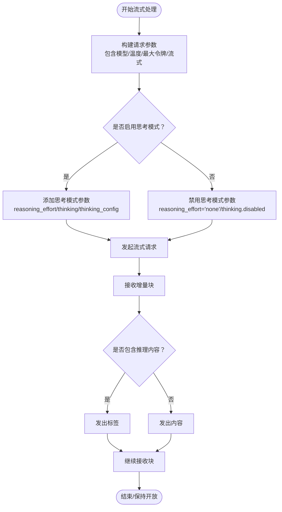
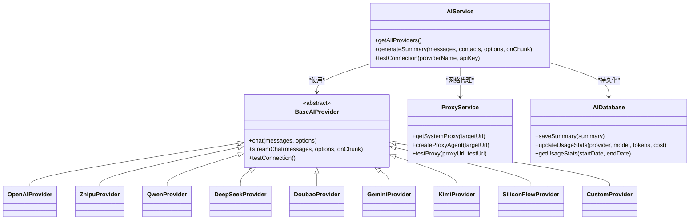

# AI 提供商集成

<cite>
**本文引用的文件**
- [electron/services/ai/aiService.ts](file://electron/services/ai/aiService.ts)
- [electron/services/ai/aiDatabase.ts](file://electron/services/ai/aiDatabase.ts)
- [electron/services/ai/proxyService.ts](file://electron/services/ai/proxyService.ts)
- [electron/services/ai/providers/base.ts](file://electron/services/ai/providers/base.ts)
- [electron/services/ai/providers/custom.ts](file://electron/services/ai/providers/custom.ts)
- [electron/services/ai/providers/openai.ts](file://electron/services/ai/providers/openai.ts)
- [electron/services/ai/providers/zhipu.ts](file://electron/services/ai/providers/zhipu.ts)
- [electron/services/ai/providers/qwen.ts](file://electron/services/ai/providers/qwen.ts)
- [electron/services/ai/providers/deepseek.ts](file://electron/services/ai/providers/deepseek.ts)
- [electron/services/ai/providers/doubao.ts](file://electron/services/ai/providers/doubao.ts)
- [electron/services/ai/providers/gemini.ts](file://electron/services/ai/providers/gemini.ts)
- [electron/services/ai/providers/kimi.ts](file://electron/services/ai/providers/kimi.ts)
- [electron/services/ai/providers/siliconflow.ts](file://electron/services/ai/providers/siliconflow.ts)
- [electron/services/ai/Ollama使用指南.md](file://electron/services/ai/Ollama使用指南.md)
</cite>

## 目录
1. [简介](#简介)
2. [项目结构](#项目结构)
3. [核心组件](#核心组件)
4. [架构总览](#架构总览)
5. [详细组件分析](#详细组件分析)
6. [依赖关系分析](#依赖关系分析)
7. [性能考量](#性能考量)
8. [故障排除指南](#故障排除指南)
9. [结论](#结论)
10. [附录](#附录)

## 简介
本文件面向 CipherTalk 的 AI 提供商集成，系统性梳理 12 家 AI 提供商（OpenAI、智谱清言、通义千问、DeepSeek、Google Gemini、字节跳动豆包、月之暗面 KIMI、SiliconFlow、小米、腾讯混元、xAI、Ollama 本地服务、自定义服务）的 API 封装与统一接入层设计。文档覆盖以下主题：
- 统一接口与封装：认证方式、请求格式、响应解析、错误处理
- 提供商特性：模型列表、定价策略、流式响应、思考模式
- 配置管理：API 密钥存储、baseURL 配置、模型选择、参数定制
- 代理支持：网络配置、连接测试、故障转移
- 对比与建议：优缺点、使用场景、最佳实践
- 配置示例与故障排除

## 项目结构
AI 集成相关代码集中在 Electron 主进程的 ai 子模块中，采用“统一服务 + 抽象基类 + 多提供商实现”的分层架构。

图表来源
- [electron/services/ai/aiService.ts:58-163](file://electron/services/ai/aiService.ts#L58-L163)
- [electron/services/ai/providers/base.ts:49-90](file://electron/services/ai/providers/base.ts#L49-L90)
- [electron/services/ai/proxyService.ts:16-99](file://electron/services/ai/proxyService.ts#L16-L99)
- [electron/services/ai/aiDatabase.ts:8-102](file://electron/services/ai/aiDatabase.ts#L8-L102)

章节来源
- [electron/services/ai/aiService.ts:58-163](file://electron/services/ai/aiService.ts#L58-L163)
- [electron/services/ai/providers/base.ts:49-90](file://electron/services/ai/providers/base.ts#L49-L90)
- [electron/services/ai/proxyService.ts:16-99](file://electron/services/ai/proxyService.ts#L16-L99)
- [electron/services/ai/aiDatabase.ts:8-102](file://electron/services/ai/aiDatabase.ts#L8-L102)

## 核心组件
- AIService：统一入口，负责提供商选择、消息格式化、系统提示词构建、流式摘要生成、用量统计与历史管理、连接测试。
- BaseAIProvider：抽象基类，定义统一接口与通用能力（非流式/流式聊天、连接测试、代理注入、思考模式兼容）。
- ProxyService：系统代理探测与注入，支持 HTTP/HTTPS/SOCKS5，带缓存与连接测试。
- AIDatabase：SQLite 摘要与用量统计持久化，提供索引优化与缓存键管理。

章节来源
- [electron/services/ai/aiService.ts:58-163](file://electron/services/ai/aiService.ts#L58-L163)
- [electron/services/ai/providers/base.ts:49-90](file://electron/services/ai/providers/base.ts#L49-L90)
- [electron/services/ai/proxyService.ts:16-99](file://electron/services/ai/proxyService.ts#L16-L99)
- [electron/services/ai/aiDatabase.ts:8-102](file://electron/services/ai/aiDatabase.ts#L8-L102)

## 架构总览
AI 服务的调用链路如下：

图表来源
- [electron/services/ai/aiService.ts:439-539](file://electron/services/ai/aiService.ts#L439-L539)
- [electron/services/ai/providers/base.ts:106-175](file://electron/services/ai/providers/base.ts#L106-L175)
- [electron/services/ai/proxyService.ts:83-99](file://electron/services/ai/proxyService.ts#L83-L99)
- [electron/services/ai/aiDatabase.ts:117-226](file://electron/services/ai/aiDatabase.ts#L117-L226)

## 详细组件分析

### 统一接口与抽象基类
- 接口职责
  - 非流式聊天：返回完整文本。
  - 流式聊天：逐块回调，支持“思考模式”包裹标签<think>...</think>。
  - 连接测试：统一错误分类与代理需求提示。
- 代理注入
  - 每次请求动态获取系统代理，支持 HTTP/HTTPS/SOCKS5，注入 httpAgent。
- 思考模式兼容
  - 自动尝试多种提供商的思考模式参数（reasoning_effort、thinking、thinking_config），并统一转换为<think>标签。
- 错误处理
  - 对超时、域名解析失败、401/403/429/5xx 等进行分类提示；必要时标记 needsProxy。

章节来源
- [electron/services/ai/providers/base.ts:7-44](file://electron/services/ai/providers/base.ts#L7-L44)
- [electron/services/ai/providers/base.ts:49-90](file://electron/services/ai/providers/base.ts#L49-L90)
- [electron/services/ai/providers/base.ts:106-175](file://electron/services/ai/providers/base.ts#L106-L175)
- [electron/services/ai/providers/base.ts:177-240](file://electron/services/ai/providers/base.ts#L177-L240)

### AIService 编排与消息格式化
- 初始化与配置
  - 依赖 ConfigService 获取 cachePath/myWxid，初始化 AIDatabase。
  - 不同提供商的 apiKey 获取策略：优先显式传入，其次从配置读取；Ollama 可选，自定义必须提供 baseURL。
- 消息格式化
  - 将微信消息转换为结构化文本，区分文本、图片、语音、视频、表情包、文件、链接、小程序、聊天记录、引用、位置、名片、通话、系统消息等类型。
  - 语音消息优先使用转写缓存，否则回退到解析内容。
  - 撤回消息与空内容消息会被过滤。
- 系统提示词
  - 支持三种详细度（简单/标准/深度）、五种风格预设（默认/决策焦点/行动焦点/风险焦点/自定义），并允许自定义系统提示词。
- 流式摘要
  - 组装 system/user 提示词，调用提供商 streamChat，实时拼接并回调。
  - 估算 tokens 与成本，保存摘要与用量统计。

章节来源
- [electron/services/ai/aiService.ts:69-83](file://electron/services/ai/aiService.ts#L69-L83)
- [electron/services/ai/aiService.ts:109-163](file://electron/services/ai/aiService.ts#L109-L163)
- [electron/services/ai/aiService.ts:168-238](file://electron/services/ai/aiService.ts#L168-L238)
- [electron/services/ai/aiService.ts:243-407](file://electron/services/ai/aiService.ts#L243-L407)
- [electron/services/ai/aiService.ts:439-539](file://electron/services/ai/aiService.ts#L439-L539)

### 代理服务（ProxyService）
- 系统代理探测
  - 通过 Electron session.resolveProxy 获取系统代理规则，解析为 http/socks5 代理 URL，带缓存（默认 1 分钟）。
- 代理 Agent 注入
  - 使用 https-proxy-agent 创建 httpAgent，注入到 OpenAI SDK 客户端。
- 连接测试
  - 支持对指定目标 URL 进行 HEAD 请求测试，带超时控制。

章节来源
- [electron/services/ai/proxyService.ts:26-76](file://electron/services/ai/proxyService.ts#L26-L76)
- [electron/services/ai/proxyService.ts:83-99](file://electron/services/ai/proxyService.ts#L83-L99)
- [electron/services/ai/proxyService.ts:115-146](file://electron/services/ai/proxyService.ts#L115-L146)

### 数据库（AIDatabase）
- 表结构
  - summaries：摘要记录（会话、时间范围、消息数、文本、tokens、成本、提供商、模型、创建时间、提示词、自定义名）。
  - usage_stats：用量统计（日期、提供商、模型、总 tokens、总成本、请求次数）。
  - summary_cache：摘要缓存（缓存键、摘要 ID、过期时间）。
- 功能
  - 保存摘要、更新用量统计、查询历史、删除/重命名摘要、清理过期缓存。

章节来源
- [electron/services/ai/aiDatabase.ts:35-102](file://electron/services/ai/aiDatabase.ts#L35-L102)
- [electron/services/ai/aiDatabase.ts:117-226](file://electron/services/ai/aiDatabase.ts#L117-L226)
- [electron/services/ai/aiDatabase.ts:254-332](file://electron/services/ai/aiDatabase.ts#L254-L332)

### 各提供商实现与特性

#### OpenAI
- 模型映射：将展示名映射为真实模型 ID。
- baseURL：固定为官方 v1 端点。
- 思考模式：沿用统一逻辑，自动尝试多种参数格式。
- 定价：按量计费，输入/输出单价见元/1K tokens。

章节来源
- [electron/services/ai/providers/openai.ts:6-28](file://electron/services/ai/providers/openai.ts#L6-L28)
- [electron/services/ai/providers/openai.ts:30-39](file://electron/services/ai/providers/openai.ts#L30-L39)
- [electron/services/ai/providers/openai.ts:50-76](file://electron/services/ai/providers/openai.ts#L50-L76)

#### 智谱清言（Zhipu）
- baseURL：使用官方 PaaS v4 端点。
- 模型映射：GLM 系列展示名到真实 ID 的映射。
- 定价：¥0.005/1K tokens。

章节来源
- [electron/services/ai/providers/zhipu.ts:6-27](file://electron/services/ai/providers/zhipu.ts#L6-L27)
- [electron/services/ai/providers/zhipu.ts:29-37](file://electron/services/ai/providers/zhipu.ts#L29-L37)
- [electron/services/ai/providers/zhipu.ts:48-74](file://electron/services/ai/providers/zhipu.ts#L48-L74)

#### 通义千问（Qwen）
- baseURL：DashScope 兼容模式 v1。
- 模型映射：Qwen/QwQ/DeepSeek/Kimi/GLM 等多系列映射。
- 定价：¥0.008/1K tokens。

章节来源
- [electron/services/ai/providers/qwen.ts:6-35](file://electron/services/ai/providers/qwen.ts#L6-L35)
- [electron/services/ai/providers/qwen.ts:37-53](file://electron/services/ai/providers/qwen.ts#L37-L53)
- [electron/services/ai/providers/qwen.ts:64-90](file://electron/services/ai/providers/qwen.ts#L64-L90)

#### DeepSeek
- baseURL：api.deepseek.com/v1。
- 模型映射：deepseek-chat / deepseek-reasoner。
- 定价：¥0.001/1K tokens（极高性价比）。

章节来源
- [electron/services/ai/providers/deepseek.ts:6-19](file://electron/services/ai/providers/deepseek.ts#L6-L19)
- [electron/services/ai/providers/deepseek.ts:21-24](file://electron/services/ai/providers/deepseek.ts#L21-L24)
- [electron/services/ai/providers/deepseek.ts:35-61](file://electron/services/ai/providers/deepseek.ts#L35-L61)

#### Google Gemini
- baseURL：使用 OpenAI 兼容端点（google generativelanguage）。
- 思考模式：针对 Gemini 3/2.5/2.0 系列分别使用 thinking_config/extra_body 与 reasoning_effort 的组合。
- 定价：按量计费，输入/输出单价见元/1K tokens。

章节来源
- [electron/services/ai/providers/gemini.ts:7-29](file://electron/services/ai/providers/gemini.ts#L7-L29)
- [electron/services/ai/providers/gemini.ts:52-55](file://electron/services/ai/providers/gemini.ts#L52-L55)
- [electron/services/ai/providers/gemini.ts:76-191](file://electron/services/ai/providers/gemini.ts#L76-L191)

#### 字节跳动豆包（Doubao）
- baseURL：ark.cn-beijing.volces.com/api/v3。
- 模型映射：多版本种子模型、DeepSeek/GLM 等映射。
- 定价：¥0.008/1K tokens。

章节来源
- [electron/services/ai/providers/doubao.ts:6-19](file://electron/services/ai/providers/doubao.ts#L6-L19)
- [electron/services/ai/providers/doubao.ts:21-32](file://electron/services/ai/providers/doubao.ts#L21-L32)
- [electron/services/ai/providers/doubao.ts:43-60](file://electron/services/ai/providers/doubao.ts#L43-L60)

#### 月之暗面 KIMI
- baseURL：api.moonshot.cn/v1。
- 模型映射：Kimi 2.5/K2 系列、Moonshot 上下文长度系列。
- 定价：¥0.012/1K tokens。

章节来源
- [electron/services/ai/providers/kimi.ts:6-19](file://electron/services/ai/providers/kimi.ts#L6-L19)
- [electron/services/ai/providers/kimi.ts:21-35](file://electron/services/ai/providers/kimi.ts#L21-L35)
- [electron/services/ai/providers/kimi.ts:46-63](file://electron/services/ai/providers/kimi.ts#L46-L63)

#### SiliconFlow
- baseURL：api.siliconflow.cn/v1。
- 模型：开源模型集合（DeepSeek、Qwen、Llama、GLM、InternLM 等）。
- 定价：提供免费额度（input/output 为 0）。

章节来源
- [electron/services/ai/providers/siliconflow.ts:6-26](file://electron/services/ai/providers/siliconflow.ts#L6-L26)
- [electron/services/ai/providers/siliconflow.ts:37-40](file://electron/services/ai/providers/siliconflow.ts#L37-L40)

#### 小米、腾讯混元、xAI
- 小米（Xiaomi）：提供元数据与模型列表，baseURL 由子类实现。
- 腾讯混元（Tencent）：提供元数据与模型列表，baseURL 由子类实现。
- xAI：提供元数据与模型列表，baseURL 由子类实现。
- 说明：本仓库未提供具体实现文件，此处仅列出元数据与模型列表以供参考。

章节来源
- [electron/services/ai/aiService.ts:88-104](file://electron/services/ai/aiService.ts#L88-L104)

#### Ollama 本地服务
- baseURL：默认 http://localhost:11434/v1，可从配置读取。
- apiKey：本地服务通常无需密钥，可传入任意值。
- 说明：详见 Ollama 使用指南文档。

章节来源
- [electron/services/ai/aiService.ts:133-137](file://electron/services/ai/aiService.ts#L133-L137)
- [electron/services/ai/Ollama使用指南.md](file://electron/services/ai/Ollama使用指南.md)

#### 自定义服务（Custom）
- baseURL：必须提供，且需包含 /v1。
- 模型：列举常见兼容模型，便于选择。
- 连接测试：增强错误提示，区分 404 端点缺失、429 频率限制、5xx 服务器错误等。

章节来源
- [electron/services/ai/providers/custom.ts:6-30](file://electron/services/ai/providers/custom.ts#L6-L30)
- [electron/services/ai/providers/custom.ts:43-46](file://electron/services/ai/providers/custom.ts#L43-L46)
- [electron/services/ai/providers/custom.ts:51-115](file://electron/services/ai/providers/custom.ts#L51-L115)

### 思考模式流程图（统一处理）

图表来源
- [electron/services/ai/providers/base.ts:123-175](file://electron/services/ai/providers/base.ts#L123-L175)
- [electron/services/ai/providers/gemini.ts:98-130](file://electron/services/ai/providers/gemini.ts#L98-L130)

## 依赖关系分析
- 组件耦合
  - AIService 依赖 ConfigService、AIDatabase、各提供商实现。
  - BaseAIProvider 依赖 ProxyService 与 OpenAI SDK。
  - 各提供商实现继承 BaseAIProvider，复用统一逻辑。
- 外部依赖
  - OpenAI SDK：统一聊天与流式接口。
  - https-proxy-agent：代理注入。
  - better-sqlite3：本地数据库。

图表来源
- [electron/services/ai/aiService.ts:88-104](file://electron/services/ai/aiService.ts#L88-L104)
- [electron/services/ai/providers/base.ts:49-90](file://electron/services/ai/providers/base.ts#L49-L90)
- [electron/services/ai/proxyService.ts:16-99](file://electron/services/ai/proxyService.ts#L16-L99)
- [electron/services/ai/aiDatabase.ts:117-226](file://electron/services/ai/aiDatabase.ts#L117-L226)

章节来源
- [electron/services/ai/aiService.ts:88-104](file://electron/services/ai/aiService.ts#L88-L104)
- [electron/services/ai/providers/base.ts:49-90](file://electron/services/ai/providers/base.ts#L49-L90)
- [electron/services/ai/proxyService.ts:16-99](file://electron/services/ai/proxyService.ts#L16-L99)
- [electron/services/ai/aiDatabase.ts:117-226](file://electron/services/ai/aiDatabase.ts#L117-L226)

## 性能考量
- 估算与成本
  - AIService 提供简单的中文/英文字符估算，用于粗略成本计算。
  - 实际计费以提供商返回为准，应用侧按 1K tokens 为单位计费。
- 代理与网络
  - 代理缓存（1 分钟）减少系统代理查询开销。
  - 流式响应降低首字延迟，提升交互体验。
- 数据库
  - 索引覆盖会话、时间范围、日期等高频查询字段，保障历史查询与用量统计效率。

章节来源
- [electron/services/ai/aiService.ts:412-425](file://electron/services/ai/aiService.ts#L412-L425)
- [electron/services/ai/aiDatabase.ts:55-74](file://electron/services/ai/aiDatabase.ts#L55-L74)
- [electron/services/ai/proxyService.ts:26-76](file://electron/services/ai/proxyService.ts#L26-L76)

## 故障排除指南
- 连接测试与代理
  - AIService.testConnection 会调用提供商 testConnection，统一返回 success/error/needsProxy。
  - ProxyService.testProxy 可对代理连通性进行主动验证。
- 常见错误与建议
  - 401/403：检查 API Key 是否正确、权限是否满足。
  - 429：请求过于频繁，降低并发或等待冷却。
  - 5xx：服务器异常，稍后重试或切换提供商。
  - 域名解析/超时：开启代理或检查网络；必要时更换 baseURL（自定义服务）。
  - Ollama：确认本地服务运行状态与端口可达。
- 日志定位
  - AIService 在消息格式化与摘要保存处打印调试日志，便于定位问题。

章节来源
- [electron/services/ai/aiService.ts:544-557](file://electron/services/ai/aiService.ts#L544-L557)
- [electron/services/ai/providers/base.ts:177-240](file://electron/services/ai/providers/base.ts#L177-L240)
- [electron/services/ai/proxyService.ts:115-146](file://electron/services/ai/proxyService.ts#L115-L146)

## 结论
CipherTalk 的 AI 集成以统一抽象与编排为核心，通过 BaseAIProvider 将多家提供商的差异屏蔽在实现层，使 AIService 以一致的方式调用流式聊天、思考模式与连接测试。配合 ProxyService 的系统代理注入与 AIDatabase 的持久化能力，形成一套可扩展、可观测、易维护的 AI 服务框架。对于不同提供商，建议结合模型能力、定价与稳定性选择合适的服务，并在复杂网络环境下优先启用代理与连接测试。

## 附录

### 配置管理与最佳实践
- API 密钥存储
  - 通过 ConfigService 获取当前提供商配置；未传入 apiKey 时从配置读取；Ollama 可选，自定义必须提供 baseURL。
- baseURL 配置
  - 多数提供商在构造函数中硬编码 baseURL；Ollama 支持从配置读取；自定义必须显式提供。
- 模型选择
  - AIService 优先使用 options.model，否则使用提供商 models[0]；各提供商内部再做展示名到真实 ID 的映射。
- 参数定制
  - 支持 temperature、maxTokens；思考模式通过 enableThinking 控制，统一转换为<think>标签。
- 代理与网络
  - 代理自动探测并缓存；连接测试失败时返回 needsProxy；可使用 ProxyService.testProxy 验证代理可用性。
- 使用建议
  - 开发阶段优先使用免费额度提供商（SiliconFlow）或本地 Ollama。
  - 生产环境建议开启代理与连接测试，监控 429/5xx 情况并降级重试。
  - 对需要超长上下文的场景优先考虑 KIMI/Moonshot 系列。

章节来源
- [electron/services/ai/aiService.ts:109-163](file://electron/services/ai/aiService.ts#L109-L163)
- [electron/services/ai/aiService.ts:454-455](file://electron/services/ai/aiService.ts#L454-L455)
- [electron/services/ai/providers/base.ts:123-175](file://electron/services/ai/providers/base.ts#L123-L175)
- [electron/services/ai/proxyService.ts:26-76](file://electron/services/ai/proxyService.ts#L26-L76)