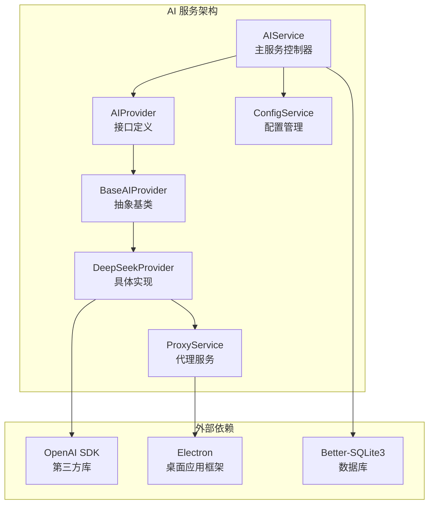
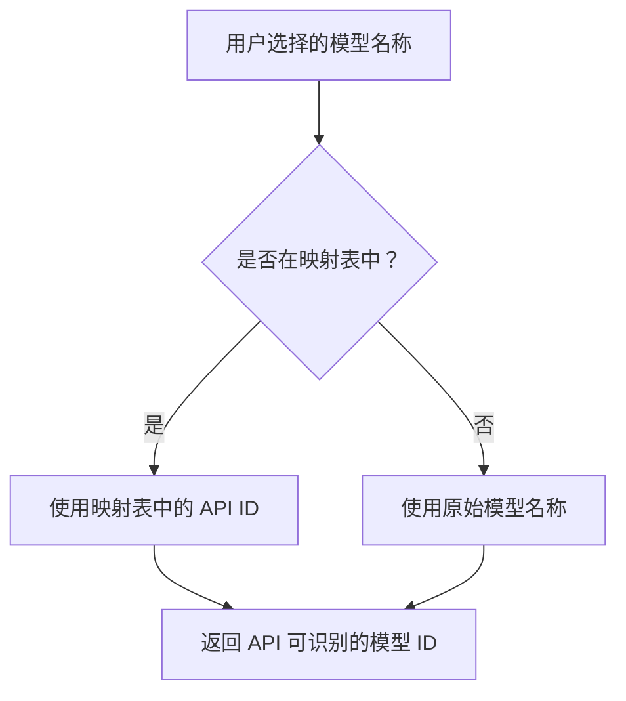
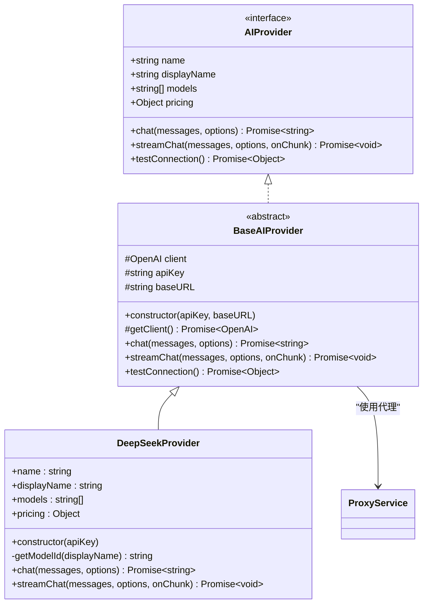
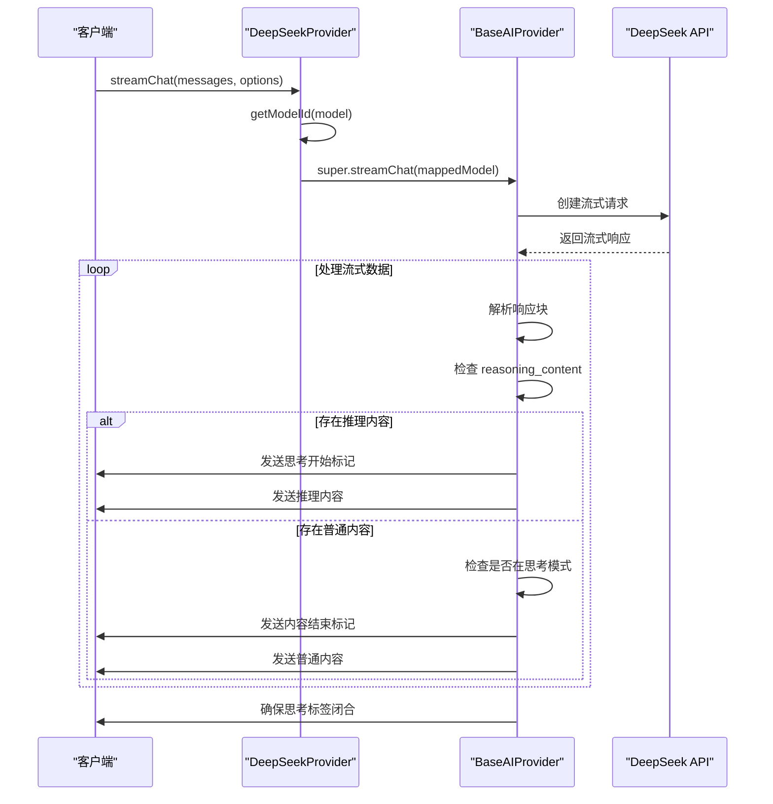
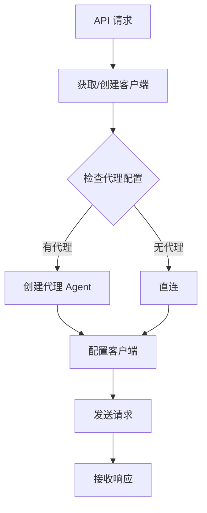
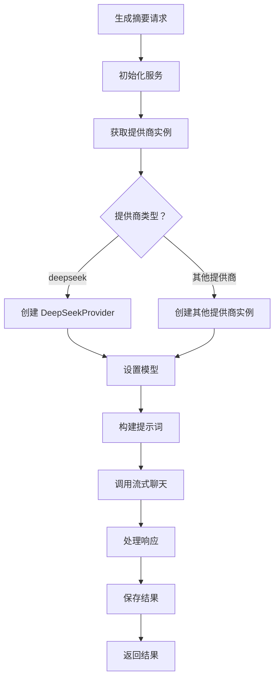
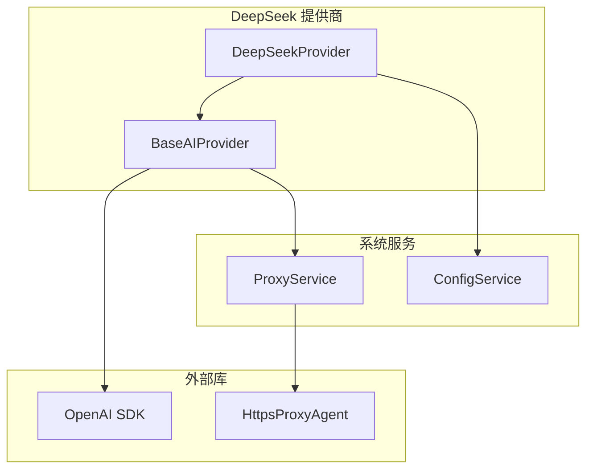

# DeepSeek 提供商

<cite>
**本文档引用的文件**
- [deepseek.ts](file://electron/services/ai/providers/deepseek.ts)
- [base.ts](file://electron/services/ai/providers/base.ts)
- [aiService.ts](file://electron/services/ai/aiService.ts)
- [proxyService.ts](file://electron/services/ai/proxyService.ts)
- [config.ts](file://electron/services/config.ts)
- [ai.ts](file://src/types/ai.ts)
- [README.md](file://README.md)
</cite>

## 目录
1. [简介](#简介)
2. [项目结构](#项目结构)
3. [核心组件](#核心组件)
4. [架构概览](#架构概览)
5. [详细组件分析](#详细组件分析)
6. [依赖关系分析](#依赖关系分析)
7. [性能考虑](#性能考虑)
8. [故障排除指南](#故障排除指南)
9. [结论](#结论)

## 简介

DeepSeek 是 CipherTalk 项目中集成的一个 AI 提供商，专注于提供高性价比的推理能力。该项目是一个现代化的微信聊天记录查看与分析工具，支持多家 AI 服务商，包括 DeepSeek、智谱、通义千问、Google Gemini 等。

DeepSeek 提供商的主要特点包括：
- **高性价比**：提供最便宜的选择，性价比极高
- **推理能力**：支持 DeepSeek V3 和 DeepSeek R1 (推理) 两种模型
- **流式响应**：支持实时流式响应处理
- **思考模式**：内置推理过程显示功能
- **代理支持**：自动检测和使用系统代理

## 项目结构

CipherTalk 项目采用模块化架构设计，AI 服务相关的核心文件分布如下：

**图表来源**
- [aiService.ts:58-163](file://electron/services/ai/aiService.ts#L58-L163)
- [base.ts:49-241](file://electron/services/ai/providers/base.ts#L49-L241)
- [deepseek.ts:29-61](file://electron/services/ai/providers/deepseek.ts#L29-L61)

**章节来源**
- [aiService.ts:1-631](file://electron/services/ai/aiService.ts#L1-L631)
- [deepseek.ts:1-62](file://electron/services/ai/providers/deepseek.ts#L1-L62)

## 核心组件

### DeepSeekMetadata - 提供商元数据

DeepSeek 提供商的元数据定义了基本的提供商信息和定价策略：

| 属性 | 值 | 描述 |
|------|-----|------|
| id | 'deepseek' | 提供商唯一标识符 |
| name | 'deepseek' | 内部名称 |
| displayName | 'DeepSeek' | 显示名称 |
| description | '最便宜的选择，性价比极高' | 功能描述 |
| models | ['DeepSeek V3', 'DeepSeek R1 (推理)'] | 支持的模型列表 |
| pricing | '¥0.001/1K tokens' | 总体定价信息 |
| pricingDetail.input | 0.001 | 输入价格（元/1K tokens） |
| pricingDetail.output | 0.002 | 输出价格（元/1K tokens） |
| website | 'https://www.deepseek.com/' | 官方网站 |
| logo | './AI-logo/deepseek-color.svg' | Logo 文件路径 |

### 模型映射机制

DeepSeek 提供商实现了模型 ID 映射机制，将人类可读的模型名称转换为 API 可识别的模型 ID：

**图表来源**
- [deepseek.ts:21-24](file://electron/services/ai/providers/deepseek.ts#L21-L24)

**章节来源**
- [deepseek.ts:6-19](file://electron/services/ai/providers/deepseek.ts#L6-L19)
- [deepseek.ts:21-24](file://electron/services/ai/providers/deepseek.ts#L21-L24)

## 架构概览

DeepSeek 提供商的架构设计遵循了面向对象的设计原则，通过继承和多态实现了统一的接口：

**图表来源**
- [base.ts:7-34](file://electron/services/ai/providers/base.ts#L7-L34)
- [base.ts:49-241](file://electron/services/ai/providers/base.ts#L49-L241)
- [deepseek.ts:29-61](file://electron/services/ai/providers/deepseek.ts#L29-L61)

## 详细组件分析

### DeepSeekProvider 类实现

DeepSeekProvider 类继承自 BaseAIProvider，实现了 DeepSeek 特定的功能：

#### 关键特性

1. **模型映射**：将用户友好的模型名称映射到 API 可识别的模型 ID
2. **流式响应**：支持实时流式响应处理
3. **思考模式**：内置推理过程显示功能
4. **代理支持**：自动检测和使用系统代理

#### 模型映射表

| 用户模型名称 | API 模型 ID |
|-------------|------------|
| DeepSeek V3 | deepseek-chat |
| DeepSeek R1 (推理) | deepseek-reasoner |

#### 流式响应处理

DeepSeekProvider 在流式响应处理中实现了独特的思考模式标记机制：

**图表来源**
- [deepseek.ts:57-60](file://electron/services/ai/providers/deepseek.ts#L57-L60)
- [base.ts:106-175](file://electron/services/ai/providers/base.ts#L106-L175)

**章节来源**
- [deepseek.ts:29-61](file://electron/services/ai/providers/deepseek.ts#L29-L61)

### BaseAIProvider 基础功能

BaseAIProvider 提供了所有 AI 提供商共享的基础功能：

#### 代理服务集成

**图表来源**
- [base.ts:71-90](file://electron/services/ai/providers/base.ts#L71-L90)

#### 连接测试机制

BaseAIProvider 实现了完善的连接测试功能，能够自动检测网络状态并提供详细的错误信息：

| 错误类型 | 检测条件 | 用户提示 |
|---------|---------|---------|
| 连接超时 | CONNECTION_TIMEOUT | "连接超时，请开启代理或检查网络" |
| 连接被拒绝 | ECONNREFUSED | "连接被拒绝，请开启代理或检查网络" |
| 域名解析失败 | ENOTFOUND/getaddrinfo | "无法解析域名，请开启代理或检查网络" |
| API Key 无效 | 401/Unauthorized | "API Key 无效，请检查配置" |
| 访问被禁止 | 403/Forbidden | "访问被禁止，请检查 API Key 权限" |
| 请求过于频繁 | 429 | "请求过于频繁，请稍后再试" |
| 服务器错误 | 500/502/503 | "服务器错误，请稍后再试" |

**章节来源**
- [base.ts:177-239](file://electron/services/ai/providers/base.ts#L177-L239)

### AIService 集成层

AIService 作为主服务控制器，负责协调各个 AI 提供商的使用：

#### 提供商选择逻辑

**图表来源**
- [aiService.ts:109-163](file://electron/services/ai/aiService.ts#L109-L163)
- [aiService.ts:439-539](file://electron/services/ai/aiService.ts#L439-L539)

**章节来源**
- [aiService.ts:109-163](file://electron/services/ai/aiService.ts#L109-L163)
- [aiService.ts:439-539](file://electron/services/ai/aiService.ts#L439-L539)

## 依赖关系分析

### 外部依赖

DeepSeek 提供商的依赖关系相对简单，主要依赖于 OpenAI SDK：

**图表来源**
- [deepseek.ts:1](file://electron/services/ai/providers/deepseek.ts#L1)
- [base.ts:1](file://electron/services/ai/providers/base.ts#L1)
- [proxyService.ts:16-99](file://electron/services/ai/proxyService.ts#L16-L99)

### 内部耦合关系

DeepSeek 提供商与其他组件的耦合关系主要体现在以下几个方面：

1. **配置管理耦合**：通过 ConfigService 获取 API Key 和模型配置
2. **代理服务耦合**：通过 ProxyService 处理网络代理
3. **类型定义耦合**：遵循 AIProvider 接口规范

**章节来源**
- [deepseek.ts:35-37](file://electron/services/ai/providers/deepseek.ts#L35-L37)
- [base.ts:55-66](file://electron/services/ai/providers/base.ts#L55-L66)

## 性能考虑

### 流式响应优化

DeepSeek 提供商在流式响应处理中实现了多项性能优化：

1. **异步流处理**：使用 for-await-of 循环处理流式数据块
2. **内存管理**：及时释放不再使用的响应块
3. **错误恢复**：在网络中断时能够优雅地恢复连接

### 代理性能优化

ProxyService 实现了代理配置的缓存机制：

- **缓存时长**：60 秒的代理配置缓存
- **自动刷新**：超过缓存时间后自动重新检测代理
- **错误处理**：代理获取失败时自动降级为直连

### 连接池管理

BaseAIProvider 实现了延迟客户端创建机制：

- **按需创建**：只有在实际请求时才创建 OpenAI 客户端
- **代理感知**：每次请求时重新创建客户端以获取最新代理配置
- **超时控制**：60 秒的请求超时设置

## 故障排除指南

### 常见问题诊断

#### 连接问题

| 问题症状 | 可能原因 | 解决方案 |
|---------|---------|---------|
| 连接超时 | 网络不稳定 | 检查网络连接，开启代理 |
| 域名解析失败 | DNS 问题 | 更换 DNS 服务器，检查防火墙 |
| API Key 无效 | 密钥错误或过期 | 重新申请有效 API Key |
| 访问被禁止 | 权限不足 | 检查 API Key 权限设置 |

#### 流式响应问题

| 问题症状 | 可能原因 | 解决方案 |
|---------|---------|---------|
| 响应中断 | 网络波动 | 检查网络稳定性，启用代理 |
| 思考模式异常 | 模型不支持 | 检查模型配置，使用支持推理的模型 |
| 内存泄漏 | 流式处理不当 | 检查流式处理逻辑，及时清理资源 |

#### 性能问题

| 问题症状 | 可能原因 | 解决方案 |
|---------|---------|---------|
| 响应缓慢 | 代理延迟 | 优化代理配置，选择更近的代理节点 |
| 内存占用高 | 大量并发请求 | 限制并发数量，优化缓存策略 |
| CPU 使用率高 | 大量文本处理 | 优化文本处理算法，减少不必要的计算 |

**章节来源**
- [base.ts:193-239](file://electron/services/ai/providers/base.ts#L193-L239)
- [proxyService.ts:115-146](file://electron/services/ai/proxyService.ts#L115-L146)

### 调试技巧

1. **启用详细日志**：通过控制台输出查看详细的请求和响应信息
2. **监控网络状态**：使用浏览器开发者工具监控网络请求
3. **检查代理配置**：验证代理服务是否正确配置和运行
4. **测试连接状态**：使用连接测试功能验证网络连通性

## 结论

DeepSeek 提供商在 CipherTalk 项目中展现了优秀的架构设计和实现质量。通过合理的抽象层次、完善的错误处理机制和高效的性能优化，成功地为用户提供了一个稳定可靠的 AI 推理服务。

### 主要优势

1. **架构清晰**：基于接口和抽象类的设计使得扩展新的 AI 提供商变得简单
2. **功能完整**：支持流式响应、思考模式、代理服务等核心功能
3. **易于维护**：模块化的设计便于单独测试和维护各个组件
4. **性能优化**：实现了多项性能优化措施，确保良好的用户体验

### 改进建议

1. **配置管理**：可以考虑将模型映射配置化，便于动态调整
2. **错误处理**：可以增加更多的错误恢复机制
3. **监控指标**：可以添加更多的性能监控指标
4. **文档完善**：可以增加更多的使用示例和最佳实践

DeepSeek 提供商的成功实现为其他 AI 提供商的集成提供了良好的参考模板，体现了现代桌面应用开发的最佳实践。