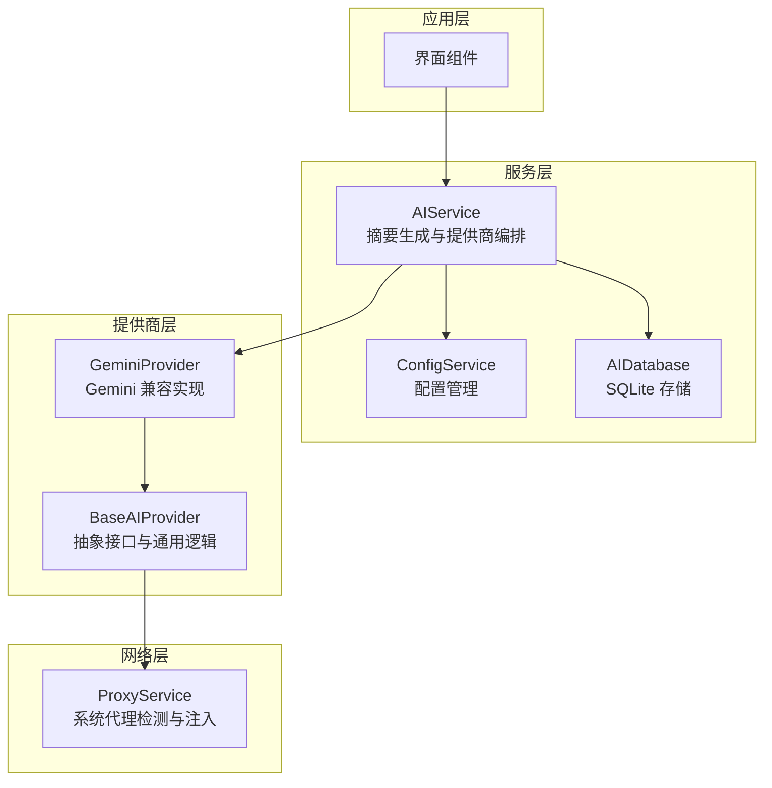
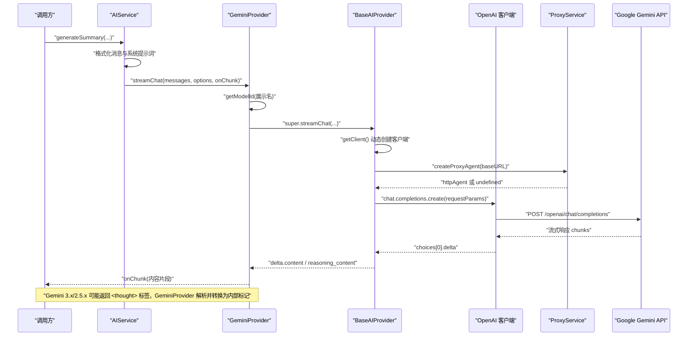

# Google Gemini 提供商

<cite>
**本文档引用的文件**
- [gemini.ts](file://electron/services/ai/providers/gemini.ts)
- [base.ts](file://electron/services/ai/providers/base.ts)
- [aiService.ts](file://electron/services/ai/aiService.ts)
- [proxyService.ts](file://electron/services/ai/proxyService.ts)
- [aiDatabase.ts](file://electron/services/ai/aiDatabase.ts)
- [config.ts](file://electron/services/config.ts)
</cite>

## 目录
1. [简介](#简介)
2. [项目结构](#项目结构)
3. [核心组件](#核心组件)
4. [架构总览](#架构总览)
5. [详细组件分析](#详细组件分析)
6. [依赖关系分析](#依赖关系分析)
7. [性能考虑](#性能考虑)
8. [故障排除指南](#故障排除指南)
9. [结论](#结论)
10. [附录](#附录)

## 简介
本文件面向集成 Google AI Studio API 的开发者，系统性阐述 CipherTalk 中 Google Gemini 提供商的实现细节，包括认证方式、模型选择、特殊参数配置、思考模式（reasoning_content）与 XML 思考标签的处理、流式响应处理、请求格式转换、与 OpenAI 标准的兼容性策略，以及配置示例、使用指南与故障排除方法。目标是帮助读者快速理解并正确使用 Gemini 提供商模块。

## 项目结构
Gemini 提供商位于 Electron 主进程的服务层，采用“提供商抽象 + 具体实现”的分层设计：
- 抽象层：提供统一的 AIProvider 接口与 BaseAIProvider 基类，封装通用能力（如代理、连接测试、流式处理兼容逻辑）。
- 具体实现：GeminiProvider 继承自 BaseAIProvider，针对 Google Gemini API 的特性进行适配（模型 ID 映射、思考模式参数、XML 思考标签处理）。
- 服务编排：AIService 负责提供商选择、消息格式化、流式生成与数据库持久化。
- 网络代理：ProxyService 解决主进程直连问题，自动跟随系统代理。
- 配置中心：ConfigService 管理全局配置，包括当前提供商、API Key、默认模型等。
- 数据存储：AIDatabase 提供 SQLite 存储摘要、使用统计与缓存。

图表来源
- [aiService.ts:58-163](file://electron/services/ai/aiService.ts#L58-L163)
- [base.ts:49-90](file://electron/services/ai/providers/base.ts#L49-L90)
- [gemini.ts:46-55](file://electron/services/ai/providers/gemini.ts#L46-L55)
- [proxyService.ts:16-99](file://electron/services/ai/proxyService.ts#L16-L99)

章节来源
- [aiService.ts:58-163](file://electron/services/ai/aiService.ts#L58-L163)
- [base.ts:49-90](file://electron/services/ai/providers/base.ts#L49-L90)
- [gemini.ts:46-55](file://electron/services/ai/providers/gemini.ts#L46-L55)
- [proxyService.ts:16-99](file://electron/services/ai/proxyService.ts#L16-L99)

## 核心组件
- GeminiProvider：继承 BaseAIProvider，负责：
  - 模型 ID 映射（将展示名映射为 Google 实际模型 ID）。
  - 流式聊天适配（根据模型版本选择思考模式参数，处理 XML 思考标签）。
  - 非流式聊天委托给父类。
- BaseAIProvider：提供统一接口与通用能力：
  - OpenAI 客户端按需创建（支持代理注入）。
  - 流式处理兼容逻辑（尝试多种思考模式参数，自动处理 reasoning_content）。
  - 连接测试与错误分类。
- AIService：编排层，负责：
  - 选择提供商（含 Gemini）。
  - 格式化消息与系统提示词。
  - 调用提供商的流式接口并实时回调。
  - 估算 tokens 与成本，持久化摘要与使用统计。
- ProxyService：主进程网络代理解决方案。
- ConfigService：全局配置（含当前提供商、API Key、默认模型等）。
- AIDatabase：SQLite 存储摘要、使用统计与缓存。

章节来源
- [gemini.ts:46-192](file://electron/services/ai/providers/gemini.ts#L46-L192)
- [base.ts:49-241](file://electron/services/ai/providers/base.ts#L49-L241)
- [aiService.ts:58-631](file://electron/services/ai/aiService.ts#L58-L631)
- [proxyService.ts:16-151](file://electron/services/ai/proxyService.ts#L16-L151)
- [config.ts:62-124](file://electron/services/config.ts#L62-L124)
- [aiDatabase.ts:8-347](file://electron/services/ai/aiDatabase.ts#L8-L347)

## 架构总览
Gemini 提供商通过 OpenAI 兼容的端点与参数格式对接 Google AI Studio API。其关键特性包括：
- 认证：通过构造函数接收 API Key，BaseAIProvider 在每次请求时创建 OpenAI 客户端并注入代理。
- 模型选择：提供展示名列表，内部映射为 Google 实际模型 ID；GeminiProvider 在 chat/streamChat 中使用映射后的模型 ID。
- 思考模式：
  - 通用层：BaseAIProvider 尝试多种参数（reasoning_effort、thinking 对象）以兼容不同提供商。
  - Gemini 层：根据模型版本选择 Google 特有的 thinking_config（含 include_thoughts）或 reasoning_effort。
  - XML 思考标签：Gemini 3.x/2.5.x 返回 <thought>...</thought>，GeminiProvider 自行解析并转换为内部标记。
- 流式响应：统一的流式处理回调 onChunk，GeminiProvider 在必要时进行缓冲与标签处理。
- 兼容性：通过 extra_body 传递 Google 特定参数，同时保留 OpenAI 兼容字段，避免类型检查错误。

图表来源
- [aiService.ts:439-539](file://electron/services/ai/aiService.ts#L439-L539)
- [gemini.ts:72-190](file://electron/services/ai/providers/gemini.ts#L72-L190)
- [base.ts:106-175](file://electron/services/ai/providers/base.ts#L106-L175)
- [proxyService.ts:83-99](file://electron/services/ai/proxyService.ts#L83-L99)

## 详细组件分析

### GeminiProvider 组件分析
- 模型元数据与映射
  - 展示名列表与价格信息由元数据导出，便于 UI 展示与定价计算。
  - MODEL_MAPPING 将展示名映射为 Google 实际模型 ID，确保请求使用正确的模型标识。
- chat 方法
  - 通过 getModelId 获取真实模型 ID，然后调用父类 chat，实现非流式对话。
- streamChat 方法（核心）
  - 参数构建：model、messages、temperature、stream=true，以及可选的 max_tokens。
  - 思考模式控制：
    - Gemini 3.x：使用 thinking_config.thinking_level（low/minimal）与 include_thoughts。
    - Gemini 2.5.x：使用 thinking_config.thinking_budget（数值）与 include_thoughts。
    - 其他模型：使用 reasoning_effort（medium/none）。
  - XML 思考标签处理：
    - 缓冲区累积内容，检测 <thought> 开始标签与 </thought> 结束标签。
    - 在标签边界处发出内部标记（如 “