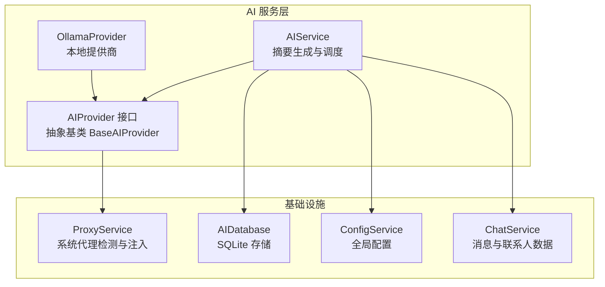
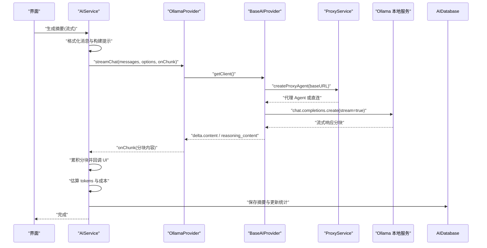
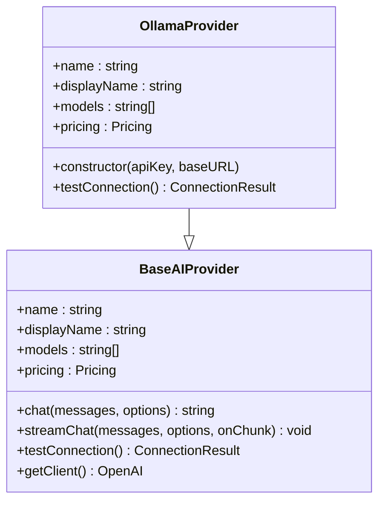
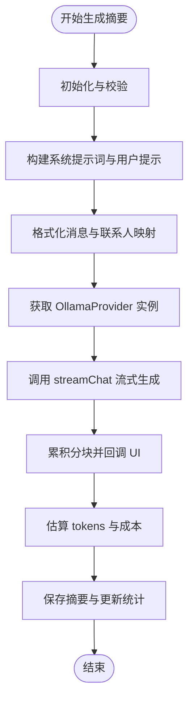
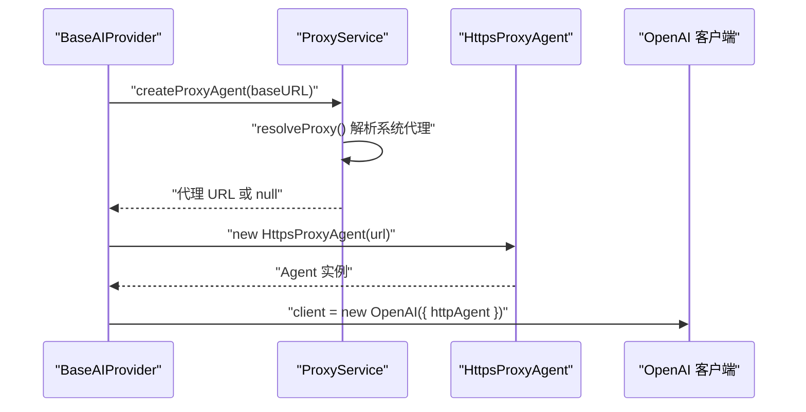
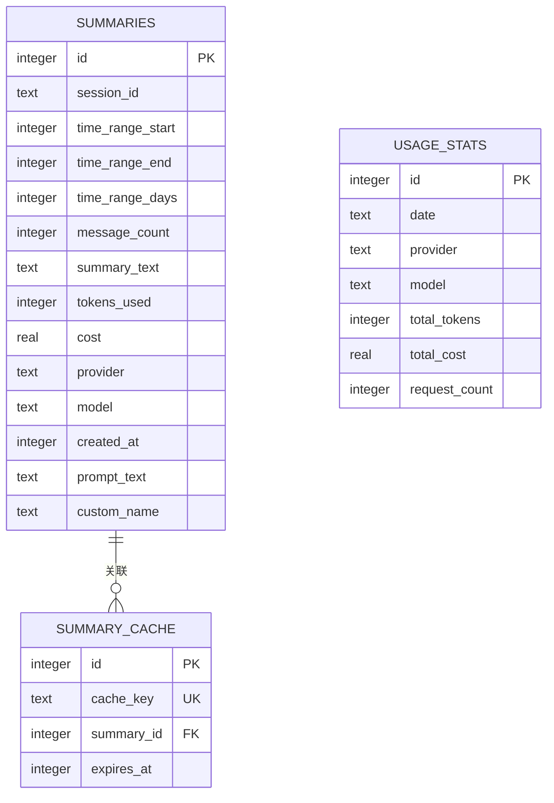
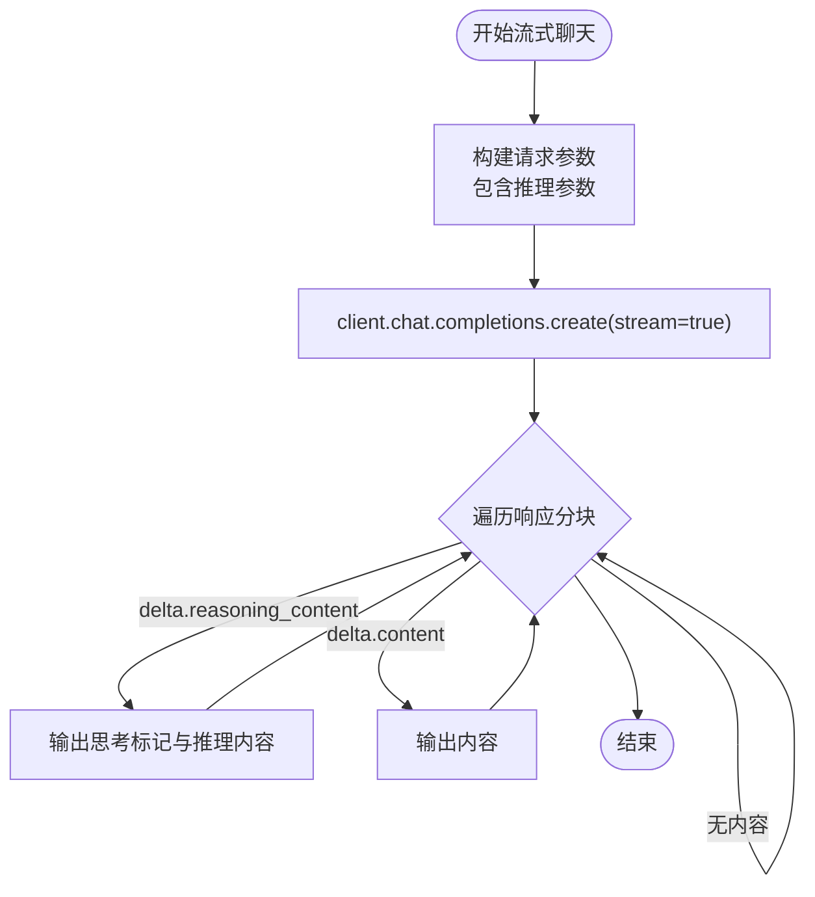
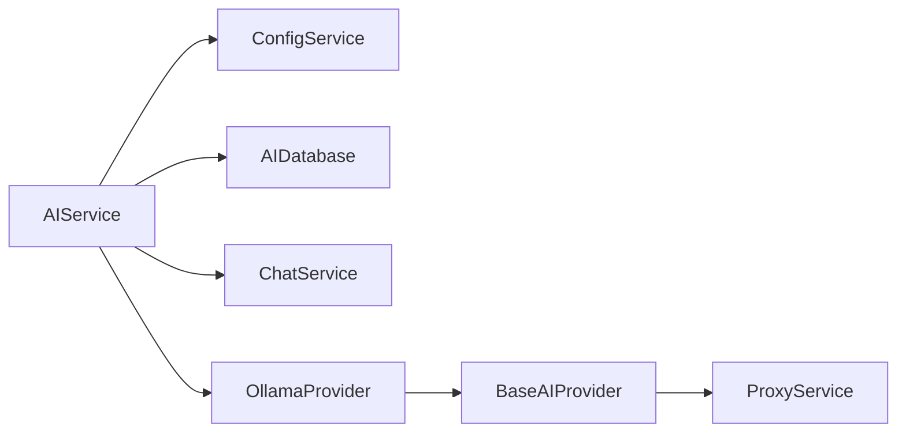

# Ollama 本地服务提供商

<cite>
**本文档引用的文件**
- [electron/services/ai/providers/ollama.ts](file://electron/services/ai/providers/ollama.ts)
- [electron/services/ai/providers/base.ts](file://electron/services/ai/providers/base.ts)
- [electron/services/ai/aiService.ts](file://electron/services/ai/aiService.ts)
- [electron/services/ai/proxyService.ts](file://electron/services/ai/proxyService.ts)
- [electron/services/ai/aiDatabase.ts](file://electron/services/ai/aiDatabase.ts)
- [electron/services/ai/Ollama使用指南.md](file://electron/services/ai/Ollama使用指南.md)
- [electron/services/config.ts](file://electron/services/config.ts)
- [electron/services/chatService.ts](file://electron/services/chatService.ts)
</cite>

## 目录
1. [简介](#简介)
2. [项目结构](#项目结构)
3. [核心组件](#核心组件)
4. [架构总览](#架构总览)
5. [详细组件分析](#详细组件分析)
6. [依赖关系分析](#依赖关系分析)
7. [性能考虑](#性能考虑)
8. [故障排除指南](#故障排除指南)
9. [结论](#结论)
10. [附录](#附录)

## 简介
本文件面向希望在 CipherTalk 应用中集成 Ollama 本地 AI 模型服务的开发者与运维人员。文档深入解析 Ollama 作为本地提供商的集成实现，覆盖本地服务发现、模型加载、推理执行、流式响应处理、思考模式支持、错误处理机制、性能优化策略、安装配置指南、模型选择建议与使用场景分析等内容。同时对比 Ollama 与远程 API 的差异，帮助读者在本地部署与云端 API 之间做出合理选择。

## 项目结构
CipherTalk 的 AI 服务采用模块化设计，Ollama 作为其中一种提供商，遵循统一的 AIProvider 接口与抽象基类，通过 OpenAI 兼容接口与本地 Ollama 服务通信。整体结构如下图所示：

图表来源
- [electron/services/ai/aiService.ts:58-163](file://electron/services/ai/aiService.ts#L58-L163)
- [electron/services/ai/providers/base.ts:49-90](file://electron/services/ai/providers/base.ts#L49-L90)
- [electron/services/ai/providers/ollama.ts:33-43](file://electron/services/ai/providers/ollama.ts#L33-L43)
- [electron/services/ai/proxyService.ts:16-99](file://electron/services/ai/proxyService.ts#L16-L99)
- [electron/services/ai/aiDatabase.ts:8-30](file://electron/services/ai/aiDatabase.ts#L8-L30)

章节来源
- [electron/services/ai/aiService.ts:1-631](file://electron/services/ai/aiService.ts#L1-L631)
- [electron/services/ai/providers/base.ts:1-241](file://electron/services/ai/providers/base.ts#L1-L241)
- [electron/services/ai/providers/ollama.ts:1-97](file://electron/services/ai/providers/ollama.ts#L1-L97)
- [electron/services/ai/proxyService.ts:1-151](file://electron/services/ai/proxyService.ts#L1-L151)
- [electron/services/ai/aiDatabase.ts:1-347](file://electron/services/ai/aiDatabase.ts#L1-L347)

## 核心组件
- OllamaProvider：继承自 BaseAIProvider，封装本地 Ollama 服务的连接测试、流式与非流式聊天、模型列表与定价信息。
- BaseAIProvider：定义 AIProvider 接口与抽象基类，统一实现 OpenAI 兼容客户端的创建、代理注入、流式/非流式聊天、连接测试。
- AIService：AI 服务主控制器，负责提供商选择、消息格式化、系统提示词构建、流式摘要生成、数据库持久化与使用统计。
- ProxyService：系统代理检测与注入，解决 Electron 主进程直连网络问题，确保本地/远程提供商均能正确通过代理访问。
- AIDatabase：SQLite 数据库存储，负责摘要记录、使用统计、缓存键管理与历史查询。
- ConfigService：全局配置管理，包含 AI 提供商配置、默认时间范围、摘要详细度、系统提示词预设、是否启用思考模式等。
- ChatService：消息与联系人数据源，为 AIService 提供格式化输入。

章节来源
- [electron/services/ai/providers/ollama.ts:33-96](file://electron/services/ai/providers/ollama.ts#L33-L96)
- [electron/services/ai/providers/base.ts:7-34](file://electron/services/ai/providers/base.ts#L7-L34)
- [electron/services/ai/aiService.ts:58-163](file://electron/services/ai/aiService.ts#L58-L163)
- [electron/services/ai/proxyService.ts:16-99](file://electron/services/ai/proxyService.ts#L16-L99)
- [electron/services/ai/aiDatabase.ts:8-30](file://electron/services/ai/aiDatabase.ts#L8-L30)
- [electron/services/config.ts:65-80](file://electron/services/config.ts#L65-L80)
- [electron/services/chatService.ts:32-71](file://electron/services/chatService.ts#L32-L71)

## 架构总览
Ollama 本地提供商通过 OpenAI 兼容接口与本地服务通信，AIService 负责将微信聊天记录格式化为系统提示词与用户提示，调用 OllamaProvider 的流式聊天接口，实时输出分块内容。ProxyService 在主进程侧注入系统代理，保证网络可达性；AIDatabase 负责摘要持久化与使用统计。

图表来源
- [electron/services/ai/aiService.ts:439-539](file://electron/services/ai/aiService.ts#L439-L539)
- [electron/services/ai/providers/base.ts:106-175](file://electron/services/ai/providers/base.ts#L106-L175)
- [electron/services/ai/providers/ollama.ts:39-43](file://electron/services/ai/providers/ollama.ts#L39-L43)
- [electron/services/ai/proxyService.ts:83-99](file://electron/services/ai/proxyService.ts#L83-L99)

## 详细组件分析

### OllamaProvider 组件分析
- 继承关系：OllamaProvider 继承 BaseAIProvider，复用 OpenAI 兼容客户端与代理注入能力。
- 元数据：包含提供商标识、显示名称、描述、默认模型列表、定价信息与网站链接。
- 连接测试：通过竞速 Promise 调用 models.list() 并设置超时，捕获常见网络错误并返回人类可读的错误提示；Ollama 为本地服务，不需要代理。
- 流式聊天：沿用 BaseAIProvider 的流式实现，支持思考模式参数的自动适配与推理内容分块输出。

图表来源
- [electron/services/ai/providers/base.ts:49-90](file://electron/services/ai/providers/base.ts#L49-L90)
- [electron/services/ai/providers/ollama.ts:33-43](file://electron/services/ai/providers/ollama.ts#L33-L43)

章节来源
- [electron/services/ai/providers/ollama.ts:33-96](file://electron/services/ai/providers/ollama.ts#L33-L96)

### AIService 组件分析
- 提供商选择：根据配置或显式参数选择 OllamaProvider，支持自定义 baseURL；Ollama 本地服务无需 API Key。
- 消息格式化：将微信消息转换为结构化文本，处理聊天记录、语音转写、媒体类型等，过滤无效内容。
- 系统提示词：内置多风格提示词模板，支持自定义系统提示词与详细度级别。
- 流式摘要生成：调用 provider.streamChat，逐块输出内容，同时估算 tokens 与成本，持久化到数据库并更新使用统计。

图表来源
- [electron/services/ai/aiService.ts:439-539](file://electron/services/ai/aiService.ts#L439-L539)

章节来源
- [electron/services/ai/aiService.ts:58-163](file://electron/services/ai/aiService.ts#L58-L163)
- [electron/services/ai/aiService.ts:439-539](file://electron/services/ai/aiService.ts#L439-L539)

### ProxyService 组件分析
- 系统代理检测：通过 Electron session.resolveProxy 获取系统代理配置，解析 DIRECT、PROXY、HTTPS、SOCKS5 等规则，构建代理 URL。
- 代理 Agent 注入：创建 HttpsProxyAgent，注入到 OpenAI 客户端的 httpAgent，确保主进程请求走系统代理。
- 缓存与测试：代理 URL 缓存 1 分钟，提供代理连通性测试方法，便于诊断网络问题。

图表来源
- [electron/services/ai/providers/base.ts:71-90](file://electron/services/ai/providers/base.ts#L71-L90)
- [electron/services/ai/proxyService.ts:26-99](file://electron/services/ai/proxyService.ts#L26-L99)

章节来源
- [electron/services/ai/proxyService.ts:16-151](file://electron/services/ai/proxyService.ts#L16-L151)

### AIDatabase 组件分析
- 表结构：包含摘要记录表、使用统计表、缓存表，建立必要索引以提升查询性能。
- 摘要持久化：插入摘要记录，包含会话 ID、时间范围、消息数量、文本、tokens、成本、提供商与模型等字段。
- 使用统计：按日期聚合提供商与模型的 tokens、成本与请求次数。
- 历史查询与缓存：支持按会话查询历史摘要，缓存键管理与过期清理。

图表来源
- [electron/services/ai/aiDatabase.ts:38-102](file://electron/services/ai/aiDatabase.ts#L38-L102)

章节来源
- [electron/services/ai/aiDatabase.ts:8-347](file://electron/services/ai/aiDatabase.ts#L8-L347)

### 思考模式支持与流式响应处理
- 思考模式参数：BaseAIProvider 在流式请求中自动尝试多种推理参数（reasoning_effort、thinking），以适配不同模型的思考输出。
- 推理内容分块：当模型返回 reasoning_content 时，先输出“开始思考”标记，再输出推理内容，随后输出“结束思考”标记，确保 UI 正确渲染。
- 非流式兼容：非流式聊天同样支持推理参数，但不涉及分块输出。

图表来源
- [electron/services/ai/providers/base.ts:123-175](file://electron/services/ai/providers/base.ts#L123-L175)

章节来源
- [electron/services/ai/providers/base.ts:106-175](file://electron/services/ai/providers/base.ts#L106-L175)

## 依赖关系分析
- AIService 依赖 ConfigService、AIDatabase、ChatService 与各提供商（包括 OllamaProvider）。
- BaseAIProvider 依赖 ProxyService 以支持代理环境下的网络访问。
- OllamaProvider 依赖 BaseAIProvider 的通用能力，仅重写连接测试逻辑以适配本地服务特性。
- ProxyService 与 Electron 的 session API 紧密耦合，用于系统代理检测。

图表来源
- [electron/services/ai/aiService.ts:1-16](file://electron/services/ai/aiService.ts#L1-L16)
- [electron/services/ai/providers/base.ts:1-2](file://electron/services/ai/providers/base.ts#L1-L2)
- [electron/services/ai/providers/ollama.ts:1-1](file://electron/services/ai/providers/ollama.ts#L1-L1)

章节来源
- [electron/services/ai/aiService.ts:1-16](file://electron/services/ai/aiService.ts#L1-L16)
- [electron/services/ai/providers/base.ts:1-2](file://electron/services/ai/providers/base.ts#L1-L2)
- [electron/services/ai/providers/ollama.ts:1-1](file://electron/services/ai/providers/ollama.ts#L1-L1)

## 性能考虑
- 本地资源占用：Ollama 本地运行依赖 CPU/GPU 与内存，推荐至少 8GB 内存与 NVIDIA 显卡（可选但强烈推荐）以获得更快的推理速度。
- 模型选择：根据硬件能力选择合适模型，如 Qwen2.5、DeepSeek R1、Llama 3.3、Gemma 2 等，优先选择开源模型库中的高性能模型。
- 网络与代理：本地服务无需代理，但若需通过代理访问远程服务，ProxyService 可自动注入系统代理，减少连接失败。
- 缓存与统计：AIDatabase 提供摘要缓存与使用统计，有助于减少重复计算与监控成本。
- 超时与重试：BaseAIProvider 与 OllamaProvider 均设置了合理的超时时间，避免长时间阻塞；建议在 UI 层提供取消与重试机制。

[本节为通用性能指导，不直接分析具体文件]

## 故障排除指南
- Ollama 服务未启动：提示“Ollama 服务未启动”，请先运行服务命令并确认端口 11434 可访问。
- 连接超时：检查本地服务状态、防火墙与端口配置；若使用自定义端口，确保在应用中正确配置 baseURL。
- 域名解析失败：若通过代理访问远程服务，确认代理可用性与 DNS 解析。
- 401/403/429/5xx：这些错误通常来自远程 API，与本地 Ollama 无关；本地 Ollama 不需要 API Key。
- 代理问题：在主进程直连环境下，ProxyService 可自动注入系统代理；若代理不可用，改为直连或修复代理配置。

章节来源
- [electron/services/ai/providers/ollama.ts:65-95](file://electron/services/ai/providers/ollama.ts#L65-L95)
- [electron/services/ai/providers/base.ts:177-239](file://electron/services/ai/providers/base.ts#L177-L239)
- [electron/services/ai/proxyService.ts:115-146](file://electron/services/ai/proxyService.ts#L115-L146)

## 结论
Ollama 本地提供商通过统一的 AIProvider 接口与 OpenAI 兼容接口，无缝融入 CipherTalk 的 AI 服务生态。其优势在于完全免费、数据隐私与离线可用，劣势在于本地资源占用与相对较慢的生成速度。结合 ProxyService 的代理注入、AIDatabase 的持久化与统计、以及 AIService 的流式处理与思考模式支持，Ollama 成为满足隐私与离线需求的理想选择。建议在具备良好硬件配置的前提下，优先选择开源模型库中的高性能模型，并根据实际使用场景调整摘要详细度与系统提示词预设。

[本节为总结性内容，不直接分析具体文件]

## 附录

### 安装与配置指南
- 安装 Ollama：访问官网下载安装包，安装完成后服务自动运行。
- 验证安装：在命令行执行版本检查命令，确认安装成功。
- 下载模型：根据推荐模型执行下载命令，如 Qwen2.5、DeepSeek R1、Llama 3.3、Gemma 2 等。
- 在应用中配置：在设置页面选择 Ollama 提供商，服务地址默认为本地端口，模型选择已下载的模型或手动输入模型名称；点击“测试连接”验证配置。
- 常见问题：若提示服务未启动，尝试重启服务或运行服务命令；若模型列表为空，可手动输入模型名称；若生成速度慢，考虑升级硬件或启用 GPU 加速；若修改了端口，需在应用中同步修改服务地址。

章节来源
- [electron/services/ai/Ollama使用指南.md:1-120](file://electron/services/ai/Ollama使用指南.md#L1-L120)

### 模型选择建议
- Qwen2.5：通义千问，适合中文场景与综合任务。
- DeepSeek R1：深度求索，适合推理与复杂问答。
- Llama 3.3：Meta 开源模型，通用性强。
- Gemma 2：Google 开源模型，适合多语言与技术文档。

章节来源
- [electron/services/ai/Ollama使用指南.md:26-48](file://electron/services/ai/Ollama使用指南.md#L26-L48)

### 使用场景分析
- 对数据隐私有要求：本地处理，数据不出本地。
- 不想付费使用 API：完全免费，节省成本。
- 有较好硬件配置：可获得更佳的推理速度与体验。
- 需要离线使用：无需网络连接即可生成摘要。

章节来源
- [electron/services/ai/Ollama使用指南.md:95-114](file://electron/services/ai/Ollama使用指南.md#L95-L114)