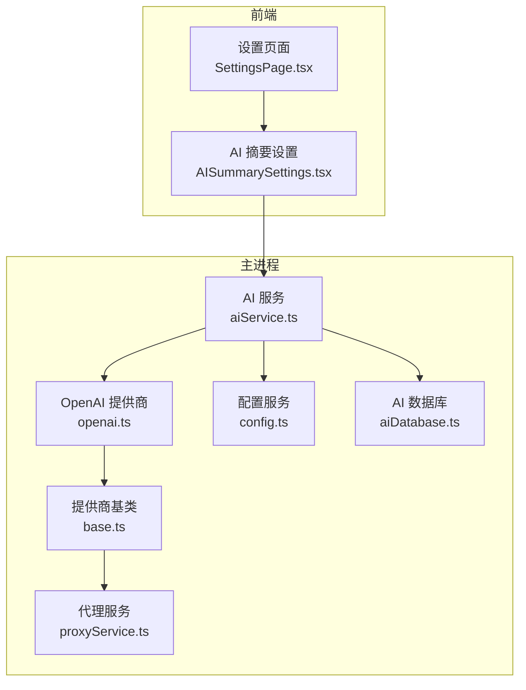
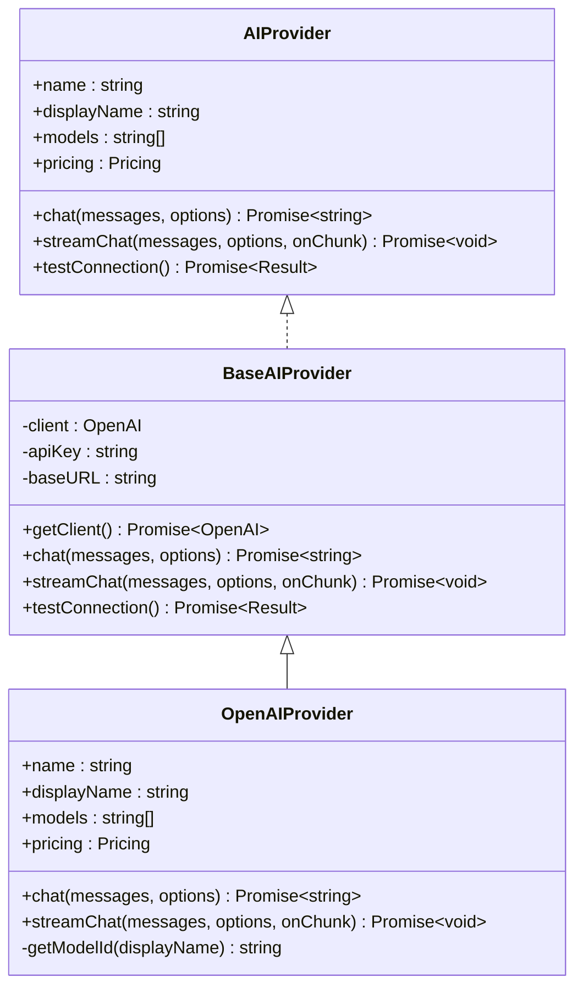
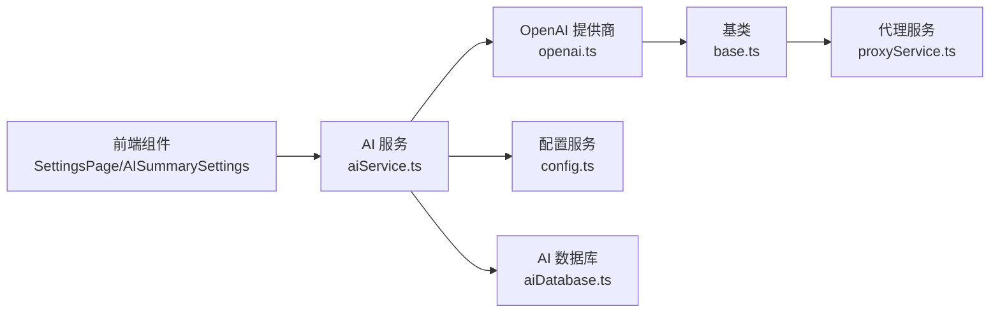

# OpenAI 提供商

<cite>
**本文档引用的文件**
- [openai.ts](file://electron/services/ai/providers/openai.ts)
- [base.ts](file://electron/services/ai/providers/base.ts)
- [aiService.ts](file://electron/services/ai/aiService.ts)
- [proxyService.ts](file://electron/services/ai/proxyService.ts)
- [config.ts](file://electron/services/config.ts)
- [aiDatabase.ts](file://electron/services/ai/aiDatabase.ts)
- [ai.ts](file://src/types/ai.ts)
- [SettingsPage.tsx](file://src/pages/SettingsPage.tsx)
- [AISummarySettings.tsx](file://src/components/ai/AISummarySettings.tsx)
</cite>

## 目录
1. [简介](#简介)
2. [项目结构](#项目结构)
3. [核心组件](#核心组件)
4. [架构总览](#架构总览)
5. [详细组件分析](#详细组件分析)
6. [依赖关系分析](#依赖关系分析)
7. [性能考虑](#性能考虑)
8. [故障排除指南](#故障排除指南)
9. [结论](#结论)
10. [附录](#附录)

## 简介
本文件面向 CipherTalk 项目中的 OpenAI 提供商集成，系统性阐述其架构设计、认证与密钥管理、模型列表支持、请求参数配置、响应处理与错误处理策略、流式响应实现细节、思考模式支持、配置示例、使用方法与故障排除指南，并提供性能优化建议与最佳实践。

## 项目结构
OpenAI 集成位于 Electron 主进程的 AI 服务层，采用“提供商抽象 + 具体提供商”的分层设计：
- 抽象层：统一 AI 提供商接口与通用能力（认证、请求、流式、连接测试）
- 具体提供商：OpenAI 提供商实现，负责模型名映射与请求转发
- 上层服务：AI 服务聚合多个提供商，负责配置管理、摘要生成、数据库持久化
- 前端组件：设置页面与 AI 摘要设置组件，提供配置入口与连接测试

图表来源
- [aiService.ts:1-631](file://electron/services/ai/aiService.ts#L1-L631)
- [openai.ts:1-77](file://electron/services/ai/providers/openai.ts#L1-L77)
- [base.ts:1-241](file://electron/services/ai/providers/base.ts#L1-L241)
- [proxyService.ts:1-151](file://electron/services/ai/proxyService.ts#L1-L151)
- [config.ts:1-395](file://electron/services/config.ts#L1-L395)
- [aiDatabase.ts:1-347](file://electron/services/ai/aiDatabase.ts#L1-L347)
- [SettingsPage.tsx:1-800](file://src/pages/SettingsPage.tsx#L1-L800)
- [AISummarySettings.tsx:1-800](file://src/components/ai/AISummarySettings.tsx#L1-L800)

章节来源
- [aiService.ts:88-163](file://electron/services/ai/aiService.ts#L88-L163)
- [openai.ts:6-28](file://electron/services/ai/providers/openai.ts#L6-L28)
- [base.ts:49-90](file://electron/services/ai/providers/base.ts#L49-L90)

## 核心组件
- OpenAI 提供商元数据与模型映射：定义提供商标识、显示名、模型列表、定价信息与 Logo；维护显示名到真实模型 ID 的映射表。
- OpenAI 提供商实现：继承基类，重写聊天与流式聊天方法，使用映射后的模型 ID 调用父类逻辑。
- 基类抽象：统一 AI 提供商接口、聊天与流式聊天实现、连接测试与代理注入。
- 代理服务：通过 Electron session 动态解析系统代理，构建 HttpsProxyAgent 注入到 OpenAI SDK。
- AI 服务：聚合提供商、管理配置、生成摘要、持久化与统计。
- 配置服务：集中管理 AI 提供商配置（API Key、模型、baseURL）、默认值与迁移。
- AI 数据库：摘要记录、使用统计、缓存管理。

章节来源
- [openai.ts:6-77](file://electron/services/ai/providers/openai.ts#L6-L77)
- [base.ts:7-34](file://electron/services/ai/providers/base.ts#L7-L34)
- [base.ts:49-241](file://electron/services/ai/providers/base.ts#L49-L241)
- [proxyService.ts:16-151](file://electron/services/ai/proxyService.ts#L16-L151)
- [aiService.ts:58-631](file://electron/services/ai/aiService.ts#L58-L631)
- [config.ts:66-124](file://electron/services/config.ts#L66-L124)
- [aiDatabase.ts:8-347](file://electron/services/ai/aiDatabase.ts#L8-L347)

## 架构总览
OpenAI 集成遵循“抽象 + 多实现 + 统一调度”的架构：
- 抽象接口与通用能力由基类提供，确保不同提供商的一致体验
- OpenAI 提供商通过模型映射适配显示名与真实模型 ID
- 代理服务在每次请求时动态注入，保证主进程网络环境下的代理一致性
- AI 服务负责配置解析、摘要生成、流式输出与持久化

图表来源
- [base.ts:7-34](file://electron/services/ai/providers/base.ts#L7-L34)
- [base.ts:49-90](file://electron/services/ai/providers/base.ts#L49-L90)
- [openai.ts:44-77](file://electron/services/ai/providers/openai.ts#L44-L77)

## 详细组件分析

### OpenAI 提供商元数据与模型映射
- 元数据包含提供商标识、显示名、描述、模型列表、定价信息与网站 Logo
- 显示名到真实模型 ID 的映射表确保前端可读模型名与后端 API 所需的真实 ID 一致
- 定价信息用于估算成本与统计

章节来源
- [openai.ts:6-28](file://electron/services/ai/providers/openai.ts#L6-L28)
- [openai.ts:30-39](file://electron/services/ai/providers/openai.ts#L30-L39)

### OpenAI 提供商实现
- 继承基类，复用统一的聊天与流式聊天逻辑
- 在 chat 与 streamChat 中根据 options.model 或默认模型，通过映射表转换为真实模型 ID 后调用父类方法
- 保持与基类一致的错误处理与连接测试能力

章节来源
- [openai.ts:44-77](file://electron/services/ai/providers/openai.ts#L44-L77)

### 基类：统一接口与通用能力
- AIProvider 接口定义统一能力：非流式聊天、流式聊天、连接测试
- BaseAIProvider 实现：
  - 客户端延迟创建并在每次请求时重建，确保使用最新代理配置
  - chat：构造请求参数（模型、温度、最大 Token、禁用流式），返回首包内容
  - streamChat：构造请求参数，自动注入思考模式参数（reasoning_effort/thinking），遍历流式响应，区分 content 与 reasoning_content，输出到回调
  - testConnection：使用 models.list() 进行连通性测试，结合超时与错误码分类返回详细提示

章节来源
- [base.ts:7-34](file://electron/services/ai/providers/base.ts#L7-L34)
- [base.ts:92-104](file://electron/services/ai/providers/base.ts#L92-L104)
- [base.ts:106-175](file://electron/services/ai/providers/base.ts#L106-L175)
- [base.ts:177-241](file://electron/services/ai/providers/base.ts#L177-L241)

### 代理服务：主进程网络代理注入
- 通过 Electron session.resolveProxy 获取系统代理配置，解析 DIRECT/PROXY/HTTPS/SOCKS5
- 构建 HttpsProxyAgent 并注入到 OpenAI SDK 的 httpAgent，实现主进程直连场景下的代理透明
- 提供代理缓存与测试能力，避免频繁查询与误判

章节来源
- [proxyService.ts:16-151](file://electron/services/ai/proxyService.ts#L16-L151)

### AI 服务：提供商聚合与摘要生成
- 提供器聚合：getAllProviders 返回所有提供商元数据；getProvider 根据配置或显式参数创建具体提供商实例
- 摘要生成：formatMessages 格式化消息；getSystemPrompt 构建系统提示词；generateSummary 调用提供商 streamChat，实时拼接结果并持久化
- 使用统计：updateUsageStats 按日聚合 tokens/cost/request_count

章节来源
- [aiService.ts:88-163](file://electron/services/ai/aiService.ts#L88-L163)
- [aiService.ts:243-407](file://electron/services/ai/aiService.ts#L243-L407)
- [aiService.ts:439-539](file://electron/services/ai/aiService.ts#L439-L539)
- [aiService.ts:521-525](file://electron/services/ai/aiService.ts#L521-L525)

### 配置服务：API Key 与提供商配置
- 集中式配置：aiCurrentProvider、aiProviderConfigs、aiEnableThinking、aiMessageLimit 等
- 多提供商配置：每个提供商独立保存 apiKey、model、baseURL（兼容历史字段）
- 迁移与兼容：自动迁移旧配置结构与字段别名（baseUrl -> baseURL）

章节来源
- [config.ts:66-124](file://electron/services/config.ts#L66-L124)
- [config.ts:348-394](file://electron/services/config.ts#L348-L394)

### AI 数据库：摘要与统计持久化
- 表结构：summaries（摘要记录）、usage_stats（使用统计）、summary_cache（缓存）
- 能力：保存摘要、查询历史、更新统计、清理过期缓存、重命名摘要

章节来源
- [aiDatabase.ts:35-102](file://electron/services/ai/aiDatabase.ts#L35-L102)
- [aiDatabase.ts:117-164](file://electron/services/ai/aiDatabase.ts#L117-L164)
- [aiDatabase.ts:214-226](file://electron/services/ai/aiDatabase.ts#L214-L226)

### 前端集成：设置页面与 AI 摘要设置
- 设置页面：加载/保存各类配置，包括 AI 提供商、API Key、模型、时间范围、摘要详细度、系统提示词风格、思考模式开关、消息上限
- AI 摘要设置：提供连接测试、配置预设管理、使用统计展示、Ollama/自定义服务帮助文档入口

章节来源
- [SettingsPage.tsx:134-143](file://src/pages/SettingsPage.tsx#L134-L143)
- [AISummarySettings.tsx:137-137](file://src/components/ai/AISummarySettings.tsx#L137-L137)
- [AISummarySettings.tsx:379-416](file://src/components/ai/AISummarySettings.tsx#L379-L416)

## 依赖关系分析

图表来源
- [openai.ts:1-77](file://electron/services/ai/providers/openai.ts#L1-L77)
- [base.ts:1-241](file://electron/services/ai/providers/base.ts#L1-L241)
- [proxyService.ts:1-151](file://electron/services/ai/proxyService.ts#L1-L151)
- [aiService.ts:1-631](file://electron/services/ai/aiService.ts#L1-L631)
- [config.ts:1-395](file://electron/services/config.ts#L1-L395)
- [aiDatabase.ts:1-347](file://electron/services/ai/aiDatabase.ts#L1-L347)
- [SettingsPage.tsx:1-800](file://src/pages/SettingsPage.tsx#L1-L800)
- [AISummarySettings.tsx:1-800](file://src/components/ai/AISummarySettings.tsx#L1-L800)

章节来源
- [aiService.ts:109-163](file://electron/services/ai/aiService.ts#L109-L163)
- [openai.ts:44-77](file://electron/services/ai/providers/openai.ts#L44-L77)

## 性能考虑
- 代理注入时机：每次请求重建客户端以应用最新代理配置，避免全局共享导致的代理变更不生效
- 流式处理：在流式响应中区分 content 与 reasoning_content，减少 UI 重排与渲染压力
- Token 估算：基于字符集估算 tokens，辅助成本控制与上限设置
- 缓存与统计：数据库索引与按日聚合统计，降低查询开销
- 超时与重试：连接测试设置超时，避免长时间阻塞；代理/网络异常时及时反馈

[本节为通用性能讨论，不直接分析具体文件]

## 故障排除指南
- 连接失败（ECONNREFUSED/ETIMEDOUT/ENOTFOUND）：检查系统代理是否开启、网络连通性；必要时开启代理或更换网络
- API Key 无效（401/Unauthorized）：确认 API Key 正确性与权限范围
- 访问被禁止（403/Forbidden）：检查 API Key 权限与配额
- 请求过于频繁（429）：降低请求频率或升级配额
- 服务器错误（500/502/503）：稍后重试或检查上游服务状态
- 需要代理：当 needsProxy 为真时，确保系统代理已正确配置

章节来源
- [base.ts:177-241](file://electron/services/ai/providers/base.ts#L177-L241)

## 结论
OpenAI 提供商集成通过抽象基类与具体实现分离，实现了统一接口、灵活扩展与稳定可用的流式能力。配合代理服务、配置中心与数据库持久化，形成从配置到输出的完整闭环。前端提供直观的设置入口与连接测试，便于用户快速完成配置与验证。

[本节为总结性内容，不直接分析具体文件]

## 附录

### 认证方式与 API 密钥管理
- OpenAI 提供商在构造时接收 apiKey，基类在每次请求时通过 getClient 构建 OpenAI 客户端
- 代理服务通过 session.resolveProxy 获取系统代理，构建 HttpsProxyAgent 注入 httpAgent
- 配置服务集中管理 aiProviderConfigs，支持多提供商独立配置

章节来源
- [openai.ts:50-52](file://electron/services/ai/providers/openai.ts#L50-L52)
- [base.ts:71-90](file://electron/services/ai/providers/base.ts#L71-L90)
- [proxyService.ts:26-99](file://electron/services/ai/proxyService.ts#L26-L99)
- [config.ts:356-377](file://electron/services/config.ts#L356-L377)

### 模型列表支持与映射
- OpenAIMetadata.models 提供显示名列表
- MODEL_MAPPING 将显示名映射到真实模型 ID
- OpenAIProvider 在 chat/streamChat 中使用 getModelId 转换模型名

章节来源
- [openai.ts:11-20](file://electron/services/ai/providers/openai.ts#L11-L20)
- [openai.ts:30-39](file://electron/services/ai/providers/openai.ts#L30-L39)
- [openai.ts:57-59](file://electron/services/ai/providers/openai.ts#L57-L59)

### 请求参数配置
- chat 参数：model、temperature、max_tokens、stream=false
- stream 参数：model、temperature、max_tokens、stream=true
- 思考模式：reasoning_effort（medium/none）、thinking（enabled/disabled）自动注入

章节来源
- [base.ts:95-101](file://electron/services/ai/providers/base.ts#L95-L101)
- [base.ts:115-145](file://electron/services/ai/providers/base.ts#L115-L145)

### 响应处理机制
- 非流式：返回 choices[0].message.content
- 流式：遍历流式响应，区分 reasoning_content 与 content，分别输出；确保思考标签闭合

章节来源
- [base.ts:103](file://electron/services/ai/providers/base.ts#L103)
- [base.ts:149-175](file://electron/services/ai/providers/base.ts#L149-L175)

### 错误处理策略
- 连接测试：models.list() + 15 秒超时；根据错误码与文本分类提示
- 代理相关：ECONNREFUSED/ETIMEDOUT/ENOTFOUND/getaddrinfo 等场景提示开启代理
- API Key/权限：401/403 明确提示检查密钥与权限
- 频繁请求：429 提示稍后再试
- 服务器错误：500/502/503 提示服务异常

章节来源
- [base.ts:177-241](file://electron/services/ai/providers/base.ts#L177-L241)

### 流式响应实现细节
- 构造流式请求参数，自动注入思考模式参数
- 遍历流式块，提取 delta.content 与 delta.reasoning_content
- 通过 onChunk 回调逐块输出，确保思考标签正确闭合

章节来源
- [base.ts:106-175](file://electron/services/ai/providers/base.ts#L106-L175)

### 思考模式支持
- 自动注入 reasoning_effort 与 thinking 参数，尝试多种风格以兼容不同模型
- 若模型无法完全关闭推理，仍会显示推理内容，UI 通过<think>与</think>包裹

章节来源
- [base.ts:123-142](file://electron/services/ai/providers/base.ts#L123-L142)
- [base.ts:154-174](file://electron/services/ai/providers/base.ts#L154-L174)

### 配置示例与使用方法
- 前端设置页面：在“AI 摘要”中选择 OpenAI，填写 API Key，选择模型，开启/关闭思考模式，设置摘要详细度与消息上限
- 连接测试：点击“测试连接”按钮，根据提示检查代理与密钥
- 生成摘要：在聊天界面触发摘要生成，实时显示流式输出

章节来源
- [SettingsPage.tsx:134-143](file://src/pages/SettingsPage.tsx#L134-L143)
- [AISummarySettings.tsx:379-416](file://src/components/ai/AISummarySettings.tsx#L379-L416)
- [aiService.ts:439-539](file://electron/services/ai/aiService.ts#L439-L539)

### 性能优化建议与最佳实践
- 合理设置 temperature 与 max_tokens，平衡质量与成本
- 控制消息上限（aiMessageLimit），避免过长上下文导致 Token 消耗过高
- 使用代理时保持代理稳定性，减少重复创建客户端带来的开销
- 定期清理过期缓存，维持数据库健康

[本节为通用建议，不直接分析具体文件]