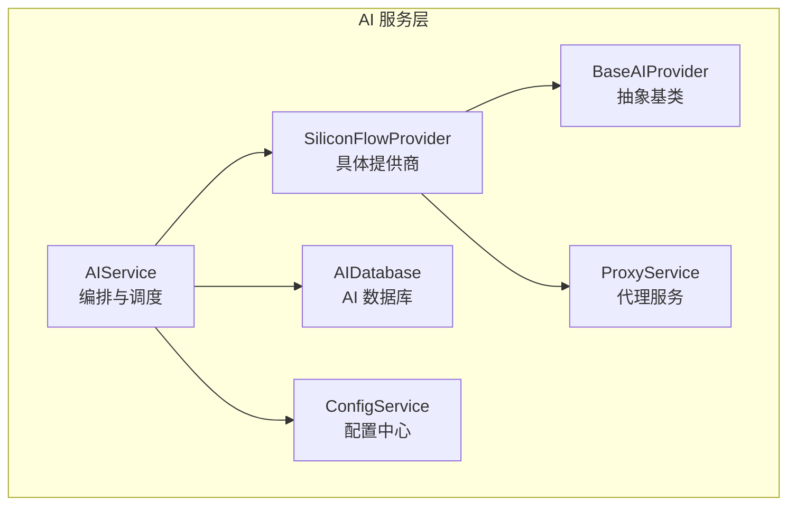
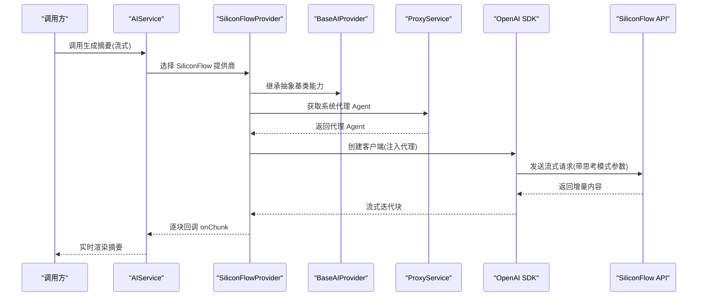
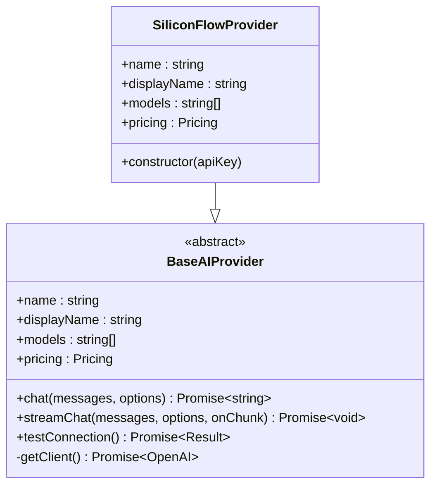
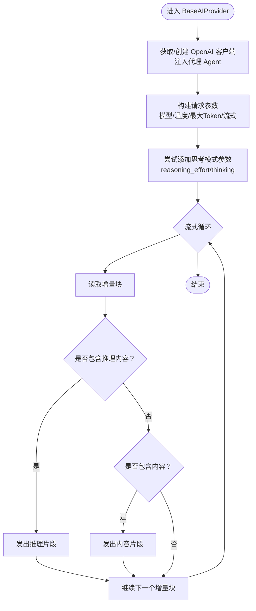
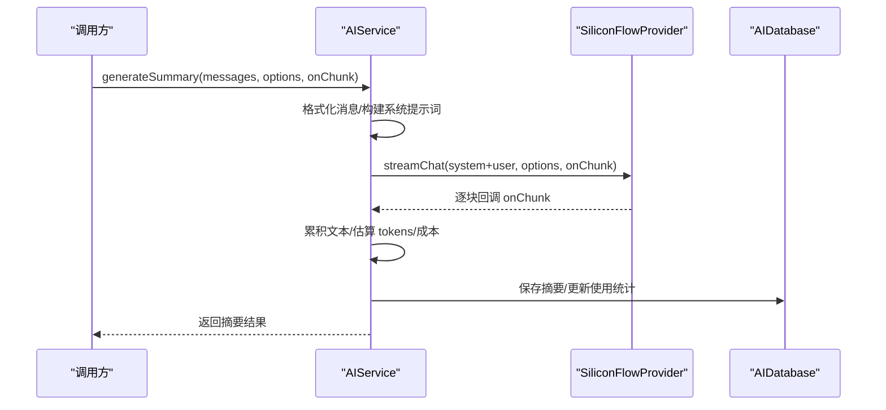
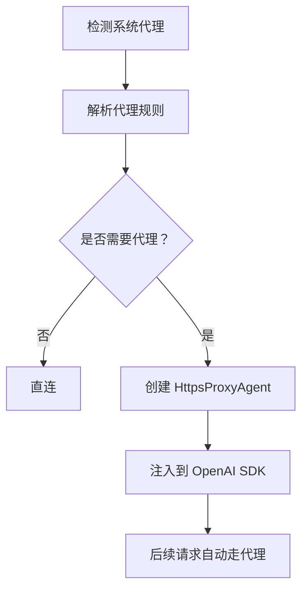
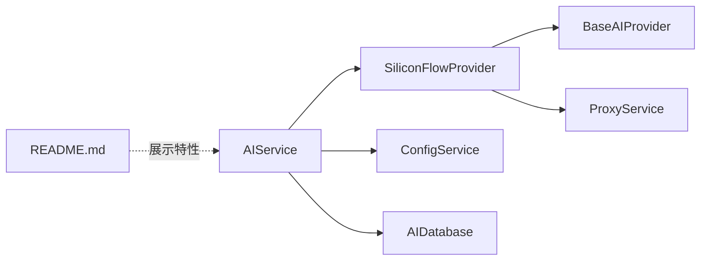

# SiliconFlow 提供商

<cite>
**本文档引用的文件**
- [siliconflow.ts](file://electron/services/ai/providers/siliconflow.ts)
- [base.ts](file://electron/services/ai/providers/base.ts)
- [aiService.ts](file://electron/services/ai/aiService.ts)
- [proxyService.ts](file://electron/services/ai/proxyService.ts)
- [config.ts](file://electron/services/config.ts)
- [aiDatabase.ts](file://electron/services/ai/aiDatabase.ts)
- [README.md](file://README.md)
</cite>

## 目录
1. [简介](#简介)
2. [项目结构](#项目结构)
3. [核心组件](#核心组件)
4. [架构总览](#架构总览)
5. [详细组件分析](#详细组件分析)
6. [依赖关系分析](#依赖关系分析)
7. [性能考虑](#性能考虑)
8. [故障排除指南](#故障排除指南)
9. [结论](#结论)
10. [附录](#附录)

## 简介
本文件面向 SiliconFlow（硅基流动）提供商的集成实现，系统性阐述其在 CipherTalk 项目中的架构设计、认证机制、模型选择、特殊参数配置、请求参数优化、响应处理与流式响应实现、与 OpenAI 标准的兼容性处理、性能优化策略、错误处理机制，并提供配置示例、使用指南与故障排除方法。目标读者既包括开发者也包括需要理解集成细节的非技术用户。

## 项目结构
SiliconFlow 集成位于 Electron 主进程的 AI 服务子系统中，采用“提供商插件化 + 统一抽象基类”的架构，便于扩展其他 AI 服务商。核心文件组织如下：
- 提供商实现：`electron/services/ai/providers/siliconflow.ts`
- 抽象基类与通用能力：`electron/services/ai/providers/base.ts`
- AI 服务编排：`electron/services/ai/aiService.ts`
- 代理服务（解决主进程网络问题）：`electron/services/ai/proxyService.ts`
- 配置中心：`electron/services/config.ts`
- AI 数据库：`electron/services/ai/aiDatabase.ts`
- 项目说明与特性：`README.md`

**图表来源**
- [aiService.ts:58-163](file://electron/services/ai/aiService.ts#L58-L163)
- [base.ts:49-90](file://electron/services/ai/providers/base.ts#L49-L90)
- [siliconflow.ts:31-40](file://electron/services/ai/providers/siliconflow.ts#L31-L40)
- [proxyService.ts:16-99](file://electron/services/ai/proxyService.ts#L16-L99)
- [aiDatabase.ts:8-347](file://electron/services/ai/aiDatabase.ts#L8-L347)
- [config.ts:126-394](file://electron/services/config.ts#L126-L394)

**章节来源**
- [README.md:163-183](file://README.md#L163-L183)

## 核心组件
- SiliconFlow 提供商元数据与实现：定义提供商标识、显示名、支持模型列表、定价信息与网站信息；构造函数指定 SiliconFlow API 基础 URL。
- 抽象基类 BaseAIProvider：统一实现非流式与流式聊天、连接测试、代理注入、参数构建与思考模式兼容处理。
- AIService：负责提供商选择、消息格式化、系统提示词构建、流式摘要生成、成本估算与数据库持久化。
- ProxyService：在 Electron 主进程中自动解析系统代理并注入到 OpenAI SDK 的 httpAgent，解决直连不可达问题。
- ConfigService：集中管理 AI 提供商配置（API Key、默认模型、是否启用思考模式等）。
- AIDatabase：AI 摘要与使用统计的 SQLite 存储。

**章节来源**
- [siliconflow.ts:6-26](file://electron/services/ai/providers/siliconflow.ts#L6-L26)
- [siliconflow.ts:31-40](file://electron/services/ai/providers/siliconflow.ts#L31-L40)
- [base.ts:7-34](file://electron/services/ai/providers/base.ts#L7-L34)
- [base.ts:49-90](file://electron/services/ai/providers/base.ts#L49-L90)
- [aiService.ts:58-163](file://electron/services/ai/aiService.ts#L58-L163)
- [proxyService.ts:16-99](file://electron/services/ai/proxyService.ts#L16-L99)
- [config.ts:348-394](file://electron/services/config.ts#L348-L394)
- [aiDatabase.ts:8-102](file://electron/services/ai/aiDatabase.ts#L8-L102)

## 架构总览
SiliconFlow 集成遵循“OpenAI SDK 兼容 + 代理透明 + 流式输出 + 统一抽象”的设计原则。客户端通过 AIService 调用 SiliconFlowProvider，后者在每次请求时动态创建 OpenAI 客户端并注入代理 Agent，确保主进程也能走系统代理。流式响应通过统一的流式接口返回增量内容，同时兼容不同模型的“思考模式”参数，保证跨模型的一致体验。

**图表来源**
- [aiService.ts:439-539](file://electron/services/ai/aiService.ts#L439-L539)
- [base.ts:106-175](file://electron/services/ai/providers/base.ts#L106-L175)
- [proxyService.ts:83-99](file://electron/services/ai/proxyService.ts#L83-L99)

## 详细组件分析

### SiliconFlow 提供商实现
- 元数据：包含提供商标识、显示名、描述、支持模型数组、定价信息与官网链接。
- 实现：继承抽象基类，设置提供商名称、模型列表与定价；构造函数传入 SiliconFlow API 基础 URL。
- 模型选择：优先使用配置中的模型，否则使用元数据中的首个模型。

**图表来源**
- [base.ts:49-90](file://electron/services/ai/providers/base.ts#L49-L90)
- [siliconflow.ts:31-40](file://electron/services/ai/providers/siliconflow.ts#L31-L40)

**章节来源**
- [siliconflow.ts:6-26](file://electron/services/ai/providers/siliconflow.ts#L6-L26)
- [siliconflow.ts:31-40](file://electron/services/ai/providers/siliconflow.ts#L31-L40)

### 抽象基类与通用能力
- 客户端创建：每次请求动态创建 OpenAI 客户端，确保使用最新代理配置。
- 非流式聊天：构建请求参数（模型、温度、最大 Token、禁用流式），返回第一条回复内容。
- 流式聊天：构建请求参数（模型、温度、最大 Token、启用流式），同时尝试添加“思考模式”参数（不同模型风格），遍历流式响应块，区分内容与推理片段，统一回调给上层。
- 连接测试：通过 models.list() 与超时竞速，识别网络错误、超时、域名解析失败、401/403/429/5xx 等错误并返回人性化提示与是否需要代理的判断。

**图表来源**
- [base.ts:106-175](file://electron/services/ai/providers/base.ts#L106-L175)

**章节来源**
- [base.ts:71-90](file://electron/services/ai/providers/base.ts#L71-L90)
- [base.ts:92-104](file://electron/services/ai/providers/base.ts#L92-L104)
- [base.ts:106-175](file://electron/services/ai/providers/base.ts#L106-L175)
- [base.ts:177-239](file://electron/services/ai/providers/base.ts#L177-L239)

### AIService 编排与流式摘要
- 提供商选择：根据配置或显式参数选择 SiliconFlow 提供商，若缺少 API Key 则抛出异常。
- 系统提示词：内置多风格提示词模板，支持自定义与预设切换。
- 消息格式化：将聊天记录转换为结构化文本，过滤无效消息，保留媒体消息占位。
- 流式生成：调用提供商的流式接口，实时拼接并回调上层，完成后估算 tokens 与成本，持久化到数据库并更新使用统计。

**图表来源**
- [aiService.ts:439-539](file://electron/services/ai/aiService.ts#L439-L539)
- [aiDatabase.ts:117-226](file://electron/services/ai/aiDatabase.ts#L117-L226)

**章节来源**
- [aiService.ts:109-163](file://electron/services/ai/aiService.ts#L109-L163)
- [aiService.ts:168-238](file://electron/services/ai/aiService.ts#L168-L238)
- [aiService.ts:439-539](file://electron/services/ai/aiService.ts#L439-L539)

### 代理服务与网络兼容
- 系统代理解析：通过 Electron session.resolveProxy 获取系统代理规则，解析为 http/https/socks5 代理 URL。
- 代理 Agent 注入：创建 HttpsProxyAgent 并注入到 OpenAI SDK 的 httpAgent，使主进程请求走系统代理。
- 缓存与测试：代理 URL 缓存 1 分钟，避免频繁查询；提供代理连通性测试方法。

**图表来源**
- [proxyService.ts:26-76](file://electron/services/ai/proxyService.ts#L26-L76)
- [proxyService.ts:83-99](file://electron/services/ai/proxyService.ts#L83-L99)

**章节来源**
- [proxyService.ts:16-99](file://electron/services/ai/proxyService.ts#L16-L99)

### 配置中心与提供商配置
- AI 配置项：当前提供商、各提供商的 API Key 与默认模型、摘要详细程度、是否启用思考模式、消息数量限制等。
- 迁移兼容：支持旧版配置迁移（如 aiProvider/aiApiKey/aiModel 到新结构），并兼容 baseUrl -> baseURL 字段名变更。
- 获取与设置：提供便捷方法读取/写入 AI 配置。

**章节来源**
- [config.ts:66-80](file://electron/services/config.ts#L66-L80)
- [config.ts:188-242](file://electron/services/config.ts#L188-L242)
- [config.ts:348-394](file://electron/services/config.ts#L348-L394)

### 数据持久化与使用统计
- 表结构：摘要表、使用统计表、缓存表；索引优化查询性能。
- 保存摘要：插入摘要记录，返回自增 ID。
- 更新统计：按日期聚合 token 数量与成本，请求次数自增。
- 历史查询与清理：支持按会话查询历史、删除摘要、重命名、清理过期缓存。

**章节来源**
- [aiDatabase.ts:35-102](file://electron/services/ai/aiDatabase.ts#L35-L102)
- [aiDatabase.ts:117-226](file://electron/services/ai/aiDatabase.ts#L117-L226)
- [aiDatabase.ts:228-332](file://electron/services/ai/aiDatabase.ts#L228-L332)

## 依赖关系分析
- SiliconFlowProvider 依赖 BaseAIProvider 提供统一的 OpenAI SDK 能力与代理注入。
- AIService 依赖 ConfigService 获取提供商配置，依赖 AIDatabase 持久化摘要与统计。
- ProxyService 作为中间层，被 BaseAIProvider 在运行时动态调用，确保主进程网络可达。
- README 展示了 AI 服务的特性与支持的提供商列表，包括 SiliconFlow。

**图表来源**
- [siliconflow.ts:31-40](file://electron/services/ai/providers/siliconflow.ts#L31-L40)
- [base.ts:49-90](file://electron/services/ai/providers/base.ts#L49-L90)
- [aiService.ts:58-163](file://electron/services/ai/aiService.ts#L58-L163)
- [README.md:165-183](file://README.md#L165-L183)

**章节来源**
- [README.md:165-183](file://README.md#L165-L183)

## 性能考虑
- 代理注入时机：每次请求动态创建 OpenAI 客户端并注入代理 Agent，确保代理配置实时生效，避免静态配置带来的滞后。
- 流式输出：通过 OpenAI SDK 的流式接口逐块回调，降低首屏延迟，提升用户体验。
- 缓存与索引：数据库表建立索引，减少查询耗时；提供缓存表与过期清理机制。
- 参数优化：默认温度与最大 Token 可由上层传入；思考模式参数自动适配多模型风格，避免重复请求失败。
- 连接测试：超时竞速与错误分类，快速反馈网络状态，减少无效重试。

[本节为通用性能讨论，无需特定文件来源]

## 故障排除指南
常见问题与处理建议：
- 连接失败/超时：检查系统代理是否正确配置，尝试开启代理或更换网络；查看连接测试返回的错误提示。
- API Key 无效/权限不足：确认 API Key 正确且具备相应权限；检查提供商控制台状态。
- 请求过于频繁/限流：等待冷却时间后重试；适当降低并发或增加延时。
- 服务器错误：稍后重试；关注提供商服务状态。
- 思考模式不生效：不同模型对“思考模式”参数支持不同，系统已自动尝试多种参数风格，若仍不生效属模型限制。

排查步骤：
1. 使用 AIService.testConnection(provider, apiKey) 获取连接状态与是否需要代理。
2. 检查 ProxyService 的代理解析与缓存状态。
3. 查看日志服务（默认仅记录警告及以上级别）以定位错误。
4. 若网络环境复杂，建议使用系统代理并确认代理可用性。

**章节来源**
- [base.ts:177-239](file://electron/services/ai/providers/base.ts#L177-L239)
- [proxyService.ts:115-146](file://electron/services/ai/proxyService.ts#L115-L146)
- [logService.ts:36-68](file://electron/services/logService.ts#L36-L68)

## 结论
SiliconFlow 集成在 CipherTalk 中通过统一的抽象基类与提供商插件化架构实现了与 OpenAI SDK 的兼容、代理透明、流式输出与跨模型的思考模式兼容。配合 AIService 的编排能力、ConfigService 的配置管理与 AIDatabase 的持久化，形成了稳定、可扩展且易于维护的 AI 服务能力。对于 SiliconFlow 的使用，建议优先启用代理、合理设置温度与最大 Token、利用流式输出提升交互体验，并通过连接测试与日志辅助定位问题。

[本节为总结性内容，无需特定文件来源]

## 附录

### 配置示例与使用指南
- 配置提供商：在配置中心设置当前提供商为 siliconflow，并填写 API Key；可选设置默认模型。
- 启用思考模式：通过 AIService 的 SummaryOptions.enableThinking 控制是否显示推理过程。
- 生成摘要：调用 AIService.generateSummary，传入消息列表、联系人映射与选项，注册 onChunk 回调以接收流式输出。
- 连接测试：调用 AIService.testConnection(provider, apiKey)，根据返回的 needsProxy 字段决定是否开启代理。

**章节来源**
- [config.ts:348-394](file://electron/services/config.ts#L348-L394)
- [aiService.ts:439-539](file://electron/services/ai/aiService.ts#L439-L539)
- [base.ts:177-239](file://electron/services/ai/providers/base.ts#L177-L239)

### 错误处理机制
- 连接测试：捕获网络错误、超时、域名解析失败、HTTP 状态码（401/403/429/5xx）等，返回人性化提示与是否需要代理的判断。
- 流式处理：在流式循环中区分推理内容与普通内容，确保 UI 正确渲染与标签闭合。
- 数据库异常：对数据库操作进行 try/catch 包裹，记录错误并返回安全状态。

**章节来源**
- [base.ts:177-239](file://electron/services/ai/providers/base.ts#L177-L239)
- [base.ts:147-175](file://electron/services/ai/providers/base.ts#L147-L175)
- [aiDatabase.ts:292-307](file://electron/services/ai/aiDatabase.ts#L292-L307)