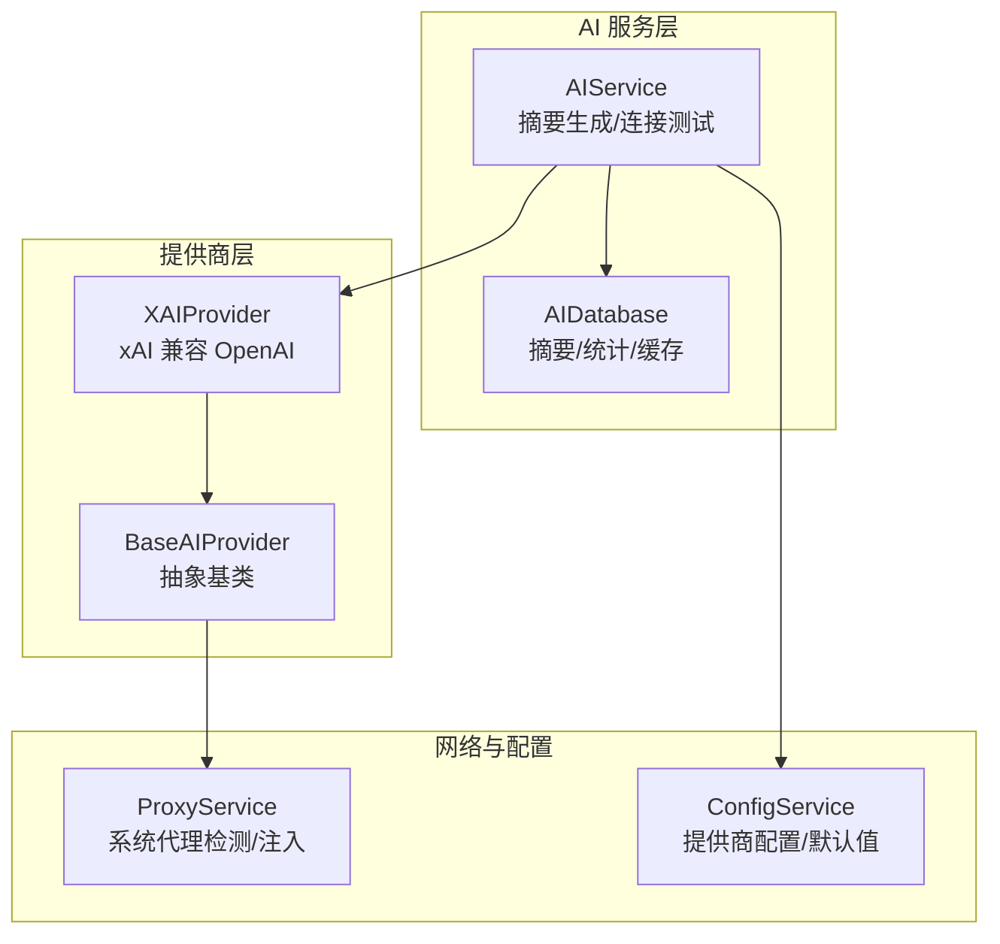
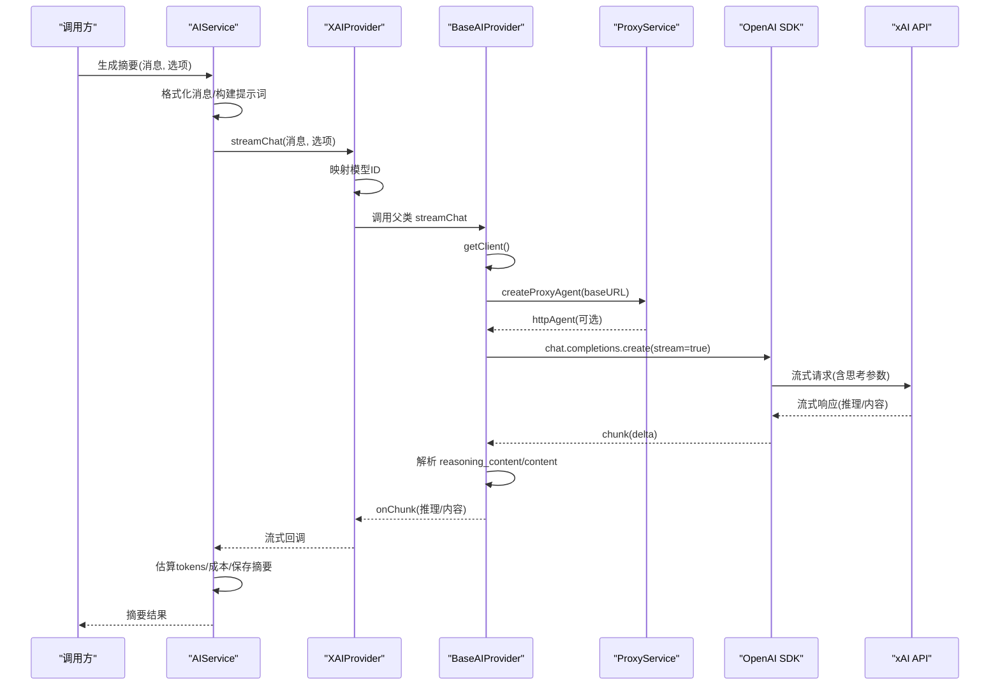
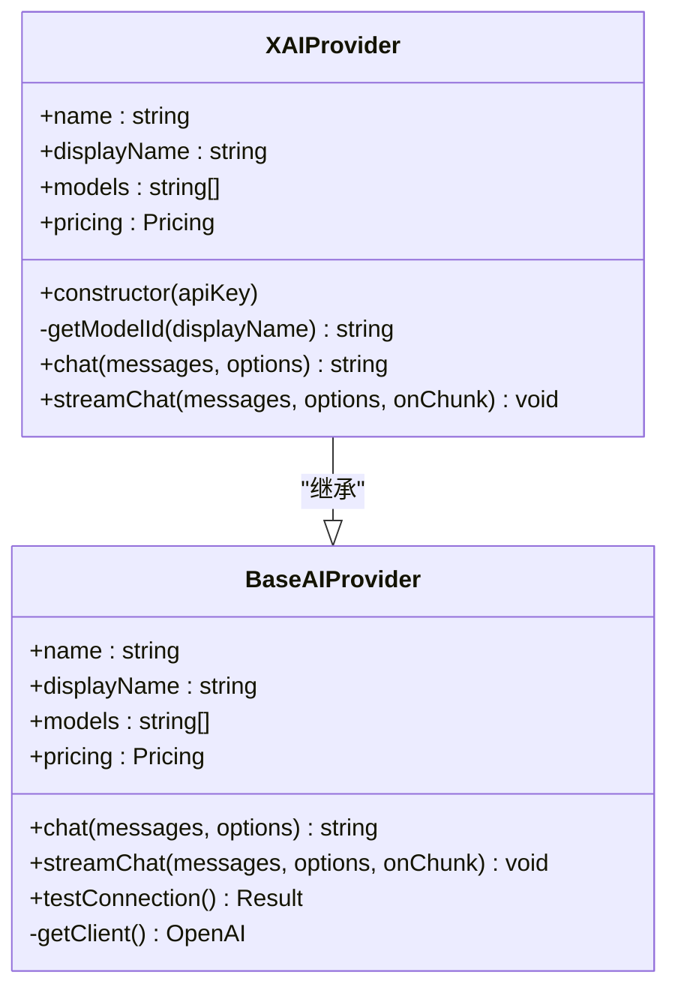
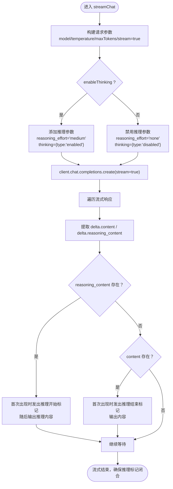
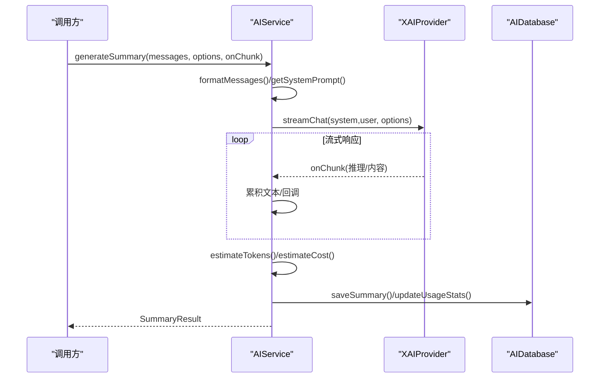
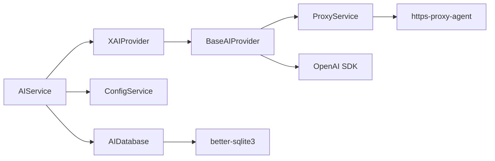

# xAI 提供商

<cite>
**本文档引用的文件**
- [electron/services/ai/providers/xai.ts](file://electron/services/ai/providers/xai.ts)
- [electron/services/ai/providers/base.ts](file://electron/services/ai/providers/base.ts)
- [electron/services/ai/aiService.ts](file://electron/services/ai/aiService.ts)
- [electron/services/ai/proxyService.ts](file://electron/services/ai/proxyService.ts)
- [electron/services/ai/aiDatabase.ts](file://electron/services/ai/aiDatabase.ts)
- [electron/services/config.ts](file://electron/services/config.ts)
- [README.md](file://README.md)
</cite>

## 目录
1. [简介](#简介)
2. [项目结构](#项目结构)
3. [核心组件](#核心组件)
4. [架构总览](#架构总览)
5. [详细组件分析](#详细组件分析)
6. [依赖关系分析](#依赖关系分析)
7. [性能考虑](#性能考虑)
8. [故障排查指南](#故障排查指南)
9. [结论](#结论)
10. [附录](#附录)

## 简介
本文件面向 xAI（Grok）提供商的集成实现，系统性阐述认证方式、模型支持、特殊参数配置、请求格式转换、响应解析与流式响应实现、思考模式支持、错误处理策略与网络连接优化，并提供完整的配置示例与使用场景建议。该集成完全兼容 OpenAI 接口，通过统一的 AI 提供商抽象层实现跨提供商的一致行为。

## 项目结构
xAI 提供商位于 Electron 主进程的 AI 服务子系统中，采用“抽象基类 + 具体提供商”的分层设计：
- 抽象基类：统一定义 AI 提供商接口、聊天选项、连接测试与流式处理逻辑
- 具体提供商：针对 xAI 的模型映射与请求参数适配
- 服务编排：AI 服务负责提供商选择、消息格式化、摘要生成与数据库持久化
- 网络代理：代理服务解决主进程直连与系统代理的差异
- 配置中心：集中管理各提供商的 API Key、默认模型与全局开关

图示来源
- [electron/services/ai/aiService.ts:58-163](file://electron/services/ai/aiService.ts#L58-L163)
- [electron/services/ai/providers/base.ts:49-90](file://electron/services/ai/providers/base.ts#L49-L90)
- [electron/services/ai/providers/xai.ts:47-79](file://electron/services/ai/providers/xai.ts#L47-L79)
- [electron/services/ai/proxyService.ts:16-99](file://electron/services/ai/proxyService.ts#L16-L99)
- [electron/services/config.ts:126-394](file://electron/services/config.ts#L126-L394)

章节来源
- [electron/services/ai/aiService.ts:58-163](file://electron/services/ai/aiService.ts#L58-L163)
- [electron/services/ai/providers/base.ts:49-90](file://electron/services/ai/providers/base.ts#L49-L90)
- [electron/services/ai/providers/xai.ts:47-79](file://electron/services/ai/providers/xai.ts#L47-L79)
- [electron/services/ai/proxyService.ts:16-99](file://electron/services/ai/proxyService.ts#L16-L99)
- [electron/services/config.ts:126-394](file://electron/services/config.ts#L126-L394)

## 核心组件
- 抽象基类 BaseAIProvider
  - 统一接口：非流式 chat、流式 streamChat、连接测试 testConnection
  - 参数规范：ChatOptions 包含 model、temperature、maxTokens、enableThinking
  - 代理注入：每次请求动态创建 OpenAI 客户端并注入 httpAgent
  - 流式处理：自动识别 reasoning_content 与 content，支持思考模式
- 具体提供商 XAIProvider
  - 元数据：品牌名、显示名、模型列表、定价、官网与 Logo
  - 模型映射：将展示名映射为真实 Grok 模型 ID
  - 兼容 OpenAI：重写 chat/streamChat，注入映射后的模型 ID
- AI 服务 AIService
  - 提供商选择：根据配置或显式参数选择 xAI
  - 摘要生成：格式化消息、构建系统提示词、流式生成、估算 tokens 与成本
  - 数据持久化：保存摘要、使用统计、缓存键管理
- 代理服务 ProxyService
  - 系统代理检测：通过 Electron session.resolveProxy 获取系统代理
  - 代理注入：创建 HttpsProxyAgent 并注入到 OpenAI SDK
- 配置中心 ConfigService
  - 多提供商配置：aiProviderConfigs 存储每个提供商的 apiKey/model/baseURL
  - 默认值与迁移：支持旧配置迁移与字段兼容

章节来源
- [electron/services/ai/providers/base.ts:7-34](file://electron/services/ai/providers/base.ts#L7-L34)
- [electron/services/ai/providers/base.ts:39-44](file://electron/services/ai/providers/base.ts#L39-L44)
- [electron/services/ai/providers/base.ts:49-90](file://electron/services/ai/providers/base.ts#L49-L90)
- [electron/services/ai/providers/base.ts:92-175](file://electron/services/ai/providers/base.ts#L92-L175)
- [electron/services/ai/providers/base.ts:177-241](file://electron/services/ai/providers/base.ts#L177-L241)
- [electron/services/ai/providers/xai.ts:6-29](file://electron/services/ai/providers/xai.ts#L6-L29)
- [electron/services/ai/providers/xai.ts:31-41](file://electron/services/ai/providers/xai.ts#L31-L41)
- [electron/services/ai/providers/xai.ts:47-79](file://electron/services/ai/providers/xai.ts#L47-L79)
- [electron/services/ai/aiService.ts:58-163](file://electron/services/ai/aiService.ts#L58-L163)
- [electron/services/ai/aiService.ts:439-539](file://electron/services/ai/aiService.ts#L439-L539)
- [electron/services/ai/proxyService.ts:16-99](file://electron/services/ai/proxyService.ts#L16-L99)
- [electron/services/config.ts:65-80](file://electron/services/config.ts#L65-L80)
- [electron/services/config.ts:347-394](file://electron/services/config.ts#L347-L394)

## 架构总览
xAI 集成遵循“统一抽象 + 兼容 OpenAI + 代理注入 + 流式思考”的设计原则，整体流程如下：

图示来源
- [electron/services/ai/aiService.ts:439-539](file://electron/services/ai/aiService.ts#L439-L539)
- [electron/services/ai/providers/xai.ts:67-78](file://electron/services/ai/providers/xai.ts#L67-L78)
- [electron/services/ai/providers/base.ts:106-175](file://electron/services/ai/providers/base.ts#L106-L175)
- [electron/services/ai/proxyService.ts:83-99](file://electron/services/ai/proxyService.ts#L83-L99)

## 详细组件分析

### XAI 提供商（XAIProvider）
- 元数据与模型映射
  - 展示模型名与真实 Grok 模型 ID 的映射，确保请求使用正确的模型标识
  - 提供品牌信息、定价与官网链接，便于 UI 展示
- 认证与基础 URL
  - 构造函数传入 API Key 与 xAI v1 基础地址
- 请求适配
  - chat：将用户选择的模型名映射为真实 ID 后调用父类
  - streamChat：同上，保证流式响应也能正确路由到目标模型

图示来源
- [electron/services/ai/providers/base.ts:49-90](file://electron/services/ai/providers/base.ts#L49-L90)
- [electron/services/ai/providers/xai.ts:47-79](file://electron/services/ai/providers/xai.ts#L47-L79)

章节来源
- [electron/services/ai/providers/xai.ts:6-29](file://electron/services/ai/providers/xai.ts#L6-L29)
- [electron/services/ai/providers/xai.ts:31-41](file://electron/services/ai/providers/xai.ts#L31-L41)
- [electron/services/ai/providers/xai.ts:47-79](file://electron/services/ai/providers/xai.ts#L47-L79)

### 抽象基类（BaseAIProvider）
- 统一接口与参数
  - ChatOptions 支持 temperature、maxTokens、enableThinking
- 客户端与代理
  - getClient 每次请求动态创建 OpenAI 客户端，优先注入代理 Agent
  - 支持直连与系统代理两种模式
- 流式处理与思考模式
  - 自动尝试多种思考模式参数（reasoning_effort/thinking），API 会忽略不支持的参数
  - 流式遍历 chunk，分别输出 reasoning_content 与 content，并用标记包裹推理片段
- 连接测试
  - 通过 models.list() 与超时竞速判断网络状态
  - 识别常见错误码与系统代理相关错误，返回 needsProxy 与友好提示

图示来源
- [electron/services/ai/providers/base.ts:106-175](file://electron/services/ai/providers/base.ts#L106-L175)

章节来源
- [electron/services/ai/providers/base.ts:7-34](file://electron/services/ai/providers/base.ts#L7-L34)
- [electron/services/ai/providers/base.ts:39-44](file://electron/services/ai/providers/base.ts#L39-L44)
- [electron/services/ai/providers/base.ts:68-90](file://electron/services/ai/providers/base.ts#L68-L90)
- [electron/services/ai/providers/base.ts:106-175](file://electron/services/ai/providers/base.ts#L106-L175)
- [electron/services/ai/providers/base.ts:177-241](file://electron/services/ai/providers/base.ts#L177-L241)

### AI 服务（AIService）
- 提供商选择与实例化
  - 支持 custom/ollama/openai/gemini/zhipu/deepseek/qwen/doubao/kimi/siliconflow/xiaomi/tencent/xai 等
  - xAI 通过 ConfigService 获取 API Key，构造 XAIProvider
- 摘要生成流程
  - 格式化消息：将原始消息转换为结构化文本，过滤无效内容
  - 构建系统提示词：支持预设风格与自定义提示词
  - 流式生成：调用 provider.streamChat，逐块累积并回调
  - 估算 tokens 与成本：基于输入/输出单价与估算字符数
  - 数据持久化：保存摘要、更新使用统计、清理过期缓存
- 连接测试
  - 通过 provider.testConnection 返回 success/error/needsProxy

图示来源
- [electron/services/ai/aiService.ts:439-539](file://electron/services/ai/aiService.ts#L439-L539)
- [electron/services/ai/aiDatabase.ts:117-164](file://electron/services/ai/aiDatabase.ts#L117-L164)

章节来源
- [electron/services/ai/aiService.ts:58-163](file://electron/services/ai/aiService.ts#L58-L163)
- [electron/services/ai/aiService.ts:439-539](file://electron/services/ai/aiService.ts#L439-L539)
- [electron/services/ai/aiDatabase.ts:117-164](file://electron/services/ai/aiDatabase.ts#L117-L164)

### 代理服务（ProxyService）
- 系统代理检测
  - 通过 Electron session.defaultSession.resolveProxy 获取系统代理规则
  - 解析 DIRECT/PROXY/HTTPS/SOCKS5 等格式，构建代理 URL
- 代理注入
  - 创建 HttpsProxyAgent 并注入到 OpenAI SDK 的 httpAgent
  - 缓存代理结果，避免频繁查询
- 连接测试
  - 提供独立的代理连通性测试方法

章节来源
- [electron/services/ai/proxyService.ts:16-99](file://electron/services/ai/proxyService.ts#L16-L99)
- [electron/services/ai/proxyService.ts:115-146](file://electron/services/ai/proxyService.ts#L115-L146)

### 配置中心（ConfigService）
- 多提供商配置
  - aiProviderConfigs：存储每个提供商的 apiKey/model/baseURL
  - aiCurrentProvider：当前默认提供商
- 默认值与迁移
  - 支持旧字段迁移（baseUrl -> baseURL）、AI 配置结构迁移
- 便捷方法
  - getAIProviderConfig/setAIProviderConfig/getAllAIProviderConfigs
  - getAIMessageLimit/setAIMessageLimit

章节来源
- [electron/services/config.ts:65-80](file://electron/services/config.ts#L65-L80)
- [electron/services/config.ts:174-242](file://electron/services/config.ts#L174-L242)
- [electron/services/config.ts:347-394](file://electron/services/config.ts#L347-L394)

## 依赖关系分析
- 组件耦合
  - XAIProvider 依赖 BaseAIProvider；AIService 依赖 XAIProvider 与其他提供商
  - BaseAIProvider 依赖 ProxyService 注入代理；依赖 OpenAI SDK
  - AIService 依赖 ConfigService 与 AIDatabase
- 外部依赖
  - OpenAI SDK：统一的聊天补全接口
  - better-sqlite3：AI 摘要与使用统计的持久化
  - https-proxy-agent：HTTP/HTTPS 代理注入
- 潜在循环依赖
  - 未发现循环依赖；模块职责清晰

图示来源
- [electron/services/ai/aiService.ts:58-163](file://electron/services/ai/aiService.ts#L58-L163)
- [electron/services/ai/providers/xai.ts:47-79](file://electron/services/ai/providers/xai.ts#L47-L79)
- [electron/services/ai/providers/base.ts:49-90](file://electron/services/ai/providers/base.ts#L49-L90)
- [electron/services/ai/proxyService.ts:83-99](file://electron/services/ai/proxyService.ts#L83-L99)

章节来源
- [electron/services/ai/aiService.ts:58-163](file://electron/services/ai/aiService.ts#L58-L163)
- [electron/services/ai/providers/base.ts:49-90](file://electron/services/ai/providers/base.ts#L49-L90)
- [electron/services/ai/providers/xai.ts:47-79](file://electron/services/ai/providers/xai.ts#L47-L79)
- [electron/services/ai/proxyService.ts:83-99](file://electron/services/ai/proxyService.ts#L83-L99)

## 性能考虑
- 代理注入时机
  - BaseAIProvider 每次请求动态创建客户端，确保使用最新代理配置，避免代理缓存导致的连接失败
- 超时与竞速
  - 连接测试使用 Promise.race 竞速 models.list() 与 15 秒超时，提升用户体验
- 流式处理
  - 流式响应按块输出，减少首字节等待时间；推理内容与正文分离输出，便于 UI 渲染
- 估算成本
  - AIService 提供 tokens 估算与成本计算，便于用户控制预算

[本节为通用性能建议，不直接分析特定文件]

## 故障排查指南
- 连接失败
  - 常见错误：ECONNREFUSED/ETIMEDOUT/ENOTFOUND/CONNECTION_TIMEOUT/getaddrinfo
  - BaseAIProvider.testConnection 会识别上述错误并返回 needsProxy
  - 建议：开启系统代理或检查网络；确认 API Key 有效
- 401/403/429/5xx
  - BaseAIProvider.testConnection 会根据错误码返回相应提示
  - 建议：检查权限、配额与频率限制
- 代理问题
  - ProxyService 通过 session.resolveProxy 获取系统代理
  - 若代理不可用，可手动测试代理连通性或切换直连
- 思考模式无效
  - BaseAIProvider 会尝试多种参数格式，API 会忽略不支持的参数
  - 若目标模型不支持推理，仍会正常输出内容

章节来源
- [electron/services/ai/providers/base.ts:177-241](file://electron/services/ai/providers/base.ts#L177-L241)
- [electron/services/ai/proxyService.ts:16-99](file://electron/services/ai/proxyService.ts#L16-L99)

## 结论
xAI 提供商通过“OpenAI 兼容 + 模型映射 + 代理注入 + 流式思考”的设计，在统一抽象层下实现了稳定、可扩展的集成。结合 AIService 的消息格式化、成本估算与数据库持久化，为用户提供一致的摘要生成体验。建议在复杂网络环境下优先启用系统代理，并合理配置思考模式与温度参数以获得更佳效果。

[本节为总结性内容，不直接分析特定文件]

## 附录

### 认证方式
- API Key：通过 ConfigService.aiProviderConfigs[xai].apiKey 配置
- 本地/自定义：xAIProvider 不需要 baseURL，直接使用官方 v1 接口

章节来源
- [electron/services/config.ts:347-394](file://electron/services/config.ts#L347-L394)
- [electron/services/ai/providers/xai.ts:53-55](file://electron/services/ai/providers/xai.ts#L53-L55)

### 模型支持
- 支持模型列表：Grok 4.1 Fast、Grok 4.1 Fast (非推理)、Grok Code Fast 1、Grok 4 Fast、Grok 4 Fast (非推理)、Grok 4、Grok 3 Mini、Grok 3、Grok 2 Vision
- 模型映射：展示名到真实 Grok ID 的映射，确保请求正确

章节来源
- [electron/services/ai/providers/xai.ts:11-21](file://electron/services/ai/providers/xai.ts#L11-L21)
- [electron/services/ai/providers/xai.ts:31-41](file://electron/services/ai/providers/xai.ts#L31-L41)

### 特殊参数配置
- enableThinking：默认启用，尝试多种推理参数格式，API 会忽略不支持的参数
- temperature：默认 0.7，可在 AIService 与 Provider 层传递
- maxTokens：可选，控制最大生成长度

章节来源
- [electron/services/ai/providers/base.ts:39-44](file://electron/services/ai/providers/base.ts#L39-L44)
- [electron/services/ai/providers/base.ts:123-142](file://electron/services/ai/providers/base.ts#L123-L142)
- [electron/services/ai/aiService.ts:486-499](file://electron/services/ai/aiService.ts#L486-L499)

### 请求格式转换与响应解析
- 请求参数：model、messages、temperature、max_tokens、stream=true
- 响应解析：遍历流式响应，区分 delta.content 与 delta.reasoning_content
- 思考模式：推理内容以标记包裹，正文输出后自动闭合推理标记

章节来源
- [electron/services/ai/providers/base.ts:92-104](file://electron/services/ai/providers/base.ts#L92-L104)
- [electron/services/ai/providers/base.ts:144-175](file://electron/services/ai/providers/base.ts#L144-L175)

### 流式响应实现
- 流式创建：client.chat.completions.create({ stream: true })
- 块处理：逐块读取 choices[0].delta，分别输出推理与正文
- 标记管理：推理开始/结束标记确保 UI 正确渲染

章节来源
- [electron/services/ai/providers/base.ts:106-175](file://electron/services/ai/providers/base.ts#L106-L175)

### 思考模式支持情况
- 自动尝试：reasoning_effort 与 thinking 对象两种风格
- 兼容性：API 会忽略不支持的参数，不会报错
- 无法完全关闭：部分模型无法完全关闭推理，仍会输出推理片段

章节来源
- [electron/services/ai/providers/base.ts:123-142](file://electron/services/ai/providers/base.ts#L123-L142)
- [electron/services/ai/providers/base.ts:154-174](file://electron/services/ai/providers/base.ts#L154-L174)

### 错误处理策略
- 连接测试：models.list() + 15 秒超时
- 错误分类：网络错误、鉴权错误、限流错误、服务器错误
- 代理判断：needsProxy 标识网络问题是否与代理相关

章节来源
- [electron/services/ai/providers/base.ts:177-241](file://electron/services/ai/providers/base.ts#L177-L241)

### 网络连接优化
- 代理注入：每次请求动态创建客户端并注入代理 Agent
- 缓存代理：ProxyService 缓存代理 URL，降低查询开销
- 超时控制：BaseAIProvider 默认 60 秒超时，连接测试 15 秒超时

章节来源
- [electron/services/ai/providers/base.ts:68-90](file://electron/services/ai/providers/base.ts#L68-L90)
- [electron/services/ai/proxyService.ts:26-76](file://electron/services/ai/proxyService.ts#L26-L76)

### 配置示例与使用场景建议
- 配置步骤
  - 在设置中选择 xAI 提供商
  - 填写 API Key（来自 xAI 官方）
  - 选择模型（如 Grok 4 Fast）
  - 可选：开启思考模式、调整温度与最大生成长度
- 使用场景建议
  - 需要实时搜索能力：选择支持搜索的 Grok 模型
  - 需要推理过程：启用思考模式，观察推理标记
  - 复杂网络环境：启用系统代理，确保连接稳定

章节来源
- [electron/services/config.ts:347-394](file://electron/services/config.ts#L347-L394)
- [electron/services/ai/providers/xai.ts:6-29](file://electron/services/ai/providers/xai.ts#L6-L29)
- [README.md:165-183](file://README.md#L165-L183)