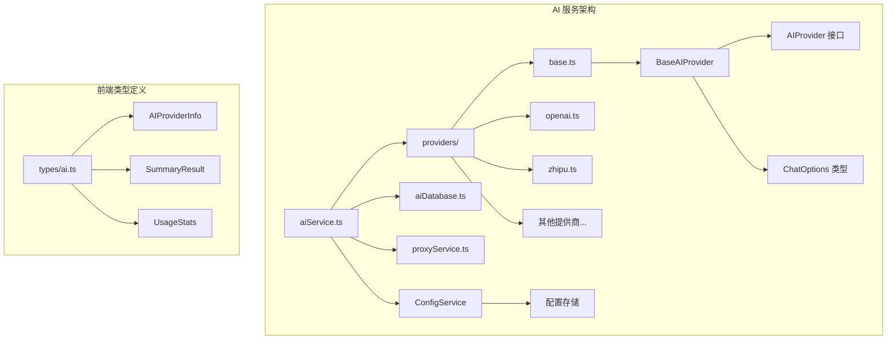
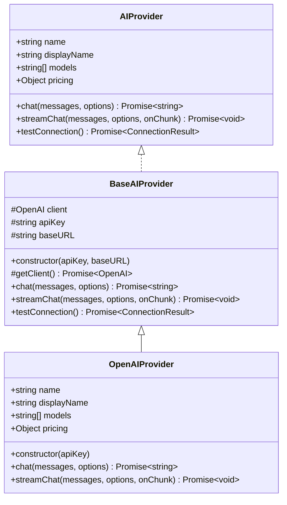
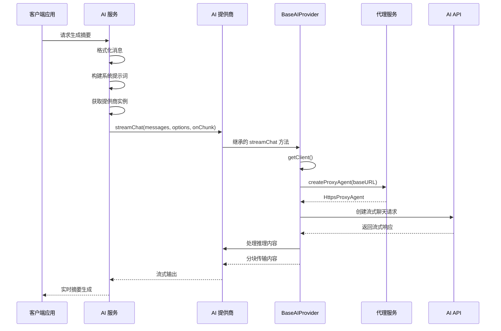
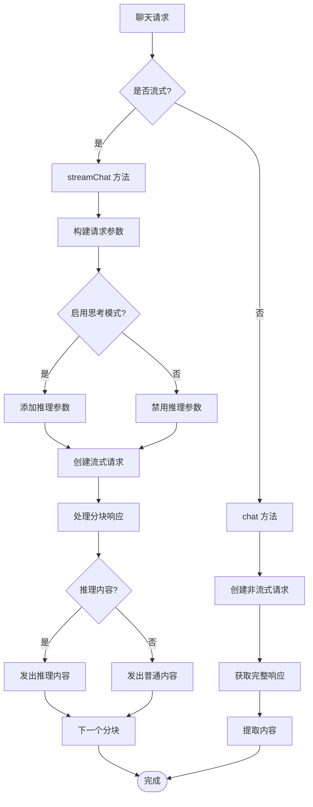
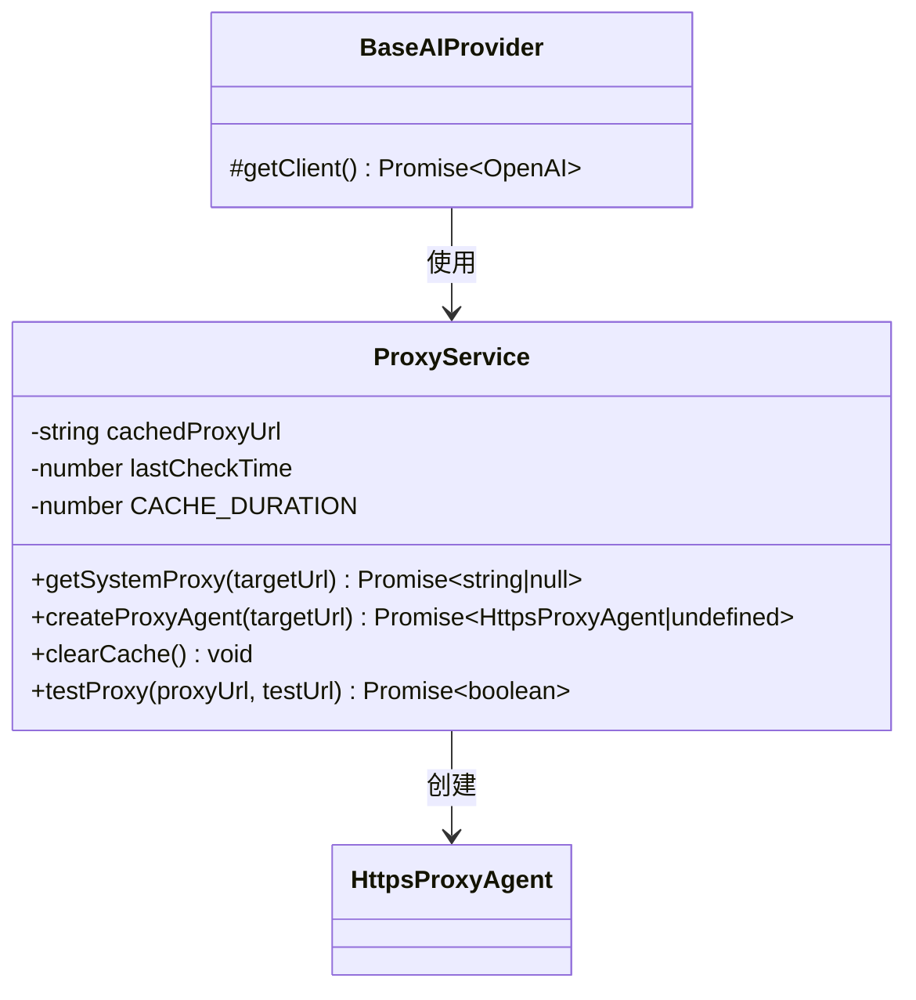
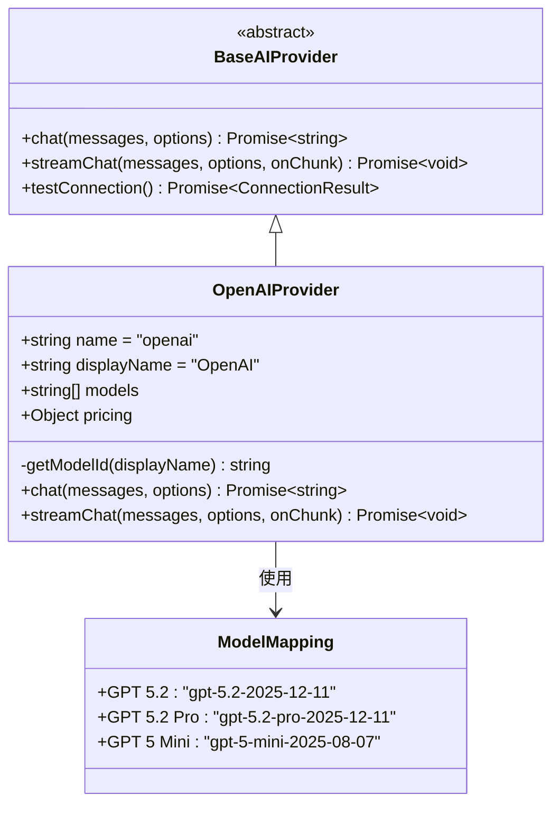
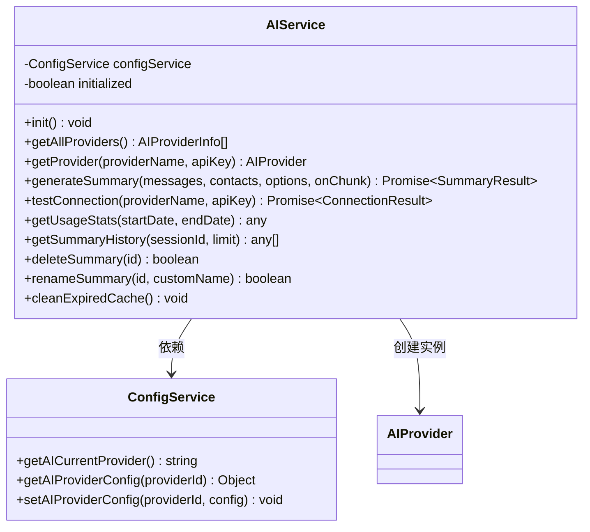
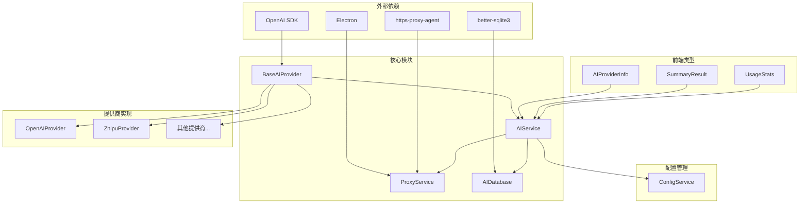

# 基础提供商接口

<cite>
**本文档引用的文件**
- [base.ts](file://electron/services/ai/providers/base.ts)
- [aiService.ts](file://electron/services/ai/aiService.ts)
- [proxyService.ts](file://electron/services/ai/proxyService.ts)
- [openai.ts](file://electron/services/ai/providers/openai.ts)
- [zhipu.ts](file://electron/services/ai/providers/zhipu.ts)
- [aiDatabase.ts](file://electron/services/ai/aiDatabase.ts)
- [config.ts](file://electron/services/config.ts)
- [ai.ts](file://src/types/ai.ts)
</cite>

## 目录
1. [简介](#简介)
2. [项目结构](#项目结构)
3. [核心组件](#核心组件)
4. [架构概览](#架构概览)
5. [详细组件分析](#详细组件分析)
6. [依赖关系分析](#依赖关系分析)
7. [性能考虑](#性能考虑)
8. [故障排除指南](#故障排除指南)
9. [结论](#结论)
10. [附录](#附录)

## 简介

CipherTalk 是一个基于 Electron 的微信聊天数据分析工具，其中的 AI 提供商基础接口设计旨在为多种 AI 服务提供商提供统一的抽象层。本文档深入解析 BaseAIProvider 抽象基类的设计理念和实现细节，包括 AIProvider 接口规范、ChatOptions 参数配置、客户端初始化策略，以及如何通过抽象基类实现代码复用。

该系统支持多种 AI 提供商（如 OpenAI、智谱AI、DeepSeek 等），并通过统一的接口规范实现了高度的可扩展性和维护性。

## 项目结构

AI 服务相关的文件组织结构如下：



**图表来源**
- [aiService.ts:1-631](file://electron/services/ai/aiService.ts#L1-L631)
- [base.ts:1-241](file://electron/services/ai/providers/base.ts#L1-L241)

**章节来源**
- [aiService.ts:1-631](file://electron/services/ai/aiService.ts#L1-L631)
- [base.ts:1-241](file://electron/services/ai/providers/base.ts#L1-L241)

## 核心组件

### AIProvider 接口规范

AIProvider 接口定义了所有 AI 提供商必须实现的标准方法：



**图表来源**
- [base.ts:7-34](file://electron/services/ai/providers/base.ts#L7-L34)
- [base.ts:49-241](file://electron/services/ai/providers/base.ts#L49-L241)
- [openai.ts:44-77](file://electron/services/ai/providers/openai.ts#L44-L77)

### ChatOptions 参数配置

ChatOptions 接口提供了灵活的聊天参数配置：

| 参数名 | 类型 | 默认值 | 描述 |
|--------|------|--------|------|
| model | string | 第一个可用模型 | 指定使用的 AI 模型 |
| temperature | number | 0.7 | 控制生成内容的创造性 |
| maxTokens | number | 无限制 | 最大生成令牌数 |
| enableThinking | boolean | true | 是否启用思考模式 |

**章节来源**
- [base.ts:39-44](file://electron/services/ai/providers/base.ts#L39-L44)
- [aiService.ts:23-36](file://electron/services/ai/aiService.ts#L23-L36)

## 架构概览

AI 服务的整体架构采用分层设计，通过抽象基类实现代码复用：



**图表来源**
- [aiService.ts:439-539](file://electron/services/ai/aiService.ts#L439-L539)
- [base.ts:106-175](file://electron/services/ai/providers/base.ts#L106-L175)
- [proxyService.ts:83-99](file://electron/services/ai/proxyService.ts#L83-L99)

## 详细组件分析

### BaseAIProvider 抽象基类

BaseAIProvider 是整个 AI 提供商体系的核心抽象层，提供了统一的实现模板：

#### 核心设计理念

1. **延迟初始化策略**：客户端在首次请求时才创建，确保能够获取最新的代理配置
2. **代理透明化**：通过 ProxyService 自动处理代理配置，对上层调用透明
3. **思考模式统一处理**：支持多种 AI 提供商的推理模式参数，实现统一的处理逻辑

#### 客户端初始化策略

```mermaid
flowchart TD
Start([请求开始]) --> GetClient[调用 getClient()]
GetClient --> CreateProxy[创建代理 Agent]
CreateProxy --> CheckProxy{是否有代理?}
CheckProxy --> |是| UseProxy[注入 httpAgent]
CheckProxy --> |否| DirectConnect[直连]
UseProxy --> NewClient[创建 OpenAI 客户端]
DirectConnect --> NewClient
NewClient --> ReturnClient[返回客户端实例]
ReturnClient --> End([请求结束])
```

**图表来源**
- [base.ts:71-90](file://electron/services/ai/providers/base.ts#L71-L90)
- [proxyService.ts:83-99](file://electron/services/ai/proxyService.ts#L83-L99)

#### 流式聊天实现差异

BaseAIProvider 在流式和非流式聊天之间实现了统一的接口：



**图表来源**
- [base.ts:106-175](file://electron/services/ai/providers/base.ts#L106-L175)
- [base.ts:123-142](file://electron/services/ai/providers/base.ts#L123-L142)

#### 代理支持机制

BaseAIProvider 通过 ProxyService 实现了智能的代理支持：



**图表来源**
- [proxyService.ts:16-151](file://electron/services/ai/proxyService.ts#L16-L151)
- [base.ts:71-90](file://electron/services/ai/providers/base.ts#L71-L90)

#### 连接测试逻辑

BaseAIProvider 提供了完善的连接测试机制：

```mermaid
flowchart TD
TestStart[开始连接测试] --> CreateClient[创建客户端]
CreateClient --> Race[竞速测试]
Race --> APICall[调用 models.list()]
Race --> Timeout[15秒超时]
APICall --> Success{测试成功?}
Timeout --> TimeoutError[超时错误]
Success --> |是| SuccessResult[返回成功结果]
TimeoutError --> CheckError[检查错误类型]
SuccessResult --> EndTest[测试结束]
CheckError --> NetworkError{网络错误?}
NetworkError --> |是| NeedProxy[需要代理]
NetworkError --> |否| OtherError[其他错误]
NeedProxy --> ErrorMsg[构建错误信息]
OtherError --> ErrorMsg
ErrorMsg --> ReturnError[返回错误结果]
ReturnError --> EndTest
```

**图表来源**
- [base.ts:177-239](file://electron/services/ai/providers/base.ts#L177-L239)

#### 思考模式的统一处理

BaseAIProvider 实现了跨提供商的思考模式统一处理：

| 提供商 | 推理参数 | 参数值 |
|--------|----------|--------|
| DeepSeek | reasoning_effort | 'medium'/'none' |
| 通义千问 | thinking.type | 'enabled'/'disabled' |
| Gemini | reasoning_content | 自动处理 |

**章节来源**
- [base.ts:123-175](file://electron/services/ai/providers/base.ts#L123-L175)

### 具体提供商实现示例

#### OpenAIProvider 实现

OpenAIProvider 展示了如何继承 BaseAIProvider 并处理特定的模型映射：



**图表来源**
- [openai.ts:44-77](file://electron/services/ai/providers/openai.ts#L44-L77)
- [openai.ts:30-39](file://electron/services/ai/providers/openai.ts#L30-L39)

#### ZhipuProvider 实现

ZhipuProvider 展示了国内 AI 提供商的实现模式：

**章节来源**
- [openai.ts:1-77](file://electron/services/ai/providers/openai.ts#L1-L77)
- [zhipu.ts:1-75](file://electron/services/ai/providers/zhipu.ts#L1-L75)

### AIService 服务层

AIService 作为业务服务层，负责协调各个 AI 提供商：



**图表来源**
- [aiService.ts:58-631](file://electron/services/ai/aiService.ts#L58-L631)
- [config.ts:347-395](file://electron/services/config.ts#L347-L395)

**章节来源**
- [aiService.ts:58-631](file://electron/services/ai/aiService.ts#L58-L631)
- [config.ts:347-395](file://electron/services/config.ts#L347-L395)

## 依赖关系分析

AI 服务系统的依赖关系呈现清晰的分层结构：



**图表来源**
- [base.ts:1](file://electron/services/ai/providers/base.ts#L1)
- [aiService.ts:1-16](file://electron/services/ai/aiService.ts#L1-L16)
- [proxyService.ts:1](file://electron/services/ai/proxyService.ts#L1)
- [aiDatabase.ts:1](file://electron/services/ai/aiDatabase.ts#L1)

**章节来源**
- [base.ts:1-2](file://electron/services/ai/providers/base.ts#L1-L2)
- [aiService.ts:1-16](file://electron/services/ai/aiService.ts#L1-L16)

## 性能考虑

### 连接池和缓存策略

BaseAIProvider 采用了智能的连接管理策略：

1. **延迟初始化**：避免不必要的客户端创建
2. **代理缓存**：ProxyService 缓存代理配置，减少频繁查询
3. **超时控制**：统一的 60 秒请求超时和 15 秒连接测试超时

### 流式处理优化

- **实时响应**：流式聊天提供即时的内容输出
- **内存效率**：逐块处理响应，避免大量内存占用
- **错误恢复**：流式处理中的错误不影响整体流程

### 数据库性能

AIDatabase 通过以下方式优化性能：
- **索引优化**：为常用查询字段建立索引
- **批量操作**：使用批量插入和更新
- **连接池**：SQLite 连接的高效管理

## 故障排除指南

### 常见连接问题

| 错误类型 | 错误码 | 可能原因 | 解决方案 |
|----------|--------|----------|----------|
| 连接被拒绝 | ECONNREFUSED | 代理配置错误 | 检查代理设置，重启代理软件 |
| 连接超时 | ETIMEDOUT | 网络不稳定 | 检查网络连接，调整超时设置 |
| 域名解析失败 | ENOTFOUND | DNS 问题 | 检查 DNS 设置，使用代理 |
| API Key 无效 | 401 | 密钥错误 | 重新输入正确的 API Key |
| 请求过于频繁 | 429 | 速率限制 | 等待后重试，降低请求频率 |

### 代理配置问题

1. **代理检测失败**：检查 ProxyService 的缓存状态
2. **代理连接异常**：使用 `proxyService.testProxy()` 测试代理有效性
3. **代理缓存过期**：调用 `proxyService.clearCache()` 刷新代理配置

### 思考模式问题

- **推理内容过多**：通过 `enableThinking: false` 禁用推理模式
- **推理内容缺失**：某些模型可能无法完全关闭推理功能
- **内容格式异常**：BaseAIProvider 已处理推理内容的特殊标记

**章节来源**
- [base.ts:193-239](file://electron/services/ai/providers/base.ts#L193-L239)
- [proxyService.ts:115-146](file://electron/services/ai/proxyService.ts#L115-L146)

## 结论

BaseAIProvider 抽象基类成功地为 CipherTalk 的 AI 服务提供了统一的架构基础。通过以下关键特性实现了高度的可扩展性和维护性：

1. **统一接口规范**：AIProvider 接口确保所有提供商的一致性
2. **智能代理支持**：ProxyService 透明处理代理配置
3. **思考模式统一**：跨提供商的推理模式处理
4. **流式处理优化**：高效的实时内容输出
5. **完善的错误处理**：全面的连接测试和错误分类

这种设计使得开发者可以轻松地添加新的 AI 提供商，同时保持现有功能的稳定性。通过继承 BaseAIProvider，新的提供商只需要关注特定的实现细节，而无需重复处理通用的基础设施代码。

## 附录

### 使用示例

#### 基本使用流程

```typescript
// 1. 获取 AIService 实例
const aiService = new AIService()

// 2. 初始化服务
aiService.init()

// 3. 生成摘要（流式）
await aiService.generateSummary(
  messages,
  contacts,
  {
    sessionId: 'session123',
    timeRangeDays: 7,
    provider: 'openai',
    apiKey: 'your-api-key',
    model: 'GPT 5.2',
    enableThinking: true
  },
  (chunk) => {
    // 实时处理分块内容
    console.log('收到分块:', chunk)
  }
)
```

#### 扩展新提供商

```typescript
// 1. 创建新的提供商类
class CustomProvider extends BaseAIProvider {
  name = 'custom'
  displayName = '自定义提供商'
  models = ['custom-model-1', 'custom-model-2']
  pricing = { input: 0.01, output: 0.02 }
  
  constructor(apiKey: string, baseURL: string) {
    super(apiKey, baseURL)
  }
}

// 2. 在 aiService 中注册
// 在 getAllProviders() 方法中添加 CustomMetadata
```

### 最佳实践

1. **错误处理**：始终检查 `enableThinking` 参数的布尔值
2. **资源管理**：及时清理代理缓存和数据库连接
3. **性能监控**：定期检查使用统计和性能指标
4. **配置验证**：在初始化时验证 API Key 和模型配置