# 字节跳动豆包提供商

<cite>
**本文档引用的文件**
- [doubao.ts](file://electron/services/ai/providers/doubao.ts)
- [base.ts](file://electron/services/ai/providers/base.ts)
- [aiService.ts](file://electron/services/ai/aiService.ts)
- [proxyService.ts](file://electron/services/ai/proxyService.ts)
- [aiDatabase.ts](file://electron/services/ai/aiDatabase.ts)
- [config.ts](file://electron/services/config.ts)
- [README.md](file://README.md)
</cite>

## 目录
1. [简介](#简介)
2. [项目结构](#项目结构)
3. [核心组件](#核心组件)
4. [架构概览](#架构概览)
5. [详细组件分析](#详细组件分析)
6. [依赖关系分析](#依赖关系分析)
7. [性能考虑](#性能考虑)
8. [故障排除指南](#故障排除指南)
9. [配置示例](#配置示例)
10. [使用场景建议](#使用场景建议)
11. [结论](#结论)

## 简介

字节跳动豆包（Doubao）提供商是 CipherTalk 项目中集成的多家 AI 服务提供商之一。该项目是一个现代化的微信聊天记录查看与分析工具，支持多家 AI 服务商，包括智谱、DeepSeek、通义千问、Google Gemini、豆包、Kimi、硅基流动等。

豆包提供商实现了完整的 OpenAI 标准兼容性，提供了非流式和流式两种聊天模式，支持代理连接、错误处理和成本计算等功能。该集成充分利用了项目的统一架构设计，确保与其他 AI 服务提供商的一致性和互操作性。

## 项目结构

CipherTalk 项目采用模块化架构设计，AI 服务提供商集成位于 `electron/services/ai/providers/` 目录下，形成了清晰的功能分层：

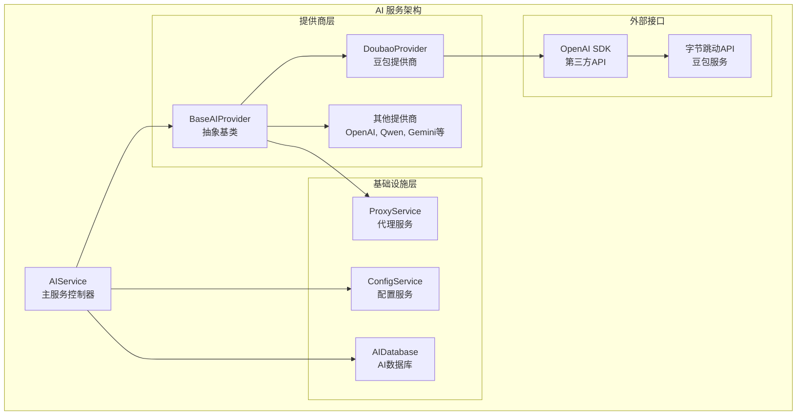

**图表来源**
- [aiService.ts:58-163](file://electron/services/ai/aiService.ts#L58-L163)
- [base.ts:49-66](file://electron/services/ai/providers/base.ts#L49-L66)
- [doubao.ts:37-45](file://electron/services/ai/providers/doubao.ts#L37-L45)

**章节来源**
- [aiService.ts:88-104](file://electron/services/ai/aiService.ts#L88-L104)
- [doubao.ts:6-19](file://electron/services/ai/providers/doubao.ts#L6-L19)

## 核心组件

### 豆包提供商元数据

豆包提供商定义了完整的元数据信息，包括品牌标识、模型支持列表和定价信息：

| 属性 | 描述 | 示例值 |
|------|------|--------|
| `id` | 提供商唯一标识符 | `'doubao'` |
| `name` | 内部名称 | `'doubao'` |
| `displayName` | 显示名称 | `'豆包'` |
| `description` | 服务描述 | `'字节跳动出品，响应快速'` |
| `models` | 支持的模型列表 | 10个不同版本的豆包模型 |
| `pricing` | 总价格式 | `'¥0.008/1K tokens'` |
| `pricingDetail` | 详细定价信息 | 输入/输出均为 ¥0.008/1K tokens |
| `website` | 官方网站 | `'https://www.volcengine.com/'` |
| `logo` | 品牌Logo路径 | `'./AI-logo/doubao-color.svg'` |

### 模型映射表

豆包提供商实现了中文模型名称到英文模型ID的映射，确保与 OpenAI 标准的兼容性：

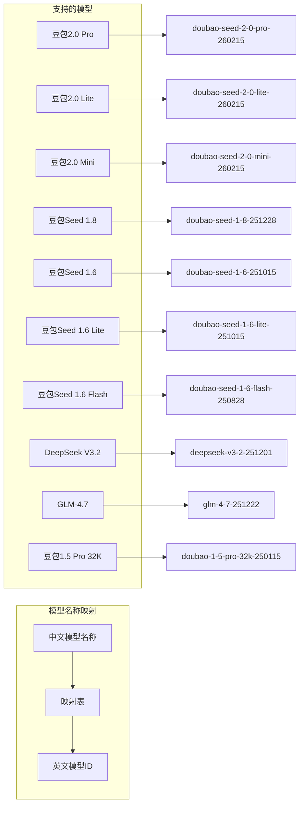

**图表来源**
- [doubao.ts:21-32](file://electron/services/ai/providers/doubao.ts#L21-L32)

**章节来源**
- [doubao.ts:6-19](file://electron/services/ai/providers/doubao.ts#L6-L19)
- [doubao.ts:21-32](file://electron/services/ai/providers/doubao.ts#L21-L32)

## 架构概览

豆包提供商的架构设计遵循统一的抽象基类模式，确保了与其他 AI 服务提供商的一致性：

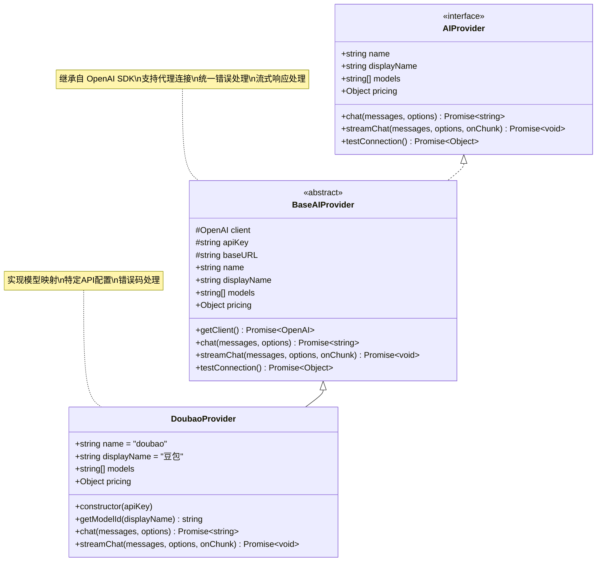

**图表来源**
- [base.ts:7-34](file://electron/services/ai/providers/base.ts#L7-L34)
- [base.ts:49-66](file://electron/services/ai/providers/base.ts#L49-L66)
- [doubao.ts:37-60](file://electron/services/ai/providers/doubao.ts#L37-L60)

## 详细组件分析

### DoubaoProvider 类实现

DoubaoProvider 类继承自 BaseAIProvider，实现了豆包特有的功能：

#### 构造函数和属性

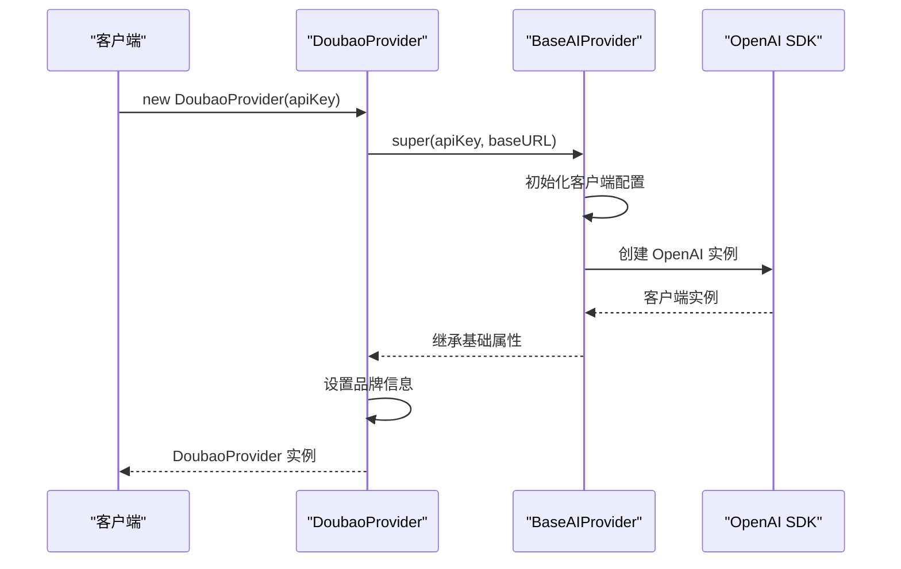

**图表来源**
- [doubao.ts:43-45](file://electron/services/ai/providers/doubao.ts#L43-L45)
- [base.ts:59-66](file://electron/services/ai/providers/base.ts#L59-L66)

#### 模型ID映射机制

DoubaoProvider 实现了智能的模型名称映射，确保与 OpenAI 标准的兼容性：

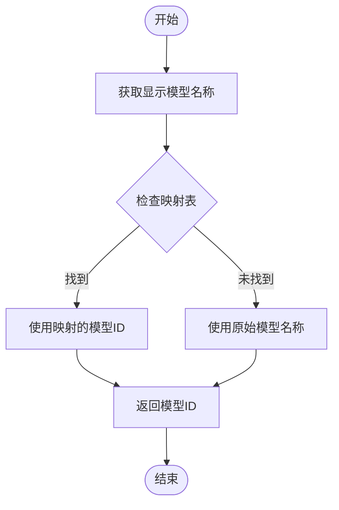

**图表来源**
- [doubao.ts:47-49](file://electron/services/ai/providers/doubao.ts#L47-L49)
- [doubao.ts:21-32](file://electron/services/ai/providers/doubao.ts#L21-L32)

#### 聊天接口实现

DoubaoProvider 提供了两种聊天模式：非流式和流式：

**非流式聊天流程：**
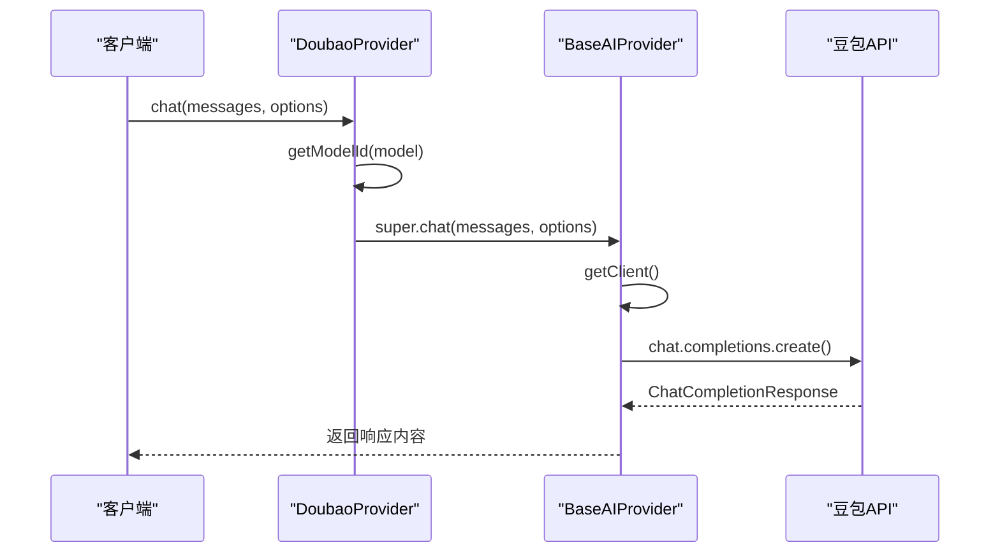

**图表来源**
- [doubao.ts:51-54](file://electron/services/ai/providers/doubao.ts#L51-L54)
- [base.ts:92-104](file://electron/services/ai/providers/base.ts#L92-L104)

**流式聊天流程：**
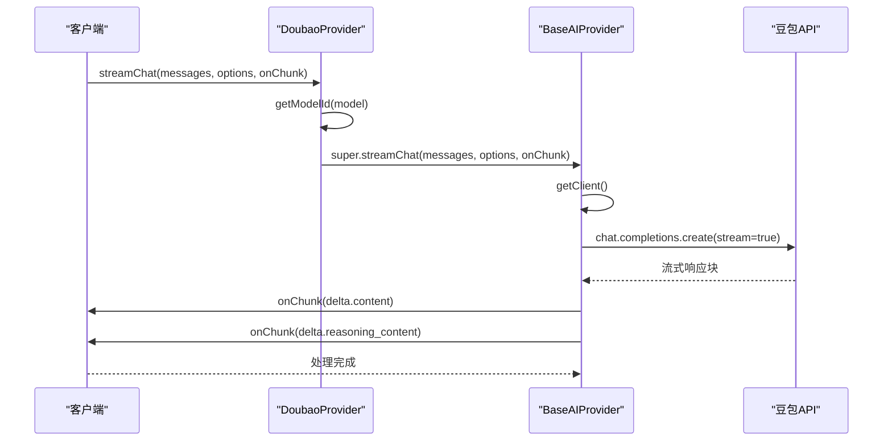

**图表来源**
- [doubao.ts:56-59](file://electron/services/ai/providers/doubao.ts#L56-L59)
- [base.ts:106-175](file://electron/services/ai/providers/base.ts#L106-L175)

**章节来源**
- [doubao.ts:37-60](file://electron/services/ai/providers/doubao.ts#L37-L60)
- [base.ts:92-175](file://electron/services/ai/providers/base.ts#L92-L175)

### BaseAIProvider 基础功能

BaseAIProvider 提供了统一的 AI 服务基础能力，包括代理支持、错误处理和连接测试：

#### 代理服务集成

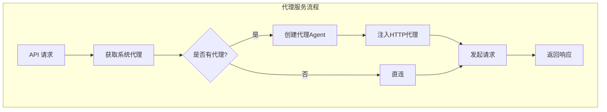

**图表来源**
- [base.ts:71-90](file://electron/services/ai/providers/base.ts#L71-L90)
- [proxyService.ts:83-99](file://electron/services/ai/proxyService.ts#L83-L99)

#### 错误处理和连接测试

BaseAIProvider 实现了完善的错误处理机制，支持多种网络异常情况：

| 错误类型 | 错误码 | 处理策略 |
|----------|--------|----------|
| 连接超时 | `CONNECTION_TIMEOUT` | 提示开启代理或检查网络 |
| 连接被拒绝 | `ECONNREFUSED` | 提示开启代理或检查网络 |
| 域名解析失败 | `ENOTFOUND/getaddrinfo` | 提示开启代理或检查网络 |
| API Key 无效 | `401/Unauthorized` | 提示检查 API Key 配置 |
| 访问被禁止 | `403/Forbidden` | 提示检查 API Key 权限 |
| 请求过于频繁 | `429` | 提示稍后再试 |
| 服务器错误 | `500/502/503` | 提示稍后再试 |

**章节来源**
- [base.ts:177-239](file://electron/services/ai/providers/base.ts#L177-L239)
- [proxyService.ts:16-151](file://electron/services/ai/proxyService.ts#L16-L151)

### AIService 集成协调器

AIService 作为主控制器，负责管理所有 AI 服务提供商的生命周期和配置：

#### 提供商工厂模式

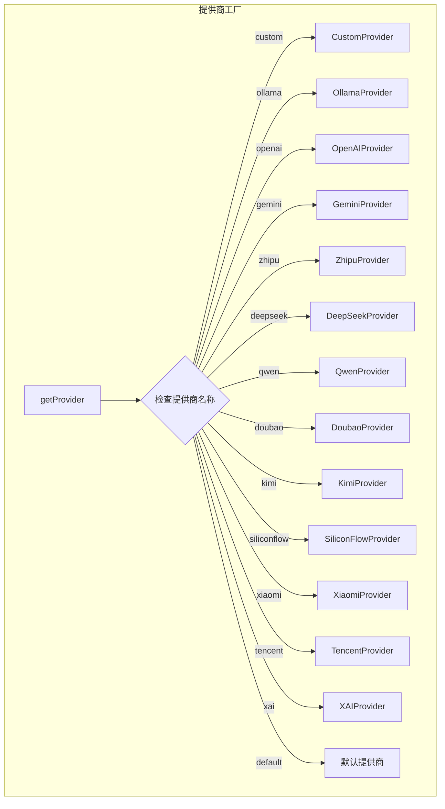

**图表来源**
- [aiService.ts:109-163](file://electron/services/ai/aiService.ts#L109-L163)

#### 摘要生成功能

AIService 实现了完整的摘要生成功能，支持流式输出和成本计算：

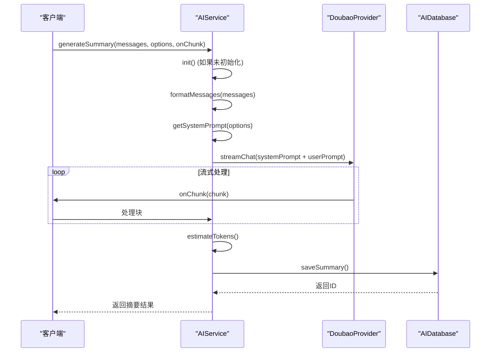

**图表来源**
- [aiService.ts:439-539](file://electron/services/ai/aiService.ts#L439-L539)

**章节来源**
- [aiService.ts:58-163](file://electron/services/ai/aiService.ts#L58-L163)
- [aiService.ts:439-539](file://electron/services/ai/aiService.ts#L439-L539)

## 依赖关系分析

### 外部依赖

豆包提供商集成了多个关键的外部依赖：

```mermaid
graph TB
subgraph "外部依赖"
OpenAISDK[openai@^4.0.0<br/>OpenAI SDK]
HttpsProxyAgent[https-proxy-agent@^7.0.0<br/>HTTP代理]
BetterSQLite3[better-sqlite3@^9.0.0<br/>SQLite数据库]
Electron[electron@^39.0.0<br/>桌面应用框架]
end
subgraph "内部模块"
DoubaoProvider[DoubaoProvider]
BaseProvider[BaseAIProvider]
ProxyService[ProxyService]
AIDatabase[AIDatabase]
ConfigService[ConfigService]
end
DoubaoProvider --> OpenAISDK
BaseProvider --> OpenAISDK
BaseProvider --> HttpsProxyAgent
ProxyService --> HttpsProxyAgent
AIDatabase --> BetterSQLite3
ConfigService --> BetterSQLite3
AIService --> ConfigService
AIService --> AIDatabase
```

**图表来源**
- [base.ts:1-2](file://electron/services/ai/providers/base.ts#L1-L2)
- [proxyService.ts:1-2](file://electron/services/ai/proxyService.ts#L1-L2)
- [aiDatabase.ts:1-3](file://electron/services/ai/aiDatabase.ts#L1-L3)

### 内部模块依赖

豆包提供商的内部模块依赖关系清晰明确：

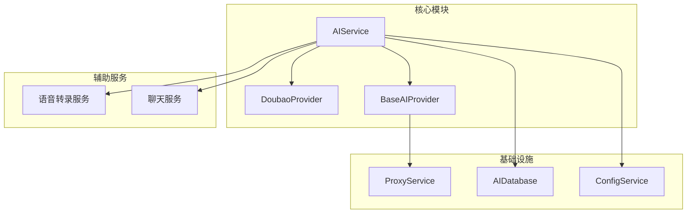

**图表来源**
- [aiService.ts:1-16](file://electron/services/ai/aiService.ts#L1-L16)
- [base.ts:1-2](file://electron/services/ai/providers/base.ts#L1-L2)

**章节来源**
- [aiService.ts:1-16](file://electron/services/ai/aiService.ts#L1-L16)
- [base.ts:1-2](file://electron/services/ai/providers/base.ts#L1-L2)

## 性能考虑

### 连接池和代理优化

豆包提供商实现了智能的连接管理和代理优化策略：

1. **延迟初始化客户端**：客户端在首次请求时才创建，确保使用最新的代理配置
2. **代理缓存机制**：系统代理信息缓存1分钟，减少频繁查询开销
3. **超时控制**：API 请求超时设置为60秒，连接测试超时为15秒
4. **流式处理**：支持流式响应，提高用户体验和内存效率

### 内存和资源管理

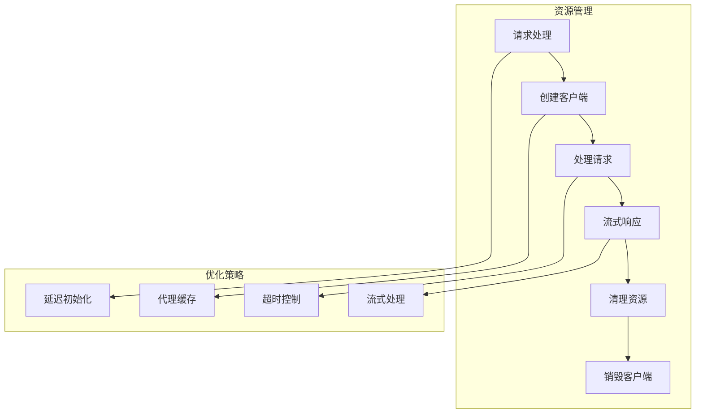

**图表来源**
- [base.ts:63-66](file://electron/services/ai/providers/base.ts#L63-L66)
- [base.ts:71-90](file://electron/services/ai/providers/base.ts#L71-L90)

## 故障排除指南

### 常见问题诊断

| 问题类型 | 症状 | 诊断步骤 | 解决方案 |
|----------|------|----------|----------|
| 网络连接失败 | 连接被拒绝/超时 | 检查代理设置和网络状态 | 开启系统代理或检查防火墙 |
| API Key 无效 | 401错误 | 验证API Key配置 | 重新申请并正确配置API Key |
| 模型不可用 | 404错误 | 检查模型名称映射 | 使用支持的模型列表中的名称 |
| 代理配置错误 | 连接超时 | 测试代理连通性 | 验证代理服务器可用性 |

### 错误码映射

豆包提供商实现了完整的错误码映射机制：

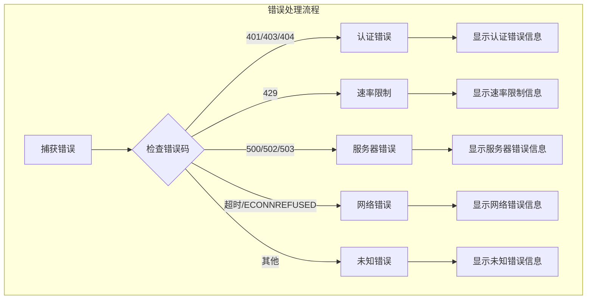

**图表来源**
- [base.ts:193-239](file://electron/services/ai/providers/base.ts#L193-L239)

**章节来源**
- [base.ts:177-239](file://electron/services/ai/providers/base.ts#L177-L239)

## 配置示例

### 基础配置

豆包提供商的配置支持多种方式：

#### 通过配置服务配置

```typescript
// 获取配置服务实例
const configService = new ConfigService()

// 设置豆包提供商配置
configService.setAIProviderConfig('doubao', {
  apiKey: 'YOUR_DOUBAO_API_KEY',
  model: '豆包2.0 Pro'
})

// 获取当前提供商
const currentProvider = configService.getAICurrentProvider()
console.log('当前提供商:', currentProvider)
```

#### 直接实例化配置

```typescript
// 直接创建豆包提供商实例
const doubaoProvider = new DoubaoProvider('YOUR_API_KEY')

// 获取支持的模型列表
console.log('支持的模型:', doubaoProvider.models)

// 使用指定模型进行聊天
const response = await doubaoProvider.chat(messages, {
  model: '豆包2.0 Pro',
  temperature: 0.7,
  maxTokens: 1000
})
```

### 高级配置选项

| 配置项 | 类型 | 默认值 | 描述 |
|--------|------|--------|------|
| `apiKey` | `string` | `''` | 豆包 API 密钥 |
| `model` | `string` | `'豆包2.0 Pro'` | 默认使用的模型 |
| `temperature` | `number` | `0.7` | 采样温度 (0.0-2.0) |
| `maxTokens` | `number` | `undefined` | 最大生成令牌数 |
| `enableThinking` | `boolean` | `true` | 是否启用思考模式 |

**章节来源**
- [config.ts:348-385](file://electron/services/config.ts#L348-L385)
- [doubao.ts:43-45](file://electron/services/ai/providers/doubao.ts#L43-L45)

## 使用场景建议

### 推荐使用场景

1. **快速响应需求**：豆包以其快速响应著称，适合需要即时回复的场景
2. **中文内容处理**：豆包在中文理解和生成方面表现优异
3. **成本敏感应用**：相对较低的定价适合预算有限的应用场景
4. **企业内部应用**：适合企业内部的聊天记录分析和摘要生成

### 最佳实践

1. **模型选择**：根据具体需求选择合适的模型版本
2. **参数调优**：合理设置 temperature 和 maxTokens 参数
3. **代理配置**：确保代理设置正确以获得最佳连接性能
4. **错误处理**：实现完善的错误处理和重试机制

### 性能优化建议

1. **连接复用**：复用已建立的连接以减少握手开销
2. **批量处理**：对于大量请求，考虑批量处理以提高效率
3. **缓存策略**：合理使用缓存机制减少重复请求
4. **监控告警**：建立监控体系及时发现和解决问题

## 结论

字节跳动豆包提供商的集成展现了 CipherTalk 项目在 AI 服务集成方面的成熟架构设计。通过统一的抽象基类、完善的错误处理机制和灵活的配置管理，豆包提供商不仅提供了强大的 AI 能力，还确保了与其他提供商的一致性和互操作性。

该集成的主要优势包括：

1. **标准化接口**：遵循 OpenAI 标准，便于集成和维护
2. **完善的错误处理**：支持多种网络异常情况的处理
3. **智能代理支持**：自动检测和使用系统代理
4. **流式响应支持**：提供更好的用户体验
5. **成本控制**：支持成本估算和统计

未来的发展方向可能包括：

1. **更多模型支持**：随着豆包平台的发展，支持更多新的模型版本
2. **增强的配置管理**：提供更丰富的配置选项和模板
3. **性能优化**：进一步优化连接管理和资源使用
4. **监控和分析**：增强使用统计和性能监控功能

通过这些设计和实现，豆包提供商为 CipherTalk 项目提供了稳定可靠的 AI 服务能力，满足了用户对聊天记录分析和摘要生成的需求。