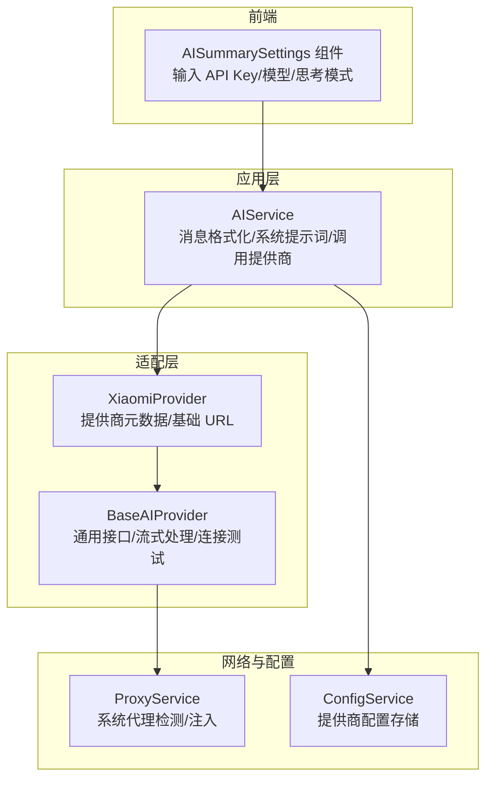
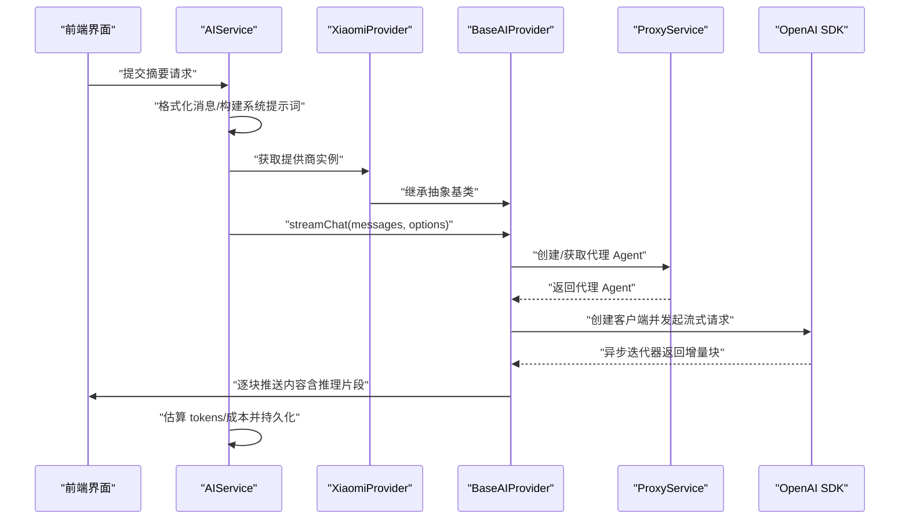
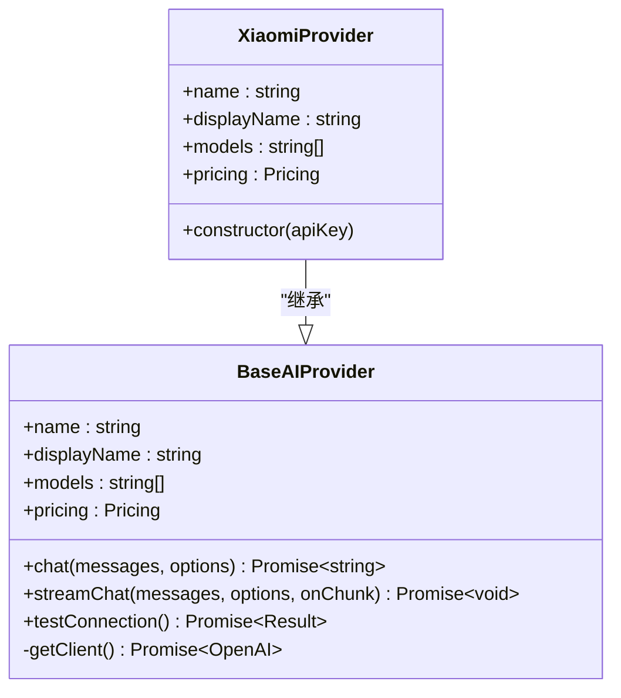
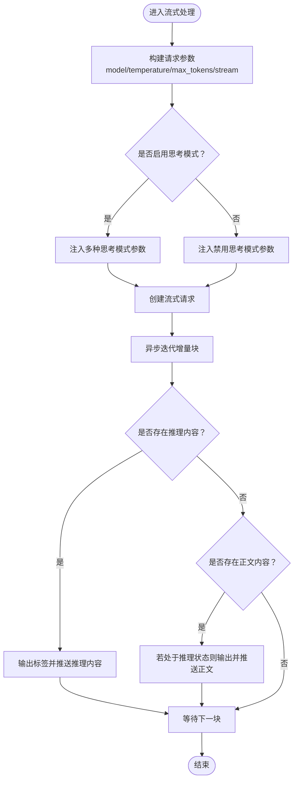
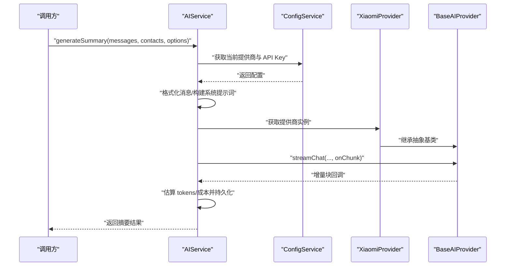
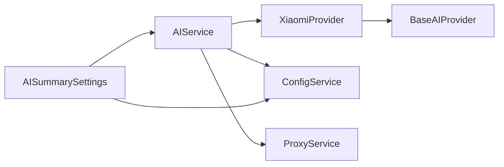

# 小米 PROVIDER

<cite>
**本文引用的文件**
- [electron\services\ai\providers\xiaomi.ts](file://electron\services\ai\providers\xiaomi.ts)
- [electron\services\ai\providers\base.ts](file://electron\services\ai\providers\base.ts)
- [electron\services\ai\aiService.ts](file://electron\services\ai\aiService.ts)
- [electron\services\ai\proxyService.ts](file://electron\services\ai\proxyService.ts)
- [electron\services\config.ts](file://electron\services\config.ts)
- [src\types\ai.ts](file://src\types\ai.ts)
- [src\components\ai\AISummarySettings.tsx](file://src\components\ai\AISummarySettings.tsx)
</cite>

## 目录
1. [简介](#简介)
2. [项目结构](#项目结构)
3. [核心组件](#核心组件)
4. [架构总览](#架构总览)
5. [详细组件分析](#详细组件分析)
6. [依赖关系分析](#依赖关系分析)
7. [性能考虑](#性能考虑)
8. [故障排查指南](#故障排查指南)
9. [结论](#结论)
10. [附录](#附录)

## 简介
本文件面向小米 PROVIDER（Xiaomi MiMo）在 CipherTalk 项目中的集成实现，提供从认证方式、模型支持、特殊参数配置，到请求格式转换、响应解析与流式响应、思考模式支持、错误处理策略与网络连接优化的完整技术说明。同时给出配置示例与使用场景建议，帮助开发者与使用者快速、稳定地接入并使用小米 AI 能力。

## 项目结构
小米 PROVIDER 的集成位于 Electron 主进程的 AI 服务子系统中，采用“统一抽象 + 多提供商适配”的设计：
- 抽象层：统一的 AI 提供商接口与基类，负责通用的请求封装、流式处理、连接测试与代理注入。
- 适配层：各提供商的具体实现（如 XiaomiProvider），负责提供商元数据与基础 URL。
- 应用层：AI 服务聚合器，负责消息格式化、系统提示词构建、调用提供商并持久化结果。
- 前端层：配置界面组件，负责 API Key、模型、思考模式等参数的输入与校验。

**图表来源**
- [electron\services\ai\providers\xiaomi.ts:1-36](file://electron\services\ai\providers\xiaomi.ts#L1-L36)
- [electron\services\ai\providers\base.ts:1-241](file://electron\services\ai\providers\base.ts#L1-L241)
- [electron\services\ai\aiService.ts:1-631](file://electron\services\ai\aiService.ts#L1-L631)
- [electron\services\ai\proxyService.ts:1-151](file://electron\services\ai\proxyService.ts#L1-L151)
- [electron\services\config.ts:1-395](file://electron\services\config.ts#L1-L395)
- [src\components\ai\AISummarySettings.tsx:1-939](file://src\components\ai\AISummarySettings.tsx#L1-L939)

**章节来源**
- [electron\services\ai\providers\xiaomi.ts:1-36](file://electron\services\ai\providers\xiaomi.ts#L1-L36)
- [electron\services\ai\providers\base.ts:1-241](file://electron\services\ai\providers\base.ts#L1-L241)
- [electron\services\ai\aiService.ts:1-631](file://electron\services\ai\aiService.ts#L1-L631)
- [electron\services\ai\proxyService.ts:1-151](file://electron\services\ai\proxyService.ts#L1-L151)
- [electron\services\config.ts:1-395](file://electron\services\config.ts#L1-L395)
- [src\types\ai.ts:1-93](file://src\types\ai.ts#L1-L93)
- [src\components\ai\AISummarySettings.tsx:1-939](file://src\components\ai\AISummarySettings.tsx#L1-L939)

## 核心组件
- XiaomiProvider：小米 PROVIDER 的具体实现，继承自 BaseAIProvider，负责提供商元数据与基础 URL。
- BaseAIProvider：统一的 AI 提供商抽象，提供非流式与流式聊天、连接测试、代理注入等能力。
- AIService：AI 服务聚合器，负责消息格式化、系统提示词构建、调用提供商并持久化结果。
- ProxyService：系统代理检测与注入，解决主进程直连网络问题。
- ConfigService：AI 提供商配置存储与迁移，支持多提供商配置。
- AISummarySettings：前端配置界面，负责 API Key、模型、思考模式等参数输入与校验。

**章节来源**
- [electron\services\ai\providers\xiaomi.ts:26-36](file://electron\services\ai\providers\xiaomi.ts#L26-L36)
- [electron\services\ai\providers\base.ts:49-241](file://electron\services\ai\providers\base.ts#L49-L241)
- [electron\services\ai\aiService.ts:58-631](file://electron\services\ai\aiService.ts#L58-L631)
- [electron\services\ai\proxyService.ts:16-151](file://electron\services\ai\proxyService.ts#L16-L151)
- [electron\services\config.ts:126-395](file://electron\services\config.ts#L126-L395)
- [src\components\ai\AISummarySettings.tsx:1-939](file://src\components\ai\AISummarySettings.tsx#L1-L939)

## 架构总览
小米 PROVIDER 的调用链路如下：
- 前端输入 API Key、模型、思考模式等参数。
- AIService 格式化消息与系统提示词，构建 OpenAI 兼容的 messages 数组。
- XiaomiProvider 继承自 BaseAIProvider，使用提供商基础 URL 与 API Key。
- BaseAIProvider 在每次请求时动态创建 OpenAI 客户端，注入系统代理 Agent。
- 流式响应通过异步迭代器逐块推送，BaseAIProvider 自动处理推理内容与正文内容的分段输出。
- AIService 负责估算 tokens、计算成本、持久化摘要与使用统计。

**图表来源**
- [electron\services\ai\aiService.ts:439-539](file://electron\services\ai\aiService.ts#L439-L539)
- [electron\services\ai\providers\base.ts:106-175](file://electron\services\ai\providers\base.ts#L106-L175)
- [electron\services\ai\providers\xiaomi.ts:26-36](file://electron\services\ai\providers\xiaomi.ts#L26-L36)
- [electron\services\ai\proxyService.ts:83-99](file://electron\services\ai\proxyService.ts#L83-L99)

## 详细组件分析

### XiaomiProvider 组件分析
- 职责：定义小米 PROVIDER 的元数据（ID、名称、显示名、描述、可用模型、定价、网站与 Logo），并以提供商基础 URL 初始化 OpenAI 客户端。
- 关键点：
  - 元数据中声明支持的模型列表与网站信息。
  - 构造函数传入 API Key 与小米 API 基础 URL，交由基类统一处理。

**图表来源**
- [electron\services\ai\providers\base.ts:49-241](file://electron\services\ai\providers\base.ts#L49-L241)
- [electron\services\ai\providers\xiaomi.ts:26-36](file://electron\services\ai\providers\xiaomi.ts#L26-L36)

**章节来源**
- [electron\services\ai\providers\xiaomi.ts:6-21](file://electron\services\ai\providers\xiaomi.ts#L6-L21)
- [electron\services\ai\providers\xiaomi.ts:26-36](file://electron\services\ai\providers\xiaomi.ts#L26-L36)

### BaseAIProvider 组件分析
- 统一接口：定义 AI 提供商的通用能力（非流式聊天、流式聊天、连接测试）。
- 流式处理：支持“思考模式”参数的自适应注入，自动区分推理内容与正文内容，保证输出结构化。
- 代理注入：每次请求动态创建代理 Agent，确保主进程网络访问稳定性。
- 连接测试：内置超时与错误分类，返回是否需要代理的提示。

**图表来源**
- [electron\services\ai\providers\base.ts:106-175](file://electron\services\ai\providers\base.ts#L106-L175)

**章节来源**
- [electron\services\ai\providers\base.ts:49-241](file://electron\services\ai\providers\base.ts#L49-L241)

### AIService 组件分析
- 职责：消息格式化、系统提示词构建、调用提供商、估算 tokens/成本、持久化摘要与使用统计。
- 关键点：
  - 通过 ConfigService 获取当前提供商与 API Key；若未传入则从配置读取。
  - 格式化消息时对不同消息类型进行归类与标记，避免噪声干扰。
  - 流式生成摘要，实时推送增量内容给前端。

**图表来源**
- [electron\services\ai\aiService.ts:439-539](file://electron\services\ai\aiService.ts#L439-L539)
- [electron\services\config.ts:348-385](file://electron\services\config.ts#L348-L385)

**章节来源**
- [electron\services\ai\aiService.ts:58-631](file://electron\services\ai\aiService.ts#L58-L631)
- [electron\services\config.ts:348-385](file://electron\services\config.ts#L348-L385)

### ProxyService 组件分析
- 职责：检测系统代理并注入到 OpenAI SDK 的 httpAgent，解决主进程直连网络问题。
- 关键点：
  - 使用 Electron session.resolveProxy 获取系统代理配置，解析 DIRECT/PROXY/HTTPS/SOCKS5。
  - 缓存代理配置，避免频繁查询。
  - 提供代理测试能力，辅助诊断网络问题。

**章节来源**
- [electron\services\ai\proxyService.ts:16-151](file://electron\services\ai\proxyService.ts#L16-L151)

### 前端配置组件分析
- 职责：提供 API Key、模型、思考模式等参数的输入界面，支持连接测试与配置预设。
- 关键点：
  - 根据当前提供商动态显示 baseURL 输入（如 Ollama/Custom）。
  - 支持“启用思考模式”开关，影响流式输出的推理片段展示。
  - 提供配置预设的保存、加载与管理。

**章节来源**
- [src\components\ai\AISummarySettings.tsx:1-939](file://src\components\ai\AISummarySettings.tsx#L1-L939)
- [src\types\ai.ts:1-93](file://src\types\ai.ts#L1-L93)

## 依赖关系分析
- XiaomiProvider 依赖 BaseAIProvider 提供的统一接口与流式处理能力。
- AIService 依赖 ConfigService 获取提供商配置，依赖 ProxyService 注入代理。
- 前端组件依赖 AISummarySettings 与 ConfigService 进行配置交互。

**图表来源**
- [electron\services\ai\providers\xiaomi.ts:26-36](file://electron\services\ai\providers\xiaomi.ts#L26-L36)
- [electron\services\ai\providers\base.ts:49-241](file://electron\services\ai\providers\base.ts#L49-L241)
- [electron\services\ai\aiService.ts:109-163](file://electron\services\ai\aiService.ts#L109-L163)
- [electron\services\config.ts:348-385](file://electron\services\config.ts#L348-L385)
- [electron\services\ai\proxyService.ts:83-99](file://electron\services\ai\proxyService.ts#L83-L99)
- [src\components\ai\AISummarySettings.tsx:1-939](file://src\components\ai\AISummarySettings.tsx#L1-L939)

**章节来源**
- [electron\services\ai\providers\xiaomi.ts:1-36](file://electron\services\ai\providers\xiaomi.ts#L1-L36)
- [electron\services\ai\providers\base.ts:1-241](file://electron\services\ai\providers\base.ts#L1-L241)
- [electron\services\ai\aiService.ts:1-631](file://electron\services\ai\aiService.ts#L1-L631)
- [electron\services\ai\proxyService.ts:1-151](file://electron\services\ai\proxyService.ts#L1-L151)
- [electron\services\config.ts:1-395](file://electron\services\config.ts#L1-L395)
- [src\components\ai\AISummarySettings.tsx:1-939](file://src\components\ai\AISummarySettings.tsx#L1-L939)

## 性能考虑
- 流式响应：通过异步迭代器逐块推送，降低首屏延迟，提升用户体验。
- 代理注入：每次请求动态创建代理 Agent，确保网络配置变化时即时生效。
- 消息格式化：对不同类型消息进行归类与标记，减少无效内容对 tokens 的消耗。
- tokens 估算：基于字符集估算 tokens，便于成本控制与预算管理。

[本节为通用性能讨论，不直接分析具体文件]

## 故障排查指南
- 连接失败/超时
  - 现象：连接被拒绝、超时、域名解析失败或 4xx/5xx 错误。
  - 处理：根据连接测试返回的 needsProxy 标记，检查系统代理、API Key 有效性与网络连通性。
- 思考模式输出
  - 现象：部分模型无法完全关闭推理功能，仍会输出推理片段。
  - 处理：前端“启用思考模式”开关为默认开启，可按需关闭；后端会自动处理推理片段与正文内容的分段输出。
- 代理问题
  - 现象：主进程直连失败。
  - 处理：使用 ProxyService 的代理检测与测试能力，确认代理可用性。

**章节来源**
- [electron\services\ai\providers\base.ts:177-239](file://electron\services\ai\providers\base.ts#L177-L239)
- [electron\services\ai\proxyService.ts:115-146](file://electron\services\ai\proxyService.ts#L115-L146)

## 结论
小米 PROVIDER 的集成在 CipherTalk 中通过统一抽象与多提供商适配实现了稳定的 OpenAI 兼容调用。其特性包括：
- 明确的提供商元数据与基础 URL 管理；
- 通用的流式处理与思考模式支持；
- 动态代理注入与完善的连接测试；
- 前端直观的配置界面与使用统计。

这些设计使得在不同网络环境与使用场景下，均能可靠地调用小米 AI 能力并获得良好的用户体验。

[本节为总结性内容，不直接分析具体文件]

## 附录

### 认证方式
- API Key：在前端配置页面输入，保存于本地配置数据库；调用时由 AIService 读取并传递给提供商实例。
- Ollama/Custom 特例：Ollama 本地服务可选；Custom 需配置 baseURL。

**章节来源**
- [src\components\ai\AISummarySettings.tsx:512-546](file://src\components\ai\AISummarySettings.tsx#L512-L546)
- [electron\services\config.ts:348-385](file://electron\services\config.ts#L348-L385)

### 模型支持
- 当前支持模型：mimo-v2-flash。
- 可在前端模型选择框中手动输入或选择。

**章节来源**
- [electron\services\ai\providers\xiaomi.ts:11-13](file://electron\services\ai\providers\xiaomi.ts#L11-L13)
- [src\components\ai\AISummarySettings.tsx:605-613](file://src\components\ai\AISummarySettings.tsx#L605-L613)

### 特殊参数配置
- 思考模式（enableThinking）：默认启用，自动注入多种思考模式参数，确保推理内容与正文内容分段输出。
- 温度与最大 tokens：可通过 ChatOptions 传入，基类提供默认值。

**章节来源**
- [electron\services\ai\providers\base.ts:39-44](file://electron\services\ai\providers\base.ts#L39-L44)
- [electron\services\ai\providers\base.ts:123-142](file://electron\services\ai\providers\base.ts#L123-L142)

### 请求格式转换与响应解析
- 请求：AIService 格式化消息与系统提示词，构建 OpenAI 兼容 messages 数组。
- 响应：BaseAIProvider 异步迭代流式响应，自动区分推理内容与正文内容，逐块推送。

**章节来源**
- [electron\services\ai\aiService.ts:457-499](file://electron\services\ai\aiService.ts#L457-L499)
- [electron\services\ai\providers\base.ts:149-175](file://electron\services\ai\providers\base.ts#L149-L175)

### 流式响应实现
- 使用 OpenAI SDK 的流式接口，异步迭代增量块。
- 自动处理推理标签的开启与闭合，保证输出结构化。

**章节来源**
- [electron\services\ai\providers\base.ts:106-175](file://electron\services\ai\providers\base.ts#L106-L175)

### 错误处理策略
- 连接测试：内置超时与错误分类，返回是否需要代理的提示。
- 常见错误：API Key 无效、访问被禁止、请求过于频繁、服务器错误、网络连接失败等。

**章节来源**
- [electron\services\ai\providers\base.ts:177-239](file://electron\services\ai\providers\base.ts#L177-L239)

### 网络连接优化
- 代理注入：每次请求动态创建代理 Agent，确保网络配置变化时即时生效。
- 代理缓存：避免频繁查询系统代理，提升性能。

**章节来源**
- [electron\services\ai\proxyService.ts:26-99](file://electron\services\ai\proxyService.ts#L26-L99)

### 配置示例与使用场景建议
- 配置示例
  - API Key：在前端“API 密钥”输入框中填写。
  - 模型：在“选择模型”中选择或输入 mimo-v2-flash。
  - 思考模式：勾选“启用思考模式”以获得更详细的推理过程。
- 使用场景建议
  - 需要推理过程的复杂分析：启用思考模式。
  - 对速度敏感的场景：可适当降低温度与最大 tokens，减少输出长度。
  - 网络受限环境：确保系统代理可用，或使用代理测试功能验证连通性。

**章节来源**
- [src\components\ai\AISummarySettings.tsx:625-666](file://src\components\ai\AISummarySettings.tsx#L625-L666)
- [electron\services\ai\providers\base.ts:177-239](file://electron\services\ai\providers\base.ts#L177-L239)