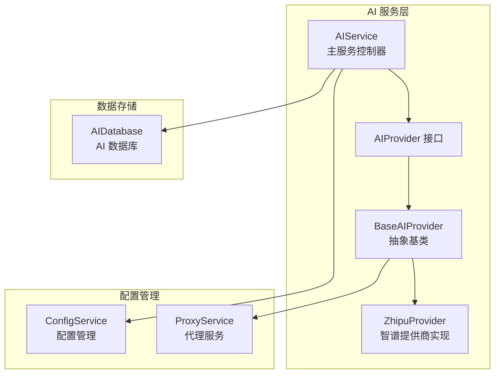
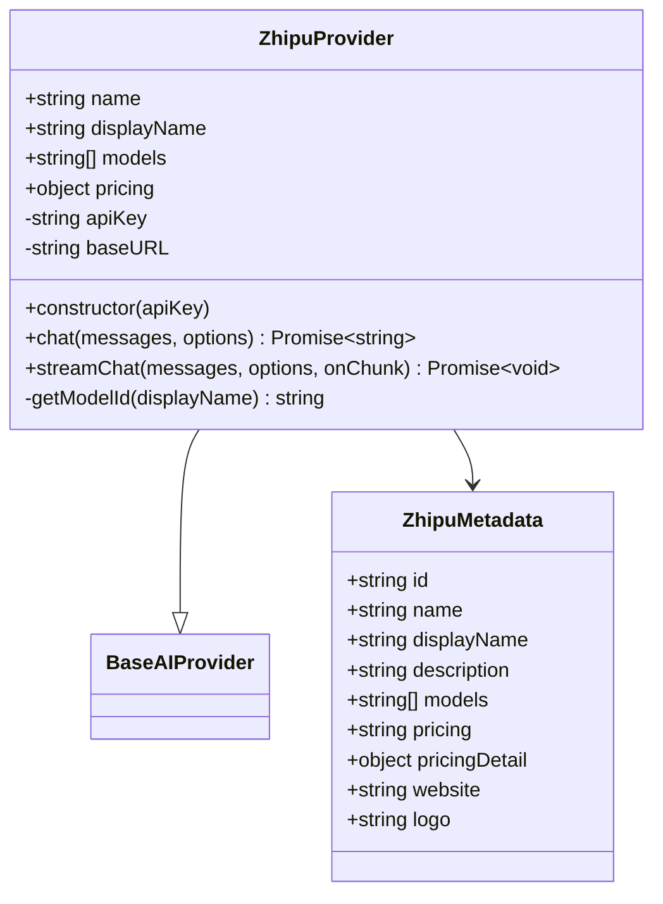
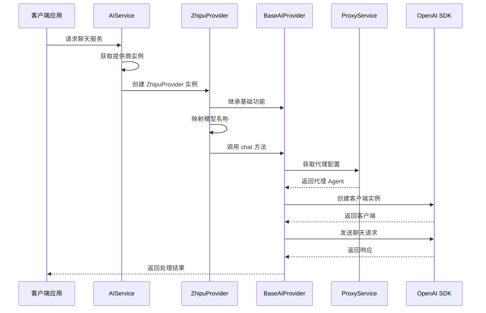
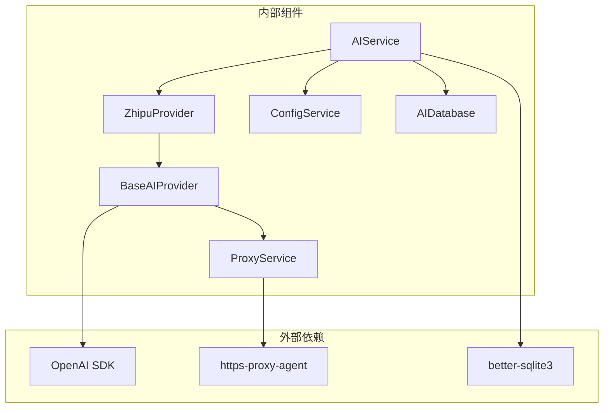

# 智谱清言提供商

<cite>
**本文档引用的文件**
- [zhipu.ts](file://electron/services/ai/providers/zhipu.ts)
- [base.ts](file://electron/services/ai/providers/base.ts)
- [aiService.ts](file://electron/services/ai/aiService.ts)
- [proxyService.ts](file://electron/services/ai/proxyService.ts)
- [config.ts](file://electron/services/config.ts)
- [aiDatabase.ts](file://electron/services/ai/aiDatabase.ts)
</cite>

## 目录
1. [简介](#简介)
2. [项目结构](#项目结构)
3. [核心组件](#核心组件)
4. [架构概览](#架构概览)
5. [详细组件分析](#详细组件分析)
6. [依赖关系分析](#依赖关系分析)
7. [性能考虑](#性能考虑)
8. [故障排除指南](#故障排除指南)
9. [结论](#结论)

## 简介

智谱清言提供商是 CipherTalk 应用程序中的一个 AI 服务集成模块，专门用于与智谱 AI 平台进行交互。该提供商实现了与 OpenAI 兼容的接口适配，支持多种模型，并提供了完整的认证机制、流式响应处理和思考模式支持。

智谱清言提供商基于开放的 OpenAI SDK，通过统一的接口抽象层实现了对智谱 AI API 的无缝集成，为应用程序提供了稳定可靠的 AI 服务能力。

## 项目结构

智谱清言提供商位于 Electron 应用的服务层中，采用模块化的设计架构：

**图表来源**
- [aiService.ts:58-163](file://electron/services/ai/aiService.ts#L58-L163)
- [base.ts:49-66](file://electron/services/ai/providers/base.ts#L49-L66)
- [zhipu.ts:42-50](file://electron/services/ai/providers/zhipu.ts#L42-L50)

**章节来源**
- [aiService.ts:1-631](file://electron/services/ai/aiService.ts#L1-L631)
- [zhipu.ts:1-75](file://electron/services/ai/providers/zhipu.ts#L1-L75)

## 核心组件

### 智谱提供商元数据

智谱提供商定义了完整的元数据信息，包括品牌标识、模型支持列表和定价信息：

**图表来源**
- [zhipu.ts:6-27](file://electron/services/ai/providers/zhipu.ts#L6-L27)
- [zhipu.ts:42-75](file://electron/services/ai/providers/zhipu.ts#L42-L75)

### 模型映射机制

智谱提供商实现了模型名称的自动映射，将用户选择的模型名称转换为智谱 API 可识别的格式：

| 用户模型名称 | 智谱 API 模型 ID |
|-------------|----------------|
| GLM-5 | glm-5 |
| GLM-4.7 Flash | glm-4.7-flash |
| GLM-4.6v Flash | glm-4.6v-flash |
| GLM-4.5 Flash | glm-4.5-flash |
| GLM-4.7 | glm-4.7 |
| GLM-4.6 | glm-4.6 |
| GLM-4.5 | glm-4.5 |

**章节来源**
- [zhipu.ts:29-37](file://electron/services/ai/providers/zhipu.ts#L29-L37)
- [zhipu.ts:55-57](file://electron/services/ai/providers/zhipu.ts#L55-L57)

## 架构概览

智谱清言提供商采用了分层架构设计，通过统一的接口抽象实现了对不同 AI 服务提供商的标准化支持：

**图表来源**
- [aiService.ts:109-163](file://electron/services/ai/aiService.ts#L109-L163)
- [zhipu.ts:62-73](file://electron/services/ai/providers/zhipu.ts#L62-L73)
- [base.ts:92-104](file://electron/services/ai/providers/base.ts#L92-L104)

## 详细组件分析

### 基础提供商抽象

BaseAIProvider 抽象类提供了统一的 AI 服务接口，实现了以下核心功能：

#### 认证机制
- 支持 API Key 认证
- 动态代理配置支持
- 连接测试和错误处理

#### 请求处理流程
- 消息格式化和验证
- 参数配置和默认值设置
- OpenAI SDK 集成

#### 流式响应处理
- 支持增量响应接收
- 思考模式内容分离
- 错误状态恢复

**章节来源**
- [base.ts:49-241](file://electron/services/ai/providers/base.ts#L49-L241)

### 智谱提供商实现

ZhipuProvider 类继承自 BaseAIProvider，专门针对智谱 AI 平台进行了优化：

#### 模型支持
- GLM-5：最新旗舰模型
- GLM-4.7 Flash：高性能闪存版本
- GLM-4.6v Flash：多模态增强版本
- GLM-4.5 Flash：轻量级闪存版本
- GLM-4.7：基础版本
- GLM-4.6：中等性能版本
- GLM-4.5：入门级版本

#### 特殊参数配置
- `reasoning_effort`: 推理强度控制
- `thinking`: 思考模式开关
- `enableThinking`: 思考模式启用标志

**章节来源**
- [zhipu.ts:11-19](file://electron/services/ai/providers/zhipu.ts#L11-L19)
- [zhipu.ts:62-73](file://electron/services/ai/providers/zhipu.ts#L62-L73)

### 代理服务集成

ProxyService 类解决了 Electron 主进程的网络代理问题：

#### 系统代理检测
- 自动检测系统代理配置
- 支持 HTTP、HTTPS、SOCKS5 代理协议
- 代理缓存机制避免频繁查询

#### 代理 Agent 创建
- 动态创建 HttpsProxyAgent 实例
- 支持代理连接测试
- 代理配置热更新

**章节来源**
- [proxyService.ts:16-151](file://electron/services/ai/proxyService.ts#L16-L151)

### 配置管理系统

ConfigService 类提供了完整的配置管理功能：

#### AI 配置结构
- `aiCurrentProvider`: 当前选择的提供商
- `aiProviderConfigs`: 各提供商独立配置
- `aiEnableThinking`: 思考模式全局开关

#### 配置持久化
- SQLite 数据库存储
- 默认值自动初始化
- 配置迁移兼容

**章节来源**
- [config.ts:66-124](file://electron/services/config.ts#L66-L124)
- [config.ts:348-394](file://electron/services/config.ts#L348-L394)

## 依赖关系分析

### 组件耦合度分析

**图表来源**
- [base.ts:1-2](file://electron/services/ai/providers/base.ts#L1-L2)
- [aiService.ts:1-18](file://electron/services/ai/aiService.ts#L1-L18)

### 数据流分析

智谱提供商的数据流遵循以下路径：

1. **请求入口**: AIService 接收用户请求
2. **提供商选择**: 根据配置选择 ZhipuProvider
3. **模型映射**: 将用户模型映射为智谱格式
4. **代理配置**: 动态获取系统代理设置
5. **API 调用**: 通过 OpenAI SDK 发送请求
6. **响应处理**: 流式处理和内容分离
7. **结果存储**: 保存到 AI 数据库

**章节来源**
- [aiService.ts:439-539](file://electron/services/ai/aiService.ts#L439-L539)
- [base.ts:106-175](file://electron/services/ai/providers/base.ts#L106-L175)

## 性能考虑

### 连接优化策略

1. **延迟客户端创建**: 在实际请求时才创建 OpenAI 客户端，避免不必要的资源占用
2. **代理缓存机制**: 系统代理配置缓存 1 分钟，减少频繁查询
3. **超时控制**: 60 秒请求超时，15 秒连接测试超时

### 内存管理

- 流式响应处理避免大内存占用
- 及时清理代理 Agent 实例
- 数据库连接池管理

### 网络优化

- 自动代理检测和配置
- 连接复用和重用
- 错误重试机制

## 故障排除指南

### 常见问题及解决方案

#### 连接问题
- **ECONNREFUSED**: 代理连接被拒绝，检查代理服务器状态
- **ETIMEDOUT**: 连接超时，检查网络连接和代理配置
- **ENOTFOUND**: DNS 解析失败，检查域名可用性和网络设置

#### 认证问题
- **401 Unauthorized**: API Key 无效，重新检查密钥配置
- **403 Forbidden**: 权限不足，检查 API Key 权限设置
- **429 Too Many Requests**: 请求频率过高，降低请求频率

#### 流式响应问题
- **思考模式异常**: 检查 `enableThinking` 参数设置
- **响应中断**: 网络不稳定，启用自动重连机制

**章节来源**
- [base.ts:177-239](file://electron/services/ai/providers/base.ts#L177-L239)
- [proxyService.ts:115-146](file://electron/services/ai/proxyService.ts#L115-L146)

### 调试工具

1. **连接测试**: 使用 `testConnection()` 方法测试 API 可用性
2. **代理测试**: 使用 `testProxy()` 方法测试代理连接
3. **日志记录**: 详细的错误日志和调试信息

## 结论

智谱清言提供商通过精心设计的架构实现了对智谱 AI 平台的完整集成。该实现具有以下特点：

1. **标准化接口**: 基于统一的 AIProvider 接口，便于扩展其他提供商
2. **智能代理**: 自动检测和配置系统代理，解决网络访问问题
3. **流式处理**: 完整支持流式响应，提供良好的用户体验
4. **思考模式**: 支持推理过程展示，满足复杂应用场景需求
5. **配置灵活**: 支持多提供商配置，便于用户选择和切换

该提供商为 CipherTalk 应用程序提供了稳定可靠的 AI 服务能力，为用户提供了优质的智能对话体验。