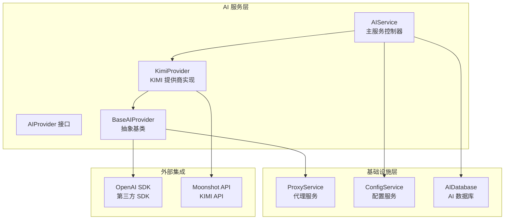
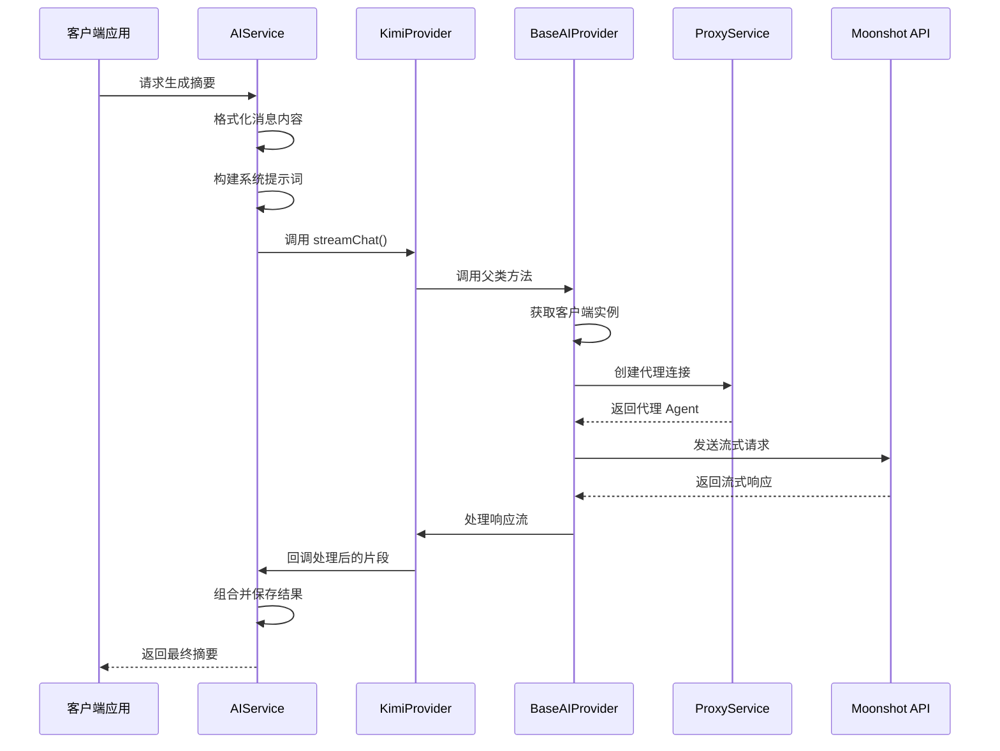
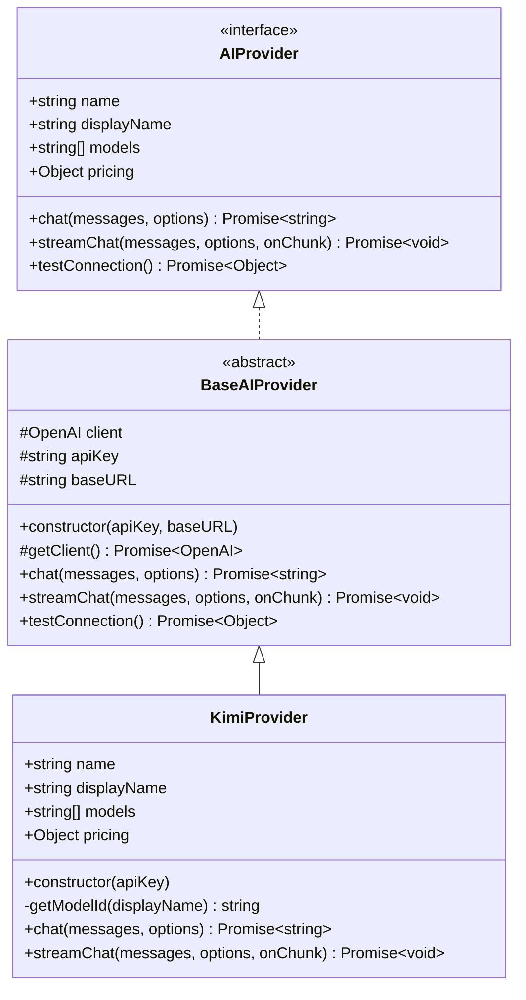
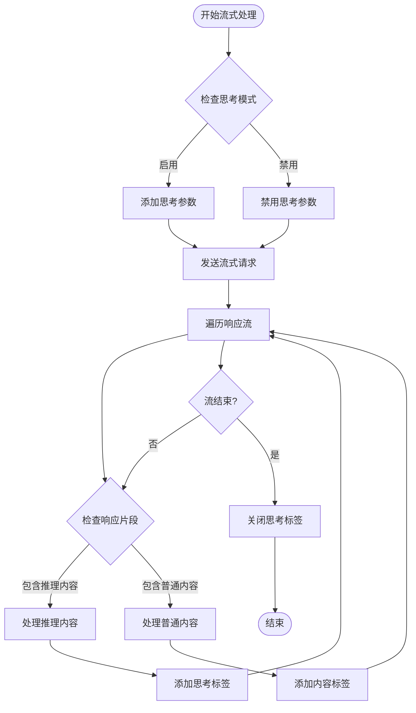
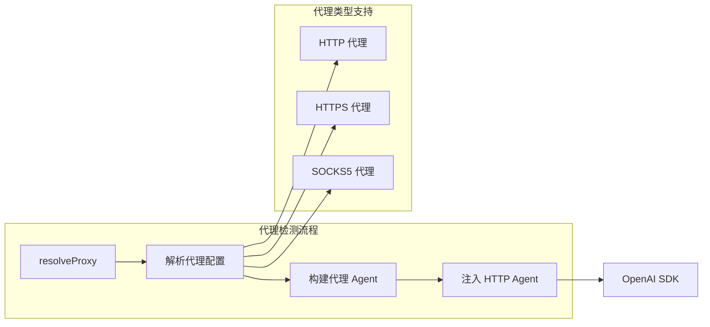
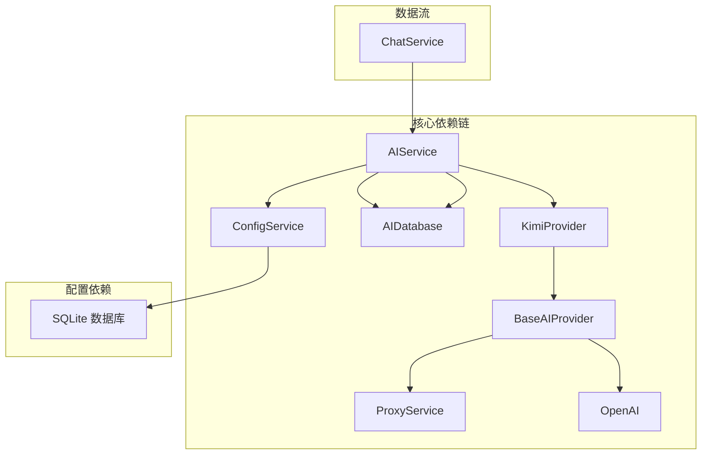

# 月之暗面 KIMI 提供商

<cite>
**本文档引用的文件**
- [kimi.ts](file://electron/services/ai/providers/kimi.ts)
- [base.ts](file://electron/services/ai/providers/base.ts)
- [aiService.ts](file://electron/services/ai/aiService.ts)
- [proxyService.ts](file://electron/services/ai/proxyService.ts)
- [aiDatabase.ts](file://electron/services/ai/aiDatabase.ts)
- [config.ts](file://electron/services/config.ts)
- [chatService.ts](file://electron/services/chatService.ts)
</cite>

## 目录
1. [简介](#简介)
2. [项目结构](#项目结构)
3. [核心组件](#核心组件)
4. [架构概览](#架构概览)
5. [详细组件分析](#详细组件分析)
6. [依赖关系分析](#依赖关系分析)
7. [性能考虑](#性能考虑)
8. [故障排除指南](#故障排除指南)
9. [配置示例](#配置示例)
10. [使用指南](#使用指南)
11. [最佳实践建议](#最佳实践建议)
12. [结论](#结论)

## 简介

月之暗面 KIMI 提供商集成是 CipherTalk 应用程序中一个重要的 AI 服务模块，专门用于集成 Moonshot AI 的 KIMI 模型。该集成实现了完整的认证机制、模型支持、特殊参数配置、请求格式转换、响应解析处理以及流式响应功能。

KIMI 提供商支持多种 Moonshot 模型，包括 Kimi 2.5、Kimi K2 系列、Kimi Latest 以及 Moonshot 系列的不同上下文长度版本。该实现特别注重支持"思考模式"（Thinking Mode），这是 KIMI 模型的一个重要特性，允许模型在生成最终回答之前展示其推理过程。

## 项目结构

CipherTalk 采用模块化的架构设计，AI 服务相关代码主要位于 `electron/services/ai/` 目录下。整体项目结构如下：



**图表来源**
- [aiService.ts:58-163](file://electron/services/ai/aiService.ts#L58-L163)
- [kimi.ts:40-63](file://electron/services/ai/providers/kimi.ts#L40-L63)
- [base.ts:49-90](file://electron/services/ai/providers/base.ts#L49-L90)

**章节来源**
- [aiService.ts:1-631](file://electron/services/ai/aiService.ts#L1-L631)
- [kimi.ts:1-64](file://electron/services/ai/providers/kimi.ts#L1-L64)
- [base.ts:1-241](file://electron/services/ai/providers/base.ts#L1-L241)

## 核心组件

### KimiProvider 类

KimiProvider 是 KIMI 提供商的具体实现，继承自 BaseAIProvider 抽象基类。该类负责：

- **模型映射**：将人类可读的模型名称映射到 Moonshot API 可识别的模型标识符
- **认证管理**：使用 API Key 进行身份验证
- **请求处理**：处理非流式和流式聊天请求
- **配置支持**：支持温度参数、最大令牌数等标准 OpenAI 参数

### BaseAIProvider 抽象基类

BaseAIProvider 提供了所有 AI 提供商的通用功能：

- **统一接口**：定义了 AIProvider 接口规范
- **代理支持**：动态检测和使用系统代理
- **连接测试**：提供网络连接状态检测
- **流式处理**：实现统一的流式响应处理逻辑
- **错误处理**：集中处理各种网络和认证错误

### AIService 主控制器

AIService 是整个 AI 服务的协调中心：

- **提供商管理**：动态创建和管理不同的 AI 提供商实例
- **消息格式化**：将微信聊天记录转换为 AI 可理解的格式
- **摘要生成**：实现完整的摘要生成功能
- **数据库集成**：管理 AI 生成内容的存储和检索

**章节来源**
- [kimi.ts:40-63](file://electron/services/ai/providers/kimi.ts#L40-L63)
- [base.ts:49-241](file://electron/services/ai/providers/base.ts#L49-L241)
- [aiService.ts:58-163](file://electron/services/ai/aiService.ts#L58-L163)

## 架构概览

KIMI 提供商集成采用了分层架构设计，确保了良好的可维护性和扩展性：



**图表来源**
- [aiService.ts:439-539](file://electron/services/ai/aiService.ts#L439-L539)
- [base.ts:106-175](file://electron/services/ai/providers/base.ts#L106-L175)
- [proxyService.ts:83-99](file://electron/services/ai/proxyService.ts#L83-L99)

## 详细组件分析

### KimiProvider 实现分析

KimiProvider 类的设计体现了良好的面向对象原则：



**图表来源**
- [base.ts:7-34](file://electron/services/ai/providers/base.ts#L7-L34)
- [base.ts:49-66](file://electron/services/ai/providers/base.ts#L49-L66)
- [kimi.ts:40-63](file://electron/services/ai/providers/kimi.ts#L40-L63)

#### 模型支持矩阵

KimiProvider 支持以下 Moonshot 模型：

| 模型名称 | 模型标识符 | 上下文长度 | 特殊功能 |
|---------|-----------|-----------|----------|
| Kimi 2.5 | kimi-k2.5 | 标准 | 基础推理 |
| Kimi K2 (0711) | kimi-k2-0711-preview | 标准 | 预览版 |
| Kimi K2 (0905) | kimi-k2-0905-preview | 标准 | 预览版 |
| Kimi K2 Thinking | kimi-k2-thinking | 标准 | 思考模式 |
| Kimi K2 Thinking Turbo | kimi-k2-thinking-turbo | 标准 | 思考模式加速 |
| Kimi K2 Turbo Preview | kimi-k2-turbo-preview | 标准 | 加速预览 |
| Kimi K2 Turbo | kimi-k2-turbo | 标准 | 加速版 |
| Kimi Latest | kimi-latest | 最新 | 最新模型 |
| Moonshot 128K | moonshot-v1-128k | 128K | 超长上下文 |
| Moonshot 32K | moonshot-v1-32k | 32K | 长上下文 |
| Moonshot 8K | moonshot-v1-8k | 8K | 标准上下文 |
| Moonshot 8K Flash | moonshot-v1-8k-flash | 8K | 快速响应 |
| Moonshot Auto | moonshot-v1-auto | 自适应 | 自动选择 |

**章节来源**
- [kimi.ts:6-19](file://electron/services/ai/providers/kimi.ts#L6-L19)
- [kimi.ts:21-35](file://electron/services/ai/providers/kimi.ts#L21-L35)

### 流式响应处理机制

KIMI 提供商实现了复杂的流式响应处理，特别支持"思考模式"：



**图表来源**
- [base.ts:123-175](file://electron/services/ai/providers/base.ts#L123-L175)

#### 思考模式实现细节

思考模式的实现采用了智能的标签切换机制：

1. **推理内容检测**：自动识别 `reasoning_content` 字段
2. **标签管理**：使用特定的 Unicode 符号作为标签边界
3. **内容分离**：将推理过程和最终答案分开处理
4. **状态跟踪**：维护当前输出状态（推理中/内容中）

**章节来源**
- [base.ts:147-175](file://electron/services/ai/providers/base.ts#L147-L175)

### 代理服务集成

为了支持全球网络访问，系统集成了智能代理检测和管理：



**图表来源**
- [proxyService.ts:26-76](file://electron/services/ai/proxyService.ts#L26-L76)
- [proxyService.ts:83-99](file://electron/services/ai/proxyService.ts#L83-L99)

**章节来源**
- [proxyService.ts:16-151](file://electron/services/ai/proxyService.ts#L16-L151)

## 依赖关系分析

### 外部依赖

KIMI 提供商集成依赖于以下关键外部组件：

| 依赖项 | 版本 | 用途 | 重要性 |
|--------|------|------|--------|
| openai | ^4.0.0 | OpenAI SDK | 核心 |
| https-proxy-agent | ^7.0.0 | 代理支持 | 高 |
| better-sqlite3 | ^8.0.0 | 数据持久化 | 高 |
| electron | latest | 桌面应用框架 | 核心 |

### 内部依赖关系



**图表来源**
- [aiService.ts:1-18](file://electron/services/ai/aiService.ts#L1-L18)
- [base.ts:1-2](file://electron/services/ai/providers/base.ts#L1-L2)

**章节来源**
- [aiService.ts:1-18](file://electron/services/ai/aiService.ts#L1-L18)
- [base.ts:1-2](file://electron/services/ai/providers/base.ts#L1-L2)

## 性能考虑

### 连接优化策略

1. **延迟客户端创建**：BaseAIProvider 在每次请求时才创建 OpenAI 客户端，确保使用最新的代理配置
2. **代理缓存机制**：ProxyService 缓存代理配置，减少频繁查询系统代理的开销
3. **超时控制**：设置合理的超时时间（60秒请求超时，15秒连接超时）

### 内存管理

1. **流式处理**：避免将整个响应加载到内存中，使用异步迭代器逐块处理
2. **数据库连接池**：合理管理 SQLite 连接，避免资源泄漏
3. **缓存策略**：实现智能缓存，避免重复计算和网络请求

### 网络优化

1. **代理优先级**：优先使用系统代理，提高连接成功率
2. **错误重试**：实现指数退避重试机制
3. **连接复用**：在可能的情况下复用 HTTP 连接

## 故障排除指南

### 常见问题及解决方案

#### 认证问题

| 错误代码 | 错误信息 | 可能原因 | 解决方案 |
|----------|----------|----------|----------|
| 401 | Unauthorized | API Key 无效 | 检查 API Key 格式和有效期 |
| 403 | Forbidden | 权限不足 | 确认账户权限和配额 |
| 429 | Too Many Requests | 请求频率过高 | 降低请求频率或升级套餐 |
| 500/502/503 | Server Error | 服务器故障 | 稍后重试或检查服务状态 |

#### 网络连接问题

| 错误类型 | 错误信息 | 解决方案 |
|----------|----------|----------|
| ECONNREFUSED | 连接被拒绝 | 检查代理设置或网络连接 |
| ETIMEDOUT | 连接超时 | 增加超时时间或检查网络质量 |
| ENOTFOUND/getaddrinfo | 域名解析失败 | 检查 DNS 设置或使用代理 |
| CONNECTION_TIMEOUT | 连接超时 | 开启代理或检查防火墙设置 |

#### 思考模式问题

| 问题 | 症状 | 解决方案 |
|------|------|----------|
| 思考内容过多 | 输出包含大量推理过程 | 设置 `enableThinking: false` |
| 思考内容过少 | 缺少推理过程 | 确认模型支持思考模式 |
| 标签显示异常 | Unicode 符号显示问题 | 检查终端编码设置 |

**章节来源**
- [base.ts:193-239](file://electron/services/ai/providers/base.ts#L193-L239)

### 调试技巧

1. **启用详细日志**：检查控制台输出的详细信息
2. **网络监控**：使用开发者工具监控网络请求
3. **代理测试**：使用 ProxyService.testProxy() 方法测试代理连接
4. **配置验证**：通过 ConfigService.validateConfig() 验证配置正确性

## 配置示例

### 基本配置

```json
{
  "aiCurrentProvider": "kimi",
  "aiProviderConfigs": {
    "kimi": {
      "apiKey": "sk-xxxxxxxxxxxxxxxxxxxxxxxxxxxxxxxx",
      "model": "moonshot-v1-128k"
    }
  },
  "aiEnableThinking": true,
  "aiMessageLimit": 3000
}
```

### 高级配置

```json
{
  "aiCurrentProvider": "kimi",
  "aiProviderConfigs": {
    "kimi": {
      "apiKey": "sk-xxxxxxxxxxxxxxxxxxxxxxxxxxxxxxxx",
      "model": "kimi-k2-thinking-turbo",
      "baseURL": "https://api.moonshot.cn/v1"
    }
  },
  "aiEnableThinking": true,
  "aiSummaryDetail": "detailed",
  "aiSystemPromptPreset": "decision-focus"
}
```

### 环境变量配置

```bash
# 设置代理（如果需要）
export HTTP_PROXY=http://127.0.0.1:7890
export HTTPS_PROXY=http://127.0.0.1:7890

# 设置 API Key
export MOONSHOT_API_KEY=sk-xxxxxxxxxxxxxxxxxxxxxxxxxxxxxxxx
```

**章节来源**
- [config.ts:65-80](file://electron/services/config.ts#L65-L80)
- [config.ts:347-394](file://electron/services/config.ts#L347-L394)

## 使用指南

### 基本使用步骤

1. **配置 API Key**
   - 在设置中添加 Moonshot API Key
   - 选择合适的模型（推荐 moonshot-v1-128k）

2. **启用思考模式**
   - 在设置中启用 "显示思考过程"
   - 适用于需要理解推理过程的场景

3. **生成摘要**
   - 选择会话和时间范围
   - 点击生成按钮等待结果
   - 查看生成的历史记录

### 高级使用技巧

#### 优化模型选择

| 使用场景 | 推荐模型 | 原因 |
|----------|----------|------|
| 简短对话 | moonshot-v1-8k | 响应速度快 |
| 长文档分析 | moonshot-v1-128k | 上下文容量大 |
| 需要推理 | kimi-k2-thinking | 支持思考模式 |
| 性能优先 | kimi-k2-turbo | 响应速度最快 |

#### 参数调优

```typescript
const options = {
  model: 'moonshot-v1-128k',
  temperature: 0.7,           // 默认值，平衡创造性和准确性
  maxTokens: 2048,            // 控制输出长度
  enableThinking: true,       // 启用思考模式
  systemPromptPreset: 'default' // 系统提示词预设
};
```

**章节来源**
- [aiService.ts:439-539](file://electron/services/ai/aiService.ts#L439-L539)

### 错误处理最佳实践

1. **优雅降级**：当 API 调用失败时，提供备选方案
2. **用户反馈**：及时向用户提供清晰的错误信息
3. **重试机制**：实现智能重试，避免用户频繁操作
4. **日志记录**：详细记录错误信息便于调试

## 最佳实践建议

### 性能优化

1. **合理设置超时时间**：根据网络环境调整超时参数
2. **使用合适的模型**：根据需求选择最合适的模型
3. **控制消息数量**：避免一次性处理过多消息
4. **启用缓存**：利用内置缓存机制减少重复计算

### 安全考虑

1. **API Key 保护**：确保 API Key 不被泄露
2. **网络通信安全**：使用 HTTPS 连接
3. **数据隐私**：注意处理敏感聊天内容
4. **代理安全**：谨慎使用代理，避免数据泄露

### 可靠性保障

1. **错误监控**：建立完善的错误监控机制
2. **备份策略**：定期备份重要数据
3. **版本管理**：跟踪 API 版本变化
4. **兼容性测试**：定期测试不同模型的兼容性

### 用户体验优化

1. **进度反馈**：提供清晰的处理进度指示
2. **取消功能**：允许用户取消长时间运行的操作
3. **批量处理**：支持批量生成摘要
4. **个性化设置**：允许用户自定义输出格式

## 结论

月之暗面 KIMI 提供商集成展现了现代 AI 应用开发的最佳实践。通过模块化设计、完善的错误处理、智能的代理支持和高效的流式处理机制，该集成为用户提供了稳定可靠的 AI 功能。

该实现的主要优势包括：

1. **完整的功能覆盖**：支持认证、模型管理、流式处理、思考模式等核心功能
2. **良好的扩展性**：基于抽象基类的设计便于添加新的 AI 提供商
3. **强大的错误处理**：全面的错误检测和用户友好的错误信息
4. **智能的网络优化**：代理支持和连接管理确保稳定的网络通信
5. **丰富的配置选项**：灵活的配置系统满足不同用户需求

随着 AI 技术的不断发展，该集成将继续演进，为用户提供更强大、更智能的 AI 助手功能。