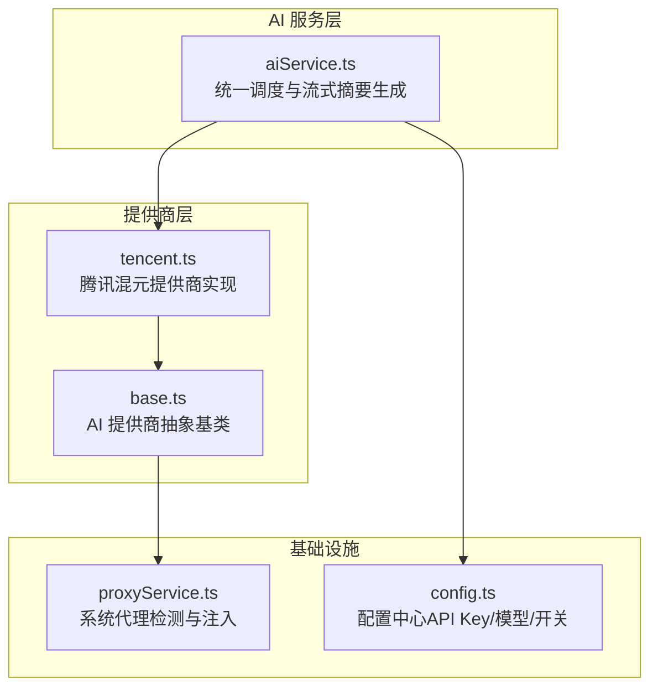
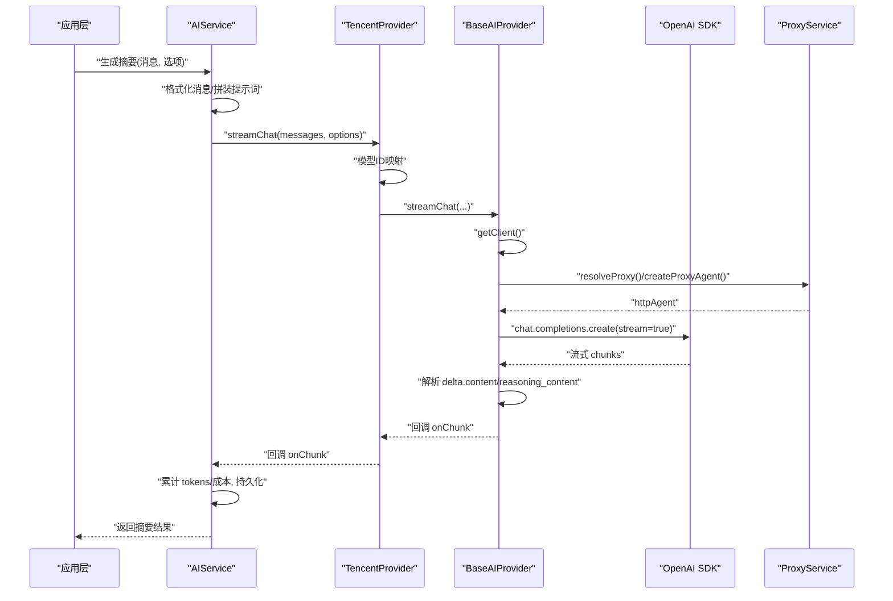
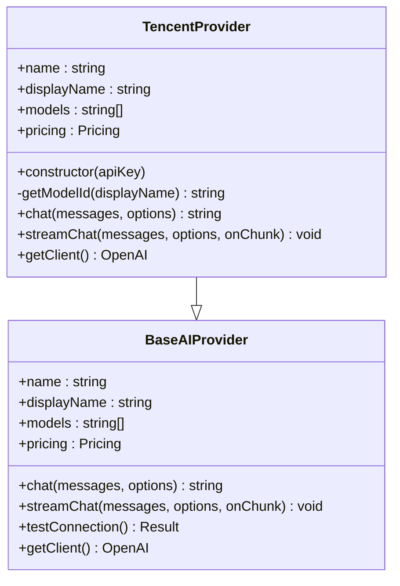
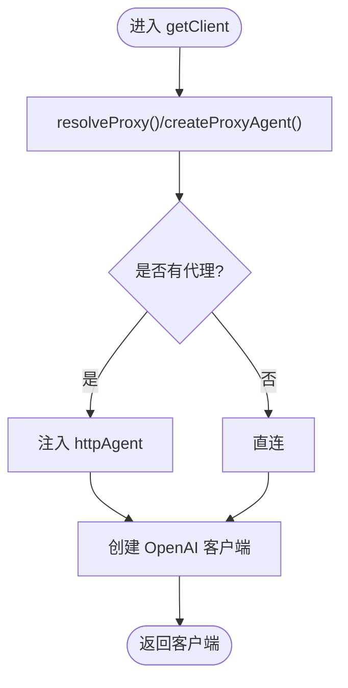
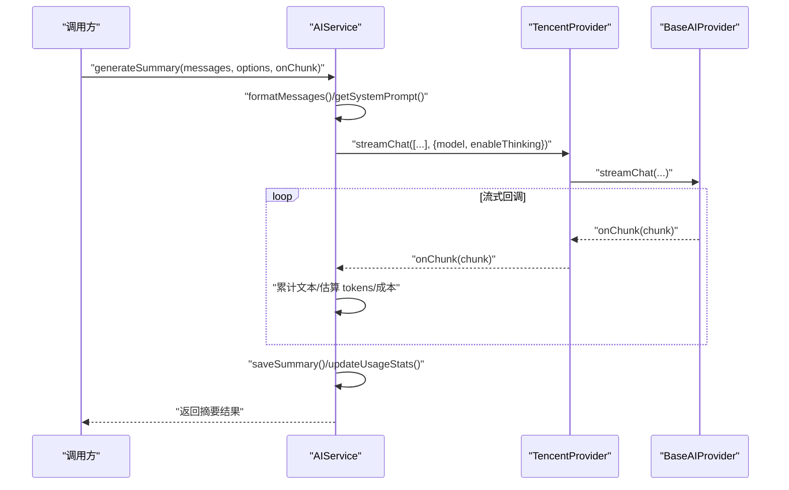
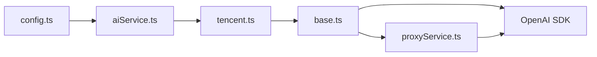

# 腾讯混元提供商

<cite>
**本文档引用的文件**
- [electron\services\ai\providers\tencent.ts](file://electron\services\ai\providers\tencent.ts)
- [electron\services\ai\providers\base.ts](file://electron\services\ai\providers\base.ts)
- [electron\services\ai\aiService.ts](file://electron\services\ai\aiService.ts)
- [electron\services\ai\proxyService.ts](file://electron\services\ai\proxyService.ts)
- [electron\services\config.ts](file://electron\services\config.ts)
- [README.md](file://README.md)
</cite>

## 目录
1. [简介](#简介)
2. [项目结构](#项目结构)
3. [核心组件](#核心组件)
4. [架构总览](#架构总览)
5. [详细组件分析](#详细组件分析)
6. [依赖关系分析](#依赖关系分析)
7. [性能考虑](#性能考虑)
8. [故障排查指南](#故障排查指南)
9. [结论](#结论)
10. [附录](#附录)

## 简介
本文件面向“腾讯混元（Tencent HunYuan）提供商”的技术集成与使用，围绕以下目标展开：
- 详解认证机制与 API Key 格式适配
- 模型选择策略与模型 ID 映射
- 请求参数适配与特殊参数配置（如推理模式）
- 响应处理逻辑与流式响应实现
- 与 OpenAI 标准的兼容性处理
- 错误码映射与网络异常处理
- 配置示例、使用指南与性能优化建议

本项目通过统一的 AI 服务层与提供商抽象层，将腾讯混元作为 OpenAI 兼容接口的提供商接入，具备良好的扩展性与一致性。

章节来源
- [README.md:163-183](file://README.md#L163-L183)

## 项目结构
与腾讯混元提供商相关的关键文件与职责如下：
- 提供商实现：提供腾讯混元的元数据、模型映射、认证与请求适配
- 基类抽象：封装 OpenAI SDK 客户端、代理注入、连接测试、流式处理等通用能力
- AI 服务：统一调度提供商、组装提示词、流式输出汇总、成本估算与持久化
- 代理服务：在 Electron 主进程中自动发现系统代理并注入 HTTP Agent
- 配置服务：集中管理各提供商的 API Key、默认模型、启用思考模式等

图示来源
- [electron\services\ai\aiService.ts:58-163](file://electron\services\ai\aiService.ts#L58-L163)
- [electron\services\ai\providers\tencent.ts:43-102](file://electron\services\ai\providers\tencent.ts#L43-L102)
- [electron\services\ai\providers\base.ts:49-90](file://electron\services\ai\providers\base.ts#L49-L90)
- [electron\services\ai\proxyService.ts:16-99](file://electron\services\ai\proxyService.ts#L16-L99)
- [electron\services\config.ts:65-80](file://electron\services\config.ts#L65-L80)

章节来源
- [electron\services\ai\providers\tencent.ts:1-103](file://electron\services\ai\providers\tencent.ts#L1-L103)
- [electron\services\ai\providers\base.ts:1-241](file://electron\services\ai\providers\base.ts#L1-L241)
- [electron\services\ai\aiService.ts:1-631](file://electron\services\ai\aiService.ts#L1-L631)
- [electron\services\ai\proxyService.ts:1-151](file://electron\services\ai\proxyService.ts#L1-L151)
- [electron\services\config.ts:1-395](file://electron\services\config.ts#L1-L395)

## 核心组件
- 腾讯混元提供商（TencentProvider）
  - 元数据：提供商标识、显示名、模型列表、定价信息、官网与 Logo
  - 模型映射：将展示名映射为实际可用的 HunYuan 模型 ID
  - 认证适配：支持两种 API Key 格式，内部转换为兼容格式
  - 请求适配：在 chat/streamChat 中注入映射后的模型 ID
- 基类抽象（BaseAIProvider）
  - OpenAI SDK 客户端创建与代理注入
  - 非流式与流式聊天实现，统一温度、最大 Token、推理模式参数
  - 连接测试与错误分类（超时、域名解析、4xx/5xx、代理需求）
- AI 服务（AIService）
  - 统一获取提供商实例、拼装系统提示词与用户提示词
  - 流式生成摘要、累计 tokens 与成本估算、持久化与使用统计
- 代理服务（ProxyService）
  - 通过 Electron session.resolveProxy 获取系统代理
  - 构建 HttpsProxyAgent 并注入到 OpenAI SDK
- 配置服务（ConfigService）
  - 存储各提供商的 API Key、默认模型、是否启用思考模式等

章节来源
- [electron\services\ai\providers\tencent.ts:6-26](file://electron\services\ai\providers\tencent.ts#L6-L26)
- [electron\services\ai\providers\tencent.ts:28-35](file://electron\services\ai\providers\tencent.ts#L28-L35)
- [electron\services\ai\providers\tencent.ts:49-52](file://electron\services\ai\providers\tencent.ts#L49-L52)
- [electron\services\ai\providers\tencent.ts:64-85](file://electron\services\ai\providers\tencent.ts#L64-L85)
- [electron\services\ai\providers\tencent.ts:90-101](file://electron\services\ai\providers\tencent.ts#L90-L101)
- [electron\services\ai\providers\base.ts:49-90](file://electron\services\ai\providers\base.ts#L49-L90)
- [electron\services\ai\providers\base.ts:92-175](file://electron\services\ai\providers\base.ts#L92-L175)
- [electron\services\ai\providers\base.ts:177-241](file://electron\services\ai\providers\base.ts#L177-L241)
- [electron\services\ai\aiService.ts:58-163](file://electron\services\ai\aiService.ts#L58-L163)
- [electron\services\ai\aiService.ts:439-539](file://electron\services\ai\aiService.ts#L439-L539)
- [electron\services\ai\proxyService.ts:26-99](file://electron\services\ai\proxyService.ts#L26-L99)
- [electron\services\config.ts:348-385](file://electron\services\config.ts#L348-L385)

## 架构总览
腾讯混元提供商通过 OpenAI 兼容接口对接 HunYuan，整体流程如下：
- 应用层发起摘要生成请求
- AIService 组装系统提示词与用户提示词
- 选择 TencentProvider，注入映射后的模型 ID
- BaseAIProvider 创建 OpenAI 客户端并注入代理
- 流式返回 delta，处理推理内容与正文内容，统一回调给上层
- AIService 汇总流式片段，估算 tokens 与成本，持久化并更新统计

图示来源
- [electron\services\ai\aiService.ts:439-539](file://electron\services\ai\aiService.ts#L439-L539)
- [electron\services\ai\providers\tencent.ts:90-101](file://electron\services\ai\providers\tencent.ts#L90-L101)
- [electron\services\ai\providers\base.ts:106-175](file://electron\services\ai\providers\base.ts#L106-L175)
- [electron\services\ai\proxyService.ts:26-99](file://electron\services\ai\proxyService.ts#L26-L99)

## 详细组件分析

### 腾讯混元提供商（TencentProvider）
- 元数据与模型映射
  - 提供商元数据包含展示名、模型列表与定价信息
  - 展示名到 HunYuan 实际模型 ID 的映射，确保请求使用正确模型
- 认证适配
  - 支持两种 API Key 格式：SecretId|SecretKey 或 SecretId;SecretKey
  - 在 getClient 期间临时替换 apiKey，保证父类 BaseAIProvider 的统一处理
- 请求适配
  - chat/streamChat 重写：在调用父类前，先将模型名映射为实际模型 ID
- 流式处理
  - 通过父类统一的流式实现，自动处理推理内容与正文内容的分段输出

图示来源
- [electron\services\ai\providers\base.ts:49-90](file://electron\services\ai\providers\base.ts#L49-L90)
- [electron\services\ai\providers\tencent.ts:43-102](file://electron\services\ai\providers\tencent.ts#L43-L102)

章节来源
- [electron\services\ai\providers\tencent.ts:6-26](file://electron\services\ai\providers\tencent.ts#L6-L26)
- [electron\services\ai\providers\tencent.ts:28-35](file://electron\services\ai\providers\tencent.ts#L28-L35)
- [electron\services\ai\providers\tencent.ts:49-52](file://electron\services\ai\providers\tencent.ts#L49-L52)
- [electron\services\ai\providers\tencent.ts:64-85](file://electron\services\ai\providers\tencent.ts#L64-L85)
- [electron\services\ai\providers\tencent.ts:90-101](file://electron\services\ai\providers\tencent.ts#L90-L101)

### 基类抽象（BaseAIProvider）
- 客户端创建与代理注入
  - 每次请求动态创建客户端，确保使用最新代理配置
  - 通过 ProxyService 获取系统代理并注入 httpAgent
- 非流式与流式聊天
  - 统一温度、最大 Token 参数；推理模式参数按不同风格尝试注入
  - 流式处理 delta，分别输出 content 与 reasoning_content，并自动包裹思考标签
- 连接测试
  - 使用 models.list() 进行连通性测试，结合超时与常见错误码进行分类
  - 自动识别是否需要代理（ECONNREFUSED/ETIMEDOUT/ENOTFOUND/域名解析失败等）

图示来源
- [electron\services\ai\providers\base.ts:71-90](file://electron\services\ai\providers\base.ts#L71-L90)
- [electron\services\ai\proxyService.ts:26-99](file://electron\services\ai\proxyService.ts#L26-L99)

章节来源
- [electron\services\ai\providers\base.ts:71-90](file://electron\services\ai\providers\base.ts#L71-L90)
- [electron\services\ai\providers\base.ts:92-175](file://electron\services\ai\providers\base.ts#L92-L175)
- [electron\services\ai\providers\base.ts:177-241](file://electron\services\ai\providers\base.ts#L177-L241)

### AI 服务（AIService）
- 提供商选择与实例化
  - 依据配置选择 tencent 提供商，或从外部传入 API Key
- 摘要生成流程
  - 格式化消息、拼装系统提示词与用户提示词
  - 调用提供商的流式接口，逐块回调并累计文本
  - 估算 tokens 与成本，保存到数据库并更新使用统计
- 连接测试
  - 通过提供商的 testConnection 返回错误提示与是否需要代理

图示来源
- [electron\services\ai\aiService.ts:439-539](file://electron\services\ai\aiService.ts#L439-L539)
- [electron\services\ai\providers\base.ts:106-175](file://electron\services\ai\providers\base.ts#L106-L175)
- [electron\services\ai\providers\tencent.ts:90-101](file://electron\services\ai\providers\tencent.ts#L90-L101)

章节来源
- [electron\services\ai\aiService.ts:58-163](file://electron\services\ai\aiService.ts#L58-L163)
- [electron\services\ai\aiService.ts:439-539](file://electron\services\ai\aiService.ts#L439-L539)

### 代理服务（ProxyService）
- 系统代理检测
  - 通过 Electron session.resolveProxy 获取系统代理规则
  - 解析 PROXY/HTTPS/SOCKS5 等格式，构造代理 URL
- 代理 Agent 注入
  - 使用 https-proxy-agent 创建 HttpsProxyAgent
  - 在 BaseAIProvider 中注入到 OpenAI SDK 的 httpAgent
- 缓存与测试
  - 代理地址缓存 1 分钟，避免频繁查询
  - 提供代理连通性测试方法

章节来源
- [electron\services\ai\proxyService.ts:26-99](file://electron\services\ai\proxyService.ts#L26-L99)

### 配置服务（ConfigService）
- AI 配置项
  - 当前提供商、各提供商的 API Key 与默认模型
  - 是否启用思考模式、消息条数限制、摘要详细程度等
- 便捷方法
  - 获取/设置当前提供商与提供商配置
  - 获取消息限制与缓存基础路径

章节来源
- [electron\services\config.ts:65-80](file://electron\services\config.ts#L65-L80)
- [electron\services\config.ts:348-385](file://electron\services\config.ts#L348-L385)

## 依赖关系分析
- 组件耦合
  - TencentProvider 依赖 BaseAIProvider 的客户端创建与流式处理能力
  - AIService 依赖 ConfigService 获取提供商配置，依赖各 Provider 实现
  - BaseAIProvider 依赖 ProxyService 注入代理 Agent
- 外部依赖
  - OpenAI SDK：统一的聊天补全接口
  - https-proxy-agent：HTTP/HTTPS 代理 Agent
  - Electron session：系统代理解析

图示来源
- [electron\services\ai\aiService.ts:109-162](file://electron\services\ai\aiService.ts#L109-L162)
- [electron\services\ai\providers\tencent.ts:43-102](file://electron\services\ai\providers\tencent.ts#L43-L102)
- [electron\services\ai\providers\base.ts:71-90](file://electron\services\ai\providers\base.ts#L71-L90)
- [electron\services\ai\proxyService.ts:83-99](file://electron\services\ai\proxyService.ts#L83-L99)

章节来源
- [electron\services\ai\aiService.ts:109-162](file://electron\services\ai\aiService.ts#L109-L162)
- [electron\services\ai\providers\base.ts:71-90](file://electron\services\ai\providers\base.ts#L71-L90)
- [electron\services\ai\proxyService.ts:83-99](file://electron\services\ai\proxyService.ts#L83-L99)

## 性能考虑
- 代理缓存
  - ProxyService 对系统代理地址缓存 1 分钟，减少 resolveProxy 调用开销
- 延迟创建客户端
  - BaseAIProvider 在每次请求时创建客户端，确保代理配置实时生效
- 流式处理
  - 通过流式接口逐步输出，降低首字节延迟与内存占用
- Token 估算
  - AIService 提供简单估算方法，便于成本控制与预算提示

章节来源
- [electron\services\ai\proxyService.ts:17-20](file://electron\services\ai\proxyService.ts#L17-L20)
- [electron\services\ai\providers\base.ts:63-66](file://electron\services\ai\providers\base.ts#L63-L66)
- [electron\services\ai\aiService.ts:412-417](file://electron\services\ai\aiService.ts#L412-L417)

## 故障排查指南
- 连接失败与代理需求
  - 常见错误：ECONNREFUSED/ETIMEDOUT/ENOTFOUND/getaddrinfo
  - BaseAIProvider 的 testConnection 会根据错误类型返回“需要代理”提示
- API Key 无效/权限不足
  - 401/403/429/500/502/503 等错误会被分类并给出相应提示
- 网络异常处理
  - 超时（15 秒）竞速模型列表查询，避免长时间阻塞
  - 代理不可用时自动降级为直连并记录日志
- 建议操作
  - 开启系统代理或检查网络连通性
  - 核对 API Key 格式与权限范围
  - 若仍失败，尝试更换模型或调整温度/最大 Token 参数

章节来源
- [electron\services\ai\providers\base.ts:177-241](file://electron\services\ai\providers\base.ts#L177-L241)

## 结论
腾讯混元提供商通过 OpenAI 兼容接口实现了与项目统一抽象层的无缝集成。其关键优势在于：
- 明确的模型映射与认证适配，降低接入复杂度
- 基于流式的响应处理，兼顾实时性与用户体验
- 完备的错误分类与代理注入，提升网络环境适应性
- 与 AIService 的深度整合，提供从提示词到摘要产出的一体化流程

## 附录

### 配置示例与使用指南
- 配置项
  - 当前提供商：aiCurrentProvider
  - 各提供商配置：aiProviderConfigs（包含 apiKey、model）
  - 是否启用思考模式：aiEnableThinking
- 使用步骤
  - 在设置中选择“tencent”提供商
  - 输入 API Key（支持 SecretId|SecretKey 或 SecretId;SecretKey 两种格式）
  - 选择模型（将自动映射为 HunYuan 实际模型 ID）
  - 启用“思考模式”可显示推理过程（如模型支持）
- 注意事项
  - 若网络受限，确保系统代理可用或开启代理
  - 不同模型的推理能力与输出稳定性略有差异，可根据场景选择

章节来源
- [electron\services\config.ts:65-80](file://electron\services\config.ts#L65-L80)
- [electron\services\config.ts:348-385](file://electron\services\config.ts#L348-L385)
- [electron\services\ai\providers\tencent.ts:49-52](file://electron\services\ai\providers\tencent.ts#L49-L52)
- [electron\services\ai\providers\tencent.ts:64-85](file://electron\services\ai\providers\tencent.ts#L64-L85)
- [electron\services\ai\providers\base.ts:123-142](file://electron\services\ai\providers\base.ts#L123-L142)