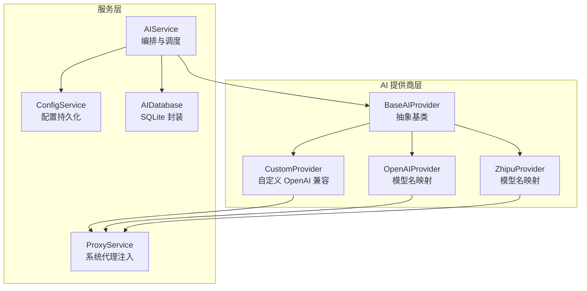
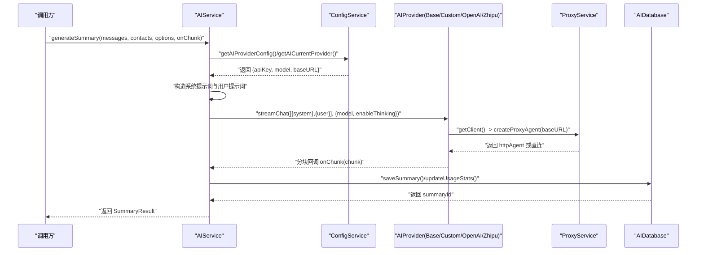
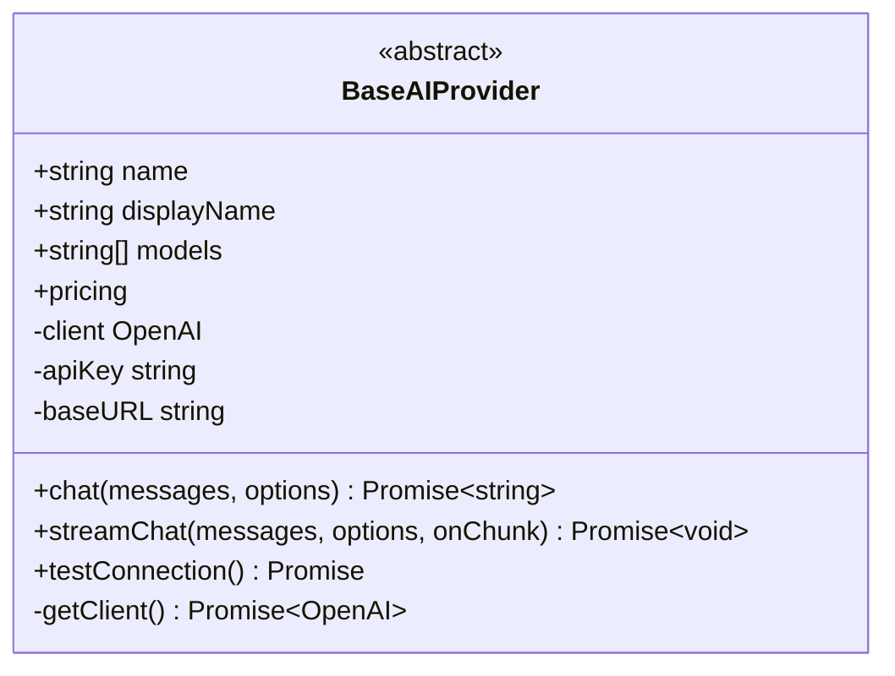
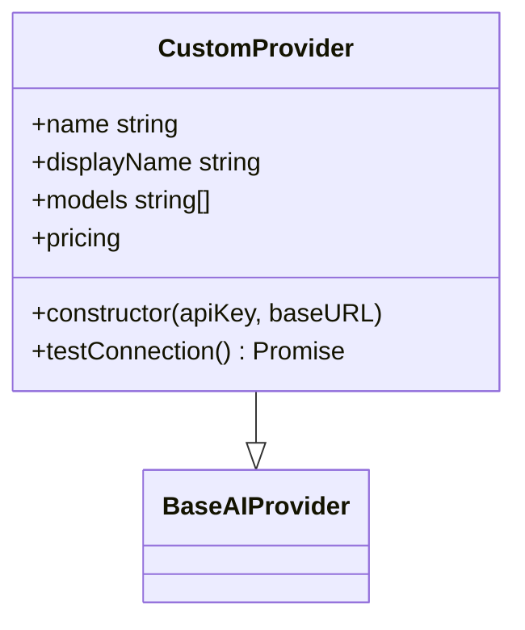
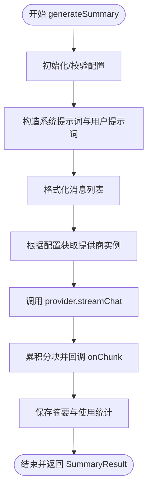
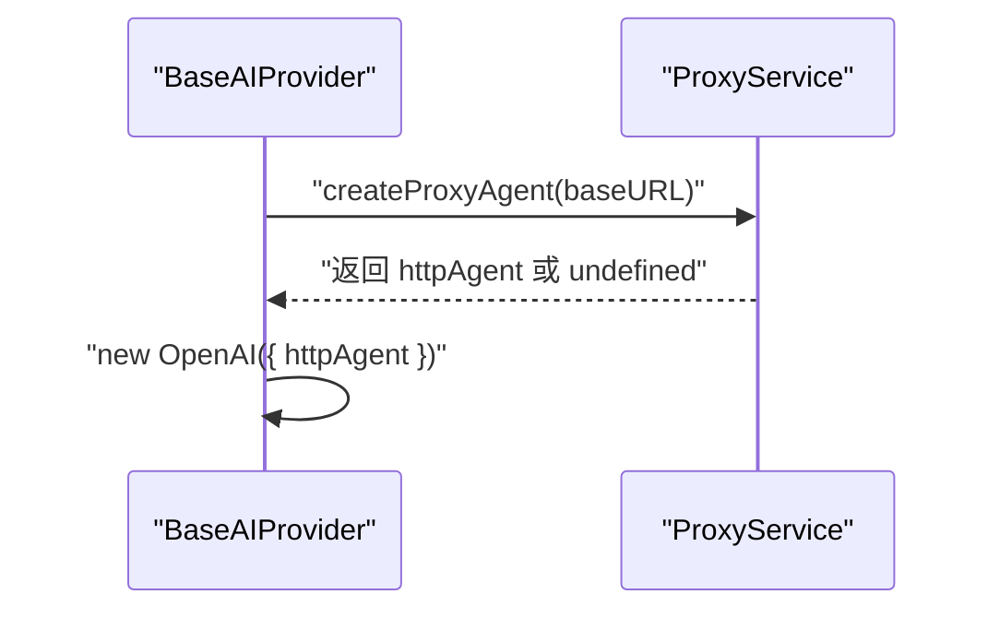
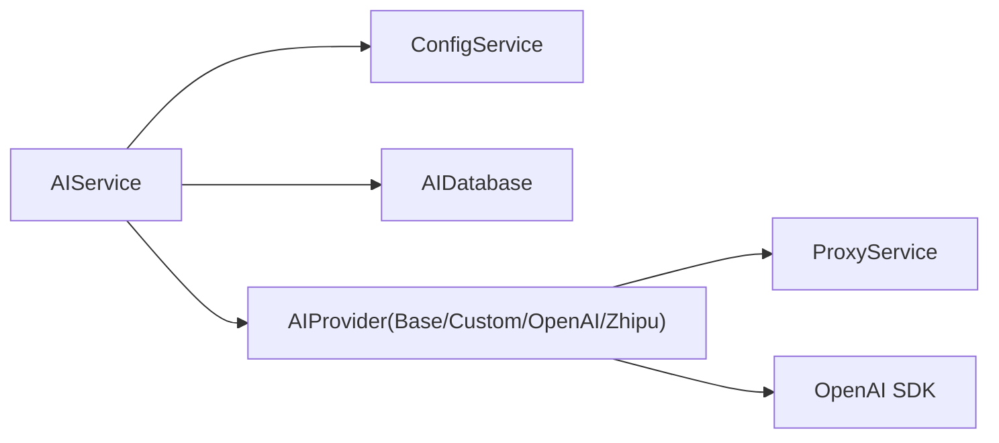

# 自定义提供商

<cite>
**本文档引用的文件**
- [electron\services\ai\providers\base.ts](file://electron\services\ai\providers\base.ts)
- [electron\services\ai\providers\custom.ts](file://electron\services\ai\providers\custom.ts)
- [electron\services\ai\aiService.ts](file://electron\services\ai\aiService.ts)
- [electron\services\ai\proxyService.ts](file://electron\services\ai\proxyService.ts)
- [electron\services\ai\aiDatabase.ts](file://electron\services\ai\aiDatabase.ts)
- [electron\services\config.ts](file://electron\services\config.ts)
- [src\types\ai.ts](file://src\types\ai.ts)
- [electron\services\ai\providers\openai.ts](file://electron\services\ai\providers\openai.ts)
- [electron\services\ai\providers\zhipu.ts](file://electron\services\ai\providers\zhipu.ts)
</cite>

## 目录
1. [简介](#简介)
2. [项目结构](#项目结构)
3. [核心组件](#核心组件)
4. [架构总览](#架构总览)
5. [详细组件分析](#详细组件分析)
6. [依赖关系分析](#依赖关系分析)
7. [性能考量](#性能考量)
8. [故障排查指南](#故障排查指南)
9. [结论](#结论)
10. [附录](#附录)

## 简介
本文件面向希望在 CipherTalk 中集成“自定义 AI 提供商”的开发者，系统讲解如何基于 BaseAIProvider 创建新的提供商，如何实现通用接口适配、配置管理与扩展机制，以及认证方式、请求格式、响应处理流程。文档同时提供完整的扩展指南、实现步骤与最佳实践建议，帮助你在不改动核心逻辑的前提下快速接入任意 OpenAI 兼容的 API 服务。

## 项目结构
围绕 AI 服务的关键目录与文件如下：
- 提供商抽象与实现：electron/services/ai/providers
- AI 服务编排：electron/services/ai/aiService.ts
- 代理服务：electron/services/ai/proxyService.ts
- 配置服务：electron/services/config.ts
- 数据库封装：electron/services/ai/aiDatabase.ts
- 类型定义：src/types/ai.ts

图表来源
- [electron\services\ai\providers\base.ts:49-241](file://electron\services\ai\providers\base.ts#L49-L241)
- [electron\services\ai\providers\custom.ts:37-117](file://electron\services\ai\providers\custom.ts#L37-L117)
- [electron\services\ai\providers\openai.ts:44-77](file://electron\services\ai\providers\openai.ts#L44-L77)
- [electron\services\ai\providers\zhipu.ts:42-75](file://electron\services\ai\providers\zhipu.ts#L42-L75)
- [electron\services\ai\aiService.ts:58-163](file://electron\services\ai\aiService.ts#L58-L163)
- [electron\services\ai\proxyService.ts:16-151](file://electron\services\ai\proxyService.ts#L16-L151)
- [electron\services\ai\aiDatabase.ts:8-347](file://electron\services\ai\aiDatabase.ts#L8-L347)
- [electron\services\config.ts:126-395](file://electron\services\config.ts#L126-L395)

章节来源
- [electron\services\ai\providers\base.ts:1-241](file://electron\services\ai\providers\base.ts#L1-L241)
- [electron\services\ai\providers\custom.ts:1-117](file://electron\services\ai\providers\custom.ts#L1-L117)
- [electron\services\ai\aiService.ts:1-631](file://electron\services\ai\aiService.ts#L1-L631)
- [electron\services\ai\proxyService.ts:1-151](file://electron\services\ai\proxyService.ts#L1-L151)
- [electron\services\ai\aiDatabase.ts:1-347](file://electron\services\ai\aiDatabase.ts#L1-L347)
- [electron\services\config.ts:1-395](file://electron\services\config.ts#L1-L395)
- [src\types\ai.ts:1-93](file://src\types\ai.ts#L1-L93)

## 核心组件
- BaseAIProvider 抽象基类：定义统一接口（非流式 chat、流式 streamChat、连接测试 testConnection），内置 OpenAI 客户端创建、代理注入、思考模式（reasoning_content）处理、连接超时与错误分类。
- CustomProvider 自定义提供商：继承 BaseAIProvider，支持任意 OpenAI 兼容的服务端点，强制要求配置 baseURL；在连接测试时提供更友好的错误提示。
- AIService 服务编排器：负责提供商实例化、系统提示词构造、消息格式化、流式摘要生成、使用统计与缓存、连接测试转发。
- ProxyService 代理服务：通过 Electron session.resolveProxy 获取系统代理，动态构建 HttpsProxyAgent 注入到 OpenAI SDK。
- ConfigService 配置中心：集中管理 AI 提供商配置（apiKey、model、baseURL）、默认值、迁移逻辑与持久化。
- AIDatabase 数据库封装：提供摘要存储、使用统计、缓存键管理、历史查询、清理过期缓存等能力。

章节来源
- [electron\services\ai\providers\base.ts:49-241](file://electron\services\ai\providers\base.ts#L49-L241)
- [electron\services\ai\providers\custom.ts:37-117](file://electron\services\ai\providers\custom.ts#L37-L117)
- [electron\services\ai\aiService.ts:58-627](file://electron\services\ai\aiService.ts#L58-L627)
- [electron\services\ai\proxyService.ts:16-151](file://electron\services\ai\proxyService.ts#L16-L151)
- [electron\services\config.ts:126-395](file://electron\services\config.ts#L126-L395)
- [electron\services\ai\aiDatabase.ts:8-347](file://electron\services\ai\aiDatabase.ts#L8-L347)

## 架构总览
下面的序列图展示了 AIService 如何基于配置选择提供商并发起流式摘要请求，期间通过 BaseAIProvider 统一处理代理与思考模式，最终将结果持久化到数据库。

图表来源
- [electron\services\ai\aiService.ts:439-539](file://electron\services\ai\aiService.ts#L439-L539)
- [electron\services\ai\providers\base.ts:71-175](file://electron\services\ai\providers\base.ts#L71-L175)
- [electron\services\ai\proxyService.ts:83-99](file://electron\services\ai\proxyService.ts#L83-L99)
- [electron\services\ai\aiDatabase.ts:117-226](file://electron\services\ai\aiDatabase.ts#L117-L226)

## 详细组件分析

### BaseAIProvider 抽象基类
- 统一接口
  - chat：非流式请求，返回完整文本。
  - streamChat：流式请求，回调分块文本；自动处理推理内容（reasoning_content）包裹为<think>...</think>。
  - testConnection：对 models.list() 进行竞速超时测试，区分代理需求与常见错误码，返回 success/error/needsProxy。
- 代理与客户端
  - getClient：每次请求动态创建 OpenAI 客户端，注入由 ProxyService 生成的 httpAgent，支持 HTTP/HTTPS/SOCKS5。
  - 超时：默认 60 秒；连接测试单独 15 秒超时。
- 思考模式（Reasoning）
  - 自动尝试多种参数格式（reasoning_effort、thinking）以适配不同模型的推理开关。
  - 若模型无法完全关闭推理，仍会透传 reasoning_content，框架会自动包裹为<think>标签。
- 错误分类
  - 基于错误消息关键字与 HTTP 状态码进行分类，提供“需要代理”提示与友好文案。

图表来源
- [electron\services\ai\providers\base.ts:49-241](file://electron\services\ai\providers\base.ts#L49-L241)

章节来源
- [electron\services\ai\providers\base.ts:49-241](file://electron\services\ai\providers\base.ts#L49-L241)

### CustomProvider 自定义提供商
- 元数据与模型
  - 提供 displayName、models、pricingDetail 等元信息；支持任意 OpenAI 兼容模型。
- 构造与约束
  - 强制要求 baseURL；若未提供则回退到默认 OpenAI v1 端点。
- 连接测试增强
  - 针对常见错误（404、429、5xx、域名解析失败、超时、ECONNREFUSED）提供更具体的提示。
  - 与 BaseAIProvider 的错误分类策略一致，但针对自定义服务的典型问题做了细化。

图表来源
- [electron\services\ai\providers\custom.ts:37-117](file://electron\services\ai\providers\custom.ts#L37-L117)
- [electron\services\ai\providers\base.ts:49-241](file://electron\services\ai\providers\base.ts#L49-L241)

章节来源
- [electron\services\ai\providers\custom.ts:1-117](file://electron\services\ai\providers\custom.ts#L1-L117)

### AIService 服务编排器
- 提供商选择
  - 支持 custom、ollama、openai、gemini、zhipu、deepseek、qwen、doubao、kimi、siliconflow、xiaomi、tencent、xai 等。
  - custom 需要配置 baseURL；ollama 支持自定义 baseURL。
- 系统提示词与消息格式化
  - getSystemPrompt：根据 detail 与 preset 生成系统提示词模板。
  - formatMessages：将后端解析的消息转换为结构化文本，过滤无效内容，保留媒体占位。
- 流式摘要生成
  - 调用 provider.streamChat，逐块拼接并回调 onChunk。
  - 估算 tokens 与成本（按输入单价），保存摘要与使用统计。
- 连接测试
  - testConnection：委托给具体提供商的 testConnection。

图表来源
- [electron\services\ai\aiService.ts:439-539](file://electron\services\ai\aiService.ts#L439-L539)

章节来源
- [electron\services\ai\aiService.ts:58-627](file://electron\services\ai\aiService.ts#L58-L627)

### ProxyService 代理服务
- 系统代理解析
  - 通过 Electron session.resolveProxy 获取系统代理规则，解析为 http/https/socks5 URL。
- 代理 Agent 构建
  - 使用 https-proxy-agent 创建 HttpsProxyAgent，注入到 OpenAI SDK 的 httpAgent。
- 缓存与测试
  - 缓存 1 分钟，避免频繁查询；提供 testProxy 可选测试代理连通性。

图表来源
- [electron\services\ai\proxyService.ts:83-99](file://electron\services\ai\proxyService.ts#L83-L99)
- [electron\services\ai\providers\base.ts:71-90](file://electron\services\ai\providers\base.ts#L71-L90)

章节来源
- [electron\services\ai\proxyService.ts:16-151](file://electron\services\ai\proxyService.ts#L16-L151)
- [electron\services\ai\providers\base.ts:71-90](file://electron\services\ai\providers\base.ts#L71-L90)

### ConfigService 配置管理
- 结构化配置
  - aiCurrentProvider：当前提供商标识。
  - aiProviderConfigs：各提供商独立配置 { apiKey, model, baseURL }。
  - aiEnableThinking、aiMessageLimit、aiSummaryDetail 等全局 AI 行为配置。
- 迁移与兼容
  - 旧版 aiProvider/aiApiKey/aiModel 迁移至新结构。
  - 兼容旧字段 baseUrl -> baseURL。
- 便捷方法
  - getAIProviderConfig/setAIProviderConfig/getAllAIProviderConfigs 等。

章节来源
- [electron\services\config.ts:62-395](file://electron\services\config.ts#L62-L395)

### AIDatabase 数据库封装
- 表结构
  - summaries：摘要记录（含 tokens_used、cost、provider、model 等）。
  - usage_stats：使用统计（按日期聚合）。
  - summary_cache：摘要缓存键与过期时间。
- 能力
  - saveSummary/updateUsageStats/getSummaryHistory/deleteSummary/renameSummary/cleanExpiredCache 等。
  - 自动迁移：新增列（prompt_text、custom_name）时忽略错误。

章节来源
- [electron\services\ai\aiDatabase.ts:8-347](file://electron\services\ai\aiDatabase.ts#L8-L347)

### 其他提供商示例（对比参考）
- OpenAIProvider：维护模型名映射，将展示名映射为真实 API 模型 ID。
- ZhipuProvider：同上，维护智谱模型名映射。

章节来源
- [electron\services\ai\providers\openai.ts:44-77](file://electron\services\ai\providers\openai.ts#L44-L77)
- [electron\services\ai\providers\zhipu.ts:42-75](file://electron\services\ai\providers\zhipu.ts#L42-L75)

## 依赖关系分析
- AIService 依赖 ConfigService 获取提供商配置，依赖 AIDatabase 存储摘要与统计，依赖 BaseAIProvider 抽象统一调用。
- BaseAIProvider 依赖 ProxyService 注入代理，依赖 OpenAI SDK 发起请求。
- CustomProvider/ZhipuProvider/OpenAIProvider 等具体提供商继承 BaseAIProvider，复用统一的流式处理与思考模式逻辑。

图表来源
- [electron\services\ai\aiService.ts:109-163](file://electron\services\ai\aiService.ts#L109-L163)
- [electron\services\ai\providers\base.ts:55-90](file://electron\services\ai\providers\base.ts#L55-L90)
- [electron\services\ai\proxyService.ts:16-99](file://electron\services\ai\proxyService.ts#L16-L99)

章节来源
- [electron\services\ai\aiService.ts:109-163](file://electron\services\ai\aiService.ts#L109-L163)
- [electron\services\ai\providers\base.ts:55-90](file://electron\services\ai\providers\base.ts#L55-L90)
- [electron\services\ai\proxyService.ts:16-99](file://electron\services\ai\proxyService.ts#L16-L99)

## 性能考量
- 代理注入时机：每次请求动态创建 OpenAI 客户端并注入代理，确保使用最新系统代理配置，避免静态缓存导致的代理失效。
- 超时策略：请求默认 60 秒，连接测试 15 秒，防止长时间阻塞。
- 流式处理：采用 OpenAI SDK 的流式接口，边生成边回调，降低首字节等待时间。
- 思考模式：自动尝试多种推理开关参数，兼容性优先，对不支持的模型不会报错。
- 数据库：使用 SQLite，索引覆盖常用查询（会话、时间范围、日期），避免全表扫描。

## 故障排查指南
- 连接失败
  - 常见原因：网络不可达、域名解析失败、代理未配置、API Key 无效、429 频控、5xx 服务器错误。
  - 建议：先执行 testConnection，查看 needsProxy 标记；检查代理缓存与系统代理设置；核对 API Key 与权限。
- 自定义服务地址
  - 必须包含 /v1 路径；若返回 404，优先检查 baseURL 是否正确。
- 思考模式（推理内容）
  - 部分模型无法完全关闭推理；框架会自动包裹为<think>标签，确保 UI 正确渲染。
- 本地模型（Ollama）
  - 端口默认 11434/v1；若修改端口或主机，需在配置中更新 baseURL。

章节来源
- [electron\services\ai\providers\custom.ts:51-115](file://electron\services\ai\providers\custom.ts#L51-L115)
- [electron\services\ai\providers\base.ts:177-239](file://electron\services\ai\providers\base.ts#L177-L239)
- [electron\services\ai\Ollama使用指南.md:50-61](file://electron\services\ai\Ollama使用指南.md#L50-L61)

## 结论
通过 BaseAIProvider 抽象与 AIService 编排，CipherTalk 为自定义 AI 提供商提供了高度一致的接入体验：只需实现元数据与构造函数，即可享受统一的流式处理、代理注入、思考模式与连接测试能力。结合 ConfigService 的多提供商配置与 AIDatabase 的持久化，开发者可以快速将任意 OpenAI 兼容服务纳入平台生态。

## 附录

### 如何基于 BaseAIProvider 创建新的提供商
- 步骤
  - 定义提供商元数据（id/name/displayName/description/models/pricing/pricingDetail/website/logo）。
  - 创建类继承 BaseAIProvider，设置 name/displayName/models/pricing。
  - 在构造函数中调用 super(apiKey, baseURL)，其中 baseURL 可根据需要设置默认值。
  - 如需模型名映射（如 OpenAI/Zhipu），重写 chat/streamChat，在内部将展示名映射为真实模型 ID 后调用父类方法。
  - 如需更精细的连接测试提示，重写 testConnection。
  - 在 AIService.getAllProviders 与 getProvider 分支中注册新提供商。
- 接口实现要求
  - 必须实现 name/displayName/models/pricing。
  - 至少实现 chat 或 streamChat；推荐两者都实现。
  - testConnection 应返回 { success, error?, needsProxy? }。
- 配置参数定义
  - ConfigService.aiProviderConfigs 中的每个提供商配置包含 apiKey、model、baseURL。
  - AIService 会优先使用显式传入的 apiKey，否则从配置中读取。
- 认证方式
  - 通过构造函数传入 apiKey；BaseAIProvider 将其注入 OpenAI 客户端。
  - 自定义服务必须提供 baseURL；若未提供，将回退到默认 OpenAI v1 端点。
- 请求格式
  - 使用 OpenAI Chat Completions 接口；支持 stream=true；自动注入 httpAgent。
  - 思考模式参数会尝试多种格式，确保兼容性。
- 响应处理
  - 非流式：返回 choices[0].message.content。
  - 流式：逐块回调，自动处理 reasoning_content 包裹为<think>标签。
- 扩展指南与最佳实践
  - 优先复用 BaseAIProvider 的流式与代理能力，减少重复实现。
  - 对于需要特殊参数的模型，使用 as any 绕过类型检查，但确保 API 兼容。
  - 在 AIService.getAllProviders 中注册新提供商，便于前端展示与选择。
  - 为 testConnection 提供清晰的错误提示，提升用户体验。
  - 对于本地模型（如 Ollama），允许 baseURL 自定义，避免硬编码。

章节来源
- [electron\services\ai\providers\base.ts:49-241](file://electron\services\ai\providers\base.ts#L49-L241)
- [electron\services\ai\providers\custom.ts:37-117](file://electron\services\ai\providers\custom.ts#L37-L117)
- [electron\services\ai\providers\openai.ts:44-77](file://electron\services\ai\providers\openai.ts#L44-L77)
- [electron\services\ai\providers\zhipu.ts:42-75](file://electron\services\ai\providers\zhipu.ts#L42-L75)
- [electron\services\ai\aiService.ts:88-163](file://electron\services\ai\aiService.ts#L88-L163)
- [electron\services\config.ts:347-395](file://electron\services\config.ts#L347-L395)
- [src\types\ai.ts:4-17](file://src\types\ai.ts#L4-L17)