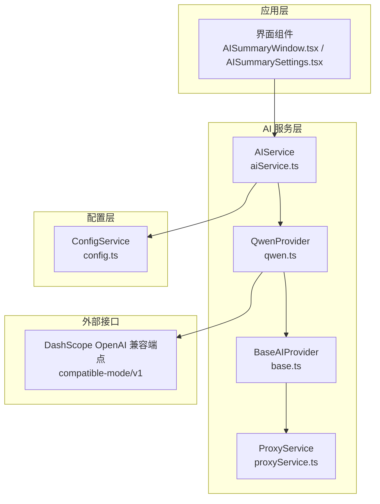
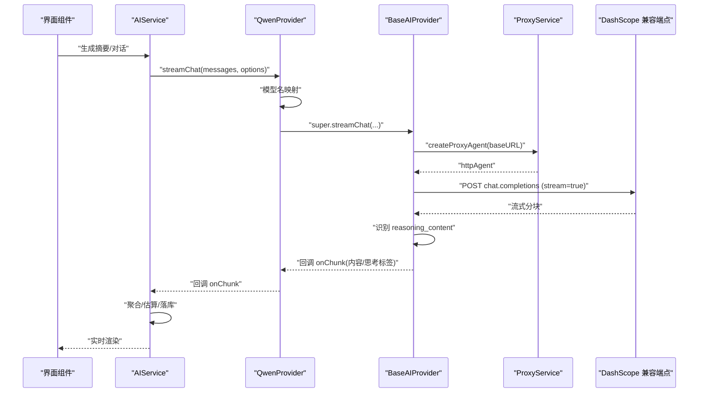
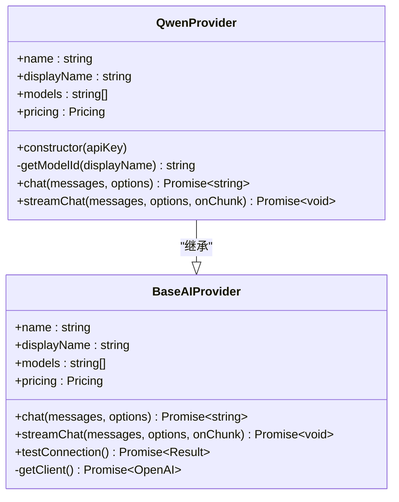
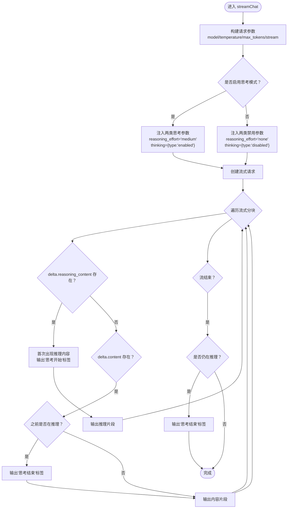
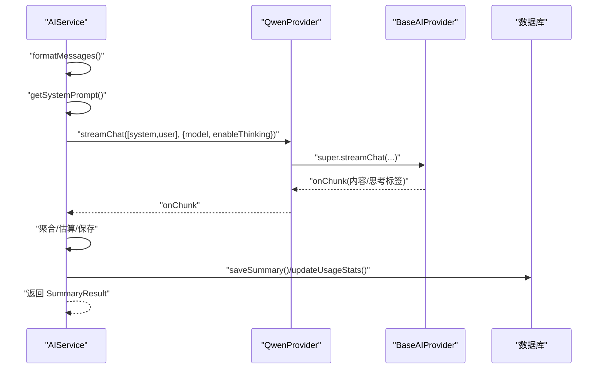
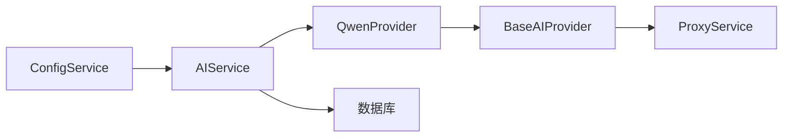

# 通义千问提供商

<cite>
**本文档引用的文件**
- [qwen.ts](file://electron/services/ai/providers/qwen.ts)
- [base.ts](file://electron/services/ai/providers/base.ts)
- [aiService.ts](file://electron/services/ai/aiService.ts)
- [proxyService.ts](file://electron/services/ai/proxyService.ts)
- [config.ts](file://electron/services/config.ts)
- [openai.ts](file://electron/services/ai/providers/openai.ts)
- [custom.ts](file://electron/services/ai/providers/custom.ts)
- [AISummaryWindow.tsx](file://src/pages/AISummaryWindow.tsx)
- [AISummarySettings.tsx](file://src/components/ai/AISummarySettings.tsx)
</cite>

## 目录
1. [简介](#简介)
2. [项目结构](#项目结构)
3. [核心组件](#核心组件)
4. [架构总览](#架构总览)
5. [详细组件分析](#详细组件分析)
6. [依赖关系分析](#依赖关系分析)
7. [性能考虑](#性能考虑)
8. [故障排查指南](#故障排查指南)
9. [结论](#结论)
10. [附录](#附录)

## 简介
本文件面向通义千问（Qwen）提供商的集成实现，系统性阐述阿里云通义实验室 API 的对接方式，包括认证方式、模型选择、特殊参数配置、思考模式（thinking 对象）实现、流式响应处理、请求参数优化、与 OpenAI 标准的兼容性处理、错误码映射与网络异常处理，并提供完整配置示例与使用场景建议。读者可据此快速完成 Qwen 的接入与优化。

## 项目结构
Qwen 集成位于 Electron 主进程的 AI 服务层，采用“提供商抽象 + 具体实现 + 统一服务”的分层设计：
- 抽象层：统一的 AI 提供商接口与基类，负责通用的流式处理、代理注入、连接测试与错误映射。
- 具体提供商：QwenProvider 基于 BaseAIProvider，实现模型 ID 映射与 OpenAI 兼容端点。
- 上层服务：AIService 负责消息格式化、系统提示词构建、流式生成与结果落库。
- 代理层：ProxyService 解决主进程直连网络问题，自动跟随系统代理。
- 配置层：ConfigService 存储各提供商的 API Key、默认模型与全局开关（如思考模式）。

图表来源
- [aiService.ts:58-163](file://electron/services/ai/aiService.ts#L58-L163)
- [qwen.ts:58-90](file://electron/services/ai/providers/qwen.ts#L58-L90)
- [base.ts:49-90](file://electron/services/ai/providers/base.ts#L49-L90)
- [proxyService.ts:16-99](file://electron/services/ai/proxyService.ts#L16-L99)
- [config.ts:65-80](file://electron/services/config.ts#L65-L80)

章节来源
- [aiService.ts:58-163](file://electron/services/ai/aiService.ts#L58-L163)
- [qwen.ts:58-90](file://electron/services/ai/providers/qwen.ts#L58-L90)
- [base.ts:49-90](file://electron/services/ai/providers/base.ts#L49-L90)
- [proxyService.ts:16-99](file://electron/services/ai/proxyService.ts#L16-L99)
- [config.ts:65-80](file://electron/services/config.ts#L65-L80)

## 核心组件
- QwenProvider：继承 BaseAIProvider，负责将“Qwen Plus”等展示名映射为 DashScope 的真实模型 ID，并通过 OpenAI 兼容端点发起请求。
- BaseAIProvider：提供统一的 chat 与 streamChat 实现，内置思考模式参数注入、流式分块处理与推理内容（reasoning_content）识别。
- AIService：上层编排器，负责消息格式化、系统提示词拼装、调用提供商并落库统计。
- ProxyService：主进程网络代理注入，自动跟随系统代理，解决直连不可达问题。
- ConfigService：持久化存储各提供商配置（API Key、默认模型、是否启用思考模式等）。

章节来源
- [qwen.ts:58-90](file://electron/services/ai/providers/qwen.ts#L58-L90)
- [base.ts:49-241](file://electron/services/ai/providers/base.ts#L49-L241)
- [aiService.ts:58-163](file://electron/services/ai/aiService.ts#L58-L163)
- [proxyService.ts:16-151](file://electron/services/ai/proxyService.ts#L16-L151)
- [config.ts:65-124](file://electron/services/config.ts#L65-L124)

## 架构总览
Qwen 的请求路径如下：
- 应用层触发摘要生成或对话请求。
- AIService 格式化消息并构建系统提示词，调用 QwenProvider.streamChat。
- QwenProvider 将展示模型名映射为 DashScope 真实模型 ID，并调用父类 BaseAIProvider 的流式接口。
- BaseAIProvider 通过 ProxyService 注入代理 Agent，构造 OpenAI 兼容请求，启用流式与思考模式参数。
- 服务端返回流式分块，BaseAIProvider 识别 reasoning_content 并转换为统一的“思考标签”序列，逐块回调 UI。
- AIService 聚合结果、估算 tokens 与成本、落库并更新使用统计。

图表来源
- [aiService.ts:439-539](file://electron/services/ai/aiService.ts#L439-L539)
- [qwen.ts:78-89](file://electron/services/ai/providers/qwen.ts#L78-L89)
- [base.ts:106-175](file://electron/services/ai/providers/base.ts#L106-L175)
- [proxyService.ts:83-99](file://electron/services/ai/proxyService.ts#L83-L99)

章节来源
- [aiService.ts:439-539](file://electron/services/ai/aiService.ts#L439-L539)
- [qwen.ts:78-89](file://electron/services/ai/providers/qwen.ts#L78-L89)
- [base.ts:106-175](file://electron/services/ai/providers/base.ts#L106-L175)
- [proxyService.ts:83-99](file://electron/services/ai/proxyService.ts#L83-L99)

## 详细组件分析

### QwenProvider 组件
- 职责
  - 提供 Qwen 的元数据（模型列表、价格、官网、图标）。
  - 将展示模型名映射为 DashScope 真实模型 ID。
  - 通过 OpenAI 兼容端点（compatible-mode/v1）发起请求。
- 关键点
  - 模型映射表覆盖 Qwen Plus/Flash/Turbo、QwQ 系列、Qwen 3 Omni/Next 80B、DeepSeek V3.2、Kimi k2 Thinking、GLM 4.7 等。
  - 构造函数固定 baseURL 为 DashScope 兼容端点，便于与 OpenAI SDK 无缝对接。
  - 重写 chat 与 streamChat，先做模型名映射再调用父类实现。

图表来源
- [qwen.ts:58-90](file://electron/services/ai/providers/qwen.ts#L58-L90)
- [base.ts:49-90](file://electron/services/ai/providers/base.ts#L49-L90)

章节来源
- [qwen.ts:6-35](file://electron/services/ai/providers/qwen.ts#L6-L35)
- [qwen.ts:37-53](file://electron/services/ai/providers/qwen.ts#L37-L53)
- [qwen.ts:64-66](file://electron/services/ai/providers/qwen.ts#L64-L66)
- [qwen.ts:71-73](file://electron/services/ai/providers/qwen.ts#L71-L73)
- [qwen.ts:78-81](file://electron/services/ai/providers/qwen.ts#L78-L81)
- [qwen.ts:86-89](file://electron/services/ai/providers/qwen.ts#L86-L89)

### BaseAIProvider 组件（思考模式与流式处理）
- 思考模式实现
  - 自适应注入两类参数以兼容不同模型族：
    - DeepSeek/Gemini 风格：reasoning_effort（medium/none）。
    - 通义千问风格：thinking 对象（type: enabled/disabled）。
  - 流式处理中，优先识别 delta.reasoning_content；当出现推理内容时，插入“思考开始”标签，随后输出推理片段；当切换到普通内容时，插入“思考结束”标签。
  - 若流结束仍处于思考状态，确保“思考结束”标签闭合。
- 错误映射与网络异常处理
  - 连接测试采用竞速策略：client.models.list() 与 15 秒超时竞速，避免阻塞。
  - 常见错误码映射：401/403/429/500/502/503 等分别提示 API Key 无效、权限不足、频率限制、服务器错误；网络类错误（ECONNREFUSED/ETIMEDOUT/ENOTFOUND/getaddrinfo）提示需要代理。
  - 代理注入：每次请求动态创建代理 Agent，确保使用最新系统代理配置。
- 参数优化
  - 默认温度 0.7，支持显式传入 temperature/maxTokens。
  - 流式开启，便于实时渲染与思考过程展示。

图表来源
- [base.ts:106-175](file://electron/services/ai/providers/base.ts#L106-L175)

章节来源
- [base.ts:112-142](file://electron/services/ai/providers/base.ts#L112-L142)
- [base.ts:147-175](file://electron/services/ai/providers/base.ts#L147-L175)
- [base.ts:177-239](file://electron/services/ai/providers/base.ts#L177-L239)

### AIService 组件（消息格式化与摘要生成）
- 消息格式化
  - 将微信消息转换为结构化文本，保留发送者、时间戳与消息类型（文本、图片、视频、表情包、文件、语音、链接、聊天记录、引用、位置、名片、通话、系统消息等）。
  - 语音消息优先使用缓存的转写文本，否则回退到解析内容。
  - 跳过空内容的消息（媒体消息除外）。
- 系统提示词构建
  - 支持三种详细度（简单/标准/深度），并支持风格偏好（默认/决策焦点/行动焦点/风险焦点）与自定义提示词。
- 流式生成与落库
  - 调用提供商 streamChat，实时回调 onChunk，聚合结果文本。
  - 估算 tokens 与成本，保存摘要到数据库并更新使用统计。

图表来源
- [aiService.ts:439-539](file://electron/services/ai/aiService.ts#L439-L539)
- [qwen.ts:78-89](file://electron/services/ai/providers/qwen.ts#L78-L89)
- [base.ts:106-175](file://electron/services/ai/providers/base.ts#L106-L175)

章节来源
- [aiService.ts:439-539](file://electron/services/ai/aiService.ts#L439-L539)

### ProxyService 组件（主进程代理注入）
- 功能
  - 通过 Electron session.resolveProxy 获取系统代理配置，解析 DIRECT/PROXY/HTTPS/SOCKS5 等格式，构建 HttpsProxyAgent。
  - 缓存代理配置（1 分钟有效期），避免频繁查询。
  - 提供代理测试能力，验证连通性。
- 与 BaseAIProvider 的协作
  - BaseAIProvider 在每次请求时调用 ProxyService.createProxyAgent，将代理注入 OpenAI SDK 的 httpAgent，确保主进程直连也能走系统代理。

章节来源
- [proxyService.ts:26-76](file://electron/services/ai/proxyService.ts#L26-L76)
- [proxyService.ts:83-99](file://electron/services/ai/proxyService.ts#L83-L99)
- [proxyService.ts:115-146](file://electron/services/ai/proxyService.ts#L115-L146)
- [base.ts:71-90](file://electron/services/ai/providers/base.ts#L71-L90)

### 配置与使用（ConfigService）
- 存储结构
  - aiCurrentProvider：当前提供商标识（如 qwen）。
  - aiProviderConfigs：各提供商独立配置，包含 apiKey、model、baseURL（自定义提供商）。
  - aiEnableThinking：是否默认启用思考模式。
  - aiMessageLimit：摘要提取的消息条数上限。
- 迁移与兼容
  - 支持从旧配置结构迁移到新结构（多提供商）。
  - 兼容 baseUrl -> baseURL 字段名变更。

章节来源
- [config.ts:65-80](file://electron/services/config.ts#L65-L80)
- [config.ts:187-242](file://electron/services/config.ts#L187-L242)
- [config.ts:356-377](file://electron/services/config.ts#L356-L377)

## 依赖关系分析
- Provider 与 Base 的继承关系：QwenProvider 继承 BaseAIProvider，复用统一的流式处理与代理注入逻辑。
- AIService 与 Provider 的组合关系：AIService 通过工厂方法按配置选择 Provider 实例，统一调度。
- ProxyService 与 Base 的协作：Base 在运行时动态获取代理 Agent，保证网络可达性。
- ConfigService 与 AIService 的耦合：AIService 读取全局配置（如默认提供商、思考模式开关、消息条数限制）。

图表来源
- [aiService.ts:109-163](file://electron/services/ai/aiService.ts#L109-L163)
- [qwen.ts:58-90](file://electron/services/ai/providers/qwen.ts#L58-L90)
- [base.ts:49-90](file://electron/services/ai/providers/base.ts#L49-L90)
- [proxyService.ts:16-99](file://electron/services/ai/proxyService.ts#L16-L99)
- [config.ts:65-80](file://electron/services/config.ts#L65-L80)

章节来源
- [aiService.ts:109-163](file://electron/services/ai/aiService.ts#L109-L163)
- [qwen.ts:58-90](file://electron/services/ai/providers/qwen.ts#L58-L90)
- [base.ts:49-90](file://electron/services/ai/providers/base.ts#L49-L90)
- [proxyService.ts:16-99](file://electron/services/ai/proxyService.ts#L16-L99)
- [config.ts:65-80](file://electron/services/config.ts#L65-L80)

## 性能考虑
- 流式渲染：通过流式分块实时输出，降低首屏等待时间，提升交互体验。
- 代理缓存：ProxyService 缓存代理配置，减少 resolveProxy 调用开销。
- 连接测试：15 秒超时竞速，避免长时间阻塞 UI。
- 模型映射：在 Provider 层完成映射，避免重复转换。
- Token 估算：基于字符集估算，轻量高效，适合前端预估成本。

[本节为通用性能讨论，不直接分析特定文件]

## 故障排查指南
- 连接失败
  - 现象：提示“连接失败”或“网络连接失败”。
  - 排查：检查 API Key 是否有效；确认网络可访问 DashScope 兼容端点；必要时开启系统代理。
- 超时/拒绝
  - 现象：提示“连接超时/连接被拒绝/无法解析域名”。
  - 排查：确认代理可用；检查防火墙/公司网络策略；适当延长超时时间。
- 401/403/429/5xx
  - 现象：提示“API Key 无效/访问被禁止/请求过于频繁/服务器错误”。
  - 排查：核对 API Key 权限；降低请求频率；关注服务端状态。
- 思考模式未生效
  - 现象：期望看到推理内容但未出现。
  - 排查：确认 enableThinking 选项；部分模型可能无法完全关闭推理内容；BaseAIProvider 会自动识别 reasoning_content 并转换为统一标签。

章节来源
- [base.ts:177-239](file://electron/services/ai/providers/base.ts#L177-L239)
- [proxyService.ts:115-146](file://electron/services/ai/proxyService.ts#L115-L146)

## 结论
Qwen 集成通过“提供商 + 基类 + 服务 + 代理 + 配置”的分层设计，实现了与 OpenAI 标准的高度兼容与良好的扩展性。思考模式通过两类参数自适应注入并在流式响应中统一呈现，配合代理注入与错误映射，显著提升了跨网络环境下的稳定性与用户体验。结合 AIService 的消息格式化与摘要生成流程，可快速落地企业级的智能摘要与对话能力。

[本节为总结性内容，不直接分析特定文件]

## 附录

### 配置示例与最佳实践
- 基础配置
  - 在设置页面为 Qwen 提供商填写 API Key；若使用自定义服务，需提供 baseURL。
  - 可在全局设置中开启/关闭“显示思考过程”，默认启用。
- 模型选择
  - 建议优先选择 Qwen 3 Next 80B Thinking 或 Qwen 3 Omni 系列，推理能力更强。
  - 如需快速响应，可选择 Qwen Flash/Turbo。
- 参数优化
  - temperature：默认 0.7，偏理性可调低，偏创意可调高。
  - maxTokens：根据摘要长度需求调整，避免过长导致成本上升。
  - enableThinking：默认启用，便于观察推理过程；生产环境可根据需要关闭以减少输出冗余。
- 网络与代理
  - 若国内网络受限，务必开启系统代理；主进程将自动跟随系统代理。
  - 如使用自定义服务，确保 baseURL 包含 /v1 路径。

章节来源
- [AISummarySettings.tsx:510-572](file://src/components/ai/AISummarySettings.tsx#L510-L572)
- [AISummarySettings.tsx:827-851](file://src/components/ai/AISummarySettings.tsx#L827-L851)
- [config.ts:114-124](file://electron/services/config.ts#L114-L124)
- [qwen.ts:37-53](file://electron/services/ai/providers/qwen.ts#L37-L53)
- [openai.ts:30-39](file://electron/services/ai/providers/openai.ts#L30-L39)
- [custom.ts:43-46](file://electron/services/ai/providers/custom.ts#L43-L46)

### 使用场景建议
- 企业微信/聊天记录智能摘要：结合 AIService 的消息格式化与系统提示词，生成结构化摘要。
- 复杂业务问答：启用思考模式，观察推理过程，辅助判断模型决策依据。
- 多提供商对比：通过 AIService 的工厂方法快速切换 Qwen、OpenAI、Gemini 等提供商，进行效果与成本对比。

章节来源
- [aiService.ts:439-539](file://electron/services/ai/aiService.ts#L439-L539)
- [AISummaryWindow.tsx:562-661](file://src/pages/AISummaryWindow.tsx#L562-L661)