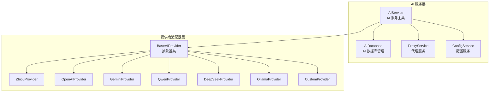
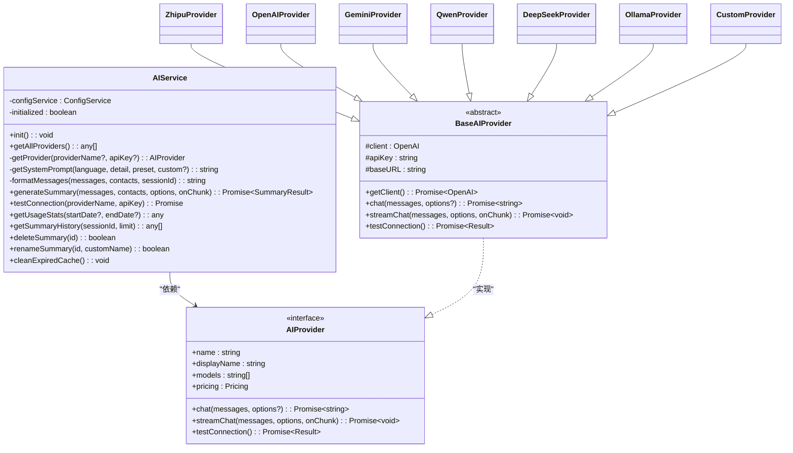
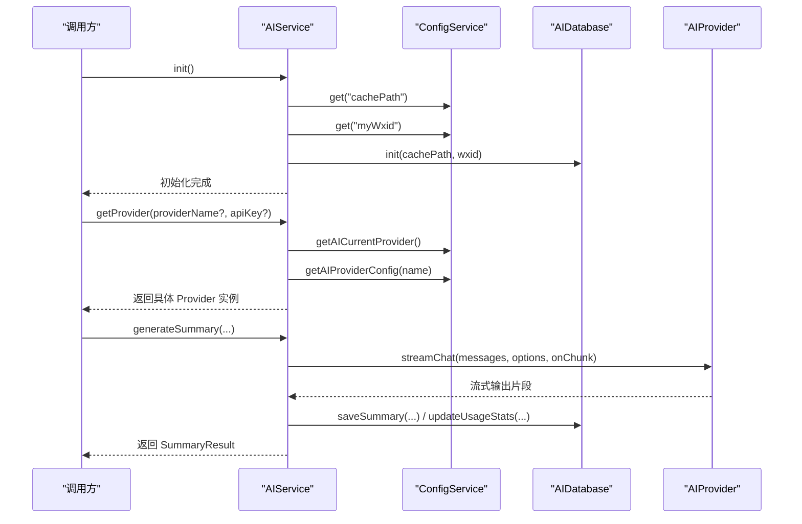
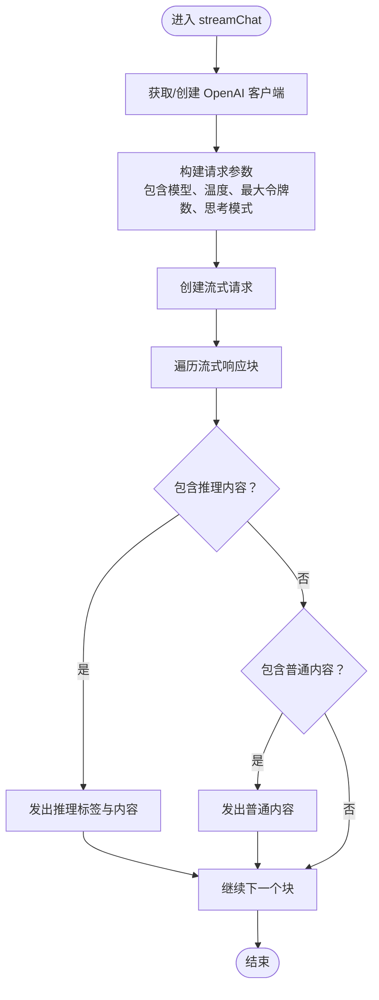
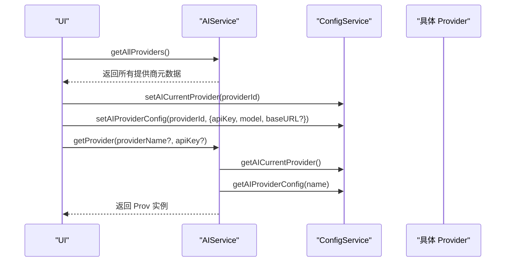
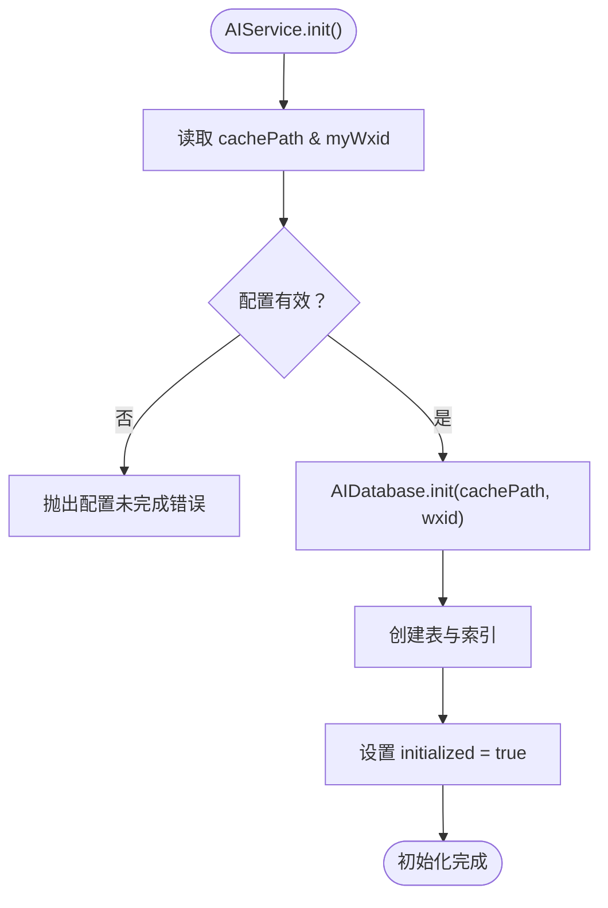
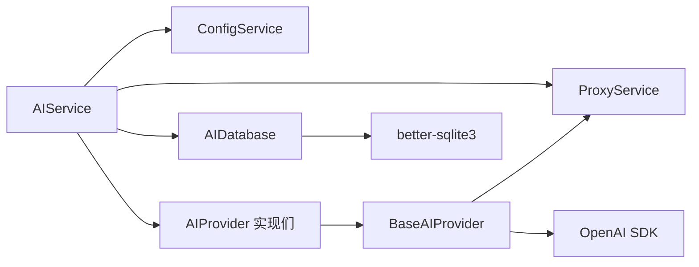

# AI 服务架构设计

<cite>
**本文档引用的文件**
- [aiService.ts](file://electron/services/ai/aiService.ts)
- [base.ts](file://electron/services/ai/providers/base.ts)
- [aiDatabase.ts](file://electron/services/ai/aiDatabase.ts)
- [proxyService.ts](file://electron/services/ai/proxyService.ts)
- [config.ts](file://electron/services/config.ts)
- [zhipu.ts](file://electron/services/ai/providers/zhipu.ts)
- [openai.ts](file://electron/services/ai/providers/openai.ts)
- [custom.ts](file://electron/services/ai/providers/custom.ts)
- [ollama.ts](file://electron/services/ai/providers/ollama.ts)
- [gemini.ts](file://electron/services/ai/providers/gemini.ts)
- [qwen.ts](file://electron/services/ai/providers/qwen.ts)
- [deepseek.ts](file://electron/services/ai/providers/deepseek.ts)
- [Ollama使用指南.md](file://electron/services/ai/Ollama使用指南.md)
</cite>

## 目录
1. [简介](#简介)
2. [项目结构](#项目结构)
3. [核心组件](#核心组件)
4. [架构总览](#架构总览)
5. [详细组件分析](#详细组件分析)
6. [依赖关系分析](#依赖关系分析)
7. [性能考量](#性能考量)
8. [故障排查指南](#故障排查指南)
9. [结论](#结论)

## 简介
本文件面向 CipherTalk 的 AI 服务架构，系统性阐述其采用的抽象基类设计、提供商适配器模式与统一接口规范。文档重点说明 AIService 主类的设计理念（服务初始化流程、提供商工厂方法、配置管理机制）、AIProvider 抽象基类的职责（统一接口定义、提供商特定实现、错误处理策略），以及服务初始化过程（配置验证、数据库连接、缓存路径设置）。同时，文档覆盖提供商注册机制（元数据收集、动态加载、运行时切换），并总结架构设计的最佳实践（可扩展性、性能优化、错误恢复）。

## 项目结构
AI 服务位于 Electron 主进程的 `electron/services/ai/` 目录下，采用“模块化 + 适配器”的分层组织方式：
- 核心服务层：AIService、AIDatabase、ProxyService、ConfigService
- 抽象与适配器层：AIProvider 抽象接口与 BaseAIProvider 基类，以及各提供商的具体实现
- 配置与文档：ConfigService 提供全局配置管理；Ollama 使用指南提供本地部署参考

**图表来源**
- [aiService.ts:58-631](file://electron/services/ai/aiService.ts#L58-L631)
- [base.ts:49-241](file://electron/services/ai/providers/base.ts#L49-L241)
- [aiDatabase.ts:8-347](file://electron/services/ai/aiDatabase.ts#L8-L347)
- [proxyService.ts:16-151](file://electron/services/ai/proxyService.ts#L16-L151)
- [config.ts:126-395](file://electron/services/config.ts#L126-L395)

**章节来源**
- [aiService.ts:1-631](file://electron/services/ai/aiService.ts#L1-L631)
- [base.ts:1-241](file://electron/services/ai/providers/base.ts#L1-L241)
- [aiDatabase.ts:1-347](file://electron/services/ai/aiDatabase.ts#L1-L347)
- [proxyService.ts:1-151](file://electron/services/ai/proxyService.ts#L1-L151)
- [config.ts:1-395](file://electron/services/config.ts#L1-L395)

## 核心组件
- AIService：AI 服务主类，负责服务初始化、提供商工厂、消息格式化、摘要生成、连接测试、使用统计与历史管理。
- BaseAIProvider：AI 提供商抽象基类，定义统一接口（chat、streamChat、testConnection），封装客户端创建、代理注入、流式处理与思考模式兼容。
- AIDatabase：AI 专用数据库，管理摘要记录、使用统计、缓存键值与历史查询。
- ProxyService：代理服务，解决 Electron 主进程网络代理问题，动态创建 HttpsProxyAgent 并注入到 OpenAI 客户端。
- ConfigService：配置服务，提供全局配置读取/写入、AI 提供商配置迁移与兼容、缓存路径计算等。

**章节来源**
- [aiService.ts:58-631](file://electron/services/ai/aiService.ts#L58-L631)
- [base.ts:49-241](file://electron/services/ai/providers/base.ts#L49-L241)
- [aiDatabase.ts:8-347](file://electron/services/ai/aiDatabase.ts#L8-L347)
- [proxyService.ts:16-151](file://electron/services/ai/proxyService.ts#L16-L151)
- [config.ts:126-395](file://electron/services/config.ts#L126-L395)

## 架构总览
CipherTalk 的 AI 服务采用“统一接口 + 抽象基类 + 多提供商适配器”的架构模式，具备以下特点：
- 统一接口规范：所有提供商实现相同的 AIProvider 接口，确保 AIService 可以无差别地调用不同提供商。
- 抽象基类设计：BaseAIProvider 封装通用逻辑（客户端创建、代理注入、流式处理、思考模式兼容、连接测试），减少重复代码。
- 提供商适配器模式：每个提供商仅关注自身差异（模型映射、特殊参数、错误提示），通过继承 BaseAIProvider 实现统一行为。
- 配置驱动：ConfigService 提供统一配置入口，支持多提供商配置、默认值、迁移与兼容。
- 数据持久化：AIDatabase 负责摘要、统计与缓存的持久化，支持历史查询与清理。

**图表来源**
- [aiService.ts:58-631](file://electron/services/ai/aiService.ts#L58-L631)
- [base.ts:7-34](file://electron/services/ai/providers/base.ts#L7-L34)
- [base.ts:49-241](file://electron/services/ai/providers/base.ts#L49-L241)
- [zhipu.ts:42-75](file://electron/services/ai/providers/zhipu.ts#L42-L75)
- [openai.ts:44-77](file://electron/services/ai/providers/openai.ts#L44-L77)
- [gemini.ts:46-192](file://electron/services/ai/providers/gemini.ts#L46-L192)
- [qwen.ts:58-91](file://electron/services/ai/providers/qwen.ts#L58-L91)
- [deepseek.ts:29-62](file://electron/services/ai/providers/deepseek.ts#L29-L62)
- [ollama.ts:33-97](file://electron/services/ai/providers/ollama.ts#L33-L97)
- [custom.ts:37-117](file://electron/services/ai/providers/custom.ts#L37-L117)

## 详细组件分析

### AIService 设计理念与初始化流程
- 服务初始化流程
  - 配置验证：检查 cachePath 与 myWxid 是否存在，否则抛出异常阻止初始化。
  - 数据库初始化：调用 AIDatabase.init(cachePath, wxid) 创建数据库与表结构。
  - 标志位设置：标记 initialized 为 true，避免重复初始化。
- 提供商工厂方法
  - getProvider(providerName?, apiKey?)：根据当前配置或显式参数选择提供商，动态构造具体 Provider 实例。
  - 特殊处理：Ollama 本地服务无需 API Key；Custom 自定义服务必须提供 baseURL。
- 配置管理机制
  - 通过 ConfigService.getAICurrentProvider() 与 getAIProviderConfig() 获取当前提供商与配置。
  - 支持多提供商配置、默认值、迁移与兼容（baseUrl -> baseURL）。
- 错误处理策略
  - 未配置 API Key 或服务地址时抛出明确错误。
  - 连接测试返回 needsProxy 标记，辅助前端引导用户开启代理。

**图表来源**
- [aiService.ts:69-83](file://electron/services/ai/aiService.ts#L69-L83)
- [aiService.ts:109-163](file://electron/services/ai/aiService.ts#L109-L163)
- [aiService.ts:439-539](file://electron/services/ai/aiService.ts#L439-L539)
- [config.ts:348-394](file://electron/services/config.ts#L348-L394)
- [aiDatabase.ts:15-30](file://electron/services/ai/aiDatabase.ts#L15-L30)

**章节来源**
- [aiService.ts:69-83](file://electron/services/ai/aiService.ts#L69-L83)
- [aiService.ts:109-163](file://electron/services/ai/aiService.ts#L109-L163)
- [aiService.ts:439-539](file://electron/services/ai/aiService.ts#L439-L539)
- [config.ts:348-394](file://electron/services/config.ts#L348-L394)
- [aiDatabase.ts:15-30](file://electron/services/ai/aiDatabase.ts#L15-L30)

### AIProvider 抽象基类职责
- 统一接口定义：name、displayName、models、pricing、chat、streamChat、testConnection。
- 提供商特定实现：子类仅需关注模型映射、特殊参数与错误提示，其余由基类统一处理。
- 错误处理策略：
  - getClient()：每次请求时重新创建 OpenAI 客户端，确保使用最新代理配置。
  - streamChat()：统一处理推理内容（reasoning_content）与思考标签（<thought>）转换。
  - testConnection()：统一超时控制与错误分类，返回 needsProxy 标记辅助前端引导。

**图表来源**
- [base.ts:106-175](file://electron/services/ai/providers/base.ts#L106-L175)
- [gemini.ts:76-190](file://electron/services/ai/providers/gemini.ts#L76-L190)

**章节来源**
- [base.ts:7-34](file://electron/services/ai/providers/base.ts#L7-L34)
- [base.ts:49-241](file://electron/services/ai/providers/base.ts#L49-L241)
- [gemini.ts:76-190](file://electron/services/ai/providers/gemini.ts#L76-L190)

### 提供商注册机制与动态加载
- 元数据收集：每个提供商导出 Metadata 对象（id、name、displayName、models、pricing、website、logo）。
- 动态加载：AIService.getAllProviders() 返回所有提供商元数据数组，便于 UI 展示与选择。
- 运行时切换：通过 ConfigService 的 aiCurrentProvider 与 aiProviderConfigs 控制当前提供商与配置，AIService.getProvider() 根据配置动态构造实例。

**图表来源**
- [aiService.ts:88-104](file://electron/services/ai/aiService.ts#L88-L104)
- [config.ts:348-377](file://electron/services/config.ts#L348-L377)

**章节来源**
- [aiService.ts:88-104](file://electron/services/ai/aiService.ts#L88-L104)
- [config.ts:348-377](file://electron/services/config.ts#L348-L377)

### 服务初始化过程详解
- 配置验证：AIService.init() 检查 cachePath 与 myWxid，确保缓存路径与用户标识有效。
- 数据库连接：AIDatabase.init() 在缓存根目录创建 ai_summary.db，初始化三张表（summaries、usage_stats、summary_cache）并建立索引。
- 缓存路径设置：ConfigService.getCacheBasePath() 提供默认缓存路径，支持用户自定义覆盖。

**图表来源**
- [aiService.ts:69-83](file://electron/services/ai/aiService.ts#L69-L83)
- [aiDatabase.ts:15-30](file://electron/services/ai/aiDatabase.ts#L15-L30)
- [config.ts:387-394](file://electron/services/config.ts#L387-L394)

**章节来源**
- [aiService.ts:69-83](file://electron/services/ai/aiService.ts#L69-L83)
- [aiDatabase.ts:15-30](file://electron/services/ai/aiDatabase.ts#L15-L30)
- [config.ts:387-394](file://electron/services/config.ts#L387-L394)

### 提供商适配器实现要点
- 模型映射：Zhipu、OpenAI、Qwen、DeepSeek 等通过 MODEL_MAPPING 将展示名称映射为实际 API 模型 ID。
- 思考模式兼容：BaseAIProvider 统一处理 reasoning_content；GeminiProvider 特别处理 <thought> XML 标签。
- 本地服务：OllamaProvider 默认 baseURL 为 http://localhost:11434/v1，无需 API Key。
- 自定义服务：CustomProvider 支持任意 OpenAI 兼容服务，必须提供 baseURL。

**章节来源**
- [zhipu.ts:29-75](file://electron/services/ai/providers/zhipu.ts#L29-L75)
- [openai.ts:30-77](file://electron/services/ai/providers/openai.ts#L30-L77)
- [qwen.ts:37-91](file://electron/services/ai/providers/qwen.ts#L37-L91)
- [deepseek.ts:21-62](file://electron/services/ai/providers/deepseek.ts#L21-L62)
- [gemini.ts:76-190](file://electron/services/ai/providers/gemini.ts#L76-L190)
- [ollama.ts:39-97](file://electron/services/ai/providers/ollama.ts#L39-L97)
- [custom.ts:37-117](file://electron/services/ai/providers/custom.ts#L37-L117)

## 依赖关系分析
- AIService 依赖 ConfigService、AIDatabase、ProxyService 与各提供商实现。
- BaseAIProvider 依赖 ProxyService 注入代理，依赖 OpenAI SDK 进行请求。
- 各提供商仅依赖 BaseAIProvider，实现最小耦合。
- AIDatabase 依赖 better-sqlite3，负责本地持久化。

**图表来源**
- [aiService.ts:1-20](file://electron/services/ai/aiService.ts#L1-L20)
- [base.ts:1-3](file://electron/services/ai/providers/base.ts#L1-L3)
- [aiDatabase.ts:1-4](file://electron/services/ai/aiDatabase.ts#L1-L4)

**章节来源**
- [aiService.ts:1-20](file://electron/services/ai/aiService.ts#L1-L20)
- [base.ts:1-3](file://electron/services/ai/providers/base.ts#L1-L3)
- [aiDatabase.ts:1-4](file://electron/services/ai/aiDatabase.ts#L1-L4)

## 性能考量
- 流式处理：统一采用流式接口，边生成边输出，降低首字节延迟与内存占用。
- 代理注入：每次请求动态创建客户端，确保代理配置实时生效，避免缓存代理状态导致的连接失败。
- 缓存策略：AIDatabase 提供 summary_cache 表与清理机制，结合 AIService 的缓存键生成（按天对齐）减少重复请求。
- 思考模式：统一处理推理内容与标签，避免重复解析与拼接，提升渲染效率。
- 本地模型：Ollama 本地运行，避免网络往返，但受硬件限制影响生成速度。

[本节为通用性能讨论，不直接分析具体文件]

## 故障排查指南
- 连接测试失败
  - 常见原因：网络不可达、域名解析失败、API Key 无效、请求过于频繁、服务器错误。
  - 处理建议：开启代理、检查网络、核对 API Key、降低请求频率、查看服务状态。
- Ollama 本地服务
  - 症状：连接超时、服务未启动、端口不正确。
  - 处理建议：确认 Ollama 服务已启动、检查默认端口 11434、必要时修改 baseURL。
- 自定义服务
  - 症状：404 端点不存在、服务地址错误。
  - 处理建议：确保 baseURL 包含 /v1，核对服务可达性。

**章节来源**
- [base.ts:177-239](file://electron/services/ai/providers/base.ts#L177-L239)
- [ollama.ts:48-95](file://electron/services/ai/providers/ollama.ts#L48-L95)
- [custom.ts:51-115](file://electron/services/ai/providers/custom.ts#L51-L115)
- [Ollama使用指南.md:63-94](file://electron/services/ai/Ollama使用指南.md#L63-L94)

## 结论
CipherTalk 的 AI 服务架构通过统一接口、抽象基类与多提供商适配器实现了高度可扩展与可维护的设计。AIService 作为协调者，结合 ConfigService 的配置管理、ProxyService 的代理注入与 AIDatabase 的持久化能力，形成了完整的 AI 摘要服务闭环。该架构在保证跨提供商一致性的前提下，允许各提供商针对自身特性进行差异化实现，同时提供了完善的错误处理与性能优化策略，适合在复杂网络环境下稳定运行。