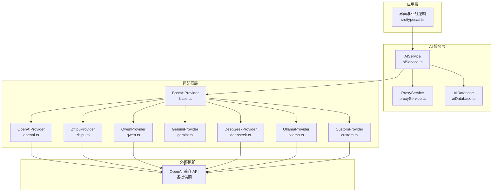
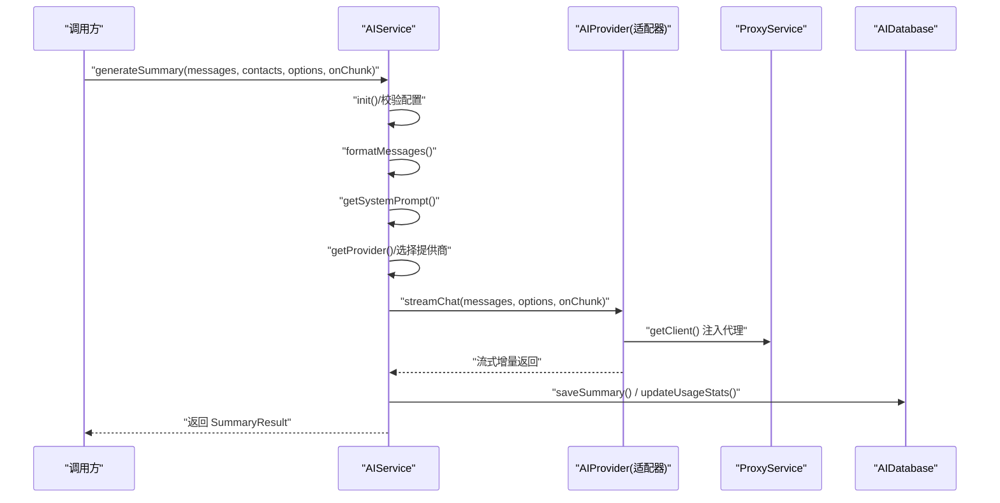
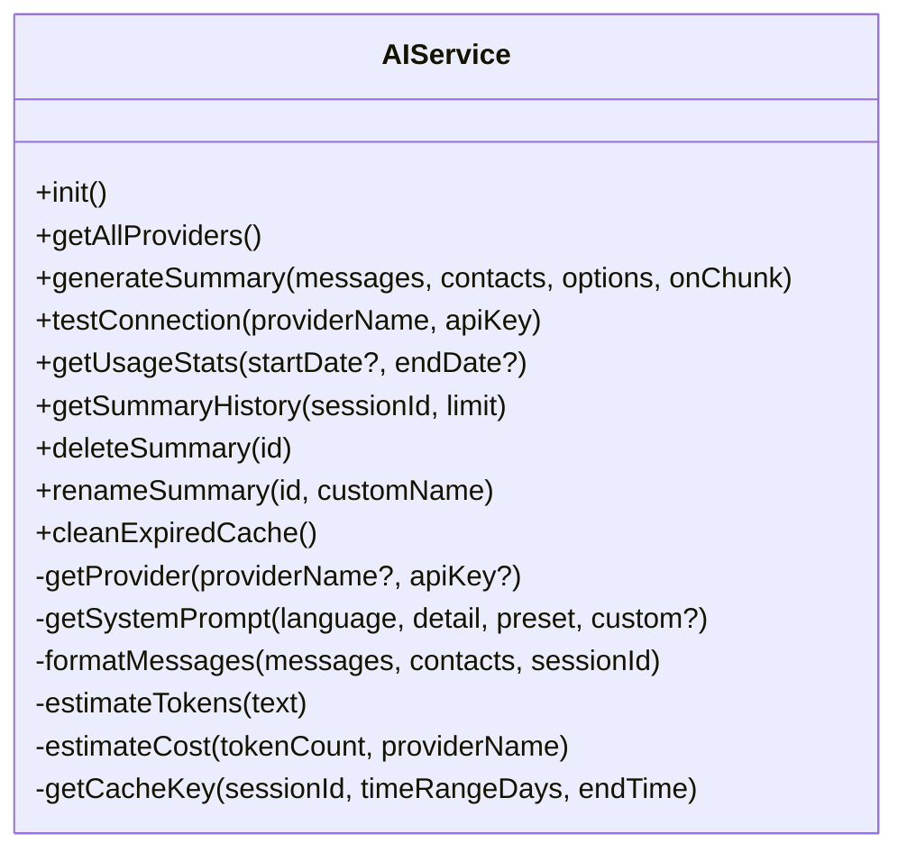
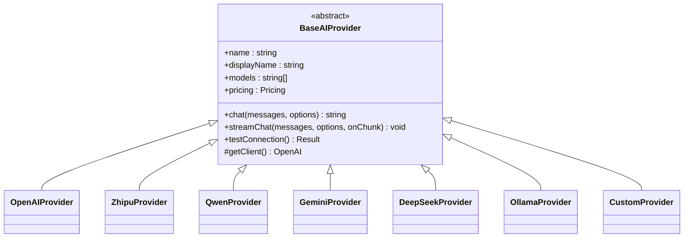
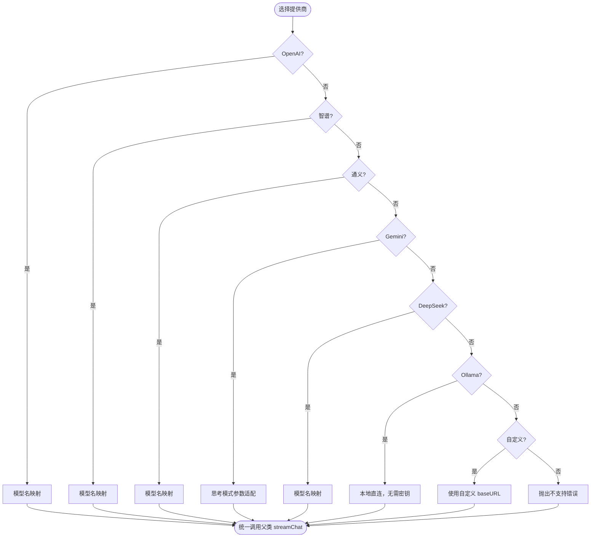
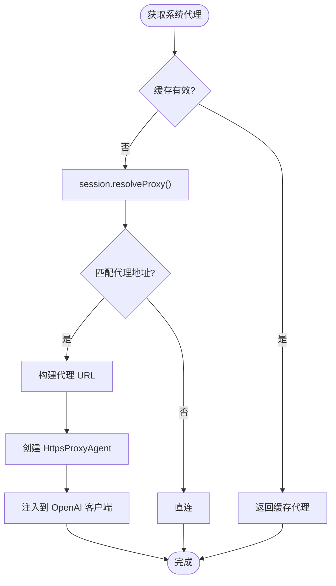
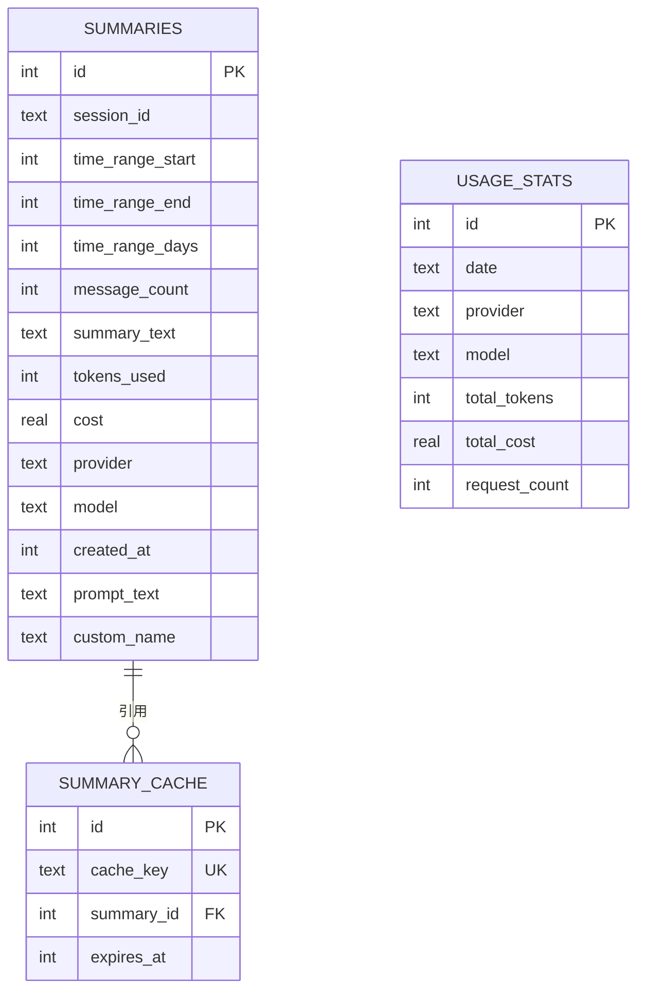
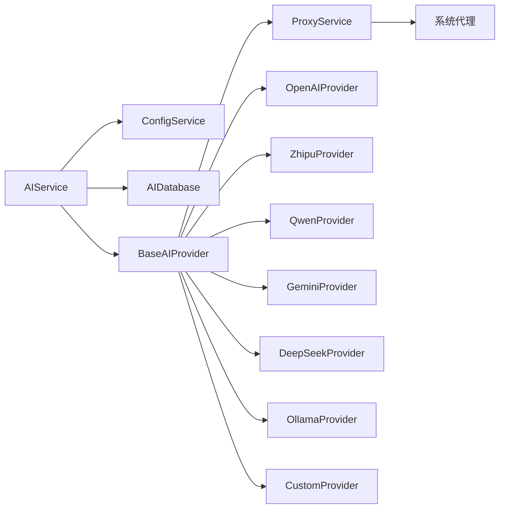

# AI 服务集成

<cite>
**本文引用的文件**
- [electron/services/ai/aiService.ts](file://electron/services/ai/aiService.ts)
- [electron/services/ai/proxyService.ts](file://electron/services/ai/proxyService.ts)
- [electron/services/ai/aiDatabase.ts](file://electron/services/ai/aiDatabase.ts)
- [electron/services/ai/providers/base.ts](file://electron/services/ai/providers/base.ts)
- [electron/services/ai/providers/openai.ts](file://electron/services/ai/providers/openai.ts)
- [electron/services/ai/providers/zhipu.ts](file://electron/services/ai/providers/zhipu.ts)
- [electron/services/ai/providers/qwen.ts](file://electron/services/ai/providers/qwen.ts)
- [electron/services/ai/providers/gemini.ts](file://electron/services/ai/providers/gemini.ts)
- [electron/services/ai/providers/deepseek.ts](file://electron/services/ai/providers/deepseek.ts)
- [electron/services/ai/providers/custom.ts](file://electron/services/ai/providers/custom.ts)
- [electron/services/ai/providers/ollama.ts](file://electron/services/ai/providers/ollama.ts)
- [electron/services/ai/Ollama使用指南.md](file://electron/services/ai/Ollama使用指南.md)
- [electron/services/config.ts](file://electron/services/config.ts)
- [src/types/ai.ts](file://src/types/ai.ts)
</cite>

## 目录
1. [简介](#简介)
2. [项目结构](#项目结构)
3. [核心组件](#核心组件)
4. [架构总览](#架构总览)
5. [详细组件分析](#详细组件分析)
6. [依赖关系分析](#依赖关系分析)
7. [性能考虑](#性能考虑)
8. [故障排查指南](#故障排查指南)
9. [结论](#结论)
10. [附录](#附录)

## 简介
本文件为 CipherTalk 的 AI 服务集成提供系统化技术文档。围绕“AI 服务抽象层、提供商适配器模式、统一接口设计”展开，覆盖多家 AI 提供商（OpenAI、智谱清言、通义千问、Google Gemini、DeepSeek、Ollama、自定义 OpenAI 兼容服务等）的 API 封装与统一接入；阐述 AI 请求的处理流程（请求构建、参数配置、响应解析、错误处理）、代理支持（系统代理检测、代理配置、网络异常处理）、成本统计与思考模式（API 调用计费、推理过程展示、历史记录管理）、性能优化（并发控制、缓存策略、超时处理）以及配置示例与最佳实践，帮助 AI 集成开发者快速理解与扩展。

## 项目结构
AI 服务相关代码集中在 Electron 主进程的 ai 子模块中，采用“抽象层 + 适配器”的分层设计：
- 抽象层：统一接口与基础能力（消息格式化、流式输出、代理注入、连接测试、成本估算）
- 适配器层：各提供商的具体实现（OpenAI、智谱、通义、Gemini、DeepSeek、Ollama、自定义）
- 数据层：SQLite 数据库存储摘要、使用统计与缓存
- 代理层：系统代理检测与注入
- 配置层：全局配置与提供商配置
- 类型层：前端消费的类型定义

图表来源
- [electron/services/ai/aiService.ts:58-631](file://electron/services/ai/aiService.ts#L58-L631)
- [electron/services/ai/proxyService.ts:16-151](file://electron/services/ai/proxyService.ts#L16-L151)
- [electron/services/ai/aiDatabase.ts:8-347](file://electron/services/ai/aiDatabase.ts#L8-L347)
- [electron/services/ai/providers/base.ts:49-241](file://electron/services/ai/providers/base.ts#L49-L241)
- [electron/services/ai/providers/openai.ts:44-77](file://electron/services/ai/providers/openai.ts#L44-L77)
- [electron/services/ai/providers/zhipu.ts:42-75](file://electron/services/ai/providers/zhipu.ts#L42-L75)
- [electron/services/ai/providers/qwen.ts:58-91](file://electron/services/ai/providers/qwen.ts#L58-L91)
- [electron/services/ai/providers/gemini.ts:46-192](file://electron/services/ai/providers/gemini.ts#L46-L192)
- [electron/services/ai/providers/deepseek.ts:29-62](file://electron/services/ai/providers/deepseek.ts#L29-L62)
- [electron/services/ai/providers/ollama.ts:33-97](file://electron/services/ai/providers/ollama.ts#L33-L97)
- [electron/services/ai/providers/custom.ts:37-117](file://electron/services/ai/providers/custom.ts#L37-L117)

章节来源
- [electron/services/ai/aiService.ts:58-631](file://electron/services/ai/aiService.ts#L58-L631)
- [electron/services/ai/aiDatabase.ts:8-347](file://electron/services/ai/aiDatabase.ts#L8-L347)
- [electron/services/ai/proxyService.ts:16-151](file://electron/services/ai/proxyService.ts#L16-L151)
- [electron/services/ai/providers/base.ts:49-241](file://electron/services/ai/providers/base.ts#L49-L241)

## 核心组件
- AIService：AI 服务主控制器，负责提供商选择、消息格式化、系统提示词构建、流式生成、成本估算、历史与统计管理、缓存清理等。
- BaseAIProvider：抽象基类，统一实现非流式/流式聊天、代理注入、连接测试、思考模式参数兼容等。
- Provider 适配器：各提供商的具体实现，负责模型名映射、特定参数适配与错误提示优化。
- AIDatabase：SQLite 数据库封装，存储摘要、使用统计、缓存键与过期时间。
- ProxyService：系统代理检测与注入，解决主进程直连与渲染进程代理差异问题。
- ConfigService：全局配置管理，包含 AI 相关配置（当前提供商、各提供商配置、默认时间范围、系统提示预设、是否启用思考模式、消息条数限制等）。
- 类型定义：前端消费的 AI 提供商信息、时间范围选项、摘要结果、使用统计等。

章节来源
- [electron/services/ai/aiService.ts:58-631](file://electron/services/ai/aiService.ts#L58-L631)
- [electron/services/ai/providers/base.ts:49-241](file://electron/services/ai/providers/base.ts#L49-L241)
- [electron/services/ai/aiDatabase.ts:8-347](file://electron/services/ai/aiDatabase.ts#L8-L347)
- [electron/services/ai/proxyService.ts:16-151](file://electron/services/ai/proxyService.ts#L16-L151)
- [electron/services/config.ts:65-124](file://electron/services/config.ts#L65-L124)
- [src/types/ai.ts:1-93](file://src/types/ai.ts#L1-L93)

## 架构总览
AI 服务采用“抽象层 + 适配器 + 统一接口”的设计，核心流程如下：
- 初始化：校验缓存路径与用户标识，初始化数据库
- 选择提供商：根据配置或显式参数选择具体提供商实例
- 构建提示词：系统提示词 + 用户提示词 + 可选自定义要求
- 格式化消息：将微信消息转换为结构化文本，处理语音转写、聊天记录、媒体类型等
- 流式生成：统一调用 streamChat，自动处理思考模式标签与推理内容
- 成本与统计：估算 tokens，计算成本，更新使用统计
- 历史与缓存：持久化摘要、支持重命名、删除、历史查询、缓存清理

图表来源
- [electron/services/ai/aiService.ts:439-539](file://electron/services/ai/aiService.ts#L439-L539)
- [electron/services/ai/providers/base.ts:106-175](file://electron/services/ai/providers/base.ts#L106-L175)
- [electron/services/ai/proxyService.ts:78-99](file://electron/services/ai/proxyService.ts#L78-L99)
- [electron/services/ai/aiDatabase.ts:117-226](file://electron/services/ai/aiDatabase.ts#L117-L226)

## 详细组件分析

### AIService：AI 服务主控制器
职责与特性：
- 初始化与数据库：校验配置，初始化 SQLite 数据库
- 提供商选择：支持 openai、gemini、zhipu、deepseek、qwen、doubao、kimi、siliconflow、xiaomi、tencent、xai、ollama、custom 等
- 系统提示词：内置多风格提示词模板，支持自定义与预设切换
- 消息格式化：将微信消息转换为结构化文本，处理语音转写、聊天记录、媒体类型等
- 流式生成：统一调用 streamChat，回调增量输出
- 成本与统计：估算 tokens、计算成本、更新使用统计
- 历史与缓存：保存摘要、历史查询、删除、重命名、缓存清理

图表来源
- [electron/services/ai/aiService.ts:58-631](file://electron/services/ai/aiService.ts#L58-L631)

章节来源
- [electron/services/ai/aiService.ts:58-631](file://electron/services/ai/aiService.ts#L58-L631)

### BaseAIProvider：抽象基类与统一接口
职责与特性：
- 统一接口：chat、streamChat、testConnection
- 代理注入：每次请求动态获取系统代理，注入 httpAgent
- 超时控制：默认 60 秒超时，连接测试 15 秒超时
- 思考模式：统一处理 reasoning_content 与提供商特定参数（reasoning_effort、thinking、thinking_config）
- 错误分类：区分网络错误、鉴权错误、限流与服务端错误，返回 needsProxy 标记

图表来源
- [electron/services/ai/providers/base.ts:49-241](file://electron/services/ai/providers/base.ts#L49-L241)
- [electron/services/ai/providers/openai.ts:44-77](file://electron/services/ai/providers/openai.ts#L44-L77)
- [electron/services/ai/providers/zhipu.ts:42-75](file://electron/services/ai/providers/zhipu.ts#L42-L75)
- [electron/services/ai/providers/qwen.ts:58-91](file://electron/services/ai/providers/qwen.ts#L58-L91)
- [electron/services/ai/providers/gemini.ts:46-192](file://electron/services/ai/providers/gemini.ts#L46-L192)
- [electron/services/ai/providers/deepseek.ts:29-62](file://electron/services/ai/providers/deepseek.ts#L29-L62)
- [electron/services/ai/providers/ollama.ts:33-97](file://electron/services/ai/providers/ollama.ts#L33-L97)
- [electron/services/ai/providers/custom.ts:37-117](file://electron/services/ai/providers/custom.ts#L37-L117)

章节来源
- [electron/services/ai/providers/base.ts:49-241](file://electron/services/ai/providers/base.ts#L49-L241)

### Provider 适配器：多家提供商的 API 封装
- OpenAI：模型名映射，兼容最新模型别名
- 智谱清言：模型名映射，使用官方 PaaS 端点
- 通义千问：模型名映射，兼容 DashScope 兼容端点
- Google Gemini：统一 OpenAI 兼容端点，针对不同代际模型使用 thinking_config 或 reasoning_effort
- DeepSeek：模型名映射，支持推理模型
- Ollama：本地服务，无需 API Key，支持自定义 baseURL
- 自定义：支持任意 OpenAI 兼容服务，需提供 baseURL

图表来源
- [electron/services/ai/providers/openai.ts:30-77](file://electron/services/ai/providers/openai.ts#L30-L77)
- [electron/services/ai/providers/zhipu.ts:29-75](file://electron/services/ai/providers/zhipu.ts#L29-L75)
- [electron/services/ai/providers/qwen.ts:37-91](file://electron/services/ai/providers/qwen.ts#L37-L91)
- [electron/services/ai/providers/gemini.ts:31-192](file://electron/services/ai/providers/gemini.ts#L31-L192)
- [electron/services/ai/providers/deepseek.ts:21-62](file://electron/services/ai/providers/deepseek.ts#L21-L62)
- [electron/services/ai/providers/ollama.ts:39-97](file://electron/services/ai/providers/ollama.ts#L39-L97)
- [electron/services/ai/providers/custom.ts:43-117](file://electron/services/ai/providers/custom.ts#L43-L117)

章节来源
- [electron/services/ai/providers/openai.ts:44-77](file://electron/services/ai/providers/openai.ts#L44-L77)
- [electron/services/ai/providers/zhipu.ts:42-75](file://electron/services/ai/providers/zhipu.ts#L42-L75)
- [electron/services/ai/providers/qwen.ts:58-91](file://electron/services/ai/providers/qwen.ts#L58-L91)
- [electron/services/ai/providers/gemini.ts:46-192](file://electron/services/ai/providers/gemini.ts#L46-L192)
- [electron/services/ai/providers/deepseek.ts:29-62](file://electron/services/ai/providers/deepseek.ts#L29-L62)
- [electron/services/ai/providers/ollama.ts:33-97](file://electron/services/ai/providers/ollama.ts#L33-L97)
- [electron/services/ai/providers/custom.ts:37-117](file://electron/services/ai/providers/custom.ts#L37-L117)

### ProxyService：系统代理检测与注入
- 系统代理检测：通过 Electron session.resolveProxy 获取系统代理规则，解析 DIRECT、PROXY、HTTPS、SOCKS5 等
- 代理 Agent 创建：使用 https-proxy-agent 构建代理 Agent，注入到 OpenAI 客户端
- 缓存与测试：1 分钟缓存、代理连通性测试（HEAD 请求，5 秒超时）

图表来源
- [electron/services/ai/proxyService.ts:26-99](file://electron/services/ai/proxyService.ts#L26-L99)

章节来源
- [electron/services/ai/proxyService.ts:16-151](file://electron/services/ai/proxyService.ts#L16-L151)

### AIDatabase：摘要、统计与缓存
- 表结构：summaries、usage_stats、summary_cache
- 功能：保存摘要、缓存、查询历史、更新使用统计、删除与重命名、清理过期缓存
- 索引：为高频查询建立索引，提升性能

图表来源
- [electron/services/ai/aiDatabase.ts:35-102](file://electron/services/ai/aiDatabase.ts#L35-L102)
- [electron/services/ai/aiDatabase.ts:117-332](file://electron/services/ai/aiDatabase.ts#L117-L332)

章节来源
- [electron/services/ai/aiDatabase.ts:8-347](file://electron/services/ai/aiDatabase.ts#L8-L347)

### ConfigService：全局配置与 AI 设置
- AI 相关配置：当前提供商、各提供商配置（apiKey、model）、默认时间范围、摘要详细度、系统提示预设、是否启用缓存、是否启用思考模式、消息条数限制等
- 默认值：提供合理默认，保证首次使用体验
- 迁移：支持旧配置迁移至新结构

章节来源
- [electron/services/config.ts:65-124](file://electron/services/config.ts#L65-L124)
- [electron/services/config.ts:126-200](file://electron/services/config.ts#L126-L200)

### 类型定义：前端消费的类型
- AIProviderInfo：提供商信息（id、name、displayName、models、pricing、website、logo 等）
- 时间范围选项：支持 1/3/7/30/60/90/180/365 天与全部消息
- 摘要结果：包含会话信息、时间范围、消息数量、摘要文本、tokens、成本、提供商与模型、创建时间、自定义名称
- 使用统计：按日期聚合的 tokens、成本与请求次数

章节来源
- [src/types/ai.ts:1-93](file://src/types/ai.ts#L1-L93)

## 依赖关系分析
- AIService 依赖 ConfigService 获取提供商配置，依赖 AIDatabase 进行持久化，依赖 ProxyService 注入代理
- BaseAIProvider 依赖 ProxyService 获取代理 Agent，统一实现流式输出与思考模式
- 各 Provider 适配器继承 BaseAIProvider，仅实现模型名映射与特定参数适配
- ProxyService 依赖 Electron session 与 https-proxy-agent
- AIDatabase 依赖 better-sqlite3

图表来源
- [electron/services/ai/aiService.ts:1-16](file://electron/services/ai/aiService.ts#L1-L16)
- [electron/services/ai/providers/base.ts:1-3](file://electron/services/ai/providers/base.ts#L1-L3)
- [electron/services/ai/proxyService.ts:1-2](file://electron/services/ai/proxyService.ts#L1-L2)

章节来源
- [electron/services/ai/aiService.ts:1-16](file://electron/services/ai/aiService.ts#L1-L16)
- [electron/services/ai/providers/base.ts:1-3](file://electron/services/ai/providers/base.ts#L1-L3)
- [electron/services/ai/proxyService.ts:1-2](file://electron/services/ai/proxyService.ts#L1-L2)

## 性能考虑
- 并发控制：当前 AIService 未显式限制并发，建议在调用方层面控制并发，避免过多流式请求导致资源争用
- 缓存策略：AIService 内部使用“按会话+时间范围+天对齐”的缓存键，配合数据库缓存表实现命中与过期管理；建议结合 ConfigService 的 aiEnableCache 开关统一控制
- 超时处理：BaseAIProvider 默认 60 秒超时，连接测试 15 秒超时；可根据网络环境调整
- 代理复用：ProxyService 缓存 1 分钟，减少频繁查询系统代理带来的开销
- 消息条数限制：ConfigService 的 aiMessageLimit 可限制输入消息数量，降低 tokens 与成本
- 估算成本：AIService 提供 estimateTokens 与 estimateCost，便于前端预估成本

章节来源
- [electron/services/ai/aiService.ts:412-425](file://electron/services/ai/aiService.ts#L412-L425)
- [electron/services/ai/providers/base.ts:71-90](file://electron/services/ai/providers/base.ts#L71-L90)
- [electron/services/ai/proxyService.ts:17-19](file://electron/services/ai/proxyService.ts#L17-L19)
- [electron/services/config.ts:78-124](file://electron/services/config.ts#L78-L124)

## 故障排查指南
常见问题与定位思路：
- 连接失败/超时：检查网络与代理，查看 ProxyService 的 needsProxy 标记；必要时开启系统代理或更换提供商
- API Key 无效/权限不足：检查 ConfigService 中对应提供商的 apiKey 配置
- 请求过于频繁/限流：等待冷却或降低并发
- 服务器错误：稍后重试或切换提供商
- Ollama 本地服务未启动：参考 Ollama 使用指南，确认服务已启动与端口正确
- 代理不可用：使用 ProxyService.testProxy 进行连通性测试

章节来源
- [electron/services/ai/providers/base.ts:177-240](file://electron/services/ai/providers/base.ts#L177-L240)
- [electron/services/ai/providers/ollama.ts:48-96](file://electron/services/ai/providers/ollama.ts#L48-L96)
- [electron/services/ai/proxyService.ts:115-146](file://electron/services/ai/proxyService.ts#L115-L146)
- [electron/services/ai/Ollama使用指南.md:63-94](file://electron/services/ai/Ollama使用指南.md#L63-L94)

## 结论
CipherTalk 的 AI 服务集成通过“抽象层 + 适配器 + 统一接口”的架构，实现了对多家 AI 提供商的统一接入与扩展。其核心优势在于：
- 统一的流式输出与思考模式处理，保障用户体验
- 完整的成本估算与使用统计，便于成本控制
- 系统代理检测与注入，解决主进程网络差异
- SQLite 数据库存储摘要与统计，支持历史管理与缓存清理
- 清晰的配置体系与类型定义，便于前端与后端协作

建议在生产环境中结合并发控制、缓存策略与代理测试，持续优化性能与稳定性。

## 附录

### 配置示例与最佳实践
- OpenAI
  - 基础配置：apiKey、模型选择（如最新别名）
  - 最佳实践：优先使用最新模型别名，关注配额与限流
- 智谱清言
  - 基础配置：apiKey、模型选择（GLM-5/4.x 系列）
  - 最佳实践：国内网络建议开启代理，注意模型价格与限额
- 通义千问
  - 基础配置：apiKey、模型选择（Qwen Plus/Turbo/3 Omni 等）
  - 最佳实践：根据任务复杂度选择合适模型，注意推理模型的思考模式参数
- Google Gemini
  - 基础配置：apiKey、模型选择（Gemini 3/2.5/2.0 系列）
  - 最佳实践：根据模型代际选择 thinking_config 或 reasoning_effort 参数
- DeepSeek
  - 基础配置：apiKey、模型选择（DeepSeek V3/R1）
  - 最佳实践：性价比高，适合长文本与推理任务
- Ollama（本地）
  - 基础配置：无需 apiKey，配置 baseURL（默认 http://localhost:11434/v1）
  - 最佳实践：确保服务已启动，根据硬件选择合适模型与加速方式
- 自定义（OpenAI 兼容）
  - 基础配置：apiKey、baseURL（需包含 /v1）
  - 最佳实践：确保 baseURL 正确，测试连接时留意 404/401/403 等错误提示

章节来源
- [electron/services/ai/providers/openai.ts:30-77](file://electron/services/ai/providers/openai.ts#L30-L77)
- [electron/services/ai/providers/zhipu.ts:29-75](file://electron/services/ai/providers/zhipu.ts#L29-L75)
- [electron/services/ai/providers/qwen.ts:37-91](file://electron/services/ai/providers/qwen.ts#L37-L91)
- [electron/services/ai/providers/gemini.ts:31-192](file://electron/services/ai/providers/gemini.ts#L31-L192)
- [electron/services/ai/providers/deepseek.ts:21-62](file://electron/services/ai/providers/deepseek.ts#L21-L62)
- [electron/services/ai/providers/ollama.ts:39-97](file://electron/services/ai/providers/ollama.ts#L39-L97)
- [electron/services/ai/providers/custom.ts:43-117](file://electron/services/ai/providers/custom.ts#L43-L117)
- [electron/services/ai/Ollama使用指南.md:50-94](file://electron/services/ai/Ollama使用指南.md#L50-L94)