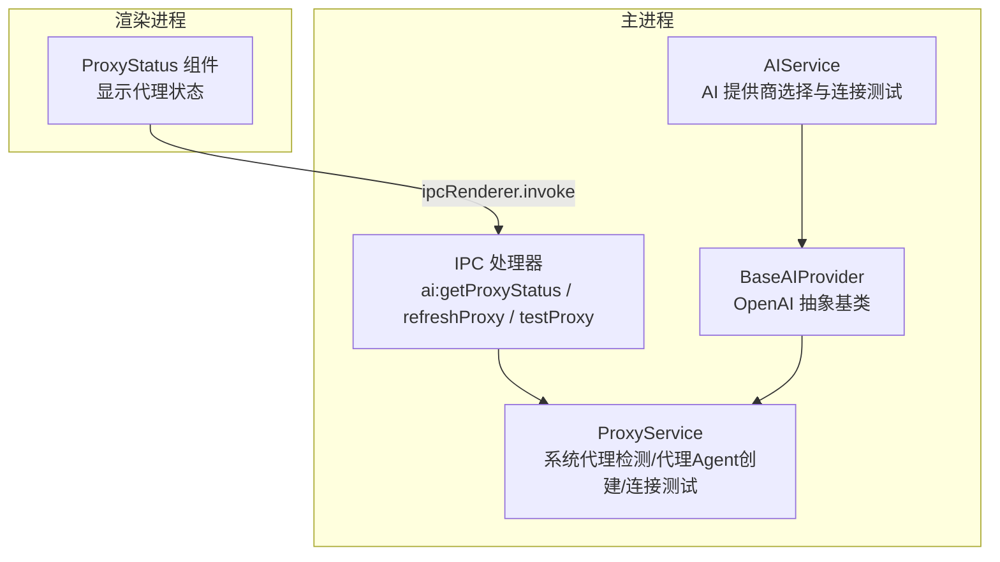
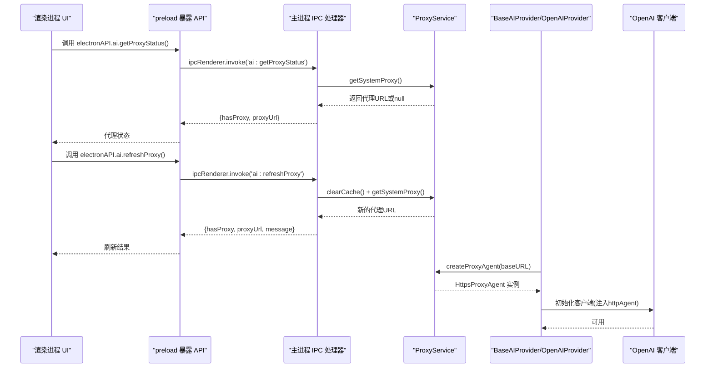
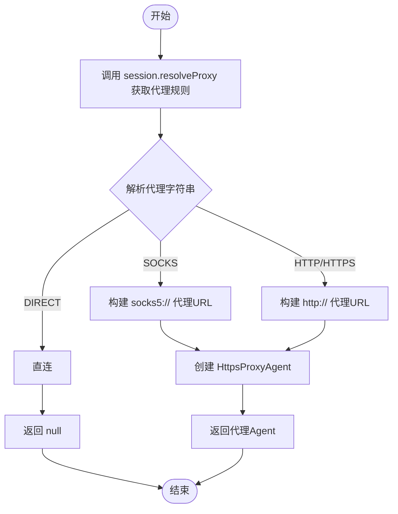
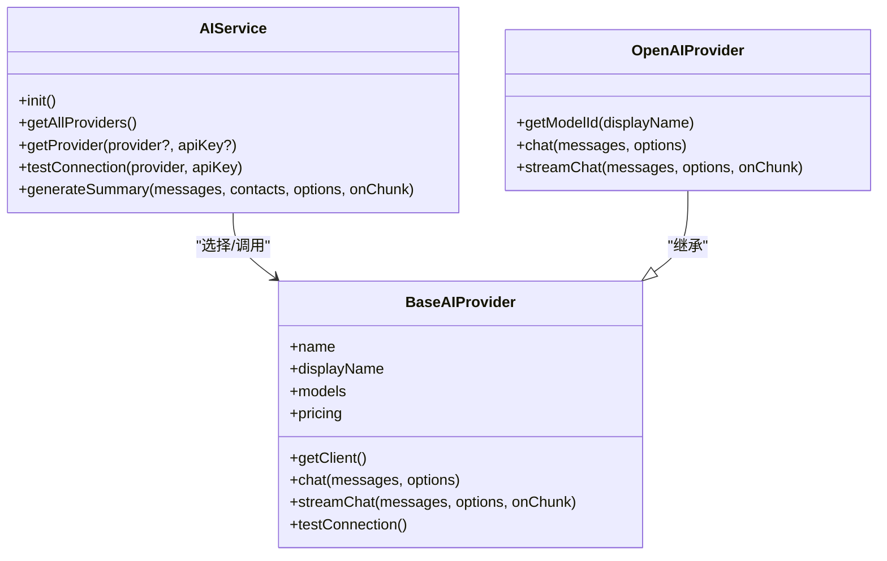
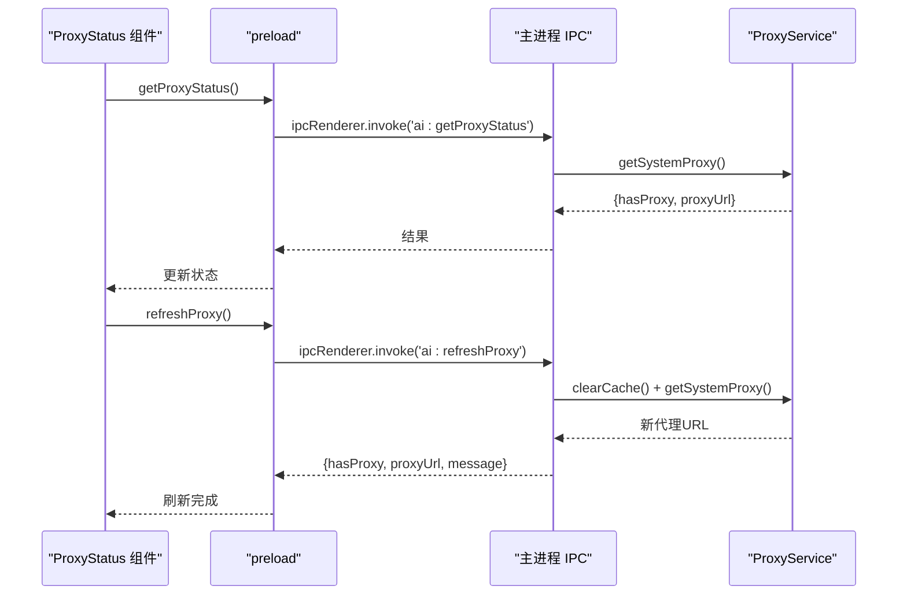
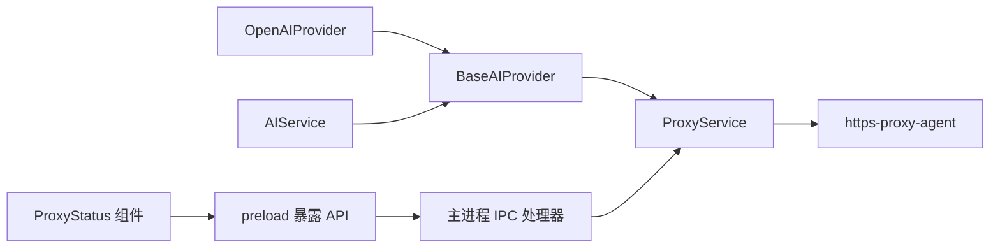

# 代理支持与网络配置

<cite>
**本文档引用的文件**
- [proxyService.ts](file://electron/services/ai/proxyService.ts)
- [ProxyStatus.tsx](file://src/components/ai/ProxyStatus.tsx)
- [ProxyStatus.scss](file://src/components/ai/ProxyStatus.scss)
- [aiService.ts](file://electron/services/ai/aiService.ts)
- [config.ts](file://electron/services/config.ts)
- [base.ts](file://electron/services/ai/providers/base.ts)
- [openai.ts](file://electron/services/ai/providers/openai.ts)
- [main.ts](file://electron/main.ts)
- [preload.ts](file://electron/preload.ts)
- [logService.ts](file://electron/services/logService.ts)
</cite>

## 目录
1. [简介](#简介)
2. [项目结构](#项目结构)
3. [核心组件](#核心组件)
4. [架构总览](#架构总览)
5. [详细组件分析](#详细组件分析)
6. [依赖关系分析](#依赖关系分析)
7. [性能考量](#性能考量)
8. [故障排除指南](#故障排除指南)
9. [结论](#结论)
10. [附录](#附录)

## 简介
本文件针对 CipherTalk 的代理支持与网络配置功能进行全面技术说明，覆盖以下方面：
- 代理检测机制：系统代理自动发现、代理配置验证、网络连通性测试
- 代理配置选项：HTTP 代理、SOCKS 代理、认证设置、例外域名
- 网络异常处理：连接超时、重试机制、故障转移、降级策略
- 代理服务实现：代理服务器管理、连接池优化、SSL/TLS 支持
- 网络诊断功能：连接测试、延迟测量、带宽检测、错误日志
- 代理配置最佳实践：安全性考虑、性能优化、故障排除
- 不同网络环境下的配置示例与故障排除指南
- 代理与 AI 服务的集成方式与注意事项

## 项目结构
CipherTalk 在 Electron 主进程中实现了代理服务，配合渲染进程的 UI 组件展示代理状态；AI 服务通过提供商抽象层统一接入代理能力。

**图表来源**
- [ProxyStatus.tsx:1-99](file://src/components/ai/ProxyStatus.tsx#L1-L99)
- [main.ts:3264-3298](file://electron/main.ts#L3264-L3298)
- [proxyService.ts:1-151](file://electron/services/ai/proxyService.ts#L1-L151)
- [aiService.ts:543-557](file://electron/services/ai/aiService.ts#L543-L557)
- [base.ts:68-90](file://electron/services/ai/providers/base.ts#L68-L90)

**章节来源**
- [ProxyStatus.tsx:1-99](file://src/components/ai/ProxyStatus.tsx#L1-L99)
- [main.ts:3264-3298](file://electron/main.ts#L3264-L3298)
- [proxyService.ts:1-151](file://electron/services/ai/proxyService.ts#L1-L151)
- [aiService.ts:543-557](file://electron/services/ai/aiService.ts#L543-L557)
- [base.ts:68-90](file://electron/services/ai/providers/base.ts#L68-L90)

## 核心组件
- 代理服务（ProxyService）：负责系统代理自动发现、代理 Agent 创建、代理连接测试与缓存管理
- AI 服务（AIService）：负责提供商选择、连接测试、摘要生成与使用统计
- 提供商抽象（BaseAIProvider）：封装 OpenAI 客户端初始化、代理注入、流式/非流式聊天、连接测试
- IPC 桥接：在主进程注册代理相关 IPC 处理器，渲染进程通过 preload 暴露的 API 调用
- UI 组件（ProxyStatus）：展示当前代理状态，支持手动刷新

**章节来源**
- [proxyService.ts:16-151](file://electron/services/ai/proxyService.ts#L16-L151)
- [aiService.ts:58-631](file://electron/services/ai/aiService.ts#L58-L631)
- [base.ts:49-241](file://electron/services/ai/providers/base.ts#L49-L241)
- [preload.ts:407-434](file://electron/preload.ts#L407-L434)
- [ProxyStatus.tsx:9-99](file://src/components/ai/ProxyStatus.tsx#L9-L99)

## 架构总览
代理与网络配置的整体流程如下：

**图表来源**
- [main.ts:3264-3298](file://electron/main.ts#L3264-L3298)
- [proxyService.ts:26-99](file://electron/services/ai/proxyService.ts#L26-L99)
- [base.ts:68-90](file://electron/services/ai/providers/base.ts#L68-L90)
- [openai.ts:44-77](file://electron/services/ai/providers/openai.ts#L44-L77)
- [preload.ts:407-411](file://electron/preload.ts#L407-L411)

## 详细组件分析

### 代理服务（ProxyService）
- 系统代理自动发现：通过 Electron session.resolveProxy 获取系统代理规则，解析 DIRECT/PROXY/HTTPS/SOCKS5 等格式，构建代理 URL
- 代理 Agent 创建：基于检测到的代理 URL 创建 HttpsProxyAgent，注入到 OpenAI 客户端的 httpAgent
- 代理连接测试：使用 Node https 模块发起 HEAD 请求，指定代理 Agent，设置超时，判断状态码小于 500 为成功
- 缓存与刷新：1 分钟缓存系统代理结果，支持手动 clearCache 刷新

**图表来源**
- [proxyService.ts:26-99](file://electron/services/ai/proxyService.ts#L26-L99)

**章节来源**
- [proxyService.ts:16-151](file://electron/services/ai/proxyService.ts#L16-L151)

### AI 服务与提供商抽象
- AIService：负责提供商选择、连接测试、摘要生成与统计
- BaseAIProvider：延迟初始化 OpenAI 客户端，每次请求时动态获取代理配置；支持流式/非流式聊天；统一连接测试逻辑
- OpenAIProvider：继承 BaseAIProvider，提供模型映射与具体实现

**图表来源**
- [aiService.ts:58-631](file://electron/services/ai/aiService.ts#L58-L631)
- [base.ts:49-241](file://electron/services/ai/providers/base.ts#L49-L241)
- [openai.ts:44-77](file://electron/services/ai/providers/openai.ts#L44-L77)

**章节来源**
- [aiService.ts:58-631](file://electron/services/ai/aiService.ts#L58-L631)
- [base.ts:49-241](file://electron/services/ai/providers/base.ts#L49-L241)
- [openai.ts:44-77](file://electron/services/ai/providers/openai.ts#L44-L77)

### UI 代理状态组件（ProxyStatus）
- 功能：展示当前系统代理状态（直连/代理），支持手动刷新
- 交互：通过 preload 暴露的 electronAPI.ai 接口调用主进程 IPC，获取代理状态并刷新

**图表来源**
- [ProxyStatus.tsx:22-64](file://src/components/ai/ProxyStatus.tsx#L22-L64)
- [preload.ts:408-411](file://electron/preload.ts#L408-L411)
- [main.ts:3264-3287](file://electron/main.ts#L3264-L3287)

**章节来源**
- [ProxyStatus.tsx:9-99](file://src/components/ai/ProxyStatus.tsx#L9-L99)
- [ProxyStatus.scss:1-85](file://src/components/ai/ProxyStatus.scss#L1-L85)
- [preload.ts:407-411](file://electron/preload.ts#L407-L411)
- [main.ts:3264-3287](file://electron/main.ts#L3264-L3287)

### IPC 与配置
- 主进程注册代理相关 IPC 处理器：获取代理状态、刷新代理、测试代理
- preload 暴露 electronAPI.ai.* 接口供渲染进程调用
- 配置服务（ConfigService）提供全局配置读取与持久化，包括 AI 提供商配置、缓存路径等

**章节来源**
- [main.ts:3264-3298](file://electron/main.ts#L3264-L3298)
- [preload.ts:407-411](file://electron/preload.ts#L407-L411)
- [config.ts:347-394](file://electron/services/config.ts#L347-L394)

## 依赖关系分析

**图表来源**
- [proxyService.ts:1-3](file://electron/services/ai/proxyService.ts#L1-L3)
- [base.ts:1-2](file://electron/services/ai/providers/base.ts#L1-L2)
- [openai.ts:1-1](file://electron/services/ai/providers/openai.ts#L1-L1)
- [aiService.ts:1-16](file://electron/services/ai/aiService.ts#L1-L16)
- [ProxyStatus.tsx:1-4](file://src/components/ai/ProxyStatus.tsx#L1-L4)
- [preload.ts:407-411](file://electron/preload.ts#L407-L411)
- [main.ts:3264-3298](file://electron/main.ts#L3264-L3298)

**章节来源**
- [proxyService.ts:1-3](file://electron/services/ai/proxyService.ts#L1-L3)
- [base.ts:1-2](file://electron/services/ai/providers/base.ts#L1-L2)
- [openai.ts:1-1](file://electron/services/ai/providers/openai.ts#L1-L1)
- [aiService.ts:1-16](file://electron/services/ai/aiService.ts#L1-L16)
- [ProxyStatus.tsx:1-4](file://src/components/ai/ProxyStatus.tsx#L1-L4)
- [preload.ts:407-411](file://electron/preload.ts#L407-L411)
- [main.ts:3264-3298](file://electron/main.ts#L3264-L3298)

## 性能考量
- 代理缓存：ProxyService 对系统代理查询结果进行 1 分钟缓存，减少频繁查询带来的性能损耗
- 延迟初始化：BaseAIProvider 在实际请求时才创建 OpenAI 客户端，确保代理配置最新
- 超时控制：OpenAI 客户端设置 60 秒超时，连接测试设置 15 秒超时，避免长时间阻塞
- 流式传输：支持流式聊天，提升用户体验，减少首字节延迟

**章节来源**
- [proxyService.ts:17-19](file://electron/services/ai/proxyService.ts#L17-L19)
- [base.ts:68-90](file://electron/services/ai/providers/base.ts#L68-L90)
- [base.ts:78-79](file://electron/services/ai/providers/base.ts#L78-L79)
- [base.ts:182-189](file://electron/services/ai/providers/base.ts#L182-L189)

## 故障排除指南
- 代理未生效
  - 检查系统代理设置是否正确，确认 resolveProxy 返回非 DIRECT
  - 使用 UI 中的“刷新代理配置”按钮触发 clearCache + 重新检测
  - 使用“测试代理”功能验证代理连通性
- 连接超时/被拒绝
  - 检查网络环境与防火墙设置
  - 确认提供商 baseURL 正确（如 OpenAI 为 api.openai.com/v1）
  - 查看日志服务记录，定位具体错误码
- API Key 无效/权限不足
  - 确认 API Key 正确且具有相应权限
  - 检查提供商配置项（aiProviderConfigs）
- 日志与诊断
  - 使用日志服务查看详细错误信息
  - 通过 AIService.testConnection 获取更具体的错误提示

**章节来源**
- [ProxyStatus.tsx:43-60](file://src/components/ai/ProxyStatus.tsx#L43-L60)
- [main.ts:3294-3298](file://electron/main.ts#L3294-L3298)
- [base.ts:177-240](file://electron/services/ai/providers/base.ts#L177-L240)
- [logService.ts:214-237](file://electron/services/logService.ts#L214-L237)

## 结论
CipherTalk 的代理支持与网络配置通过 Electron 的 session.resolveProxy 实现系统代理自动发现，并在主进程集中管理代理 Agent 的创建与缓存。AI 服务通过提供商抽象层统一接入代理能力，渲染进程提供直观的代理状态展示与手动刷新功能。整体设计具备良好的扩展性与可维护性，能够满足不同网络环境下的代理需求。

## 附录

### 代理配置选项与最佳实践
- HTTP 代理：支持 PROXY/HTTPS 格式，自动识别并构建 http:// 代理 URL
- SOCKS 代理：支持 SOCKS/SOCKS5 格式，自动识别并构建 socks5:// 代理 URL
- 认证设置：当前实现未包含代理认证逻辑，如需认证代理，请在系统代理设置中预先配置
- 例外域名：系统代理规则由操作系统决定，应用层不做例外域名白名单处理

**章节来源**
- [proxyService.ts:40-64](file://electron/services/ai/proxyService.ts#L40-L64)

### 不同网络环境下的配置示例
- 企业内网（需代理）：在系统代理中配置 HTTP/SOCKS 代理，应用自动跟随
- 公共 Wi-Fi（需认证）：在系统代理中配置认证信息，应用自动跟随
- 无代理环境：系统代理返回 DIRECT，应用直连

**章节来源**
- [proxyService.ts:26-76](file://electron/services/ai/proxyService.ts#L26-L76)

### 代理与 AI 服务集成注意事项
- 代理注入时机：BaseAIProvider 在 getClient() 时动态获取代理 Agent，确保每次请求使用最新配置
- 超时与重试：客户端设置 60 秒超时，连接测试设置 15 秒超时；可根据网络状况调整
- 错误分类：根据错误码与消息判断是否需要代理，提供针对性的错误提示

**章节来源**
- [base.ts:68-90](file://electron/services/ai/providers/base.ts#L68-L90)
- [base.ts:177-240](file://electron/services/ai/providers/base.ts#L177-L240)