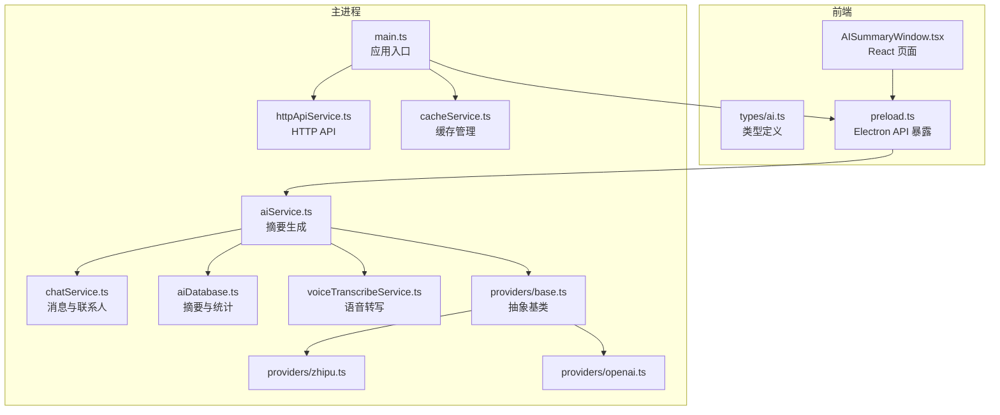
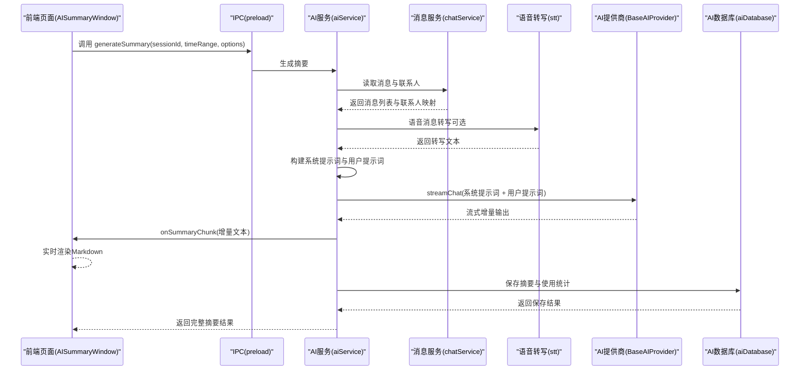
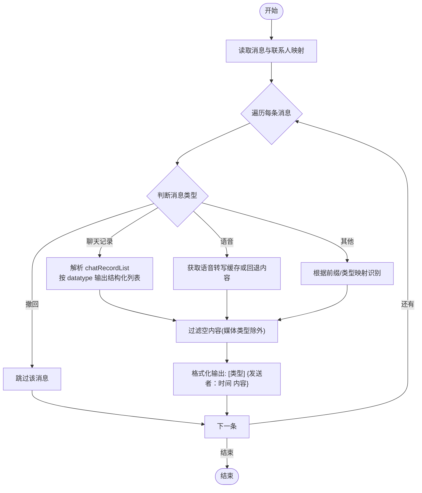
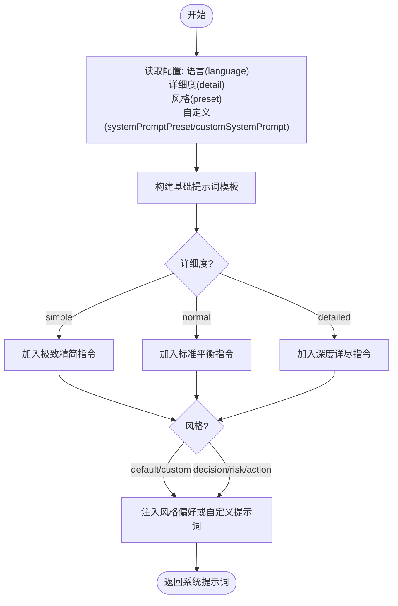
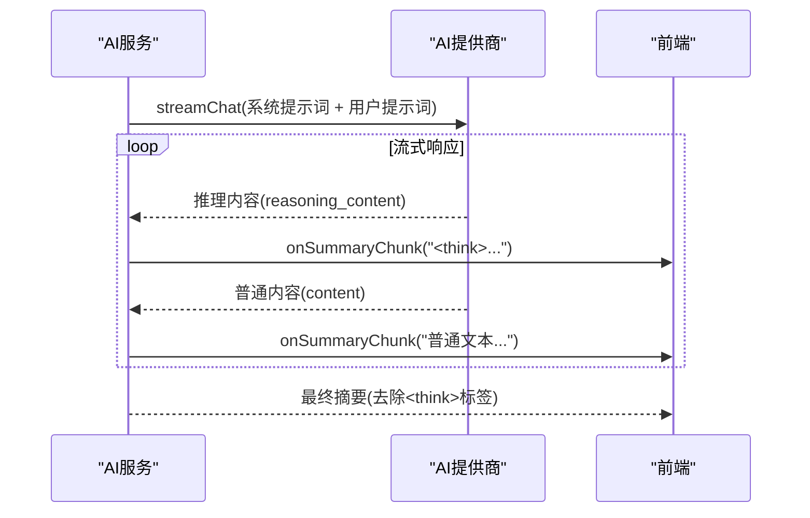
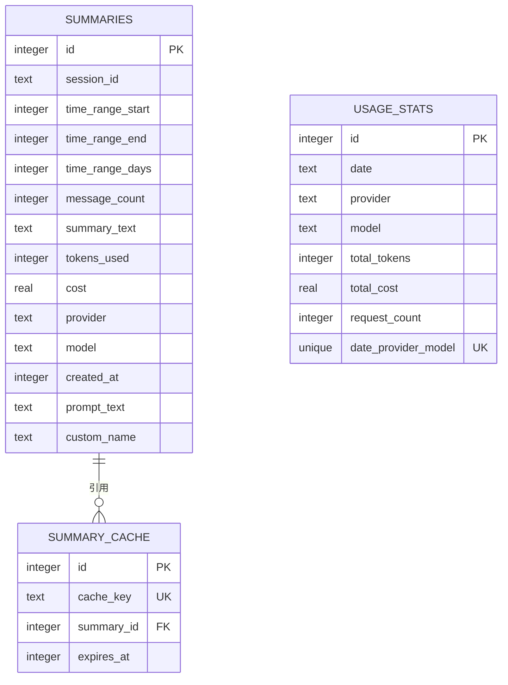
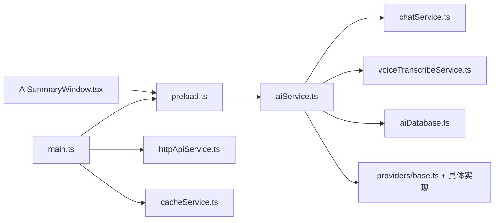

# 智能摘要工作流程

<cite>
**本文档引用的文件**
- [chatService.ts](file://electron/services/chatService.ts)
- [aiService.ts](file://electron/services/ai/aiService.ts)
- [AISummaryWindow.tsx](file://src/pages/AISummaryWindow.tsx)
- [aiDatabase.ts](file://electron/services/ai/aiDatabase.ts)
- [voiceTranscribeService.ts](file://electron/services/voiceTranscribeService.ts)
- [base.ts](file://electron/services/ai/providers/base.ts)
- [zhipu.ts](file://electron/services/ai/providers/zhipu.ts)
- [openai.ts](file://electron/services/ai/providers/openai.ts)
- [ai.ts](file://src/types/ai.ts)
- [preload.ts](file://electron/preload.ts)
- [main.ts](file://electron/main.ts)
- [httpApiService.ts](file://electron/services/httpApiService.ts)
- [cacheService.ts](file://electron/services/cacheService.ts)
</cite>

## 目录
1. [简介](#简介)
2. [项目结构](#项目结构)
3. [核心组件](#核心组件)
4. [架构总览](#架构总览)
5. [详细组件分析](#详细组件分析)
6. [依赖关系分析](#依赖关系分析)
7. [性能考虑](#性能考虑)
8. [故障排除指南](#故障排除指南)
9. [结论](#结论)
10. [附录](#附录)

## 简介
本文件面向 CipherTalk 的智能摘要工作流程，系统性阐述从输入数据准备、消息格式化、系统提示词构建、用户提示词生成、AI 请求发送、流式响应处理到结果保存的完整链路。同时深入解析消息格式化逻辑（含聊天记录、语音、图片等特殊类型）、系统提示词的动态生成机制（详细度控制、风格偏好、自定义提示词、多语言支持）、流式响应处理（增量输出、实时更新、错误恢复、性能优化）、摘要结果的存储与管理（数据库结构、缓存策略、历史记录、使用统计），并提供性能优化策略与使用场景说明。

## 项目结构
- Electron 主进程负责数据库连接、AI 服务、HTTP API、IPC 暴露等核心能力。
- 前端 React 页面负责用户交互、配置读取、流式渲染与历史管理。
- AI 服务模块统一管理多家大模型提供商，实现跨平台、可插拔的摘要生成。

**图表来源**
- [AISummaryWindow.tsx:1-743](file://src/pages/AISummaryWindow.tsx#L1-L743)
- [aiService.ts:1-631](file://electron/services/ai/aiService.ts#L1-L631)
- [chatService.ts:1-800](file://electron/services/chatService.ts#L1-L800)
- [aiDatabase.ts:1-347](file://electron/services/ai/aiDatabase.ts#L1-L347)
- [voiceTranscribeService.ts:1-534](file://electron/services/voiceTranscribeService.ts#L1-L534)
- [base.ts:1-241](file://electron/services/ai/providers/base.ts#L1-L241)
- [zhipu.ts:1-75](file://electron/services/ai/providers/zhipu.ts#L1-L75)
- [openai.ts:1-77](file://electron/services/ai/providers/openai.ts#L1-L77)
- [preload.ts:1-454](file://electron/preload.ts#L1-L454)
- [main.ts:1-800](file://electron/main.ts#L1-L800)
- [httpApiService.ts:1-800](file://electron/services/httpApiService.ts#L1-L800)
- [cacheService.ts:1-486](file://electron/services/cacheService.ts#L1-L486)

**章节来源**
- [AISummaryWindow.tsx:1-743](file://src/pages/AISummaryWindow.tsx#L1-L743)
- [aiService.ts:1-631](file://electron/services/ai/aiService.ts#L1-L631)
- [chatService.ts:1-800](file://electron/services/chatService.ts#L1-L800)
- [aiDatabase.ts:1-347](file://electron/services/ai/aiDatabase.ts#L1-L347)
- [voiceTranscribeService.ts:1-534](file://electron/services/voiceTranscribeService.ts#L1-L534)
- [base.ts:1-241](file://electron/services/ai/providers/base.ts#L1-L241)
- [zhipu.ts:1-75](file://electron/services/ai/providers/zhipu.ts#L1-L75)
- [openai.ts:1-77](file://electron/services/ai/providers/openai.ts#L1-L77)
- [preload.ts:1-454](file://electron/preload.ts#L1-L454)
- [main.ts:1-800](file://electron/main.ts#L1-L800)
- [httpApiService.ts:1-800](file://electron/services/httpApiService.ts#L1-L800)
- [cacheService.ts:1-486](file://electron/services/cacheService.ts#L1-L486)

## 核心组件
- 消息服务（ChatService）：负责连接解密后的数据库，读取会话、联系人、消息，构建消息索引与缓存。
- AI 服务（AIService）：负责系统提示词构建、消息格式化、AI 请求发送、流式响应处理、结果保存与使用统计。
- AI 数据库（AIDatabase）：负责摘要记录、使用统计、缓存键管理与历史查询。
- 语音转写（VoiceTranscribeService）：负责模型下载、缓存与转写任务调度，为语音消息提供文本化支持。
- 提供商抽象（BaseAIProvider）与具体实现（Zhipu、OpenAI 等）：统一流式与非流式接口，支持代理与连接测试。
- 前端页面（AISummaryWindow）：负责 UI 交互、配置读取、流式渲染、历史管理与导出。
- IPC 暴露（preload）：将主进程能力暴露给渲染进程，统一调用入口。
- 应用入口（main）：创建窗口、注册协议、启动 HTTP API 与缓存服务。
- HTTP API（httpApiService）：提供外部访问接口，支持会话、联系人、消息查询。
- 缓存服务（cacheService）：清理图片、表情包、数据库缓存，计算缓存大小。

**章节来源**
- [chatService.ts:1-800](file://electron/services/chatService.ts#L1-L800)
- [aiService.ts:1-631](file://electron/services/ai/aiService.ts#L1-L631)
- [aiDatabase.ts:1-347](file://electron/services/ai/aiDatabase.ts#L1-L347)
- [voiceTranscribeService.ts:1-534](file://electron/services/voiceTranscribeService.ts#L1-L534)
- [base.ts:1-241](file://electron/services/ai/providers/base.ts#L1-L241)
- [zhipu.ts:1-75](file://electron/services/ai/providers/zhipu.ts#L1-L75)
- [openai.ts:1-77](file://electron/services/ai/providers/openai.ts#L1-L77)
- [AISummaryWindow.tsx:1-743](file://src/pages/AISummaryWindow.tsx#L1-L743)
- [preload.ts:1-454](file://electron/preload.ts#L1-L454)
- [main.ts:1-800](file://electron/main.ts#L1-L800)
- [httpApiService.ts:1-800](file://electron/services/httpApiService.ts#L1-L800)
- [cacheService.ts:1-486](file://electron/services/cacheService.ts#L1-L486)

## 架构总览
智能摘要工作流采用“前端交互 + IPC 通信 + 主进程服务”的分层设计。前端通过 preload 暴露的 API 调用主进程能力；主进程内部协调消息服务、AI 服务、提供商实现与数据库，最终将流式结果回传前端进行实时渲染。

**图表来源**
- [AISummaryWindow.tsx:133-270](file://src/pages/AISummaryWindow.tsx#L133-L270)
- [aiService.ts:438-539](file://electron/services/ai/aiService.ts#L438-L539)
- [chatService.ts:718-800](file://electron/services/chatService.ts#L718-L800)
- [voiceTranscribeService.ts:368-448](file://electron/services/voiceTranscribeService.ts#L368-L448)
- [base.ts:106-175](file://electron/services/ai/providers/base.ts#L106-L175)
- [aiDatabase.ts:117-164](file://electron/services/ai/aiDatabase.ts#L117-L164)

**章节来源**
- [AISummaryWindow.tsx:133-270](file://src/pages/AISummaryWindow.tsx#L133-L270)
- [aiService.ts:438-539](file://electron/services/ai/aiService.ts#L438-L539)
- [chatService.ts:718-800](file://electron/services/chatService.ts#L718-L800)
- [voiceTranscribeService.ts:368-448](file://electron/services/voiceTranscribeService.ts#L368-L448)
- [base.ts:106-175](file://electron/services/ai/providers/base.ts#L106-L175)
- [aiDatabase.ts:117-164](file://electron/services/ai/aiDatabase.ts#L117-L164)

## 详细组件分析

### 消息格式化逻辑
- 输入准备：从 chatService 获取消息列表与联系人映射，构建发送者显示名。
- 时间格式化：将 Unix 时间戳转换为“YYYY-MM-DD-HH:MM:SS”格式。
- 类型识别与内容提取：
  - 聊天记录：解析 chatRecordList，按 datatype 区分文本、图片、语音、视频、表情包、文件等，输出结构化列表。
  - 语音消息：优先使用语音转写缓存文本，否则回退到 parsedContent。
  - 撤回消息：直接跳过。
  - 其他消息：根据 parsedContent 前缀与 localType 判断类型（文本、链接、文件、小程序、引用、位置、名片、通话、系统等）。
- 内容过滤与清洗：
  - 跳过空内容（图片、视频、表情包等媒体类型除外）。
  - 未知类型记录日志便于调试。
- 输出格式：统一为“[消息类型] {发送者：时间 内容}”的行式结构，便于后续提示词构建。

**图表来源**
- [aiService.ts:243-407](file://electron/services/ai/aiService.ts#L243-L407)

**章节来源**
- [aiService.ts:243-407](file://electron/services/ai/aiService.ts#L243-L407)

### 系统提示词动态生成
- 详细度控制：支持 simple（极致精简）、normal（标准平衡）、detailed（深度详尽）三档，分别对应不同的输出长度与信息密度。
- 风格偏好：支持 default、decision-focus（决策导向）、action-focus（行动导向）、risk-focus（风险导向），并支持 custom 自定义提示词。
- 多语言支持：当前实现固定中文输出，未来可通过语言参数扩展。
- 提示词模板：包含角色定义、任务描述、详细度要求、核心规范与输出格式模板；风格偏好与自定义提示词作为附加说明注入。

**图表来源**
- [aiService.ts:168-238](file://electron/services/ai/aiService.ts#L168-L238)

**章节来源**
- [aiService.ts:168-238](file://electron/services/ai/aiService.ts#L168-L238)

### 流式响应处理
- 流式接口：BaseAIProvider.streamChat 支持统一的流式输出，自动处理推理内容（reasoning_content）与普通内容的区分。
- 标签包裹：当模型返回推理内容时，自动插入<think>标签；推理结束时插入</think>标签，保证前后端一致的解析与渲染。
- 增量输出：前端监听 onSummaryChunk，逐块拼接并实时渲染 Markdown；支持“深度思考”面板折叠与自动滚动。
- 错误恢复：连接测试与代理检测，自动识别超时、域名解析失败、429、5xx 等错误并提示用户开启代理或检查配置。
- 性能优化：延迟创建客户端、按需注入代理、最小化 JSON 解析与 DOM 操作、合理的时间范围与消息数量控制。

**图表来源**
- [base.ts:106-175](file://electron/services/ai/providers/base.ts#L106-L175)
- [AISummaryWindow.tsx:172-218](file://src/pages/AISummaryWindow.tsx#L172-L218)

**章节来源**
- [base.ts:106-175](file://electron/services/ai/providers/base.ts#L106-L175)
- [AISummaryWindow.tsx:172-218](file://src/pages/AISummaryWindow.tsx#L172-L218)

### 摘要结果的存储与管理
- 数据库结构：
  - summaries：存储摘要记录（会话ID、时间范围、消息数、摘要文本、tokens、成本、提供商、模型、创建时间、提示词、自定义名称）。
  - usage_stats：存储使用统计（日期、提供商、模型、总tokens、总成本、请求次数）。
  - summary_cache：存储缓存键与摘要ID的映射，支持过期清理。
- 存储流程：AI 服务在流式完成后估算 tokens 与成本，调用 aiDatabase.saveSummary 持久化；同时更新 usage_stats。
- 历史记录：支持按会话查询历史、删除、重命名、导出文本等操作。
- 缓存策略：基于 sessionId、时间范围天数与按天对齐的结束时间生成缓存键，避免时间微小差异导致的缓存失效。

**图表来源**
- [aiDatabase.ts:35-102](file://electron/services/ai/aiDatabase.ts#L35-L102)
- [aiDatabase.ts:117-164](file://electron/services/ai/aiDatabase.ts#L117-L164)
- [aiDatabase.ts:254-287](file://electron/services/ai/aiDatabase.ts#L254-L287)

**章节来源**
- [aiDatabase.ts:35-102](file://electron/services/ai/aiDatabase.ts#L35-L102)
- [aiDatabase.ts:117-164](file://electron/services/ai/aiDatabase.ts#L117-L164)
- [aiDatabase.ts:254-287](file://electron/services/ai/aiDatabase.ts#L254-L287)

### 语音转写与媒体消息支持
- 模型管理：支持 SenseVoice（int8/float32）两种量化级别，自动下载与校验，缓存数据库存储转写结果。
- 转写流程：前端触发转写，主进程通过 Worker 线程执行，支持部分结果回调与最终结果。
- 与摘要集成：语音消息在格式化阶段优先使用缓存文本，提升摘要质量与稳定性。

**章节来源**
- [voiceTranscribeService.ts:1-534](file://electron/services/voiceTranscribeService.ts#L1-L534)
- [aiService.ts:315-320](file://electron/services/ai/aiService.ts#L315-L320)

### 提供商抽象与多模型接入
- 抽象基类：统一 chat 与 streamChat 接口，支持代理注入、连接测试、超时控制。
- 具体实现：Zhipu、OpenAI 等提供商通过模型名映射适配不同平台的模型 ID。
- 代理与连接：按需创建代理 Agent，自动识别网络错误并提示开启代理。

**章节来源**
- [base.ts:1-241](file://electron/services/ai/providers/base.ts#L1-L241)
- [zhipu.ts:1-75](file://electron/services/ai/providers/zhipu.ts#L1-L75)
- [openai.ts:1-77](file://electron/services/ai/providers/openai.ts#L1-L77)

### 前端交互与历史管理
- 配置读取：从配置服务读取默认时间范围、AI 提供商、模型、详细度、思考模式、系统提示词预设与自定义提示词。
- 流式渲染：监听 onSummaryChunk，自动处理<think>标签包裹与“深度思考”面板展示。
- 历史管理：支持重命名、删除、导出文本、复制摘要等操作。
- 会话头像与提供商徽标：动态加载联系人头像与当前提供商 Logo。

**章节来源**
- [AISummaryWindow.tsx:1-743](file://src/pages/AISummaryWindow.tsx#L1-L743)
- [ai.ts:1-93](file://src/types/ai.ts#L1-L93)

## 依赖关系分析
- 前端依赖 preload 暴露的 electronAPI，间接依赖主进程服务。
- AI 服务依赖消息服务、语音转写服务、提供商实现与 AI 数据库。
- 主进程依赖配置服务、缓存服务、HTTP API 服务等基础设施。
- IPC 层负责类型安全与错误传播，避免前端直接访问 Node API。

**图表来源**
- [AISummaryWindow.tsx:1-743](file://src/pages/AISummaryWindow.tsx#L1-L743)
- [preload.ts:1-454](file://electron/preload.ts#L1-L454)
- [aiService.ts:1-631](file://electron/services/ai/aiService.ts#L1-L631)
- [chatService.ts:1-800](file://electron/services/chatService.ts#L1-L800)
- [voiceTranscribeService.ts:1-534](file://electron/services/voiceTranscribeService.ts#L1-L534)
- [aiDatabase.ts:1-347](file://electron/services/ai/aiDatabase.ts#L1-L347)
- [base.ts:1-241](file://electron/services/ai/providers/base.ts#L1-L241)
- [main.ts:1-800](file://electron/main.ts#L1-L800)
- [httpApiService.ts:1-800](file://electron/services/httpApiService.ts#L1-L800)
- [cacheService.ts:1-486](file://electron/services/cacheService.ts#L1-L486)

**章节来源**
- [AISummaryWindow.tsx:1-743](file://src/pages/AISummaryWindow.tsx#L1-L743)
- [preload.ts:1-454](file://electron/preload.ts#L1-L454)
- [aiService.ts:1-631](file://electron/services/ai/aiService.ts#L1-L631)
- [chatService.ts:1-800](file://electron/services/chatService.ts#L1-L800)
- [voiceTranscribeService.ts:1-534](file://electron/services/voiceTranscribeService.ts#L1-L534)
- [aiDatabase.ts:1-347](file://electron/services/ai/aiDatabase.ts#L1-L347)
- [base.ts:1-241](file://electron/services/ai/providers/base.ts#L1-L241)
- [main.ts:1-800](file://electron/main.ts#L1-L800)
- [httpApiService.ts:1-800](file://electron/services/httpApiService.ts#L1-L800)
- [cacheService.ts:1-486](file://electron/services/cacheService.ts#L1-L486)

## 性能考虑
- 并发控制：主进程服务按需创建客户端与数据库连接，避免全局共享带来的锁竞争；流式输出采用事件驱动，减少阻塞。
- 内存管理：前端仅维护当前会话的历史与当前生成的摘要片段，及时清理 DOM；语音转写缓存数据库按需关闭与重建。
- 网络优化：BaseAIProvider 支持代理注入与连接超时控制；HTTP API 服务支持本地回环与令牌鉴权，降低跨进程通信开销。
- 数据库优化：消息服务建立索引缓存、预编译语句缓存与表结构缓存，显著降低查询延迟。
- 缓存策略：AI 摘要缓存键按天对齐，避免时间微小差异导致的缓存失效；语音转写缓存数据库独立管理，支持清理与迁移。

**章节来源**
- [base.ts:69-90](file://electron/services/ai/providers/base.ts#L69-L90)
- [chatService.ts:782-800](file://electron/services/chatService.ts#L782-L800)
- [aiDatabase.ts:169-176](file://electron/services/ai/aiDatabase.ts#L169-L176)
- [voiceTranscribeService.ts:103-137](file://electron/services/voiceTranscribeService.ts#L103-L137)
- [cacheService.ts:112-191](file://electron/services/cacheService.ts#L112-L191)

## 故障排除指南
- 连接失败：
  - 检查 API Key 是否配置正确，提供商是否支持当前模型。
  - 若出现超时、域名解析失败或 ECONNREFUSED，提示开启代理或检查网络。
- 语音转写失败：
  - 确认模型文件存在且大小正确；必要时重新下载模型。
  - 检查 Worker 文件是否存在，确保路径正确。
- 摘要为空或异常：
  - 检查时间范围与消息数量是否过大；适当缩小时间范围。
  - 查看前端错误提示与控制台日志，定位具体环节。
- 历史记录异常：
  - 清理过期缓存或删除异常记录，重新生成摘要。
  - 确认数据库连接正常，必要时重启应用。

**章节来源**
- [base.ts:177-239](file://electron/services/ai/providers/base.ts#L177-L239)
- [voiceTranscribeService.ts:293-363](file://electron/services/voiceTranscribeService.ts#L293-L363)
- [AISummaryWindow.tsx:265-269](file://src/pages/AISummaryWindow.tsx#L265-L269)
- [aiDatabase.ts:292-307](file://electron/services/ai/aiDatabase.ts#L292-L307)
- [aiService.ts:621-626](file://electron/services/ai/aiService.ts#L621-L626)

## 结论
CipherTalk 的智能摘要工作流程通过清晰的分层设计与完善的错误处理机制，实现了从微信解密数据到高质量摘要输出的全链路自动化。消息格式化逻辑覆盖多种媒体类型与复杂场景，系统提示词支持灵活的风格与详细度控制，流式响应确保实时交互体验，数据库与缓存策略保障性能与可靠性。结合代理支持与本地 HTTP API，系统具备良好的可扩展性与运维友好性。

## 附录
- 使用场景示例：
  - 日常工作：选择“行动导向”风格，聚焦待办事项与责任人，配合“详细”输出获取背景与风险。
  - 会议纪要：选择“决策导向”风格，强调结论与拍板事项，配合“标准”输出快速提炼要点。
  - 项目回顾：选择“风险导向”风格，关注阻塞与潜在问题，配合“深度”输出挖掘隐含风险与改进建议。
- 配置建议：
  - 合理设置时间范围，避免一次性处理过多消息导致内存压力。
  - 开启代理以提升海外提供商的连接稳定性。
  - 定期清理缓存与历史记录，维持系统性能。