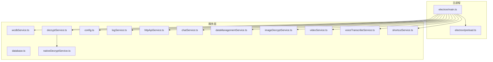
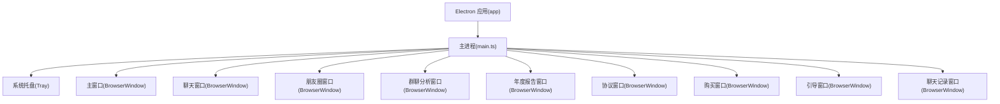
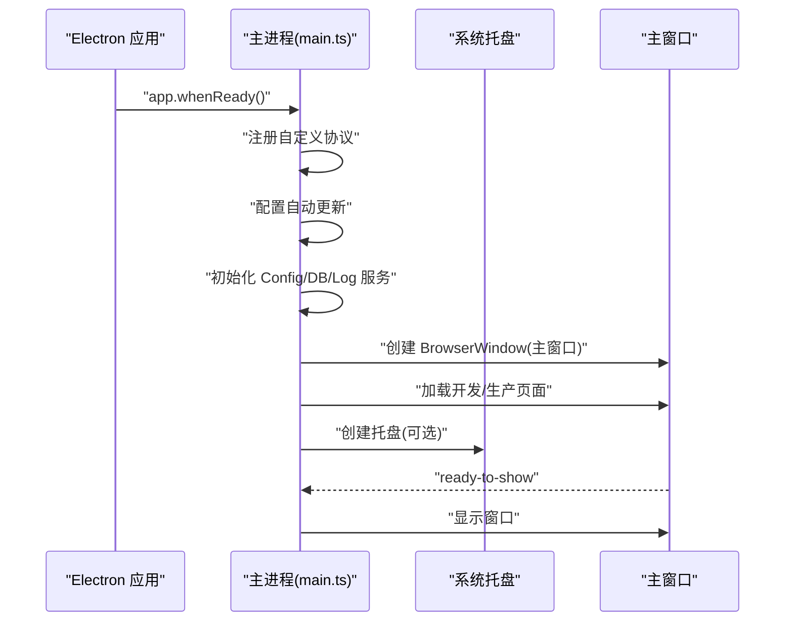
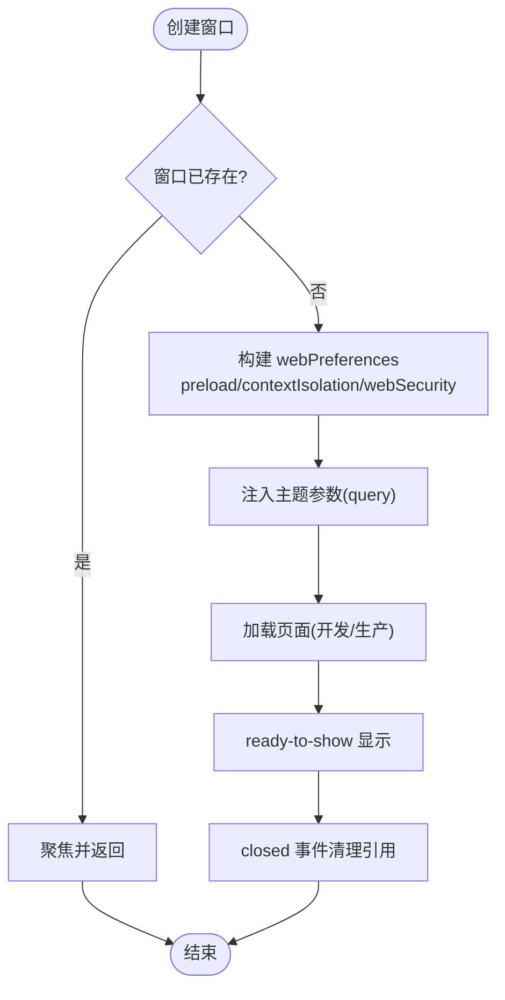
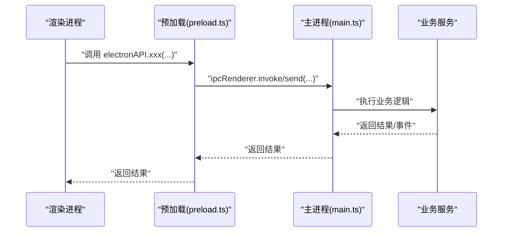
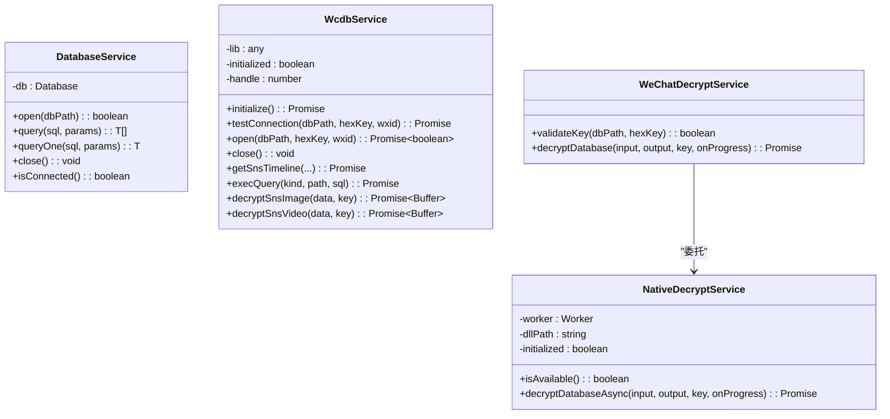
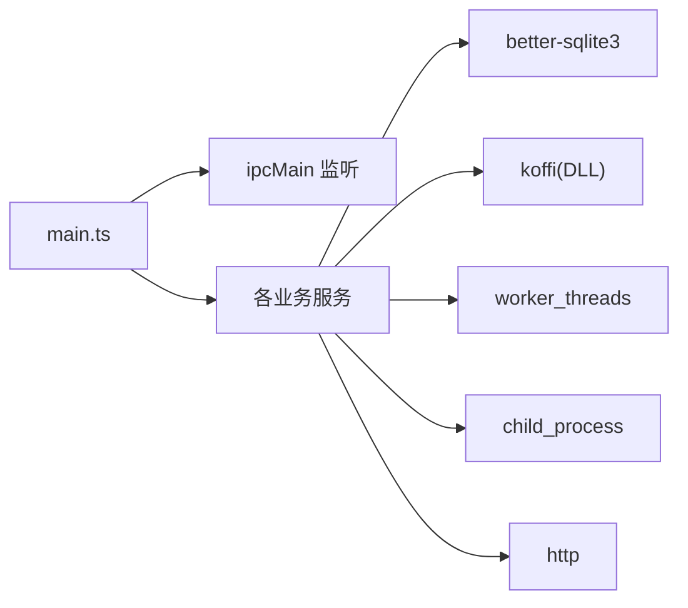

# Electron 主进程开发

<cite>
**本文档引用的文件**
- [electron/main.ts](file://electron/main.ts)
- [electron/preload.ts](file://electron/preload.ts)
- [electron/services/database.ts](file://electron/services/database.ts)
- [electron/services/wcdbService.ts](file://electron/services/wcdbService.ts)
- [electron/services/decryptService.ts](file://electron/services/decryptService.ts)
- [electron/services/nativeDecryptService.ts](file://electron/services/nativeDecryptService.ts)
- [electron/services/config.ts](file://electron/services/config.ts)
- [electron/services/logService.ts](file://electron/services/logService.ts)
- [electron/services/shortcutService.ts](file://electron/services/shortcutService.ts)
- [electron/services/httpApiService.ts](file://electron/services/httpApiService.ts)
- [electron/services/chatService.ts](file://electron/services/chatService.ts)
- [electron/services/dataManagementService.ts](file://electron/services/dataManagementService.ts)
- [electron/services/imageDecryptService.ts](file://electron/services/imageDecryptService.ts)
- [electron/services/videoService.ts](file://electron/services/videoService.ts)
- [electron/services/voiceTranscribeService.ts](file://electron/services/voiceTranscribeService.ts)
</cite>

## 目录
1. [简介](#简介)
2. [项目结构](#项目结构)
3. [核心组件](#核心组件)
4. [架构总览](#架构总览)
5. [详细组件分析](#详细组件分析)
6. [依赖关系分析](#依赖关系分析)
7. [性能考虑](#性能考虑)
8. [故障排除指南](#故障排除指南)
9. [结论](#结论)
10. [附录](#附录)

## 简介
本文件面向 Electron 开发者，系统性梳理 CipherTalk 主进程的架构设计与实现细节，覆盖应用初始化流程、窗口管理系统、IPC 通信机制、系统集成功能（托盘、菜单、快捷键）、数据库与文件系统操作、WCDB 解密服务、错误处理策略与性能优化建议。文档同时提供可视化图示与最佳实践，帮助读者快速理解并高效维护主进程代码。

## 项目结构
主进程相关代码集中在 electron 目录，采用“按功能域划分”的组织方式：
- 入口与预加载：electron/main.ts、electron/preload.ts
- 服务层：各功能域服务位于 electron/services/ 下，如数据库、WCDB、解密、配置、日志、HTTP API、聊天、数据管理、图片/视频/语音等
- 辅助资源：electron/assets/wasm/ 等

图表来源
- [electron/main.ts](file://electron/main.ts)
- [electron/preload.ts](file://electron/preload.ts)
- [electron/services/config.ts](file://electron/services/config.ts)
- [electron/services/logService.ts](file://electron/services/logService.ts)
- [electron/services/httpApiService.ts](file://electron/services/httpApiService.ts)
- [electron/services/chatService.ts](file://electron/services/chatService.ts)
- [electron/services/dataManagementService.ts](file://electron/services/dataManagementService.ts)
- [electron/services/decryptService.ts](file://electron/services/decryptService.ts)
- [electron/services/nativeDecryptService.ts](file://electron/services/nativeDecryptService.ts)
- [electron/services/wcdbService.ts](file://electron/services/wcdbService.ts)
- [electron/services/imageDecryptService.ts](file://electron/services/imageDecryptService.ts)
- [electron/services/videoService.ts](file://electron/services/videoService.ts)
- [electron/services/voiceTranscribeService.ts](file://electron/services/voiceTranscribeService.ts)
- [electron/services/shortcutService.ts](file://electron/services/shortcutService.ts)

章节来源
- [electron/main.ts](file://electron/main.ts)
- [electron/preload.ts](file://electron/preload.ts)

## 核心组件
- 应用入口与初始化：注册自定义协议、配置自动更新、单例服务实例、创建主窗口、托盘与窗口生命周期管理
- 预加载桥接：通过 contextBridge 暴露受控 API 到渲染进程，统一 IPC 调用入口
- 服务层：数据库（better-sqlite3）、WCDB（原生 DLL 封装）、解密（原生 DLL + Worker）、配置（SQLite 存储）、日志（滚动与清理）、HTTP API（内置 HTTP 服务）、聊天/数据管理/图片/视频/语音等

章节来源
- [electron/main.ts](file://electron/main.ts)
- [electron/preload.ts](file://electron/preload.ts)
- [electron/services/database.ts](file://electron/services/database.ts)
- [electron/services/wcdbService.ts](file://electron/services/wcdbService.ts)
- [electron/services/decryptService.ts](file://electron/services/decryptService.ts)
- [electron/services/nativeDecryptService.ts](file://electron/services/nativeDecryptService.ts)
- [electron/services/config.ts](file://electron/services/config.ts)
- [electron/services/logService.ts](file://electron/services/logService.ts)
- [electron/services/httpApiService.ts](file://electron/services/httpApiService.ts)
- [electron/services/chatService.ts](file://electron/services/chatService.ts)
- [electron/services/dataManagementService.ts](file://electron/services/dataManagementService.ts)
- [electron/services/imageDecryptService.ts](file://electron/services/imageDecryptService.ts)
- [electron/services/videoService.ts](file://electron/services/videoService.ts)
- [electron/services/voiceTranscribeService.ts](file://electron/services/voiceTranscribeService.ts)
- [electron/services/shortcutService.ts](file://electron/services/shortcutService.ts)

## 架构总览
主进程采用“单例服务 + 预加载桥接 + 多窗口管理”的架构：
- 单例服务：ConfigService、LogService、DatabaseService、WCDB 服务、HTTP API 服务等
- 预加载桥接：将 ipcRenderer.invoke/send 映射为统一 API，便于渲染进程调用
- 窗口管理：主窗口、聊天窗口、朋友圈窗口、群聊分析窗口、年度报告窗口、协议/购买/引导/聊天记录等独立窗口
- 系统集成：托盘、菜单、快捷键（桌面图标）、文件关联（通过自定义协议）

图表来源
- [electron/main.ts](file://electron/main.ts)

## 详细组件分析

### 应用入口与初始化流程
- 注册自定义协议（local-video/local-image），赋予安全与流媒体能力
- 配置自动更新策略（禁用差分更新、应用退出时自动安装）
- 初始化单例服务：ConfigService、DatabaseService、LogService
- 初始化 Whisper GPU 组件目录（若配置存在）
- 主窗口创建：设置 webPreferences（preload、contextIsolation、nodeIntegration、webSecurity）、标题栏样式、首次显示时机
- 窗口关闭行为：支持“关闭到托盘”配置；真正退出时设置 app.isQuitting 标志
- 开发环境：支持 Vite 开发服务器热加载与快捷键打开/关闭 DevTools

图表来源
- [electron/main.ts](file://electron/main.ts)

章节来源
- [electron/main.ts](file://electron/main.ts)

### 窗口管理系统
- 主窗口：常规尺寸、标题栏覆盖、首次显示控制
- 独立窗口族：
  - 聊天窗口：尺寸、暗色适配、主题参数传递
  - 朋友圈窗口：支持筛选用户名参数、主题参数
  - 群聊分析窗口：尺寸、暗色适配
  - 年度报告窗口：带年份参数、暗色适配
  - 协议/购买/引导/聊天记录窗口：独立窗口，按需创建与聚焦
- 窗口生命周期：closed 事件清理实例引用，避免内存泄漏
- 主题参数传递：通过 query 参数将主题与模式传递给子窗口，减少闪烁

图表来源
- [electron/main.ts](file://electron/main.ts)

章节来源
- [electron/main.ts](file://electron/main.ts)

### IPC 通信机制与预加载桥接
- 预加载桥接：通过 contextBridge.exposeInMainWorld 暴露 electronAPI，统一渲染进程调用
- API 分类：配置、数据库、解密、对话框、文件、Shell、App、HTTP API、窗口控制、Windows Hello、密钥获取、WCDB、数据管理、图片解密、视频、聊天、朋友圈、数据分析、群聊分析、年度报告、导出、激活、缓存、日志、语音转写等
- 调用模式：ipcRenderer.invoke（请求-响应）与 ipcRenderer.send（通知）混合使用
- 安全隔离：contextIsolation 为 true，禁止 Node.js 集成，webSecurity 可按需放宽（本地文件加载）

图表来源
- [electron/preload.ts](file://electron/preload.ts)
- [electron/main.ts](file://electron/main.ts)

章节来源
- [electron/preload.ts](file://electron/preload.ts)

### 系统集成功能
- 托盘：双击显示主窗口、右键菜单“显示/退出”
- 菜单：托盘上下文菜单
- 快捷键：开发环境支持 F12/Ctrl+Shift+I 打开/关闭 DevTools
- 桌面快捷方式图标：通过 PowerShell 修改 .lnk 图标（注意权限与杀软拦截）
- 自定义协议：local-video/local-image，支持 CSP 绕过与流式传输

章节来源
- [electron/main.ts](file://electron/main.ts)
- [electron/services/shortcutService.ts](file://electron/services/shortcutService.ts)

### 数据库连接管理与 WCDB 解密服务
- DatabaseService：基于 better-sqlite3，提供 open/query/close/isConnected
- WCDBService：原生 DLL 封装（koffi），提供初始化、连接测试、打开/关闭、朋友圈时间线查询、SQL 执行、图片/视频解密（JS 实现兜底）
- 原生解密：NativeDecryptService 使用 Worker 线程加载 wcdb_decrypt.dll，异步解密并回调进度，避免主线程阻塞

图表来源
- [electron/services/database.ts](file://electron/services/database.ts)
- [electron/services/wcdbService.ts](file://electron/services/wcdbService.ts)
- [electron/services/nativeDecryptService.ts](file://electron/services/nativeDecryptService.ts)
- [electron/services/decryptService.ts](file://electron/services/decryptService.ts)

章节来源
- [electron/services/database.ts](file://electron/services/database.ts)
- [electron/services/wcdbService.ts](file://electron/services/wcdbService.ts)
- [electron/services/decryptService.ts](file://electron/services/decryptService.ts)
- [electron/services/nativeDecryptService.ts](file://electron/services/nativeDecryptService.ts)

### 文件系统操作与数据管理
- 数据扫描：扫描 db_storage 目录，识别 .db 文件、解密状态、更新需求
- 图片解密：缓存索引、内存缓存、缩略图检测、硬链接解析、Worker 并行解密
- 视频服务：根据 MD5 查找视频文件、封面/缩略图 data URL、下载与解密
- 语音转写：模型下载与校验、缓存数据库、转写结果缓存、进度回调

章节来源
- [electron/services/dataManagementService.ts](file://electron/services/dataManagementService.ts)
- [electron/services/imageDecryptService.ts](file://electron/services/imageDecryptService.ts)
- [electron/services/videoService.ts](file://electron/services/videoService.ts)
- [electron/services/voiceTranscribeService.ts](file://electron/services/voiceTranscribeService.ts)

### HTTP API 服务
- 内置 HTTP 服务：支持健康检查、状态查询、会话列表、消息查询等
- 认证：Bearer Token（可选）
- 跨域：允许跨域访问
- 端口占用处理：捕获 EADDRINUSE 并返回错误

章节来源
- [electron/services/httpApiService.ts](file://electron/services/httpApiService.ts)

### 配置与日志
- ConfigService：SQLite 存储配置与 TLD 缓存，支持默认值、迁移、增删改查
- LogService：按日滚动、最大文件数与大小限制、级别过滤、读取/清理/统计

章节来源
- [electron/services/config.ts](file://electron/services/config.ts)
- [electron/services/logService.ts](file://electron/services/logService.ts)

## 依赖关系分析
- 主进程依赖：Electron 核心模块（app、BrowserWindow、ipcMain、Tray、Menu、protocol、net）、better-sqlite3、koffi、worker_threads、child_process、http 等
- 服务间耦合：低耦合高内聚，通过预加载桥接统一调用；WCDB 与原生解密服务相互独立
- 外部依赖：WCDB DLL、ffmpeg-static、ONNX 模型等

图表来源
- [electron/main.ts](file://electron/main.ts)
- [electron/services/wcdbService.ts](file://electron/services/wcdbService.ts)
- [electron/services/nativeDecryptService.ts](file://electron/services/nativeDecryptService.ts)

章节来源
- [electron/main.ts](file://electron/main.ts)

## 性能考虑
- 异步解密：原生 DLL 通过 Worker 线程异步执行，避免阻塞主线程
- 进度回调：解密与模型下载均支持实时进度反馈
- 缓存策略：图片解密缓存、会话/联系人/头像缓存、转写缓存数据库
- 数据库连接：WCDB 打开后保持句柄，避免频繁重建；必要时使用 shutdown 释放
- 文件系统：批量扫描与索引，避免重复 IO；缓存索引与内存缓存降低查找成本
- 窗口管理：延迟加载与 ready-to-show 控制首屏显示，减少闪烁

## 故障排除指南
- WCDB 初始化失败：检查 wcdb_api.dll 与 WCDB.dll 是否存在；查看内部日志输出
- 原生解密不可用：确认 wcdb_decrypt.dll 与 decryptWorker.js 路径；Worker 是否正常启动
- 自动更新问题：禁用差分更新可能导致全量下载；检查网络与签名
- HTTP API 端口占用：捕获 EADDRINUSE 并提示更换端口
- 日志过大：启用日志级别过滤与轮转；定期清理
- 托盘/快捷方式：PowerShell 执行可能被杀软拦截，检查安全策略

章节来源
- [electron/services/wcdbService.ts](file://electron/services/wcdbService.ts)
- [electron/services/nativeDecryptService.ts](file://electron/services/nativeDecryptService.ts)
- [electron/services/httpApiService.ts](file://electron/services/httpApiService.ts)
- [electron/services/logService.ts](file://electron/services/logService.ts)
- [electron/main.ts](file://electron/main.ts)

## 结论
CipherTalk 主进程通过清晰的服务分层、严格的预加载桥接与完善的系统集成，实现了稳定高效的微信数据解密与展示能力。建议在后续迭代中持续优化缓存与并发策略、完善错误上报与可观测性，并加强安全与合规审查。

## 附录
- 最佳实践
  - 严格区分“通知”与“请求-响应”，合理选择 ipcRenderer.send 与 invoke
  - 预加载 API 设计遵循“最小暴露、职责单一”，避免过度封装
  - 原生模块与 Worker 的边界清晰，确保主线程不阻塞
  - 配置与日志分离，便于运维与排障
  - 窗口生命周期管理规范化，避免内存泄漏
- 调试方法
  - 开发环境使用 F12/Ctrl+Shift+I 快捷键打开/关闭 DevTools
  - 通过 HTTP API 的 /v1/status 检查服务状态与认证配置
  - 使用日志服务的读取/清理接口定位问题