# IPC 通信机制

<cite>
**本文档引用的文件**
- [electron/main.ts](file://electron/main.ts)
- [electron/preload.ts](file://electron/preload.ts)
- [src/services/ipc.ts](file://src/services/ipc.ts)
</cite>

## 目录
1. [简介](#简介)
2. [项目结构](#项目结构)
3. [核心组件](#核心组件)
4. [架构概览](#架构概览)
5. [详细组件分析](#详细组件分析)
6. [依赖关系分析](#依赖关系分析)
7. [性能考虑](#性能考虑)
8. [故障排除指南](#故障排除指南)
9. [结论](#结论)

## 简介

CipherTalk 采用 Electron 框架构建，实现了主进程与渲染进程之间的双向 IPC 通信机制。该系统通过预加载脚本提供安全的 API 暴露机制，确保渲染进程只能访问受限的功能集，同时支持多种通信模式：请求-响应、事件广播和数据流传输。

系统的核心设计原则包括：
- **安全隔离**：通过 contextIsolation 实现上下文隔离
- **权限控制**：仅暴露必要的 API 给渲染进程
- **类型安全**：严格的参数验证和返回值类型检查
- **错误处理**：完善的异常捕获和错误传播机制

## 项目结构

CipherTalk 的 IPC 通信架构基于以下核心文件：

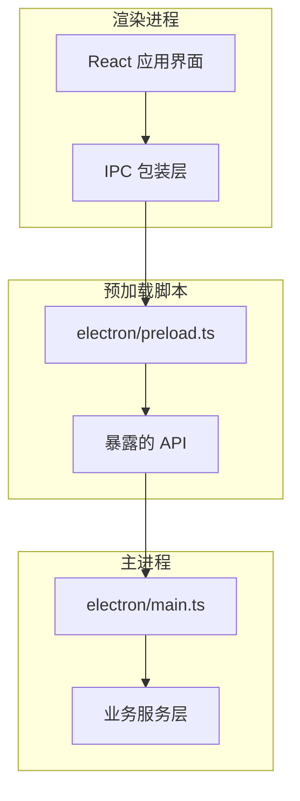

**图表来源**
- [electron/main.ts:196-281](file://electron/main.ts#L196-L281)
- [electron/preload.ts:1-454](file://electron/preload.ts#L1-L454)

**章节来源**
- [electron/main.ts:196-281](file://electron/main.ts#L196-L281)
- [electron/preload.ts:1-454](file://electron/preload.ts#L1-L454)

## 核心组件

### 预加载脚本 (electron/preload.ts)

预加载脚本是 IPC 通信的安全边界，通过 `contextBridge.exposeInMainWorld` 暴露受控 API：

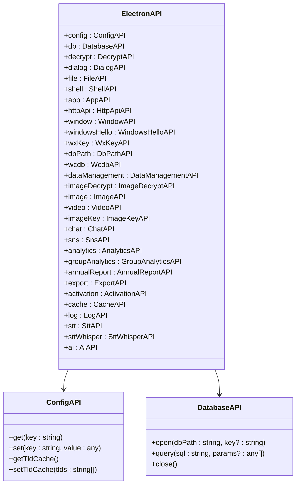

**图表来源**
- [electron/preload.ts:4-435](file://electron/preload.ts#L4-L435)

### IPC 包装层 (src/services/ipc.ts)

渲染进程通过包装层访问预加载脚本暴露的 API：

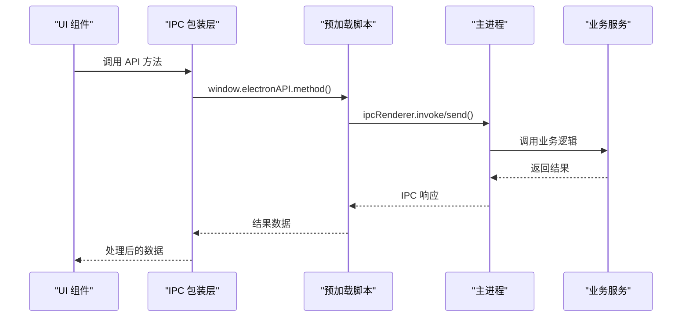

**图表来源**
- [src/services/ipc.ts:1-38](file://src/services/ipc.ts#L1-L38)
- [electron/preload.ts:71-114](file://electron/preload.ts#L71-L114)

**章节来源**
- [electron/preload.ts:4-435](file://electron/preload.ts#L4-L435)
- [src/services/ipc.ts:1-38](file://src/services/ipc.ts#L1-L38)

## 架构概览

CipherTalk 的 IPC 架构采用分层设计，确保安全性和可维护性：

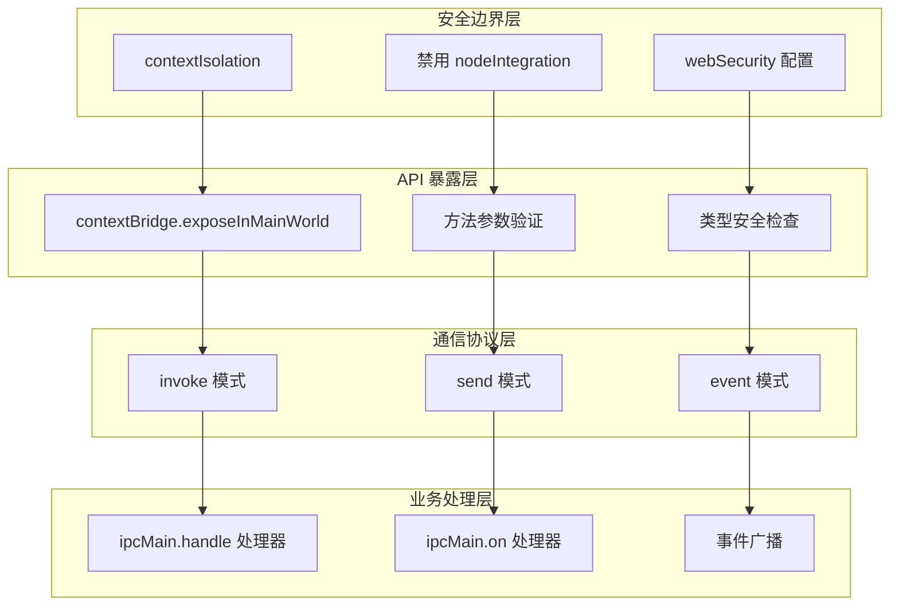

**图表来源**
- [electron/main.ts:202-207](file://electron/main.ts#L202-L207)
- [electron/preload.ts:1-4](file://electron/preload.ts#L1-L4)

### 安全沙箱机制

系统实施了多层次的安全保护：

1. **上下文隔离**：`contextIsolation: true` 确保渲染进程无法直接访问 Node.js API
2. **权限控制**：仅通过 `contextBridge.exposeInMainWorld` 暴露必需的 API
3. **参数验证**：所有 IPC 调用都包含严格的参数类型检查
4. **错误处理**：统一的异常捕获和错误信息格式化

**章节来源**
- [electron/main.ts:202-207](file://electron/main.ts#L202-L207)
- [electron/preload.ts:1-4](file://electron/preload.ts#L1-L4)

## 详细组件分析

### 配置管理 IPC

配置系统提供了完整的键值存储功能：

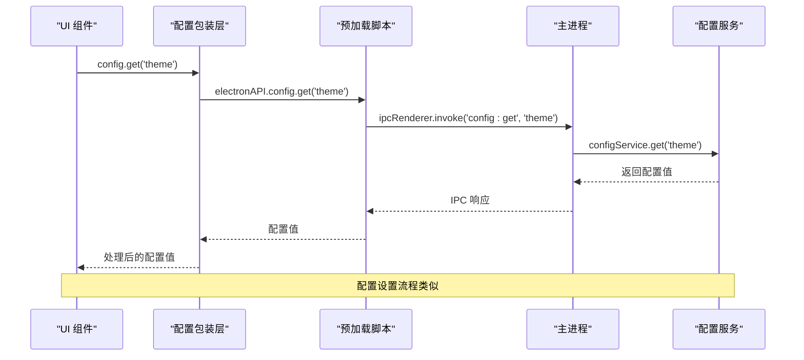

**图表来源**
- [electron/preload.ts:6-11](file://electron/preload.ts#L6-L11)
- [electron/main.ts:1133-1139](file://electron/main.ts#L1133-L1139)

### 数据库操作 IPC

数据库操作支持异步查询和连接管理：

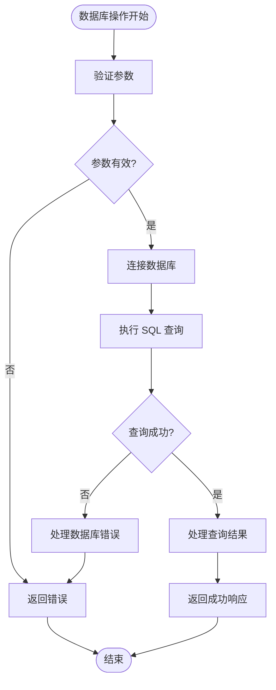

**图表来源**
- [electron/preload.ts:14-18](file://electron/preload.ts#L14-L18)
- [electron/main.ts:1187-1197](file://electron/main.ts#L1187-L1197)

### 文件操作 IPC

文件系统操作提供了安全的文件管理功能：

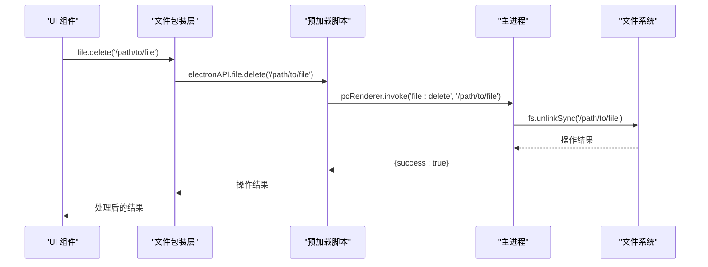

**图表来源**
- [electron/preload.ts:34-37](file://electron/preload.ts#L34-L37)
- [electron/main.ts:1231-1243](file://electron/main.ts#L1231-L1243)

### 窗口控制 IPC

窗口管理系统支持多窗口协调：

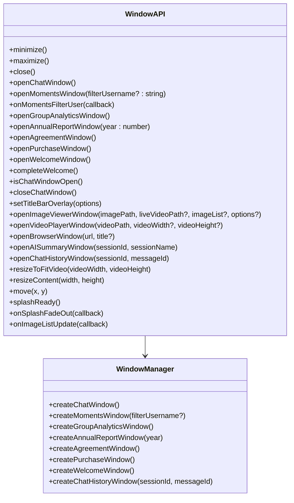

**图表来源**
- [electron/preload.ts:71-114](file://electron/preload.ts#L71-L114)
- [electron/main.ts:2462-2577](file://electron/main.ts#L2462-L2577)

**章节来源**
- [electron/preload.ts:71-114](file://electron/preload.ts#L71-L114)
- [electron/main.ts:2462-2577](file://electron/main.ts#L2462-L2577)

### 聊天系统 IPC

聊天系统实现了复杂的消息管理和实时更新：

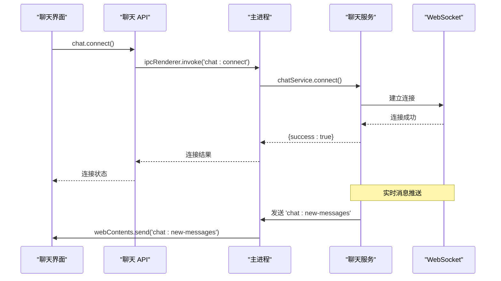

**图表来源**
- [electron/preload.ts:242-287](file://electron/preload.ts#L242-L287)
- [electron/main.ts:1211-1217](file://electron/main.ts#L1211-L1217)

### 语音转文字 IPC

语音转文字功能支持多种模式和模型：

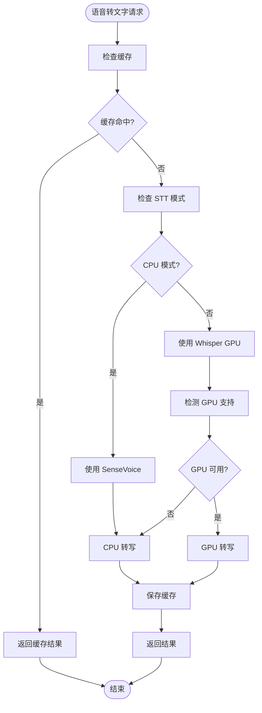

**图表来源**
- [electron/preload.ts:369-404](file://electron/preload.ts#L369-L404)
- [electron/main.ts:2827-2884](file://electron/main.ts#L2827-L2884)

**章节来源**
- [electron/preload.ts:242-287](file://electron/preload.ts#L242-L287)
- [electron/main.ts:1211-1217](file://electron/main.ts#L1211-L1217)
- [electron/preload.ts:369-404](file://electron/preload.ts#L369-L404)
- [electron/main.ts:2827-2884](file://electron/main.ts#L2827-L2884)

## 依赖关系分析

IPC 通信系统的依赖关系如下：

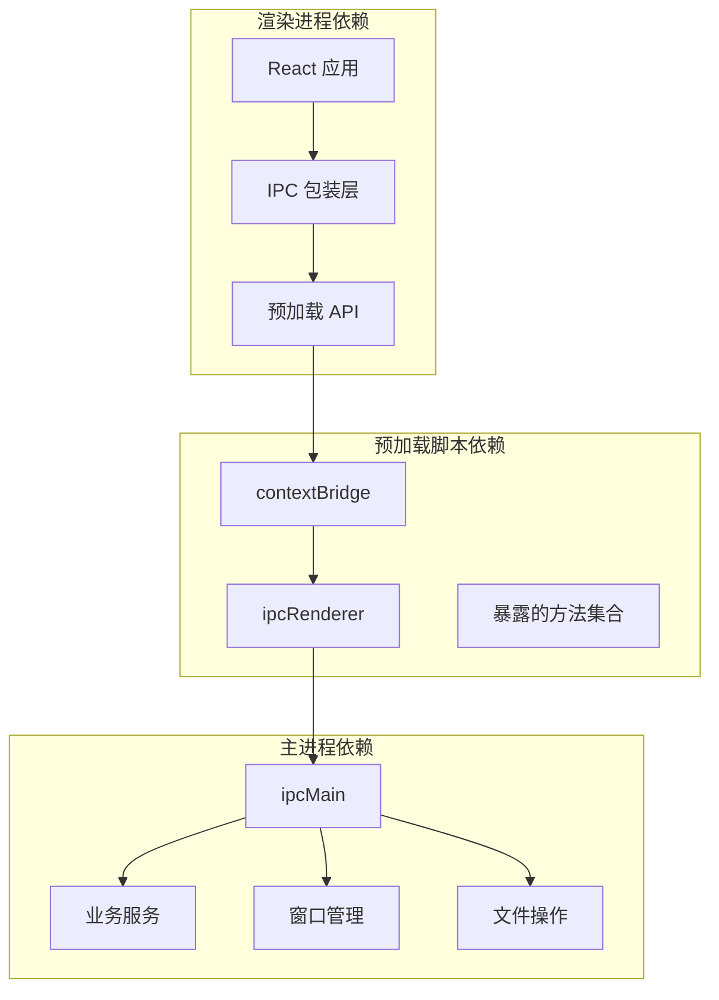

**图表来源**
- [electron/preload.ts:1-4](file://electron/preload.ts#L1-L4)
- [electron/main.ts:1131-1132](file://electron/main.ts#L1131-L1132)

**章节来源**
- [electron/preload.ts:1-4](file://electron/preload.ts#L1-L4)
- [electron/main.ts:1131-1132](file://electron/main.ts#L1131-L1132)

## 性能考虑

### 通信模式优化

1. **请求-响应模式**：适用于一次性数据获取，使用 `ipcRenderer.invoke`
2. **事件广播模式**：适用于实时数据推送，使用 `webContents.send`
3. **流式传输模式**：适用于大数据量传输，使用事件驱动的分块传输

### 缓存策略

- **配置缓存**：预加载脚本启动时同步配置到 localStorage
- **转写缓存**：语音转文字结果缓存，避免重复计算
- **图片缓存**：解密后的图片缓存，提高访问速度

### 错误处理策略

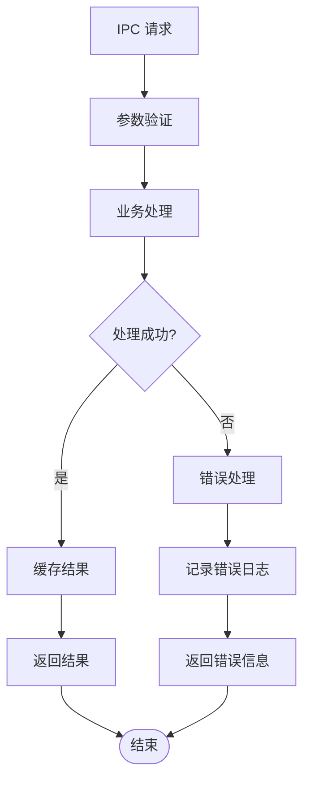

## 故障排除指南

### 常见问题及解决方案

1. **上下文隔离问题**
   - 症状：渲染进程无法访问 Node.js API
   - 解决：确保 `contextIsolation: true` 配置正确

2. **API 暴露问题**
   - 症状：预加载脚本中的 API 在渲染进程中不可用
   - 解决：检查 `contextBridge.exposeInMainWorld` 调用

3. **IPC 调用超时**
   - 症状：`ipcRenderer.invoke` 调用无响应
   - 解决：检查主进程对应的 `ipcMain.handle` 处理器

4. **权限不足**
   - 症状：文件操作或系统调用失败
   - 解决：验证 Electron 窗口的 `webPreferences` 配置

**章节来源**
- [electron/main.ts:202-207](file://electron/main.ts#L202-L207)
- [electron/preload.ts:1-4](file://electron/preload.ts#L1-L4)

## 结论

CipherTalk 的 IPC 通信机制通过精心设计的安全边界和清晰的架构层次，实现了主进程与渲染进程之间的高效、安全通信。系统的关键优势包括：

1. **安全性**：通过上下文隔离和权限控制确保系统安全
2. **可维护性**：模块化的 API 设计便于扩展和维护
3. **性能**：合理的通信模式选择和缓存策略优化用户体验
4. **可靠性**：完善的错误处理和异常恢复机制

该架构为开发者提供了清晰的 IPC 使用模式和最佳实践指导，适合在复杂的桌面应用中实现可靠的进程间通信。