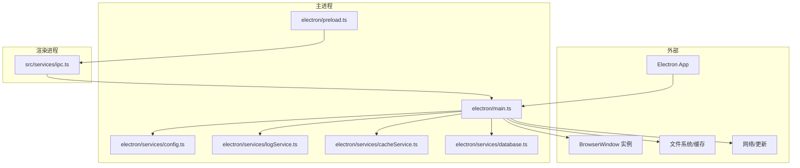
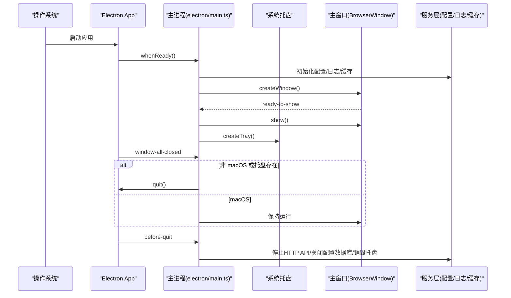
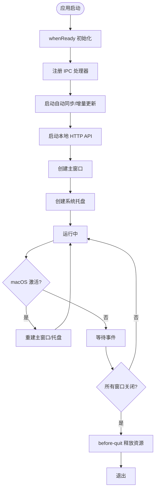
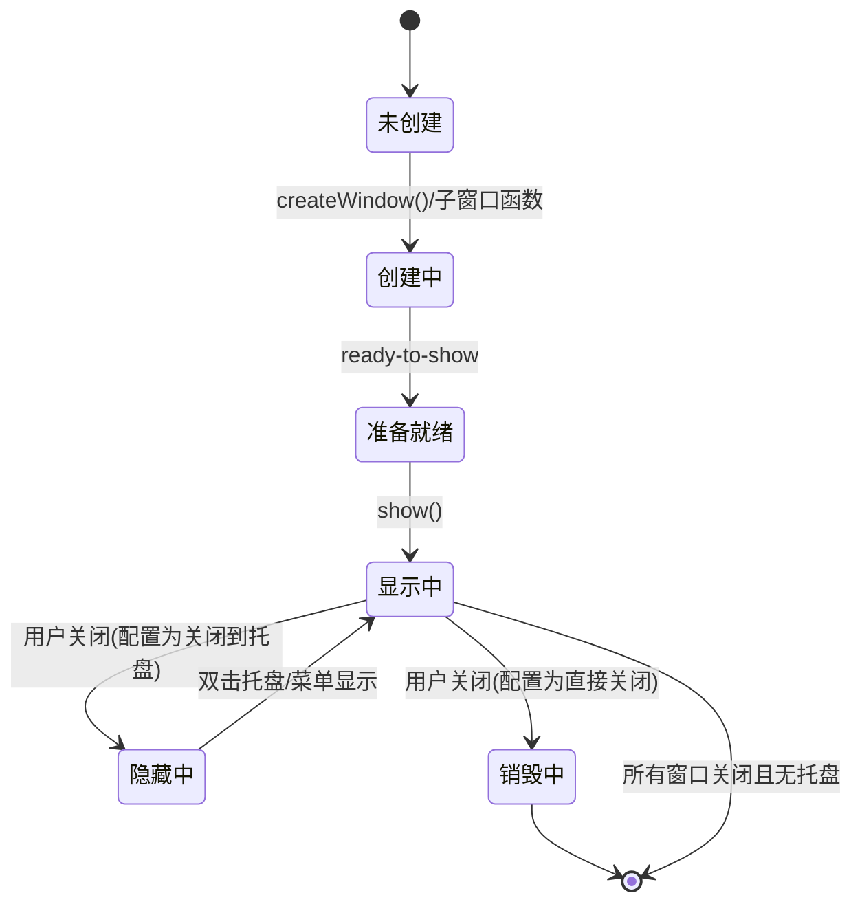
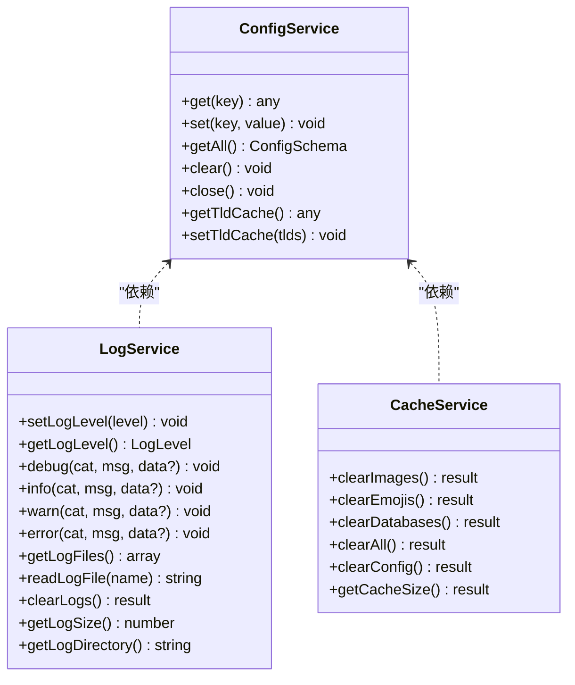
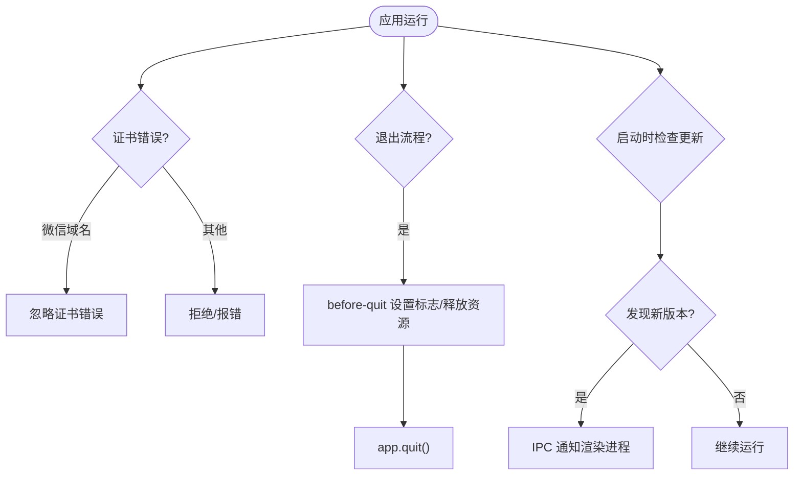
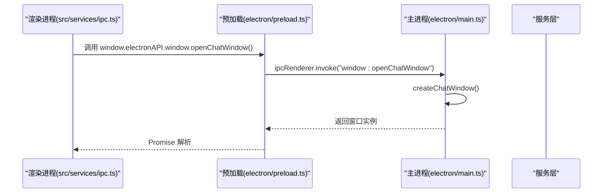
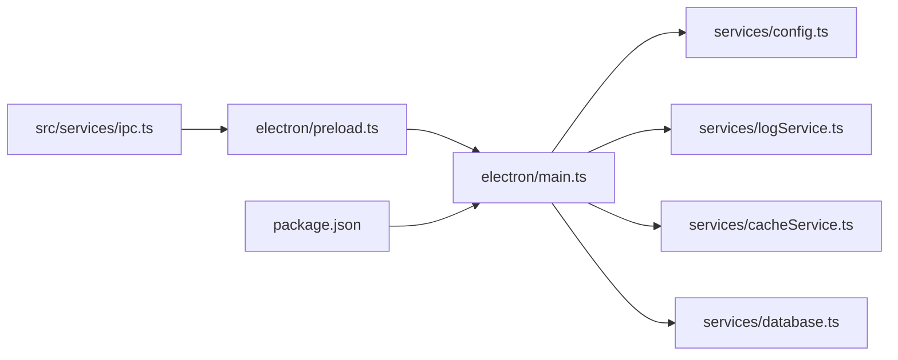

# 应用生命周期管理

<cite>
**本文档引用的文件**
- [electron/main.ts](file://electron/main.ts)
- [electron/preload.ts](file://electron/preload.ts)
- [electron/services/config.ts](file://electron/services/config.ts)
- [electron/services/logService.ts](file://electron/services/logService.ts)
- [electron/services/cacheService.ts](file://electron/services/cacheService.ts)
- [electron/services/database.ts](file://electron/services/database.ts)
- [src/services/ipc.ts](file://src/services/ipc.ts)
- [package.json](file://package.json)
</cite>

## 目录
1. [简介](#简介)
2. [项目结构](#项目结构)
3. [核心组件](#核心组件)
4. [架构总览](#架构总览)
5. [详细组件分析](#详细组件分析)
6. [依赖关系分析](#依赖关系分析)
7. [性能考虑](#性能考虑)
8. [故障排除指南](#故障排除指南)
9. [结论](#结论)
10. [附录](#附录)

## 简介
本文件系统性梳理 CipherTalk 的 Electron 应用生命周期管理，覆盖启动、运行、挂起、恢复、退出等阶段；详解 app 事件监听（ready、before-quit、will-quit、quit 等）与窗口生命周期管理（创建、显示、隐藏、关闭、销毁）；阐述配置与缓存持久化策略、资源释放与清理；说明异常处理与崩溃恢复机制，并给出多实例与单例模式、进程间通信（IPC）的实现要点与可视化流程图。

## 项目结构
围绕应用生命周期的关键文件组织如下：
- 主进程入口与生命周期：electron/main.ts
- 渲染进程桥接与 API 暴露：electron/preload.ts
- 配置与持久化：electron/services/config.ts
- 日志与诊断：electron/services/logService.ts
- 缓存与清理：electron/services/cacheService.ts
- 数据库访问：electron/services/database.ts
- 渲染侧 IPC 封装：src/services/ipc.ts
- 应用元信息与构建配置：package.json

**图表来源**
- [electron/main.ts](file://electron/main.ts)
- [electron/preload.ts](file://electron/preload.ts)
- [electron/services/config.ts](file://electron/services/config.ts)
- [electron/services/logService.ts](file://electron/services/logService.ts)
- [electron/services/cacheService.ts](file://electron/services/cacheService.ts)
- [electron/services/database.ts](file://electron/services/database.ts)
- [src/services/ipc.ts](file://src/services/ipc.ts)

**章节来源**
- [electron/main.ts](file://electron/main.ts)
- [electron/preload.ts](file://electron/preload.ts)
- [electron/services/config.ts](file://electron/services/config.ts)
- [electron/services/logService.ts](file://electron/services/logService.ts)
- [electron/services/cacheService.ts](file://electron/services/cacheService.ts)
- [electron/services/database.ts](file://electron/services/database.ts)
- [src/services/ipc.ts](file://src/services/ipc.ts)
- [package.json](file://package.json)

## 核心组件
- 应用生命周期控制器：主进程入口负责注册协议、初始化服务、监听 app 事件、创建托盘与主窗口、处理退出流程。
- 窗口管理器：集中管理主窗口与多个独立子窗口（聊天、朋友圈、年报、协议、购买、欢迎页、聊天历史等），统一处理 ready-to-show、关闭到托盘、焦点管理。
- 配置与缓存：基于 SQLite 的配置存储、日志分级与轮转、缓存路径解析与清理策略。
- IPC 桥接：preload 暴露受控 API，渲染侧通过 src/services/ipc.ts 封装调用。
- 自动更新：基于 electron-updater 的启动时检查与增量更新联动。

**章节来源**
- [electron/main.ts](file://electron/main.ts)
- [electron/preload.ts](file://electron/preload.ts)
- [electron/services/config.ts](file://electron/services/config.ts)
- [electron/services/cacheService.ts](file://electron/services/cacheService.ts)
- [electron/services/logService.ts](file://electron/services/logService.ts)
- [src/services/ipc.ts](file://src/services/ipc.ts)

## 架构总览
应用生命周期由“主进程 → 窗口 → 服务 → 外部资源”构成闭环。主进程在 app.whenReady 时初始化，随后根据配置决定是否显示启动屏并创建主窗口；窗口 ready-to-show 后显示；用户交互触发窗口关闭（可转托盘）或退出；before-quit 时执行资源释放与托盘销毁；window-all-closed 控制 macOS 行为；自动更新与数据同步在后台持续运行。

**图表来源**
- [electron/main.ts](file://electron/main.ts)
- [electron/services/config.ts](file://electron/services/config.ts)
- [electron/services/logService.ts](file://electron/services/logService.ts)
- [electron/services/cacheService.ts](file://electron/services/cacheService.ts)

## 详细组件分析

### 应用事件监听与生命周期
- ready（whenReady）：注册自定义协议、初始化 IPC、启动自动同步与增量更新、启动本地 HTTP API、创建主窗口与托盘。
- activate：macOS 下当应用激活且无窗口时重建主窗口与托盘。
- window-all-closed：非 macOS 且无托盘时退出；macOS 保持运行。
- before-quit：设置退出标志、停止 HTTP API、关闭配置数据库、销毁托盘，确保资源有序释放。

**图表来源**
- [electron/main.ts](file://electron/main.ts)

**章节来源**
- [electron/main.ts](file://electron/main.ts)

### 窗口生命周期管理
- 主窗口：创建时设置 preload、隔离上下文、webSecurity、标题栏样式；ready-to-show 后显示；窗口 close 事件中根据配置决定隐藏到托盘还是直接关闭。
- 子窗口：聊天、朋友圈、群聊分析、年度报告、协议、购买、欢迎页、聊天历史等均采用延迟创建、复用与聚焦策略；每个窗口在 closed 时置空引用，避免内存泄漏。
- 焦点与可见性：双击托盘图标或菜单项聚焦主窗口；最小化到托盘时通过配置控制关闭行为。

**图表来源**
- [electron/main.ts](file://electron/main.ts)

**章节来源**
- [electron/main.ts](file://electron/main.ts)

### 应用状态持久化
- 配置持久化：ConfigService 基于 SQLite 存储键值配置，提供 get/set/getAll/clear/close 等接口，并在构造时初始化表与默认值。
- 日志持久化：LogService 支持按日期轮转、最大文件大小与数量限制、动态日志级别、读取/清理/统计日志目录大小。
- 缓存清理：CacheService 提供图片/表情包/数据库缓存的清理与统计，兼容多路径与旧目录，清理前尝试关闭占用文件的服务并等待句柄释放。

**图表来源**
- [electron/services/config.ts](file://electron/services/config.ts)
- [electron/services/logService.ts](file://electron/services/logService.ts)
- [electron/services/cacheService.ts](file://electron/services/cacheService.ts)

**章节来源**
- [electron/services/config.ts](file://electron/services/config.ts)
- [electron/services/logService.ts](file://electron/services/logService.ts)
- [electron/services/cacheService.ts](file://electron/services/cacheService.ts)

### 异常处理与崩溃恢复
- 证书错误忽略：针对微信域名的证书错误事件，主进程允许加载以支持图片/视频下载。
- 日志分级与轮转：默认仅记录警告及以上，避免日志过大；每日轮转并限制文件数量。
- 退出流程保护：before-quit 中显式设置 app.isQuitting 标志，确保窗口 close 事件不再阻止退出；停止 HTTP API、关闭配置数据库、销毁托盘。
- 自动更新：启动时延时检查更新，若发现新版本通过 IPC 通知渲染进程；更新下载与安装由自动更新模块负责。

**图表来源**
- [electron/main.ts](file://electron/main.ts)
- [electron/services/logService.ts](file://electron/services/logService.ts)

**章节来源**
- [electron/main.ts](file://electron/main.ts)
- [electron/services/logService.ts](file://electron/services/logService.ts)

### 多实例处理与单例模式
- 单例标志：主进程通过 app.isQuitting 标志区分“真实退出”与“窗口关闭”，避免在退出时再次触发托盘逻辑。
- 托盘与窗口复用：托盘与各子窗口均维护全局引用并在 closed 时置空，避免重复创建与内存泄漏。
- macOS 行为：window-all-closed 时保持应用运行，确保托盘可用与后续窗口重建。

**章节来源**
- [electron/main.ts](file://electron/main.ts)

### 进程间通信（IPC）
- preload 暴露 window.electronAPI，涵盖配置、数据库、解密、对话框、Shell、App、HTTP API、窗口控制、Windows Hello、密钥获取、WCDB、数据管理、图片解密、视频、聊天、朋友圈、数据分析、群聊分析、年度报告、导出、激活、缓存、日志、语音转文字（含 Whisper GPU）、AI 摘要等。
- 渲染侧通过 src/services/ipc.ts 封装常用 API，简化调用。

**图表来源**
- [electron/preload.ts](file://electron/preload.ts)
- [src/services/ipc.ts](file://src/services/ipc.ts)
- [electron/main.ts](file://electron/main.ts)

**章节来源**
- [electron/preload.ts](file://electron/preload.ts)
- [src/services/ipc.ts](file://src/services/ipc.ts)
- [electron/main.ts](file://electron/main.ts)

## 依赖关系分析
- 主进程依赖：better-sqlite3（配置与数据库）、electron-updater（自动更新）、自定义服务（配置/日志/缓存/数据库/业务服务）。
- 渲染进程依赖：通过 preload 暴露的 API 与主进程通信。
- 构建与发布：package.json 指定主入口、构建脚本、目标平台与额外资源打包规则。

**图表来源**
- [electron/main.ts](file://electron/main.ts)
- [electron/preload.ts](file://electron/preload.ts)
- [electron/services/config.ts](file://electron/services/config.ts)
- [electron/services/logService.ts](file://electron/services/logService.ts)
- [electron/services/cacheService.ts](file://electron/services/cacheService.ts)
- [electron/services/database.ts](file://electron/services/database.ts)
- [src/services/ipc.ts](file://src/services/ipc.ts)
- [package.json](file://package.json)

**章节来源**
- [electron/main.ts](file://electron/main.ts)
- [electron/preload.ts](file://electron/preload.ts)
- [electron/services/config.ts](file://electron/services/config.ts)
- [electron/services/logService.ts](file://electron/services/logService.ts)
- [electron/services/cacheService.ts](file://electron/services/cacheService.ts)
- [electron/services/database.ts](file://electron/services/database.ts)
- [src/services/ipc.ts](file://src/services/ipc.ts)
- [package.json](file://package.json)

## 性能考虑
- 窗口延迟显示：主窗口与子窗口均在 ready-to-show 后再显示，减少白屏与闪烁。
- 资源释放：before-quit 显式停止 HTTP API、关闭配置数据库、销毁托盘，避免句柄泄漏。
- 日志轮转：按日轮转与大小限制，避免磁盘占用过高。
- 缓存清理：提供细粒度清理（图片/表情包/数据库/全部），并统计大小，便于用户自助优化。
- 自动更新：禁用差分下载、启动时延时检查，平衡更新及时性与网络开销。

## 故障排除指南
- 窗口无法关闭到托盘：检查配置项 closeToTray；确认托盘已创建；在窗口 close 事件中查看是否被阻止。
- 退出后仍残留进程：确认 before-quit 流程是否执行；检查是否存在未关闭的数据库连接或 HTTP API 未停止。
- 日志不输出：检查日志级别配置；确认日志目录存在且可写；查看轮转与清理逻辑是否影响。
- 缓存清理无效：确认缓存路径解析正确；检查是否有文件被占用（EBUSY/EPERM）；必要时等待句柄释放后再试。
- 自动更新不生效：确认开发环境不会检查更新；检查版本比较逻辑与 IPC 通知链路。

**章节来源**
- [electron/main.ts](file://electron/main.ts)
- [electron/services/logService.ts](file://electron/services/logService.ts)
- [electron/services/cacheService.ts](file://electron/services/cacheService.ts)

## 结论
CipherTalk 的生命周期管理以主进程为核心，结合窗口管理、配置与缓存持久化、日志与清理策略以及完善的 IPC 通信，实现了稳定可靠的启动、运行、挂起、恢复与退出流程。通过 before-quit 的资源释放与托盘策略，配合自动更新与数据同步，保证用户体验与数据安全。

## 附录
- 关键实现位置参考：
  - 应用事件与生命周期：[electron/main.ts](file://electron/main.ts)
  - 窗口创建与关闭：[electron/main.ts](file://electron/main.ts)
  - 配置持久化：[electron/services/config.ts](file://electron/services/config.ts)
  - 日志与轮转：[electron/services/logService.ts](file://electron/services/logService.ts)
  - 缓存清理与统计：[electron/services/cacheService.ts](file://electron/services/cacheService.ts)
  - 数据库访问：[electron/services/database.ts](file://electron/services/database.ts)
  - IPC 暴露与封装：[electron/preload.ts](file://electron/preload.ts)、[src/services/ipc.ts](file://src/services/ipc.ts)
  - 应用元信息：[package.json](file://package.json)