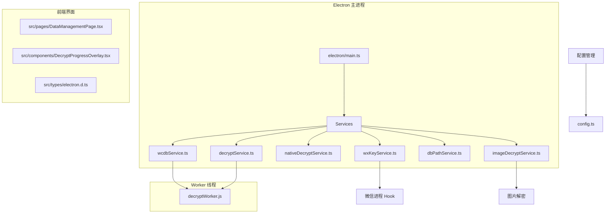
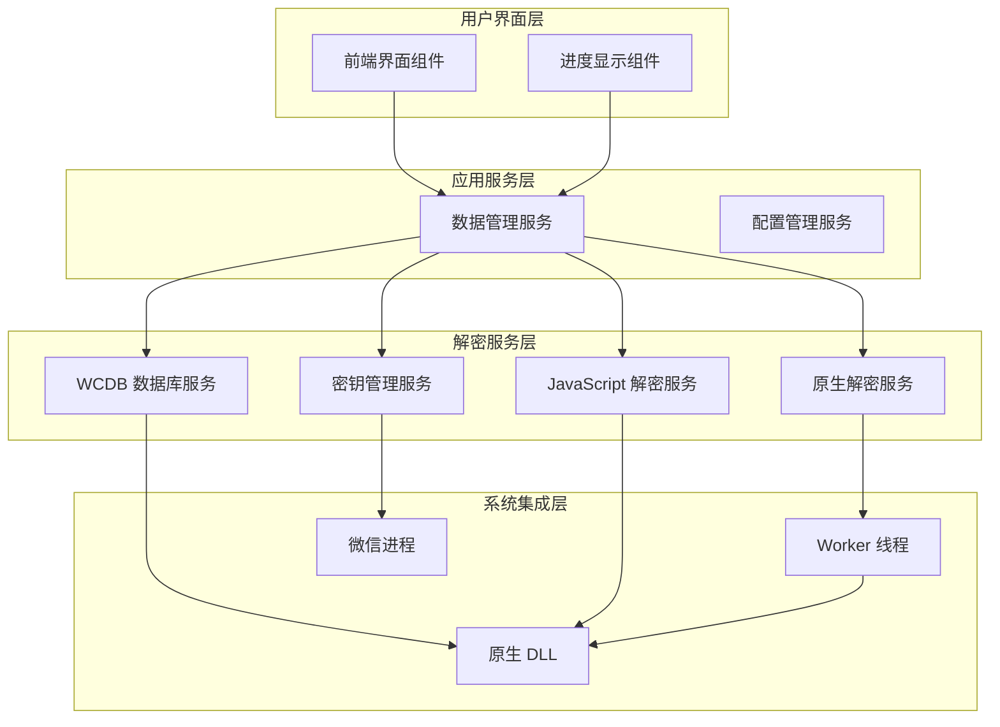
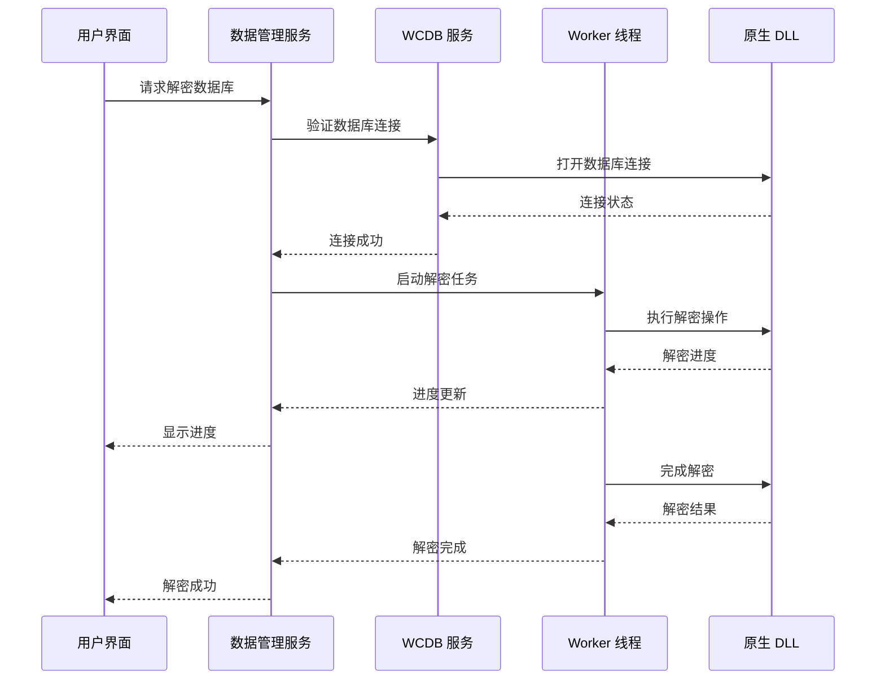
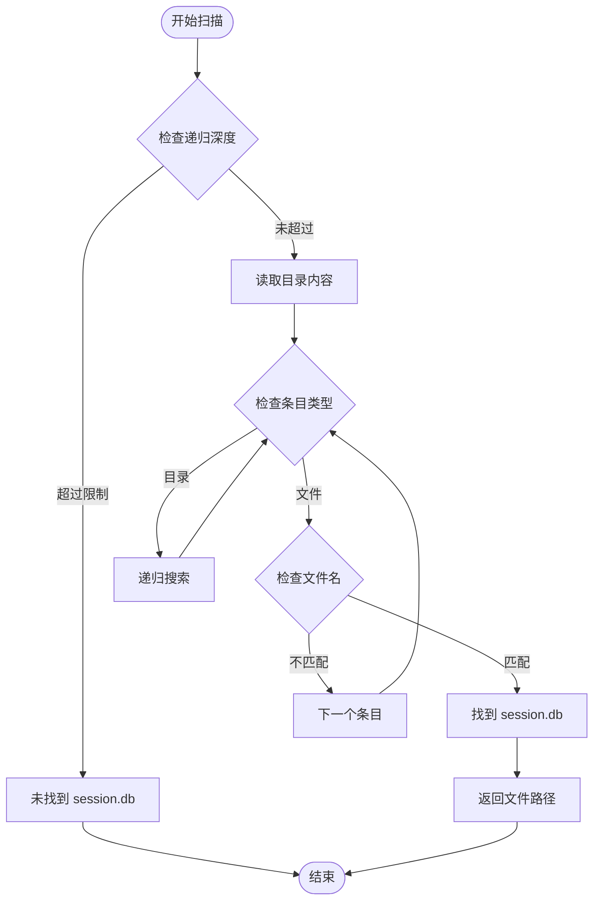
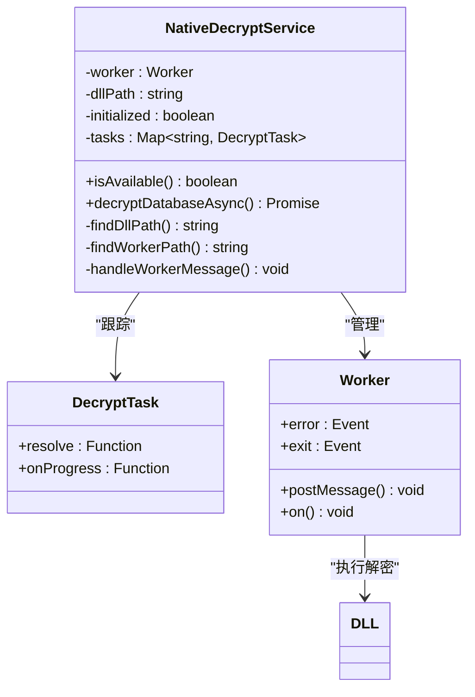
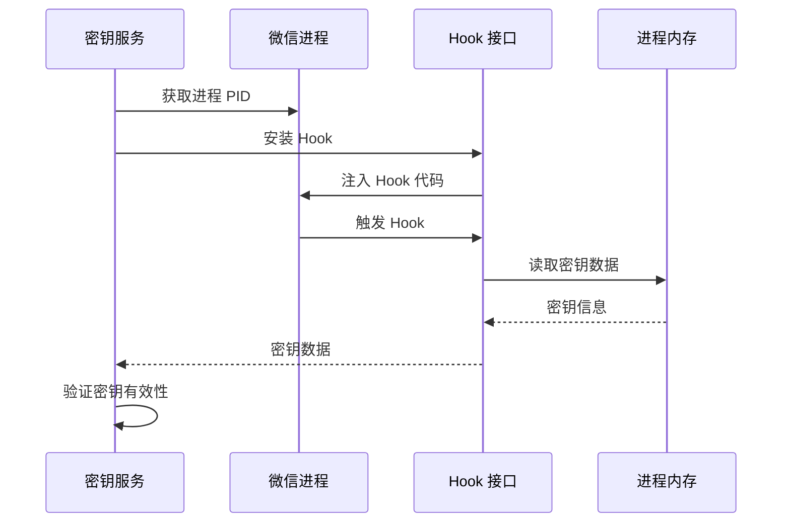
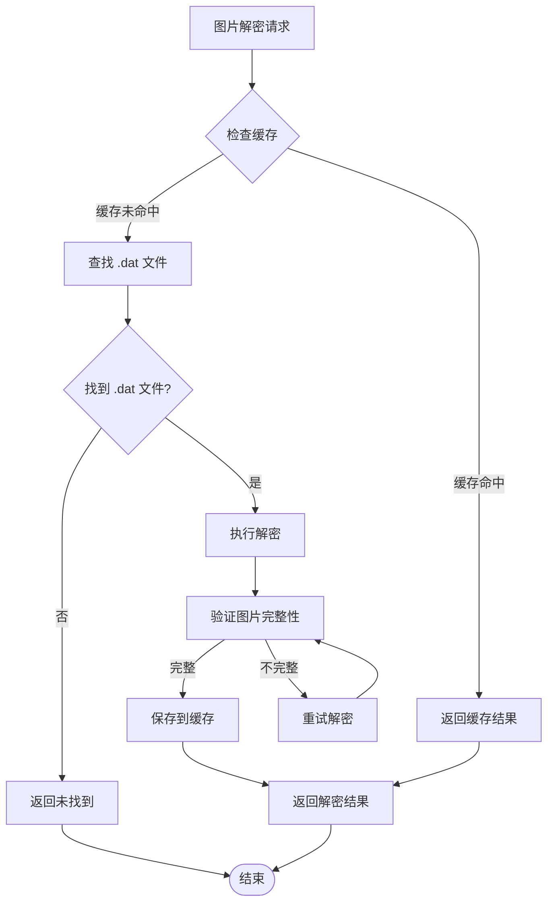
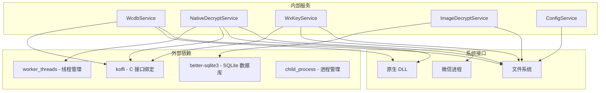
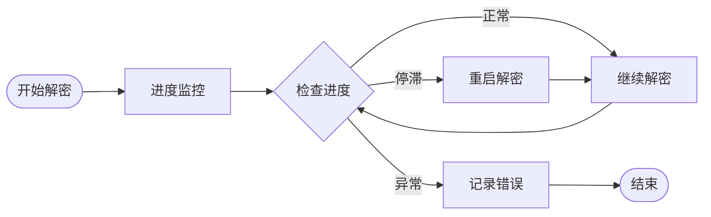

# WCDB 解密服务

<cite>
**本文档引用的文件**
- [wcdbService.ts](file://electron/services/wcdbService.ts)
- [decryptService.ts](file://electron/services/decryptService.ts)
- [nativeDecryptService.ts](file://electron/services/nativeDecryptService.ts)
- [decryptWorker.js](file://electron/workers/decryptWorker.js)
- [dbPathService.ts](file://electron/services/dbPathService.ts)
- [wxKeyService.ts](file://electron/services/wxKeyService.ts)
- [imageDecryptService.ts](file://electron/services/imageDecryptService.ts)
- [imageKeyService.ts](file://electron/services/imageKeyService.ts)
- [config.ts](file://electron/services/config.ts)
- [main.ts](file://electron/main.ts)
- [DataManagementPage.tsx](file://src/pages/DataManagementPage.tsx)
- [DecryptProgressOverlay.tsx](file://src/components/DecryptProgressOverlay.tsx)
- [electron.d.ts](file://src/types/electron.d.ts)
</cite>

## 目录
1. [简介](#简介)
2. [项目结构](#项目结构)
3. [核心组件](#核心组件)
4. [架构概览](#架构概览)
5. [详细组件分析](#详细组件分析)
6. [依赖关系分析](#依赖关系分析)
7. [性能考虑](#性能考虑)
8. [故障排除指南](#故障排除指南)
9. [结论](#结论)

## 简介

CipherTalk 的 WCDB 解密服务是一个专为微信数据库解密设计的综合解决方案。该服务实现了从微信数据库密钥获取、数据库解密到数据完整性验证的完整流程，支持多种解密模式和优化策略。

该服务的核心特点包括：
- **双模式解密架构**：支持原生 DLL 解密和 JavaScript 解密两种模式
- **多层密钥管理**：集成微信进程 Hook、本地文件扫描等多种密钥获取方式
- **并行处理能力**：利用 Worker 线程实现真正的异步解密，避免主线程阻塞
- **完整的数据验证**：提供数据完整性检查和错误恢复机制
- **灵活的配置管理**：支持多种配置选项和运行时调整

## 项目结构

CipherTalk 项目采用模块化架构，WCDB 解密服务主要分布在以下目录：

**图表来源**
- [main.ts:1-100](file://electron/main.ts#L1-L100)
- [wcdbService.ts:1-50](file://electron/services/wcdbService.ts#L1-L50)
- [decryptService.ts:1-30](file://electron/services/decryptService.ts#L1-L30)

**章节来源**
- [main.ts:1-200](file://electron/main.ts#L1-L200)
- [README.md:132-160](file://README.md#L132-L160)

## 核心组件

### WCDB 数据库服务

WCDB 数据库服务是整个解密系统的核心组件，负责与底层数据库进行交互：

- **数据库连接管理**：通过 DLL 接口管理数据库连接生命周期
- **会话数据获取**：提供会话列表、日志、朋友圈数据的查询接口
- **SQL 查询执行**：支持自定义 SQL 查询和结果处理
- **资源清理**：正确的资源管理和内存释放

### 原生解密服务

原生解密服务提供了高性能的数据库解密能力：

- **Worker 线程隔离**：完全在独立线程中执行，避免主线程阻塞
- **进度实时反馈**：支持解密进度的实时监控和 UI 更新
- **错误处理机制**：完善的错误捕获和恢复策略
- **动态重试**：Worker 异常时的自动重启机制

### 密钥管理系统

密钥管理系统提供了多种密钥获取方式：

- **微信进程 Hook**：通过 Hook 微信进程获取实时密钥
- **本地文件扫描**：从本地文件系统扫描密钥信息
- **内存扫描**：直接扫描微信进程内存获取密钥
- **图片密钥获取**：专门针对图片解密的密钥管理

**章节来源**
- [wcdbService.ts:1-150](file://electron/services/wcdbService.ts#L1-L150)
- [nativeDecryptService.ts:1-80](file://electron/services/nativeDecryptService.ts#L1-L80)
- [wxKeyService.ts:1-100](file://electron/services/wxKeyService.ts#L1-L100)

## 架构概览

CipherTalk 的 WCDB 解密服务采用了分层架构设计，确保了系统的可维护性和扩展性：

**图表来源**
- [main.ts:1754-1792](file://electron/main.ts#L1754-L1792)
- [decryptService.ts:1-54](file://electron/services/decryptService.ts#L1-L54)
- [wxKeyService.ts:200-320](file://electron/services/wxKeyService.ts#L200-L320)

### 解密流程管理

系统实现了完整的解密流程管理机制：

**图表来源**
- [decryptWorker.js:25-80](file://electron/workers/decryptWorker.js#L25-L80)
- [nativeDecryptService.ts:177-211](file://electron/services/nativeDecryptService.ts#L177-L211)

## 详细组件分析

### WCDB 数据库服务详解

WCDB 数据库服务是整个解密系统的基础，提供了与微信数据库交互的核心功能：

#### 数据库连接管理

服务通过以下步骤建立数据库连接：

1. **DLL 路径解析**：根据应用打包状态确定 DLL 文件位置
2. **依赖库预加载**：确保 WCDB 核心库正确加载
3. **函数接口绑定**：使用 koffi 库绑定 C 接口函数
4. **初始化验证**：确认所有接口函数正常加载

#### 数据库文件扫描

服务实现了智能的数据库文件扫描机制：

**图表来源**
- [wcdbService.ts:36-65](file://electron/services/wcdbService.ts#L36-L65)

#### 数据库操作接口

服务提供了多种数据库操作接口：

- **会话数据获取**：`getSessions()` - 获取聊天会话列表
- **日志查询**：`getLogs()` - 获取系统日志信息
- **朋友圈数据**：`getSnsTimeline()` - 获取朋友圈时间线
- **自定义查询**：`execQuery()` - 执行任意 SQL 查询

**章节来源**
- [wcdbService.ts:106-148](file://electron/services/wcdbService.ts#L106-L148)
- [wcdbService.ts:300-368](file://electron/services/wcdbService.ts#L300-L368)

### 原生解密服务架构

原生解密服务是系统性能的关键保障，采用了先进的多线程架构：

#### Worker 线程管理

**图表来源**
- [nativeDecryptService.ts:24-33](file://electron/services/nativeDecryptService.ts#L24-L33)
- [decryptWorker.js:1-20](file://electron/workers/decryptWorker.js#L1-L20)

#### 解密进度监控

服务实现了精细的进度监控机制：

- **进度回调节流**：每 100ms 更新一次进度，避免过度频繁的 UI 更新
- **实时状态反馈**：通过 IPC 通道向主进程发送进度信息
- **错误状态处理**：解密失败时提供详细的错误信息

**章节来源**
- [nativeDecryptService.ts:88-117](file://electron/services/nativeDecryptService.ts#L88-L117)
- [decryptWorker.js:37-51](file://electron/workers/decryptWorker.js#L37-L51)

### 密钥管理系统

密钥管理系统提供了多种密钥获取策略，确保解密过程的可靠性：

#### 微信进程 Hook

**图表来源**
- [wxKeyService.ts:211-239](file://electron/services/wxKeyService.ts#L211-L239)
- [imageKeyService.ts:276-374](file://electron/services/imageKeyService.ts#L276-L374)

#### 本地文件密钥扫描

服务支持从本地文件系统获取密钥信息：

- **模板文件扫描**：扫描图片缓存目录中的模板文件
- **密钥特征提取**：从模板文件中提取密钥特征
- **密钥验证机制**：验证提取的密钥是否有效

**章节来源**
- [wxKeyService.ts:350-384](file://electron/services/wxKeyService.ts#L350-L384)
- [imageKeyService.ts:71-179](file://electron/services/imageKeyService.ts#L71-L179)

### 图片解密服务

图片解密服务提供了完整的图片解密解决方案：

#### 多格式支持

服务支持多种图片格式的解密：

- **传统格式**：支持 `.dat` 格式的图片文件
- **新格式**：支持微信新版本的图片格式（如 wxgf）
- **缩略图处理**：自动识别和处理缩略图文件

#### 缓存优化

**图表来源**
- [imageDecryptService.ts:112-303](file://electron/services/imageDecryptService.ts#L112-L303)

**章节来源**
- [imageDecryptService.ts:1-120](file://electron/services/imageDecryptService.ts#L1-L120)
- [imageDecryptService.ts:254-299](file://electron/services/imageDecryptService.ts#L254-L299)

## 依赖关系分析

CipherTalk 的 WCDB 解密服务具有清晰的依赖关系结构：

**图表来源**
- [wcdbService.ts:1-10](file://electron/services/wcdbService.ts#L1-L10)
- [nativeDecryptService.ts:8-11](file://electron/services/nativeDecryptService.ts#L8-L11)

### 组件耦合度分析

系统采用了低耦合的设计原则：

- **服务间松耦合**：各服务通过明确的接口进行通信
- **依赖注入**：通过构造函数注入依赖，便于测试和替换
- **接口抽象**：对外提供统一的接口，内部实现可灵活调整

**章节来源**
- [config.ts:1-50](file://electron/services/config.ts#L1-L50)
- [main.ts:1-50](file://electron/main.ts#L1-L50)

## 性能考虑

CipherTalk 的 WCDB 解密服务在性能方面采用了多项优化策略：

### 并行解密优化

1. **Worker 线程分离**：解密操作在独立线程中执行，避免阻塞主线程
2. **批量处理**：支持多个数据库的并行解密
3. **内存管理**：及时释放解密过程中使用的内存资源

### 缓存策略

1. **多级缓存**：内存缓存、文件缓存、数据库缓存相结合
2. **智能失效**：基于时间戳和文件变更的缓存失效机制
3. **预加载机制**：提前加载常用数据减少等待时间

### 内存优化

1. **流式处理**：大文件采用流式处理避免内存溢出
2. **及时释放**：使用完的资源立即释放
3. **垃圾回收**：合理控制对象生命周期

## 故障排除指南

### 常见问题及解决方案

#### DLL 加载失败

**问题症状**：
- 解密服务初始化失败
- 报告 DLL 文件不存在

**解决步骤**：
1. 检查 DLL 文件是否存在于正确的路径
2. 确认依赖的 DLL 文件都已正确部署
3. 验证应用程序的权限足够访问 DLL 文件

#### 解密进度停滞

**问题症状**：
- 解密进度长时间不更新
- Worker 线程无响应

**解决步骤**：
1. 检查 Worker 线程是否正常运行
2. 查看解密日志获取详细错误信息
3. 重启解密服务重新开始

#### 密钥获取失败

**问题症状**：
- 无法获取微信数据库密钥
- 解密过程中断

**解决步骤**：
1. 确认微信进程正在运行
2. 检查 Hook 是否正确安装
3. 尝试使用备用密钥获取方式

### 调试工具使用

#### 日志分析

系统提供了丰富的日志信息用于问题诊断：

- **解密日志**：记录解密过程的详细信息
- **错误日志**：包含具体的错误描述和堆栈信息
- **性能日志**：记录解密时间和资源使用情况

#### 进度监控

**图表来源**
- [DecryptProgressOverlay.tsx:1-55](file://src/components/DecryptProgressOverlay.tsx#L1-L55)

**章节来源**
- [main.ts:1754-1792](file://electron/main.ts#L1754-L1792)
- [DataManagementPage.tsx:706-736](file://src/pages/DataManagementPage.tsx#L706-L736)

## 结论

CipherTalk 的 WCDB 解密服务是一个功能完整、架构清晰的解密解决方案。通过采用多层架构设计、并行处理技术和智能缓存策略，该服务在保证解密准确性的同时，也确保了良好的用户体验。

### 主要优势

1. **高可靠性**：多种密钥获取方式和错误恢复机制
2. **高性能**：Worker 线程架构确保解密过程不阻塞主线程
3. **易扩展**：模块化设计便于功能扩展和维护
4. **用户友好**：直观的进度显示和详细的错误提示

### 技术特色

- **双模式解密**：支持原生 DLL 和 JavaScript 两种解密模式
- **智能缓存**：多级缓存策略提升解密效率
- **实时监控**：完整的进度监控和状态反馈
- **安全存储**：密钥的安全存储和传输机制

该服务为微信数据库解密提供了一个稳定可靠的解决方案，适用于各种规模的数据恢复和分析场景。