# 数据库服务管理

<cite>
**本文档引用的文件**
- [database.ts](file://electron/services/database.ts)
- [wcdbService.ts](file://electron/services/wcdbService.ts)
- [decryptService.ts](file://electron/services/decryptService.ts)
- [nativeDecryptService.ts](file://electron/services/nativeDecryptService.ts)
- [decrypt.ts](file://electron/services/decrypt.ts)
- [chatService.ts](file://electron/services/chatService.ts)
- [voiceTranscribeService.ts](file://electron/services/voiceTranscribeService.ts)
- [cacheService.ts](file://electron/services/cacheService.ts)
- [dbPathService.ts](file://electron/services/dbPathService.ts)
- [config.ts](file://electron/services/config.ts)
- [main.ts](file://electron/main.ts)
</cite>

## 目录
1. [简介](#简介)
2. [项目结构](#项目结构)
3. [核心组件](#核心组件)
4. [架构概览](#架构概览)
5. [详细组件分析](#详细组件分析)
6. [依赖关系分析](#依赖关系分析)
7. [性能考虑](#性能考虑)
8. [故障排除指南](#故障排除指南)
9. [结论](#结论)

## 简介

CipherTalk 是一个基于 Electron 的微信数据库解密和分析工具。本文档深入解析其数据库服务管理系统，涵盖数据库连接管理、WCDB 解密服务、数据库生命周期管理、多数据库支持、性能优化以及错误处理机制。

## 项目结构

项目采用模块化架构设计，数据库相关功能分布在多个专门的服务模块中：

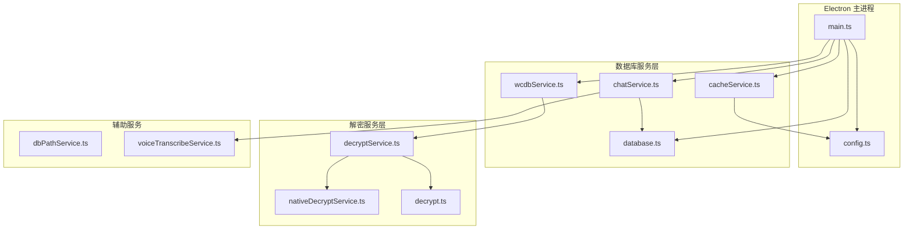

**图表来源**
- [main.ts:86-113](file://electron/main.ts#L86-L113)
- [database.ts:5-82](file://electron/services/database.ts#L5-L82)
- [wcdbService.ts:5-389](file://electron/services/wcdbService.ts#L5-L389)

**章节来源**
- [main.ts:86-113](file://electron/main.ts#L86-L113)
- [config.ts:126-394](file://electron/services/config.ts#L126-L394)

## 核心组件

### 数据库连接管理

CipherTalk 实现了多层次的数据库连接管理机制：

#### 基础 SQLite 连接
DatabaseService 提供了简单而高效的 SQLite 数据库连接管理：

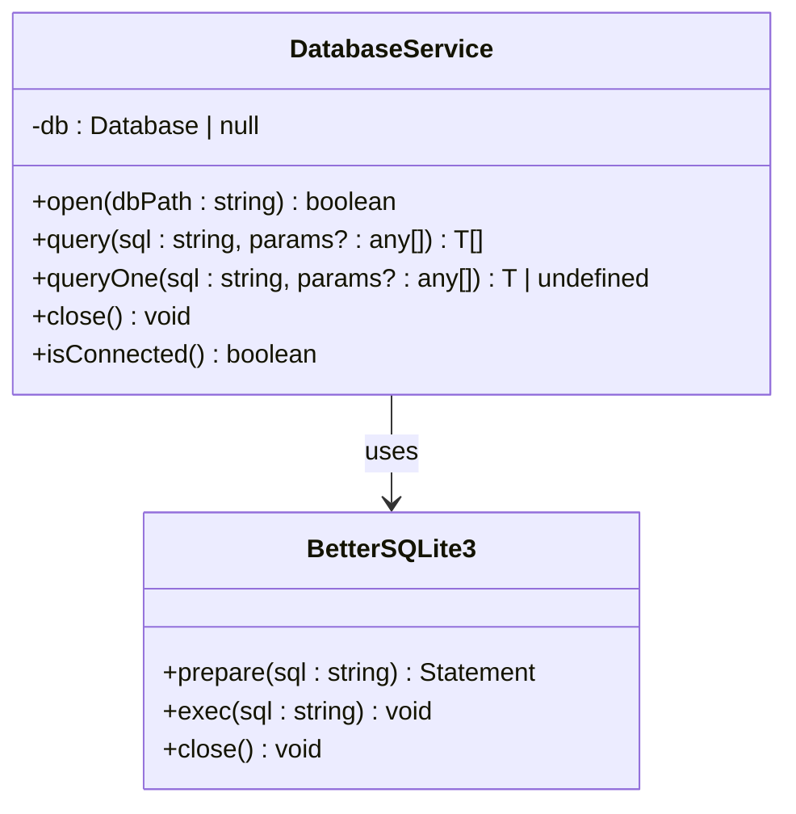

**图表来源**
- [database.ts:5-82](file://electron/services/database.ts#L5-L82)

#### 多数据库连接管理
ChatService 实现了复杂的多数据库连接管理：

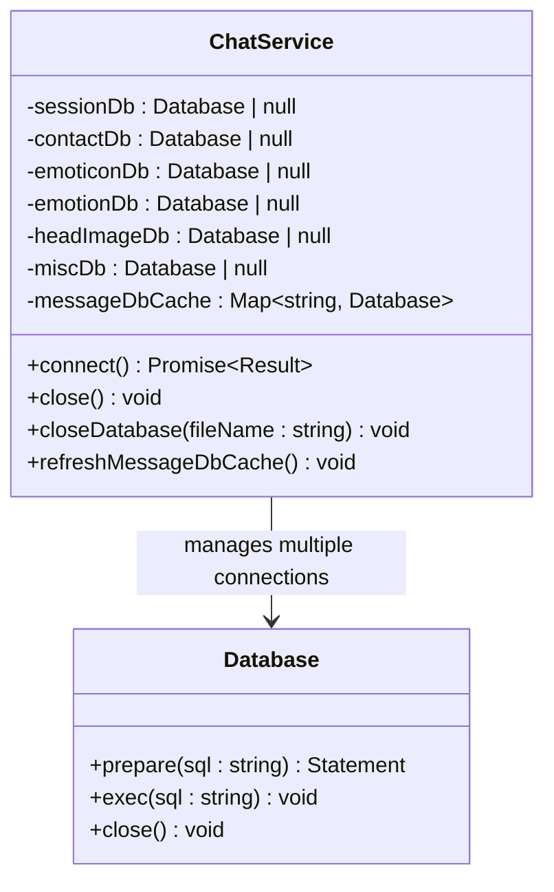

**图表来源**
- [chatService.ts:110-383](file://electron/services/chatService.ts#L110-L383)

**章节来源**
- [database.ts:5-82](file://electron/services/database.ts#L5-L82)
- [chatService.ts:110-383](file://electron/services/chatService.ts#L110-L383)

### WCDB 解密服务

WCDBService 提供了完整的微信数据库解密和访问能力：

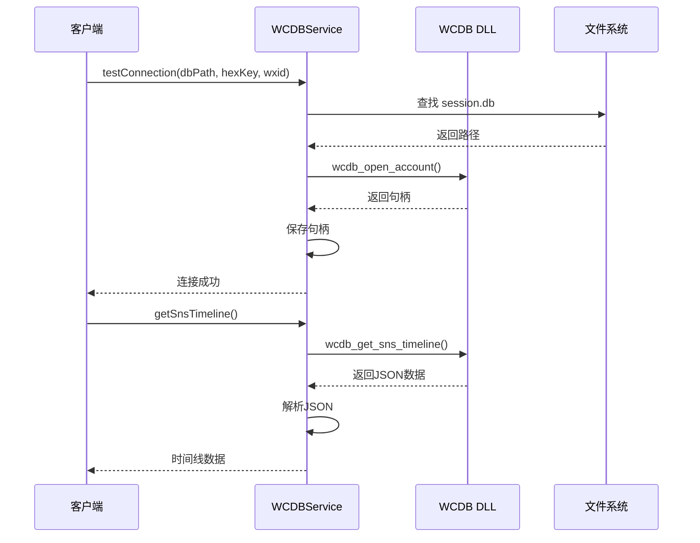

**图表来源**
- [wcdbService.ts:153-204](file://electron/services/wcdbService.ts#L153-L204)
- [wcdbService.ts:303-342](file://electron/services/wcdbService.ts#L303-L342)

**章节来源**
- [wcdbService.ts:5-389](file://electron/services/wcdbService.ts#L5-L389)

### 原生解密服务

NativeDecryptService 实现了高性能的原生 DLL 解密：

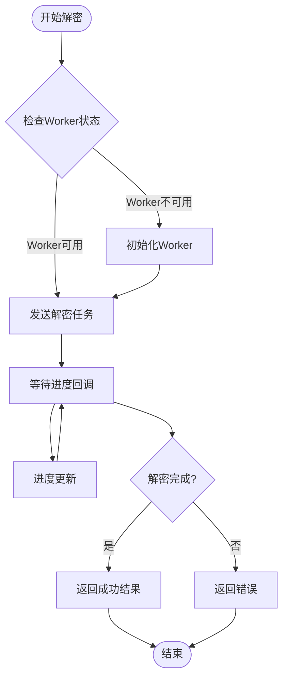

**图表来源**
- [nativeDecryptService.ts:179-211](file://electron/services/nativeDecryptService.ts#L179-L211)

**章节来源**
- [nativeDecryptService.ts:24-215](file://electron/services/nativeDecryptService.ts#L24-L215)

## 架构概览

CipherTalk 的数据库服务架构采用了分层设计，每层都有明确的职责分工：

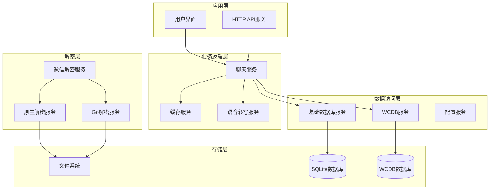

**图表来源**
- [main.ts:1-200](file://electron/main.ts#L1-L200)
- [chatService.ts:149-152](file://electron/services/chatService.ts#L149-L152)

## 详细组件分析

### 数据库生命周期管理

CipherTalk 实现了完整的数据库生命周期管理，包括启动、运行、停止和重启：

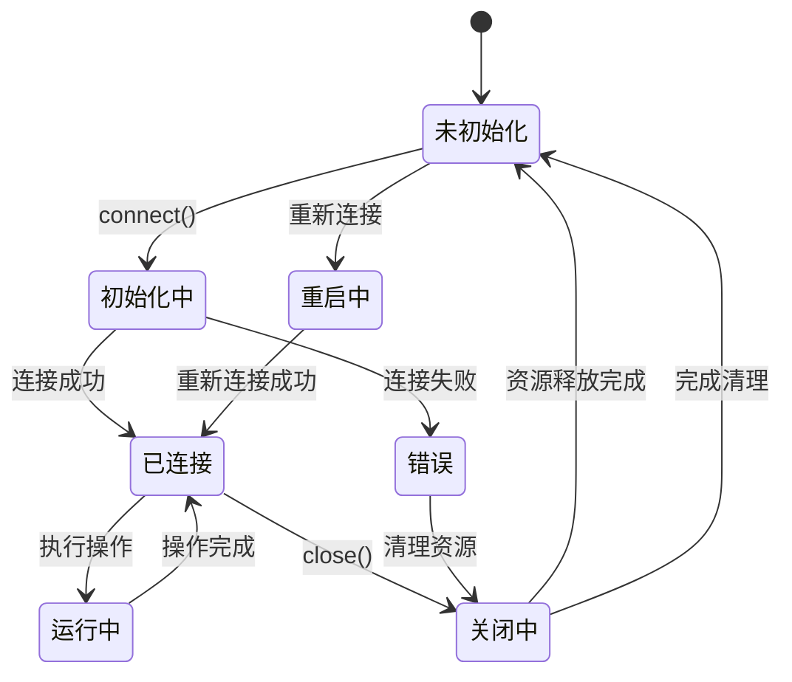

**图表来源**
- [chatService.ts:283-346](file://electron/services/chatService.ts#L283-L346)
- [database.ts:69-81](file://electron/services/database.ts#L69-L81)

#### 连接池配置
虽然项目中没有显式的连接池实现，但通过以下机制实现了连接管理：

1. **单连接模式**: 基础 DatabaseService 使用单一连接
2. **多连接缓存**: ChatService 缓存多个数据库连接
3. **动态连接**: 按需创建和销毁连接

**章节来源**
- [chatService.ts:112-118](file://electron/services/chatService.ts#L112-L118)
- [chatService.ts:782-799](file://electron/services/chatService.ts#L782-L799)

### 多数据库支持

CipherTalk 支持多种类型的数据库，每种都有特定的用途：

#### 主数据库 (session.db)
负责存储聊天会话信息和基本联系人数据：

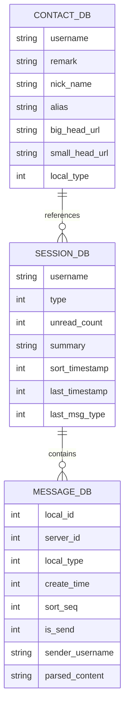

**图表来源**
- [chatService.ts:11-101](file://electron/services/chatService.ts#L11-L101)

#### WCDB 数据库
专门处理微信的复杂数据结构：

| 数据库类型 | 文件名 | 用途 |
|------------|--------|------|
| Session | session.db | 聊天会话和消息元数据 |
| Contact | contact.db | 联系人和群组信息 |
| Emoticon | emoticon.db | 表情包数据 |
| Emotion | emotion.db | 个人表情数据 |
| HeadImage | head_image.db | 用户头像数据 |
| Misc | misc.db | 其他杂项数据 |

**章节来源**
- [chatService.ts:299-332](file://electron/services/chatService.ts#L299-L332)
- [dbPathService.ts:43-64](file://electron/services/dbPathService.ts#L43-L64)

### 数据库性能优化

#### 查询优化策略

1. **预编译语句缓存**
```typescript
private preparedStmtCache: Map<string, Database.Statement> = new Map()
```

2. **表结构缓存**
```typescript
private contactColumnsCache: { 
    hasBigHeadUrl: boolean, 
    hasSmallHeadUrl: boolean, 
    selectCols: string[] 
} | null = null
```

3. **增量更新机制**
```typescript
private sessionCursor: Map<string, number> = new Map()
```

#### 索引策略
ChatService 自动为消息表创建索引以提升查询性能：

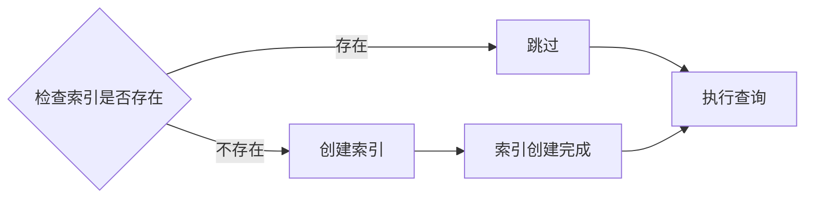

**图表来源**
- [chatService.ts:792-794](file://electron/services/chatService.ts#L792-L794)

**章节来源**
- [chatService.ts:131-134](file://electron/services/chatService.ts#L131-L134)
- [chatService.ts:792-794](file://electron/services/chatService.ts#L792-L794)

### 错误处理和异常恢复

#### 错误处理机制

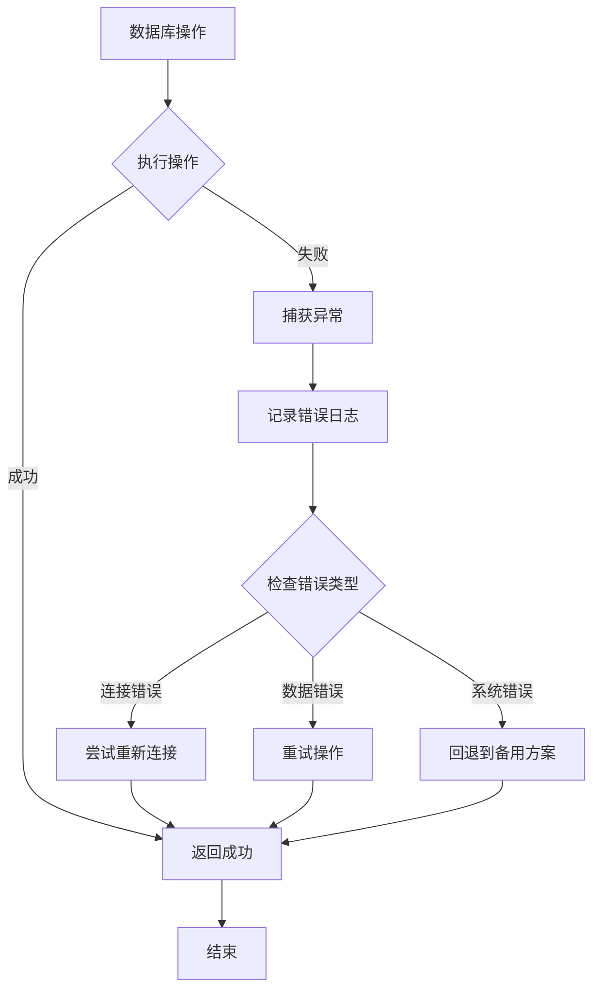

#### 异常恢复策略

1. **自动重连**: 连接断开时自动尝试重新建立连接
2. **降级处理**: 在某些功能不可用时提供替代方案
3. **资源清理**: 确保异常情况下资源得到正确释放

**章节来源**
- [chatService.ts:342-345](file://electron/services/chatService.ts#L342-L345)
- [nativeDecryptService.ts:186-194](file://electron/services/nativeDecryptService.ts#L186-L194)

## 依赖关系分析

### 组件依赖图

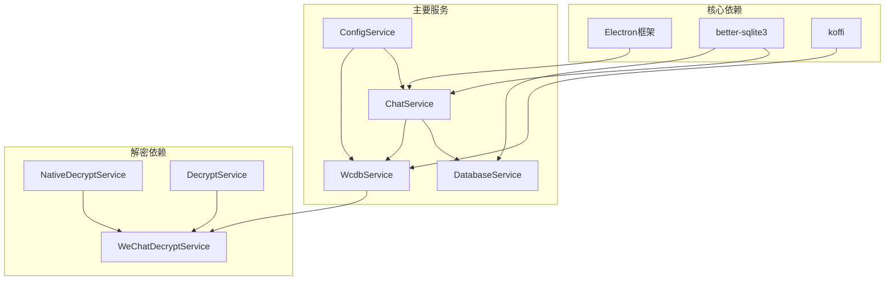

**图表来源**
- [main.ts:1-30](file://electron/main.ts#L1-L30)
- [chatService.ts:1-10](file://electron/services/chatService.ts#L1-L10)

### 数据流分析

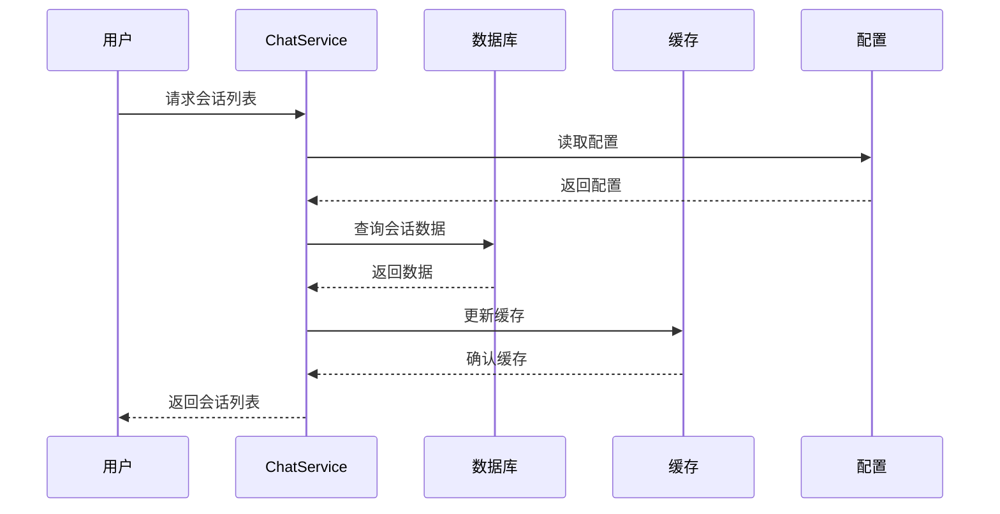

**图表来源**
- [chatService.ts:451-520](file://electron/services/chatService.ts#L451-L520)

**章节来源**
- [main.ts:1-30](file://electron/main.ts#L1-L30)
- [chatService.ts:451-520](file://electron/services/chatService.ts#L451-L520)

## 性能考虑

### 内存管理

1. **连接池优化**: 通过缓存数据库连接减少频繁创建销毁的开销
2. **数据缓存策略**: 合理使用 LRU 缓存和 TTL 机制
3. **垃圾回收**: 及时清理不再使用的数据库连接和缓存

### 查询性能优化

1. **预编译语句**: 避免重复解析 SQL 语句
2. **批量操作**: 支持批量插入和更新操作
3. **索引优化**: 自动为常用查询字段创建索引

### 并发控制

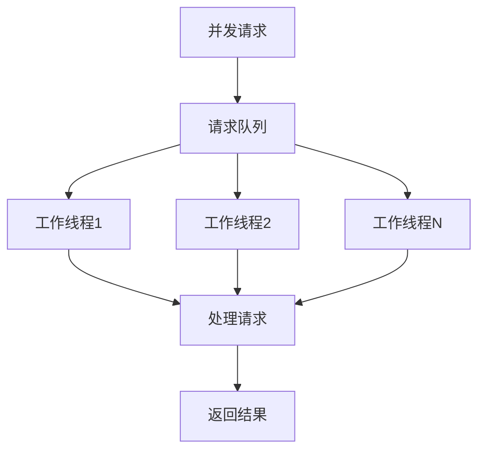

## 故障排除指南

### 常见问题及解决方案

#### 数据库连接问题
**症状**: 连接数据库时抛出异常
**解决方案**:
1. 检查数据库文件是否存在
2. 验证文件权限设置
3. 确认数据库文件未被其他程序占用

#### 解密失败问题
**症状**: 数据库解密过程中出现错误
**解决方案**:
1. 验证密钥格式是否正确
2. 检查 DLL 文件是否完整
3. 确认系统架构兼容性

#### 性能问题
**症状**: 查询响应缓慢
**解决方案**:
1. 检查数据库索引是否完整
2. 优化查询语句
3. 考虑增加硬件资源

### 调试技巧

1. **启用详细日志**: 通过配置服务调整日志级别
2. **监控资源使用**: 定期检查内存和 CPU 使用情况
3. **性能分析**: 使用性能分析工具识别瓶颈

**章节来源**
- [chatService.ts:342-345](file://electron/services/chatService.ts#L342-L345)
- [cacheService.ts:112-191](file://electron/services/cacheService.ts#L112-L191)

## 结论

CipherTalk 的数据库服务管理系统展现了现代桌面应用的数据处理最佳实践。通过分层架构设计、多数据库支持、性能优化和完善的错误处理机制，实现了高效、稳定的数据管理能力。

主要特点包括：
- **模块化设计**: 清晰的职责分离和接口定义
- **性能优化**: 多层次的缓存和索引策略
- **可靠性**: 完善的错误处理和异常恢复机制
- **可扩展性**: 支持多种数据库类型和解密算法

该系统为类似的数据处理应用提供了优秀的参考模板，特别是在处理复杂数据结构和多源数据集成方面具有重要借鉴价值。