# 数据库生命周期管理

<cite>
**本文档引用的文件**
- [database.ts](file://electron/services/database.ts)
- [dbPathService.ts](file://electron/services/dbPathService.ts)
- [main.ts](file://electron/main.ts)
- [logService.ts](file://electron/services/logService.ts)
- [config.ts](file://electron/services/config.ts)
- [database.ts](file://src/services/database.ts)
- [ipc.ts](file://src/services/ipc.ts)
</cite>

## 目录
1. [引言](#引言)
2. [项目结构](#项目结构)
3. [核心组件](#核心组件)
4. [架构概览](#架构概览)
5. [详细组件分析](#详细组件分析)
6. [依赖关系分析](#依赖关系分析)
7. [性能考虑](#性能考虑)
8. [故障排除指南](#故障排除指南)
9. [结论](#结论)

## 引言

CipherTalk 的数据库生命周期管理是一个复杂的系统，涉及多个层面的服务协调和状态管理。本文档深入分析了数据库服务的完整生命周期：从启动初始化、运行时管理、优雅关闭到异常重启流程。

该系统采用 Electron 架构，结合前端 React 应用和后端 Node.js 服务，实现了对微信数据库的高效管理和访问。数据库生命周期管理涵盖了路径发现机制、多数据库实例管理、状态监控、服务协调等多个方面。

## 项目结构

CipherTalk 的数据库相关代码分布在三个主要层次：

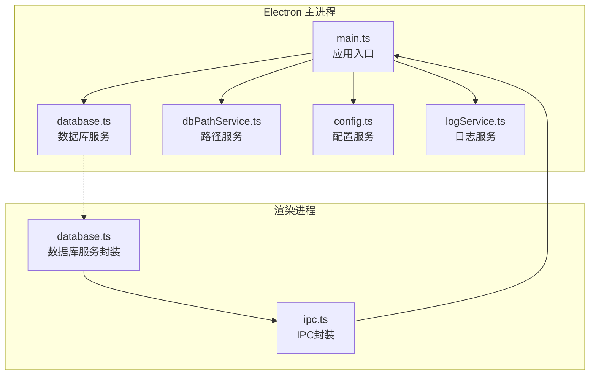

**图表来源**
- [main.ts:1-50](file://electron/main.ts#L1-L50)
- [database.ts:1-83](file://electron/services/database.ts#L1-L83)
- [dbPathService.ts:1-93](file://electron/services/dbPathService.ts#L1-L93)

**章节来源**
- [main.ts:1-800](file://electron/main.ts#L1-L800)
- [database.ts:1-83](file://electron/services/database.ts#L1-L83)
- [dbPathService.ts:1-93](file://electron/services/dbPathService.ts#L1-L93)

## 核心组件

### 数据库服务 (DatabaseService)

DatabaseService 是整个数据库生命周期管理的核心组件，提供了完整的数据库操作能力：

- **连接管理**：支持只读模式连接，确保数据安全性
- **查询执行**：提供批量查询和单条查询功能
- **状态监控**：内置连接状态检查机制
- **资源管理**：完善的资源清理和异常处理

### 路径服务 (DbPathService)

DbPathService 负责微信数据库路径的自动发现和管理：

- **智能检测**：自动检测微信 4.x 和旧版数据目录
- **账号识别**：扫描有效的微信账号目录
- **路径验证**：验证数据库目录的完整性和有效性

### 配置服务 (ConfigService)

ConfigService 管理应用的所有配置信息：

- **持久化存储**：基于 SQLite 的配置数据库
- **默认值管理**：提供完整的默认配置
- **动态更新**：支持运行时配置修改

**章节来源**
- [database.ts:5-82](file://electron/services/database.ts#L5-L82)
- [dbPathService.ts:5-93](file://electron/services/dbPathService.ts#L5-L93)
- [config.ts:126-395](file://electron/services/config.ts#L126-L395)

## 架构概览

CipherTalk 的数据库架构采用了分层设计，实现了前后端分离和职责明确的架构模式：

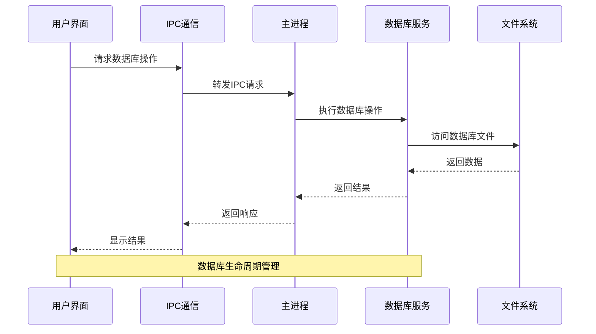

**图表来源**
- [main.ts:1186-1197](file://electron/main.ts#L1186-L1197)
- [ipc.ts:9-15](file://src/services/ipc.ts#L9-L15)

### 启动初始化流程

应用启动时的数据库初始化遵循严格的顺序控制：

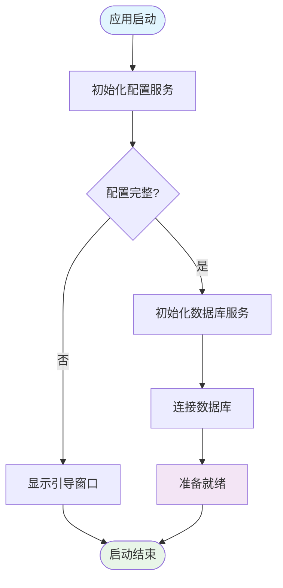

**图表来源**
- [main.ts:3611-3701](file://electron/main.ts#L3611-L3701)
- [main.ts:218-225](file://electron/main.ts#L218-L225)

**章节来源**
- [main.ts:3611-3701](file://electron/main.ts#L3611-L3701)
- [main.ts:218-225](file://electron/main.ts#L218-L225)

## 详细组件分析

### 数据库服务类图

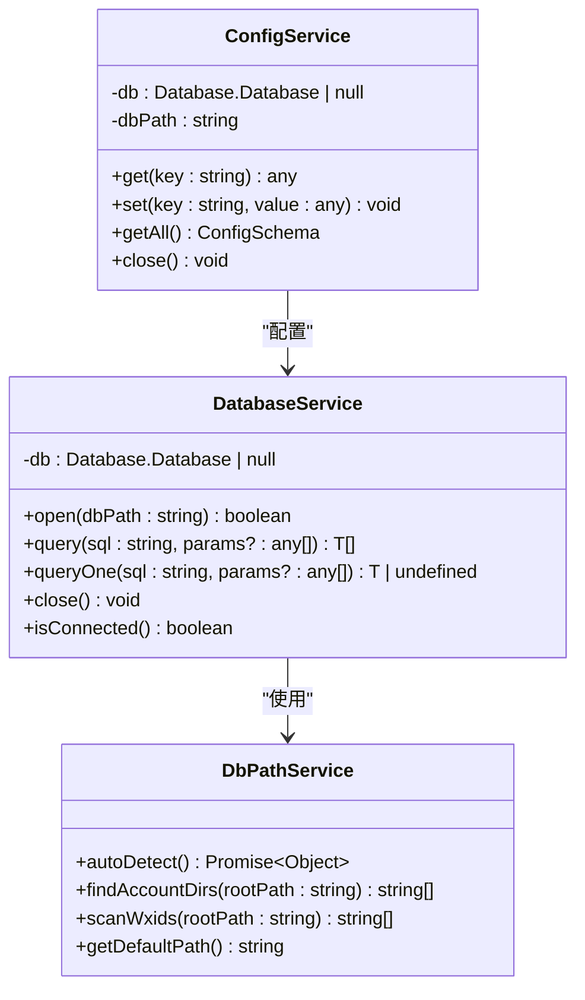

**图表来源**
- [database.ts:5-82](file://electron/services/database.ts#L5-L82)
- [dbPathService.ts:5-93](file://electron/services/dbPathService.ts#L5-L93)
- [config.ts:126-395](file://electron/services/config.ts#L126-L395)

### 数据库路径管理机制

DbPathService 实现了智能的数据库路径发现机制：

#### 路径发现算法

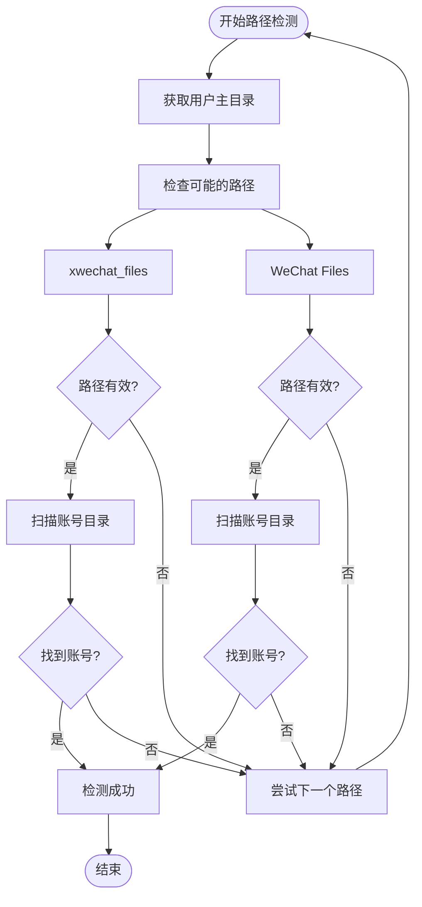

**图表来源**
- [dbPathService.ts:9-38](file://electron/services/dbPathService.ts#L9-L38)

#### 账号目录验证策略

DbPathService 通过以下策略验证账号目录的有效性：

1. **目录存在性检查**：确认目标目录确实存在
2. **目录名称验证**：验证目录名称符合微信数据格式
3. **db_storage 子目录检查**：确保包含有效的数据库存储目录
4. **账号完整性验证**：确认账号目录结构完整

**章节来源**
- [dbPathService.ts:9-93](file://electron/services/dbPathService.ts#L9-L93)

### 数据库状态监控

系统实现了多层次的数据库状态监控机制：

#### 连接状态检查

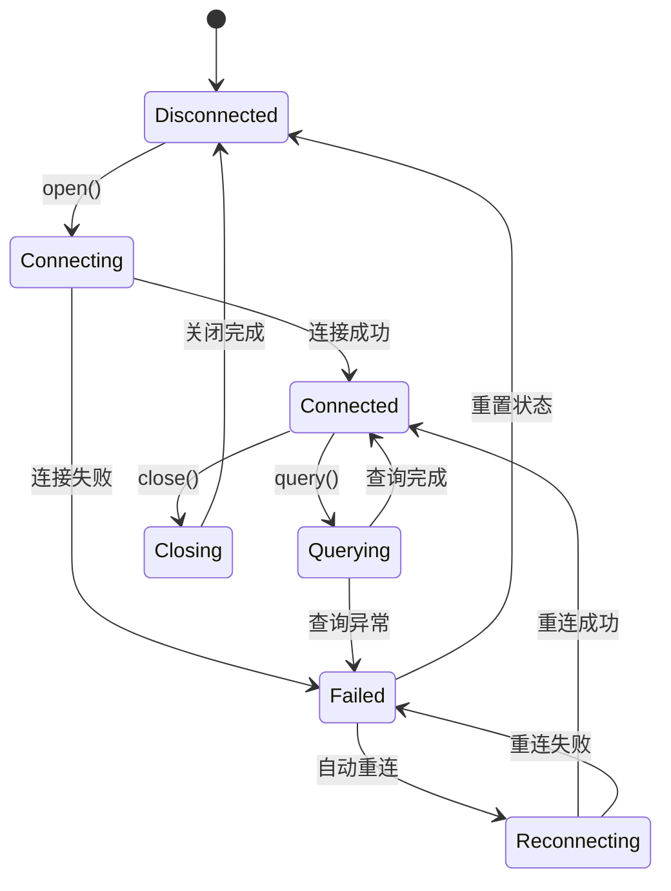

**图表来源**
- [database.ts:11-81](file://electron/services/database.ts#L11-L81)

#### 健康检查机制

系统通过以下方式实现数据库健康检查：

1. **文件存在性验证**：检查数据库文件是否存在
2. **连接可用性测试**：验证数据库连接的有效性
3. **查询执行测试**：通过简单查询验证数据库功能
4. **异常捕获机制**：捕获并处理各种数据库异常

**章节来源**
- [database.ts:11-81](file://electron/services/database.ts#L11-L81)

### 数据库服务协调

#### 服务间依赖关系

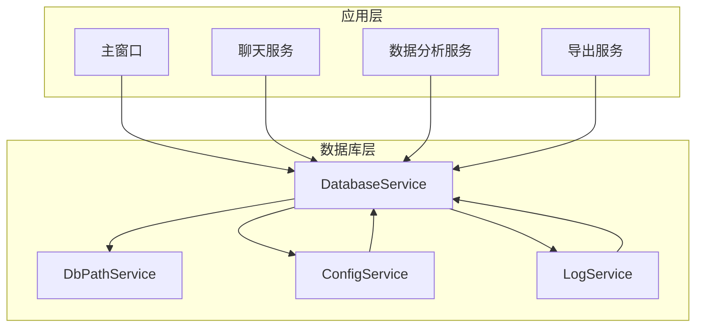

**图表来源**
- [main.ts:1-29](file://electron/main.ts#L1-L29)

#### 启动顺序控制

应用启动时严格控制各服务的启动顺序：

1. **配置服务初始化**：首先初始化配置服务
2. **日志服务初始化**：建立日志基础设施
3. **数据库服务初始化**：创建数据库连接
4. **其他服务初始化**：初始化其他业务服务

**章节来源**
- [main.ts:218-225](file://electron/main.ts#L218-L225)

### 数据库生命周期管理

#### 完整生命周期流程

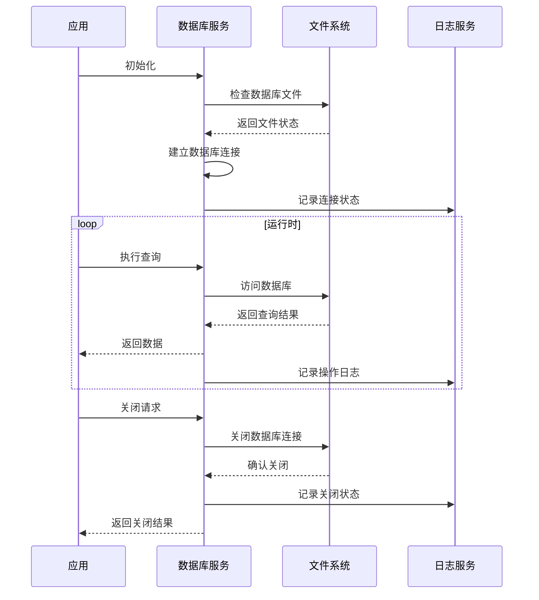

**图表来源**
- [database.ts:11-74](file://electron/services/database.ts#L11-L74)
- [logService.ts:214-237](file://electron/services/logService.ts#L214-L237)

#### 异常重启流程

系统实现了智能的异常重启机制：

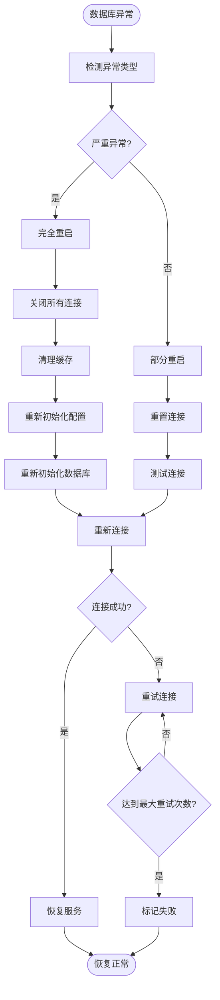

**图表来源**
- [database.ts:20-24](file://electron/services/database.ts#L20-L24)

**章节来源**
- [database.ts:11-74](file://electron/services/database.ts#L11-L74)

## 依赖关系分析

### 组件耦合度分析

CipherTalk 的数据库服务展现了良好的模块化设计：

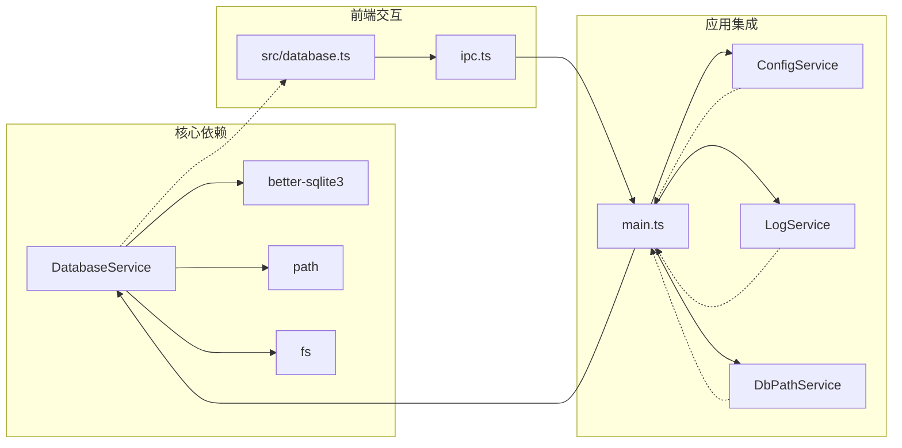

**图表来源**
- [database.ts:1-4](file://electron/services/database.ts#L1-L4)
- [main.ts:1-11](file://electron/main.ts#L1-L11)

### 外部依赖管理

系统对外部依赖的管理体现了良好的工程实践：

1. **数据库驱动**：使用 better-sqlite3 提供高性能的 SQLite 访问
2. **文件系统操作**：通过 Node.js fs 模块进行文件操作
3. **路径处理**：使用 path 模块处理跨平台路径问题
4. **配置存储**：SQLite 数据库存储应用配置

**章节来源**
- [database.ts:1-4](file://electron/services/database.ts#L1-L4)
- [main.ts:1-11](file://electron/main.ts#L1-L11)

## 性能考虑

### 查询优化策略

系统在数据库查询方面采用了多种优化策略：

1. **只读连接**：数据库连接采用只读模式，提高安全性同时减少锁竞争
2. **参数化查询**：所有查询都使用参数化形式，防止 SQL 注入并提高缓存效率
3. **批量操作**：支持批量查询操作，减少数据库往返次数
4. **连接池管理**：虽然当前实现为单连接，但架构支持未来扩展为连接池

### 内存管理

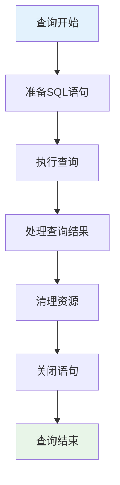

**图表来源**
- [database.ts:29-44](file://electron/services/database.ts#L29-L44)

### 缓存策略

系统通过以下方式实现数据缓存：

1. **配置缓存**：ConfigService 将配置存储在内存中，减少数据库访问
2. **路径缓存**：DbPathService 缓存已发现的路径信息
3. **连接复用**：数据库连接在应用生命周期内复用

## 故障排除指南

### 常见问题诊断

#### 数据库连接失败

**症状**：应用无法连接到数据库文件

**诊断步骤**：
1. 检查数据库文件是否存在
2. 验证文件权限设置
3. 确认数据库文件完整性
4. 检查磁盘空间是否充足

**解决方案**：
1. 重新选择正确的数据库路径
2. 修复文件权限问题
3. 执行数据库完整性检查
4. 清理磁盘空间

#### 查询异常处理

**症状**：数据库查询抛出异常

**处理机制**：
1. **异常捕获**：所有数据库操作都在 try-catch 块中执行
2. **错误记录**：详细的错误信息被记录到日志中
3. **异常传播**：异常向上层抛出，由调用方处理
4. **状态恢复**：异常发生后重置数据库连接状态

**章节来源**
- [database.ts:20-63](file://electron/services/database.ts#L20-L63)
- [logService.ts:214-237](file://electron/services/logService.ts#L214-L237)

### 日志记录策略

系统实现了全面的日志记录机制：

#### 日志级别管理

| 级别 | 描述 | 用途 |
|------|------|------|
| DEBUG | 详细调试信息 | 开发阶段问题诊断 |
| INFO | 一般信息 | 正常操作记录 |
| WARN | 警告信息 | 潜在问题提醒 |
| ERROR | 错误信息 | 异常情况记录 |

#### 日志文件管理

1. **自动轮转**：当日志文件超过大小限制时自动轮转
2. **自动清理**：保留最新日志文件，清理过期文件
3. **大小限制**：默认保留最近 10 个日志文件
4. **大小控制**：单个日志文件最大 10MB

**章节来源**
- [logService.ts:20-331](file://electron/services/logService.ts#L20-L331)

### 性能监控

系统提供了多种性能监控手段：

1. **连接状态监控**：实时监控数据库连接状态
2. **查询性能统计**：记录查询执行时间和成功率
3. **资源使用监控**：监控内存和磁盘使用情况
4. **异常统计**：统计各类异常的发生频率和类型

## 结论

CipherTalk 的数据库生命周期管理系统展现了现代应用开发的最佳实践。通过精心设计的架构和完善的生命周期管理，系统实现了：

### 主要优势

1. **模块化设计**：清晰的组件分离和职责划分
2. **健壮性**：完善的异常处理和恢复机制
3. **可维护性**：良好的代码组织和文档支持
4. **性能优化**：高效的数据库访问和资源管理
5. **可观测性**：全面的日志记录和监控能力

### 技术亮点

- **智能路径管理**：自动检测和验证数据库路径
- **优雅的生命周期**：完整的启动、运行、关闭流程
- **强大的错误处理**：多层次的异常捕获和恢复
- **灵活的配置管理**：基于 SQLite 的配置存储系统
- **完善的日志体系**：结构化的日志记录和管理

### 改进建议

1. **连接池支持**：考虑实现数据库连接池以提高并发性能
2. **查询缓存**：为常用查询结果实现缓存机制
3. **监控增强**：增加更详细的性能指标收集
4. **备份机制**：实现数据库文件的自动备份功能
5. **安全加固**：增强数据库访问的安全性措施

该系统为类似的数据管理应用提供了优秀的参考模板，其设计理念和实现方式值得其他项目借鉴和学习。