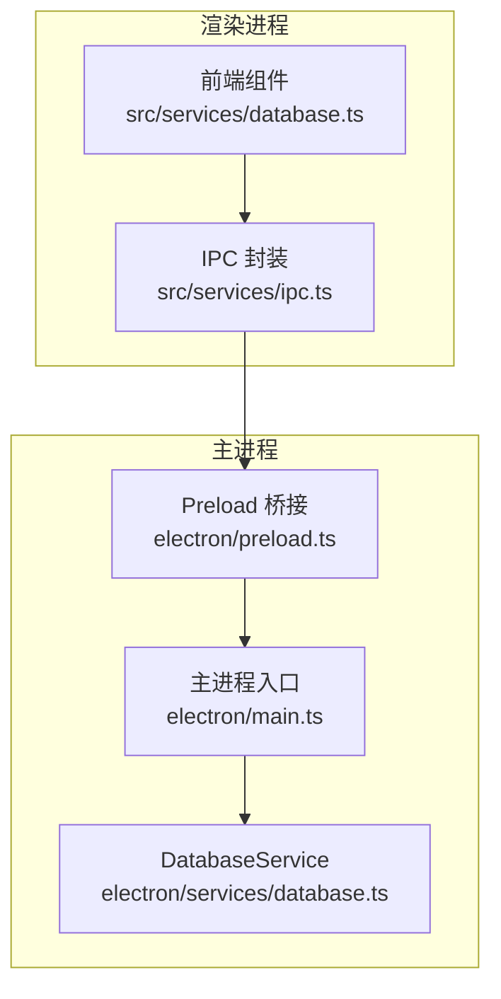
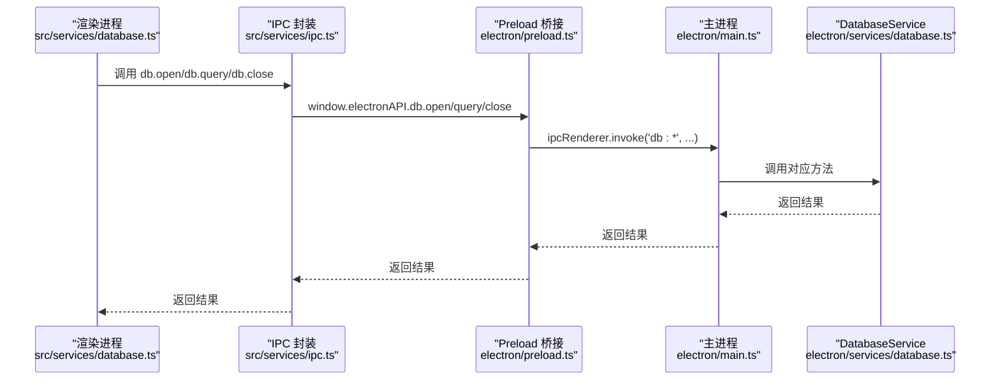
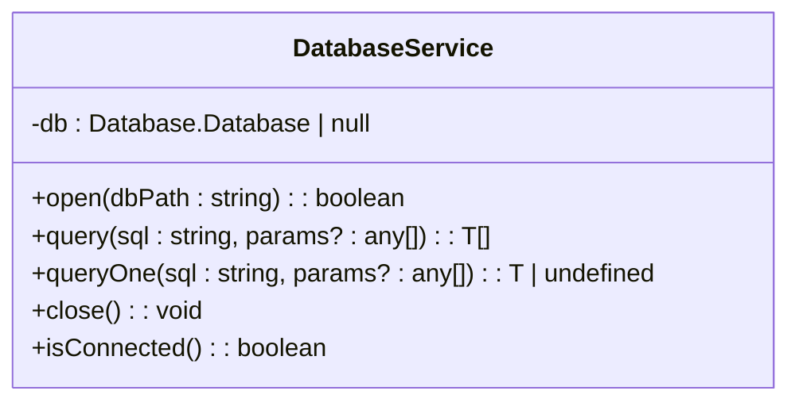
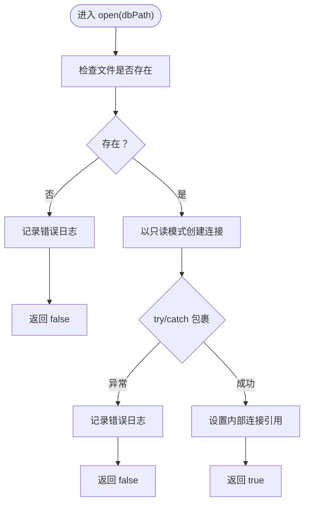
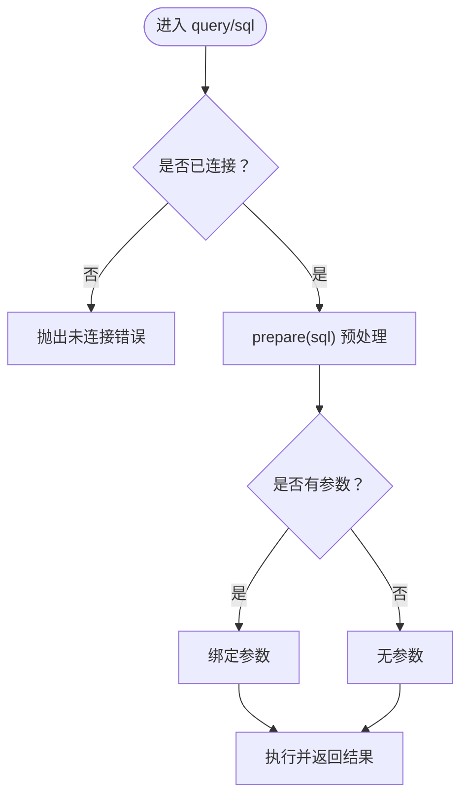
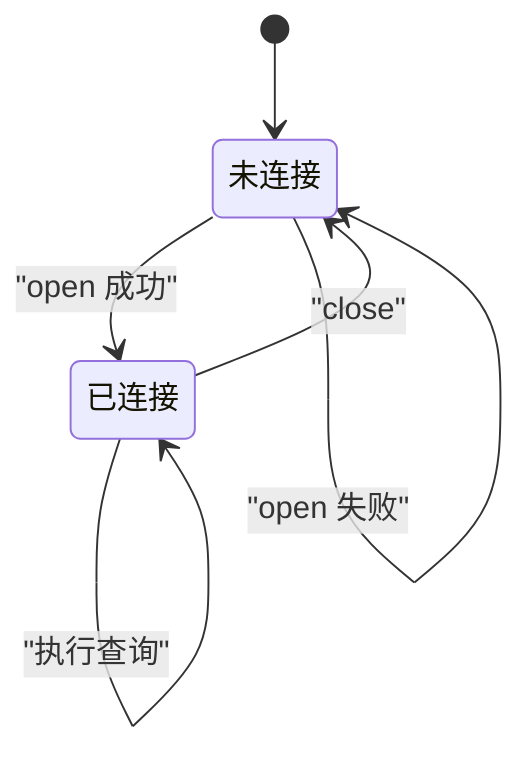
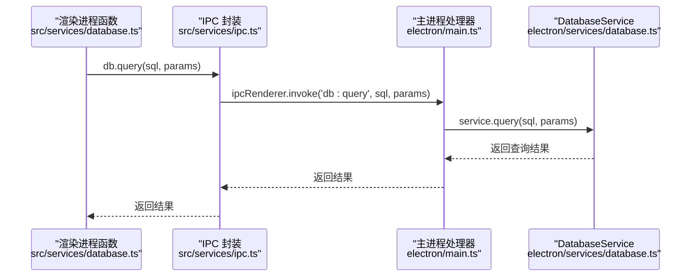
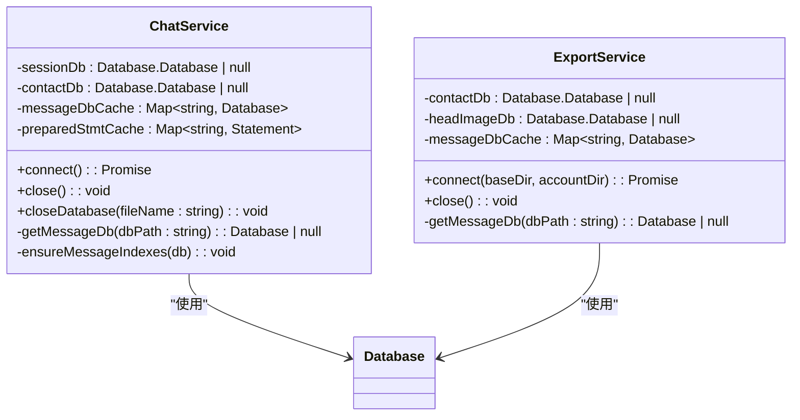
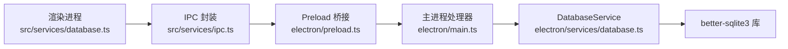

# 数据库连接管理

<cite>
**本文档引用的文件**
- [electron\services\database.ts](file://electron/services/database.ts)
- [src\services\database.ts](file://src/services/database.ts)
- [src\services\ipc.ts](file://src/services/ipc.ts)
- [electron\preload.ts](file://electron/preload.ts)
- [electron\main.ts](file://electron/main.ts)
- [electron\services\chatService.ts](file://electron/services/chatService.ts)
- [electron\services\dbPathService.ts](file://electron/services/dbPathService.ts)
- [electron\services\exportService.ts](file://electron/services/exportService.ts)
</cite>

## 目录
1. [简介](#简介)
2. [项目结构](#项目结构)
3. [核心组件](#核心组件)
4. [架构总览](#架构总览)
5. [详细组件分析](#详细组件分析)
6. [依赖关系分析](#依赖关系分析)
7. [性能考虑](#性能考虑)
8. [故障排除指南](#故障排除指南)
9. [结论](#结论)
10. [附录](#附录)

## 简介
本文件面向 CipherTalk 的数据库连接管理，重点围绕 DatabaseService 类的设计与实现进行深入解析，涵盖以下方面：
- 连接建立与状态检查：文件存在性校验、只读模式配置、连接状态判断
- 数据库打开流程：从 IPC 到底层 better-sqlite3 的完整链路
- 查询执行机制：SQL 预处理语句、参数绑定、批量查询与单条查询差异
- 连接生命周期管理：最佳实践（创建、使用、关闭）
- 错误处理策略与性能优化建议
- 数据库连接配置指南与常见问题排查

## 项目结构
CipherTalk 的数据库访问采用“渲染进程 → IPC → 主进程 → 服务层”的分层设计。核心文件分布如下：
- Electron 主进程：负责注册 IPC 处理器、实例化服务并暴露给渲染进程
- 服务层（Electron）：包含 DatabaseService、ChatService、ExportService 等
- 渲染进程服务封装：对 IPC API 进行二次封装，便于前端调用

**图表来源**
- [electron\main.ts:1186-1197](file://electron/main.ts#L1186-L1197)
- [electron\preload.ts:14-18](file://electron/preload.ts#L14-L18)
- [src\services\ipc.ts:10-15](file://src/services/ipc.ts#L10-L15)
- [electron\services\database.ts:5-82](file://electron/services/database.ts#L5-L82)

**章节来源**
- [electron\main.ts:1186-1197](file://electron/main.ts#L1186-L1197)
- [electron\preload.ts:14-18](file://electron/preload.ts#L14-L18)
- [src\services\ipc.ts:10-15](file://src/services/ipc.ts#L10-L15)
- [electron\services\database.ts:5-82](file://electron/services/database.ts#L5-L82)

## 核心组件
本节聚焦 DatabaseService 类，它是基础的 SQLite 连接管理器，提供打开、查询、单条查询、关闭与连接状态检查能力。

- 连接建立
  - 文件存在性检查：通过文件系统存在性判断，避免无效路径引发异常
  - 只读模式：以只读方式打开数据库，确保安全性与一致性
- 查询执行
  - 预处理语句：使用 prepare 创建 Statement，提升重复执行效率
  - 参数绑定：支持数组参数，按顺序绑定到占位符
  - 批量查询与单条查询：query 返回多行，queryOne 返回单行
- 生命周期管理
  - 关闭：显式关闭底层连接并清空引用
  - 状态检查：isConnected 返回当前连接状态

**章节来源**
- [electron\services\database.ts:11-24](file://electron/services/database.ts#L11-L24)
- [electron\services\database.ts:29-44](file://electron/services/database.ts#L29-L44)
- [electron\services\database.ts:49-64](file://electron/services/database.ts#L49-L64)
- [electron\services\database.ts:69-74](file://electron/services/database.ts#L69-L74)
- [electron\services\database.ts:79-81](file://electron/services/database.ts#L79-L81)

## 架构总览
下图展示从渲染进程发起数据库操作到主进程实际执行的端到端流程：

**图表来源**
- [src\services\database.ts:26-47](file://src/services/database.ts#L26-L47)
- [src\services\ipc.ts:10-15](file://src/services/ipc.ts#L10-L15)
- [electron\preload.ts:14-18](file://electron/preload.ts#L14-L18)
- [electron\main.ts:1186-1197](file://electron/main.ts#L1186-L1197)
- [electron\services\database.ts:5-82](file://electron/services/database.ts#L5-L82)

## 详细组件分析

### DatabaseService 类设计与实现
DatabaseService 是基于 better-sqlite3 的轻量级连接管理器，职责清晰、接口简洁，适合一次性或短生命周期的只读查询场景。

- 字段与状态
  - 私有字段 db：存储底层连接对象；初始值为 null，表示未连接
- 方法详解
  - open：校验文件存在性，以只读模式创建连接
  - query：预处理 SQL，绑定参数，返回多行结果
  - queryOne：预处理 SQL，绑定参数，返回单行结果
  - close：关闭连接并清空引用
  - isConnected：判断当前是否已连接

**图表来源**
- [electron\services\database.ts:5-82](file://electron/services/database.ts#L5-L82)

**章节来源**
- [electron\services\database.ts:5-82](file://electron/services/database.ts#L5-L82)

### 数据库打开流程（文件存在性检查、只读模式、异常处理）
- 文件存在性检查：在 open 中先通过文件系统判断路径是否存在，若不存在直接返回 false 并记录错误日志
- 只读模式配置：以 { readonly: true } 打开数据库，确保不会产生写入副作用
- 异常处理：try/catch 包裹连接过程，捕获异常并返回 false，同时打印错误日志

**图表来源**
- [electron\services\database.ts:11-24](file://electron/services/database.ts#L11-L24)

**章节来源**
- [electron\services\database.ts:11-24](file://electron/services/database.ts#L11-L24)

### 查询执行机制（预处理语句、参数绑定、批量与单条查询）
- 预处理语句：使用 prepare 创建 Statement，避免重复解析 SQL，提升性能
- 参数绑定：支持传入 params 数组，按顺序绑定到 SQL 占位符
- 批量查询 vs 单条查询
  - 批量查询：使用 stmt.all(...) 返回多行
  - 单条查询：使用 stmt.get(...) 返回一行或 undefined

**图表来源**
- [electron\services\database.ts:29-44](file://electron/services/database.ts#L29-L44)
- [electron\services\database.ts:49-64](file://electron/services/database.ts#L49-L64)

**章节来源**
- [electron\services\database.ts:29-44](file://electron/services/database.ts#L29-L44)
- [electron\services\database.ts:49-64](file://electron/services/database.ts#L49-L64)

### 连接生命周期管理（创建、使用、关闭的最佳实践）
- 创建：在需要访问数据库前调用 open，确保路径有效且只读
- 使用：在业务层封装查询方法，统一通过 IPC 调用，避免直接在渲染进程操作数据库
- 关闭：在不需要继续查询时调用 close，释放底层资源；对于长驻服务（如 ChatService）应遵循其自身的连接池与缓存策略

**图表来源**
- [electron\services\database.ts:69-81](file://electron/services/database.ts#L69-L81)

**章节来源**
- [electron\services\database.ts:69-81](file://electron/services/database.ts#L69-L81)

### 与渲染进程服务的集成
渲染进程通过 src/services/database.ts 封装好的查询函数调用数据库，内部通过 src/services/ipc.ts 暴露的 db.open/query/close 接口完成 IPC 调用，最终由主进程 electron/main.ts 中的 IPC 处理器转发至 DatabaseService。

**图表来源**
- [src\services\database.ts:26-47](file://src/services/database.ts#L26-L47)
- [src\services\ipc.ts:10-15](file://src/services/ipc.ts#L10-L15)
- [electron\main.ts:1191-1192](file://electron/main.ts#L1191-L1192)
- [electron\services\database.ts:29-44](file://electron/services/database.ts#L29-L44)

**章节来源**
- [src\services\database.ts:26-47](file://src/services/database.ts#L26-L47)
- [src\services\ipc.ts:10-15](file://src/services/ipc.ts#L10-L15)
- [electron\main.ts:1191-1192](file://electron/main.ts#L1191-L1192)
- [electron\services\database.ts:29-44](file://electron/services/database.ts#L29-L44)

### 连接池与多数据库管理（ChatService 与 ExportService）
虽然 DatabaseService 本身不维护连接池，但在复杂场景下（如 ChatService），会以“只读”方式打开多个数据库文件，并通过缓存与预编译语句提升性能：
- 多数据库打开：在连接时根据目录结构打开 contact.db、head_image.db、emotion.db、misc.db 等
- 连接池策略：将已打开的数据库缓存在 Map 中，避免重复打开
- 预编译语句缓存：将常用 SQL 语句预编译并缓存，减少重复解析成本
- 增量更新时的精细化关闭：支持按文件名关闭特定数据库，避免影响其他查询

**图表来源**
- [electron\services\chatService.ts:110-138](file://electron/services/chatService.ts#L110-L138)
- [electron\services\chatService.ts:782-800](file://electron/services/chatService.ts#L782-L800)
- [electron\services\exportService.ts:234-277](file://electron/services/exportService.ts#L234-L277)

**章节来源**
- [electron\services\chatService.ts:110-138](file://electron/services/chatService.ts#L110-L138)
- [electron\services\chatService.ts:782-800](file://electron/services/chatService.ts#L782-L800)
- [electron\services\exportService.ts:234-277](file://electron/services/exportService.ts#L234-L277)

## 依赖关系分析
- 渲染进程依赖 src/services/ipc.ts 暴露的 db.open/query/close 方法
- IPC 桥接通过 electron/preload.ts 暴露 window.electronAPI.db.* 给渲染进程
- 主进程 electron/main.ts 注册 db:open/db:query/db:close 处理器，转发到 DatabaseService
- DatabaseService 依赖 better-sqlite3 库进行底层连接与查询

**图表来源**
- [src\services\database.ts:26-47](file://src/services/database.ts#L26-L47)
- [src\services\ipc.ts:10-15](file://src/services/ipc.ts#L10-L15)
- [electron\preload.ts:14-18](file://electron/preload.ts#L14-L18)
- [electron\main.ts:1186-1197](file://electron/main.ts#L1186-L1197)
- [electron\services\database.ts:1](file://electron/services/database.ts#L1)

**章节来源**
- [src\services\database.ts:26-47](file://src/services/database.ts#L26-L47)
- [src\services\ipc.ts:10-15](file://src/services/ipc.ts#L10-L15)
- [electron\preload.ts:14-18](file://electron/preload.ts#L14-L18)
- [electron\main.ts:1186-1197](file://electron/main.ts#L1186-L1197)
- [electron\services\database.ts:1](file://electron/services/database.ts#L1)

## 性能考虑
- 预处理与参数绑定
  - 使用 prepare 创建 Statement，避免重复解析 SQL
  - 通过参数数组绑定，减少字符串拼接与注入风险
- 连接池与缓存
  - 在 ChatService/ExportService 中缓存数据库连接与预编译语句，显著降低重复打开与解析成本
- 只读模式
  - 以只读模式打开数据库，避免写锁竞争，提升并发查询稳定性
- 索引优化
  - ChatService 在消息数据库中动态创建索引（如 idx_Msg_x_sort_seq），加速排序与范围查询
- 增量更新与缓存失效
  - 针对会话表与消息表的缓存设置合理的失效策略，避免陈旧数据影响查询性能

**章节来源**
- [electron\services\chatService.ts:805-814](file://electron/services/chatService.ts#L805-L814)
- [electron\services\chatService.ts:1016-1019](file://electron/services/chatService.ts#L1016-L1019)
- [electron\services\exportService.ts:266-277](file://electron/services/exportService.ts#L266-L277)

## 故障排除指南
- 打开数据库失败
  - 检查 dbPath 是否正确且文件存在
  - 确认应用具有读取权限
  - 查看控制台日志中的错误信息
- 查询失败
  - 确认数据库已打开（isConnected）
  - 检查 SQL 语法与参数数量是否匹配
  - 捕获异常并记录堆栈，定位具体语句
- 连接泄漏
  - 确保在不再使用时调用 close
  - 对于多数据库场景，使用 closeDatabase 按需释放特定连接
- 性能问题
  - 启用预编译语句缓存与连接池
  - 为高频查询创建合适索引
  - 避免在渲染进程直接操作数据库，统一通过 IPC 调用

**章节来源**
- [electron\services\database.ts:11-24](file://electron/services/database.ts#L11-L24)
- [electron\services\database.ts:29-44](file://electron/services/database.ts#L29-L44)
- [electron\services\database.ts:49-64](file://electron/services/database.ts#L49-L64)
- [electron\services\chatService.ts:351-383](file://electron/services/chatService.ts#L351-L383)
- [electron\services\exportService.ts:253-264](file://electron/services/exportService.ts#L253-L264)

## 结论
DatabaseService 以简洁的接口实现了只读数据库的连接与查询能力，配合 IPC 与主进程处理器，形成清晰的前后端分离架构。在复杂场景下，ChatService/ExportService 展示了多数据库连接池、预编译语句缓存与索引优化等高级策略，能够满足 CipherTalk 的高性能查询需求。建议在生产环境中：
- 始终以只读模式打开数据库
- 使用预编译与参数绑定
- 合理利用连接池与缓存
- 明确连接生命周期，及时释放资源

## 附录

### 数据库连接配置指南
- 打开数据库
  - 路径：确保 dbPath 指向有效的 SQLite 文件
  - 权限：确保应用具备读取权限
  - 只读：默认以只读模式打开，无需额外配置
- 查询参数
  - 使用数组形式传参，顺序对应 SQL 占位符
  - 批量查询使用 query，单条查询使用 queryOne
- 关闭数据库
  - 在不需要继续查询时调用 close
  - 多数据库场景使用 closeDatabase 按需释放

**章节来源**
- [electron\services\database.ts:11-24](file://electron/services/database.ts#L11-L24)
- [electron\services\database.ts:29-44](file://electron/services/database.ts#L29-L44)
- [electron\services\database.ts:49-64](file://electron/services/database.ts#L49-L64)
- [electron\services\database.ts:69-74](file://electron/services/database.ts#L69-L74)