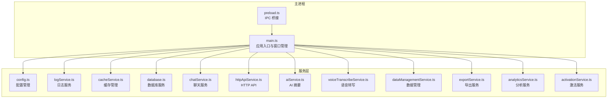
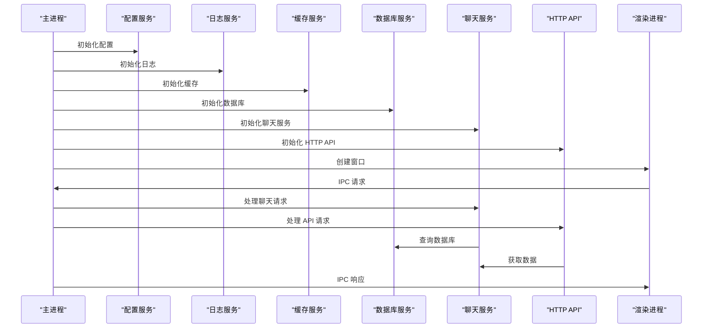
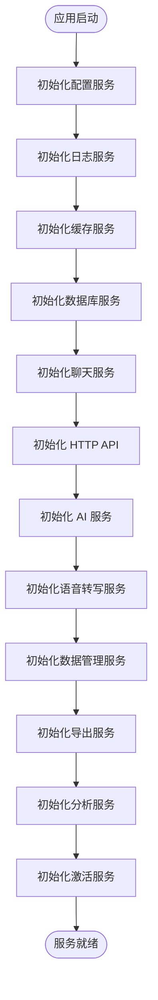
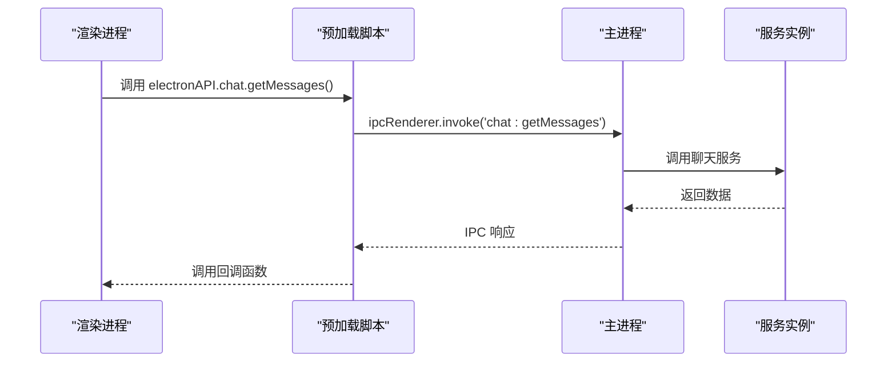
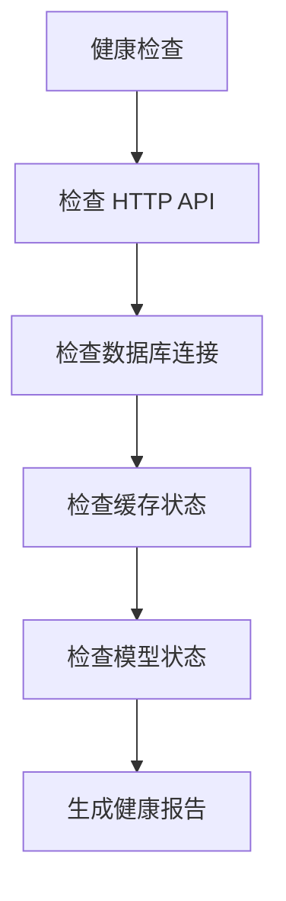
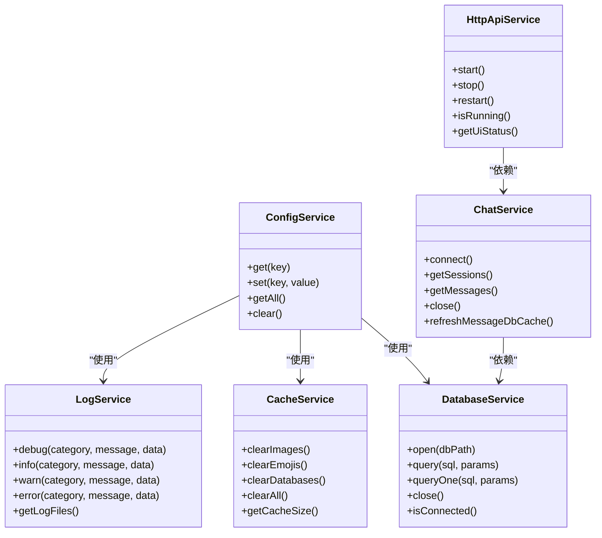

# 服务协调与调度

<cite>
**本文档引用的文件**
- [electron/main.ts](file://electron/main.ts)
- [electron/preload.ts](file://electron/preload.ts)
- [electron/services/config.ts](file://electron/services/config.ts)
- [electron/services/database.ts](file://electron/services/database.ts)
- [electron/services/cacheService.ts](file://electron/services/cacheService.ts)
- [electron/services/logService.ts](file://electron/services/logService.ts)
- [electron/services/chatService.ts](file://electron/services/chatService.ts)
- [electron/services/httpApiService.ts](file://electron/services/httpApiService.ts)
- [electron/services/activationService.ts](file://electron/services/activationService.ts)
- [electron/services/ai/aiService.ts](file://electron/services/ai/aiService.ts)
- [electron/services/voiceTranscribeService.ts](file://electron/services/voiceTranscribeService.ts)
- [electron/services/dataManagementService.ts](file://electron/services/dataManagementService.ts)
- [electron/services/exportService.ts](file://electron/services/exportService.ts)
- [electron/services/analyticsService.ts](file://electron/services/analyticsService.ts)
</cite>

## 目录
1. [简介](#简介)
2. [项目结构](#项目结构)
3. [核心组件](#核心组件)
4. [架构总览](#架构总览)
5. [详细组件分析](#详细组件分析)
6. [依赖关系分析](#依赖关系分析)
7. [性能考虑](#性能考虑)
8. [故障排查指南](#故障排查指南)
9. [结论](#结论)

## 简介

CipherTalk 是一个基于 Electron 的微信聊天数据分析与展示应用。本文档深入解析其服务协调与调度机制，涵盖服务初始化顺序、依赖关系、通信协调、生命周期管理、监控与健康检查、并发管理、配置管理与动态加载等方面。

## 项目结构

项目采用模块化设计，核心服务位于 `electron/services/` 目录，主进程入口在 `electron/main.ts`，渲染进程桥接在 `electron/preload.ts`。

**图表来源**
- [electron/main.ts](file://electron/main.ts)
- [electron/preload.ts](file://electron/preload.ts)
- [electron/services/config.ts](file://electron/services/config.ts)
- [electron/services/logService.ts](file://electron/services/logService.ts)
- [electron/services/cacheService.ts](file://electron/services/cacheService.ts)
- [electron/services/database.ts](file://electron/services/database.ts)
- [electron/services/chatService.ts](file://electron/services/chatService.ts)
- [electron/services/httpApiService.ts](file://electron/services/httpApiService.ts)
- [electron/services/ai/aiService.ts](file://electron/services/ai/aiService.ts)
- [electron/services/voiceTranscribeService.ts](file://electron/services/voiceTranscribeService.ts)
- [electron/services/dataManagementService.ts](file://electron/services/dataManagementService.ts)
- [electron/services/exportService.ts](file://electron/services/exportService.ts)
- [electron/services/analyticsService.ts](file://electron/services/analyticsService.ts)
- [electron/services/activationService.ts](file://electron/services/activationService.ts)

**章节来源**
- [electron/main.ts](file://electron/main.ts)
- [electron/preload.ts](file://electron/preload.ts)

## 核心组件

### 配置服务 (ConfigService)
- 基于 SQLite 的配置存储，支持默认值迁移与字段兼容
- 提供统一的配置读写接口，支持热更新
- 管理数据库路径、缓存路径、主题、语言、HTTP API、AI 配置等

### 日志服务 (LogService)
- 结构化日志记录，支持级别控制与轮转
- 自动清理旧日志文件，防止磁盘占用过大
- 提供日志查询与管理接口

### 缓存服务 (CacheService)
- 统一管理图片、表情包、数据库、日志等缓存
- 支持清理特定类型缓存与全量清理
- 提供缓存大小统计与路径解析

### 数据库服务 (DatabaseService)
- 基于 better-sqlite3 的只读数据库访问
- 提供查询与连接管理
- 支持数据库状态检测

### 聊天服务 (ChatService)
- 核心数据访问层，管理多个 SQLite 数据库连接
- 实现消息数据库扫描、缓存管理、增量更新
- 提供会话、联系人、消息查询接口

### HTTP API 服务 (HttpApiService)
- 内置 HTTP 服务器，提供 RESTful API
- 支持认证与跨域处理
- 提供健康检查与状态查询

### AI 服务 (AIService)
- 多提供商 AI 摘要生成
- 支持流式输出与缓存
- 集成语音转写结果

### 语音转写服务 (VoiceTranscribeService)
- 基于 Sherpa-ONNX 的语音转写
- 支持模型下载与缓存
- 提供 Worker 线程处理

### 数据管理服务 (DataManagementService)
- 数据库扫描与解密
- 增量更新与原子替换
- 进度监控与事件通知

### 导出服务 (ExportService)
- 多格式导出支持（ChatLab、JSON、HTML、Excel 等）
- 媒体文件处理与路径映射
- 联系人信息导出

### 分析服务 (AnalyticsService)
- 聊天统计与时间分布分析
- 联系人排行与活跃度统计
- 私聊会话过滤与聚合

### 激活服务 (ActivationService)
- 设备 ID 生成与激活状态管理
- 在线验证与离线模式支持
- 加密存储与签名验证

**章节来源**
- [electron/services/config.ts](file://electron/services/config.ts)
- [electron/services/logService.ts](file://electron/services/logService.ts)
- [electron/services/cacheService.ts](file://electron/services/cacheService.ts)
- [electron/services/database.ts](file://electron/services/database.ts)
- [electron/services/chatService.ts](file://electron/services/chatService.ts)
- [electron/services/httpApiService.ts](file://electron/services/httpApiService.ts)
- [electron/services/ai/aiService.ts](file://electron/services/ai/aiService.ts)
- [electron/services/voiceTranscribeService.ts](file://electron/services/voiceTranscribeService.ts)
- [electron/services/dataManagementService.ts](file://electron/services/dataManagementService.ts)
- [electron/services/exportService.ts](file://electron/services/exportService.ts)
- [electron/services/analyticsService.ts](file://electron/services/analyticsService.ts)
- [electron/services/activationService.ts](file://electron/services/activationService.ts)

## 架构总览

CipherTalk 采用主进程-服务层-渲染进程三层架构：

**图表来源**
- [electron/main.ts](file://electron/main.ts)
- [electron/preload.ts](file://electron/preload.ts)
- [electron/services/chatService.ts](file://electron/services/chatService.ts)
- [electron/services/httpApiService.ts](file://electron/services/httpApiService.ts)

## 详细组件分析

### 服务初始化与依赖关系

服务初始化遵循严格的依赖顺序：

**图表来源**
- [electron/main.ts](file://electron/main.ts)
- [electron/services/config.ts](file://electron/services/config.ts)
- [electron/services/logService.ts](file://electron/services/logService.ts)
- [electron/services/cacheService.ts](file://electron/services/cacheService.ts)
- [electron/services/database.ts](file://electron/services/database.ts)
- [electron/services/chatService.ts](file://electron/services/chatService.ts)
- [electron/services/httpApiService.ts](file://electron/services/httpApiService.ts)
- [electron/services/ai/aiService.ts](file://electron/services/ai/aiService.ts)
- [electron/services/voiceTranscribeService.ts](file://electron/services/voiceTranscribeService.ts)
- [electron/services/dataManagementService.ts](file://electron/services/dataManagementService.ts)
- [electron/services/exportService.ts](file://electron/services/exportService.ts)
- [electron/services/analyticsService.ts](file://electron/services/analyticsService.ts)
- [electron/services/activationService.ts](file://electron/services/activationService.ts)

### 服务间通信协调

#### IPC 通信机制
- 通过 `contextBridge` 暴露安全的 API 给渲染进程
- 使用 `ipcRenderer` 进行双向通信
- 支持进度回调与事件订阅

#### 事件传递流程

**图表来源**
- [electron/preload.ts](file://electron/preload.ts)
- [electron/main.ts](file://electron/main.ts)

### 生命周期管理

#### 服务启动顺序
1. **配置阶段**：加载配置文件，建立配置数据库
2. **基础设施阶段**：初始化日志、缓存、数据库连接
3. **业务服务阶段**：启动聊天、AI、语音转写等核心服务
4. **对外接口阶段**：启动 HTTP API、窗口管理

#### 服务暂停与停止
- 使用 `close()` 方法优雅关闭数据库连接
- 清理定时器与监听器
- 释放文件句柄与内存资源

### 监控与健康检查

#### 健康检查机制

**图表来源**
- [electron/services/httpApiService.ts](file://electron/services/httpApiService.ts)
- [electron/services/voiceTranscribeService.ts](file://electron/services/voiceTranscribeService.ts)
- [electron/services/cacheService.ts](file://electron/services/cacheService.ts)

#### 错误上报与自动重启
- 日志服务记录所有错误信息
- HTTP API 提供错误状态码与详细信息
- 配置服务支持错误恢复与重试机制

### 并发服务管理

#### 多线程协调
- 语音转写使用 Worker 线程避免阻塞主线程
- 数据管理使用队列机制处理批量操作
- 缓存服务使用异步 I/O 避免阻塞

#### 资源共享与死锁避免
- 数据库连接池管理
- 文件句柄使用 try-catch 确保释放
- 增量更新使用原子替换避免数据损坏

### 配置管理与动态加载

#### 动态配置更新
- 配置变更实时生效
- 支持配置热重载
- 提供配置验证与回滚

#### 插件化架构
- AI 提供商插件化设计
- HTTP API 扩展点
- 服务注册与发现机制

**章节来源**
- [electron/services/config.ts](file://electron/services/config.ts)
- [electron/services/httpApiService.ts](file://electron/services/httpApiService.ts)
- [electron/services/voiceTranscribeService.ts](file://electron/services/voiceTranscribeService.ts)
- [electron/services/dataManagementService.ts](file://electron/services/dataManagementService.ts)

## 依赖关系分析

**图表来源**
- [electron/services/config.ts](file://electron/services/config.ts)
- [electron/services/logService.ts](file://electron/services/logService.ts)
- [electron/services/cacheService.ts](file://electron/services/cacheService.ts)
- [electron/services/database.ts](file://electron/services/database.ts)
- [electron/services/chatService.ts](file://electron/services/chatService.ts)
- [electron/services/httpApiService.ts](file://electron/services/httpApiService.ts)

**章节来源**
- [electron/services/config.ts](file://electron/services/config.ts)
- [electron/services/logService.ts](file://electron/services/logService.ts)
- [electron/services/cacheService.ts](file://electron/services/cacheService.ts)
- [electron/services/database.ts](file://electron/services/database.ts)
- [electron/services/chatService.ts](file://electron/services/chatService.ts)
- [electron/services/httpApiService.ts](file://electron/services/httpApiService.ts)

## 性能考虑

### 数据库优化
- 使用连接池减少连接开销
- 实现查询缓存与预编译语句
- 增量更新避免全量扫描

### I/O 优化
- 异步文件操作避免阻塞
- 批量处理减少系统调用
- 缓存策略优化磁盘访问

### 内存管理
- 及时释放数据库连接
- 控制缓存大小防止内存泄漏
- 使用流式处理大数据

## 故障排查指南

### 常见问题诊断
1. **数据库连接失败**
   - 检查数据库路径配置
   - 验证解密密钥正确性
   - 确认文件权限

2. **HTTP API 无法启动**
   - 检查端口占用情况
   - 验证认证配置
   - 查看日志文件

3. **语音转写失败**
   - 检查模型文件完整性
   - 验证音频格式支持
   - 确认 Worker 线程状态

### 日志分析
- 使用 `LogService` 查看详细错误信息
- 分析缓存目录磁盘空间
- 监控服务进程状态

**章节来源**
- [electron/services/logService.ts](file://electron/services/logService.ts)
- [electron/services/httpApiService.ts](file://electron/services/httpApiService.ts)
- [electron/services/voiceTranscribeService.ts](file://electron/services/voiceTranscribeService.ts)

## 结论

CipherTalk 的服务协调与调度机制体现了现代桌面应用的最佳实践：

1. **模块化设计**：清晰的服务边界与职责分离
2. **依赖注入**：通过构造函数注入实现松耦合
3. **生命周期管理**：完整的启动、运行、暂停、停止流程
4. **监控与健康检查**：完善的错误处理与自动恢复机制
5. **并发控制**：合理的多线程与资源管理策略
6. **配置管理**：灵活的配置系统与热重载支持

该架构为复杂数据处理应用提供了可靠的服务基础，支持大规模数据处理与高性能用户体验。