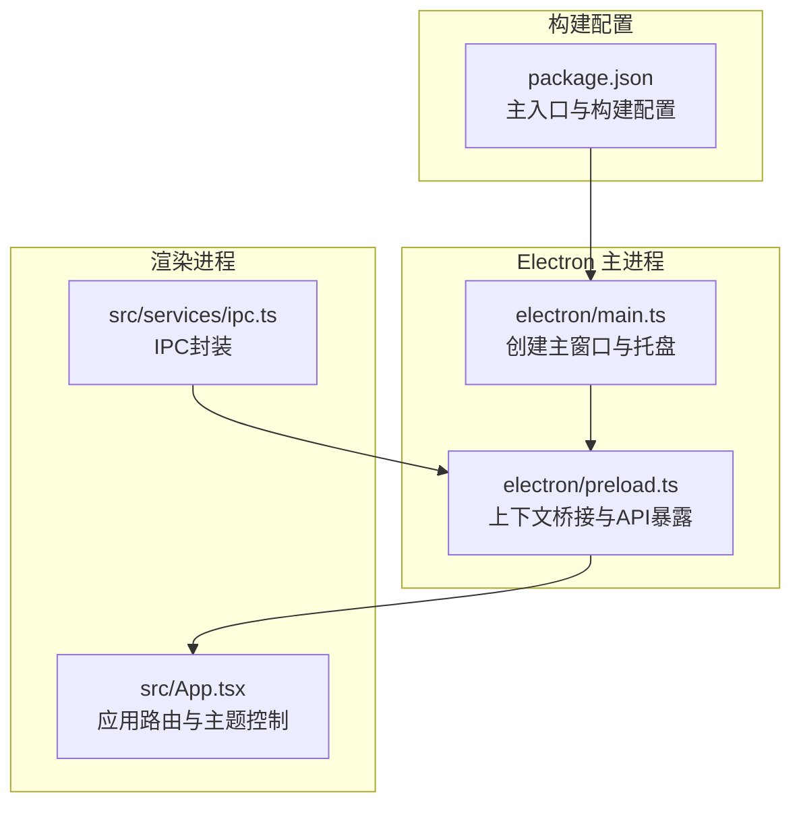
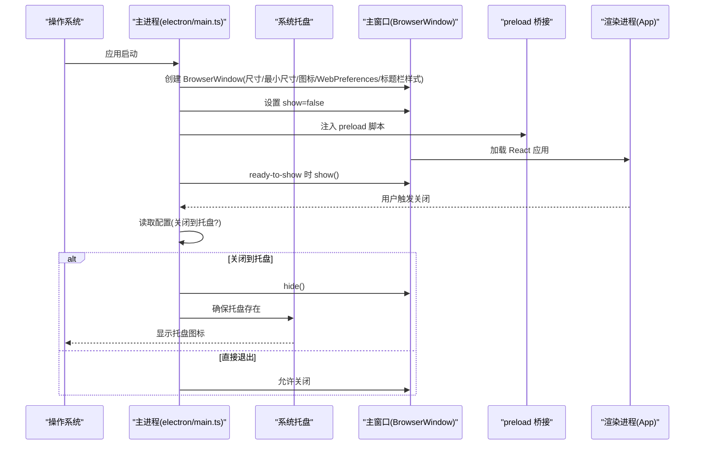
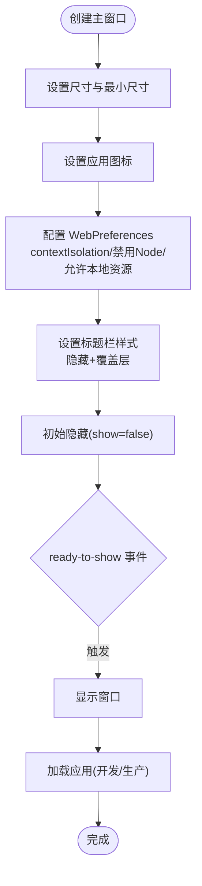
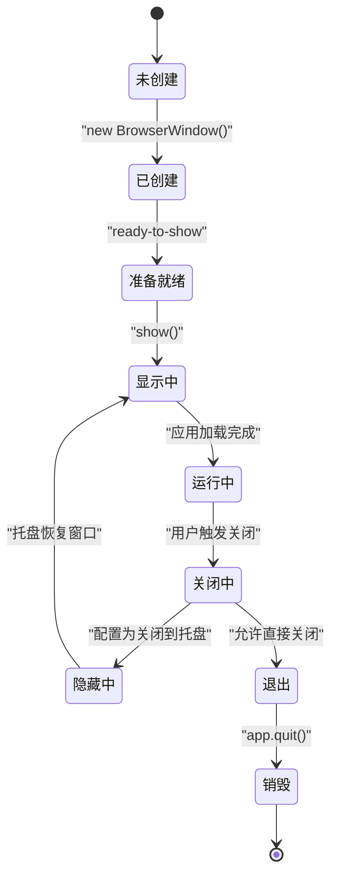
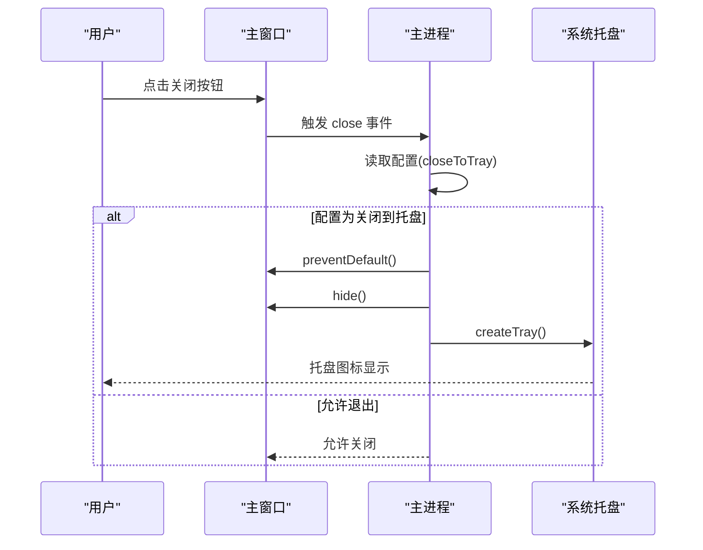
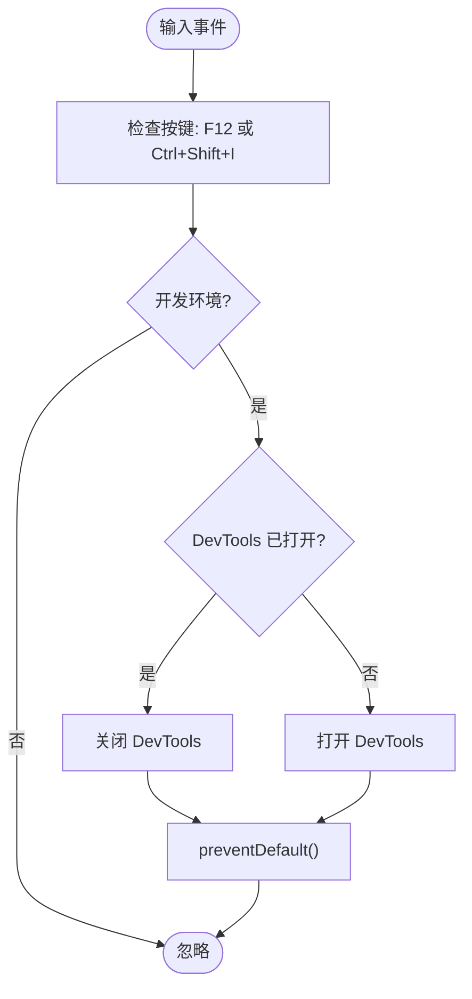
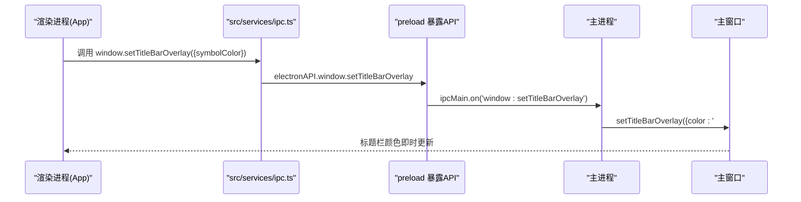
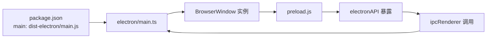

# 主窗口管理

<cite>
**本文档引用的文件**
- [electron/main.ts](file://electron/main.ts)
- [electron/preload.ts](file://electron/preload.ts)
- [src/App.tsx](file://src/App.tsx)
- [src/services/ipc.ts](file://src/services/ipc.ts)
- [package.json](file://package.json)
</cite>

## 目录
1. [简介](#简介)
2. [项目结构](#项目结构)
3. [核心组件](#核心组件)
4. [架构总览](#架构总览)
5. [详细组件分析](#详细组件分析)
6. [依赖关系分析](#依赖关系分析)
7. [性能考虑](#性能考虑)
8. [故障排除指南](#故障排除指南)
9. [结论](#结论)

## 简介
本文件面向 CipherTalk 的主窗口管理系统，系统性阐述主窗口的创建、配置与生命周期管理，涵盖窗口尺寸与最小尺寸、图标、WebPreferences、标题栏样式等配置项，以及关闭行为（关闭到托盘）、开发者工具快捷键（F12）等特性。同时说明主窗口与其他独立窗口的关系与通信机制，并提供最佳实践建议。

## 项目结构
主窗口管理位于 Electron 主进程中，通过 BrowserWindow 实例承载 React 应用。preload 脚本暴露受控的 API 给渲染进程，实现安全的 IPC 通信。应用入口在 package.json 中指定，构建产物输出到 dist 与 dist-electron 目录。

**图表来源**
- [electron/main.ts](file://electron/main.ts)
- [electron/preload.ts](file://electron/preload.ts)
- [src/App.tsx](file://src/App.tsx)
- [src/services/ipc.ts](file://src/services/ipc.ts)
- [package.json](file://package.json)

**章节来源**
- [package.json](file://package.json)
- [electron/main.ts](file://electron/main.ts)
- [electron/preload.ts](file://electron/preload.ts)
- [src/App.tsx](file://src/App.tsx)
- [src/services/ipc.ts](file://src/services/ipc.ts)

## 核心组件
- 主窗口创建与配置：在主进程中通过 BrowserWindow 创建主窗口，设置固定尺寸、最小尺寸、图标、WebPreferences、标题栏样式与初始隐藏策略。
- 生命周期管理：监听 ready-to-show、close、closed 等事件，实现窗口显示、关闭到托盘、销毁清理。
- 关闭行为与托盘：根据配置决定关闭时隐藏还是退出，支持系统托盘双击与菜单恢复窗口。
- 开发者工具快捷键：开发环境下通过 before-input-event 捕获 F12 或 Ctrl+Shift+I 打开/关闭 DevTools。
- 渲染进程通信：通过 preload 暴露的 electronAPI 与主进程交互，实现窗口控制、配置读写、服务调用等。

**章节来源**
- [electron/main.ts](file://electron/main.ts)
- [electron/preload.ts](file://electron/preload.ts)
- [src/App.tsx](file://src/App.tsx)
- [src/services/ipc.ts](file://src/services/ipc.ts)

## 架构总览
主窗口采用“主进程 BrowserWindow + preload 桥接 + 渲染进程 React 应用”的经典架构。主进程负责窗口生命周期与系统集成（托盘、快捷键、自动更新），渲染进程负责 UI 逻辑与用户交互。

**图表来源**
- [electron/main.ts](file://electron/main.ts)
- [electron/preload.ts](file://electron/preload.ts)
- [src/App.tsx](file://src/App.tsx)

## 详细组件分析

### 主窗口创建与配置
- 尺寸与最小尺寸：主窗口尺寸为 1400x900，最小尺寸为 1000x700，确保内容可读性与可用性。
- 图标：根据配置动态选择图标路径，区分开发与生产环境。
- WebPreferences：启用 contextIsolation、禁用 Node 集成、允许加载本地资源，webSecurity 适配本地文件加载。
- 标题栏样式：使用隐藏标题栏与覆盖层（titleBarOverlay），统一深浅主题下的符号颜色与高度。
- 初始显示策略：创建时 show=false，在 ready-to-show 事件后显示，避免白屏。

**图表来源**
- [electron/main.ts](file://electron/main.ts)

**章节来源**
- [electron/main.ts](file://electron/main.ts)

### 生命周期管理
- 创建：初始化服务、记录日志、设置 GPU 组件目录等。
- 显示：ready-to-show 时显示，避免首屏闪烁。
- 关闭：捕获 close 事件，根据配置决定隐藏到托盘或允许退出。
- 销毁：closed 事件清理引用，释放资源。

**图表来源**
- [electron/main.ts](file://electron/main.ts)

**章节来源**
- [electron/main.ts](file://electron/main.ts)

### 关闭行为与托盘集成
- 关闭到托盘：当配置为 true（默认）时，阻止默认关闭，调用 hide() 并确保托盘存在。
- 托盘菜单：提供“显示主窗口”和“退出”，双击托盘图标也可恢复窗口。
- 退出流程：设置 app.isQuitting=true，确保托盘退出菜单可正常退出。

**图表来源**
- [electron/main.ts](file://electron/main.ts)

**章节来源**
- [electron/main.ts](file://electron/main.ts)

### 开发者工具快捷键
- 开发环境：监听 before-input-event，捕获 F12 或 Ctrl+Shift+I，切换 DevTools 开关。
- 生产环境：不绑定快捷键，避免误触。

**图表来源**
- [electron/main.ts](file://electron/main.ts)

**章节来源**
- [electron/main.ts](file://electron/main.ts)

### 渲染进程通信与主题联动
- preload 暴露 electronAPI，渲染进程通过 src/services/ipc.ts 封装调用。
- 主题切换：渲染进程在应用挂载时设置 data-theme 与 data-mode，并通过 electronAPI.window.setTitleBarOverlay 动态更新标题栏覆盖层颜色。
- 独立窗口：主窗口与独立窗口共享主题参数，通过查询字符串传递主题与模式。

**图表来源**
- [src/App.tsx](file://src/App.tsx)
- [src/services/ipc.ts](file://src/services/ipc.ts)
- [electron/preload.ts](file://electron/preload.ts)
- [electron/main.ts](file://electron/main.ts)

**章节来源**
- [src/App.tsx](file://src/App.tsx)
- [src/services/ipc.ts](file://src/services/ipc.ts)
- [electron/preload.ts](file://electron/preload.ts)
- [electron/main.ts](file://electron/main.ts)

## 依赖关系分析
- 主入口：package.json 指定 main 字段为 dist-electron/main.js，Electron 启动时加载 electron/main.ts。
- 预加载：BrowserWindow 的 webPreferences.preload 指向 dist-electron/preload.js，负责暴露 API。
- 窗口间通信：主进程通过 ipcMain.handle/on 与渲染进程通信；渲染进程通过 electronAPI 调用。

**图表来源**
- [package.json](file://package.json)
- [electron/main.ts](file://electron/main.ts)
- [electron/preload.ts](file://electron/preload.ts)

**章节来源**
- [package.json](file://package.json)
- [electron/main.ts](file://electron/main.ts)
- [electron/preload.ts](file://electron/preload.ts)

## 性能考虑
- 首屏优化：创建时 show=false，ready-to-show 再显示，减少白屏时间。
- 资源加载：开发环境使用 Vite 服务器，生产环境加载本地打包文件，降低首包体积。
- 标题栏覆盖层：统一颜色与高度，减少自绘成本，提升视觉一致性。
- 托盘复用：避免重复创建，确保图标与菜单状态一致。

## 故障排除指南
- 窗口无法显示：检查 ready-to-show 是否触发，确认 show=false 后的显示逻辑。
- 关闭无效：确认 app.isQuitting 标志与配置项 closeToTray 的影响。
- DevTools 不响应：确认开发环境判断与 before-input-event 监听是否生效。
- 主题颜色不同步：检查 electronAPI.window.setTitleBarOverlay 调用与 data-mode 切换逻辑。

**章节来源**
- [electron/main.ts](file://electron/main.ts)
- [electron/preload.ts](file://electron/preload.ts)
- [src/App.tsx](file://src/App.tsx)

## 结论
CipherTalk 的主窗口管理系统通过严格的配置与生命周期管理，实现了稳定的用户体验。隐藏标题栏与覆盖层设计提升了视觉一致性，关闭到托盘与快捷键增强了易用性。preload 桥接与 IPC 封装保障了安全与可维护性。建议在后续迭代中持续关注窗口尺寸适配、主题切换性能与跨平台兼容性。