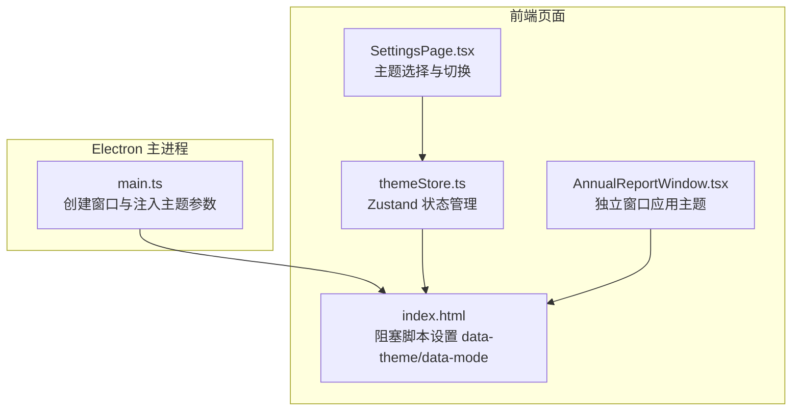
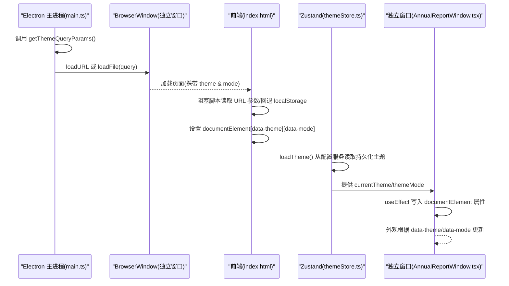
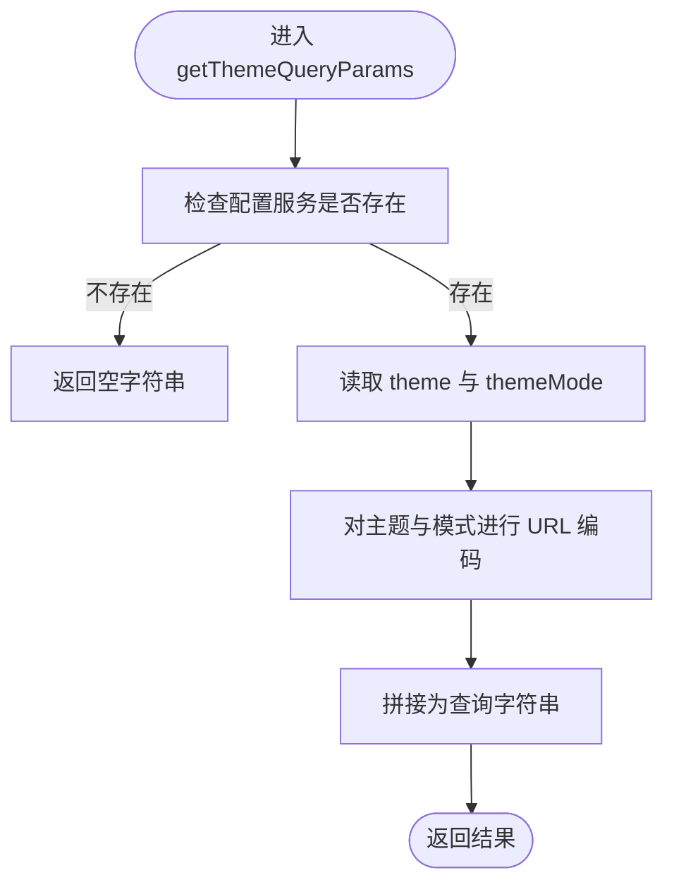
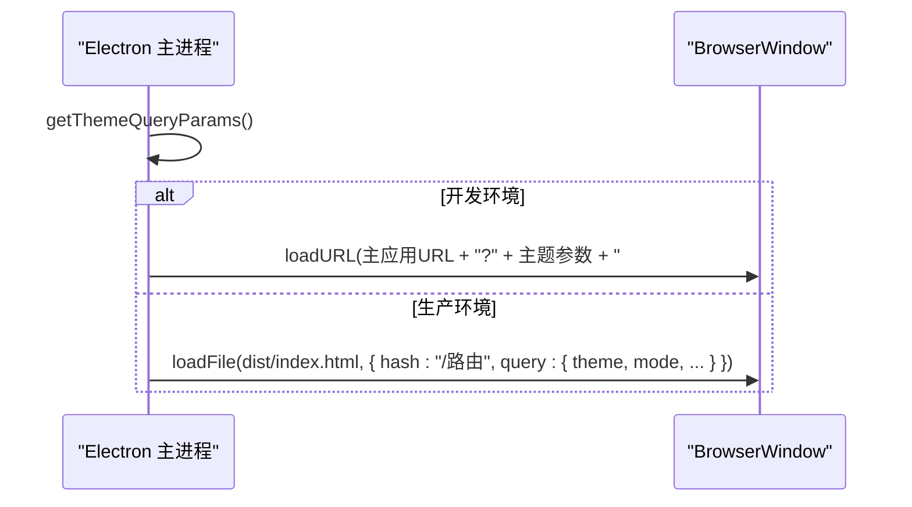
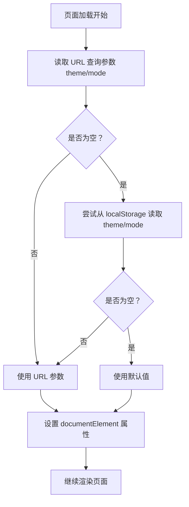
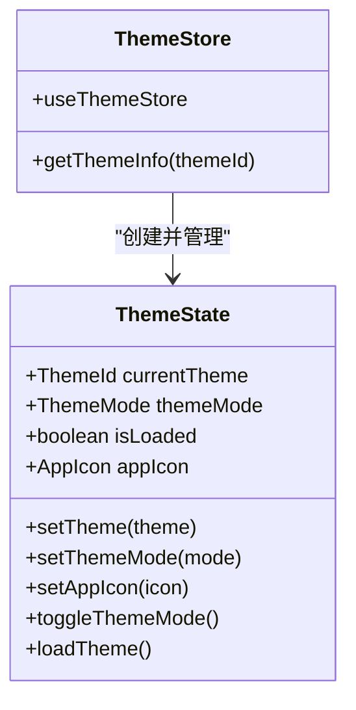
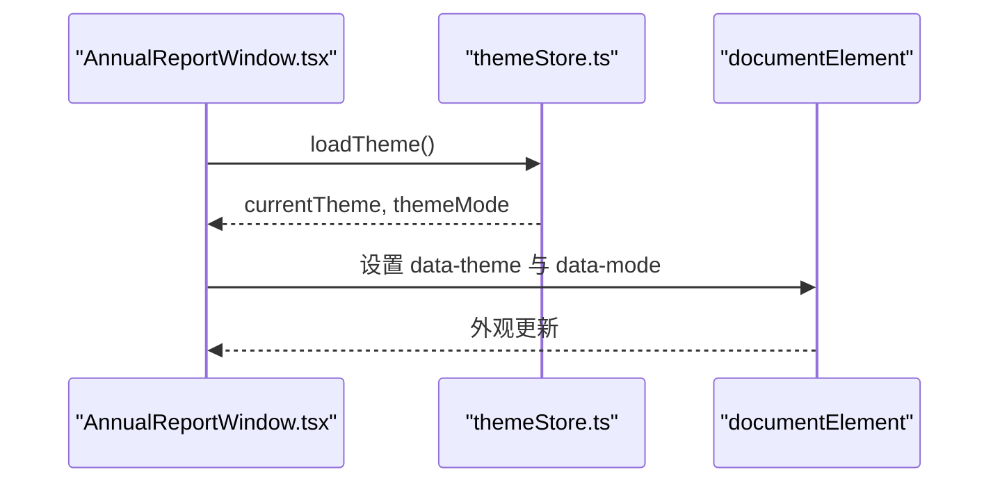
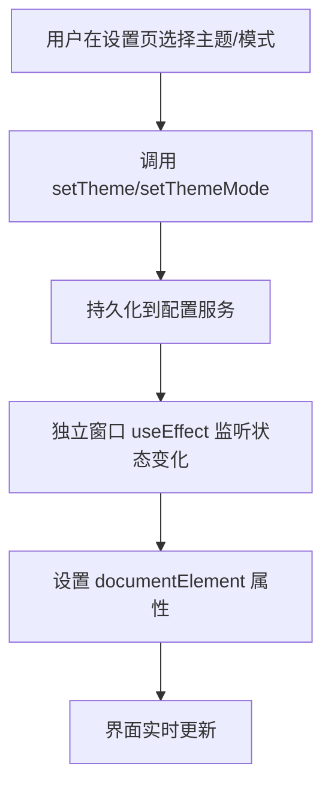
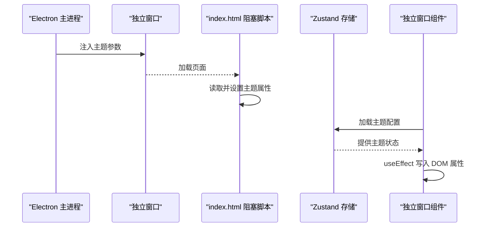
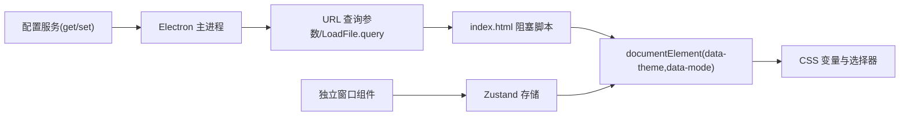

# 主题集成管理

<cite>
**本文档引用的文件**
- [electron/main.ts](file://electron/main.ts)
- [index.html](file://index.html)
- [src/stores/themeStore.ts](file://src/stores/themeStore.ts)
- [src/pages/AnnualReportWindow.tsx](file://src/pages/AnnualReportWindow.tsx)
- [src/pages/SettingsPage.tsx](file://src/pages/SettingsPage.tsx)
- [src/styles/chat-patterns.scss](file://src/styles/chat-patterns.scss)
- [electron/services/htmlExportGenerator.ts](file://electron/services/htmlExportGenerator.ts)
</cite>

## 目录
1. [简介](#简介)
2. [项目结构](#项目结构)
3. [核心组件](#核心组件)
4. [架构总览](#架构总览)
5. [详细组件分析](#详细组件分析)
6. [依赖关系分析](#依赖关系分析)
7. [性能考虑](#性能考虑)
8. [故障排除指南](#故障排除指南)
9. [结论](#结论)
10. [附录](#附录)

## 简介
本文件面向 CipherTalk 的窗口主题集成系统，重点解析主题参数传递机制与实现细节，围绕以下目标展开：
- 深入解释主题参数传递函数 getThemeQueryParams 的实现与使用
- 明确主题参数构成：theme（主题名称）与 mode（明暗模式）
- 详述主题参数在各窗口中的传递方式：URL 查询参数与 loadFile 的 query 参数
- 阐述主题切换对窗口外观的影响及实时更新机制
- 描述主题参数的获取与应用流程，并提供最佳实践建议

## 项目结构
主题系统横跨 Electron 主进程与前端 React 页面两层：
- Electron 主进程负责创建独立窗口并向其注入主题参数
- 前端通过阻塞脚本在页面渲染前读取主题参数，避免“闪烁”
- Zustand 状态管理负责主题状态的持久化与变更传播
- 各独立窗口在挂载时再次应用主题到根元素属性，确保一致性

**图表来源**
- [electron/main.ts:117-123](file://electron/main.ts#L117-L123)
- [index.html:7-30](file://index.html#L7-L30)
- [src/stores/themeStore.ts:79-140](file://src/stores/themeStore.ts#L79-L140)
- [src/pages/AnnualReportWindow.tsx:256-267](file://src/pages/AnnualReportWindow.tsx#L256-L267)
- [src/pages/SettingsPage.tsx:923-949](file://src/pages/SettingsPage.tsx#L923-L949)

**章节来源**
- [electron/main.ts:117-123](file://electron/main.ts#L117-L123)
- [index.html:7-30](file://index.html#L7-L30)
- [src/stores/themeStore.ts:79-140](file://src/stores/themeStore.ts#L79-L140)
- [src/pages/AnnualReportWindow.tsx:256-267](file://src/pages/AnnualReportWindow.tsx#L256-L267)
- [src/pages/SettingsPage.tsx:923-949](file://src/pages/SettingsPage.tsx#L923-L949)

## 核心组件
- getThemeQueryParams：从配置服务读取当前主题与模式，返回 URL 安全的查询字符串
- 阻塞脚本：在 index.html 中优先从 URL 查询参数读取主题，其次回退到 localStorage，最后设置 documentElement 的 data-theme 与 data-mode 属性
- Zustand 主题存储：维护 currentTheme、themeMode、isLoaded 等状态，并提供 setTheme、setThemeMode、loadTheme 等方法
- 独立窗口应用：在独立窗口组件中，useEffect 将主题状态写入 documentElement 属性，保证窗口外观一致
- 主题选择界面：设置页提供明暗模式切换与主题卡片选择，触发状态更新并持久化

**章节来源**
- [electron/main.ts:117-123](file://electron/main.ts#L117-L123)
- [index.html:7-30](file://index.html#L7-L30)
- [src/stores/themeStore.ts:79-140](file://src/stores/themeStore.ts#L79-L140)
- [src/pages/AnnualReportWindow.tsx:256-267](file://src/pages/AnnualReportWindow.tsx#L256-L267)
- [src/pages/SettingsPage.tsx:923-949](file://src/pages/SettingsPage.tsx#L923-L949)

## 架构总览
主题参数在不同窗口中的传递路径如下：

**图表来源**
- [electron/main.ts:326-348](file://electron/main.ts#L326-L348)
- [index.html:7-30](file://index.html#L7-L30)
- [src/stores/themeStore.ts:118-139](file://src/stores/themeStore.ts#L118-L139)
- [src/pages/AnnualReportWindow.tsx:256-267](file://src/pages/AnnualReportWindow.tsx#L256-L267)

## 详细组件分析

### getThemeQueryParams 实现与使用
- 功能：从配置服务读取主题与模式，进行 URL 编码并拼接为查询字符串
- 使用位置：多处独立窗口创建逻辑中调用该函数，确保子窗口加载时即具备主题参数
- 参数来源：配置服务键 theme 与 themeMode；若未设置则采用默认值
- 返回格式：形如 "theme=xxx&mode=xxx"，可直接附加到 URL 或作为 loadFile 的 query 参数

**图表来源**
- [electron/main.ts:117-123](file://electron/main.ts#L117-L123)

**章节来源**
- [electron/main.ts:117-123](file://electron/main.ts#L117-L123)

### 主题参数传递方式
- URL 查询参数：开发环境通过 loadURL 拼接查询字符串；生产环境通过 loadFile 的 query 参数传递
- loadFile 的 query 参数：在生产环境中，直接以对象形式传入 theme 与 mode 键值
- 过滤参数叠加：部分窗口还会附加其他业务参数（如朋友圈过滤用户名），但主题参数保持在首位

**图表来源**
- [electron/main.ts:326-348](file://electron/main.ts#L326-L348)
- [electron/main.ts:418-422](file://electron/main.ts#L418-L422)
- [electron/main.ts:496-502](file://electron/main.ts#L496-L502)
- [electron/main.ts:523-531](file://electron/main.ts#L523-L531)
- [electron/main.ts:631-652](file://electron/main.ts#L631-L652)

**章节来源**
- [electron/main.ts:326-348](file://electron/main.ts#L326-L348)
- [electron/main.ts:418-422](file://electron/main.ts#L418-L422)
- [electron/main.ts:496-502](file://electron/main.ts#L496-L502)
- [electron/main.ts:523-531](file://electron/main.ts#L523-L531)
- [electron/main.ts:631-652](file://electron/main.ts#L631-L652)

### 阻塞脚本与防闪烁机制
- 在 index.html 中插入阻塞脚本，在 DOM 渲染前执行
- 优先从 URL 查询参数读取 theme 与 mode；若无，则回退到 localStorage
- 若仍无，则使用默认值（主题：云上舞白；模式：浅色）
- 最终将 data-theme 与 data-mode 设置到 document.documentElement 上

**图表来源**
- [index.html:7-30](file://index.html#L7-L30)

**章节来源**
- [index.html:7-30](file://index.html#L7-L30)

### Zustand 主题存储与状态持久化
- 状态字段：currentTheme、themeMode、isLoaded、appIcon
- 方法：
  - setTheme：更新当前主题并持久化到配置服务
  - setThemeMode：更新模式并持久化
  - loadTheme：从配置服务读取主题与模式，初始化应用图标
  - toggleThemeMode：在浅色/深色间切换
- 默认值：主题为“新年快乐”，模式为“浅色”

**图表来源**
- [src/stores/themeStore.ts:67-140](file://src/stores/themeStore.ts#L67-L140)

**章节来源**
- [src/stores/themeStore.ts:79-140](file://src/stores/themeStore.ts#L79-L140)

### 独立窗口的主题应用
- 独立窗口组件在挂载时调用 loadTheme 加载主题配置
- 通过 useEffect 将 currentTheme 与 themeMode 写入 document.documentElement 的 data-theme 与 data-mode 属性
- 保证独立窗口与主窗口外观一致，且不受主窗口主题切换影响

**图表来源**
- [src/pages/AnnualReportWindow.tsx:256-267](file://src/pages/AnnualReportWindow.tsx#L256-L267)
- [src/stores/themeStore.ts:118-139](file://src/stores/themeStore.ts#L118-L139)

**章节来源**
- [src/pages/AnnualReportWindow.tsx:256-267](file://src/pages/AnnualReportWindow.tsx#L256-L267)
- [src/stores/themeStore.ts:118-139](file://src/stores/themeStore.ts#L118-L139)

### 主题切换与实时更新机制
- 设置页提供明暗模式切换按钮与主题卡片选择
- 切换时调用 setThemeMode 与 setTheme，内部持久化到配置服务
- 独立窗口通过 useEffect 监听状态变化，重新设置 data-* 属性，实现实时更新
- 主窗口通过阻塞脚本与 CSS 变量配合，确保渲染前即处于正确主题

**图表来源**
- [src/pages/SettingsPage.tsx:923-949](file://src/pages/SettingsPage.tsx#L923-L949)
- [src/stores/themeStore.ts:85-101](file://src/stores/themeStore.ts#L85-L101)
- [src/pages/AnnualReportWindow.tsx:256-267](file://src/pages/AnnualReportWindow.tsx#L256-L267)

**章节来源**
- [src/pages/SettingsPage.tsx:923-949](file://src/pages/SettingsPage.tsx#L923-L949)
- [src/stores/themeStore.ts:85-101](file://src/stores/themeStore.ts#L85-L101)
- [src/pages/AnnualReportWindow.tsx:256-267](file://src/pages/AnnualReportWindow.tsx#L256-L267)

### 主题参数的获取与应用流程（端到端）
- Electron 主进程：调用 getThemeQueryParams，将主题参数注入到独立窗口加载请求
- 前端阻塞脚本：在页面渲染前读取主题参数，设置 documentElement 属性
- Zustand 存储：在组件挂载时加载持久化的主题配置
- 独立窗口：通过 useEffect 将状态写入 DOM 属性，确保外观一致

**图表来源**
- [electron/main.ts:117-123](file://electron/main.ts#L117-L123)
- [index.html:7-30](file://index.html#L7-L30)
- [src/stores/themeStore.ts:118-139](file://src/stores/themeStore.ts#L118-L139)
- [src/pages/AnnualReportWindow.tsx:256-267](file://src/pages/AnnualReportWindow.tsx#L256-L267)

**章节来源**
- [electron/main.ts:117-123](file://electron/main.ts#L117-L123)
- [index.html:7-30](file://index.html#L7-L30)
- [src/stores/themeStore.ts:118-139](file://src/stores/themeStore.ts#L118-L139)
- [src/pages/AnnualReportWindow.tsx:256-267](file://src/pages/AnnualReportWindow.tsx#L256-L267)

## 依赖关系分析
- Electron 主进程依赖配置服务读取主题与模式
- 前端依赖阻塞脚本在渲染前设置主题，避免闪烁
- 独立窗口依赖 Zustand 存储提供主题状态
- CSS 通过 data-theme 与 data-mode 属性驱动外观切换

**图表来源**
- [electron/main.ts:117-123](file://electron/main.ts#L117-L123)
- [index.html:7-30](file://index.html#L7-L30)
- [src/stores/themeStore.ts:118-139](file://src/stores/themeStore.ts#L118-L139)
- [src/pages/AnnualReportWindow.tsx:256-267](file://src/pages/AnnualReportWindow.tsx#L256-L267)

**章节来源**
- [electron/main.ts:117-123](file://electron/main.ts#L117-L123)
- [index.html:7-30](file://index.html#L7-L30)
- [src/stores/themeStore.ts:118-139](file://src/stores/themeStore.ts#L118-L139)
- [src/pages/AnnualReportWindow.tsx:256-267](file://src/pages/AnnualReportWindow.tsx#L256-L267)

## 性能考虑
- 防闪烁策略：阻塞脚本在渲染前设置主题，避免首屏闪烁
- 最小化重排：主题切换仅通过设置 data-* 属性与 CSS 变量，避免大规模 DOM 重建
- 独立窗口隔离：独立窗口拥有自己的主题状态，避免与主窗口频繁交互导致的性能问题
- 优化建议：
  - 在大量独立窗口场景下，尽量复用主题参数，减少重复计算
  - 对于复杂窗口，可在挂载完成后延迟应用主题，避免阻塞首屏渲染

## 故障排除指南
- 症状：独立窗口加载后主题异常或闪烁
  - 排查：确认 getThemeQueryParams 是否被调用；确认 URL 或 query 参数是否正确传递
  - 参考：独立窗口加载逻辑与参数拼接位置
- 症状：主题切换无效
  - 排查：确认 setTheme 与 setThemeMode 是否成功持久化；确认独立窗口 useEffect 是否监听到状态变化
  - 参考：Zustand 存储方法与独立窗口应用逻辑
- 症状：localStorage 与实际主题不一致
  - 排查：阻塞脚本优先读取 URL 参数，其次 localStorage；确认 URL 参数是否覆盖了 localStorage
  - 参考：阻塞脚本读取顺序与默认值设置

**章节来源**
- [electron/main.ts:326-348](file://electron/main.ts#L326-L348)
- [src/stores/themeStore.ts:85-101](file://src/stores/themeStore.ts#L85-L101)
- [src/pages/AnnualReportWindow.tsx:256-267](file://src/pages/AnnualReportWindow.tsx#L256-L267)
- [index.html:7-30](file://index.html#L7-L30)

## 结论
CipherTalk 的主题集成系统通过“主进程注入 + 前端阻塞脚本 + Zustand 状态管理 + 独立窗口应用”的组合，实现了稳定、一致且高性能的主题体验。getThemeQueryParams 作为关键桥梁，确保所有独立窗口在加载时即具备正确的主题参数，配合 data-theme 与 data-mode 的 CSS 驱动，达到无闪烁、可扩展的主题切换效果。

## 附录

### 主题参数定义与默认值
- 参数名：theme（主题名称）、mode（明暗模式）
- 默认值：theme = 云上舞白，mode = 浅色
- 支持的主题 ID：云上舞白、刚玉蓝、冰猕猴桃汁绿、辛辣红、明水鸭色、新年快乐、樱雾粉

**章节来源**
- [electron/main.ts:117-123](file://electron/main.ts#L117-L123)
- [src/stores/themeStore.ts:3-65](file://src/stores/themeStore.ts#L3-L65)

### CSS 变量与模式切换
- CSS 通过 data-mode 与 data-theme 属性驱动变量切换
- 示例：聊天背景图案在浅色与深色模式下使用不同的变量值
- HTML 导出：在导出 HTML 中同样遵循 data-theme 与 data-mode 的变量映射

**章节来源**
- [src/styles/chat-patterns.scss:11-18](file://src/styles/chat-patterns.scss#L11-L18)
- [electron/services/htmlExportGenerator.ts:129-186](file://electron/services/htmlExportGenerator.ts#L129-L186)