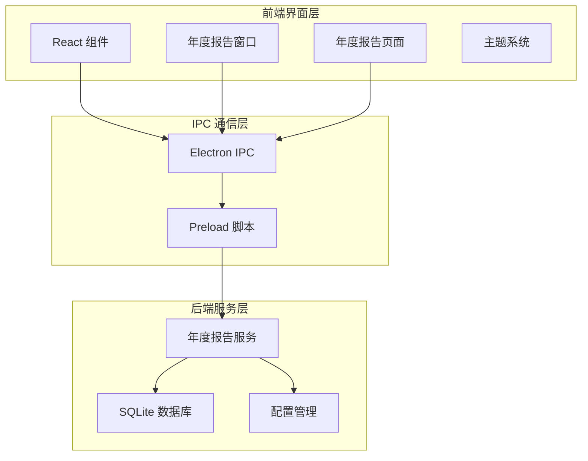
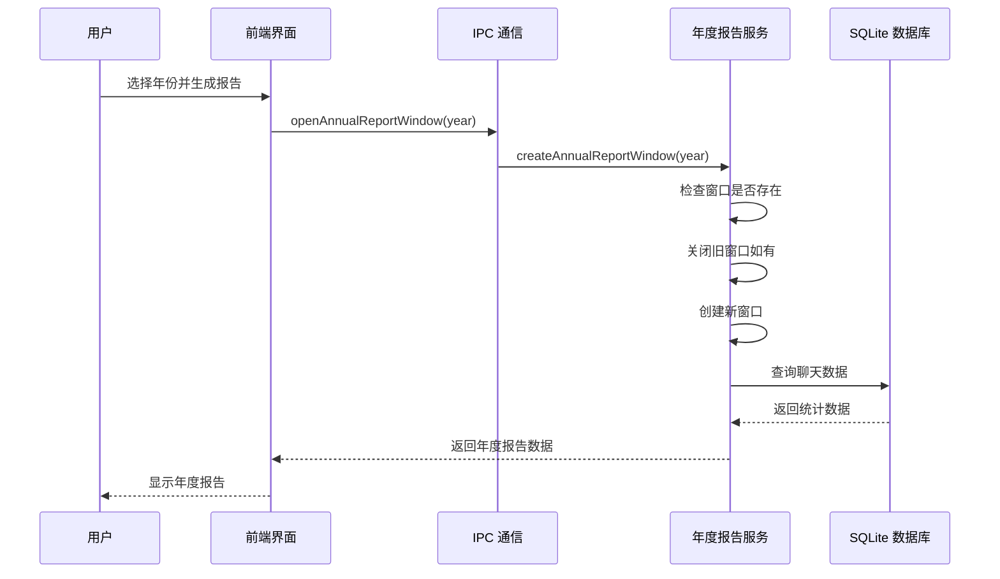
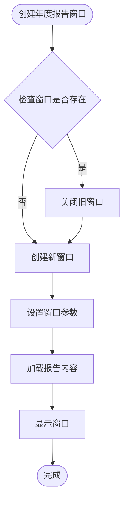
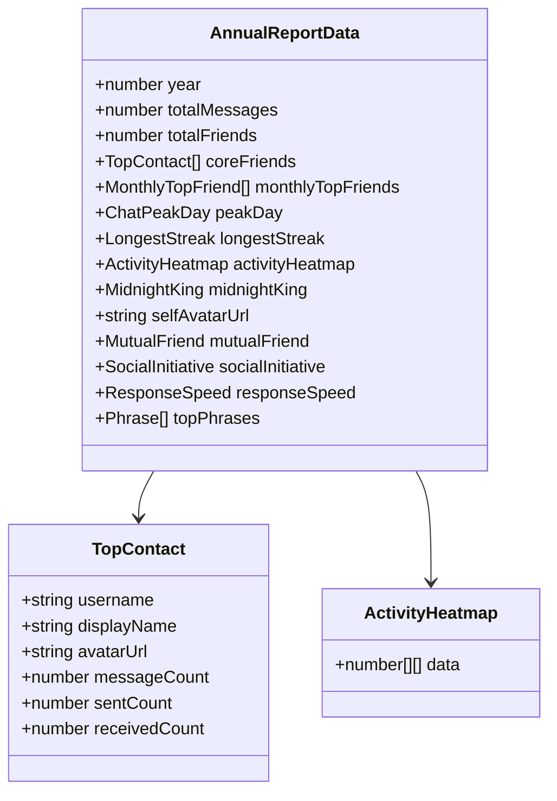
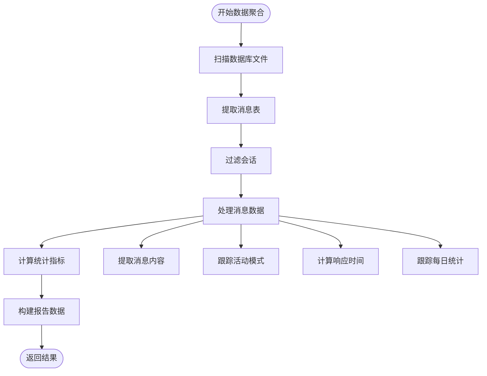
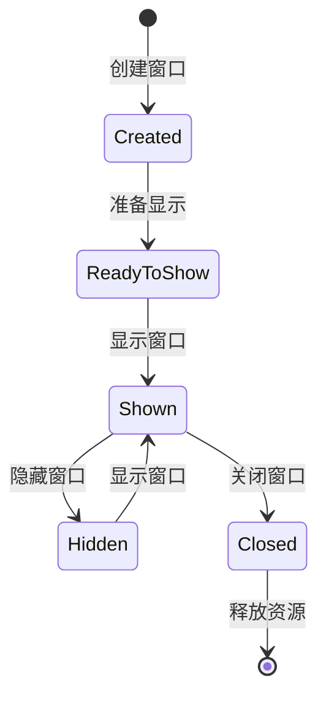
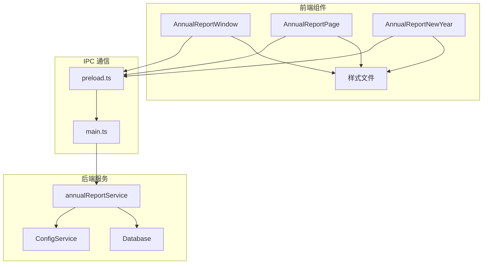
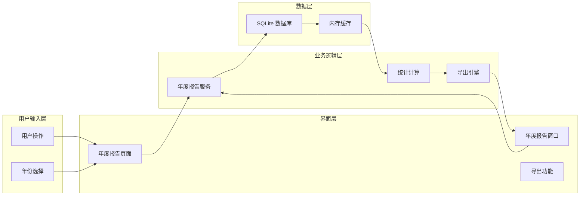

# 年度报告窗口管理

<cite>
**本文档引用的文件**
- [AnnualReportWindow.tsx](file://src/pages/AnnualReportWindow.tsx)
- [annualReportService.ts](file://electron/services/annualReportService.ts)
- [AnnualReportPage.tsx](file://src/pages/AnnualReportPage.tsx)
- [AnnualReportNewYear.tsx](file://src/pages/AnnualReportNewYear.tsx)
- [main.ts](file://electron/main.ts)
- [preload.ts](file://electron/preload.ts)
- [AnnualReportWindow.scss](file://src/pages/AnnualReportWindow.scss)
- [AnnualReportNewYear.scss](file://src/pages/AnnualReportNewYear.scss)
</cite>

## 目录
1. [简介](#简介)
2. [项目结构](#项目结构)
3. [核心组件](#核心组件)
4. [架构概览](#架构概览)
5. [详细组件分析](#详细组件分析)
6. [依赖关系分析](#依赖关系分析)
7. [性能考虑](#性能考虑)
8. [故障排除指南](#故障排除指南)
9. [结论](#结论)

## 简介

CipherTalk 的年度报告窗口管理系统是一个完整的跨平台桌面应用程序，专门用于生成和展示用户的微信聊天年度回顾报告。该系统采用 Electron + React 技术栈构建，提供了丰富的数据可视化功能和优雅的用户体验。

系统的核心功能包括：
- **年度报告生成**：基于用户微信聊天数据生成详细的年度回顾报告
- **窗口管理**：支持独立窗口模式，提供最佳的展示体验
- **主题切换**：支持传统绿色主题和新年红色主题两种设计风格
- **数据导出**：支持单模块导出和整页长图导出功能
- **窗口复用**：智能的窗口生命周期管理，避免重复创建

## 项目结构

系统采用典型的 Electron + React 架构，主要分为前端界面层和后端服务层：

**图表来源**
- [main.ts:590-659](file://electron/main.ts#L590-L659)
- [preload.ts:71-114](file://electron/preload.ts#L71-L114)

**章节来源**
- [main.ts:1-800](file://electron/main.ts#L1-L800)
- [preload.ts:1-454](file://electron/preload.ts#L1-L454)

## 核心组件

### 年度报告窗口组件

年度报告窗口是系统的核心组件，负责展示完整的年度回顾报告。该组件具有以下关键特性：

- **响应式设计**：支持 1200x800 的标准窗口尺寸
- **主题系统**：内置默认绿色主题和新年红色主题
- **数据可视化**：提供多种图表和统计信息展示
- **交互功能**：支持模块选择、主题切换、导出功能

### 年度报告服务

年度报告服务负责处理数据聚合和分析逻辑，包括：

- **数据聚合**：从 SQLite 数据库中提取和处理聊天数据
- **统计计算**：计算各种统计指标和排名
- **数据缓存**：优化数据库访问性能
- **错误处理**：完善的异常处理和错误恢复机制

### 窗口管理系统

系统实现了智能的窗口生命周期管理：

- **窗口复用**：如果目标窗口已存在，自动关闭旧窗口并创建新窗口
- **尺寸控制**：严格的窗口尺寸限制（1200x800 ± 最小尺寸 900x650）
- **主题同步**：确保窗口主题与主应用保持一致
- **资源管理**：及时释放不再使用的窗口资源

**章节来源**
- [AnnualReportWindow.tsx:243-1134](file://src/pages/AnnualReportWindow.tsx#L243-L1134)
- [annualReportService.ts:79-887](file://electron/services/annualReportService.ts#L79-L887)
- [main.ts:590-659](file://electron/main.ts#L590-L659)

## 架构概览

系统采用分层架构设计，确保各层职责清晰、耦合度低：

**图表来源**
- [main.ts:2480-2484](file://electron/main.ts#L2480-L2484)
- [preload.ts:83](file://electron/preload.ts#L83)

**章节来源**
- [main.ts:2480-2484](file://electron/main.ts#L2480-L2484)
- [preload.ts:71-114](file://electron/preload.ts#L71-L114)

## 详细组件分析

### 年度报告窗口组件分析

#### 窗口配置参数

年度报告窗口采用了精心设计的窗口配置参数：

| 参数 | 值 | 描述 |
|------|-----|------|
| 标准尺寸 | 1200x800 | 主要窗口尺寸，确保最佳展示效果 |
| 最小尺寸 | 900x650 | 窗口最小可调整尺寸，保证基本可用性 |
| 背景色 | #F9F8F6 | 默认浅色背景，支持主题切换 |
| 标题栏样式 | 隐藏式标题栏 | 提供更沉浸式的阅读体验 |

#### 窗口复用逻辑

系统实现了智能的窗口复用机制：

**图表来源**
- [main.ts:593-598](file://electron/main.ts#L593-L598)

#### 年度报告数据结构

年度报告数据采用结构化的数据模型：

**图表来源**
- [annualReportService.ts:35-77](file://electron/services/annualReportService.ts#L35-L77)
- [annualReportService.ts:8-22](file://electron/services/annualReportService.ts#L8-L22)

**章节来源**
- [AnnualReportWindow.tsx:45-76](file://src/pages/AnnualReportWindow.tsx#L45-L76)
- [annualReportService.ts:35-77](file://electron/services/annualReportService.ts#L35-L77)

### 年度报告服务分析

#### 数据聚合算法

年度报告服务实现了复杂的数据聚合算法：

**图表来源**
- [annualReportService.ts:429-592](file://electron/services/annualReportService.ts#L429-L592)

#### 数据库查询优化

服务实现了多项数据库查询优化策略：

- **表名哈希映射**：通过 MD5 哈希快速定位对应的消息表
- **索引利用**：充分利用 SQLite 的索引机制提高查询效率
- **缓存机制**：缓存常用的数据库连接和查询结果
- **增量处理**：支持增量更新，避免重复处理已完成的数据

**章节来源**
- [annualReportService.ts:218-229](file://electron/services/annualReportService.ts#L218-L229)
- [annualReportService.ts:429-592](file://electron/services/annualReportService.ts#L429-L592)

### 窗口管理服务分析

#### 窗口生命周期管理

系统实现了完整的窗口生命周期管理：

#### 主题同步机制

系统实现了实时的主题同步机制：

- **主题参数传递**：通过 URL 查询参数传递主题配置
- **动态样式更新**：运行时动态更新 CSS 变量
- **主题模式切换**：支持明暗主题模式的无缝切换

**章节来源**
- [main.ts:118-123](file://electron/main.ts#L118-L123)
- [AnnualReportWindow.tsx:256-267](file://src/pages/AnnualReportWindow.tsx#L256-L267)

## 依赖关系分析

### 组件依赖关系

**图表来源**
- [preload.ts:4-435](file://electron/preload.ts#L4-L435)
- [main.ts:18-28](file://electron/main.ts#L18-L28)

### 数据流分析

系统的数据流遵循清晰的单向数据流原则：

**图表来源**
- [AnnualReportPage.tsx:32-43](file://src/pages/AnnualReportPage.tsx#L32-L43)
- [annualReportService.ts:350-887](file://electron/services/annualReportService.ts#L350-L887)

**章节来源**
- [AnnualReportPage.tsx:1-114](file://src/pages/AnnualReportPage.tsx#L1-L114)
- [AnnualReportWindow.tsx:289-343](file://src/pages/AnnualReportWindow.tsx#L289-L343)

## 性能考虑

### 内存管理优化

系统实现了多项内存管理优化策略：

- **数据库连接池**：复用数据库连接，减少连接开销
- **数据缓存**：缓存常用的查询结果和计算结果
- **图像处理优化**：使用 Canvas 进行高效的图像处理
- **垃圾回收**：及时释放不再使用的对象和资源

### 网络和 I/O 优化

- **异步处理**：所有耗时操作都采用异步处理方式
- **进度反馈**：提供详细的进度反馈，改善用户体验
- **错误重试**：实现智能的错误重试机制
- **资源限制**：对内存使用和 CPU 占用进行限制

### 渲染性能优化

- **虚拟滚动**：对于大量数据的列表采用虚拟滚动技术
- **懒加载**：图片和组件采用懒加载策略
- **CSS 优化**：使用高效的 CSS 动画和过渡效果
- **防抖节流**：对频繁触发的操作进行防抖和节流处理

## 故障排除指南

### 常见问题及解决方案

#### 窗口无法正常显示

**问题症状**：年度报告窗口创建后无法显示

**可能原因**：
- 窗口尺寸超出屏幕范围
- 主题配置错误
- 数据库连接失败

**解决步骤**：
1. 检查窗口尺寸参数是否符合要求
2. 验证主题配置是否正确
3. 确认数据库连接状态

#### 报告生成失败

**问题症状**：年度报告生成过程中出现错误

**可能原因**：
- 数据库文件损坏
- 权限不足
- 内存不足

**解决步骤**：
1. 检查数据库文件完整性
2. 确认应用具有足够的权限
3. 关闭其他占用内存的应用程序

#### 导出功能异常

**问题症状**：报告导出过程中出现问题

**可能原因**：
- Canvas 导出失败
- 磁盘空间不足
- 文件权限问题

**解决步骤**：
1. 检查磁盘空间是否充足
2. 验证目标文件夹的写入权限
3. 尝试减小导出分辨率

**章节来源**
- [AnnualReportWindow.tsx:727-761](file://src/pages/AnnualReportWindow.tsx#L727-L761)
- [annualReportService.ts:350-371](file://electron/services/annualReportService.ts#L350-L371)

## 结论

CipherTalk 的年度报告窗口管理系统是一个设计精良、功能完备的跨平台应用程序。系统通过合理的架构设计和优化的实现策略，成功地解决了年度报告生成和展示的各种技术挑战。

### 主要优势

1. **优秀的用户体验**：提供流畅的交互体验和美观的视觉效果
2. **强大的数据处理能力**：能够高效处理大规模的聊天数据
3. **灵活的扩展性**：模块化的架构便于功能扩展和维护
4. **稳定的性能表现**：通过多项优化措施确保系统的稳定运行

### 技术亮点

- **智能窗口管理**：实现了高效的窗口复用和资源管理
- **丰富的数据可视化**：提供了多种图表和统计信息展示方式
- **完善的错误处理**：建立了全面的错误处理和恢复机制
- **主题系统设计**：支持多种主题风格，满足不同用户需求

该系统为用户提供了高质量的年度回顾体验，是现代桌面应用程序开发的优秀范例。