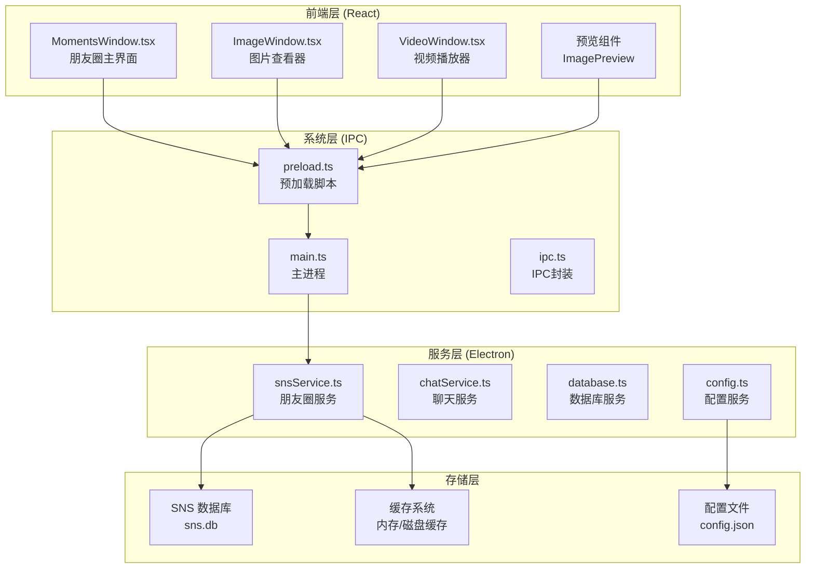
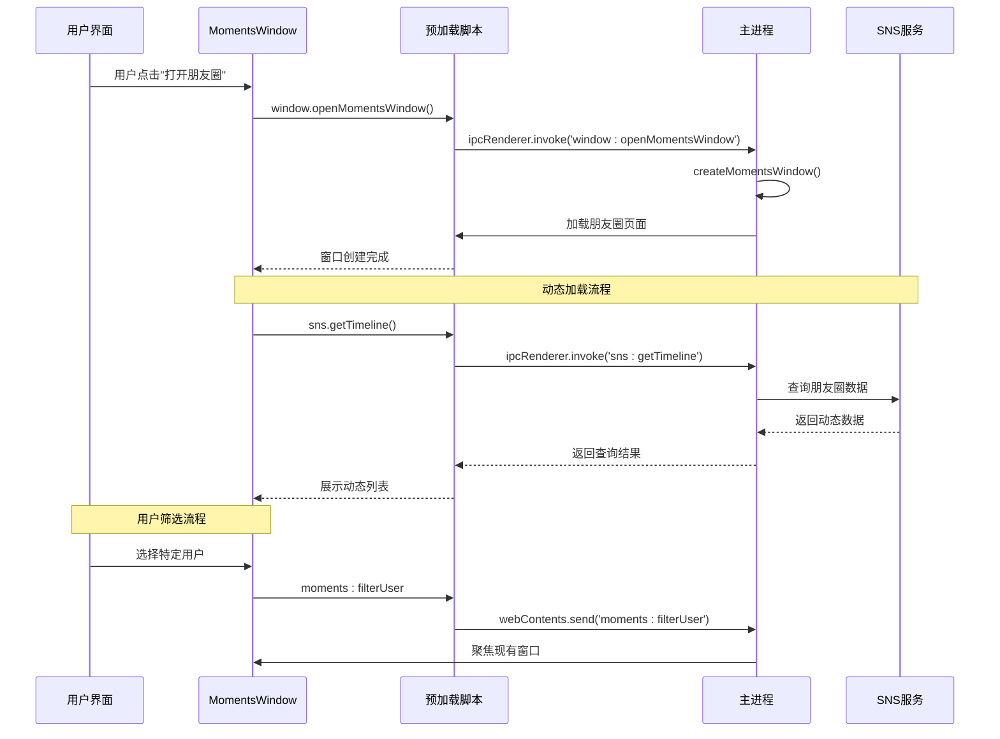
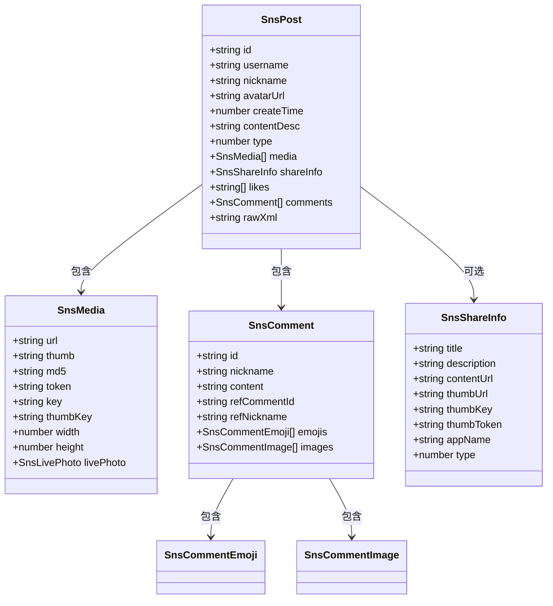
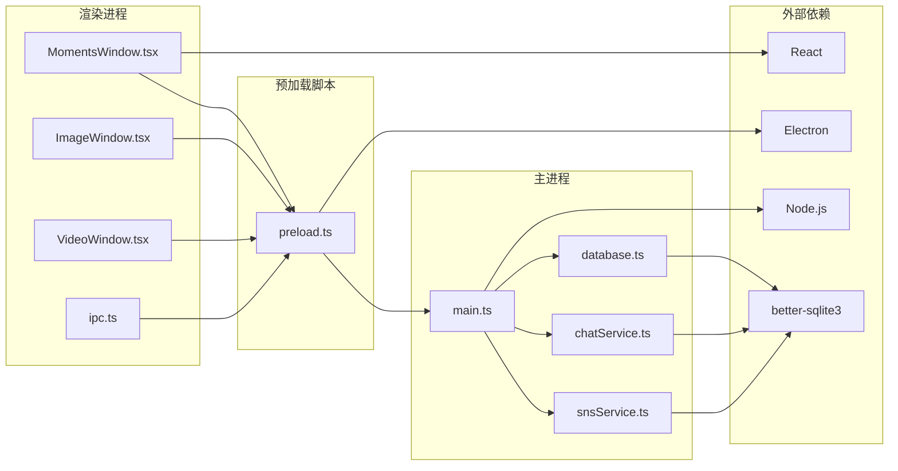

# 朋友圈窗口管理

<cite>
**本文档引用的文件**
- [MomentsWindow.tsx](file://src/pages/MomentsWindow.tsx)
- [snsService.ts](file://electron/services/snsService.ts)
- [main.ts](file://electron/main.ts)
- [preload.ts](file://electron/preload.ts)
- [ipc.ts](file://src/services/ipc.ts)
- [appStore.ts](file://src/stores/appStore.ts)
</cite>

## 目录
1. [简介](#简介)
2. [项目结构](#项目结构)
3. [核心组件](#核心组件)
4. [架构概览](#架构概览)
5. [详细组件分析](#详细组件分析)
6. [依赖关系分析](#依赖关系分析)
7. [性能考虑](#性能考虑)
8. [故障排除指南](#故障排除指南)
9. [结论](#结论)

## 简介

CipherTalk 的朋友圈窗口管理系统是一个基于 Electron 和 React 技术栈开发的现代化桌面应用程序，专门用于展示和管理微信朋友圈动态。该系统提供了完整的用户筛选功能、窗口复用机制和高效的窗口间通信能力。

系统的核心功能包括：
- **朋友圈动态展示**：支持图片、视频、链接分享等多种内容形式
- **智能用户筛选**：通过 filterUsername 参数精确过滤特定用户的动态
- **窗口复用与焦点管理**：避免重复创建窗口，提供流畅的用户体验
- **实时窗口通信**：通过 IPC 机制实现窗口间的高效数据交换
- **高性能媒体处理**：支持图片解密、视频播放和媒体缓存优化

## 项目结构

该项目采用前后端分离的架构设计，主要分为三个层次：



**图表来源**
- [MomentsWindow.tsx:1-50](file://src/pages/MomentsWindow.tsx#L1-L50)
- [main.ts:1-100](file://electron/main.ts#L1-L100)
- [preload.ts:1-50](file://electron/preload.ts#L1-L50)

**章节来源**
- [MomentsWindow.tsx:1-100](file://src/pages/MomentsWindow.tsx#L1-L100)
- [main.ts:1-200](file://electron/main.ts#L1-L200)
- [preload.ts:1-100](file://electron/preload.ts#L1-L100)

## 核心组件

### 朋友圈主窗口 (MomentsWindow)

朋友圈主窗口是整个系统的核心界面，负责展示和管理所有朋友圈动态。该组件实现了完整的用户交互功能，包括动态加载、用户筛选、媒体预览等。

**主要特性：**
- **响应式布局**：支持侧边栏展开/收起的动态布局
- **无限滚动**：自动加载更多动态，提升用户体验
- **多维度筛选**：支持关键词搜索、时间筛选、用户筛选
- **媒体预览**：集成图片查看器和视频播放器

### 窗口管理系统

系统实现了智能的窗口复用机制，避免重复创建窗口实例，提高资源利用率。

**窗口配置参数：**
- **尺寸**：1200x800 像素
- **最小尺寸**：900x600 像素
- **透明背景**：支持透明窗口效果
- **标题栏样式**：隐藏式标题栏设计

### IPC 通信机制

通过 Electron 的 IPC 机制实现渲染进程与主进程之间的高效通信，支持窗口间的数据传递和事件通知。

**章节来源**
- [MomentsWindow.tsx:746-800](file://src/pages/MomentsWindow.tsx#L746-L800)
- [main.ts:434-509](file://electron/main.ts#L434-L509)
- [preload.ts:71-114](file://electron/preload.ts#L71-L114)

## 架构概览

系统采用分层架构设计，确保各组件职责清晰、耦合度低。



**图表来源**
- [main.ts:2469-2472](file://electron/main.ts#L2469-L2472)
- [preload.ts:77-81](file://electron/preload.ts#L77-L81)
- [MomentsWindow.tsx:788-794](file://src/pages/MomentsWindow.tsx#L788-L794)

## 详细组件分析

### 朋友圈数据模型

系统定义了完整的朋友圈数据结构，支持多种内容类型的动态展示。



**图表来源**
- [snsService.ts:84-97](file://electron/services/snsService.ts#L84-L97)
- [snsService.ts:23-34](file://electron/services/snsService.ts#L23-L34)
- [snsService.ts:74-82](file://electron/services/snsService.ts#L74-L82)

### 用户筛选功能实现

系统提供了灵活的用户筛选机制，支持通过 URL 参数或 IPC 通信进行动态筛选。

```mermaid
flowchart TD
A[用户触发筛选] --> B{筛选来源}
B --> |URL参数| C[解析filterUsername]
B --> |IPC消息| D[接收moments:filterUser]
C --> E[设置selectedUsernames]
D --> E
E --> F[重置加载状态]
F --> G[调用loadPosts()]
G --> H[重新查询数据]
H --> I[更新界面显示]
J[用户手动筛选] --> K[toggleUserSelection]
K --> L[切换用户状态]
L --> M[清空时间筛选]
M --> N[更新筛选状态]
N --> O[触发数据重载]
```

**图表来源**
- [MomentsWindow.tsx:754-763](file://src/pages/MomentsWindow.tsx#L754-L763)
- [MomentsWindow.tsx:982-989](file://src/pages/MomentsWindow.tsx#L982-L989)
- [MomentsWindow.tsx:788-794](file://src/pages/MomentsWindow.tsx#L788-L794)

### 窗口复用与焦点管理

系统实现了智能的窗口复用机制，避免重复创建窗口实例，提供流畅的用户体验。

**窗口复用策略：**
1. **存在性检查**：创建前检查目标窗口是否已存在
2. **焦点管理**：如果窗口存在，直接聚焦而非重新创建
3. **筛选参数传递**：通过 IPC 机制向现有窗口发送筛选指令
4. **状态同步**：确保新窗口与现有窗口的状态一致

**章节来源**
- [main.ts:434-445](file://electron/main.ts#L434-L445)
- [preload.ts:77-81](file://electron/preload.ts#L77-L81)
- [MomentsWindow.tsx:788-794](file://src/pages/MomentsWindow.tsx#L788-L794)

### 媒体处理与缓存机制

系统实现了高效的媒体处理和缓存机制，支持图片解密、视频播放和媒体预览。

**媒体处理流程：**
1. **URL 解析**：从 XML 中提取媒体 URL 和密钥信息
2. **解密处理**：使用相应的密钥对媒体进行解密
3. **缓存管理**：将解密后的媒体路径缓存到内存中
4. **预览支持**：提供图片查看器和视频播放器功能

**章节来源**
- [snsService.ts:699-792](file://electron/services/snsService.ts#L699-L792)
- [MomentsWindow.tsx:126-128](file://src/pages/MomentsWindow.tsx#L126-L128)

## 依赖关系分析

系统各组件之间存在清晰的依赖关系，确保模块化设计和低耦合。



**图表来源**
- [main.ts:1-30](file://electron/main.ts#L1-L30)
- [preload.ts:1-10](file://electron/preload.ts#L1-L10)
- [ipc.ts:1-38](file://src/services/ipc.ts#L1-L38)

**章节来源**
- [main.ts:1-50](file://electron/main.ts#L1-L50)
- [preload.ts:1-50](file://electron/preload.ts#L1-L50)
- [ipc.ts:1-38](file://src/services/ipc.ts#L1-L38)

## 性能考虑

系统在设计时充分考虑了性能优化，采用了多种策略来提升用户体验。

### 内存管理
- **媒体缓存**：使用 Map 结构缓存解密后的媒体路径
- **组件卸载**：及时清理事件监听器和定时器
- **垃圾回收**：合理管理大对象的生命周期

### 网络优化
- **懒加载**：使用 IntersectionObserver 实现媒体的懒加载
- **并发控制**：限制同时进行的网络请求数量
- **缓存策略**：利用浏览器缓存减少重复请求

### 渲染性能
- **虚拟滚动**：对于大量数据采用虚拟滚动技术
- **防抖节流**：对频繁触发的操作进行防抖处理
- **增量更新**：只更新发生变化的部分 DOM

## 故障排除指南

### 常见问题及解决方案

**问题1：窗口无法正常创建**
- 检查 Electron 预加载脚本是否正确加载
- 验证主进程的窗口创建函数是否被调用
- 确认窗口参数配置是否正确

**问题2：朋友圈数据加载失败**
- 检查 SNS 数据库连接状态
- 验证用户筛选参数是否正确
- 确认网络连接和代理设置

**问题3：媒体解密失败**
- 检查密钥获取服务是否正常工作
- 验证媒体 URL 和 token 是否有效
- 确认文件权限和存储空间

**章节来源**
- [main.ts:434-509](file://electron/main.ts#L434-L509)
- [snsService.ts:393-446](file://electron/services/snsService.ts#L393-L446)
- [MomentsWindow.tsx:864-948](file://src/pages/MomentsWindow.tsx#L864-L948)

## 结论

CipherTalk 的朋友圈窗口管理系统展现了现代桌面应用开发的最佳实践。通过精心设计的架构和实现，系统不仅提供了丰富的功能特性，还在性能、可维护性和用户体验方面达到了很高的水准。

**主要优势：**
1. **模块化设计**：清晰的组件划分和职责分离
2. **高效通信**：基于 IPC 的快速窗口间通信
3. **智能缓存**：优化的媒体处理和缓存机制
4. **用户友好**：直观的界面设计和流畅的交互体验

**未来发展方向：**
- 进一步优化大数据量场景下的性能表现
- 增强离线数据同步能力
- 扩展更多社交平台的支持
- 提升安全性和隐私保护措施

该系统为类似的企业级桌面应用开发提供了优秀的参考模板，展示了如何在保证功能完整性的同时，实现高质量的用户体验和技术架构。