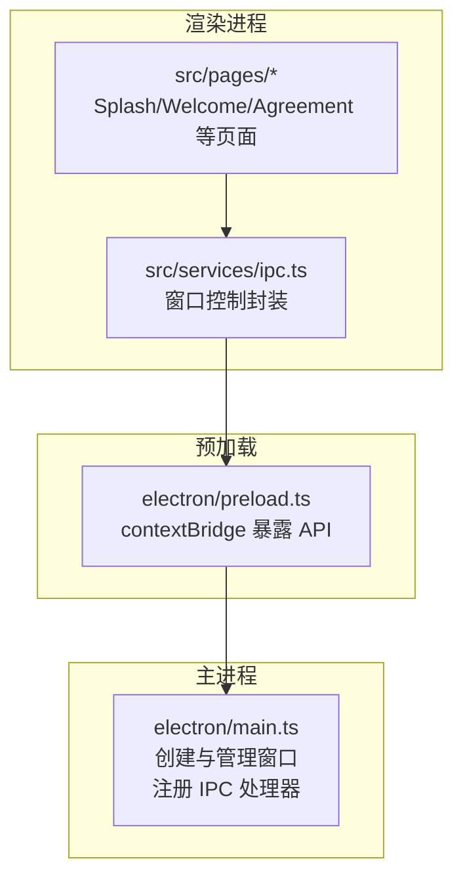
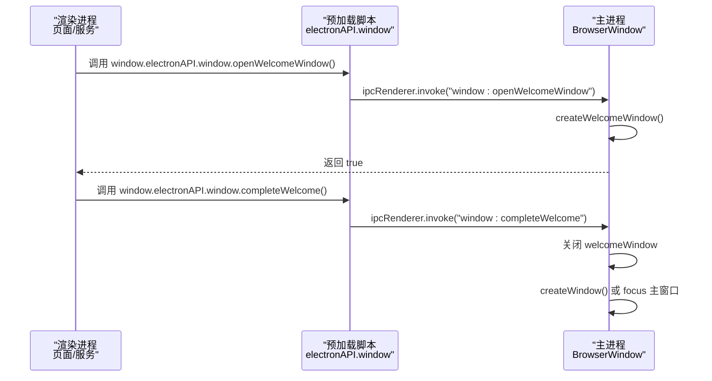
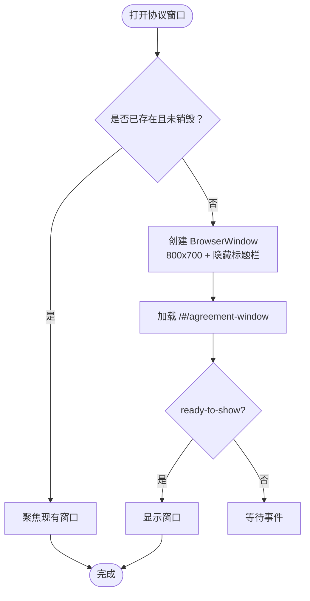
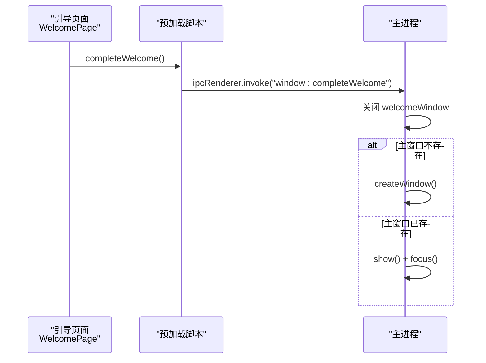

# 特殊窗口管理

<cite>
**本文档引用的文件**
- [electron/main.ts](file://electron/main.ts)
- [electron/preload.ts](file://electron/preload.ts)
- [src/pages/SplashPage.tsx](file://src/pages/SplashPage.tsx)
- [src/pages/SplashPage.scss](file://src/pages/SplashPage.scss)
- [src/pages/WelcomePage.tsx](file://src/pages/WelcomePage.tsx)
- [src/pages/WelcomePage.scss](file://src/pages/WelcomePage.scss)
- [src/pages/AgreementPage.tsx](file://src/pages/AgreementPage.tsx)
- [src/services/ipc.ts](file://src/services/ipc.ts)
- [src/services/config.ts](file://src/services/config.ts)
</cite>

## 目录
1. [简介](#简介)
2. [项目结构](#项目结构)
3. [核心组件](#核心组件)
4. [架构总览](#架构总览)
5. [详细组件分析](#详细组件分析)
6. [依赖关系分析](#依赖关系分析)
7. [性能考量](#性能考量)
8. [故障排除指南](#故障排除指南)
9. [结论](#结论)

## 简介
本文件系统性梳理 CipherTalk 的特殊窗口管理系统，重点覆盖以下窗口类型及其配置差异：
- 协议窗口（800x700）
- 购买窗口（1000x700）
- 引导窗口（1100x760，frame=false、transparent=true、backgroundColor='#00000000'）

文档将解释各窗口的用途、生命周期管理、窗口间通信机制与数据传递方式，并给出可视化流程图与最佳实践建议。

## 项目结构
围绕窗口管理的关键代码分布在主进程（Electron 主进程）、预加载脚本（Preload）与渲染进程（React 页面）三层：
- 主进程负责创建与管理 BrowserWindow 实例，注册 IPC 处理器，处理窗口生命周期事件。
- 预加载脚本通过 contextBridge 暴露受控 API 到渲染进程，统一窗口控制入口。
- 渲染进程通过封装的 windowControl 或 electronAPI.window 调用主进程接口，实现窗口打开、关闭、切换等操作。

图表来源
- [electron/main.ts](file://electron/main.ts)
- [electron/preload.ts](file://electron/preload.ts)
- [src/services/ipc.ts](file://src/services/ipc.ts)

章节来源
- [electron/main.ts](file://electron/main.ts)
- [electron/preload.ts](file://electron/preload.ts)
- [src/services/ipc.ts](file://src/services/ipc.ts)

## 核心组件
- 协议窗口（用户协议与隐私政策）
  - 尺寸：800x700
  - 标题栏样式：隐藏标题栏，使用 overlay
  - 背景色：深浅主题适配
  - 用途：展示并要求用户阅读与同意协议
- 购买窗口（激活码获取）
  - 尺寸：1000x700
  - 标题：获取激活码 - 密语
  - 背景色：白色
  - 用途：引导用户获取激活码
- 引导窗口（首次配置向导）
  - 尺寸：1100x760
  - 特殊配置：frame=false、transparent=true、backgroundColor='#00000000'、hasShadow=false
  - 用途：数据库目录、密钥、缓存路径等配置流程
- 启动屏窗口（Splash）
  - 尺寸：420x320
  - 特殊配置：frame=false、transparent=true、backgroundColor='#00000000'、alwaysOnTop、skipTaskbar
  - 用途：应用启动时的过渡动画与数据库连接提示

章节来源
- [electron/main.ts](file://electron/main.ts)
- [src/pages/AgreementPage.tsx](file://src/pages/AgreementPage.tsx)
- [src/pages/SplashPage.tsx](file://src/pages/SplashPage.tsx)
- [src/pages/SplashPage.scss](file://src/pages/SplashPage.scss)

## 架构总览
窗口管理采用“主进程集中创建 + 预加载桥接 + 渲染进程调用”的模式。主进程维护各窗口实例引用，提供 IPC 接口；预加载脚本将 IPC 调用封装为 window.electronAPI.window.* API；渲染进程通过封装的服务或直接调用 window.electronAPI.window.* 打开/关闭/控制窗口。

图表来源
- [electron/preload.ts](file://electron/preload.ts)
- [electron/main.ts](file://electron/main.ts)

章节来源
- [electron/preload.ts](file://electron/preload.ts)
- [electron/main.ts](file://electron/main.ts)

## 详细组件分析

### 协议窗口（800x700）
- 创建逻辑
  - 尺寸：800x700，最小尺寸 600x500
  - 标题栏：隐藏，overlay 颜色随主题
  - 背景色：深浅主题适配
  - 加载路径：#/agreement-window
- 生命周期
  - 若已存在则聚焦；否则创建并 ready-to-show 后显示
  - closed 事件清理引用
- 用途
  - 展示用户协议与隐私政策，作为使用前的必要确认

图表来源
- [electron/main.ts](file://electron/main.ts)

章节来源
- [electron/main.ts](file://electron/main.ts)
- [src/pages/AgreementPage.tsx](file://src/pages/AgreementPage.tsx)

### 购买窗口（1000x700）
- 创建逻辑
  - 尺寸：1000x700，最小尺寸 800x600
  - 标题：获取激活码 - 密语
  - 背景色：白色
  - 自动隐藏菜单栏
- 生命周期
  - 若已存在则聚焦；否则创建并 ready-to-show 后显示
  - closed 事件清理引用
- 用途
  - 引导用户获取激活码，完成产品使用授权

章节来源
- [electron/main.ts](file://electron/main.ts)

### 引导窗口（1100x760，frame=false、transparent=true）
- 创建逻辑
  - 尺寸：1100x760，最小尺寸 900x640
  - 特殊配置：frame=false、transparent=true、backgroundColor='#00000000'、hasShadow=false
  - webPreferences：contextIsolation、禁止 Node 集成、允许本地文件
  - show=false，ready-to-show 后再显示
  - 加载路径：#/welcome-window
- 生命周期
  - 若已存在则聚焦；否则创建并 ready-to-show 后显示
  - closed 事件清理引用
- 用途
  - 首次启动的配置向导，引导用户完成数据库目录、密钥、缓存路径等配置
- 与主窗口的协作
  - 配置完成后，渲染进程调用 window.electronAPI.window.completeWelcome()
  - 主进程关闭引导窗口并创建/显示主窗口

图表来源
- [src/pages/WelcomePage.tsx](file://src/pages/WelcomePage.tsx)
- [electron/preload.ts](file://electron/preload.ts)
- [electron/main.ts](file://electron/main.ts)

章节来源
- [electron/main.ts](file://electron/main.ts)
- [src/pages/WelcomePage.tsx](file://src/pages/WelcomePage.tsx)
- [src/pages/WelcomePage.scss](file://src/pages/WelcomePage.scss)

### 启动屏窗口（Splash，420x320）
- 创建逻辑
  - 尺寸：420x320
  - 特殊配置：frame=false、transparent=true、backgroundColor='#00000000'、alwaysOnTop、skipTaskbar、无阴影
  - 加载路径：#/splash
- 生命周期
  - 直接显示，ready-to-show 后等待渲染进程通知 splashReady
  - 渲染进程触发淡出动画后，主进程关闭窗口
- 与引导窗口的关系
  - 若配置不完整，启动时直接打开引导窗口而非主窗口
  - 若配置完整，显示启动屏并连接数据库

章节来源
- [electron/main.ts](file://electron/main.ts)
- [src/pages/SplashPage.tsx](file://src/pages/SplashPage.tsx)
- [src/pages/SplashPage.scss](file://src/pages/SplashPage.scss)

### 窗口间通信机制与数据传递
- 预加载桥接
  - 预加载脚本通过 contextBridge.exposeInMainWorld 暴露 window.electronAPI.window.*
  - 渲染进程通过 window.electronAPI.window.* 调用主进程接口
- IPC 调用链
  - 渲染进程：window.electronAPI.window.openWelcomeWindow()
  - 预加载：ipcRenderer.invoke('window:openWelcomeWindow')
  - 主进程：ipcMain.handle('window:openWelcomeWindow', ...) -> createWelcomeWindow()
- 事件广播
  - 主进程在某些场景下会向所有窗口广播事件（如数据更新、会话变化）
- 启动屏与引导窗口联动
  - 渲染进程在 SplashPage 中通过 window.electronAPI.window.splashReady 通知主进程
  - 引导页面在配置完成后通过 window.electronAPI.window.completeWelcome 切换到主窗口

章节来源
- [electron/preload.ts](file://electron/preload.ts)
- [electron/main.ts](file://electron/main.ts)
- [src/pages/SplashPage.tsx](file://src/pages/SplashPage.tsx)
- [src/pages/WelcomePage.tsx](file://src/pages/WelcomePage.tsx)

## 依赖关系分析
- 主进程依赖
  - BrowserWindow：创建与管理窗口实例
  - ipcMain：注册窗口相关 IPC 处理器
  - 配置服务：读取主题、图标、缓存路径等
- 预加载依赖
  - contextBridge：暴露 API 至渲染进程
  - ipcRenderer：与主进程通信
- 渲染进程依赖
  - 封装的服务：src/services/ipc.ts 提供统一的窗口控制接口
  - 页面组件：SplashPage、WelcomePage、AgreementPage 等

图表来源
- [electron/preload.ts](file://electron/preload.ts)
- [electron/main.ts](file://electron/main.ts)
- [src/services/ipc.ts](file://src/services/ipc.ts)

章节来源
- [electron/preload.ts](file://electron/preload.ts)
- [electron/main.ts](file://electron/main.ts)
- [src/services/ipc.ts](file://src/services/ipc.ts)

## 性能考量
- 窗口尺寸与最小尺寸
  - 各窗口均设置 minWidth/minHeight，避免过小影响可用性
- ready-to-show 与 show=false
  - 通过 show=false + ready-to-show 控制显示时机，减少白屏与闪烁
- 透明窗口与阴影
  - 透明窗口禁用阴影以提升渲染性能与视觉一致性
- 事件广播范围
  - 广播事件时遍历所有窗口，注意在窗口数量较多时的性能开销

## 故障排除指南
- 打不开引导窗口
  - 检查主进程是否已注册 'window:openWelcomeWindow' 处理器
  - 确认预加载脚本已暴露 window.electronAPI.window.openWelcomeWindow
  - 查看渲染进程调用链是否正确
- 引导完成后未显示主窗口
  - 确认渲染进程调用了 window.electronAPI.window.completeWelcome
  - 检查主进程 'window:completeWelcome' 是否正确处理并创建/显示主窗口
- 启动屏不消失
  - 确认渲染进程在 SplashPage 中调用了 window.electronAPI.window.splashReady
  - 检查主进程是否收到 splashReady 并触发淡出与关闭
- 窗口尺寸异常
  - 检查各窗口的 minWidth/minHeight 与 ready-to-show 逻辑
  - 确认透明窗口的 hasShadow=false 配置

章节来源
- [electron/main.ts](file://electron/main.ts)
- [electron/preload.ts](file://electron/preload.ts)
- [src/pages/SplashPage.tsx](file://src/pages/SplashPage.tsx)
- [src/pages/WelcomePage.tsx](file://src/pages/WelcomePage.tsx)

## 结论
CipherTalk 的特殊窗口管理通过清晰的三层架构实现了稳定的窗口生命周期控制与跨进程通信：
- 主进程集中管理窗口创建与生命周期
- 预加载脚本提供统一的 API 暴露与封装
- 渲染进程通过服务层调用窗口控制接口

针对协议窗口、购买窗口与引导窗口的差异化配置（尺寸、标题栏样式、透明度、背景色等）满足了不同场景下的用户体验需求。建议在扩展新窗口类型时遵循现有模式，统一通过预加载脚本暴露 API，并在主进程集中注册 IPC 处理器，确保一致的生命周期管理与通信机制。