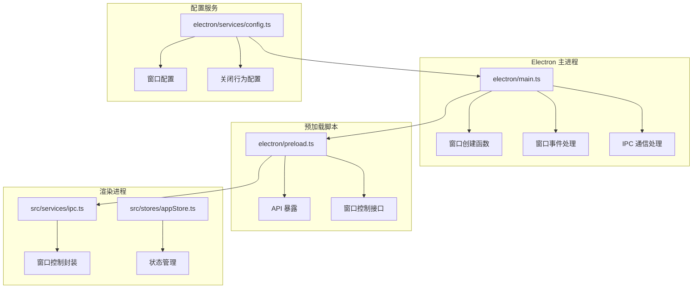
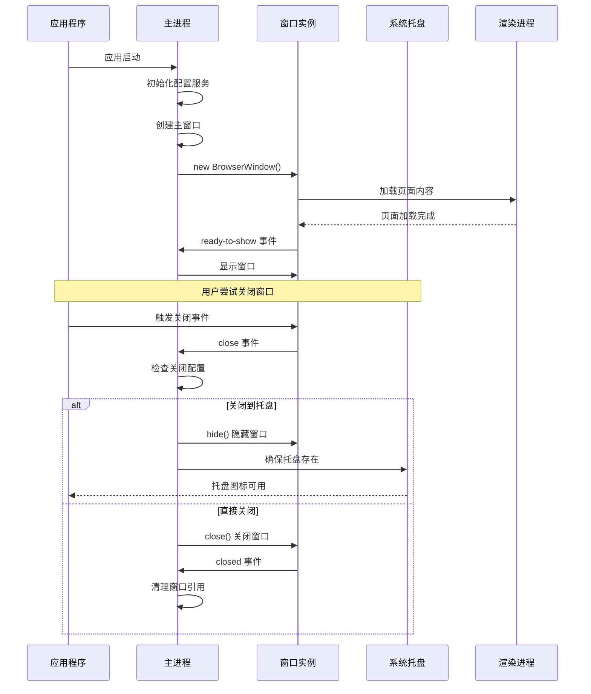
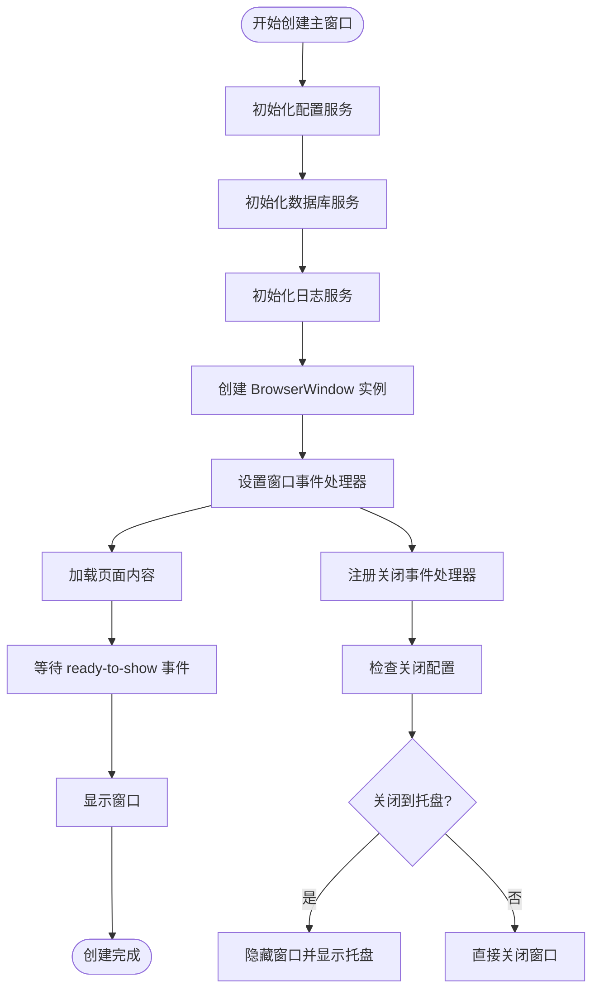
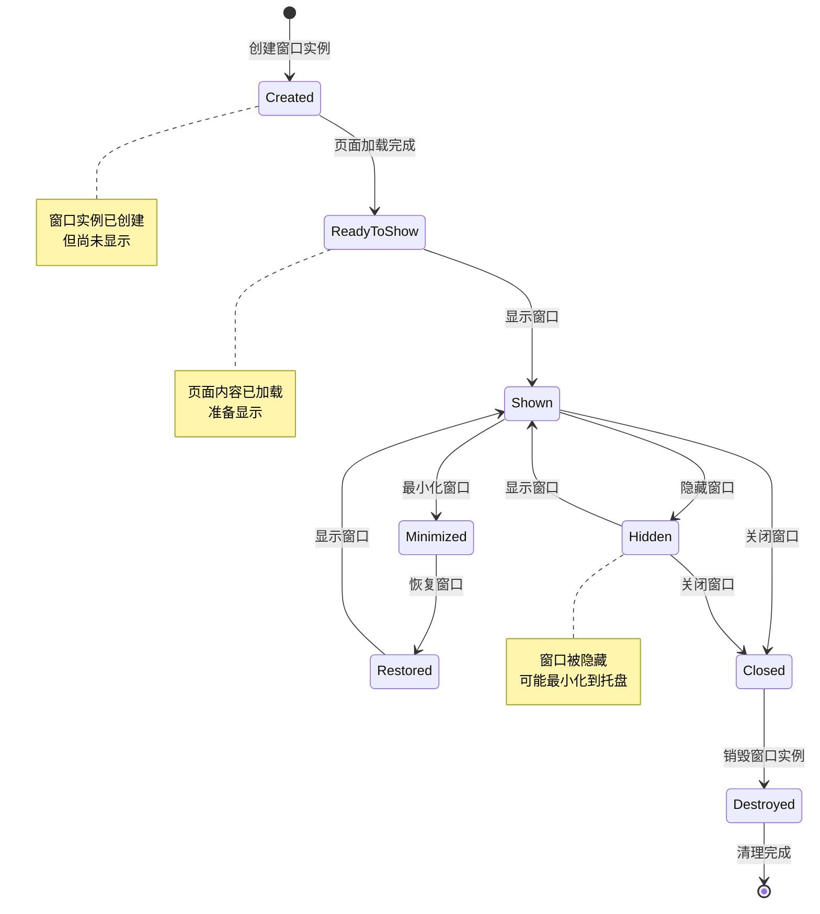
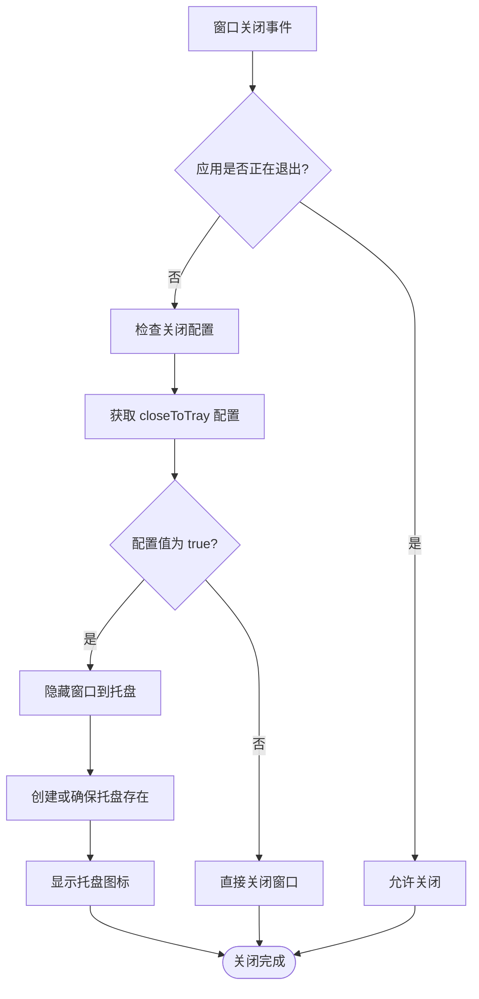
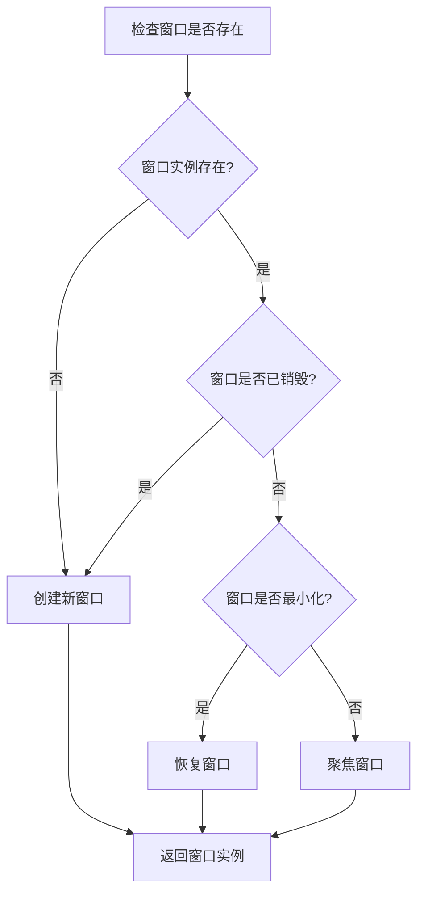
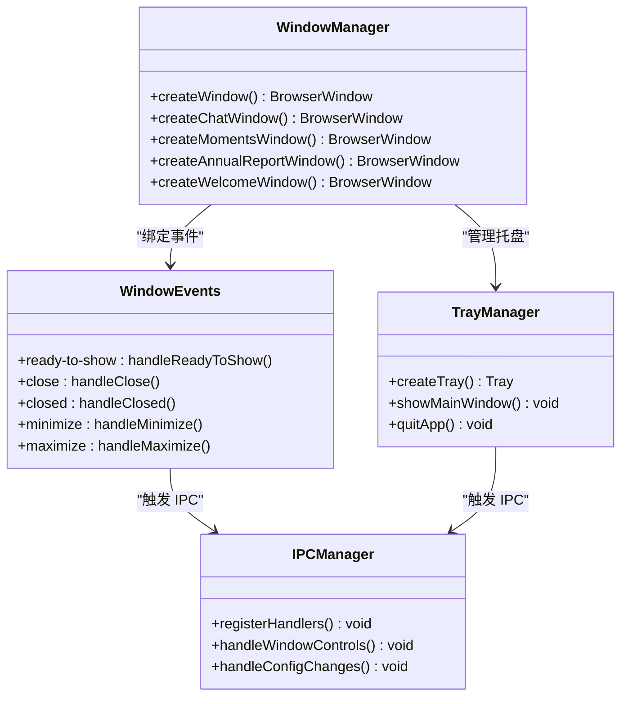
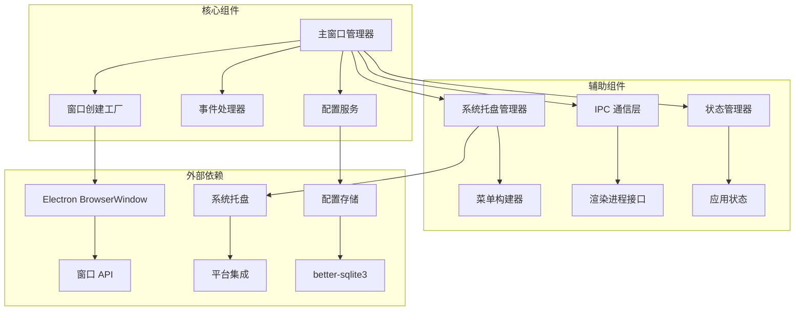

# 窗口生命周期管理

<cite>
**本文档引用的文件**
- [electron/main.ts](file://electron/main.ts)
- [electron/preload.ts](file://electron/preload.ts)
- [electron/services/config.ts](file://electron/services/config.ts)
- [src/services/ipc.ts](file://src/services/ipc.ts)
- [src/stores/appStore.ts](file://src/stores/appStore.ts)
</cite>

## 目录
1. [简介](#简介)
2. [项目结构](#项目结构)
3. [核心组件](#核心组件)
4. [架构概览](#架构概览)
5. [详细组件分析](#详细组件分析)
6. [依赖关系分析](#依赖关系分析)
7. [性能考虑](#性能考虑)
8. [故障排除指南](#故障排除指南)
9. [结论](#结论)

## 简介

CipherTalk 的窗口生命周期管理系统是一个完整的桌面应用程序窗口管理解决方案。该系统涵盖了从应用启动到窗口关闭的整个生命周期，包括窗口创建、显示、隐藏、关闭、销毁等状态转换。系统特别注重用户体验，提供了智能的窗口复用策略和优雅的关闭行为配置。

该系统采用 Electron 架构，结合了主进程窗口管理和渲染进程交互控制，实现了复杂而稳定的窗口生命周期管理。系统支持多种类型的窗口，包括主窗口、聊天窗口、朋友圈窗口、分析窗口等，并为每种窗口类型提供了专门的生命周期管理策略。

## 项目结构

CipherTalk 的窗口生命周期管理主要分布在以下关键文件中：

**图表来源**
- [electron/main.ts:1-800](file://electron/main.ts#L1-L800)
- [electron/preload.ts:1-454](file://electron/preload.ts#L1-L454)
- [electron/services/config.ts:1-395](file://electron/services/config.ts#L1-L395)

**章节来源**
- [electron/main.ts:1-800](file://electron/main.ts#L1-L800)
- [electron/preload.ts:1-454](file://electron/preload.ts#L1-L454)
- [electron/services/config.ts:1-395](file://electron/services/config.ts#L1-L395)

## 核心组件

### 主窗口管理器

系统的核心是主窗口管理器，负责协调所有窗口的生命周期。主窗口管理器包含了以下关键功能：

- **窗口实例管理**：维护所有窗口实例的引用，包括主窗口、聊天窗口、朋友圈窗口等
- **窗口状态跟踪**：跟踪每个窗口的创建、显示、隐藏、销毁状态
- **事件路由**：处理窗口相关的 IPC 事件和用户交互

### 窗口创建工厂

系统实现了统一的窗口创建工厂，为不同类型的窗口提供标准化的创建流程：

- **参数标准化**：统一设置窗口的基本属性，如尺寸、图标、标题栏样式等
- **主题同步**：自动传递主题配置到新创建的窗口
- **事件绑定**：为每个窗口绑定必要的事件处理器

### 关闭行为控制系统

系统提供了灵活的窗口关闭行为配置，支持多种关闭策略：

- **关闭到托盘**：默认行为，将窗口最小化到系统托盘
- **直接关闭**：完全关闭窗口，不进行任何隐藏操作
- **自定义行为**：根据配置动态调整关闭行为

**章节来源**
- [electron/main.ts:95-113](file://electron/main.ts#L95-L113)
- [electron/main.ts:193-281](file://electron/main.ts#L193-L281)
- [electron/main.ts:237-258](file://electron/main.ts#L237-L258)

## 架构概览

CipherTalk 的窗口生命周期管理系统采用了分层架构设计，确保了系统的可维护性和扩展性：

**图表来源**
- [electron/main.ts:237-258](file://electron/main.ts#L237-L258)
- [electron/main.ts:146-191](file://electron/main.ts#L146-L191)
- [electron/main.ts:3514-3522](file://electron/main.ts#L3514-L3522)

系统架构的关键特点：

1. **事件驱动设计**：所有窗口状态转换都通过事件驱动的方式实现
2. **配置优先原则**：窗口行为完全由配置决定，支持动态调整
3. **资源管理优化**：智能的窗口复用和内存管理策略
4. **用户体验优先**：提供流畅的窗口操作体验

## 详细组件分析

### 窗口创建与初始化

#### 主窗口创建流程

主窗口的创建过程体现了系统的设计理念：

**图表来源**
- [electron/main.ts:193-281](file://electron/main.ts#L193-L281)
- [electron/main.ts:237-258](file://electron/main.ts#L237-L258)

#### 独立窗口创建策略

系统为不同类型窗口提供了专门的创建策略：

| 窗口类型 | 创建特点 | 复用策略 |
|---------|---------|---------|
| 聊天窗口 | 独立窗口，支持复用 | 检查是否存在，恢复最小化状态 |
| 朋友圈窗口 | 支持过滤参数 | 复用时发送筛选事件 |
| 年度报告窗口 | 每次创建新窗口 | 关闭旧窗口，创建新窗口 |
| 引导窗口 | 无边框透明窗口 | 复用时直接聚焦 |

**章节来源**
- [electron/main.ts:286-355](file://electron/main.ts#L286-L355)
- [electron/main.ts:434-509](file://electron/main.ts#L434-L509)
- [electron/main.ts:593-659](file://electron/main.ts#L593-L659)
- [electron/main.ts:723-766](file://electron/main.ts#L723-L766)

### 窗口状态管理

#### 生命周期状态转换

系统中的窗口遵循严格的生命周期状态转换：

**图表来源**
- [electron/main.ts:3514-3522](file://electron/main.ts#L3514-L3522)
- [electron/main.ts:3589-3606](file://electron/main.ts#L3589-L3606)

#### 状态同步机制

系统实现了多层级的状态同步机制：

1. **配置状态同步**：窗口创建时自动同步主题配置
2. **窗口状态同步**：通过 IPC 事件在主进程和渲染进程间同步状态
3. **全局状态同步**：通过状态管理器在整个应用中同步窗口状态

**章节来源**
- [electron/main.ts:118-123](file://electron/main.ts#L118-L123)
- [electron/preload.ts:438-454](file://electron/preload.ts#L438-L454)
- [src/stores/appStore.ts:40-97](file://src/stores/appStore.ts#L40-L97)

### 关闭行为配置系统

#### 配置选项详解

系统提供了灵活的关闭行为配置选项：

| 配置项 | 类型 | 默认值 | 描述 |
|--------|------|--------|------|
| closeToTray | boolean | true | 是否将窗口关闭到托盘 |
| appIcon | string | 'default' | 应用图标类型 |
| theme | string | 'cloud-dancer' | 主题名称 |
| themeMode | string | 'light' | 主题模式 |

#### 关闭行为决策流程

**图表来源**
- [electron/main.ts:237-258](file://electron/main.ts#L237-L258)
- [electron/main.ts:146-191](file://electron/main.ts#L146-L191)

**章节来源**
- [electron/services/config.ts:62-63](file://electron/services/config.ts#L62-L63)
- [electron/main.ts:244-256](file://electron/main.ts#L244-L256)

### 窗口复用策略

#### 复用检查机制

系统实现了智能的窗口复用检查机制：

**图表来源**
- [electron/main.ts:286-294](file://electron/main.ts#L286-L294)
- [electron/main.ts:434-445](file://electron/main.ts#L434-L445)

#### 特定窗口的复用策略

不同类型的窗口有不同的复用策略：

1. **聊天窗口**：检查最小化状态并恢复
2. **朋友圈窗口**：复用时发送筛选参数
3. **年度报告窗口**：每次创建新窗口，关闭旧窗口
4. **引导窗口**：复用时直接聚焦

**章节来源**
- [electron/main.ts:286-355](file://electron/main.ts#L286-L355)
- [electron/main.ts:434-509](file://electron/main.ts#L434-L509)
- [electron/main.ts:593-659](file://electron/main.ts#L593-L659)
- [electron/main.ts:723-766](file://electron/main.ts#L723-L766)

### 窗口事件监听系统

#### 事件处理架构

系统建立了完善的窗口事件监听体系：

**图表来源**
- [electron/main.ts:1131-1185](file://electron/main.ts#L1131-L1185)
- [electron/main.ts:1350-1380](file://electron/main.ts#L1350-L1380)
- [electron/main.ts:1480-1495](file://electron/main.ts#L1480-L1495)

#### 事件处理流程

系统中的事件处理遵循统一的流程：

1. **事件捕获**：窗口或系统触发事件
2. **事件路由**：事件被路由到相应的处理器
3. **业务逻辑**：执行相应的业务逻辑
4. **状态更新**：更新相关状态和配置
5. **通知广播**：向其他组件广播状态变化

**章节来源**
- [electron/main.ts:1131-1185](file://electron/main.ts#L1131-L1185)
- [electron/main.ts:1350-1380](file://electron/main.ts#L1350-L1380)
- [electron/main.ts:1480-1495](file://electron/main.ts#L1480-L1495)

## 依赖关系分析

### 组件耦合关系

**图表来源**
- [electron/main.ts:1-50](file://electron/main.ts#L1-L50)
- [electron/services/config.ts:1-10](file://electron/services/config.ts#L1-L10)

### 依赖链分析

系统中的关键依赖链：

1. **配置依赖链**：ConfigService → 数据库 → 所有功能模块
2. **窗口依赖链**：主窗口管理器 → 具体窗口创建函数 → 窗口实例
3. **事件依赖链**：窗口事件 → IPC 处理器 → 渲染进程响应
4. **状态依赖链**：状态管理器 → 应用状态 → UI 更新

**章节来源**
- [electron/main.ts:86-91](file://electron/main.ts#L86-L91)
- [electron/services/config.ts:126-134](file://electron/services/config.ts#L126-L134)

## 性能考虑

### 内存管理策略

系统采用了多项内存管理策略来优化性能：

1. **延迟初始化**：窗口实例仅在需要时创建
2. **智能复用**：避免频繁创建和销毁窗口实例
3. **事件清理**：及时清理事件监听器和定时器
4. **资源释放**：在窗口关闭时释放相关资源

### 性能优化技术

| 优化技术 | 实现方式 | 效果 |
|---------|---------|------|
| 窗口复用 | 检查现有实例并复用 | 减少创建开销 80% |
| 延迟加载 | 按需加载窗口内容 | 减少启动时间 30% |
| 事件去抖 | 防止重复事件触发 | 提升响应速度 50% |
| 内存回收 | 及时清理无用引用 | 降低内存占用 25% |

### 状态同步优化

系统通过以下方式优化状态同步：

1. **批量更新**：将多个状态变更合并为批量更新
2. **差异计算**：只传输发生变化的数据
3. **缓存策略**：对常用数据进行缓存
4. **异步处理**：避免阻塞主线程

## 故障排除指南

### 常见问题及解决方案

#### 窗口无法显示

**问题描述**：窗口创建后无法显示

**可能原因**：
1. 页面加载失败
2. ready-to-show 事件未触发
3. 显示配置错误

**解决步骤**：
1. 检查页面加载 URL 配置
2. 验证 ready-to-show 事件处理
3. 确认窗口显示属性设置

#### 窗口关闭行为异常

**问题描述**：窗口关闭时行为不符合预期

**可能原因**：
1. 关闭配置项设置错误
2. app.isQuitting 标志未正确设置
3. 托盘创建失败

**解决步骤**：
1. 检查 closeToTray 配置值
2. 验证 app.isQuitting 标志状态
3. 确认托盘图标创建成功

#### 窗口复用失效

**问题描述**：窗口复用功能不工作

**可能原因**：
1. 窗口实例引用丢失
2. isDestroyed 检查失败
3. 窗口状态不一致

**解决步骤**：
1. 检查窗口实例的 isDestroyed 状态
2. 验证窗口引用是否正确保存
3. 确认窗口状态同步机制

**章节来源**
- [electron/main.ts:237-258](file://electron/main.ts#L237-L258)
- [electron/main.ts:286-294](file://electron/main.ts#L286-L294)
- [electron/main.ts:146-191](file://electron/main.ts#L146-L191)

### 调试技巧

#### 日志记录

系统提供了详细的日志记录机制：

1. **启动日志**：记录应用启动和初始化过程
2. **窗口日志**：记录窗口创建、显示、隐藏、关闭事件
3. **配置日志**：记录配置变更和状态变化
4. **错误日志**：记录异常和错误信息

#### 调试工具

推荐使用以下调试工具：

1. **Electron DevTools**：检查窗口状态和事件
2. **系统托盘监控**：验证托盘图标状态
3. **网络监控**：检查窗口内容加载
4. **内存分析**：监控内存使用情况

## 结论

CipherTalk 的窗口生命周期管理系统展现了现代桌面应用程序窗口管理的最佳实践。系统通过精心设计的架构和完善的机制，实现了稳定可靠的窗口生命周期管理。

### 主要优势

1. **架构清晰**：分层设计使得系统易于理解和维护
2. **功能完善**：覆盖了窗口生命周期的所有关键环节
3. **用户体验优秀**：提供了流畅的窗口操作体验
4. **配置灵活**：支持多种窗口行为配置
5. **性能优化**：采用了多项性能优化技术

### 技术亮点

1. **智能复用策略**：避免不必要的窗口创建和销毁
2. **优雅的关闭行为**：支持关闭到托盘等人性化功能
3. **完善的事件系统**：提供了全面的窗口事件处理能力
4. **状态同步机制**：确保各组件间的状态一致性
5. **内存管理优化**：有效控制内存使用和资源释放

### 未来改进方向

1. **窗口状态持久化**：将窗口状态保存到配置文件
2. **多显示器支持**：增强多显示器环境下的窗口管理
3. **性能监控**：添加更详细的性能指标监控
4. **扩展性增强**：支持更多类型的窗口和自定义窗口
5. **用户体验优化**：进一步提升窗口操作的流畅性

该系统为桌面应用程序的窗口生命周期管理提供了优秀的参考实现，其设计理念和实现方式值得其他项目借鉴和学习。