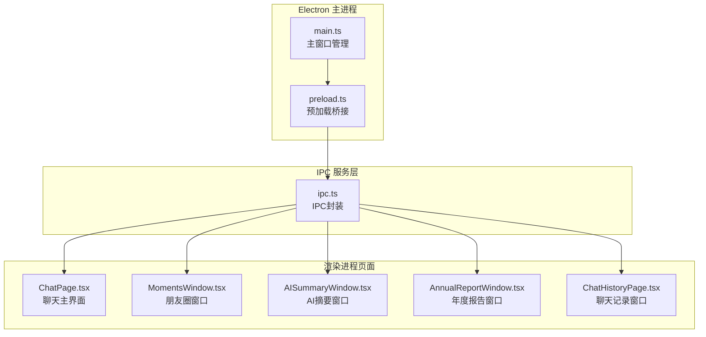
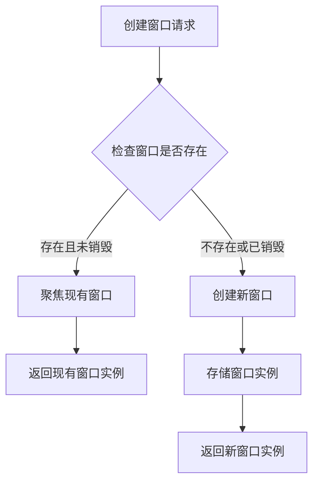
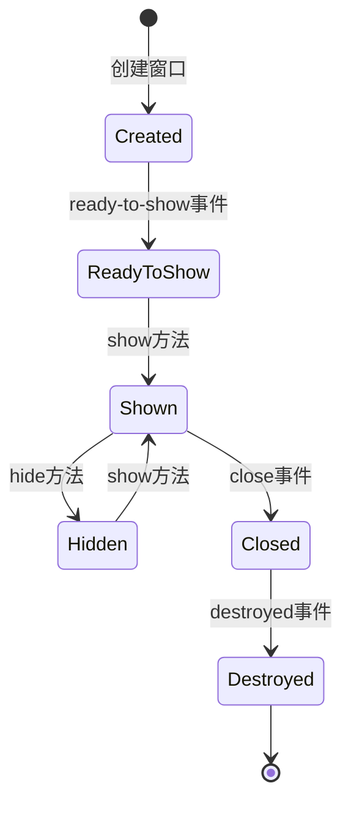
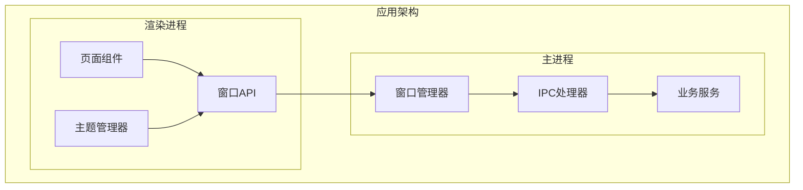
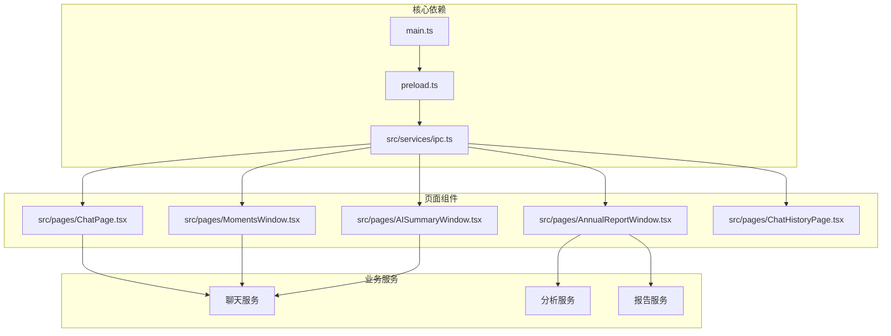

# 窗口管理系统

<cite>
**本文档引用的文件**
- [electron/main.ts](file://electron/main.ts)
- [electron/preload.ts](file://electron/preload.ts)
- [src/pages/ChatPage.tsx](file://src/pages/ChatPage.tsx)
- [src/pages/MomentsWindow.tsx](file://src/pages/MomentsWindow.tsx)
- [src/pages/AISummaryWindow.tsx](file://src/pages/AISummaryWindow.tsx)
- [src/pages/AnnualReportWindow.tsx](file://src/pages/AnnualReportWindow.tsx)
- [src/pages/ChatHistoryPage.tsx](file://src/pages/ChatHistoryPage.tsx)
- [src/services/ipc.ts](file://src/services/ipc.ts)
</cite>

## 目录
1. [简介](#简介)
2. [项目结构](#项目结构)
3. [核心组件](#核心组件)
4. [架构概览](#架构概览)
5. [详细组件分析](#详细组件分析)
6. [依赖关系分析](#依赖关系分析)
7. [性能考虑](#性能考虑)
8. [故障排除指南](#故障排除指南)
9. [结论](#结论)

## 简介

CipherTalk 的窗口管理系统是一个基于 Electron 的现代化桌面应用程序，提供了完整的窗口生命周期管理、跨窗口通信机制和丰富的窗口类型支持。该系统采用主从窗口架构，支持主窗口、独立聊天窗口、朋友圈窗口、群聊分析窗口、年度报告窗口等多种窗口类型。

系统的核心特点包括：
- **统一的窗口管理**：集中管理所有窗口实例和生命周期
- **主题参数传递**：支持动态主题切换和参数传递
- **窗口复用逻辑**：智能复用现有窗口实例，避免重复创建
- **焦点管理**：完善的窗口焦点和显示管理
- **跨窗口通信**：基于 IPC 的高效通信机制

## 项目结构

**图表来源**
- [electron/main.ts:193-281](file://electron/main.ts#L193-L281)
- [electron/preload.ts:1-454](file://electron/preload.ts#L1-L454)
- [src/services/ipc.ts:1-38](file://src/services/ipc.ts#L1-L38)

**章节来源**
- [electron/main.ts:1-120](file://electron/main.ts#L1-L120)
- [electron/preload.ts:1-50](file://electron/preload.ts#L1-L50)
- [src/services/ipc.ts:1-38](file://src/services/ipc.ts#L1-L38)

## 核心组件

### 主窗口管理器

主窗口管理器负责创建和管理应用程序的主要窗口实例，包括窗口配置、生命周期管理和主题参数传递。

**窗口配置参数**：
- **尺寸设置**：默认 1400x900，最小尺寸 1000x700
- **图标管理**：支持动态应用图标切换
- **WebPreferences**：启用上下文隔离，禁用 Node.js 集成
- **标题栏样式**：隐藏式标题栏，支持自定义覆盖层
- **关闭行为**：支持关闭到系统托盘

**章节来源**
- [electron/main.ts:193-281](file://electron/main.ts#L193-L281)
- [electron/main.ts:118-141](file://electron/main.ts#L118-L141)

### 窗口复用机制

系统实现了智能的窗口复用逻辑，避免重复创建相同的窗口实例：

**图表来源**
- [electron/main.ts:286-355](file://electron/main.ts#L286-L355)
- [electron/main.ts:360-429](file://electron/main.ts#L360-L429)

**章节来源**
- [electron/main.ts:286-355](file://electron/main.ts#L286-L355)
- [electron/main.ts:360-429](file://electron/main.ts#L360-L429)

### 窗口生命周期管理

系统提供完整的窗口生命周期管理，包括创建、显示、隐藏、关闭和销毁：

**图表来源**
- [electron/main.ts:233-258](file://electron/main.ts#L233-L258)
- [electron/main.ts:322-324](file://electron/main.ts#L322-L324)

**章节来源**
- [electron/main.ts:233-258](file://electron/main.ts#L233-L258)
- [electron/main.ts:322-324](file://electron/main.ts#L322-L324)

## 架构概览

**图表来源**
- [electron/main.ts:1131-1350](file://electron/main.ts#L1131-L1350)
- [electron/preload.ts:4-435](file://electron/preload.ts#L4-L435)

## 详细组件分析

### 主窗口 (Main Window)

主窗口是应用程序的核心界面，负责协调其他窗口的创建和管理。

**窗口特性**：
- 默认尺寸：1400x900，最小尺寸：1000x700
- 隐藏式标题栏设计
- 支持关闭到系统托盘
- 动态主题参数传递

**生命周期处理**：
- ready-to-show 事件触发显示
- close 事件处理关闭行为
- 开发环境下支持 F12 调试

**章节来源**
- [electron/main.ts:193-281](file://electron/main.ts#L193-L281)
- [electron/main.ts:233-258](file://electron/main.ts#L233-L258)

### 独立聊天窗口 (Chat Window)

聊天窗口提供独立的聊天界面，支持仿微信风格的设计。

**窗口配置**：
- 尺寸：1000x700，最小尺寸：800x600
- 背景色根据主题自动调整
- 隐藏式标题栏，符号颜色自适应

**功能特性**：
- 支持主题参数传递
- 开发环境下支持调试快捷键
- 智能窗口复用

**章节来源**
- [electron/main.ts:286-355](file://electron/main.ts#L286-L355)

### 朋友圈窗口 (Moments Window)

朋友圈窗口专门用于展示和管理微信朋友圈内容。

**窗口特性**：
- 宽度：1200，高度：800，最小尺寸：900x600
- 支持用户筛选功能
- 实时主题参数传递

**核心功能**：
- 朋友圈内容展示
- 用户筛选和过滤
- 媒体资源代理和下载

**章节来源**
- [electron/main.ts:433-509](file://electron/main.ts#L433-L509)
- [src/pages/MomentsWindow.tsx:746-800](file://src/pages/MomentsWindow.tsx#L746-L800)

### 群聊分析窗口 (Group Analytics Window)

群聊分析窗口提供群组聊天数据的可视化分析。

**窗口配置**：
- 尺寸：1100x750，最小尺寸：900x600
- 适配深色/浅色主题

**分析功能**：
- 群成员统计
- 消息频率分析
- 活跃时间段分析
- 媒体内容统计

**章节来源**
- [electron/main.ts:359-429](file://electron/main.ts#L359-L429)

### 年度报告窗口 (Annual Report Window)

年度报告窗口生成和展示用户的年度聊天统计报告。

**窗口特性**：
- 尺寸：1200x800，最小尺寸：900x650
- 支持主题切换（默认/新年主题）
- 导出功能支持

**报告内容**：
- 年度概览统计
- 最佳好友识别
- 月度好友分析
- 作息规律热力图
- 常用语词云

**章节来源**
- [electron/main.ts:592-659](file://electron/main.ts#L592-L659)
- [src/pages/AnnualReportWindow.tsx:243-343](file://src/pages/AnnualReportWindow.tsx#L243-L343)

### AI摘要窗口 (AI Summary Window)

AI摘要窗口提供基于AI的聊天内容摘要生成功能。

**窗口特性**：
- 尺寸：600x800，最小尺寸：500x600
- 自定义标题栏设计
- 支持思考过程显示

**功能特性**：
- 时间范围选择
- 自定义要求输入
- 流式AI摘要生成
- 历史记录管理

**章节来源**
- [electron/main.ts:1053-1128](file://electron/main.ts#L1053-L1128)
- [src/pages/AISummaryWindow.tsx:8-743](file://src/pages/AISummaryWindow.tsx#L8-L743)

### 聊天记录窗口 (Chat History Window)

聊天记录窗口专门用于展示合并转发的聊天记录。

**窗口特性**：
- 尺寸：600x800，最小尺寸：400x500
- 自动隐藏菜单栏
- 透明背景支持

**功能特性**：
- 合并转发记录解析
- 多媒体内容展示
- 响应式布局设计

**章节来源**
- [electron/main.ts:513-588](file://electron/main.ts#L513-L588)
- [src/pages/ChatHistoryPage.tsx:8-239](file://src/pages/ChatHistoryPage.tsx#L8-L239)

### 协议窗口 (Agreement Window)

协议窗口用于展示用户协议和隐私政策。

**窗口配置**：
- 尺寸：800x700，最小尺寸：600x500
- 适配深色主题

**章节来源**
- [electron/main.ts:663-718](file://electron/main.ts#L663-L718)

### 购买窗口 (Purchase Window)

购买窗口集成外部购买页面。

**窗口特性**：
- 尺寸：1000x700，最小尺寸：800x600
- 背景色：白色
- 自动隐藏菜单栏

**章节来源**
- [electron/main.ts:770-809](file://electron/main.ts#L770-L809)

### 引导窗口 (Welcome Window)

引导窗口提供应用首次启动的引导流程。

**窗口特性**：
- 尺寸：1100x760，最小尺寸：900x640
- 无框架设计，透明背景
- 无阴影效果

**章节来源**
- [electron/main.ts:722-766](file://electron/main.ts#L722-L766)

### 媒体查看窗口 (Image/Video Viewer)

媒体查看窗口提供独立的图片和视频查看功能。

**窗口配置**：
- 图片查看器：800x600，最小尺寸：400x300
- 视频播放器：根据视频比例自动调整尺寸
- 支持 Live Photo 播放

**章节来源**
- [electron/main.ts:813-879](file://electron/main.ts#L813-L879)
- [electron/main.ts:884-983](file://electron/main.ts#L884-L983)

## 依赖关系分析

**图表来源**
- [electron/main.ts:1-120](file://electron/main.ts#L1-L120)
- [electron/preload.ts:1-454](file://electron/preload.ts#L1-L454)
- [src/services/ipc.ts:1-38](file://src/services/ipc.ts#L1-L38)

**章节来源**
- [electron/main.ts:1131-1350](file://electron/main.ts#L1131-L1350)
- [electron/preload.ts:4-435](file://electron/preload.ts#L4-L435)

## 性能考虑

### 窗口复用优化

系统通过智能复用机制避免重复创建窗口，提升性能表现：

- **实例缓存**：所有窗口实例存储在全局变量中
- **状态检查**：创建前检查实例是否存在且未销毁
- **焦点管理**：复用时自动恢复窗口状态

### 内存管理

- **事件监听器清理**：窗口关闭时自动清理事件监听器
- **资源释放**：及时释放数据库连接和文件句柄
- **垃圾回收**：避免循环引用导致的内存泄漏

### 渲染性能

- **懒加载**：图片和媒体资源采用懒加载策略
- **虚拟滚动**：大量数据采用虚拟滚动减少DOM节点
- **缓存机制**：频繁访问的数据进行内存缓存

## 故障排除指南

### 常见问题及解决方案

**窗口无法创建**
- 检查 Electron 版本兼容性
- 验证预加载脚本路径
- 确认 WebPreferences 配置

**窗口显示异常**
- 检查主题参数传递
- 验证窗口尺寸设置
- 确认标题栏样式配置

**IPC 通信失败**
- 检查预加载桥接配置
- 验证 IPC 处理器注册
- 确认渲染进程 API 调用

**内存泄漏问题**
- 检查事件监听器清理
- 验证窗口实例销毁
- 监控数据库连接池

**章节来源**
- [electron/main.ts:1131-1350](file://electron/main.ts#L1131-L1350)
- [electron/preload.ts:1-454](file://electron/preload.ts#L1-L454)

## 结论

CipherTalk 的窗口管理系统展现了现代 Electron 应用的最佳实践，通过精心设计的架构和完善的窗口管理机制，提供了稳定、高效的用户体验。系统的主要优势包括：

1. **统一的窗口管理**：集中管理所有窗口实例，避免重复创建
2. **灵活的主题系统**：支持动态主题切换和参数传递
3. **完善的生命周期管理**：从创建到销毁的完整生命周期控制
4. **高效的跨窗口通信**：基于 IPC 的可靠通信机制
5. **优秀的性能表现**：通过复用和优化策略提升应用性能

该系统为开发者提供了清晰的扩展点和良好的开发体验，是 Electron 窗口管理的优秀范例。