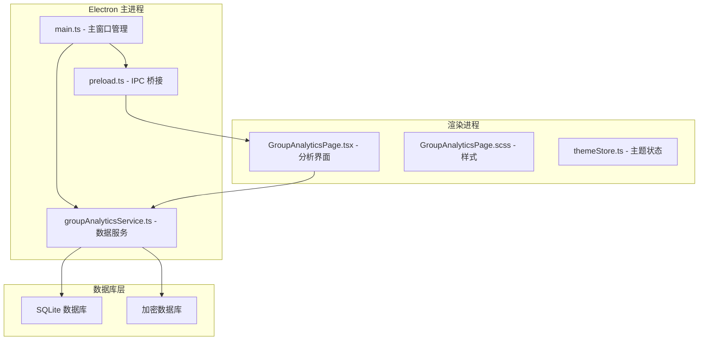
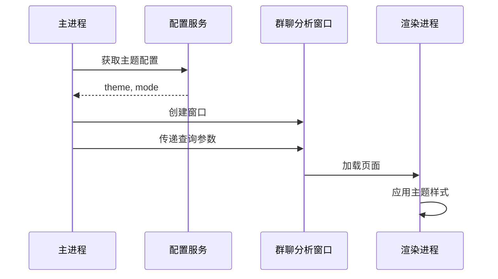
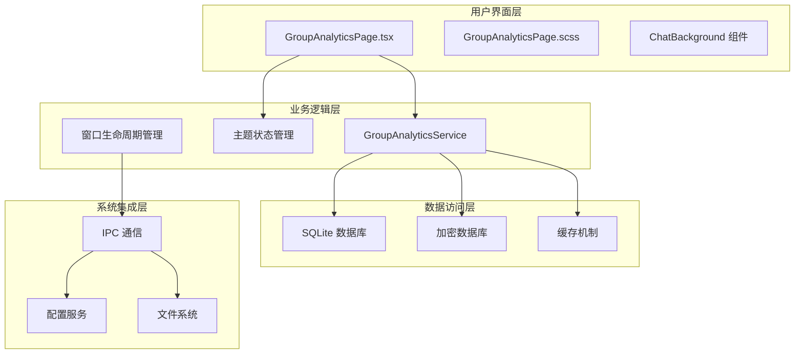
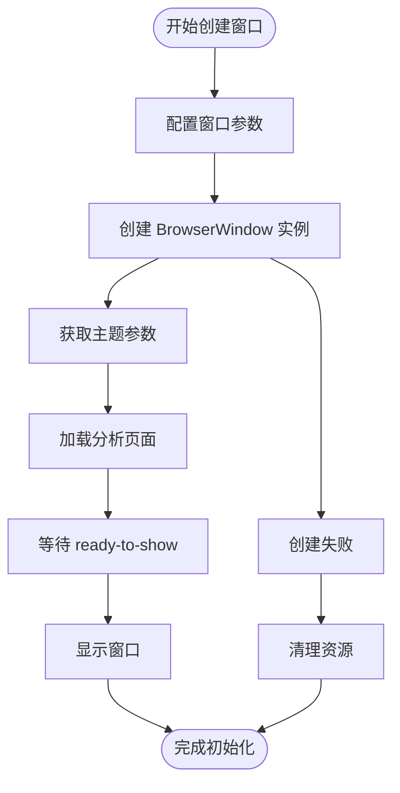
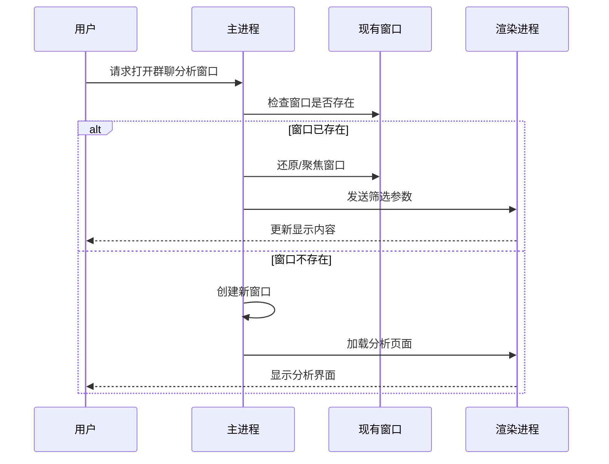
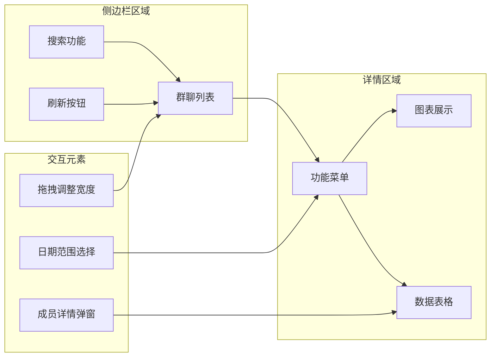
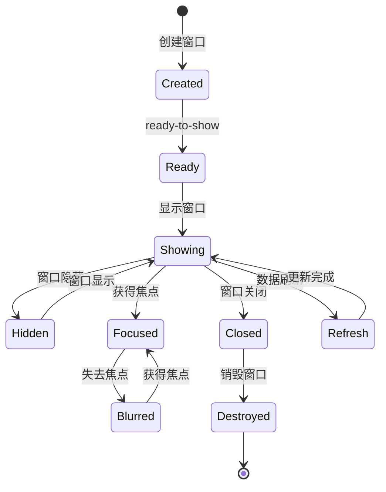
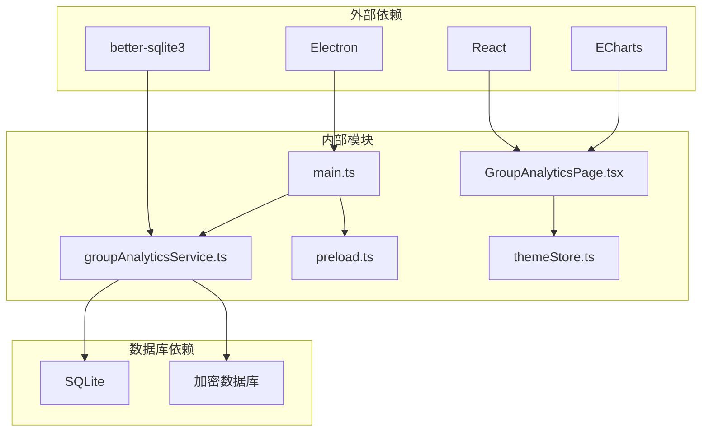

# 群聊分析窗口管理

<cite>
**本文档引用的文件**
- [main.ts](file://electron/main.ts)
- [GroupAnalyticsPage.tsx](file://src/pages/GroupAnalyticsPage.tsx)
- [GroupAnalyticsPage.scss](file://src/pages/GroupAnalyticsPage.scss)
- [groupAnalyticsService.ts](file://electron/services/groupAnalyticsService.ts)
- [preload.ts](file://electron/preload.ts)
- [themeStore.ts](file://src/stores/themeStore.ts)
</cite>

## 目录
1. [简介](#简介)
2. [项目结构](#项目结构)
3. [核心组件](#核心组件)
4. [架构概览](#架构概览)
5. [详细组件分析](#详细组件分析)
6. [依赖关系分析](#依赖关系分析)
7. [性能考虑](#性能考虑)
8. [故障排除指南](#故障排除指南)
9. [结论](#结论)

## 简介

CipherTalk 的群聊分析窗口管理系统是一个专门用于微信聊天数据分析的独立窗口功能。该系统提供了完整的群聊分析能力，包括群成员管理、消息统计、活跃时段分析和媒体内容统计等功能。本文档深入解析了群聊分析窗口的创建、配置、复用逻辑和主题参数传递机制。

## 项目结构

群聊分析窗口管理系统采用 Electron + React 的技术栈，主要分为以下层次：

**图表来源**
- [main.ts:1-200](file://electron/main.ts#L1-L200)
- [GroupAnalyticsPage.tsx:1-50](file://src/pages/GroupAnalyticsPage.tsx#L1-L50)

**章节来源**
- [main.ts:1-200](file://electron/main.ts#L1-L200)
- [GroupAnalyticsPage.tsx:1-50](file://src/pages/GroupAnalyticsPage.tsx#L1-L50)

## 核心组件

### 窗口配置参数

群聊分析窗口具有以下关键配置参数：

| 参数 | 值 | 描述 |
|------|-----|------|
| **窗口尺寸** | 1100x750 | 主要窗口尺寸 |
| **最小尺寸** | 900x600 | 最小可调整尺寸 |
| **标题栏样式** | hidden | 隐藏原生标题栏 |
| **标题栏覆盖** | color: #00000000 | 透明背景 |
| **符号颜色** | #666666 | 标题栏按钮颜色 |
| **标题栏高度** | 32px | 标题栏高度 |
| **背景色** | 深色: #1A1A1A 浅色: #F0F0F0 | 根据系统主题自动切换 |

### 主题参数传递机制

系统实现了完整的主题参数传递机制，确保窗口启动时的主题一致性：

**图表来源**
- [main.ts:118-123](file://electron/main.ts#L118-L123)
- [main.ts:404-422](file://electron/main.ts#L404-L422)

**章节来源**
- [main.ts:374-394](file://electron/main.ts#L374-L394)
- [main.ts:118-123](file://electron/main.ts#L118-L123)

## 架构概览

群聊分析窗口管理系统采用分层架构设计，确保各组件职责清晰：

**图表来源**
- [GroupAnalyticsPage.tsx:1-50](file://src/pages/GroupAnalyticsPage.tsx#L1-L50)
- [groupAnalyticsService.ts:41-47](file://electron/services/groupAnalyticsService.ts#L41-L47)

## 详细组件分析

### 窗口创建与初始化

群聊分析窗口的创建过程遵循严格的初始化流程：

**图表来源**
- [main.ts:374-394](file://electron/main.ts#L374-L394)
- [main.ts:396-398](file://electron/main.ts#L396-L398)

#### 窗口参数详解

窗口创建时的关键参数配置：

- **尺寸设置**: 1100x750 主尺寸，900x600 最小尺寸
- **安全配置**: `webSecurity: false` 允许加载本地文件
- **标题栏定制**: `titleBarStyle: 'hidden'` + `titleBarOverlay` 实现自定义标题栏
- **背景配置**: 根据系统主题自动设置背景色

**章节来源**
- [main.ts:374-394](file://electron/main.ts#L374-L394)

### 窗口复用逻辑

系统实现了智能的窗口复用机制，避免重复创建：

**图表来源**
- [main.ts:434-445](file://electron/main.ts#L434-L445)

#### 复用策略特点

- **状态检查**: 使用 `isDestroyed()` 检查窗口有效性
- **焦点管理**: 自动还原并聚焦现有窗口
- **参数传递**: 支持动态参数传递（如用户筛选）

**章节来源**
- [main.ts:434-445](file://electron/main.ts#L434-L445)

### 数据分析功能模块

群聊分析系统提供四个核心分析功能：

| 功能 | 方法 | 数据源 | 输出格式 |
|------|------|--------|----------|
| **群成员查看** | `getGroupMembers()` | contact.db | 成员列表 |
| **群聊发言排行** | `getGroupMessageRanking()` | Msg_* 表 | 排行列表 |
| **群聊活跃时段** | `getGroupActiveHours()` | Msg_* 表 | 小时分布 |
| **媒体内容统计** | `getGroupMediaStats()` | Msg_* 表 | 类型统计 |

**章节来源**
- [groupAnalyticsService.ts:353-421](file://electron/services/groupAnalyticsService.ts#L353-L421)
- [groupAnalyticsService.ts:423-531](file://electron/services/groupAnalyticsService.ts#L423-L531)

### 用户交互设计

界面采用响应式布局设计，支持多种交互方式：

**图表来源**
- [GroupAnalyticsPage.tsx:302-362](file://src/pages/GroupAnalyticsPage.tsx#L302-L362)
- [GroupAnalyticsPage.tsx:365-416](file://src/pages/GroupAnalyticsPage.tsx#L365-L416)

#### 交互特性

- **拖拽调整**: 支持侧边栏宽度动态调整
- **日期筛选**: 灵活的时间范围选择
- **成员详情**: 点击成员查看详细信息
- **响应式设计**: 适配不同屏幕尺寸

**章节来源**
- [GroupAnalyticsPage.tsx:82-99](file://src/pages/GroupAnalyticsPage.tsx#L82-L99)
- [GroupAnalyticsPage.tsx:243-260](file://src/pages/GroupAnalyticsPage.tsx#L243-L260)

### 生命周期管理

窗口生命周期采用事件驱动管理模式：

**图表来源**
- [main.ts:424-426](file://electron/main.ts#L424-L426)

#### 关键生命周期事件

- **ready-to-show**: 窗口准备就绪时才显示
- **closed**: 窗口关闭时清理引用
- **visibilitychange**: 监控窗口可见性变化
- **before-input-event**: 开发工具快捷键处理

**章节来源**
- [main.ts:396-398](file://electron/main.ts#L396-L398)
- [main.ts:424-426](file://electron/main.ts#L424-L426)

## 依赖关系分析

系统各组件之间的依赖关系如下：

**图表来源**
- [main.ts:1-29](file://electron/main.ts#L1-L29)
- [GroupAnalyticsPage.tsx:1-6](file://src/pages/GroupAnalyticsPage.tsx#L1-L6)

### 核心依赖关系

- **Electron 主进程**: 控制窗口生命周期和 IPC 通信
- **React 组件**: 提供用户界面和交互逻辑
- **SQLite 数据库**: 存储和查询分析数据
- **better-sqlite3**: 高性能 SQLite 数据库访问
- **ECharts**: 数据可视化图表渲染

**章节来源**
- [groupAnalyticsService.ts:1-6](file://electron/services/groupAnalyticsService.ts#L1-L6)
- [preload.ts:1-454](file://electron/preload.ts#L1-L454)

## 性能考虑

### 数据库优化策略

系统采用了多项数据库性能优化措施：

- **连接池管理**: 使用 Map 缓存数据库连接，避免重复创建
- **表名哈希**: 通过 MD5 哈希快速定位消息表
- **索引利用**: 合理使用 create_time 和 sender 字段索引
- **批量查询**: 支持多数据库文件的并行查询

### 内存管理

- **缓存策略**: 仅缓存必要的数据库连接，及时释放
- **事件监听**: 正确移除事件监听器，防止内存泄漏
- **组件卸载**: 组件销毁时清理定时器和订阅

### 界面性能

- **虚拟滚动**: 大列表数据的虚拟化渲染
- **懒加载**: 图表和图片的延迟加载
- **防抖处理**: 输入事件的防抖优化

## 故障排除指南

### 常见问题及解决方案

| 问题类型 | 症状 | 可能原因 | 解决方案 |
|----------|------|----------|----------|
| **窗口无法创建** | 应用崩溃或空白窗口 | 配置参数错误 | 检查窗口参数配置 |
| **主题不生效** | 界面颜色异常 | 主题参数传递失败 | 验证 getThemeQueryParams |
| **数据加载失败** | 分析结果为空 | 数据库连接问题 | 检查数据库路径和权限 |
| **界面卡顿** | 操作响应缓慢 | 数据量过大 | 实施数据分页和缓存 |

### 调试技巧

1. **开发工具**: 使用 F12 快捷键打开开发者工具
2. **日志输出**: 利用 console.error 输出错误信息
3. **状态监控**: 检查窗口状态和事件触发
4. **网络调试**: 监控 IPC 通信和数据传输

**章节来源**
- [main.ts:407-416](file://electron/main.ts#L407-L416)
- [GroupAnalyticsPage.tsx:117-121](file://src/pages/GroupAnalyticsPage.tsx#L117-L121)

## 结论

CipherTalk 的群聊分析窗口管理系统展现了现代桌面应用的最佳实践：

### 技术优势

- **架构清晰**: 分层设计确保代码可维护性
- **用户体验**: 智能复用和主题同步提升使用体验
- **性能优化**: 多项优化策略保证系统流畅运行
- **扩展性强**: 模块化设计便于功能扩展

### 设计亮点

- **主题一致性**: 完整的主题参数传递机制
- **响应式交互**: 灵活的用户界面设计
- **数据可视化**: 丰富的图表展示能力
- **错误处理**: 完善的异常处理和恢复机制

该系统为微信聊天数据分析提供了完整、稳定、易用的解决方案，是 Electron + React 技术栈的优秀实践案例。