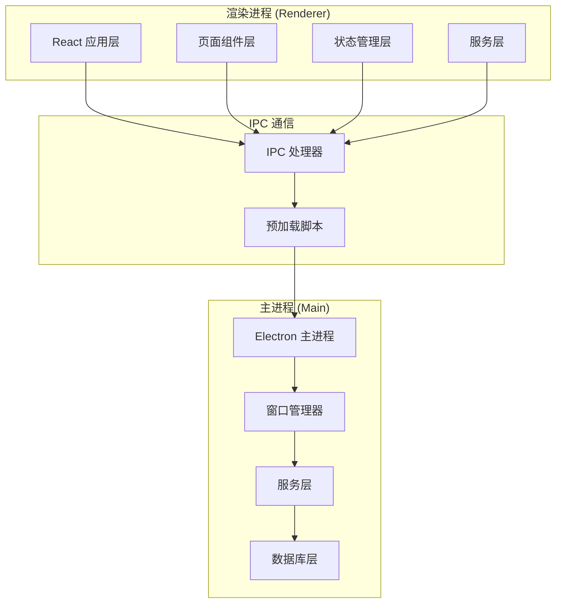
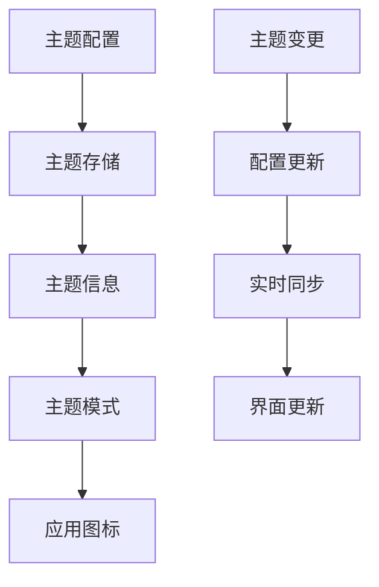
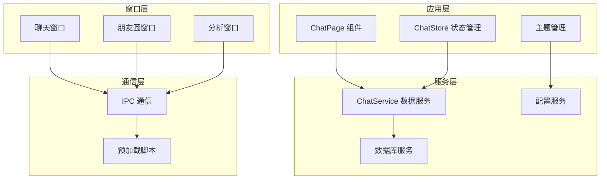
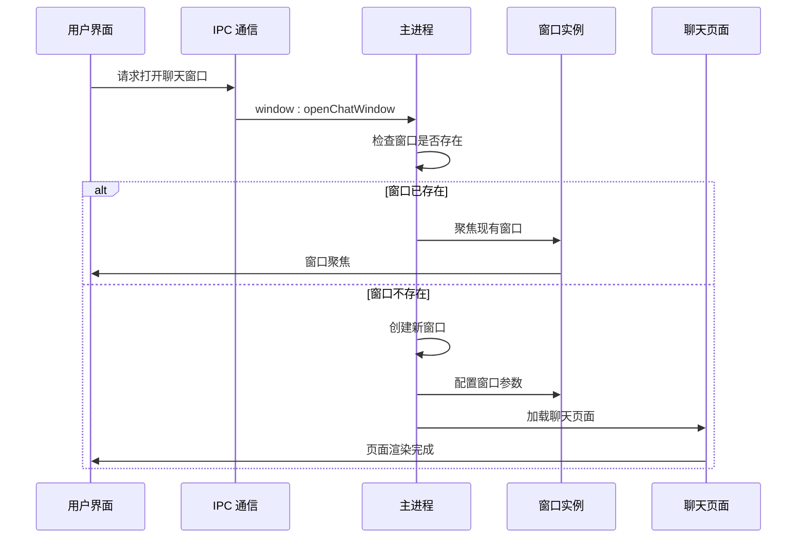
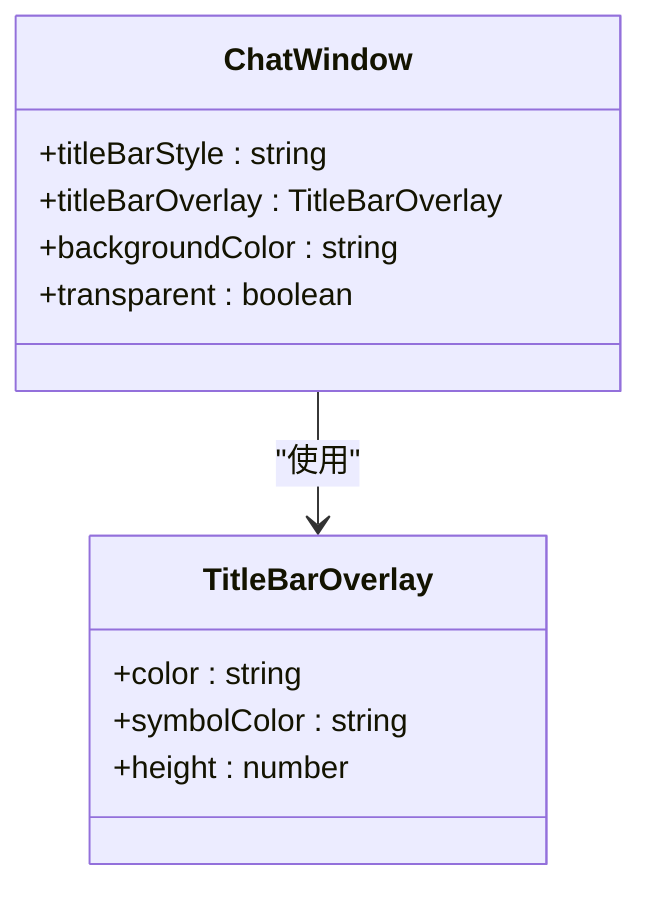
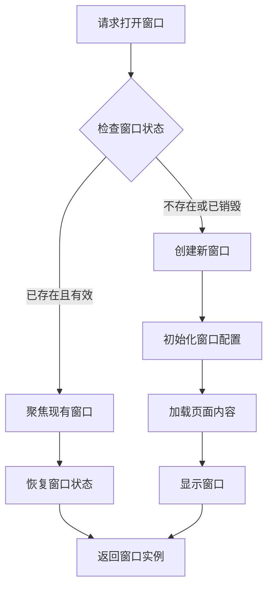
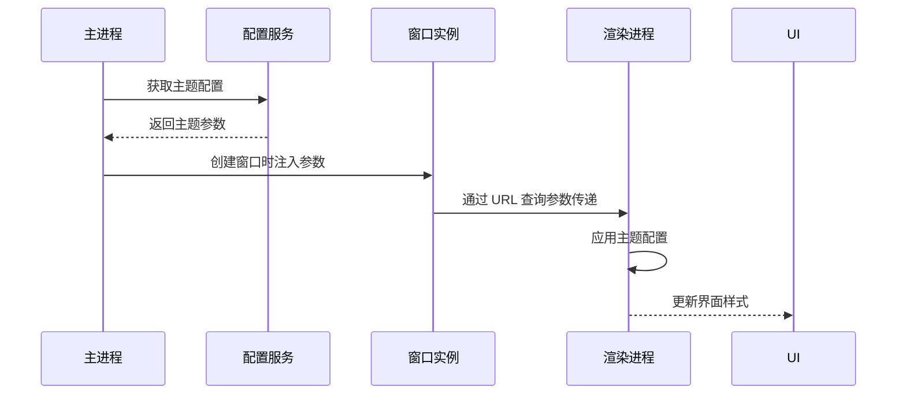
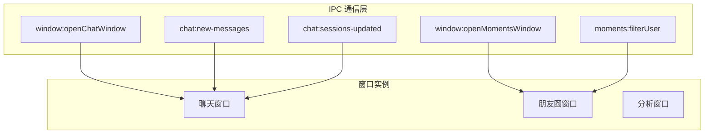
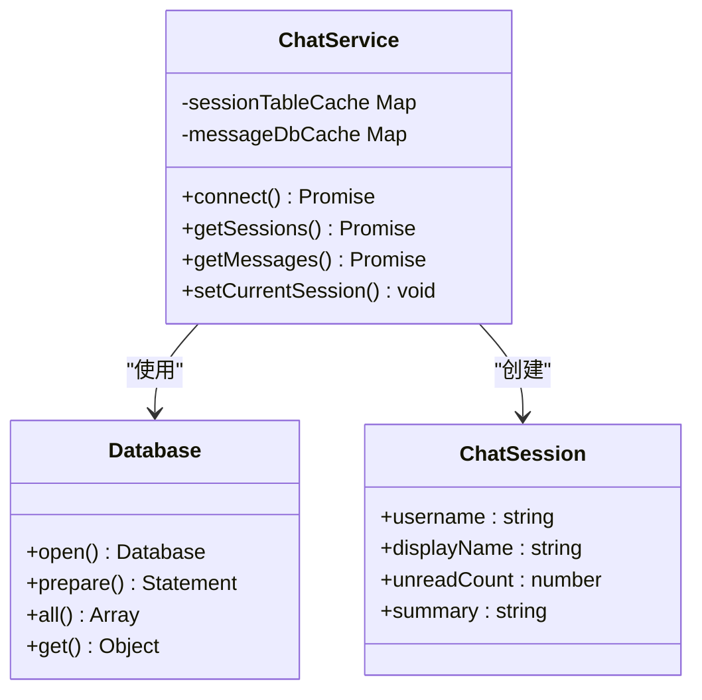
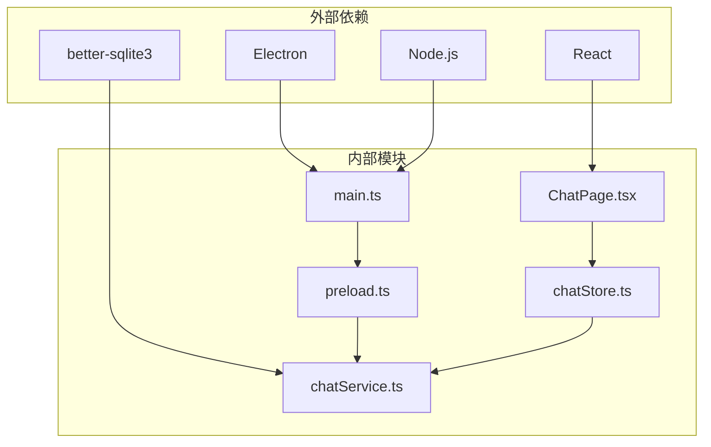

# 聊天窗口管理

<cite>
**本文档引用的文件**
- [electron/main.ts](file://electron/main.ts)
- [electron/preload.ts](file://electron/preload.ts)
- [electron/services/chatService.ts](file://electron/services/chatService.ts)
- [src/pages/ChatPage.tsx](file://src/pages/ChatPage.tsx)
- [src/stores/chatStore.ts](file://src/stores/chatStore.ts)
- [src/stores/themeStore.ts](file://src/stores/themeStore.ts)
- [src/services/ipc.ts](file://src/services/ipc.ts)
- [src/types/electron.d.ts](file://src/types/electron.d.ts)
</cite>

## 目录
1. [简介](#简介)
2. [项目结构](#项目结构)
3. [核心组件](#核心组件)
4. [架构概览](#架构概览)
5. [详细组件分析](#详细组件分析)
6. [依赖关系分析](#依赖关系分析)
7. [性能考虑](#性能考虑)
8. [故障排除指南](#故障排除指南)
9. [结论](#结论)

## 简介

CipherTalk 是一个基于 Electron 和 React 的微信聊天数据分析应用。本文档专注于其独立聊天窗口管理系统，详细解释聊天窗口的创建和复用机制、配置参数、主题参数传递机制以及窗口间通信策略。

该系统提供了完整的聊天窗口管理功能，包括：
- 独立聊天窗口的创建和生命周期管理
- 窗口复用逻辑（避免重复创建）
- 主题参数的动态传递和同步
- 窗口间通信机制
- 特殊配置如透明背景和标题栏覆盖

## 项目结构

CipherTalk 采用典型的 Electron + React 架构，主要分为三个层次：

**图表来源**
- [electron/main.ts:1-800](file://electron/main.ts#L1-L800)
- [electron/preload.ts:1-454](file://electron/preload.ts#L1-L454)

**章节来源**
- [electron/main.ts:1-800](file://electron/main.ts#L1-L800)
- [electron/preload.ts:1-454](file://electron/preload.ts#L1-L454)

## 核心组件

### 窗口管理器

系统的核心是窗口管理器，负责创建和管理各种类型的独立窗口。主要窗口类型包括：

| 窗口类型 | 尺寸 | 最小尺寸 | 特殊配置 |
|---------|------|----------|----------|
| 聊天窗口 | 1000x700 | 800x600 | 透明背景、标题栏覆盖 |
| 朋友圈窗口 | 1200x800 | 900x600 | 标题栏覆盖 |
| 群聊分析窗口 | 1100x750 | 900x600 | 标题栏覆盖 |
| 年度报告窗口 | 1200x800 | 900x650 | 标题栏覆盖 |
| 购买窗口 | 1000x700 | 800x600 | 标题栏覆盖 |

### 主题管理系统

系统支持多种主题，通过配置系统实现动态切换：

**图表来源**
- [src/stores/themeStore.ts:1-146](file://src/stores/themeStore.ts#L1-L146)

**章节来源**
- [src/stores/themeStore.ts:1-146](file://src/stores/themeStore.ts#L1-L146)

## 架构概览

系统采用分层架构设计，实现了清晰的职责分离：

**图表来源**
- [electron/main.ts:285-355](file://electron/main.ts#L285-L355)
- [electron/preload.ts:4-435](file://electron/preload.ts#L4-L435)

## 详细组件分析

### 聊天窗口创建机制

聊天窗口的创建遵循严格的生命周期管理：

**图表来源**
- [electron/main.ts:285-355](file://electron/main.ts#L285-L355)
- [electron/main.ts:2463-2466](file://electron/main.ts#L2463-L2466)

#### 窗口配置参数详解

聊天窗口的配置参数体现了精心设计的用户体验考量：

| 参数 | 值 | 说明 | 作用 |
|------|-----|------|------|
| width | 1000 | 窗口宽度 | 提供舒适的聊天界面 |
| height | 700 | 窗口高度 | 适中的视口比例 |
| minWidth | 800 | 最小宽度 | 确保基本功能可用 |
| minHeight | 600 | 最小高度 | 保持界面完整性 |
| backgroundColor | 动态 | 背景色 | 适配深色/浅色主题 |
| titleBarStyle | hidden | 标题栏样式 | 实现自定义标题栏 |
| titleBarOverlay | 配置对象 | 标题栏覆盖 | 提供统一的系统集成 |

#### 标题栏覆盖配置

标题栏覆盖是现代桌面应用的重要特性：

**图表来源**
- [electron/main.ts:312-320](file://electron/main.ts#L312-L320)

**章节来源**
- [electron/main.ts:285-355](file://electron/main.ts#L285-L355)

### 窗口复用逻辑

系统实现了智能的窗口复用机制，避免重复创建带来的资源浪费：

**图表来源**
- [electron/main.ts:287-294](file://electron/main.ts#L287-L294)

#### 复用策略细节

窗口复用策略考虑了多种场景：

1. **窗口状态检查**：验证窗口是否已销毁或最小化
2. **状态恢复**：自动恢复窗口的最小化状态
3. **焦点管理**：确保用户能够快速定位到目标窗口
4. **内存管理**：正确清理已关闭窗口的引用

**章节来源**
- [electron/main.ts:285-355](file://electron/main.ts#L285-L355)

### 主题参数传递机制

系统实现了完整的主题参数传递机制，确保窗口间的视觉一致性：

**图表来源**
- [electron/main.ts:118-123](file://electron/main.ts#L118-L123)
- [electron/preload.ts:438-453](file://electron/preload.ts#L438-L453)

#### 主题参数结构

主题参数通过查询字符串传递，包含以下关键信息：

| 参数名 | 类型 | 描述 | 默认值 |
|--------|------|------|--------|
| theme | string | 主题标识符 | cloud-dancer |
| mode | string | 主题模式 | light |
| color | string | 主色调 | 动态计算 |

**章节来源**
- [electron/main.ts:118-123](file://electron/main.ts#L118-L123)
- [electron/preload.ts:438-453](file://electron/preload.ts#L438-L453)

### 窗口间通信机制

系统通过多种机制实现窗口间的通信：

**图表来源**
- [electron/main.ts:2463-2472](file://electron/main.ts#L2463-L2472)
- [electron/preload.ts:78-81](file://electron/preload.ts#L78-L81)

#### 通信协议设计

窗口间通信遵循统一的协议规范：

1. **请求-响应模式**：用于窗口创建和状态查询
2. **事件广播模式**：用于实时数据推送
3. **参数传递机制**：支持复杂数据结构的序列化传输

**章节来源**
- [electron/main.ts:2463-2472](file://electron/main.ts#L2463-L2472)
- [electron/preload.ts:78-81](file://electron/preload.ts#L78-L81)

### 数据服务层

聊天服务提供完整的数据访问能力：

**图表来源**
- [electron/services/chatService.ts:110-152](file://electron/services/chatService.ts#L110-L152)

#### 数据缓存策略

系统采用多层次缓存策略提升性能：

1. **会话表缓存**：60秒有效期的会话信息缓存
2. **消息数据库缓存**：按需加载和缓存消息数据库连接
3. **SQL语句缓存**：预编译SQL语句减少解析开销

**章节来源**
- [electron/services/chatService.ts:110-152](file://electron/services/chatService.ts#L110-L152)

## 依赖关系分析

系统各组件之间的依赖关系清晰明确：

**图表来源**
- [electron/main.ts:1-28](file://electron/main.ts#L1-L28)
- [electron/preload.ts:1](file://electron/preload.ts#L1)

### 模块耦合度分析

系统设计遵循低耦合高内聚原则：

- **主进程与渲染进程**：通过IPC严格隔离
- **服务层与界面层**：通过接口抽象实现解耦
- **数据层与业务层**：通过服务类实现职责分离

**章节来源**
- [electron/main.ts:1-28](file://electron/main.ts#L1-L28)
- [electron/preload.ts:1](file://electron/preload.ts#L1)

## 性能考虑

系统在多个层面考虑了性能优化：

### 内存管理
- 窗口实例的及时清理和垃圾回收
- 数据库连接的按需创建和销毁
- 缓存策略的合理设置和失效机制

### 网络优化
- 数据库连接池的复用
- 网络请求的批量处理
- 图片和媒体资源的缓存策略

### 用户体验优化
- 窗口创建的异步处理
- 渐进式加载和懒加载
- 实时更新的节流和防抖

## 故障排除指南

### 常见问题及解决方案

#### 窗口无法创建
1. **检查 Electron 配置**：确认 webPreferences 设置正确
2. **验证权限**：确保应用具有必要的系统权限
3. **检查资源路径**：确认图标和资源文件存在

#### 窗口复用失效
1. **检查窗口状态**：验证 isDestroyed() 方法的调用
2. **清理引用**：确保正确设置 window = null
3. **焦点管理**：确认 focus() 方法的正确调用

#### 主题同步问题
1. **检查 IPC 通信**：验证 getThemeQueryParams() 的执行
2. **验证参数传递**：确认 URL 查询参数的正确性
3. **调试渲染进程**：检查 localStorage 的同步情况

**章节来源**
- [electron/main.ts:285-355](file://electron/main.ts#L285-L355)
- [electron/preload.ts:438-453](file://electron/preload.ts#L438-L453)

## 结论

CipherTalk 的聊天窗口管理系统展现了现代桌面应用开发的最佳实践。通过精心设计的架构和完善的机制，系统实现了：

1. **高效的窗口管理**：智能的复用机制避免了资源浪费
2. **灵活的主题系统**：动态的主题参数传递确保视觉一致性
3. **可靠的通信机制**：清晰的 IPC 协议实现窗口间协作
4. **优秀的用户体验**：流畅的交互和响应性能

该系统为类似的数据分析应用提供了优秀的参考模板，特别是在窗口管理和主题系统方面具有很高的借鉴价值。通过持续的优化和改进，系统将继续为用户提供更好的使用体验。