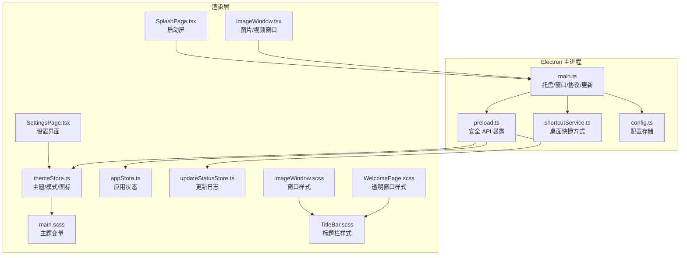
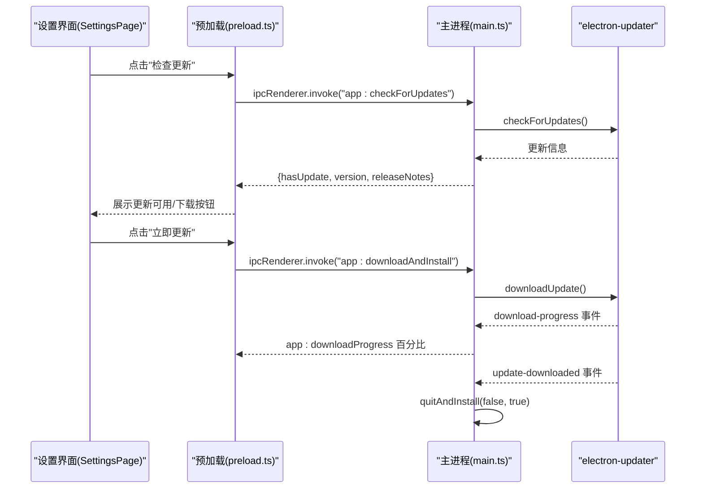
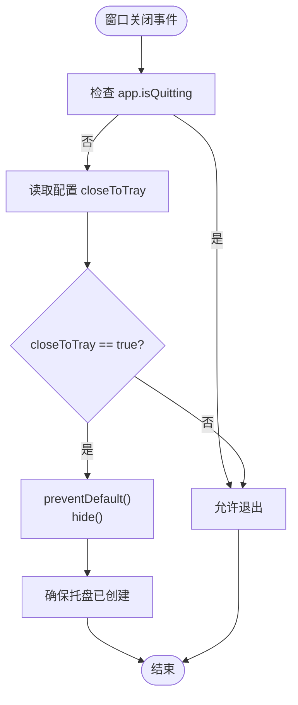
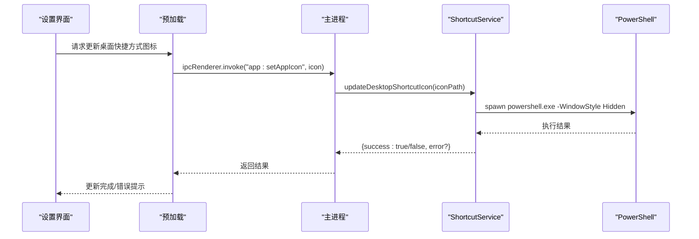
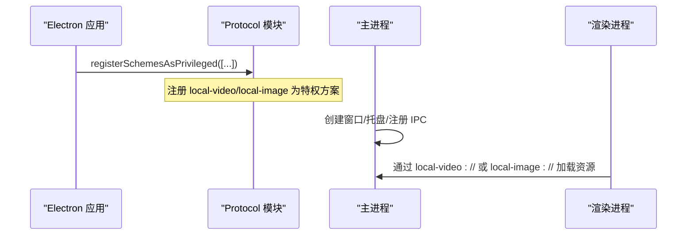
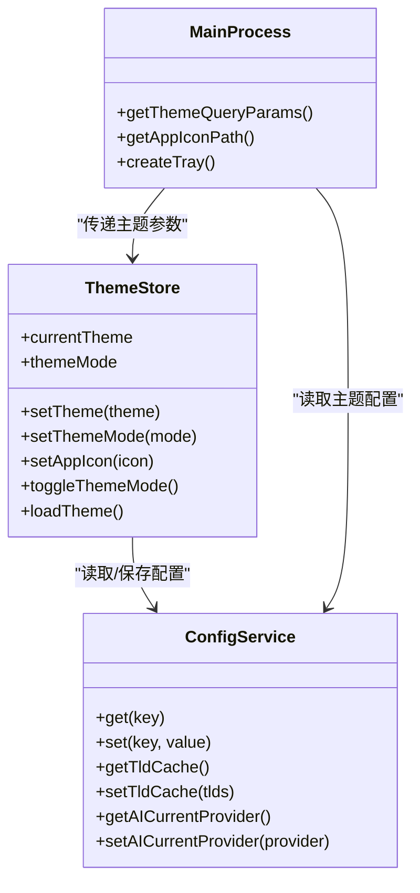
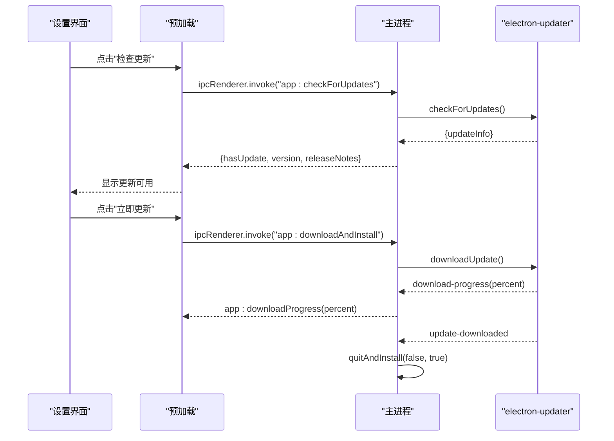
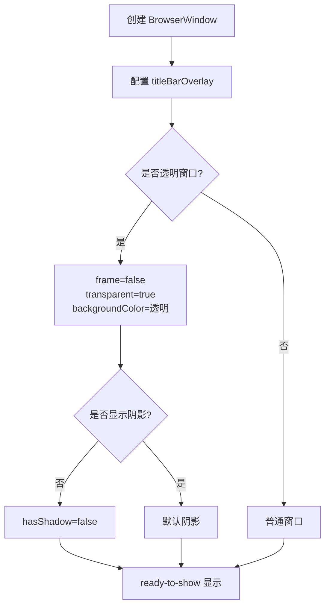
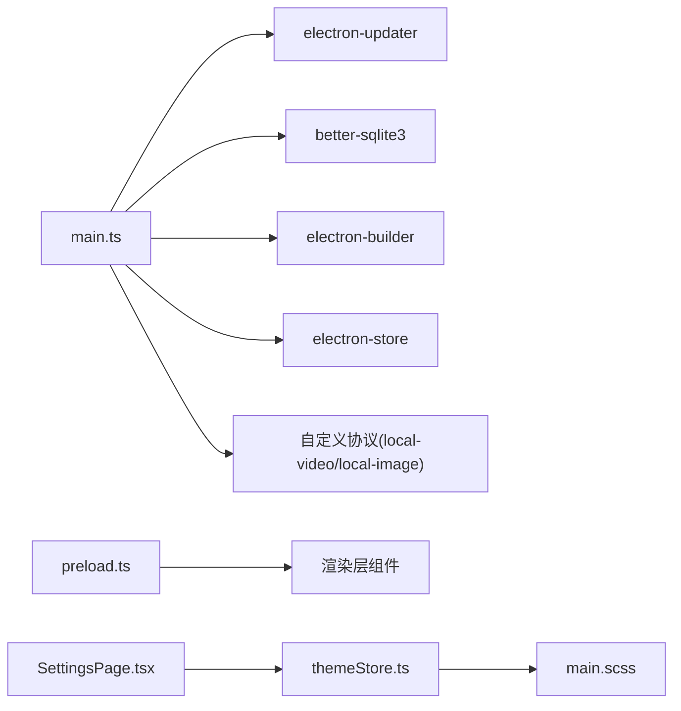

# 系统集成功能

<cite>
**本文档引用的文件**
- [electron/main.ts](file://electron/main.ts)
- [electron/preload.ts](file://electron/preload.ts)
- [electron/services/shortcutService.ts](file://electron/services/shortcutService.ts)
- [electron/services/config.ts](file://electron/services/config.ts)
- [src/stores/themeStore.ts](file://src/stores/themeStore.ts)
- [src/stores/appStore.ts](file://src/stores/appStore.ts)
- [src/stores/updateStatusStore.ts](file://src/stores/updateStatusStore.ts)
- [src/pages/SettingsPage.tsx](file://src/pages/SettingsPage.tsx)
- [src/pages/SplashPage.tsx](file://src/pages/SplashPage.tsx)
- [src/styles/main.scss](file://src/styles/main.scss)
- [src/components/TitleBar.scss](file://src/components/TitleBar.scss)
- [src/pages/ImageWindow.tsx](file://src/pages/ImageWindow.tsx)
- [src/pages/ImageWindow.scss](file://src/pages/ImageWindow.scss)
- [src/pages/WelcomePage.scss](file://src/pages/WelcomePage.scss)
- [package.json](file://package.json)
</cite>

## 目录
1. [简介](#简介)
2. [项目结构](#项目结构)
3. [核心组件](#核心组件)
4. [架构总览](#架构总览)
5. [详细组件分析](#详细组件分析)
6. [依赖关系分析](#依赖关系分析)
7. [性能考虑](#性能考虑)
8. [故障排除指南](#故障排除指南)
9. [结论](#结论)

## 简介
本文件面向 CipherTalk 的系统集成功能，围绕以下关键能力提供深入的技术文档与实现指导：
- 托盘图标：创建、菜单配置、双击事件处理、关闭到托盘行为
- 快捷键与系统集成：桌面快捷方式图标更新（PowerShell 实现）
- 文件关联与协议注册：自定义协议 schemesAsPrivileged 配置、本地视频/图片协议处理
- 系统主题跟随：nativeTheme 监听、暗色模式适配、主题持久化
- 自动更新机制：electron-updater 配置、更新检查、下载与安装流程
- 系统菜单栏集成：窗口标题栏覆盖、原生窗口控件、透明窗口与阴影效果
- 通知与交互：IPC 通信、窗口生命周期管理、启动屏与淡出通知

## 项目结构
系统集成功能主要分布在 Electron 主进程、预加载脚本、渲染层 Store 与样式中：
- Electron 主进程负责托盘、窗口、协议注册、自动更新、IPC 处理
- 预加载脚本暴露安全的 API 给渲染进程
- 渲染层 Store 管理主题、图标、更新状态等
- 样式层提供主题变量与窗口外观控制

**图表来源**
- [electron/main.ts](file://electron/main.ts)
- [electron/preload.ts](file://electron/preload.ts)
- [electron/services/shortcutService.ts](file://electron/services/shortcutService.ts)
- [electron/services/config.ts](file://electron/services/config.ts)
- [src/stores/themeStore.ts](file://src/stores/themeStore.ts)
- [src/stores/appStore.ts](file://src/stores/appStore.ts)
- [src/stores/updateStatusStore.ts](file://src/stores/updateStatusStore.ts)
- [src/pages/SettingsPage.tsx](file://src/pages/SettingsPage.tsx)
- [src/pages/SplashPage.tsx](file://src/pages/SplashPage.tsx)
- [src/styles/main.scss](file://src/styles/main.scss)
- [src/components/TitleBar.scss](file://src/components/TitleBar.scss)
- [src/pages/ImageWindow.tsx](file://src/pages/ImageWindow.tsx)
- [src/pages/ImageWindow.scss](file://src/pages/ImageWindow.scss)
- [src/pages/WelcomePage.scss](file://src/pages/WelcomePage.scss)

**章节来源**
- [electron/main.ts](file://electron/main.ts)
- [electron/preload.ts](file://electron/preload.ts)
- [src/stores/themeStore.ts](file://src/stores/themeStore.ts)
- [src/styles/main.scss](file://src/styles/main.scss)

## 核心组件
- 托盘与窗口管理：创建托盘、上下文菜单、双击显示主窗口、关闭到托盘行为
- 快捷方式服务：通过 PowerShell 遍历桌面 .lnk，更新图标
- 协议与文件关联：注册 local-video/local-image 为特权协议，支持 fetch/stream/CSP 放宽
- 主题与系统跟随：读取配置主题与模式，动态传递到子窗口，监听 nativeTheme
- 自动更新：electron-updater 配置、检查更新、下载进度、安装流程
- 系统菜单栏与窗口外观：titleBarOverlay、frameless 透明窗口、阴影控制
- IPC 与状态管理：预加载 API、Store 状态、启动屏通知

**章节来源**
- [electron/main.ts](file://electron/main.ts)
- [electron/services/shortcutService.ts](file://electron/services/shortcutService.ts)
- [electron/services/config.ts](file://electron/services/config.ts)
- [src/stores/themeStore.ts](file://src/stores/themeStore.ts)
- [src/stores/updateStatusStore.ts](file://src/stores/updateStatusStore.ts)
- [src/pages/SettingsPage.tsx](file://src/pages/SettingsPage.tsx)
- [src/pages/SplashPage.tsx](file://src/pages/SplashPage.tsx)

## 架构总览
系统集成功能采用“主进程-预加载-渲染层”的分层架构：
- 主进程负责系统级能力（托盘、协议、更新、窗口生命周期）
- 预加载脚本通过 contextBridge 暴露受控 API，确保安全隔离
- 渲染层 Store 管理主题、图标、更新状态，UI 通过 Store 与主进程交互

**图表来源**
- [electron/preload.ts](file://electron/preload.ts)
- [electron/main.ts](file://electron/main.ts)

**章节来源**
- [electron/main.ts](file://electron/main.ts)
- [electron/preload.ts](file://electron/preload.ts)

## 详细组件分析

### 托盘图标与窗口关闭行为
- 托盘创建：使用 getAppIconPath() 动态选择图标，构建上下文菜单（显示主窗口、退出）
- 双击托盘：恢复并聚焦主窗口
- 关闭行为：根据配置 closeToTray 决定最小化到托盘还是直接退出；退出时设置 app.isQuitting 标志

**图表来源**
- [electron/main.ts](file://electron/main.ts)

**章节来源**
- [electron/main.ts](file://electron/main.ts)
- [src/pages/SettingsPage.tsx](file://src/pages/SettingsPage.tsx)

### 快捷键注册与处理机制
- 快捷方式图标更新：通过 PowerShell 遍历桌面 .lnk，若目标路径匹配当前可执行文件，则更新图标
- 注意事项：可能短暂显示控制台窗口或被杀毒软件拦截，使用 -WindowStyle Hidden 隐藏窗口

**图表来源**
- [electron/preload.ts](file://electron/preload.ts)
- [electron/main.ts](file://electron/main.ts)
- [electron/services/shortcutService.ts](file://electron/services/shortcutService.ts)

**章节来源**
- [electron/services/shortcutService.ts](file://electron/services/shortcutService.ts)
- [electron/main.ts](file://electron/main.ts)
- [electron/preload.ts](file://electron/preload.ts)

### 文件关联与协议注册
- 自定义协议注册：在 app ready 之前调用 protocol.registerSchemesAsPrivileged，注册 local-video 与 local-image
- 权限配置：secure=true、supportFetchAPI=true、stream=true、bypassCSP=true
- 应用图标：通过 getAppIconPath() 动态选择图标路径（开发/生产）

**图表来源**
- [electron/main.ts](file://electron/main.ts)

**章节来源**
- [electron/main.ts](file://electron/main.ts)

### 系统主题跟随与暗色模式适配
- 主题持久化：ConfigService 存储 theme、themeMode、appIcon 等配置
- 主题传递：getThemeQueryParams() 将主题与模式作为查询参数传递给子窗口，避免闪烁
- 渲染层样式：main.scss 定义各主题在 light/dark 模式下的 CSS 变量
- 图标切换：setAppIcon() 更新所有窗口图标，并异步尝试更新桌面快捷方式图标

**图表来源**
- [electron/services/config.ts](file://electron/services/config.ts)
- [src/stores/themeStore.ts](file://src/stores/themeStore.ts)
- [electron/main.ts](file://electron/main.ts)

**章节来源**
- [electron/services/config.ts](file://electron/services/config.ts)
- [src/stores/themeStore.ts](file://src/stores/themeStore.ts)
- [electron/main.ts](file://electron/main.ts)
- [src/styles/main.scss](file://src/styles/main.scss)

### 自动更新机制
- 配置策略：autoDownload=false、autoInstallOnAppQuit=true、disableDifferentialDownload=true
- 检查更新：ipcMain.handle("app:checkForUpdates") 调用 autoUpdater.checkForUpdates()
- 下载与安装：ipcMain.handle("app:downloadAndInstall") 监听 download-progress 与 update-downloaded，最后 quitAndInstall
- 版本比较：isNewerVersion() 实现语义化版本比较

**图表来源**
- [electron/main.ts](file://electron/main.ts)
- [electron/preload.ts](file://electron/preload.ts)

**章节来源**
- [electron/main.ts](file://electron/main.ts)
- [electron/preload.ts](file://electron/preload.ts)
- [src/pages/SettingsPage.tsx](file://src/pages/SettingsPage.tsx)
- [src/stores/updateStatusStore.ts](file://src/stores/updateStatusStore.ts)

### 系统菜单栏集成与窗口外观
- 标题栏覆盖：titleBarOverlay 配置 color/symbolColor/height，支持动态更新
- 透明窗口：frame=false、transparent=true、backgroundColor=#00000000、hasShadow=false
- 阴影效果：部分窗口关闭阴影（如欢迎页），部分窗口启用标题栏覆盖
- 启动屏：SplashPage.tsx 在入场动画完成后通过 window.splashReady 通知主进程，随后接收 splash:fadeOut 事件触发淡出

**图表来源**
- [electron/main.ts](file://electron/main.ts)
- [src/pages/SplashPage.tsx](file://src/pages/SplashPage.tsx)
- [src/pages/WelcomePage.scss](file://src/pages/WelcomePage.scss)
- [src/pages/ImageWindow.scss](file://src/pages/ImageWindow.scss)
- [src/components/TitleBar.scss](file://src/components/TitleBar.scss)

**章节来源**
- [electron/main.ts](file://electron/main.ts)
- [src/pages/SplashPage.tsx](file://src/pages/SplashPage.tsx)
- [src/pages/WelcomePage.scss](file://src/pages/WelcomePage.scss)
- [src/pages/ImageWindow.scss](file://src/pages/ImageWindow.scss)
- [src/components/TitleBar.scss](file://src/components/TitleBar.scss)

### 通知与交互
- IPC 通信：preload.ts 暴露 window:*、app:*、config:* 等 API，渲染层通过 window.electronAPI.* 调用
- 启动屏通知：SplashPage.tsx 通过 window.splashReady 与 onSplashFadeOut 与主进程通信
- 图片窗口联动：ImageWindow.tsx 监听主进程的 imageViewer:setImageList 事件，实现图片/视频浏览联动

**章节来源**
- [electron/preload.ts](file://electron/preload.ts)
- [src/pages/SplashPage.tsx](file://src/pages/SplashPage.tsx)
- [src/pages/ImageWindow.tsx](file://src/pages/ImageWindow.tsx)

## 依赖关系分析
- electron-updater：自动更新核心，配置于主进程
- better-sqlite3：配置数据库，提供配置持久化
- electron-store：轻量配置存储（主进程侧）
- electron-builder：打包与发布，包含 NSIS 安装器与额外资源
- ffmpeg-static/silk-wasm/sherpa-onnx-node/koffi：多媒体与语音处理相关依赖

**图表来源**
- [electron/main.ts](file://electron/main.ts)
- [electron/preload.ts](file://electron/preload.ts)
- [src/stores/themeStore.ts](file://src/stores/themeStore.ts)
- [src/styles/main.scss](file://src/styles/main.scss)
- [package.json](file://package.json)

**章节来源**
- [package.json](file://package.json)
- [electron/main.ts](file://electron/main.ts)

## 性能考虑
- 自动更新：禁用差分更新（disableDifferentialDownload=true）确保稳定性；下载进度通过 IPC 推送，避免阻塞 UI
- 窗口创建：统一使用 titleBarOverlay 减少原生标题栏绘制开销；透明窗口仅在需要时启用
- 主题传递：通过查询参数一次性传递主题，避免多次重绘
- 快捷方式更新：使用 PowerShell 批量处理 .lnk，注意隐藏控制台窗口减少干扰

## 故障排除指南
- 检查更新失败：确认网络可达与发布服务器 URL 正确；查看主进程日志输出
- 自动更新下载卡住：检查下载进度事件是否持续推送；确认磁盘空间充足
- 托盘菜单无响应：确认托盘已创建且上下文菜单模板正确；双击事件绑定在 tray.on('double-click')
- 快捷方式图标未更新：确认 PowerShell 权限与杀软拦截；检查 .lnk 目标路径匹配
- 透明窗口阴影异常：检查 hasShadow 与 backgroundColor 配置；不同窗口类型需分别设置
- 主题切换闪烁：确认子窗口加载时携带 theme 与 mode 查询参数；确保 CSS 变量已生效

**章节来源**
- [electron/main.ts](file://electron/main.ts)
- [electron/preload.ts](file://electron/preload.ts)
- [electron/services/shortcutService.ts](file://electron/services/shortcutService.ts)
- [src/pages/SettingsPage.tsx](file://src/pages/SettingsPage.tsx)

## 结论
CipherTalk 的系统集成功能通过主进程-预加载-渲染层的清晰分工，实现了托盘、协议、主题、自动更新、窗口外观等核心系统能力。借助 electron-updater 的稳定更新流程、nativeTheme 的主题跟随、以及精细的窗口配置，应用在 Windows 平台上提供了良好的用户体验与可维护性。建议在后续迭代中进一步完善快捷方式更新的权限提示与回退策略，并优化自动更新的差分更新支持以提升下载效率。