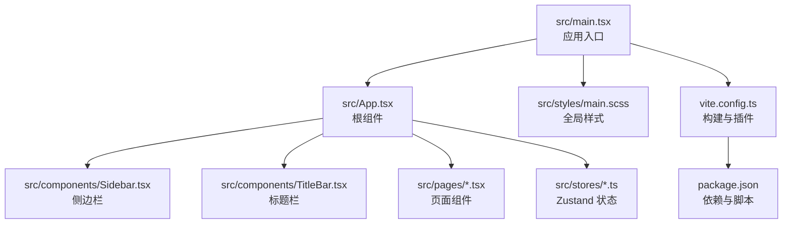
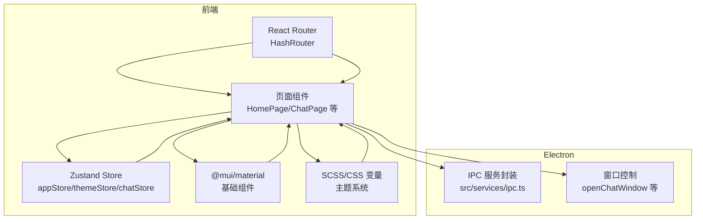
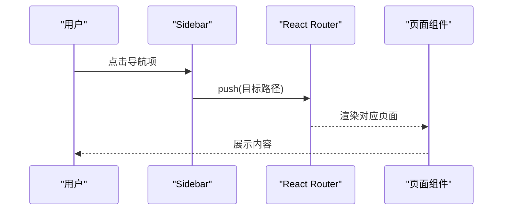
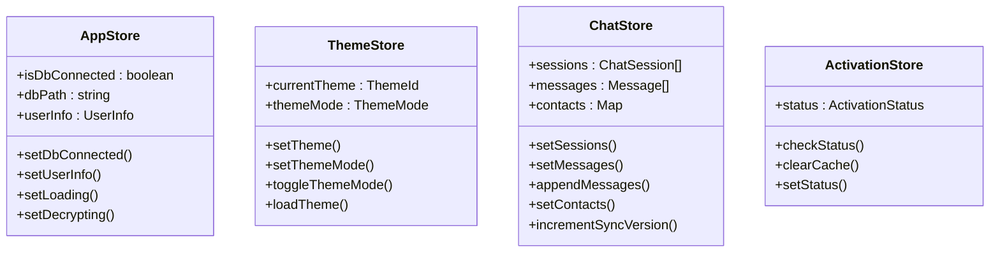
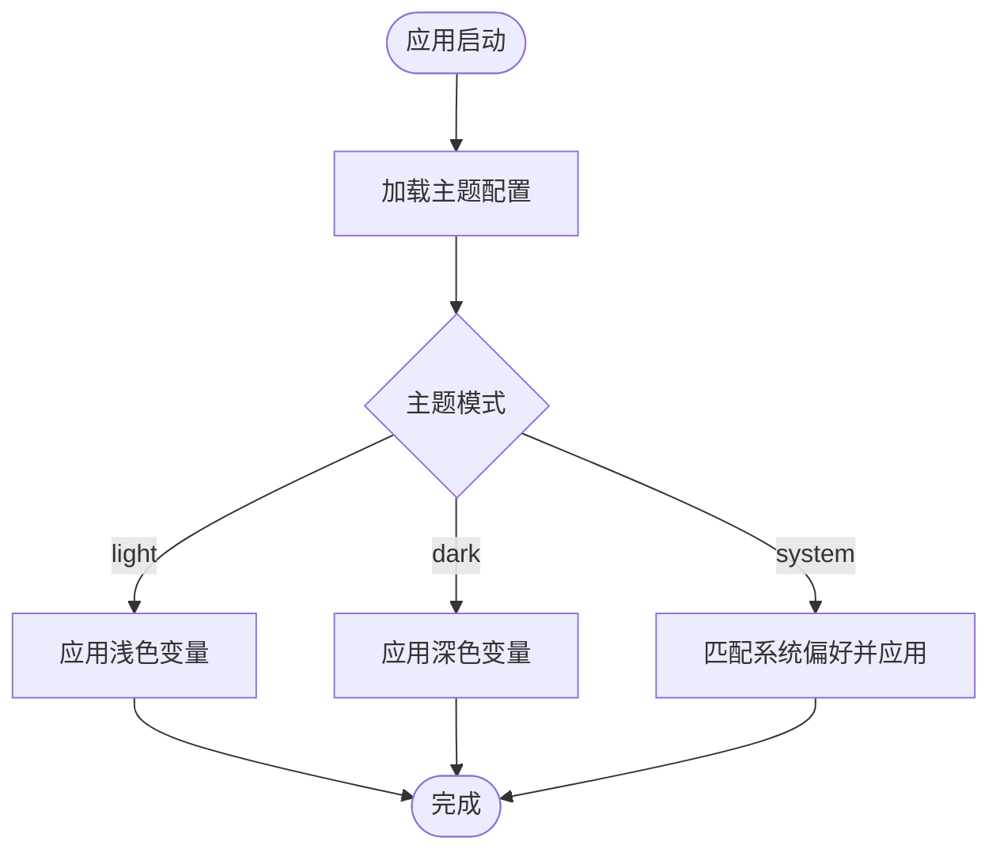
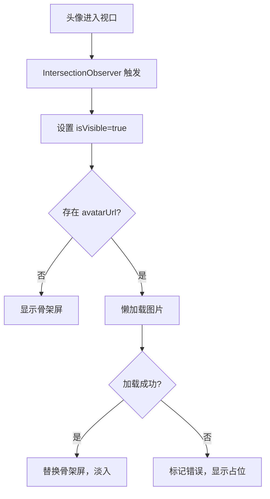
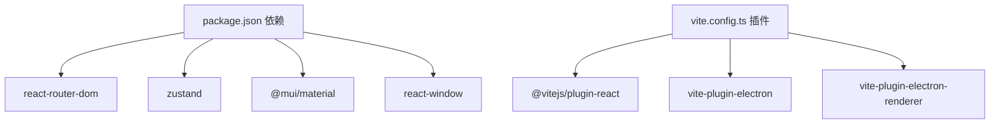

# React 前端开发

<cite>
**本文档引用的文件**
- [src/main.tsx](file://src/main.tsx)
- [src/App.tsx](file://src/App.tsx)
- [vite.config.ts](file://vite.config.ts)
- [package.json](file://package.json)
- [src/styles/main.scss](file://src/styles/main.scss)
- [src/components/Sidebar.tsx](file://src/components/Sidebar.tsx)
- [src/components/TitleBar.tsx](file://src/components/TitleBar.tsx)
- [src/pages/HomePage.tsx](file://src/pages/HomePage.tsx)
- [src/pages/ChatPage.tsx](file://src/pages/ChatPage.tsx)
- [src/stores/appStore.ts](file://src/stores/appStore.ts)
- [src/stores/themeStore.ts](file://src/stores/themeStore.ts)
- [src/stores/chatStore.ts](file://src/stores/chatStore.ts)
- [src/stores/activationStore.ts](file://src/stores/activationStore.ts)
- [src/utils/lruCache.ts](file://src/utils/lruCache.ts)
- [src/services/ipc.ts](file://src/services/ipc.ts)
</cite>

## 目录
1. [简介](#简介)
2. [项目结构](#项目结构)
3. [核心组件](#核心组件)
4. [架构总览](#架构总览)
5. [详细组件分析](#详细组件分析)
6. [依赖关系分析](#依赖关系分析)
7. [性能考虑](#性能考虑)
8. [故障排查指南](#故障排查指南)
9. [结论](#结论)
10. [附录](#附录)

## 简介
本指南面向 React 开发者，围绕 CipherTalk 的前端部分提供系统化的开发指导。内容涵盖组件架构（函数组件 + Hooks）、路由与导航、状态管理（Zustand）、样式系统（SCSS + CSS 变量主题）、UI 组件库（Material UI）使用与定制、性能优化策略（懒加载、虚拟滚动、缓存）、以及开发工具与调试技巧。文档以仓库现有实现为依据，结合可视化图示帮助读者快速理解与高效开发。

## 项目结构
前端采用 React + Vite 构建，配合 Electron 主进程进行桌面端集成。入口文件负责挂载 HashRouter 与全局样式，App 根组件组织页面路由、侧边栏、标题栏、协议与激活流程、主题与锁屏等横切关注点。

图表来源
- [src/main.tsx:1-14](file://src/main.tsx#L1-L14)
- [src/App.tsx:1-538](file://src/App.tsx#L1-L538)
- [src/components/Sidebar.tsx:1-355](file://src/components/Sidebar.tsx#L1-L355)
- [src/components/TitleBar.tsx:1-52](file://src/components/TitleBar.tsx#L1-L52)
- [src/styles/main.scss:1-427](file://src/styles/main.scss#L1-L427)
- [vite.config.ts:1-78](file://vite.config.ts#L1-L78)
- [package.json:1-169](file://package.json#L1-L169)

章节来源
- [src/main.tsx:1-14](file://src/main.tsx#L1-L14)
- [vite.config.ts:15-78](file://vite.config.ts#L15-L78)
- [package.json:8-169](file://package.json#L8-L169)

## 核心组件
- 函数组件 + Hooks：App、Sidebar、TitleBar、HomePage、ChatPage 等均采用函数组件与 Hooks（useState、useEffect、useMemo、useCallback 等）组织逻辑，便于状态管理与副作用控制。
- 组件层级：App 作为根容器，内部组合 TitleBar、Sidebar、主内容区与路由守卫；各页面组件承载具体业务。
- 复用策略：通过 Hooks 抽象状态与副作用（如 useChatStore、useThemeStore），在多个组件间共享；通过工具类（LRU 缓存）与服务封装（IPC 封装）提升可复用性。

章节来源
- [src/App.tsx:40-538](file://src/App.tsx#L40-L538)
- [src/components/Sidebar.tsx:37-355](file://src/components/Sidebar.tsx#L37-L355)
- [src/components/TitleBar.tsx:13-52](file://src/components/TitleBar.tsx#L13-L52)
- [src/pages/HomePage.tsx:16-175](file://src/pages/HomePage.tsx#L16-L175)
- [src/pages/ChatPage.tsx:210-800](file://src/pages/ChatPage.tsx#L210-L800)

## 架构总览
应用采用“前端路由 + Electron IPC”的混合架构：前端负责 UI 与交互，Electron 提供系统能力与跨平台窗口控制；Zustand 管理应用级状态；Material UI 提供基础组件；SCSS 与 CSS 变量实现主题系统与响应式设计。

图表来源
- [src/main.tsx:3-13](file://src/main.tsx#L3-L13)
- [src/App.tsx:507-521](file://src/App.tsx#L507-L521)
- [src/services/ipc.ts:1-38](file://src/services/ipc.ts#L1-L38)
- [src/stores/appStore.ts:40-97](file://src/stores/appStore.ts#L40-L97)
- [src/stores/themeStore.ts:79-140](file://src/stores/themeStore.ts#L79-L140)
- [src/stores/chatStore.ts:51-146](file://src/stores/chatStore.ts#L51-L146)

## 详细组件分析

### 路由系统与导航设计
- 路由配置：在 App 中使用 HashRouter 与 Routes/Route 定义页面路径，结合 RouteGuard 控制访问权限；支持独立窗口（聊天、群聊分析、朋友圈、年度报告、AI 摘要、聊天记录、引导、图片查看、视频播放、协议、浏览器窗口）的特殊渲染分支。
- 页面跳转与参数传递：使用 NavLink/Link 与 useNavigate 实现页面跳转；路由参数通过 URL 参数传递（如聊天历史详情）。
- 导航设计：Sidebar 作为主导航，支持折叠、图标与标签切换、悬停提示、选中态高亮；TitleBar 展示应用图标、标题与更新状态指示。

图表来源
- [src/components/Sidebar.tsx:75-85](file://src/components/Sidebar.tsx#L75-L85)
- [src/App.tsx:507-521](file://src/App.tsx#L507-L521)

章节来源
- [src/App.tsx:184-344](file://src/App.tsx#L184-L344)
- [src/components/Sidebar.tsx:37-355](file://src/components/Sidebar.tsx#L37-L355)
- [src/components/TitleBar.tsx:13-52](file://src/components/TitleBar.tsx#L13-L52)

### 状态管理策略（Zustand）
- Store 设计模式：每个领域（应用、主题、聊天、激活）独立 store，职责清晰；通过 create 创建，集中管理状态与派生计算。
- 状态同步机制：App 通过监听 Electron 事件（更新可用、会话更新、下载进度）同步 store 状态；页面组件通过 useStore 订阅状态变化，驱动 UI 更新。
- 典型 store：
  - appStore：数据库连接、用户信息、加载与解密进度等。
  - themeStore：主题 ID、主题模式、应用图标、主题持久化与加载。
  - chatStore：会话列表、消息列表、联系人缓存、搜索关键字、同步版本号等。
  - activationStore：激活状态检查、缓存清理、状态设置。

图表来源
- [src/stores/appStore.ts:10-97](file://src/stores/appStore.ts#L10-L97)
- [src/stores/themeStore.ts:67-140](file://src/stores/themeStore.ts#L67-L140)
- [src/stores/chatStore.ts:4-146](file://src/stores/chatStore.ts#L4-L146)
- [src/stores/activationStore.ts:4-45](file://src/stores/activationStore.ts#L4-L45)

章节来源
- [src/App.tsx:60-168](file://src/App.tsx#L60-L168)
- [src/stores/appStore.ts:40-97](file://src/stores/appStore.ts#L40-L97)
- [src/stores/themeStore.ts:79-140](file://src/stores/themeStore.ts#L79-L140)
- [src/stores/chatStore.ts:51-146](file://src/stores/chatStore.ts#L51-L146)
- [src/stores/activationStore.ts:15-45](file://src/stores/activationStore.ts#L15-L45)

### 样式系统：SCSS + CSS 变量主题
- SCSS 配置：全局样式 main.scss 引入聊天背景样式，统一定义变量、主题映射、基础组件样式与通用类名。
- CSS 变量主题系统：通过 data-theme 与 data-mode 属性切换主题与明暗模式；支持多种主题（云上舞白、刚玉蓝、冰猕猴桃汁绿、辛辣红、明水鸭色、新年快乐、樱雾粉）与明/暗/系统模式联动。
- 响应式设计：通过媒体查询与弹性布局适配不同屏幕尺寸；滚动条、按钮、卡片等基础组件样式统一管理。

图表来源
- [src/App.tsx:69-88](file://src/App.tsx#L69-L88)
- [src/stores/themeStore.ts:118-139](file://src/stores/themeStore.ts#L118-L139)
- [src/styles/main.scss:4-321](file://src/styles/main.scss#L4-L321)

章节来源
- [src/styles/main.scss:1-427](file://src/styles/main.scss#L1-L427)
- [src/App.tsx:69-88](file://src/App.tsx#L69-L88)
- [src/stores/themeStore.ts:79-140](file://src/stores/themeStore.ts#L79-L140)

### UI 组件库使用与自定义
- Material UI：Sidebar、TitleBar 等使用 @mui/material 的 Drawer、List、ListItem、Avatar、Tooltip 等组件，结合 sx 属性实现主题化样式。
- 自定义：通过 CSS 变量覆盖 MUI 样式；为导航项、头像、按钮等提供统一的样式规范与过渡动画。

章节来源
- [src/components/Sidebar.tsx:3-15](file://src/components/Sidebar.tsx#L3-L15)
- [src/components/TitleBar.tsx:1-6](file://src/components/TitleBar.tsx#L1-L6)
- [src/styles/main.scss:366-427](file://src/styles/main.scss#L366-L427)

### 性能优化策略
- 懒加载：ChatPage 中头像组件使用 IntersectionObserver 与图片懒加载，减少初始渲染压力；Skeleton 骨架屏提升感知性能。
- 虚拟滚动：使用 react-window 的 List 进行会话列表渲染，仅渲染可视区域元素，降低 DOM 节点数量。
- 缓存机制：LRU 缓存用于限制内存中缓存对象数量；聊天 store 内部对消息进行去重与智能合并，避免不必要的重渲染。
- 事件与副作用优化：useMemo/useCallback 缓存计算结果与回调；useEffect 清理与条件触发，避免重复订阅与无效更新。

图表来源
- [src/pages/ChatPage.tsx:42-166](file://src/pages/ChatPage.tsx#L42-L166)
- [src/utils/lruCache.ts:5-51](file://src/utils/lruCache.ts#L5-L51)
- [src/stores/chatStore.ts:89-110](file://src/stores/chatStore.ts#L89-L110)

章节来源
- [src/pages/ChatPage.tsx:168-208](file://src/pages/ChatPage.tsx#L168-L208)
- [src/pages/ChatPage.tsx:476-540](file://src/pages/ChatPage.tsx#L476-L540)
- [src/utils/lruCache.ts:1-51](file://src/utils/lruCache.ts#L1-L51)
- [src/stores/chatStore.ts:51-146](file://src/stores/chatStore.ts#L51-L146)

### 开发工具与调试技巧
- Vite：热更新、TypeScript 支持、Electron 插件链路；别名 @ 指向 src，简化导入路径。
- Electron 集成：通过 window.electronAPI 暴露 IPC 接口，App 在 useEffect 中监听更新事件并同步 store。
- IPC 封装：services/ipc.ts 提供配置、数据库、解密、对话框、窗口控制等封装，统一调用入口。
- 调试建议：利用浏览器 DevTools 的 React Profiler 分析渲染热点；在 ChatPage 中通过日志定位消息加载与增量推送问题；在 Sidebar/TitleBar 中检查主题切换与更新指示器状态。

章节来源
- [vite.config.ts:15-78](file://vite.config.ts#L15-L78)
- [src/services/ipc.ts:1-38](file://src/services/ipc.ts#L1-L38)
- [src/App.tsx:136-178](file://src/App.tsx#L136-L178)

## 依赖关系分析
- 外部依赖：React、React Router、@emotion、@mui/material、zustand、echarts、react-window、react-virtualized-auto-sizer 等。
- 构建与打包：Vite 配置包含 React 插件、Electron 插件链、renderer 插件、路径别名与构建输出目录；Electron 打包配置在 package.json 的 build 字段中定义。

图表来源
- [package.json:20-56](file://package.json#L20-L56)
- [vite.config.ts:21-66](file://vite.config.ts#L21-L66)

章节来源
- [package.json:20-169](file://package.json#L20-L169)
- [vite.config.ts:15-78](file://vite.config.ts#L15-L78)

## 性能考虑
- 渲染优化：使用 react-window 虚拟滚动渲染长列表；useMemo/useCallback 缓存计算与回调；避免在渲染期间创建新对象。
- 网络与 I/O：通过 IPC 异步调用后端能力，避免阻塞主线程；对频繁触发的事件（滚动、搜索）进行节流/防抖。
- 内存管理：LRU 缓存限制缓存大小；及时清理事件监听与定时器；组件卸载时取消当前会话绑定。
- 图片与资源：头像懒加载与骨架屏；图片解密与转写等耗时任务显示进度与禁用交互。

章节来源
- [src/pages/ChatPage.tsx:168-208](file://src/pages/ChatPage.tsx#L168-L208)
- [src/pages/ChatPage.tsx:476-540](file://src/pages/ChatPage.tsx#L476-L540)
- [src/utils/lruCache.ts:1-51](file://src/utils/lruCache.ts#L1-L51)

## 故障排查指南
- 协议与激活：若协议弹窗未关闭或激活状态异常，检查 App 中协议与激活状态的 useEffect 逻辑与 store 的初始化标志位。
- 主题切换：若主题未生效，确认 data-theme/data-mode 是否正确设置，以及 themeStore 的 loadTheme 与 setTheme 调用链。
- 数据库连接：若自动连接失败，检查配置读取与连接参数；在 ChatPage 中观察连接与消息加载日志。
- 更新与增量同步：若更新提示不出现或同步异常，检查 Electron 事件监听与 updateStatusStore 的状态更新。
- IPC 调用：若某些功能不可用，检查 services/ipc.ts 的封装方法与 window.electronAPI 的可用性。

章节来源
- [src/App.tsx:90-130](file://src/App.tsx#L90-L130)
- [src/App.tsx:136-178](file://src/App.tsx#L136-L178)
- [src/stores/themeStore.ts:118-139](file://src/stores/themeStore.ts#L118-L139)
- [src/services/ipc.ts:1-38](file://src/services/ipc.ts#L1-L38)

## 结论
本项目以函数组件 + Hooks 为核心，结合 Zustand 实现轻量、可维护的状态管理；通过 Material UI 与 SCSS/CSS 变量构建统一的主题与视觉体系；借助虚拟滚动、懒加载与 LRU 缓存等手段保障性能；通过 Electron IPC 与 Vite 插件链路实现跨平台桌面应用体验。遵循本文档的架构与实践建议，可在保证一致性的同时高效迭代功能。

## 附录
- 快速启动：运行 npm run dev 启动开发服务器；使用 npm run build 进行打包。
- 目录约定：src/components 存放可复用 UI 组件；src/pages 存放页面级组件；src/stores 存放状态管理；src/styles 存放样式；src/utils 存放工具；src/services 封装 IPC 与业务服务。

章节来源
- [package.json:8-19](file://package.json#L8-L19)
- [vite.config.ts:15-78](file://vite.config.ts#L15-L78)