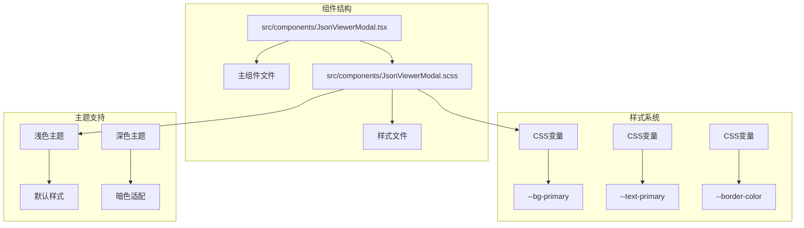
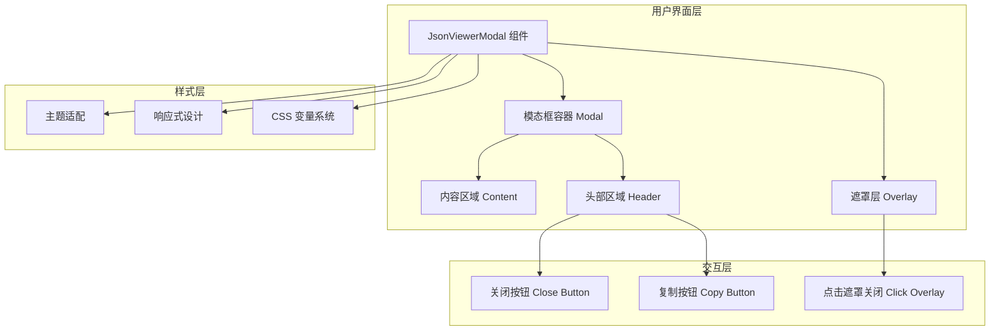
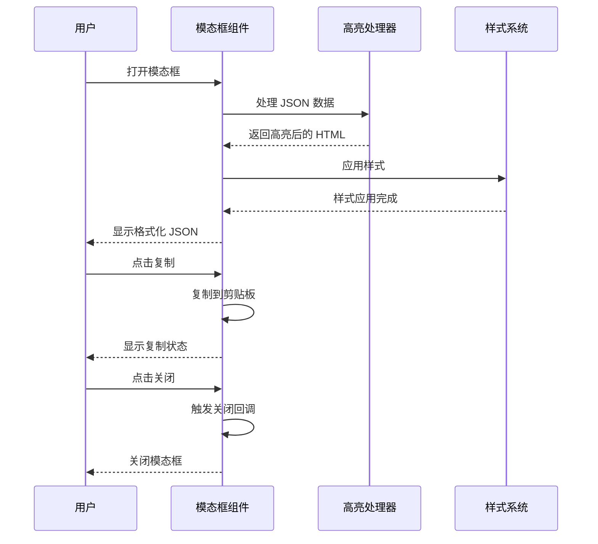
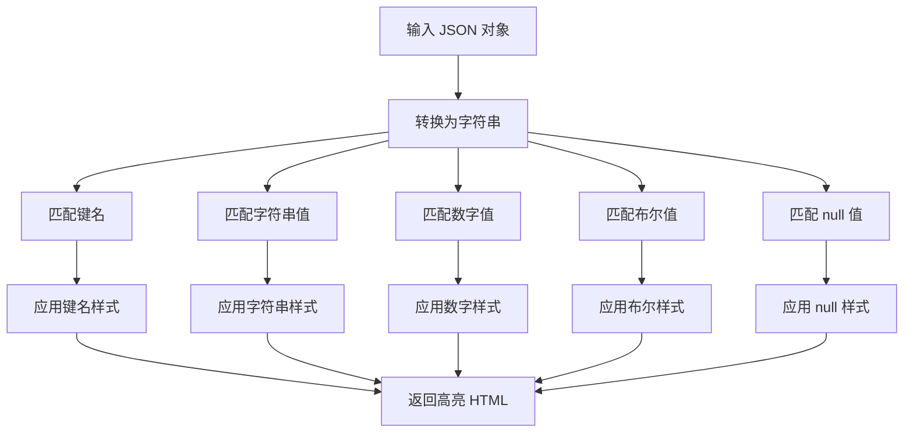
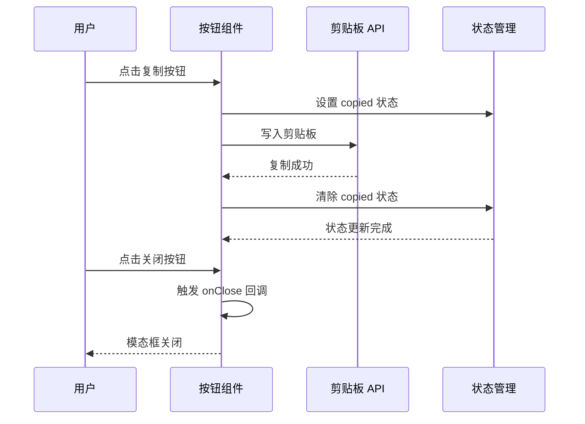
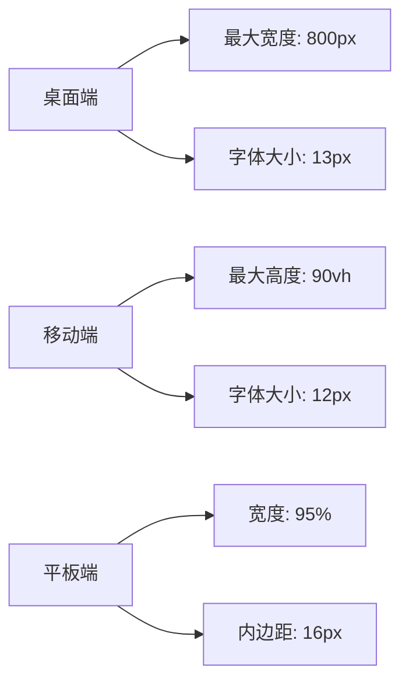
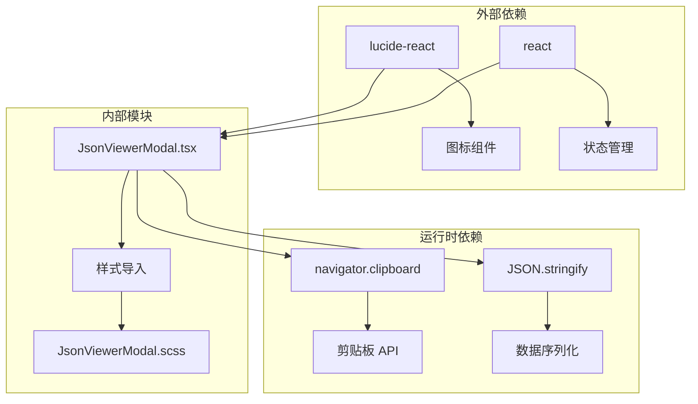
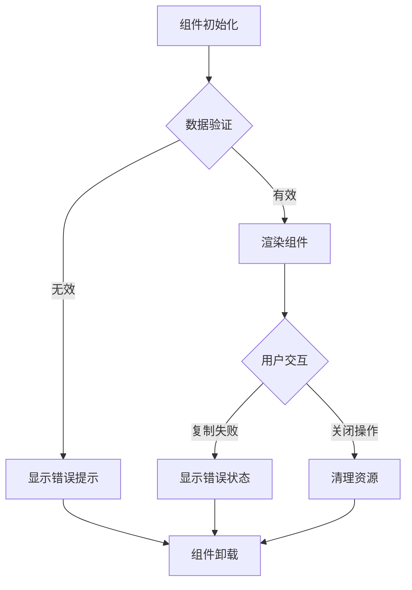

# JSON 查看器模态框

<cite>
**本文档引用的文件**
- [JsonViewerModal.tsx](file://src/components/JsonViewerModal.tsx)
- [JsonViewerModal.scss](file://src/components/JsonViewerModal.scss)
</cite>

## 目录
1. [简介](#简介)
2. [项目结构](#项目结构)
3. [核心组件](#核心组件)
4. [架构概览](#架构概览)
5. [详细组件分析](#详细组件分析)
6. [依赖关系分析](#依赖关系分析)
7. [性能考虑](#性能考虑)
8. [故障排除指南](#故障排除指南)
9. [结论](#结论)
10. [附录](#附录)

## 简介

JSON 查看器模态框是一个轻量级的 React 组件，专门用于在应用中展示 JSON 数据。该组件提供了完整的 JSON 数据可视化解决方案，包括格式化输出、语法高亮、用户交互功能等特性。

该组件采用现代化的设计理念，支持响应式布局、暗色主题适配，并提供了流畅的动画效果。组件设计简洁而功能完整，能够满足大多数 JSON 数据展示需求。

## 项目结构

JSON 查看器模态框位于项目的组件目录中，采用标准的 React 组件结构：



**图表来源**
- [JsonViewerModal.tsx:1-68](file://src/components/JsonViewerModal.tsx#L1-L68)
- [JsonViewerModal.scss:1-228](file://src/components/JsonViewerModal.scss#L1-L228)

**章节来源**
- [JsonViewerModal.tsx:1-68](file://src/components/JsonViewerModal.tsx#L1-L68)
- [JsonViewerModal.scss:1-228](file://src/components/JsonViewerModal.scss#L1-L228)

## 核心组件

### 组件接口定义

组件通过 TypeScript 接口定义了清晰的属性规范：

```typescript
interface JsonViewerModalProps {
  data: any
  title?: string
  onClose: () => void
}
```

**关键属性说明：**
- `data`: 必需参数，支持任意类型的 JSON 数据
- `title`: 可选参数，自定义模态框标题，默认为"原始数据"
- `onClose`: 必需回调函数，处理模态框关闭事件

### 主要功能特性

1. **弹窗显示机制**: 实现了完整的模态框显示逻辑
2. **遮罩层支持**: 提供半透明背景遮罩效果
3. **居中定位**: 自动实现水平和垂直居中
4. **语法高亮**: 内置 JSON 语法高亮功能
5. **用户交互**: 支持复制、关闭等操作

**章节来源**
- [JsonViewerModal.tsx:5-9](file://src/components/JsonViewerModal.tsx#L5-L9)
- [JsonViewerModal.tsx:23-67](file://src/components/JsonViewerModal.tsx#L23-L67)

## 架构概览

### 整体架构设计



**图表来源**
- [JsonViewerModal.tsx:42-66](file://src/components/JsonViewerModal.tsx#L42-L66)
- [JsonViewerModal.scss:1-228](file://src/components/JsonViewerModal.scss#L1-L228)

### 数据流架构



**图表来源**
- [JsonViewerModal.tsx:12-21](file://src/components/JsonViewerModal.tsx#L12-L21)
- [JsonViewerModal.tsx:28-34](file://src/components/JsonViewerModal.tsx#L28-L34)
- [JsonViewerModal.tsx:36-40](file://src/components/JsonViewerModal.tsx#L36-L40)

## 详细组件分析

### 组件类图

```mermaid
classDiagram
class JsonViewerModal {
+data : any
+title : string
+onClose : Function
+copied : boolean
+highlightedJson : string
+handleCopy() void
+handleOverlayClick(e) void
+highlightJson(obj) string
}
class JsonViewerModalProps {
+data : any
+title? : string
+onClose : () => void
}
JsonViewerModal --> JsonViewerModalProps : implements
JsonViewerModal --> "uses" : highlightJson
JsonViewerModal --> "uses" : useMemo
JsonViewerModal --> "uses" : useState
```

**图表来源**
- [JsonViewerModal.tsx:5-9](file://src/components/JsonViewerModal.tsx#L5-L9)
- [JsonViewerModal.tsx:23-67](file://src/components/JsonViewerModal.tsx#L23-L67)

### 核心实现分析

#### 语法高亮功能

组件实现了基础的 JSON 语法高亮功能，通过正则表达式匹配不同数据类型：



**图表来源**
- [JsonViewerModal.tsx:12-21](file://src/components/JsonViewerModal.tsx#L12-L21)

#### 用户交互流程



**图表来源**
- [JsonViewerModal.tsx:28-34](file://src/components/JsonViewerModal.tsx#L28-L34)
- [JsonViewerModal.tsx:56-58](file://src/components/JsonViewerModal.tsx#L56-L58)

**章节来源**
- [JsonViewerModal.tsx:12-21](file://src/components/JsonViewerModal.tsx#L12-L21)
- [JsonViewerModal.tsx:28-34](file://src/components/JsonViewerModal.tsx#L28-L34)
- [JsonViewerModal.tsx:36-40](file://src/components/JsonViewerModal.tsx#L36-L40)

### 样式系统分析

#### CSS 变量体系

组件采用了现代 CSS 变量系统，支持主题切换：

| CSS 变量 | 默认值 | 用途 |
|---------|--------|------|
| `--bg-primary` | `#ffffff` | 主背景色 |
| `--bg-secondary` | `#f9fafb` | 次级背景色 |
| `--text-primary` | `#1f2937` | 主要文字颜色 |
| `--text-secondary` | `#6b7280` | 次要文字颜色 |
| `--border-color` | `#e5e7eb` | 边框颜色 |
| `--bg-code` | `#1e1e1e` | 代码背景色 |

#### 响应式设计

组件支持多种屏幕尺寸的自适应：



**图表来源**
- [JsonViewerModal.scss:200-227](file://src/components/JsonViewerModal.scss#L200-L227)

**章节来源**
- [JsonViewerModal.scss:1-228](file://src/components/JsonViewerModal.scss#L1-L228)

## 依赖关系分析

### 组件依赖图



**图表来源**
- [JsonViewerModal.tsx:1](file://src/components/JsonViewerModal.tsx#L1)
- [JsonViewerModal.tsx:2](file://src/components/JsonViewerModal.tsx#L2)

### 性能依赖分析

组件的性能主要依赖于以下因素：

1. **数据大小**: JSON 字符串长度影响渲染性能
2. **复杂度**: 嵌套层级深度影响高亮处理时间
3. **DOM 更新**: React 的虚拟 DOM diff 算法
4. **内存使用**: 大型 JSON 对象的内存占用

**章节来源**
- [JsonViewerModal.tsx:26](file://src/components/JsonViewerModal.tsx#L26)
- [JsonViewerModal.tsx:29](file://src/components/JsonViewerModal.tsx#L29)

## 性能考虑

### 优化策略

#### 1. 记忆化处理
组件使用 `useMemo` 进行计算结果缓存，避免重复的 JSON 高亮处理：

```typescript
const highlightedJson = useMemo(() => highlightJson(data), [data])
```

#### 2. 条件渲染
仅在数据变化时重新计算高亮结果，减少不必要的 DOM 更新。

#### 3. 内存管理
对于大型 JSON 对象，建议：
- 使用分页显示
- 实施虚拟滚动
- 提供数据截断功能

### 性能监控指标

| 指标 | 正常范围 | 优化建议 |
|------|----------|----------|
| 渲染时间 | < 100ms | 检查数据大小 |
| 内存使用 | < 50MB | 实施数据分页 |
| 响应时间 | < 50ms | 优化高亮算法 |

## 故障排除指南

### 常见问题及解决方案

#### 1. JSON 格式错误
**问题**: JSON 字符串无法正确解析
**解决方案**: 
- 确保输入数据为有效 JSON
- 使用 `JSON.parse()` 进行验证
- 实施错误边界处理

#### 2. 复制功能失效
**问题**: 复制按钮无法正常工作
**解决方案**:
- 检查浏览器权限设置
- 确认 HTTPS 环境
- 验证剪贴板 API 可用性

#### 3. 样式显示异常
**问题**: 模态框样式不符合预期
**解决方案**:
- 检查 CSS 变量定义
- 验证主题切换逻辑
- 确认媒体查询生效

### 错误处理机制

组件实现了基本的错误处理：



**图表来源**
- [JsonViewerModal.tsx:28-34](file://src/components/JsonViewerModal.tsx#L28-L34)

**章节来源**
- [JsonViewerModal.tsx:28-34](file://src/components/JsonViewerModal.tsx#L28-L34)

## 结论

JSON 查看器模态框是一个设计精良的 React 组件，具有以下特点：

### 优势
1. **简洁高效**: 代码结构清晰，功能实现简洁
2. **用户体验良好**: 提供流畅的动画效果和直观的操作
3. **可定制性强**: 支持主题切换和样式定制
4. **性能优化**: 采用记忆化和条件渲染优化

### 局限性
1. **功能相对简单**: 仅提供基础的 JSON 查看功能
2. **无搜索过滤**: 缺少高级的数据检索功能
3. **无下载功能**: 不支持直接下载 JSON 文件
4. **无折叠展开**: 不支持树形结构的展开/折叠

### 改进建议
1. 添加搜索和过滤功能
2. 实现 JSON 文件下载
3. 支持数据折叠展开
4. 增加大文件处理优化
5. 提供更多主题选择

## 附录

### 使用示例

#### 基本用法
```typescript
<JsonViewerModal 
  data={jsonData} 
  title="消息详情" 
  onClose={() => setShowModal(false)} 
/>
```

#### 高级配置
```typescript
<JsonViewerModal 
  data={complexData}
  title="数据分析结果"
  onClose={handleClose}
/>
```

### 配置选项参考

| 属性 | 类型 | 必需 | 默认值 | 描述 |
|------|------|------|--------|------|
| data | `any` | 是 | - | 要显示的 JSON 数据 |
| title | `string` | 否 | "原始数据" | 模态框标题 |
| onClose | `() => void` | 是 | - | 关闭回调函数 |

### 样式定制指南

#### CSS 变量覆盖
```css
.custom-modal {
  --bg-primary: #f8f9fa;
  --text-primary: #212529;
  --border-color: #dee2e6;
}
```

#### 响应式断点
- 移动端: `max-width: 768px`
- 平板端: `max-width: 1024px`
- 桌面端: `max-width: 1200px`