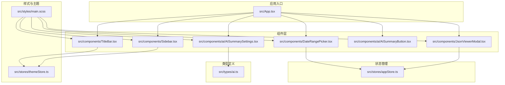
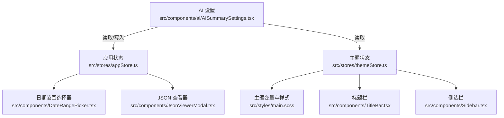
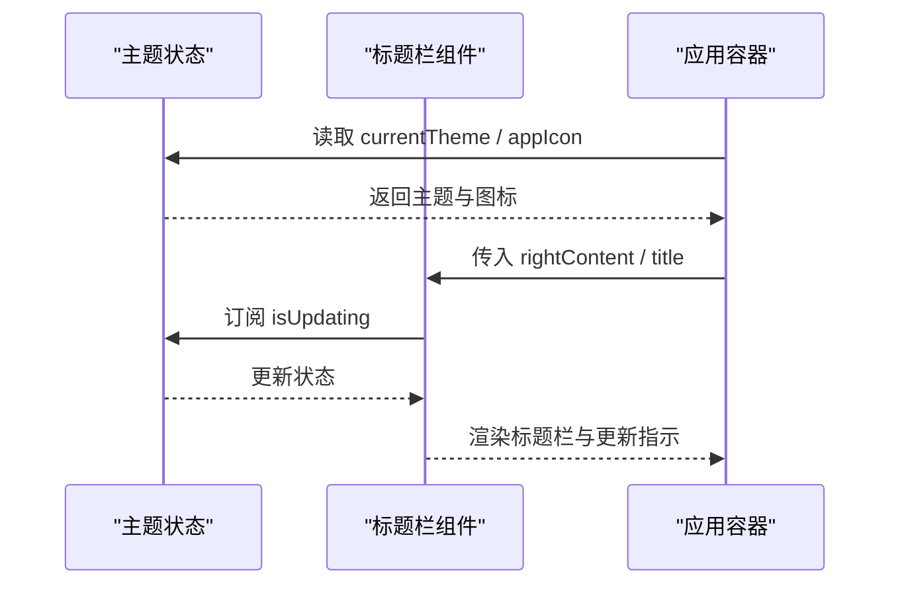
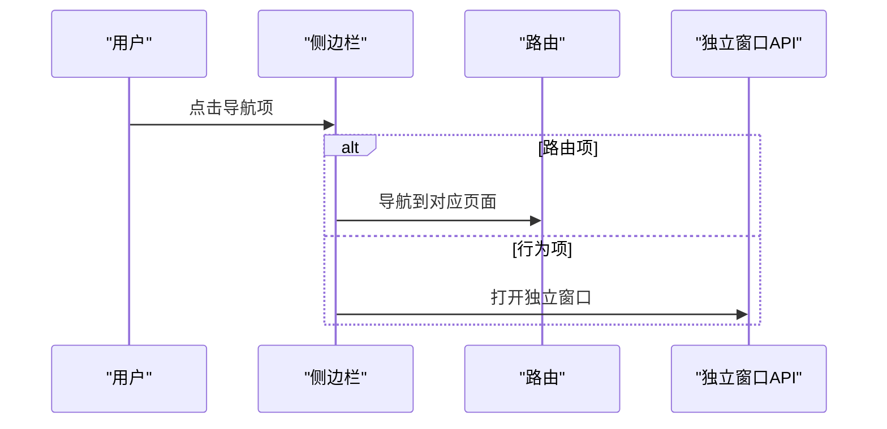
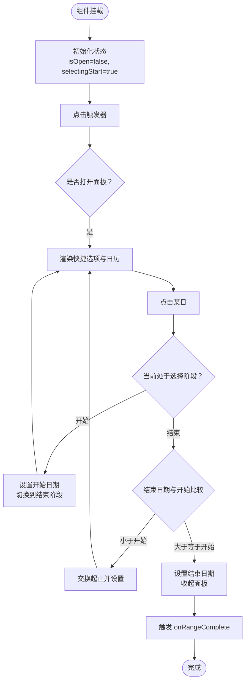
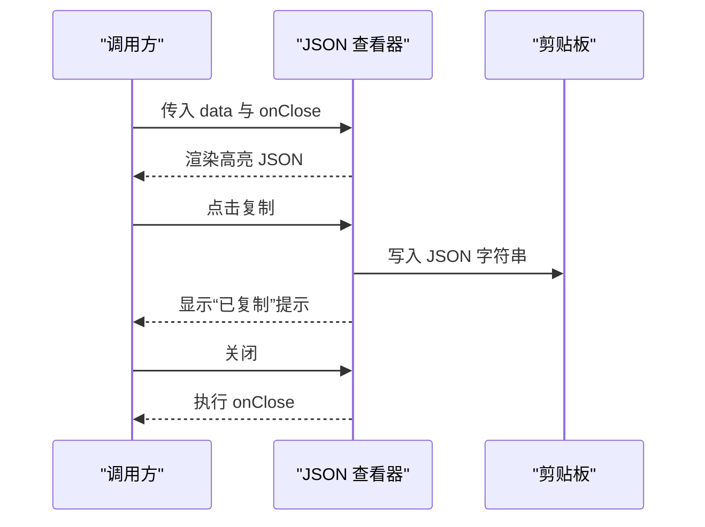
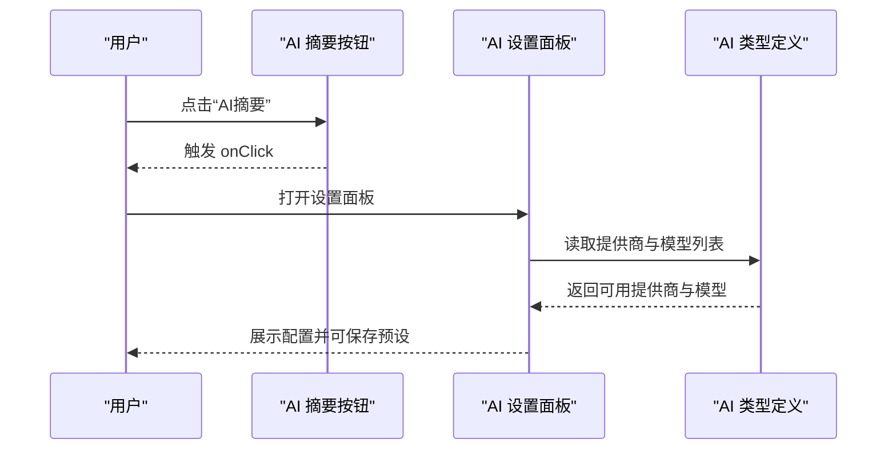
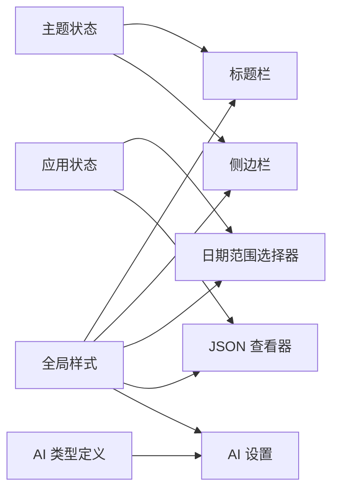

# UI 组件库

<cite>
**本文引用的文件**
- [README.md](file://README.md)
- [package.json](file://package.json)
- [src/App.tsx](file://src/App.tsx)
- [src/styles/main.scss](file://src/styles/main.scss)
- [src/stores/themeStore.ts](file://src/stores/themeStore.ts)
- [src/components/TitleBar.tsx](file://src/components/TitleBar.tsx)
- [src/components/Sidebar.tsx](file://src/components/Sidebar.tsx)
- [src/components/DateRangePicker.tsx](file://src/components/DateRangePicker.tsx)
- [src/components/JsonViewerModal.tsx](file://src/components/JsonViewerModal.tsx)
- [src/components/ai/AISummaryButton.tsx](file://src/components/ai/AISummaryButton.tsx)
- [src/components/ai/AISummarySettings.tsx](file://src/components/ai/AISummarySettings.tsx)
- [src/types/ai.ts](file://src/types/ai.ts)
- [src/stores/appStore.ts](file://src/stores/appStore.ts)
</cite>

## 目录
1. [简介](#简介)
2. [项目结构](#项目结构)
3. [核心组件](#核心组件)
4. [架构总览](#架构总览)
5. [组件详解](#组件详解)
6. [依赖关系分析](#依赖关系分析)
7. [性能考量](#性能考量)
8. [故障排查指南](#故障排查指南)
9. [结论](#结论)
10. [附录](#附录)

## 简介
本文件为 CipherTalk 的 UI 组件库开发文档，面向前端开发者，系统阐述以下内容：
- Material UI 组件的使用：组件配置、主题定制、样式覆盖
- 业务组件封装：通用组件设计、组件属性定义、事件处理机制
- 组件复用策略：继承模式、组合模式、高阶组件
- 组件状态管理：受控组件、非受控组件、状态提升
- 组件性能优化：PureComponent 使用、memo 优化、渲染性能监控
- 组件开发规范：组件命名约定、PropTypes 定义、TypeScript 类型约束

## 项目结构
项目采用 React + TypeScript + Zustand + SCSS 的技术栈，UI 组件集中在 src/components 下，主题与样式集中在 src/styles 中，状态管理集中在 src/stores。

图示来源
- [src/App.tsx:1-538](file://src/App.tsx#L1-L538)
- [src/components/TitleBar.tsx:1-52](file://src/components/TitleBar.tsx#L1-L52)
- [src/components/Sidebar.tsx:1-355](file://src/components/Sidebar.tsx#L1-L355)
- [src/components/DateRangePicker.tsx:1-240](file://src/components/DateRangePicker.tsx#L1-L240)
- [src/components/JsonViewerModal.tsx:1-68](file://src/components/JsonViewerModal.tsx#L1-L68)
- [src/components/ai/AISummaryButton.tsx:1-18](file://src/components/ai/AISummaryButton.tsx#L1-L18)
- [src/components/ai/AISummarySettings.tsx:1-939](file://src/components/ai/AISummarySettings.tsx#L1-L939)
- [src/styles/main.scss:1-427](file://src/styles/main.scss#L1-L427)
- [src/stores/themeStore.ts:1-146](file://src/stores/themeStore.ts#L1-L146)
- [src/stores/appStore.ts:1-97](file://src/stores/appStore.ts#L1-L97)
- [src/types/ai.ts:1-93](file://src/types/ai.ts#L1-L93)

章节来源
- [README.md:132-160](file://README.md#L132-L160)
- [package.json:20-56](file://package.json#L20-L56)

## 核心组件
- 标题栏组件：负责应用标题、图标、更新状态指示与右侧内容注入。
- 侧边栏组件：基于 Material UI Drawer 实现导航菜单、用户信息与折叠逻辑。
- 日期范围选择器：提供快捷选项、日历面板与范围选择交互。
- JSON 查看器模态框：提供 JSON 数据高亮、复制与关闭能力。
- AI 摘要按钮与设置：提供 AI 摘要触发与配置面板，含提供商、模型、提示词等参数。

章节来源
- [src/components/TitleBar.tsx:1-52](file://src/components/TitleBar.tsx#L1-L52)
- [src/components/Sidebar.tsx:1-355](file://src/components/Sidebar.tsx#L1-L355)
- [src/components/DateRangePicker.tsx:1-240](file://src/components/DateRangePicker.tsx#L1-L240)
- [src/components/JsonViewerModal.tsx:1-68](file://src/components/JsonViewerModal.tsx#L1-L68)
- [src/components/ai/AISummaryButton.tsx:1-18](file://src/components/ai/AISummaryButton.tsx#L1-L18)
- [src/components/ai/AISummarySettings.tsx:1-939](file://src/components/ai/AISummarySettings.tsx#L1-L939)

## 架构总览
应用通过 Zustand 管理主题与应用状态，Material UI 提供基础 UI 组件，SCSS 变量驱动主题切换，组件间通过 props 与状态提升实现通信。

图示来源
- [src/stores/themeStore.ts:1-146](file://src/stores/themeStore.ts#L1-L146)
- [src/stores/appStore.ts:1-97](file://src/stores/appStore.ts#L1-L97)
- [src/styles/main.scss:1-427](file://src/styles/main.scss#L1-L427)
- [src/components/TitleBar.tsx:1-52](file://src/components/TitleBar.tsx#L1-L52)
- [src/components/Sidebar.tsx:1-355](file://src/components/Sidebar.tsx#L1-L355)
- [src/components/DateRangePicker.tsx:1-240](file://src/components/DateRangePicker.tsx#L1-L240)
- [src/components/JsonViewerModal.tsx:1-68](file://src/components/JsonViewerModal.tsx#L1-L68)
- [src/components/ai/AISummarySettings.tsx:1-939](file://src/components/ai/AISummarySettings.tsx#L1-L939)

## 组件详解

### 标题栏组件（TitleBar）
- 设计要点
  - 支持右侧内容注入与默认状态注入
  - 监听更新状态并在标题栏显示同步指示
  - 依据主题状态动态切换应用图标
- 属性与事件
  - 属性：title（可选）、rightContent（可选）
  - 事件：无
- 样式与主题
  - 使用 CSS 变量与主题切换机制，配合 SCSS 变量实现颜色与背景随主题变化
- 交互流程

图示来源
- [src/components/TitleBar.tsx:1-52](file://src/components/TitleBar.tsx#L1-L52)
- [src/stores/themeStore.ts:1-146](file://src/stores/themeStore.ts#L1-L146)

章节来源
- [src/components/TitleBar.tsx:1-52](file://src/components/TitleBar.tsx#L1-L52)

### 侧边栏组件（Sidebar）
- 设计要点
  - 基于 MUI Drawer 实现永久抽屉，支持折叠与展开
  - 使用 MUI List/ListItem/Button/Tooltip 组合实现导航项
  - 通过 sx 属性覆盖样式，结合 CSS 变量实现主题色
- 属性与事件
  - 属性：无
  - 事件：通过 onClick 触发窗口打开（独立聊天/群聊/朋友圈等）
- 交互流程

图示来源
- [src/components/Sidebar.tsx:1-355](file://src/components/Sidebar.tsx#L1-L355)

章节来源
- [src/components/Sidebar.tsx:1-355](file://src/components/Sidebar.tsx#L1-L355)

### 日期范围选择器（DateRangePicker）
- 设计要点
  - 提供快捷选项（今天、最近 N 天、全部时间）
  - 日历网格渲染，支持范围高亮与起止标记
  - 点击外部关闭，自动计算下拉方向
- 属性与事件
  - 属性：startDate、endDate、onStartDateChange、onEndDateChange、onRangeComplete（可选）
  - 事件：选择开始/结束日期、清空、快捷选项
- 状态管理
  - 内部维护 isOpen、currentMonth、selectingStart、dropdownStyle 等状态
- 交互流程

图示来源
- [src/components/DateRangePicker.tsx:1-240](file://src/components/DateRangePicker.tsx#L1-L240)

章节来源
- [src/components/DateRangePicker.tsx:1-240](file://src/components/DateRangePicker.tsx#L1-L240)

### JSON 查看器模态框（JsonViewerModal）
- 设计要点
  - 提供 JSON 高亮显示（键、字符串、布尔、数字、null）
  - 支持复制到剪贴板与关闭
  - 点击遮罩层关闭
- 属性与事件
  - 属性：data（任意对象）、title（可选）、onClose
  - 事件：复制成功回调（内部状态提示）
- 交互流程

图示来源
- [src/components/JsonViewerModal.tsx:1-68](file://src/components/JsonViewerModal.tsx#L1-L68)

章节来源
- [src/components/JsonViewerModal.tsx:1-68](file://src/components/JsonViewerModal.tsx#L1-L68)

### AI 摘要按钮与设置（AISummaryButton / AISummarySettings）
- 设计要点
  - AISummaryButton：轻量按钮，触发 AI 摘要流程
  - AISummarySettings：复杂配置面板，支持提供商、模型、时间范围、摘要详细程度、系统提示词风格、使用统计等
- 属性与事件
  - AISummaryButton：sessionId（会话 ID）、onClick（点击回调）
  - AISummarySettings：大量配置项（见组件内 Props 定义）
- 交互流程

图示来源
- [src/components/ai/AISummaryButton.tsx:1-18](file://src/components/ai/AISummaryButton.tsx#L1-L18)
- [src/components/ai/AISummarySettings.tsx:1-939](file://src/components/ai/AISummarySettings.tsx#L1-L939)
- [src/types/ai.ts:1-93](file://src/types/ai.ts#L1-L93)

章节来源
- [src/components/ai/AISummaryButton.tsx:1-18](file://src/components/ai/AISummaryButton.tsx#L1-L18)
- [src/components/ai/AISummarySettings.tsx:1-939](file://src/components/ai/AISummarySettings.tsx#L1-L939)
- [src/types/ai.ts:1-93](file://src/types/ai.ts#L1-L93)

## 依赖关系分析
- 组件依赖
  - TitleBar 依赖主题状态与更新状态
  - Sidebar 依赖路由与窗口 API
  - DateRangePicker 依赖应用状态（加载/解密状态）
  - JsonViewerModal 依赖应用状态（用于统一状态管理）
  - AISummarySettings 依赖 AI 类型定义与配置服务
- 样式依赖
  - 所有组件共享 src/styles/main.scss 的 CSS 变量与基础样式

图示来源
- [src/stores/themeStore.ts:1-146](file://src/stores/themeStore.ts#L1-L146)
- [src/stores/appStore.ts:1-97](file://src/stores/appStore.ts#L1-L97)
- [src/styles/main.scss:1-427](file://src/styles/main.scss#L1-L427)
- [src/components/TitleBar.tsx:1-52](file://src/components/TitleBar.tsx#L1-L52)
- [src/components/Sidebar.tsx:1-355](file://src/components/Sidebar.tsx#L1-L355)
- [src/components/DateRangePicker.tsx:1-240](file://src/components/DateRangePicker.tsx#L1-L240)
- [src/components/JsonViewerModal.tsx:1-68](file://src/components/JsonViewerModal.tsx#L1-L68)
- [src/components/ai/AISummarySettings.tsx:1-939](file://src/components/ai/AISummarySettings.tsx#L1-L939)
- [src/types/ai.ts:1-93](file://src/types/ai.ts#L1-L93)

章节来源
- [package.json:20-56](file://package.json#L20-L56)

## 性能考量
- 渲染优化
  - 使用 useMemo 对 JSON 高亮结果进行缓存，减少重复渲染
  - 日期范围选择器在面板关闭时不再渲染，降低不必要的 DOM
- 状态管理
  - 将全局主题与应用状态集中于 Zustand，避免跨层级 props 传递带来的重渲染
- 样式性能
  - 通过 CSS 变量与主题切换，避免频繁样式计算
- 建议
  - 对高频交互组件（如日期选择器）可考虑使用 React.memo 包裹，结合浅比较减少重渲染
  - 对复杂列表渲染（如侧边栏）可结合虚拟化方案（已在依赖中引入 react-window 与 react-virtualized-auto-sizer）

章节来源
- [src/components/JsonViewerModal.tsx:23-68](file://src/components/JsonViewerModal.tsx#L23-L68)
- [src/components/DateRangePicker.tsx:26-240](file://src/components/DateRangePicker.tsx#L26-L240)
- [package.json:47-56](file://package.json#L47-L56)

## 故障排查指南
- 主题切换无效
  - 检查根节点是否正确设置 data-theme 与 data-mode
  - 确认主题状态已加载且 CSS 变量已更新
- 更新指示不显示
  - 确认更新监听已注册，且 isUpdating 状态被正确更新
- 日期范围选择异常
  - 检查起止日期边界逻辑与快捷选项计算
- JSON 查看器无法复制
  - 检查剪贴板权限与浏览器兼容性
- AI 设置无法保存
  - 检查配置服务调用与提供商配置持久化

章节来源
- [src/App.tsx:60-88](file://src/App.tsx#L60-L88)
- [src/components/TitleBar.tsx:19-24](file://src/components/TitleBar.tsx#L19-L24)
- [src/components/DateRangePicker.tsx:60-93](file://src/components/DateRangePicker.tsx#L60-L93)
- [src/components/JsonViewerModal.tsx:28-34](file://src/components/JsonViewerModal.tsx#L28-L34)
- [src/components/ai/AISummarySettings.tsx:268-300](file://src/components/ai/AISummarySettings.tsx#L268-L300)

## 结论
本 UI 组件库以 Material UI 为基础，结合 Zustand 状态管理与 SCSS 主题系统，实现了可复用、可扩展、可维护的组件体系。通过合理的属性设计、事件处理与状态提升，组件具备良好的可测试性与可演进性。建议在后续迭代中进一步引入 React.memo、虚拟化与性能监控工具，持续优化用户体验。

## 附录

### Material UI 使用与主题定制
- 组件配置
  - 使用 MUI Drawer、List、ListItem、Tooltip、Avatar 等组件实现侧边栏与用户信息展示
  - 使用 sx 属性覆盖样式，结合 CSS 变量实现主题色
- 主题定制
  - 通过 CSS 变量与 data-theme/data-mode 控制主题与模式
  - 在 SCSS 中定义多套主题变量，实现浅色/深色与多主题色切换
- 样式覆盖
  - 通过类名与 CSS 变量覆盖 MUI 默认样式，保持一致性

章节来源
- [src/components/Sidebar.tsx:193-351](file://src/components/Sidebar.tsx#L193-L351)
- [src/styles/main.scss:4-321](file://src/styles/main.scss#L4-L321)
- [src/App.tsx:70-88](file://src/App.tsx#L70-L88)

### 业务组件封装与复用策略
- 组合模式
  - 通过 props 注入（如 TitleBar 的 rightContent）实现内容组合
- 高阶组件
  - 可通过自定义 Hook（如 useTitleBarStore）实现状态提升与复用
- 继承模式
  - 通过抽象基类或通用渲染函数实现相似组件的统一逻辑

章节来源
- [src/components/TitleBar.tsx:13-17](file://src/components/TitleBar.tsx#L13-L17)
- [src/stores/themeStore.ts:79-140](file://src/stores/themeStore.ts#L79-L140)

### 组件状态管理
- 受控组件
  - DateRangePicker 通过 props 传入起止日期与回调，实现受控状态
- 非受控组件
  - 本项目以受控为主，非受控组件较少
- 状态提升
  - 应用状态集中于 Zustand，组件通过订阅与动作函数进行状态更新

章节来源
- [src/components/DateRangePicker.tsx:5-11](file://src/components/DateRangePicker.tsx#L5-L11)
- [src/stores/appStore.ts:40-95](file://src/stores/appStore.ts#L40-L95)

### 组件开发规范
- 命名约定
  - 组件使用 PascalCase，变量与函数使用 camelCase
  - 样式遵循 BEM 命名规范
- PropTypes 与 TypeScript
  - 使用 TypeScript 接口定义组件 Props，确保类型安全
- 最佳实践
  - 使用 useMemo/memo 优化渲染
  - 使用 CSS 变量与主题系统统一风格
  - 通过 Zustand 管理全局状态，避免深层 props 传递

章节来源
- [README.md:195-201](file://README.md#L195-L201)
- [src/components/ai/AISummarySettings.tsx:94-115](file://src/components/ai/AISummarySettings.tsx#L94-L115)
- [src/types/ai.ts:4-17](file://src/types/ai.ts#L4-L17)