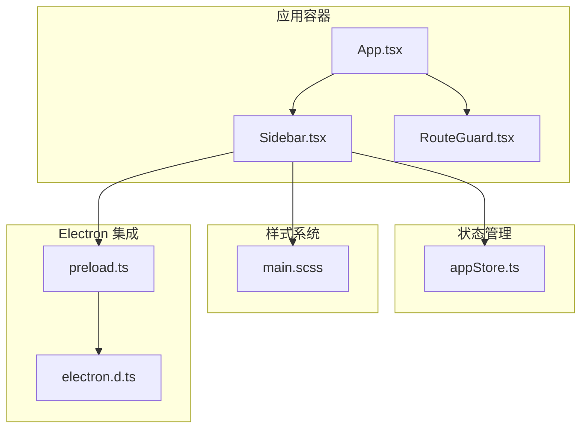
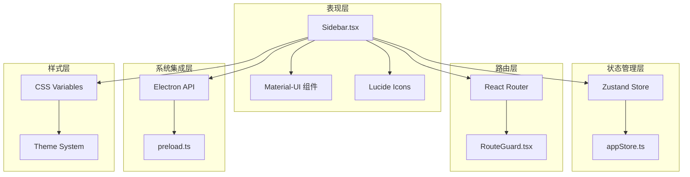
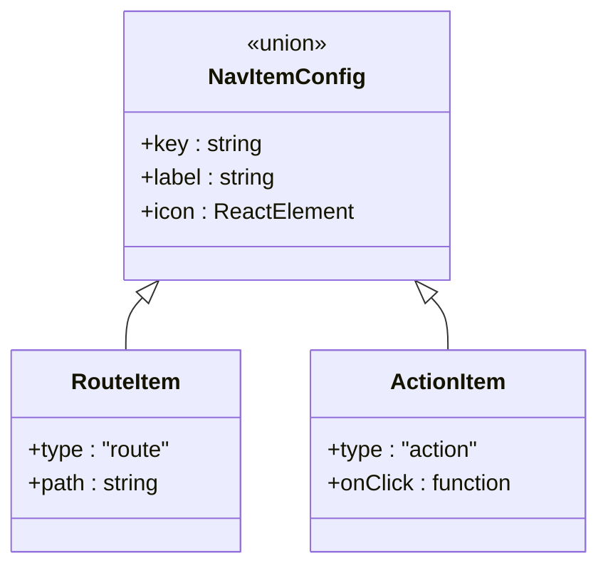
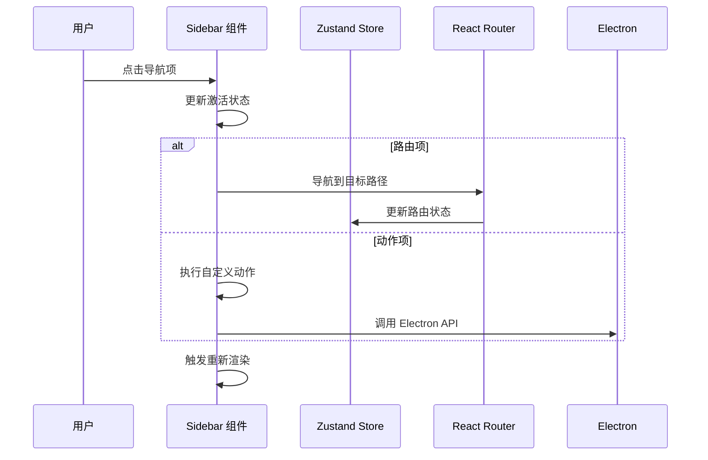
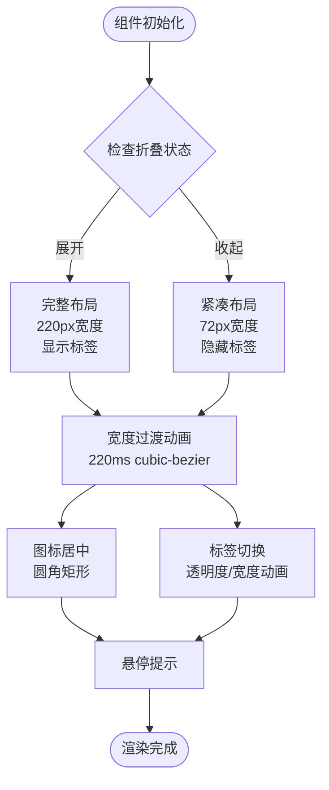
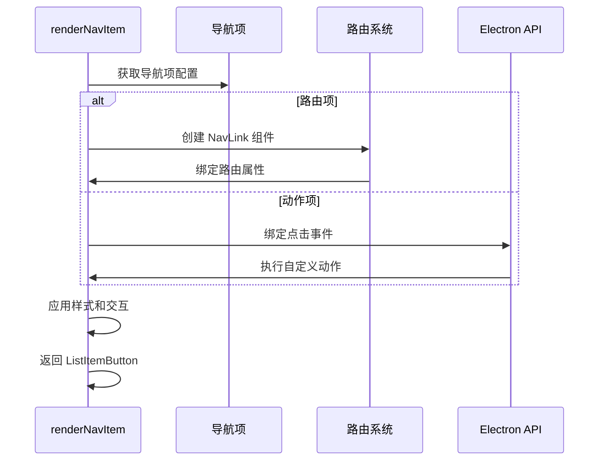
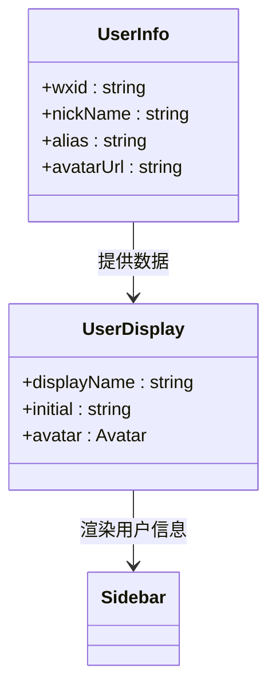
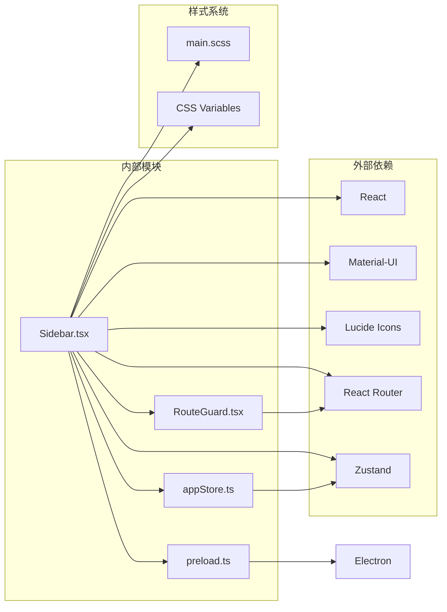

# 侧边栏组件

<cite>
**本文档引用的文件**
- [Sidebar.tsx](file://src/components/Sidebar.tsx)
- [App.tsx](file://src/App.tsx)
- [appStore.ts](file://src/stores/appStore.ts)
- [RouteGuard.tsx](file://src/components/RouteGuard.tsx)
- [main.scss](file://src/styles/main.scss)
- [preload.ts](file://electron/preload.ts)
- [electron.d.ts](file://src/types/electron.d.ts)
</cite>

## 目录
1. [简介](#简介)
2. [项目结构](#项目结构)
3. [核心组件](#核心组件)
4. [架构概览](#架构概览)
5. [详细组件分析](#详细组件分析)
6. [依赖关系分析](#依赖关系分析)
7. [性能考虑](#性能考虑)
8. [故障排除指南](#故障排除指南)
9. [结论](#结论)
10. [附录](#附录)

## 简介

侧边栏组件是 CipherTalk 应用程序的核心导航组件，负责提供用户界面的主要导航功能。该组件实现了现代化的抽屉式导航界面，支持响应式设计、主题化样式和完整的用户交互体验。

该组件采用 Material-UI 设计系统，结合自定义的 CSS 变量主题系统，提供了高度可定制的导航体验。组件支持多种导航类型，包括路由导航、外部窗口打开和自定义动作处理。

## 项目结构

侧边栏组件位于应用程序的组件层中，与应用主容器紧密集成：

**图表来源**
- [App.tsx:495](file://src/App.tsx#L495)
- [Sidebar.tsx:13](file://src/components/Sidebar.tsx#L13)
- [appStore.ts:1](file://src/stores/appStore.ts#L1)

**章节来源**
- [App.tsx:462-534](file://src/App.tsx#L462-L534)
- [Sidebar.tsx:1-355](file://src/components/Sidebar.tsx#L1-L355)

## 核心组件

侧边栏组件是一个功能完整的 React 组件，具有以下核心特性：

### 导航项类型系统
组件支持两种类型的导航项：
- **路由项 (RouteItem)**: 基于 React Router 的页面导航
- **动作项 (ActionItem)**: 自定义动作处理器，通常用于打开外部窗口

### 状态管理系统
- **折叠状态**: 通过 `useState` 管理侧边栏的展开/收起状态
- **激活状态**: 基于当前路由位置自动更新导航项的激活状态
- **用户信息**: 从全局状态管理器获取用户信息并显示

### 样式系统
- **CSS 变量主题**: 使用 `--bg-secondary`、`--primary` 等变量实现主题化
- **响应式设计**: 支持不同屏幕尺寸下的自适应布局
- **动画过渡**: 包含平滑的展开/收起动画效果

**章节来源**
- [Sidebar.tsx:19-35](file://src/components/Sidebar.tsx#L19-L35)
- [Sidebar.tsx:37-49](file://src/components/Sidebar.tsx#L37-L49)

## 架构概览

侧边栏组件采用分层架构设计，各层职责清晰分离：

**图表来源**
- [Sidebar.tsx:13](file://src/components/Sidebar.tsx#L13)
- [appStore.ts:40](file://src/stores/appStore.ts#L40)
- [RouteGuard.tsx:12](file://src/components/RouteGuard.tsx#L12)

## 详细组件分析

### 导航项配置系统

侧边栏通过统一的配置数组管理所有导航项：

**图表来源**
- [Sidebar.tsx:19](file://src/components/Sidebar.tsx#L19)
- [Sidebar.tsx:27](file://src/components/Sidebar.tsx#L27)

### 状态管理机制

组件内部状态管理采用 React Hooks：

**图表来源**
- [Sidebar.tsx:152](file://src/components/Sidebar.tsx#L152)
- [Sidebar.tsx:47](file://src/components/Sidebar.tsx#L47)

### 响应式设计实现

侧边栏采用灵活的响应式设计策略：

**图表来源**
- [Sidebar.tsx:16](file://src/components/Sidebar.tsx#L16)
- [Sidebar.tsx:41](file://src/components/Sidebar.tsx#L41)

**章节来源**
- [Sidebar.tsx:75-85](file://src/components/Sidebar.tsx#L75-L85)
- [Sidebar.tsx:136](file://src/components/Sidebar.tsx#L136)

### 导航功能实现

导航功能通过统一的渲染函数实现：

**图表来源**
- [Sidebar.tsx:152](file://src/components/Sidebar.tsx#L152)
- [Sidebar.tsx:155](file://src/components/Sidebar.tsx#L155)

**章节来源**
- [Sidebar.tsx:51-73](file://src/components/Sidebar.tsx#L51-L73)
- [Sidebar.tsx:152-190](file://src/components/Sidebar.tsx#L152-L190)

### 用户信息展示

用户信息区域包含头像和显示名称：

**图表来源**
- [appStore.ts:3](file://src/stores/appStore.ts#L3)
- [Sidebar.tsx:42](file://src/components/Sidebar.tsx#L42)

**章节来源**
- [appStore.ts:40-97](file://src/stores/appStore.ts#L40-L97)
- [Sidebar.tsx:244-284](file://src/components/Sidebar.tsx#L244-L284)

## 依赖关系分析

侧边栏组件的依赖关系清晰明确：

**图表来源**
- [Sidebar.tsx:13](file://src/components/Sidebar.tsx#L13)
- [appStore.ts:1](file://src/stores/appStore.ts#L1)

**章节来源**
- [Sidebar.tsx:1-14](file://src/components/Sidebar.tsx#L1-L14)
- [App.tsx:495](file://src/App.tsx#L495)

## 性能考虑

侧边栏组件在性能方面采用了多项优化策略：

### 渲染优化
- **条件渲染**: 折叠状态下只渲染必要的元素
- **样式计算**: 使用 CSS 变量减少样式计算开销
- **动画性能**: 采用硬件加速的 CSS 过渡

### 状态管理优化
- **局部状态**: 仅管理必要的组件状态
- **记忆化**: 使用 React.memo 减少不必要的重渲染
- **事件绑定**: 避免在渲染过程中创建新的函数

### 样式性能
- **CSS 变量**: 使用 CSS 变量实现主题切换的高性能
- **硬件加速**: 关键动画使用 transform 和 opacity 属性
- **最小化重排**: 样式更新避免触发大规模布局重排

## 故障排除指南

### 常见问题及解决方案

**导航项不显示**
- 检查导航项配置数组中的 `key` 是否唯一
- 确认 `label` 和 `icon` 属性是否正确设置
- 验证路由路径是否存在对应的页面组件

**激活状态不更新**
- 确认路由配置是否正确
- 检查 `useLocation` hook 是否正常工作
- 验证 `isActive` 函数的路径匹配逻辑

**折叠动画异常**
- 检查 CSS 变量 `--sidebar-width` 的定义
- 确认过渡动画的 CSS 属性设置
- 验证 `widthTransition` 和 `fadeTransition` 的值

**用户信息不显示**
- 确认 `appStore` 中的用户信息状态
- 检查 `userInfo` 对象的结构
- 验证用户头像 URL 的有效性

**章节来源**
- [Sidebar.tsx:47](file://src/components/Sidebar.tsx#L47)
- [appStore.ts:40](file://src/stores/appStore.ts#L40)

## 结论

侧边栏组件是一个设计精良、功能完整的导航组件，具有以下特点：

### 优势
- **模块化设计**: 清晰的组件结构和职责分离
- **高度可定制**: 支持多种导航类型和样式定制
- **响应式布局**: 优秀的移动端适配能力
- **性能优化**: 采用多种优化策略确保流畅体验
- **主题化支持**: 完整的 CSS 变量主题系统

### 扩展建议
- **国际化支持**: 添加多语言标签支持
- **权限控制**: 实现基于角色的导航项显示
- **动态配置**: 支持运行时修改导航项配置
- **键盘导航**: 添加键盘快捷键支持
- **无障碍访问**: 增强屏幕阅读器支持

该组件为 CipherTalk 应用提供了稳定可靠的导航基础，为用户提供了直观易用的导航体验。

## 附录

### 组件配置选项

| 配置项 | 类型 | 默认值 | 描述 |
|--------|------|--------|------|
| `DRAWER_WIDTH` | number | 220 | 展开状态下的侧边栏宽度 |
| `COLLAPSED_DRAWER_WIDTH` | number | 72 | 收起状态下的侧边栏宽度 |
| `navItems` | NavItemConfig[] | 内置导航项 | 导航项配置数组 |

### 样式变量

| CSS 变量 | 默认值 | 描述 |
|----------|--------|------|
| `--sidebar-width` | 220px | 侧边栏默认宽度 |
| `--bg-secondary` | rgba(255, 255, 255, 0.7) | 侧边栏背景色 |
| `--primary` | #8B7355 | 主色调 |
| `--text-primary` | #3d3d3d | 主要文字颜色 |

### 电子窗口集成

侧边栏通过 Electron API 支持打开多个独立窗口：
- 聊天窗口 (`openChatWindow`)
- 朋友圈窗口 (`openMomentsWindow`)
- 群聊分析窗口 (`openGroupAnalyticsWindow`)
- 年度报告窗口 (`openAnnualReportWindow`)