# 媒体组件

<cite>
**本文档引用的文件**
- [ImagePreview.tsx](file://src/components/ImagePreview.tsx)
- [LivePhotoIcon.tsx](file://src/components/LivePhotoIcon.tsx)
- [ImagePreview.scss](file://src/components/ImagePreview.scss)
- [ImageWindow.tsx](file://src/pages/ImageWindow.tsx)
- [ImageWindow.scss](file://src/pages/ImageWindow.scss)
- [imageStore.ts](file://src/stores/imageStore.ts)
- [lruCache.ts](file://src/utils/lruCache.ts)
- [imageDecryptService.ts](file://electron/services/imageDecryptService.ts)
- [videoService.ts](file://electron/services/videoService.ts)
- [MomentsWindow.tsx](file://src/pages/MomentsWindow.tsx)
</cite>

## 目录
1. [简介](#简介)
2. [项目结构](#项目结构)
3. [核心组件](#核心组件)
4. [架构概览](#架构概览)
5. [详细组件分析](#详细组件分析)
6. [依赖关系分析](#依赖关系分析)
7. [性能考虑](#性能考虑)
8. [故障排除指南](#故障排除指南)
9. [结论](#结论)
10. [附录](#附录)

## 简介

本项目提供了完整的媒体组件集合，专注于微信聊天记录中的图片和视频媒体处理。系统实现了从媒体资源管理到用户交互体验的完整解决方案，包括图片预览、实时照片播放、媒体加载优化和格式支持等核心功能。

主要特性：
- **智能缩略图生成与管理**：自动识别原图和缩略图，提供高质量显示
- **实时照片（Live Photo）支持**：完整的实况照片播放和状态管理
- **多格式媒体支持**：JPEG、PNG、GIF、WebP、HEIC等多种图片格式
- **高性能加载优化**：懒加载、缓存机制、内存管理
- **丰富的交互功能**：缩放、拖拽、旋转、全屏等操作
- **错误处理与用户体验优化**：友好的错误提示和加载状态

## 项目结构

媒体组件系统采用模块化设计，主要分为以下几个层次：

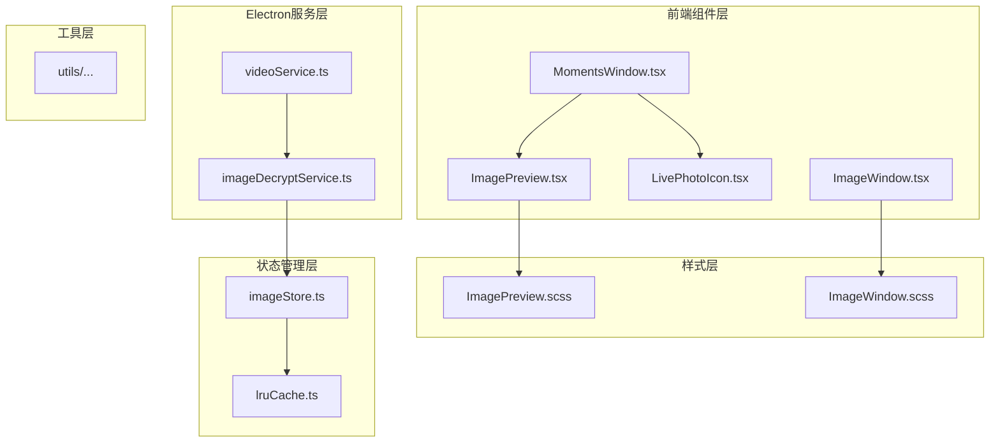

**图表来源**
- [ImagePreview.tsx:1-151](file://src/components/ImagePreview.tsx#L1-L151)
- [ImageWindow.tsx:1-519](file://src/pages/ImageWindow.tsx#L1-L519)
- [imageStore.ts:1-174](file://src/stores/imageStore.ts#L1-L174)

**章节来源**
- [ImagePreview.tsx:1-151](file://src/components/ImagePreview.tsx#L1-L151)
- [ImageWindow.tsx:1-519](file://src/pages/ImageWindow.tsx#L1-L519)
- [imageStore.ts:1-174](file://src/stores/imageStore.ts#L1-L174)

## 核心组件

### 图片预览组件（ImagePreview）

图片预览组件提供了完整的媒体浏览体验，支持多种交互操作：

**核心功能**：
- 滚轮缩放和双击重置
- 鼠标拖拽平移
- 实时照片播放控制
- 全屏显示和ESC关闭
- 响应式布局适配

**技术特点**：
- 使用React Portal实现独立的预览层
- 支持图片和视频两种媒体类型
- 智能Live Photo状态管理
- 性能优化的拖拽和缩放算法

**章节来源**
- [ImagePreview.tsx:14-151](file://src/components/ImagePreview.tsx#L14-L151)
- [ImagePreview.scss:1-154](file://src/components/ImagePreview.scss#L1-L154)

### 实时照片图标（LivePhotoIcon）

专门用于显示实时照片标识的SVG图标组件：

**设计特点**：
- 简洁的圆形轮廓设计
- 动态的波纹效果
- 响应式尺寸适配
- CSS变量主题支持

**章节来源**
- [LivePhotoIcon.tsx:1-30](file://src/components/LivePhotoIcon.tsx#L1-L30)

### 图片查看器（ImageWindow）

高级图片查看器，提供专业级的媒体浏览体验：

**核心功能**：
- 高精度缩放控制（0.1-10倍）
- 旋转操作（90度增量）
- 拖拽平移导航
- 多图浏览支持
- Live Photo播放控制

**技术实现**：
- 原生鼠标事件处理
- 智能边界检测和限制
- 性能优化的变换矩阵
- 响应式视口适配

**章节来源**
- [ImageWindow.tsx:1-519](file://src/pages/ImageWindow.tsx#L1-L519)
- [ImageWindow.scss:1-278](file://src/pages/ImageWindow.scss#L1-L278)

## 架构概览

媒体组件系统采用分层架构设计，确保各组件职责清晰、耦合度低：

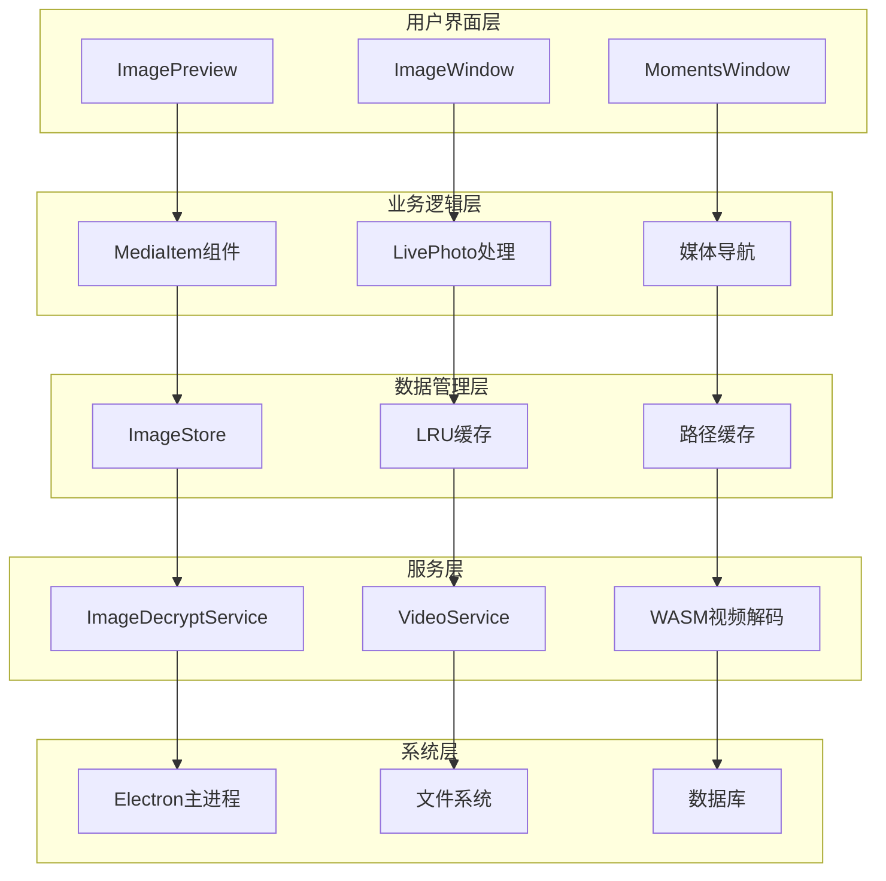

**图表来源**
- [imageStore.ts:81-174](file://src/stores/imageStore.ts#L81-L174)
- [imageDecryptService.ts:44-303](file://electron/services/imageDecryptService.ts#L44-L303)

## 详细组件分析

### 图片预览组件深度分析

#### 交互流程分析

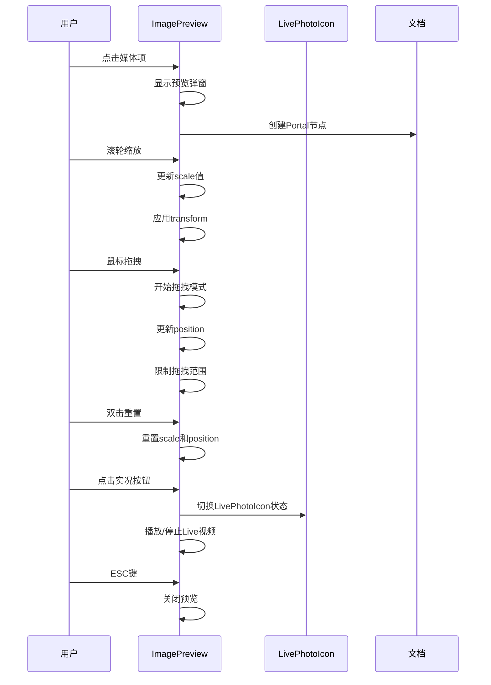

**图表来源**
- [ImagePreview.tsx:24-76](file://src/components/ImagePreview.tsx#L24-L76)
- [ImagePreview.tsx:130-142](file://src/components/ImagePreview.tsx#L130-L142)

#### 状态管理架构

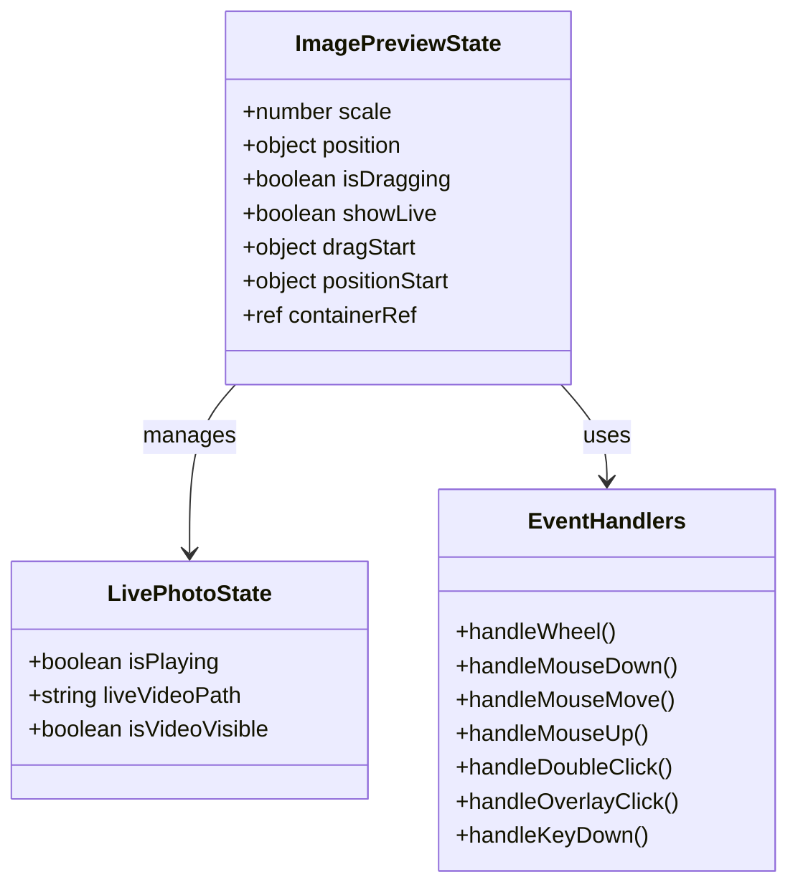

**图表来源**
- [ImagePreview.tsx:14-76](file://src/components/ImagePreview.tsx#L14-L76)

**章节来源**
- [ImagePreview.tsx:14-151](file://src/components/ImagePreview.tsx#L14-L151)

### 实时照片系统分析

#### Live Photo处理流程

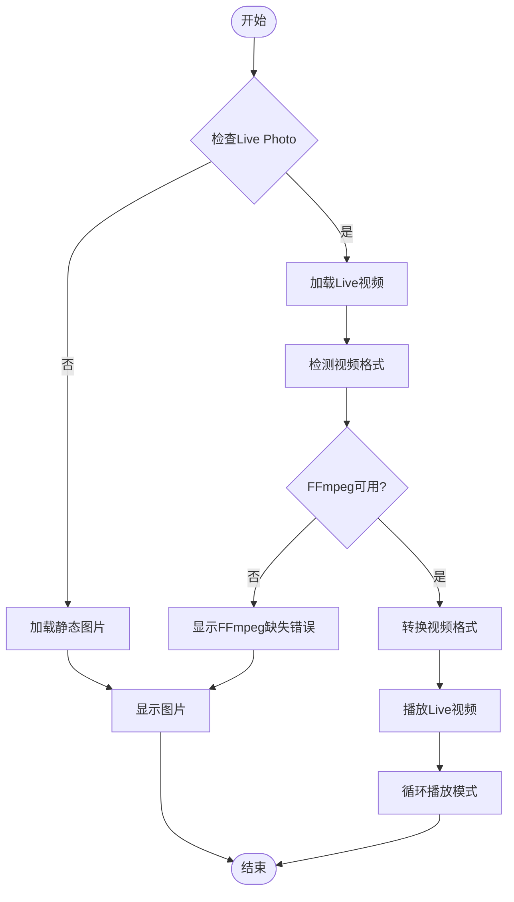

**图表来源**
- [imageDecryptService.ts:2075-2091](file://electron/services/imageDecryptService.ts#L2075-L2091)
- [imageDecryptService.ts:267-272](file://electron/services/imageDecryptService.ts#L267-L272)

#### 实时照片状态管理

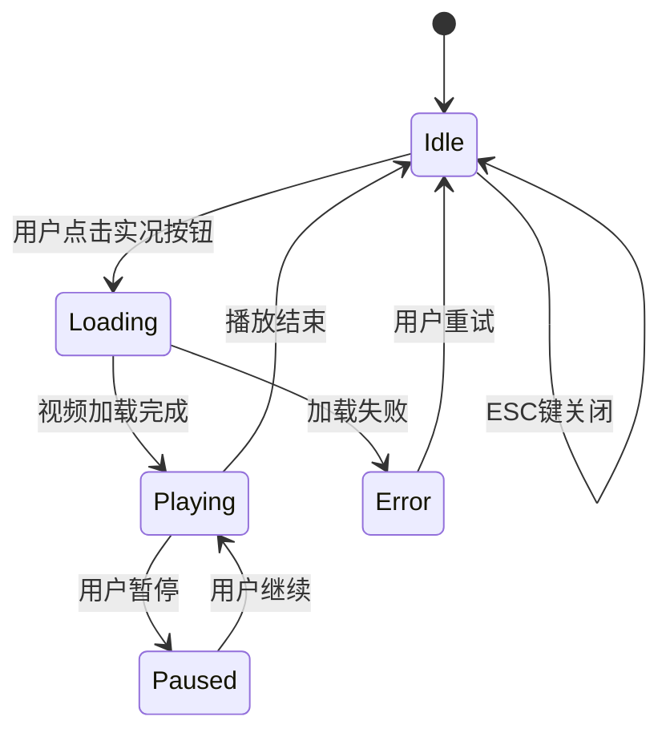

**图表来源**
- [ImageWindow.tsx:106-130](file://src/pages/ImageWindow.tsx#L106-L130)
- [ImagePreview.tsx:130-142](file://src/components/ImagePreview.tsx#L130-L142)

**章节来源**
- [imageDecryptService.ts:2075-2123](file://electron/services/imageDecryptService.ts#L2075-L2123)
- [ImageWindow.tsx:106-130](file://src/pages/ImageWindow.tsx#L106-L130)

### 媒体加载优化系统

#### 懒加载实现

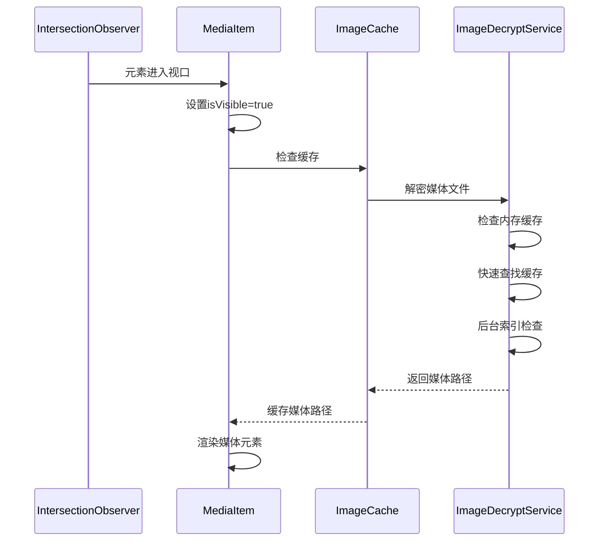

**图表来源**
- [MomentsWindow.tsx:176-200](file://src/pages/MomentsWindow.tsx#L176-L200)
- [imageDecryptService.ts:56-110](file://electron/services/imageDecryptService.ts#L56-L110)

#### 缓存机制设计

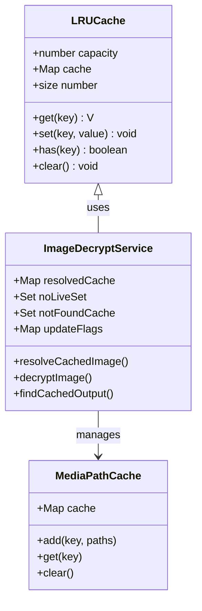

**图表来源**
- [lruCache.ts:5-51](file://src/utils/lruCache.ts#L5-L51)
- [imageDecryptService.ts:44-54](file://electron/services/imageDecryptService.ts#L44-L54)

**章节来源**
- [lruCache.ts:1-51](file://src/utils/lruCache.ts#L1-L51)
- [imageDecryptService.ts:44-303](file://electron/services/imageDecryptService.ts#L44-L303)

### 媒体格式支持系统

#### 图片格式支持矩阵

| 格式类型 | 支持状态 | 处理方式 | 特殊说明 |
|---------|---------|---------|----------|
| JPEG/JPG | ✅ 完全支持 | 直接显示 | 包含实况照片检测 |
| PNG | ✅ 完全支持 | 直接显示 | 支持透明度 |
| GIF | ✅ 完全支持 | 直接显示 | 支持动画 |
| WebP | ✅ 完全支持 | 直接显示 | 现代压缩格式 |
| HEIC/HEIF | ⚠️ 部分支持 | 需要FFmpeg | 需要额外依赖 |
| WXGF | ⚠️ 部分支持 | 需要FFmpeg | 微信新格式 |

#### 视频格式支持

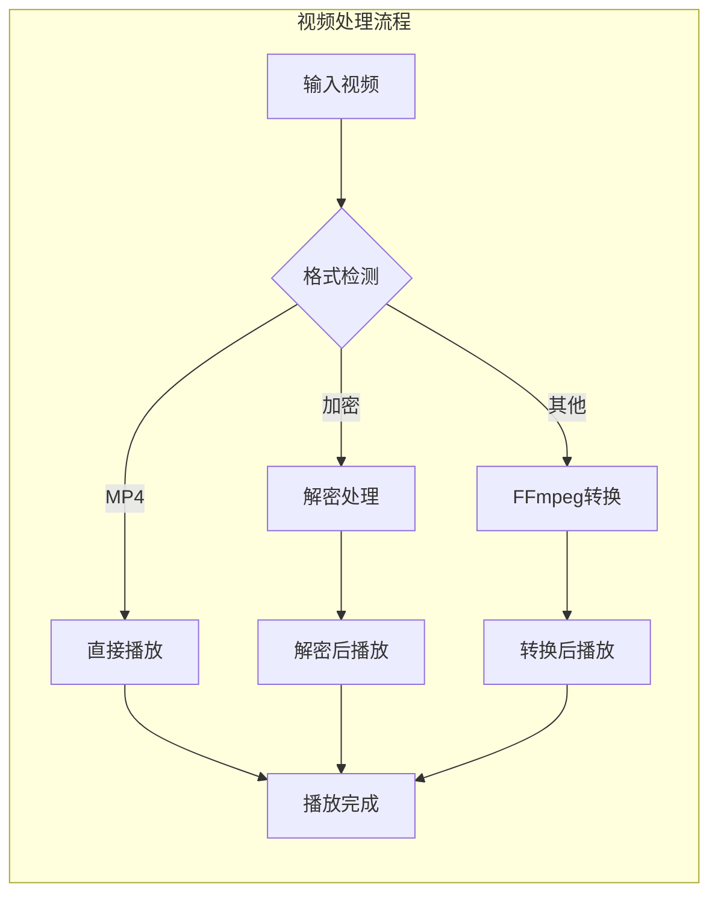

**图表来源**
- [videoService.ts:194-245](file://electron/services/videoService.ts#L194-L245)
- [imageDecryptService.ts:285-293](file://electron/services/imageDecryptService.ts#L285-L293)

**章节来源**
- [videoService.ts:1-567](file://electron/services/videoService.ts#L1-L567)
- [imageDecryptService.ts:2056-2073](file://electron/services/imageDecryptService.ts#L2056-L2073)

## 依赖关系分析

### 组件间依赖关系

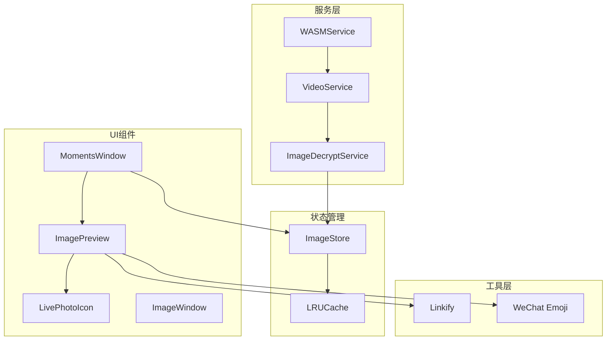

**图表来源**
- [ImagePreview.tsx:3-5](file://src/components/ImagePreview.tsx#L3-L5)
- [imageStore.ts:1-11](file://src/stores/imageStore.ts#L1-L11)

### 数据流分析

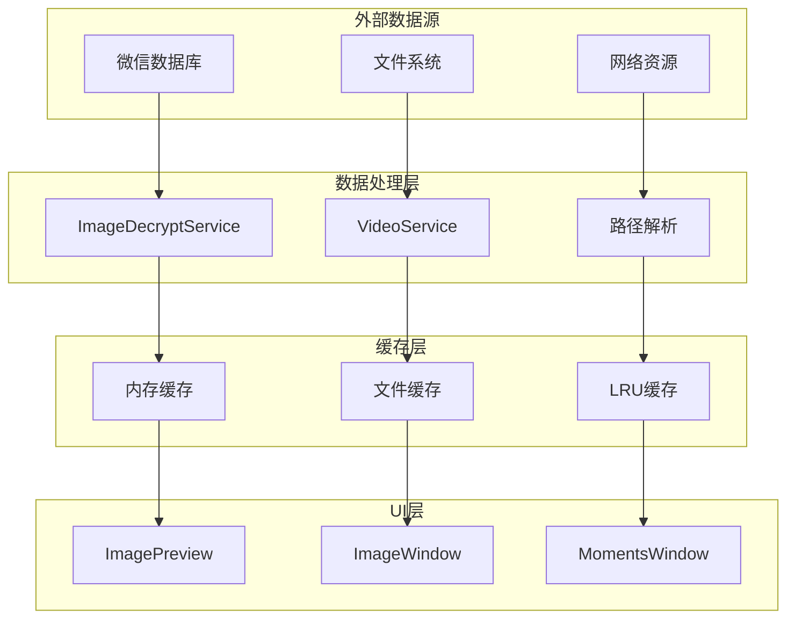

**图表来源**
- [imageDecryptService.ts:56-110](file://electron/services/imageDecryptService.ts#L56-L110)
- [MomentsWindow.tsx:126-127](file://src/pages/MomentsWindow.tsx#L126-L127)

**章节来源**
- [imageStore.ts:81-174](file://src/stores/imageStore.ts#L81-L174)
- [imageDecryptService.ts:44-303](file://electron/services/imageDecryptService.ts#L44-L303)

## 性能考虑

### 内存优化策略

1. **LRU缓存管理**：限制缓存数量，避免内存泄漏
2. **懒加载实现**：Intersection Observer延迟加载
3. **智能缓存失效**：基于时间戳和使用频率的缓存淘汰
4. **资源释放**：组件卸载时及时清理事件监听器

### 性能监控指标

| 指标类型 | 目标值 | 监控方法 | 优化策略 |
|---------|--------|----------|----------|
| 图片加载时间 | < 2秒 | 性能计时器 | 缓存优化、预加载 |
| 拖拽响应延迟 | < 16ms | 帧率监控 | requestAnimationFrame |
| 缩放操作流畅度 | 60FPS+ | 帧率分析 | transform硬件加速 |
| 内存使用峰值 | < 500MB | 内存监控 | LRU缓存限制 |

### 优化建议

1. **批量处理**：对同时出现的媒体项进行批量解密
2. **预加载策略**：根据用户浏览习惯预加载下一组媒体
3. **压缩优化**：对大图片进行适当的压缩处理
4. **并发控制**：限制同时进行的解密任务数量

## 故障排除指南

### 常见问题及解决方案

#### 实时照片无法播放

**问题症状**：点击实况按钮无反应或显示错误

**可能原因**：
1. FFmpeg未安装或路径不正确
2. 实况视频文件损坏
3. 浏览器不支持的视频格式

**解决步骤**：
1. 检查FFmpeg安装状态
2. 验证视频文件完整性
3. 尝试不同的浏览器
4. 更新系统编解码器

#### 图片显示异常

**问题症状**：图片显示为灰色或加载失败

**可能原因**：
1. 缓存文件损坏
2. 权限不足
3. 网络连接问题

**解决步骤**：
1. 清除应用缓存
2. 检查文件权限
3. 重新登录账户
4. 检查网络连接

#### 性能问题

**问题症状**：界面卡顿或响应缓慢

**可能原因**：
1. 内存使用过高
2. 缓存过多
3. 并发任务过多

**解决步骤**：
1. 重启应用
2. 清理缓存
3. 关闭不必要的标签页
4. 检查系统资源使用情况

**章节来源**
- [imageDecryptService.ts:285-293](file://electron/services/imageDecryptService.ts#L285-L293)
- [ImageWindow.tsx:390-412](file://src/pages/ImageWindow.tsx#L390-L412)

## 结论

媒体组件集合提供了完整的微信媒体处理解决方案，具有以下优势：

**技术优势**：
- 模块化设计，职责清晰
- 高性能的缓存和加载机制
- 完善的错误处理和用户体验
- 跨平台兼容性良好

**功能特色**：
- 支持多种媒体格式
- 智能的实时照片处理
- 丰富的交互操作
- 专业的图片查看体验

**改进建议**：
1. 增加更多的性能监控指标
2. 优化大文件的处理效率
3. 增强离线模式支持
4. 提供更详细的用户反馈

该系统为开发者提供了坚实的基础，可以在此基础上进一步扩展和优化。

## 附录

### API参考

#### ImagePreview Props

| 属性名 | 类型 | 必需 | 默认值 | 描述 |
|-------|------|------|--------|------|
| src | string | 是 | - | 媒体文件路径 |
| isVideo | boolean | 否 | false | 是否为视频 |
| liveVideoPath | string | 否 | - | 实况视频路径 |
| onClose | function | 是 | - | 关闭回调函数 |

#### ImageWindow Props

| 属性名 | 类型 | 必需 | 默认值 | 描述 |
|-------|------|------|--------|------|
| imagePath | string | 是 | - | 图片路径 |
| liveVideoPath | string | 否 | - | 实况视频路径 |
| sessionId | string | 否 | - | 会话ID |
| imageMd5 | string | 否 | - | 图片MD5 |
| imageDatName | string | 否 | - | 图片DAT文件名 |

### 使用示例

#### 基本使用

```jsx
// 在消息列表中使用
<MediaItem 
  media={mediaData}
  onPreview={(src, isVideo, liveVideoPath) => {
    // 打开预览窗口
  }}
/>
```

#### 高级配置

```jsx
// 自定义预览选项
<ImagePreview
  src={imagePath}
  isVideo={isVideo}
  liveVideoPath={liveVideoPath}
  onClose={() => console.log('关闭预览')}
/>
```