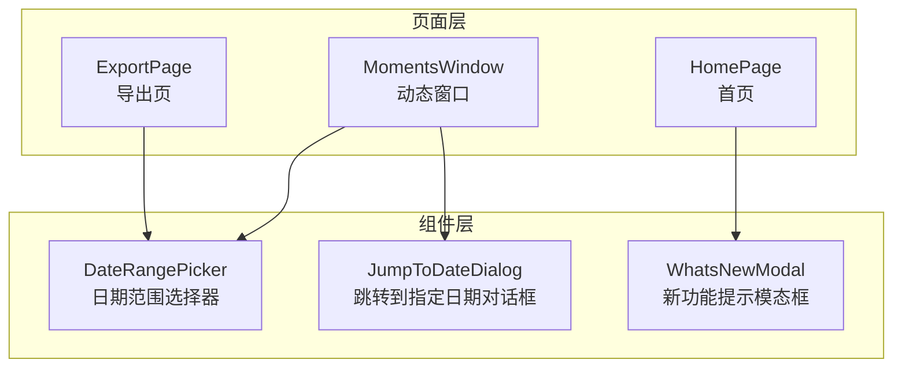
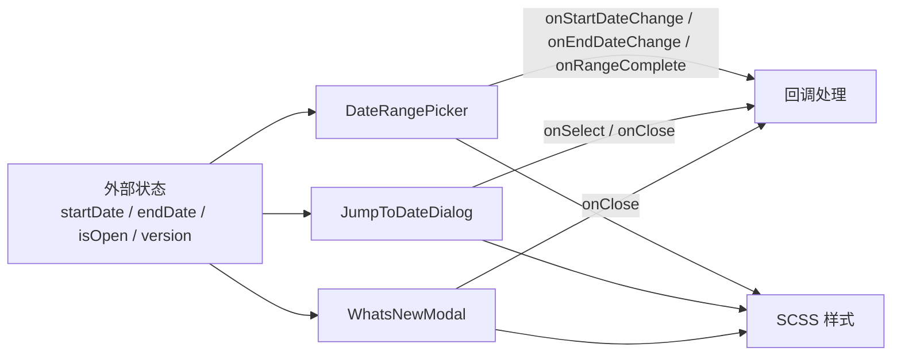
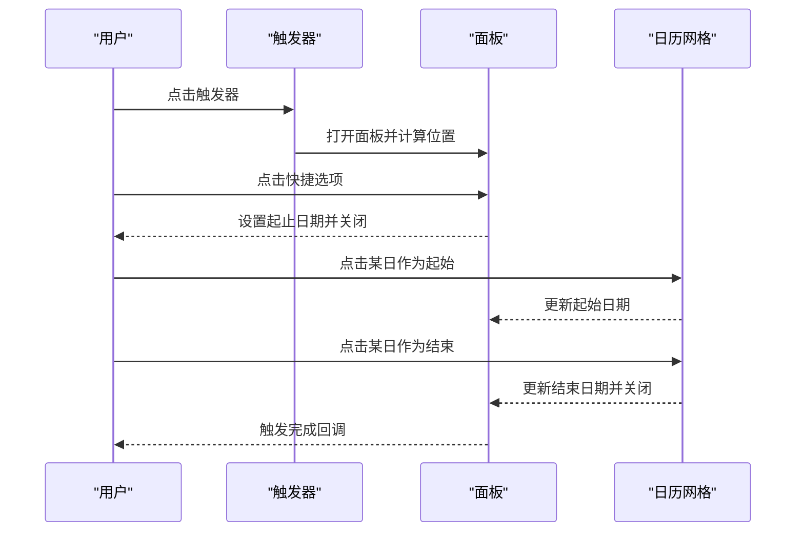
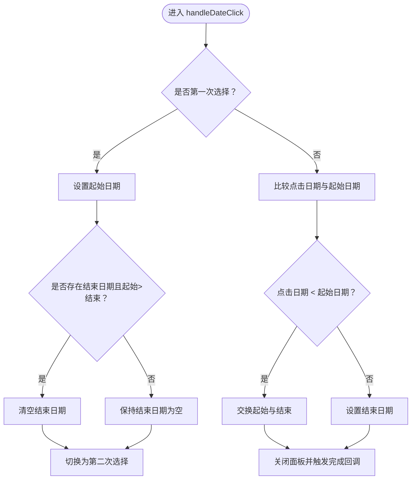
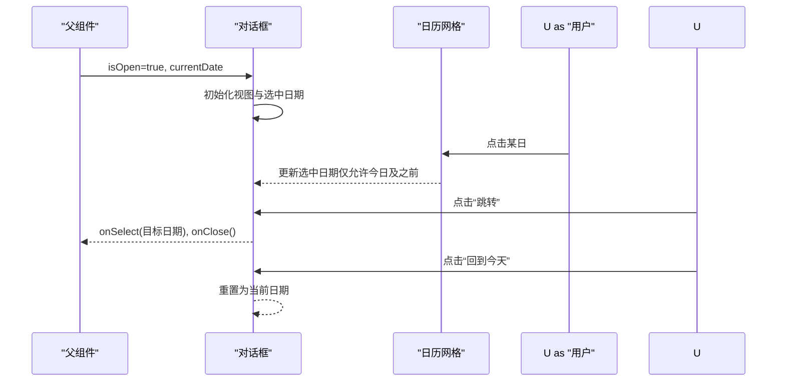
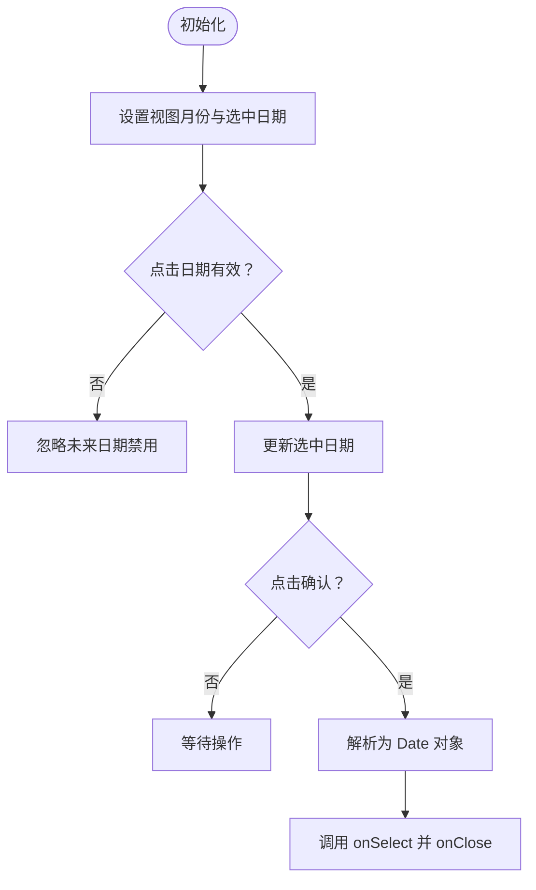
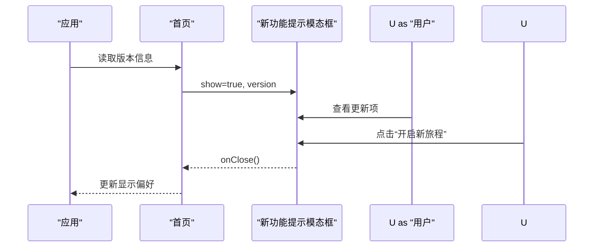
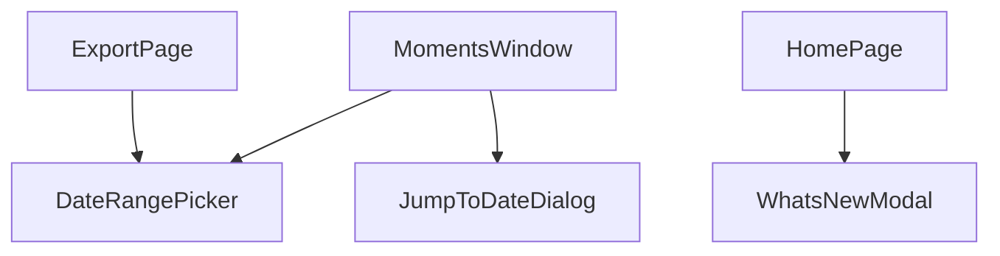

# 工具类组件

<cite>
**本文引用的文件**
- [DateRangePicker.tsx](file://src/components/DateRangePicker.tsx)
- [DateRangePicker.scss](file://src/components/DateRangePicker.scss)
- [JumpToDateDialog.tsx](file://src/components/JumpToDateDialog.tsx)
- [JumpToDateDialog.scss](file://src/components/JumpToDateDialog.scss)
- [WhatsNewModal.tsx](file://src/components/WhatsNewModal.tsx)
- [WhatsNewModal.scss](file://src/components/WhatsNewModal.scss)
- [ExportPage.tsx](file://src/pages/ExportPage.tsx)
- [MomentsWindow.tsx](file://src/pages/MomentsWindow.tsx)
- [HomePage.tsx](file://src/pages/HomePage.tsx)
</cite>

## 目录
1. [简介](#简介)
2. [项目结构](#项目结构)
3. [核心组件](#核心组件)
4. [架构总览](#架构总览)
5. [详细组件分析](#详细组件分析)
6. [依赖关系分析](#依赖关系分析)
7. [性能考量](#性能考量)
8. [故障排查指南](#故障排查指南)
9. [结论](#结论)
10. [附录](#附录)

## 简介
本文件面向工具类组件集合，聚焦以下三个组件的实现与使用指导：
- 日期范围选择器：日期选择逻辑、范围验证、本地化支持
- 跳转到指定日期对话框：日期输入验证、快速跳转、历史记录
- 新功能提示模态框：版本检测、用户偏好、显示策略

同时总结组件的通用设计模式（受控组件、表单验证、状态管理）、可复用性（参数配置、事件处理、样式定制）以及组件开发指导（统一的 API 设计、错误处理、用户体验优化）。

## 项目结构
这些工具类组件位于 src/components 下，并在多个页面中被复用：
- 日期范围选择器在导出页与动态导出页使用
- 跳转到指定日期对话框在动态窗口中用于快速定位日期
- 新功能提示模态框在首页根据版本信息展示

图表来源
- [ExportPage.tsx:640-651](file://src/pages/ExportPage.tsx#L640-L651)
- [MomentsWindow.tsx:1915-1966](file://src/pages/MomentsWindow.tsx#L1915-L1966)
- [HomePage.tsx:115-124](file://src/pages/HomePage.tsx#L115-L124)

章节来源
- [ExportPage.tsx:640-651](file://src/pages/ExportPage.tsx#L640-L651)
- [MomentsWindow.tsx:1915-1966](file://src/pages/MomentsWindow.tsx#L1915-L1966)
- [HomePage.tsx:115-124](file://src/pages/HomePage.tsx#L115-L124)

## 核心组件
- 日期范围选择器：提供快捷选项、日历面板、范围选择与回车回调
- 跳转到指定日期对话框：日历网格、当前日期高亮、禁用未来日期、确认跳转
- 新功能提示模态框：版本号展示、更新项列表、社交入口、关闭行为

章节来源
- [DateRangePicker.tsx:26-239](file://src/components/DateRangePicker.tsx#L26-L239)
- [JumpToDateDialog.tsx:12-179](file://src/components/JumpToDateDialog.tsx#L12-L179)
- [WhatsNewModal.tsx:10-87](file://src/components/WhatsNewModal.tsx#L10-L87)

## 架构总览
三个组件均采用函数式组件 + 受控属性 + 内聚状态的设计模式：
- 通过 props 接收外部状态（如起止日期），通过回调函数回传变更
- 组件内部维护局部 UI 状态（是否打开、当前月份、选择阶段等）
- 样式通过独立 SCSS 文件管理，便于主题切换与样式定制

图表来源
- [DateRangePicker.tsx:5-11](file://src/components/DateRangePicker.tsx#L5-L11)
- [JumpToDateDialog.tsx:5-10](file://src/components/JumpToDateDialog.tsx#L5-L10)
- [WhatsNewModal.tsx:5-8](file://src/components/WhatsNewModal.tsx#L5-L8)

## 详细组件分析

### 日期范围选择器（DateRangePicker）
- 交互流程
  - 点击触发器打开面板，自动计算上下空间决定向下或向上弹出
  - 支持快捷选项（今天、最近 N 天、全部时间）
  - 日历网格渲染，按周标题与空位填充
  - 双次点击完成范围选择，支持交换起止顺序
  - 清空按钮清除已选范围
- 日期选择逻辑
  - 第一次点击设置起始日期；若超过当前结束日期则清空结束日期
  - 第二次点击设置结束日期；若小于当前起始日期则交换并保持闭区间
  - 结束日期选择完成后自动关闭面板并触发完成回调
- 范围验证
  - 起止日期字符串比较保证闭区间有效性
  - 交换时同步更新结束日期为原起始日期
- 本地化支持
  - 月份与星期标题为中文本地化
  - 日期显示格式为“年/月/日”用于展示文本
- 样式与布局
  - 触发器、快捷区、日历区三栏布局
  - 选中起止、范围内区域、今日高亮视觉区分
  - 下拉动画与边框阴影提升可感知性

图表来源
- [DateRangePicker.tsx:185-236](file://src/components/DateRangePicker.tsx#L185-L236)
- [DateRangePicker.tsx:110-130](file://src/components/DateRangePicker.tsx#L110-L130)
- [DateRangePicker.tsx:60-93](file://src/components/DateRangePicker.tsx#L60-L93)

图表来源
- [DateRangePicker.tsx:110-130](file://src/components/DateRangePicker.tsx#L110-L130)

章节来源
- [DateRangePicker.tsx:26-239](file://src/components/DateRangePicker.tsx#L26-L239)
- [DateRangePicker.scss:1-213](file://src/components/DateRangePicker.scss#L1-L213)

### 跳转到指定日期对话框（JumpToDateDialog）
- 交互流程
  - 对话框以遮罩层形式居中显示，支持点击遮罩关闭
  - 顶部标题与关闭按钮，中部为日历网格，底部为“回到今天”和“跳转”按钮
  - 初始化时根据传入的当前日期设置视图与选中日期
- 日期输入验证
  - 仅允许选择今日及之前的日期（禁用未来日期）
  - 选中日期格式为“YYYY-MM-DD”，确认时解析为 Date 对象
- 快速跳转
  - “回到今天”按钮将选中日期与视图重置为当前日期
- 历史记录
  - 通过父组件传入的 currentDate 实现“从上次跳转位置继续”的体验
- 样式与布局
  - 模态上滑动画、网格日历、选中态与禁用态明确区分

图表来源
- [JumpToDateDialog.tsx:12-31](file://src/components/JumpToDateDialog.tsx#L12-L31)
- [JumpToDateDialog.tsx:35-42](file://src/components/JumpToDateDialog.tsx#L35-L42)
- [JumpToDateDialog.tsx:155-173](file://src/components/JumpToDateDialog.tsx#L155-L173)

图表来源
- [JumpToDateDialog.tsx:44-89](file://src/components/JumpToDateDialog.tsx#L44-L89)
- [JumpToDateDialog.tsx:35-42](file://src/components/JumpToDateDialog.tsx#L35-L42)

章节来源
- [JumpToDateDialog.tsx:12-179](file://src/components/JumpToDateDialog.tsx#L12-L179)
- [JumpToDateDialog.scss:1-239](file://src/components/JumpToDateDialog.scss#L1-L239)

### 新功能提示模态框（WhatsNewModal）
- 显示策略
  - 由父组件根据版本信息控制显隐
  - 关闭按钮触发 onClose，通常用于持久化用户偏好（如不再显示）
- 版本检测
  - 通过 props.version 展示当前版本号
  - 更新项列表可扩展，图标与文案分离便于本地化
- 用户偏好
  - 提供社交入口（如加入频道），增强用户粘性
  - 关闭即代表用户偏好“不再显示”该提示
- 样式与布局
  - 渐进式缩放动画、渐变背景、装饰元素提升质感

图表来源
- [HomePage.tsx:115-124](file://src/pages/HomePage.tsx#L115-L124)
- [WhatsNewModal.tsx:10-87](file://src/components/WhatsNewModal.tsx#L10-L87)

章节来源
- [WhatsNewModal.tsx:10-87](file://src/components/WhatsNewModal.tsx#L10-L87)
- [WhatsNewModal.scss:1-200](file://src/components/WhatsNewModal.scss#L1-L200)

## 依赖关系分析
- 组件间无直接依赖，均为独立 UI 组件
- 页面对组件的依赖关系清晰：导出页依赖日期范围选择器；动态窗口依赖日期范围选择器与跳转对话框；首页依赖新功能提示模态框
- 样式文件独立，避免跨组件污染

图表来源
- [ExportPage.tsx:640-651](file://src/pages/ExportPage.tsx#L640-L651)
- [MomentsWindow.tsx:1915-1966](file://src/pages/MomentsWindow.tsx#L1915-L1966)
- [HomePage.tsx:115-124](file://src/pages/HomePage.tsx#L115-L124)

章节来源
- [ExportPage.tsx:640-651](file://src/pages/ExportPage.tsx#L640-L651)
- [MomentsWindow.tsx:1915-1966](file://src/pages/MomentsWindow.tsx#L1915-L1966)
- [HomePage.tsx:115-124](file://src/pages/HomePage.tsx#L115-L124)

## 性能考量
- 日期范围选择器
  - 日历渲染为固定尺寸网格，复杂度与月份天数线性相关，通常在可接受范围
  - 通过一次性计算下拉面板位置减少重排
- 跳转到指定日期对话框
  - 日历网格按需渲染，仅渲染当月天数与必要空位
  - 禁用未来日期减少无效交互
- 新功能提示模态框
  - 仅在版本变化或显隐条件满足时渲染，避免常驻内存

## 故障排查指南
- 日期范围选择器
  - 现象：面板无法关闭
    - 检查外部容器是否正确传递 ref，确保点击外部触发器以外区域可关闭
  - 现象：范围交换后显示异常
    - 检查起止日期字符串比较逻辑与交换分支
- 跳转到指定日期对话框
  - 现象：未来日期仍可被选中
    - 检查禁用逻辑与标题提示
  - 现象：确认按钮不可用
    - 检查选中日期状态是否为空
- 新功能提示模态框
  - 现象：版本号未显示
    - 检查父组件传入的 version 是否存在
  - 现象：关闭后再次出现
    - 检查父组件的显示控制与偏好存储逻辑

章节来源
- [DateRangePicker.tsx:34-45](file://src/components/DateRangePicker.tsx#L34-L45)
- [JumpToDateDialog.tsx:70-82](file://src/components/JumpToDateDialog.tsx#L70-L82)
- [JumpToDateDialog.tsx:168-170](file://src/components/JumpToDateDialog.tsx#L168-L170)
- [WhatsNewModal.tsx:52-54](file://src/components/WhatsNewModal.tsx#L52-L54)

## 结论
上述工具类组件以简洁的受控 API、明确的状态流转与一致的样式体系实现了高可用的日期选择与提示能力。它们在多页面场景中复用良好，具备良好的可扩展性与可维护性。建议在后续迭代中进一步完善国际化与无障碍支持，并考虑引入更完善的日期校验库以增强健壮性。

## 附录

### 组件通用设计模式
- 受控组件
  - 通过 props 接收外部状态，通过回调回传变更，避免内部持有全局状态
- 表单验证
  - 在确认或提交前进行边界检查（如未来日期禁用、范围有效性）
- 状态管理
  - 组件内部仅维护 UI 状态（如是否打开、当前月份、选择阶段）

### 可复用性
- 参数配置
  - 通过 props 传入初始值与回调，支持不同业务场景下的差异化行为
- 事件处理
  - 明确的回调接口（如 onStartDateChange、onSelect、onClose）便于集成
- 样式定制
  - 独立 SCSS 文件，变量化主题色，便于适配深浅主题与品牌风格

### 组件开发指导
- 统一的 API 设计
  - 保持 props 命名一致性（如 isOpen、onSelect、onClose）
  - 将展示文本与交互行为分离，便于本地化与测试
- 错误处理
  - 对非法输入（如未来日期）进行显式禁用与提示
  - 对边界情况（如范围交换）进行防御性编程
- 用户体验优化
  - 提供快捷选项与“回到今天”等常用路径
  - 使用动画与视觉反馈增强可感知性
  - 控制组件可见性与层级，避免遮挡关键操作