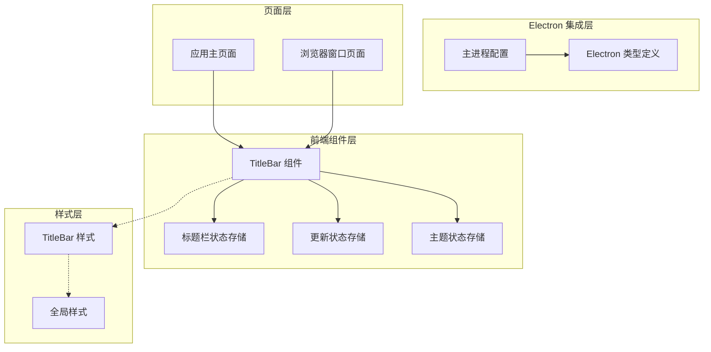
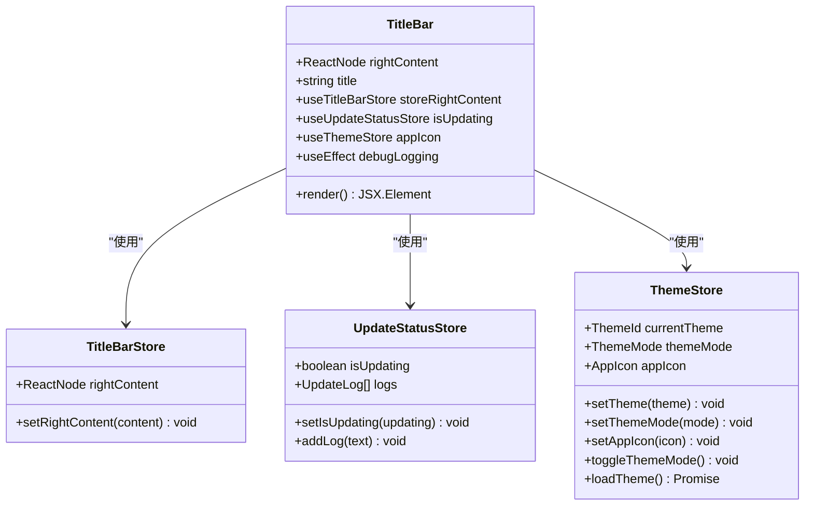
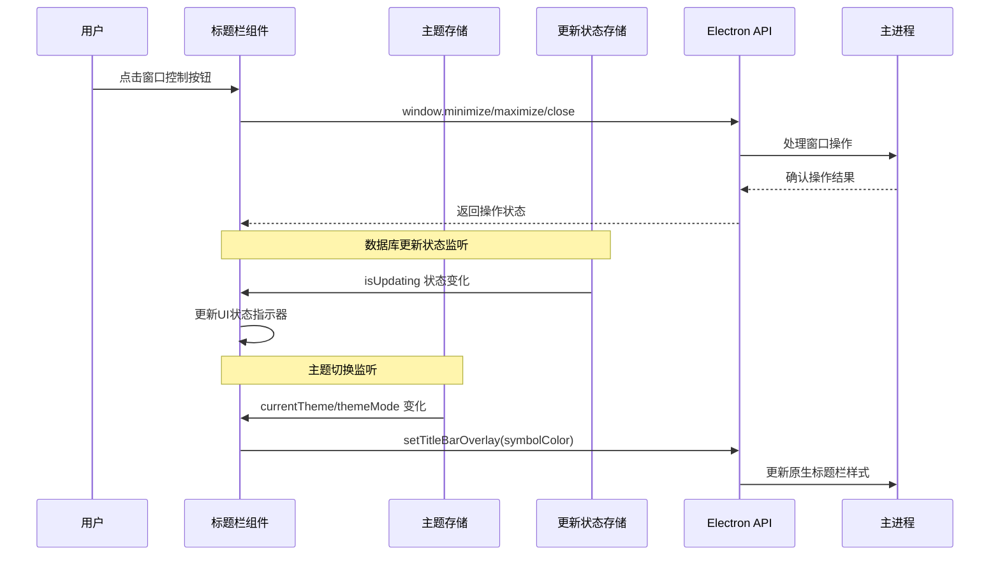
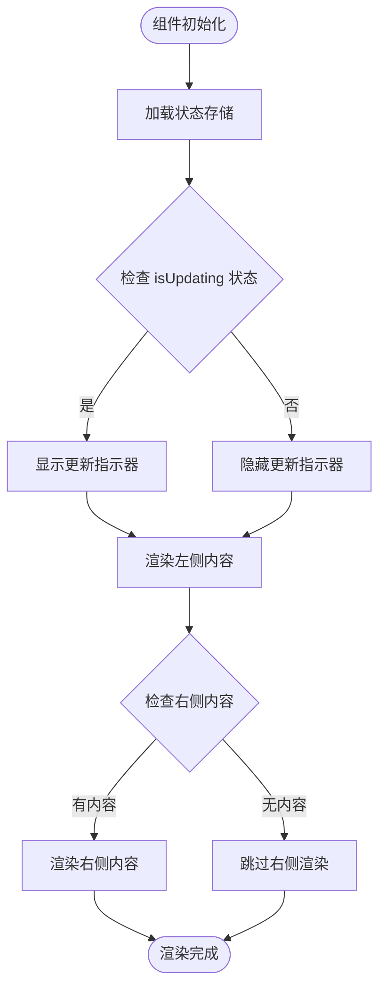
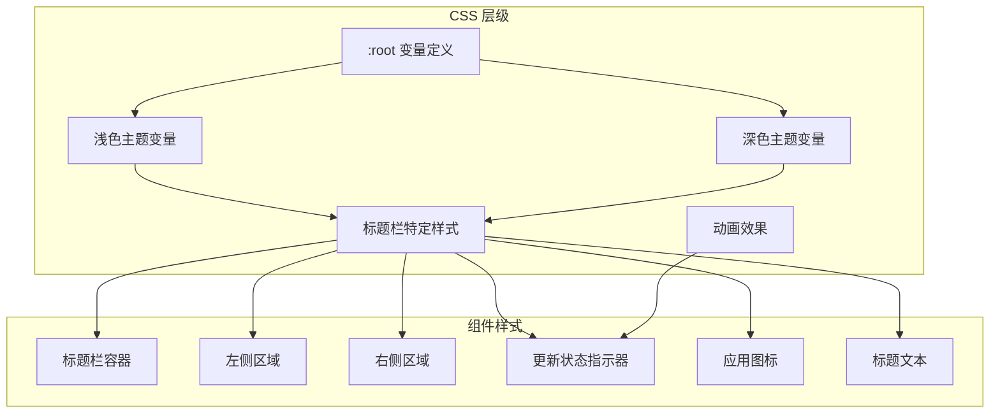
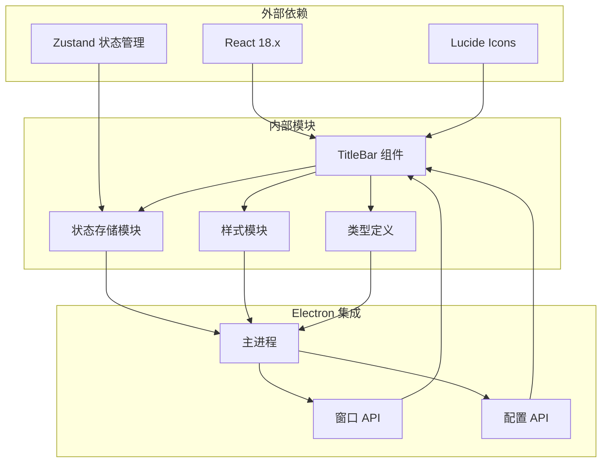
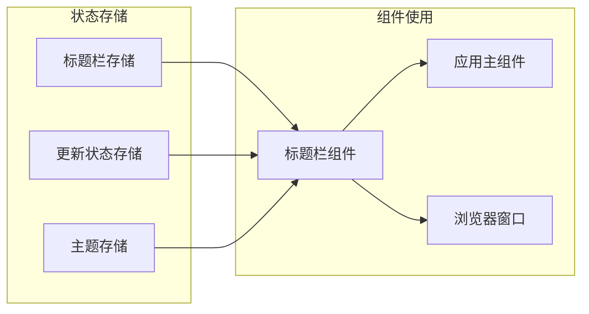

# 标题栏组件

<cite>
**本文档引用的文件**
- [TitleBar.tsx](file://src/components/TitleBar.tsx)
- [TitleBar.scss](file://src/components/TitleBar.scss)
- [titleBarStore.ts](file://src/stores/titleBarStore.ts)
- [updateStatusStore.ts](file://src/stores/updateStatusStore.ts)
- [themeStore.ts](file://src/stores/themeStore.ts)
- [main.ts](file://electron/main.ts)
- [electron.d.ts](file://src/types/electron.d.ts)
- [App.tsx](file://src/App.tsx)
- [BrowserWindowPage.tsx](file://src/pages/BrowserWindowPage.tsx)
- [main.scss](file://src/styles/main.scss)
</cite>

## 目录
1. [简介](#简介)
2. [项目结构](#项目结构)
3. [核心组件](#核心组件)
4. [架构概览](#架构概览)
5. [详细组件分析](#详细组件分析)
6. [依赖关系分析](#依赖关系分析)
7. [性能考虑](#性能考虑)
8. [故障排除指南](#故障排除指南)
9. [结论](#结论)

## 简介

标题栏组件是 CipherTalk 应用程序的核心界面元素，负责提供统一的应用程序外观和用户交互体验。该组件实现了原生窗口控制功能，集成了应用程序图标、标题显示和实时状态指示器，为用户提供直观的窗口管理和状态反馈。

CipherTalk 采用 Electron 架构构建，标题栏组件需要在不同操作系统（Windows、Linux、macOS）上提供一致的用户体验，同时充分利用各平台的原生特性。组件设计考虑了跨平台兼容性、主题适配和响应式布局，确保在各种使用场景下都能提供优质的用户体验。

## 项目结构

标题栏组件位于前端项目的组件目录中，与相关的状态管理、样式定义和 Electron 集成紧密配合：

**图表来源**
- [TitleBar.tsx:1-52](file://src/components/TitleBar.tsx#L1-L52)
- [main.ts:193-281](file://electron/main.ts#L193-L281)

**章节来源**
- [TitleBar.tsx:1-52](file://src/components/TitleBar.tsx#L1-L52)
- [main.ts:193-281](file://electron/main.ts#L193-L281)

## 核心组件

标题栏组件是一个高度模块化的 React 组件，具有以下核心特性：

### 组件架构设计

**图表来源**
- [TitleBar.tsx:8-17](file://src/components/TitleBar.tsx#L8-L17)
- [titleBarStore.ts:4-12](file://src/stores/titleBarStore.ts#L4-L12)
- [updateStatusStore.ts:9-27](file://src/stores/updateStatusStore.ts#L9-L27)
- [themeStore.ts:67-140](file://src/stores/themeStore.ts#L67-L140)

### 主要功能特性

1. **动态内容渲染**：支持自定义右侧内容区域，可插入按钮组、菜单或其他交互元素
2. **实时状态指示**：显示数据库同步状态和更新进度
3. **主题适配**：根据当前主题动态调整样式和图标
4. **响应式设计**：适应不同屏幕尺寸和窗口大小

**章节来源**
- [TitleBar.tsx:13-49](file://src/components/TitleBar.tsx#L13-L49)
- [titleBarStore.ts:9-12](file://src/stores/titleBarStore.ts#L9-L12)

## 架构概览

标题栏组件在整个应用程序架构中扮演着关键角色，连接了用户界面、状态管理和 Electron 系统集成：

**图表来源**
- [App.tsx:74-88](file://src/App.tsx#L74-L88)
- [electron.d.ts:15-46](file://src/types/electron.d.ts#L15-L46)
- [main.ts:193-281](file://electron/main.ts#L193-L281)

### 窗口控制集成

标题栏组件通过 Electron 的窗口 API 实现原生窗口控制功能：

| 功能 | 方法 | 描述 |
|------|------|------|
| 最小化 | `window.minimize()` | 将窗口最小化到任务栏/托盘 |
| 最大化 | `window.maximize()` | 切换窗口最大化状态 |
| 关闭 | `window.close()` | 关闭当前窗口 |
| 标题栏覆盖 | `setTitleBarOverlay(options)` | 更新原生标题栏样式 |

**章节来源**
- [electron.d.ts:15-46](file://src/types/electron.d.ts#L15-L46)
- [App.tsx:76](file://src/App.tsx#L76)

## 详细组件分析

### 标题栏组件实现

标题栏组件采用函数式组件设计，利用 React Hooks 进行状态管理：

#### 核心渲染逻辑

**图表来源**
- [TitleBar.tsx:13-49](file://src/components/TitleBar.tsx#L13-L49)

#### 状态管理机制

组件使用三个主要的状态存储：

1. **标题栏存储**：管理右侧自定义内容
2. **更新状态存储**：跟踪数据库同步状态
3. **主题存储**：维护应用程序主题配置

**章节来源**
- [TitleBar.tsx:13-17](file://src/components/TitleBar.tsx#L13-L17)
- [titleBarStore.ts:9-12](file://src/stores/titleBarStore.ts#L9-L12)
- [updateStatusStore.ts:16-27](file://src/stores/updateStatusStore.ts#L16-L27)

### 样式系统设计

标题栏组件采用现代化的 CSS 架构，支持主题系统和响应式设计：

#### 样式层次结构

**图表来源**
- [TitleBar.scss:1-112](file://src/components/TitleBar.scss#L1-L112)
- [main.scss:4-427](file://src/styles/main.scss#L4-L427)

#### 主题适配机制

组件支持多种主题模式：

| 主题名称 | 主题 ID | 颜色方案 | 适用场景 |
|----------|---------|----------|----------|
| 云上舞白 | cloud-dancer | 温暖米色系 | 默认主题 |
| 刚玉蓝 | corundum-blue | 冷色调蓝色 | 科技感需求 |
| 冰猕猴桃汁绿 | kiwi-green | 清新绿色系 | 自然风格偏好 |
| 辛辣红 | spicy-red | 活力红色系 | 热情风格 |
| 明水鸭色 | teal-water | 水色系 | 清雅风格 |
| 新年快乐 | new-year | 红色节日主题 | 春节期间 |
| 樱雾粉 | sakura-mist | 粉色樱花主题 | 温柔风格 |

**章节来源**
- [themeStore.ts:15-65](file://src/stores/themeStore.ts#L15-L65)
- [main.scss:47-321](file://src/styles/main.scss#L47-L321)

### 跨平台兼容性

标题栏组件针对不同操作系统进行了专门优化：

#### Windows 平台特性

- **原生标题栏支持**：使用 `titleBarStyle: 'hidden'` 和 `titleBarOverlay` 实现自定义标题栏
- **窗口控制按钮**：通过 Electron API 实现最小化、最大化、关闭功能
- **图标适配**：支持 `.ico` 格式图标文件

#### macOS 平台特性

- **原生窗口装饰**：利用 macOS 原生窗口控制按钮
- **窗口拖拽区域**：使用 `-webkit-app-region: drag` 实现标题栏拖拽
- **深色模式支持**：自动适配系统深色模式

#### Linux 平台特性

- **通用窗口管理**：兼容大多数 Linux 桌面环境
- **图标资源**：支持 `.png` 格式图标文件
- **主题一致性**：遵循桌面环境的主题规范

**章节来源**
- [main.ts:196-215](file://electron/main.ts#L196-L215)
- [main.ts:300-320](file://electron/main.ts#L300-L320)

### 响应式设计实现

标题栏组件采用灵活的布局系统，适应不同的屏幕尺寸和窗口状态：

#### 布局特性

| 属性 | 值 | 说明 |
|------|-----|------|
| 高度 | 41px | 固定标题栏高度 |
| 左侧内边距 | 16px | 标题栏左侧留白 |
| 右侧内边距 | 144px | 为窗口控制按钮预留空间 |
| 图标尺寸 | 20x20px | 应用程序图标大小 |
| 标题最大宽度 | 600px | 防止标题过长溢出 |

**章节来源**
- [TitleBar.scss:1-12](file://src/components/TitleBar.scss#L1-L12)
- [TitleBar.scss:59-73](file://src/components/TitleBar.scss#L59-L73)

## 依赖关系分析

标题栏组件的依赖关系体现了清晰的关注点分离和模块化设计：

**图表来源**
- [TitleBar.tsx:1-6](file://src/components/TitleBar.tsx#L1-L6)
- [main.ts:1-35](file://electron/main.ts#L1-L35)

### 状态管理依赖

组件的状态管理采用轻量级的状态管理模式：

**图表来源**
- [titleBarStore.ts:1-13](file://src/stores/titleBarStore.ts#L1-L13)
- [updateStatusStore.ts:1-28](file://src/stores/updateStatusStore.ts#L1-L28)
- [themeStore.ts:1-146](file://src/stores/themeStore.ts#L1-L146)

**章节来源**
- [TitleBar.tsx:3-5](file://src/components/TitleBar.tsx#L3-L5)
- [App.tsx:28-32](file://src/App.tsx#L28-L32)

## 性能考虑

标题栏组件在设计时充分考虑了性能优化，采用了多种策略确保流畅的用户体验：

### 渲染优化

1. **条件渲染**：仅在状态变化时重新渲染相关部分
2. **状态分离**：将不同类型的更新状态分离到独立的存储中
3. **懒加载图标**：根据主题动态选择图标资源

### 内存管理

1. **状态清理**：组件卸载时自动清理事件监听器
2. **存储优化**：使用轻量级状态存储避免不必要的重渲染
3. **资源复用**：图标和样式资源在应用范围内共享

### 事件处理优化

1. **防抖处理**：对频繁触发的状态变化进行防抖处理
2. **事件委托**：合理使用事件委托减少事件处理器数量
3. **异步更新**：将耗时的操作放到异步队列中执行

## 故障排除指南

### 常见问题诊断

#### 标题栏不显示窗口控制按钮

**症状**：标题栏右侧没有最小化、最大化、关闭按钮
**可能原因**：
1. Electron 窗口配置问题
2. 样式冲突
3. JavaScript 错误

**解决方案**：
1. 检查主进程窗口配置中的 `titleBarStyle` 设置
2. 验证 CSS 样式是否正确应用
3. 查看浏览器控制台错误信息

#### 主题切换不生效

**症状**：切换主题后标题栏颜色没有变化
**可能原因**：
1. 主题存储状态未正确更新
2. CSS 变量未正确应用
3. 浏览器缓存问题

**解决方案**：
1. 确认 `themeStore` 中的主题状态已更新
2. 检查 `data-theme` 属性是否正确设置
3. 强制刷新页面清除缓存

#### 更新状态指示器异常

**症状**：更新指示器持续显示或不显示
**可能原因**：
1. 更新状态存储逻辑错误
2. Electron API 调用失败
3. 网络连接问题

**解决方案**：
1. 检查 `updateStatusStore` 的状态管理逻辑
2. 验证 Electron 更新 API 的调用
3. 确认网络连接状态

**章节来源**
- [App.tsx:136-168](file://src/App.tsx#L136-L168)
- [updateStatusStore.ts:16-27](file://src/stores/updateStatusStore.ts#L16-L27)

### 调试技巧

1. **启用开发工具**：使用 `F12` 或 `Ctrl+Shift+I` 打开开发者工具
2. **监控状态变化**：在浏览器控制台中观察状态存储的变化
3. **检查网络请求**：验证 Electron API 调用是否成功
4. **验证样式应用**：使用元素检查器确认 CSS 类是否正确应用

## 结论

标题栏组件作为 CipherTalk 应用程序的重要组成部分，展现了现代前端开发的最佳实践。组件设计充分考虑了跨平台兼容性、主题适配和用户体验，在保持功能完整性的同时实现了良好的性能表现。

通过模块化的设计和清晰的依赖关系，标题栏组件为整个应用程序提供了稳定的基础框架。其灵活的定制能力和强大的状态管理系统，使得开发者能够轻松地扩展和修改组件功能，以满足不断变化的业务需求。

未来的发展方向包括进一步优化性能、增强可访问性支持以及探索新的交互模式，以持续提升用户满意度和产品竞争力。