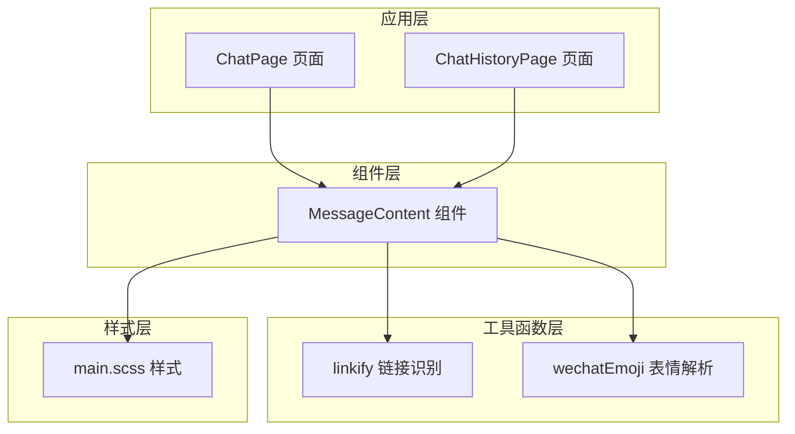
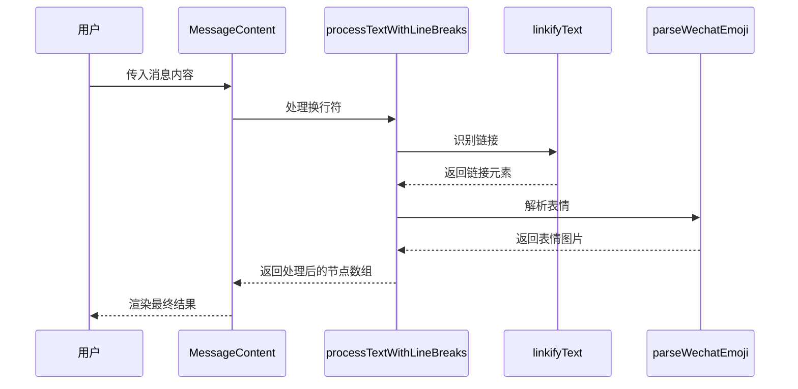
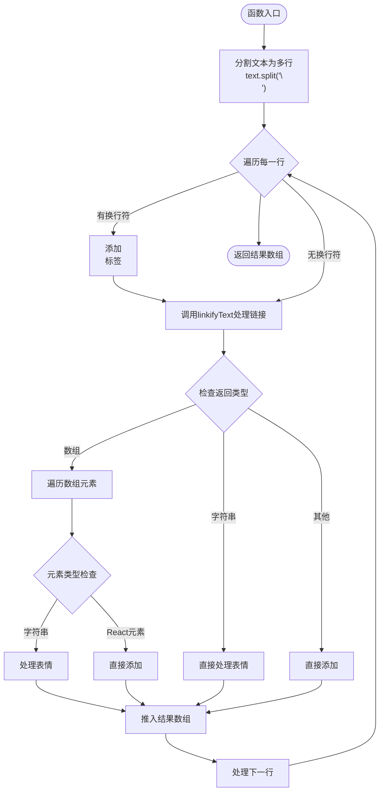
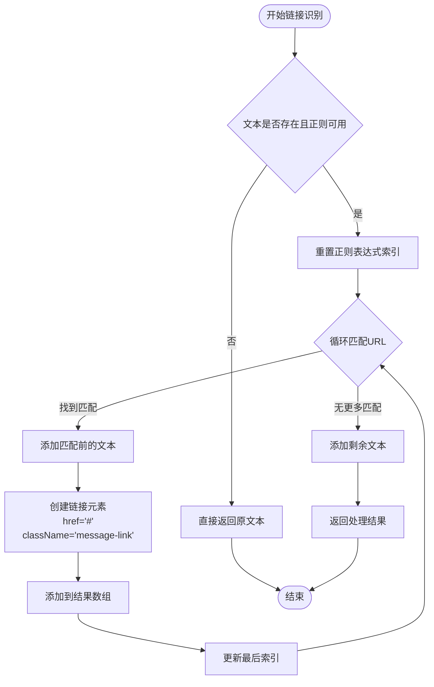
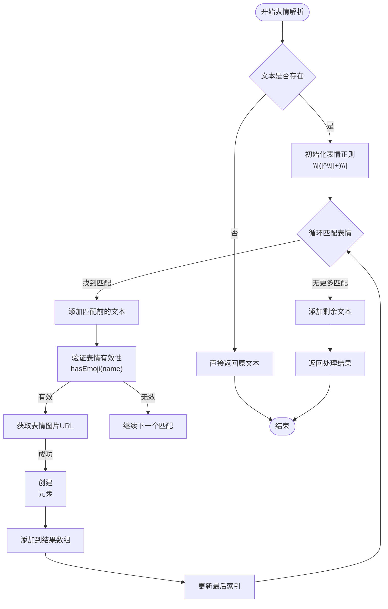
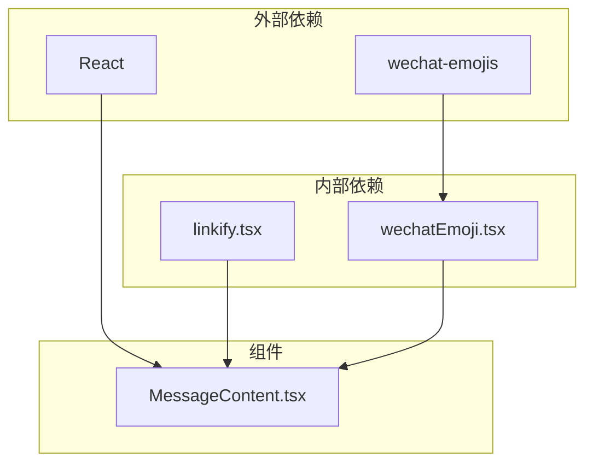

# 消息内容组件

<cite>
**本文档引用的文件**
- [MessageContent.tsx](file://src/components/MessageContent.tsx)
- [linkify.tsx](file://src/utils/linkify.tsx)
- [wechatEmoji.tsx](file://src/utils/wechatEmoji.tsx)
- [main.scss](file://src/styles/main.scss)
- [ChatPage.tsx](file://src/pages/ChatPage.tsx)
- [ChatHistoryPage.tsx](file://src/pages/ChatHistoryPage.tsx)
</cite>

## 目录
1. [简介](#简介)
2. [项目结构](#项目结构)
3. [核心组件](#核心组件)
4. [架构概览](#架构概览)
5. [详细组件分析](#详细组件分析)
6. [依赖关系分析](#依赖关系分析)
7. [性能考虑](#性能考虑)
8. [故障排除指南](#故障排除指南)
9. [结论](#结论)
10. [附录](#附录)

## 简介

消息内容组件是一个专门用于渲染微信聊天消息内容的React组件。该组件提供了强大的文本处理能力，包括换行符处理、链接识别和微信表情解析，能够将原始文本转换为富文本格式，支持用户交互和自定义样式。

该组件的设计目标是在保持高性能的同时，提供丰富的消息内容渲染功能，支持各种复杂的消息格式和用户需求。

## 项目结构

消息内容组件位于项目的组件目录中，与相关的工具函数和样式文件共同构成了完整的消息渲染系统。



**图表来源**
- [MessageContent.tsx:1-103](file://src/components/MessageContent.tsx#L1-L103)
- [linkify.tsx:1-115](file://src/utils/linkify.tsx#L1-L115)
- [wechatEmoji.tsx:1-157](file://src/utils/wechatEmoji.tsx#L1-L157)

**章节来源**
- [MessageContent.tsx:1-103](file://src/components/MessageContent.tsx#L1-L103)
- [linkify.tsx:1-115](file://src/utils/linkify.tsx#L1-L115)
- [wechatEmoji.tsx:1-157](file://src/utils/wechatEmoji.tsx#L1-L157)

## 核心组件

### Props 接口设计

消息内容组件采用简洁而功能完整的Props接口设计：

```typescript
interface MessageContentProps {
  content: string
  className?: string
}
```

- **content**: 必需参数，表示要渲染的消息内容文本
- **className**: 可选参数，允许外部传入自定义CSS类名

### 主要功能特性

1. **换行符处理**: 自动将文本中的 `\n` 转换为 `<br />` 标签
2. **链接识别**: 智能识别URL链接并转换为可点击的链接元素
3. **微信表情解析**: 支持微信表情符号的识别和图片渲染
4. **条件渲染**: 支持禁用链接功能的模式
5. **性能优化**: 使用React Fragment减少DOM节点开销

**章节来源**
- [MessageContent.tsx:5-8](file://src/components/MessageContent.tsx#L5-L8)
- [MessageContent.tsx:70-100](file://src/components/MessageContent.tsx#L70-L100)

## 架构概览

消息内容组件采用了分层架构设计，将不同的处理逻辑分离到独立的模块中：



**图表来源**
- [MessageContent.tsx:14-64](file://src/components/MessageContent.tsx#L14-L64)
- [linkify.tsx:69-114](file://src/utils/linkify.tsx#L69-L114)
- [wechatEmoji.tsx:21-66](file://src/utils/wechatEmoji.tsx#L21-L66)

## 详细组件分析

### 文本处理算法

#### processTextWithLineBreaks 函数实现

该函数负责处理文本中的换行符并协调其他处理步骤：



**图表来源**
- [MessageContent.tsx:14-64](file://src/components/MessageContent.tsx#L14-L64)

#### linkifyText 链接识别

链接识别功能通过复杂的正则表达式实现，支持多种URL格式：



**图表来源**
- [linkify.tsx:69-114](file://src/utils/linkify.tsx#L69-L114)

#### parseWechatEmoji 表情转换

表情解析功能使用正则表达式识别微信表情符号并转换为图片：



**图表来源**
- [wechatEmoji.tsx:21-66](file://src/utils/wechatEmoji.tsx#L21-L66)

### 渲染策略

#### React Fragment 使用

组件大量使用 React Fragment 来减少不必要的DOM节点：

- 每行文本处理时使用 Fragment 包裹
- 链接和表情的组合处理使用 Fragment
- 避免了额外的包装元素，提高了渲染性能

#### 条件渲染

组件实现了智能的条件渲染机制：

```typescript
if (!content) return null
if (disableLinks) {
  // 只处理表情和换行
} else {
  // 处理换行、链接和表情
}
```

这种设计允许在不同场景下优化渲染性能，避免不必要的链接处理。

#### 性能优化

1. **Fragment 优化**: 减少DOM层级深度
2. **条件处理**: 避免不必要的链接识别
3. **正则优化**: 使用非全局正则避免 lastIndex 并发问题
4. **缓存机制**: 表情图片的Base64缓存

**章节来源**
- [MessageContent.tsx:14-64](file://src/components/MessageContent.tsx#L14-L64)
- [MessageContent.tsx:70-100](file://src/components/MessageContent.tsx#L70-L100)

## 依赖关系分析

消息内容组件的依赖关系清晰明确，遵循单一职责原则：



**图表来源**
- [MessageContent.tsx:1-3](file://src/components/MessageContent.tsx#L1-L3)
- [wechatEmoji.tsx:1-2](file://src/utils/wechatEmoji.tsx#L1-L2)

### 组件耦合度分析

- **低耦合**: 组件与工具函数之间通过清晰的接口通信
- **高内聚**: 每个工具函数专注于特定的功能领域
- **可测试性**: 每个函数都可以独立测试
- **可维护性**: 功能模块化，便于维护和扩展

**章节来源**
- [MessageContent.tsx:1-3](file://src/components/MessageContent.tsx#L1-L3)
- [linkify.tsx:1-1](file://src/utils/linkify.tsx#L1-L1)
- [wechatEmoji.tsx:1-2](file://src/utils/wechatEmoji.tsx#L1-L2)

## 性能考虑

### 渲染性能优化

1. **Fragment 使用**: 减少DOM节点数量，提高渲染效率
2. **条件渲染**: 避免不必要的链接处理
3. **正则表达式优化**: 避免全局正则的并发问题
4. **缓存机制**: 表情图片的Base64缓存减少网络请求

### 内存使用优化

1. **字符串处理**: 使用原生字符串处理，避免额外的对象创建
2. **正则复用**: 单例模式避免重复创建正则表达式
3. **事件处理**: 使用防抖和节流优化用户交互

### 网络性能优化

1. **TLD 缓存**: 从本地缓存获取顶级域名列表，减少网络请求
2. **表情图片缓存**: Base64缓存避免重复下载
3. **懒加载**: 表情图片支持懒加载

## 故障排除指南

### 常见问题及解决方案

#### 链接识别问题

**问题**: 链接没有被正确识别
**原因**: 
- TLD 列表未正确初始化
- 文本中包含特殊字符
- 正则表达式匹配失败

**解决方案**:
1. 确保调用 `initTldList()` 初始化 TLD 列表
2. 检查文本中是否包含特殊字符
3. 验证正则表达式的有效性

#### 表情显示问题

**问题**: 表情图片没有正确显示
**原因**:
- 表情名称不在支持列表中
- 图片路径获取失败
- 网络请求超时

**解决方案**:
1. 验证表情名称的有效性
2. 检查图片资源的可用性
3. 实现重试机制和错误回退

#### 性能问题

**问题**: 大量消息渲染缓慢
**原因**:
- 单次渲染过多节点
- 缺少必要的缓存
- 不必要的重新渲染

**解决方案**:
1. 实现虚拟滚动
2. 添加适当的缓存机制
3. 使用 React.memo 优化渲染

**章节来源**
- [linkify.tsx:35-64](file://src/utils/linkify.tsx#L35-L64)
- [wechatEmoji.tsx:87-155](file://src/utils/wechatEmoji.tsx#L87-L155)

## 结论

消息内容组件是一个设计精良、功能完善的React组件，它成功地将复杂的文本处理逻辑封装在一个简洁的接口背后。组件的主要优势包括：

1. **功能完整性**: 支持换行符、链接识别和表情解析三大核心功能
2. **性能优化**: 通过多种技术手段确保高效的渲染性能
3. **可扩展性**: 清晰的架构设计便于功能扩展和维护
4. **用户体验**: 提供丰富的消息内容渲染体验

该组件为整个聊天系统的消息显示提供了坚实的基础，是项目中不可或缺的重要组成部分。

## 附录

### 使用示例

#### 基本用法
```typescript
<MessageContent content="Hello\nWorld" />
```

#### 禁用链接模式
```typescript
<MessageContent content="Visit https://example.com" disableLinks={true} />
```

#### 自定义样式
```typescript
<MessageContent 
  content="Custom styled message" 
  className="custom-message" 
/>
```

### 扩展指导

#### 支持更多表情类型
1. 在 `wechatEmoji.tsx` 中扩展表情映射
2. 添加新的表情图片资源
3. 更新表情验证逻辑

#### 自定义链接样式
1. 修改 `main.scss` 中的 `.message-link` 样式
2. 添加新的链接样式类
3. 实现主题切换支持

#### 国际化支持
1. 在 `linkify.tsx` 中添加本地化规则
2. 实现多语言表情名称支持
3. 添加语言检测和切换功能

**章节来源**
- [ChatPage.tsx:190-196](file://src/pages/ChatPage.tsx#L190-L196)
- [ChatPage.tsx:3546-3547](file://src/pages/ChatPage.tsx#L3546-L3547)
- [ChatHistoryPage.tsx:186-189](file://src/pages/ChatHistoryPage.tsx#L186-L189)