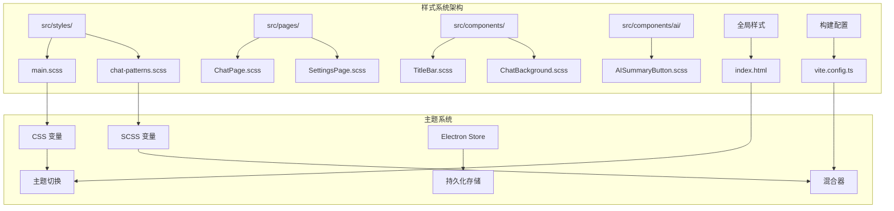
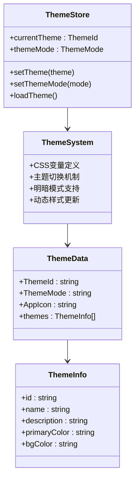
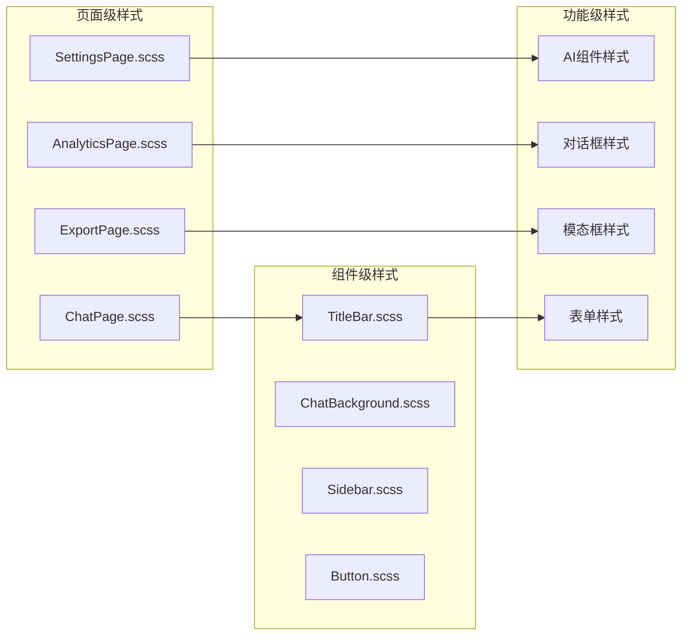
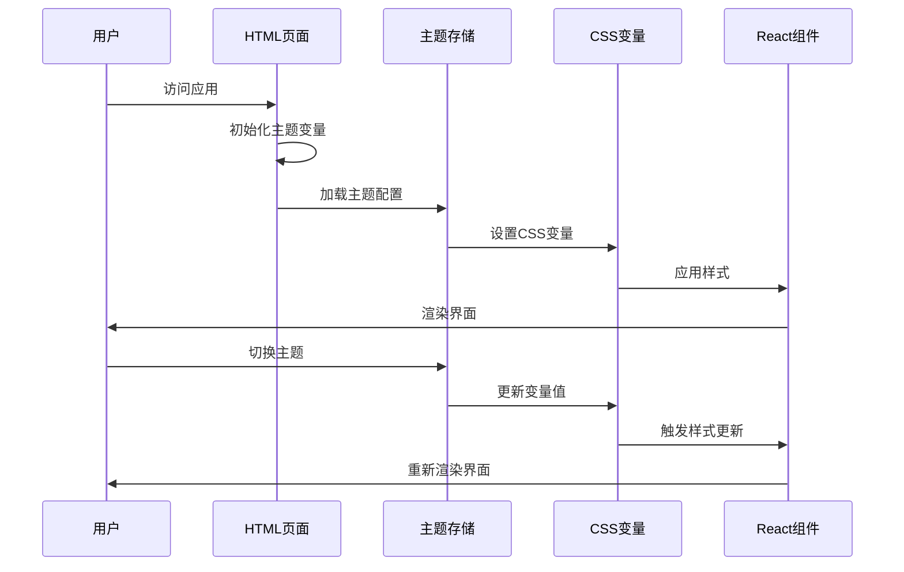
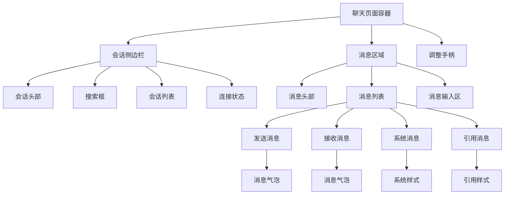
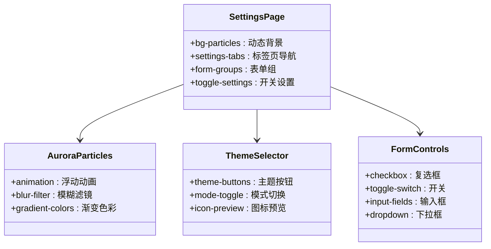
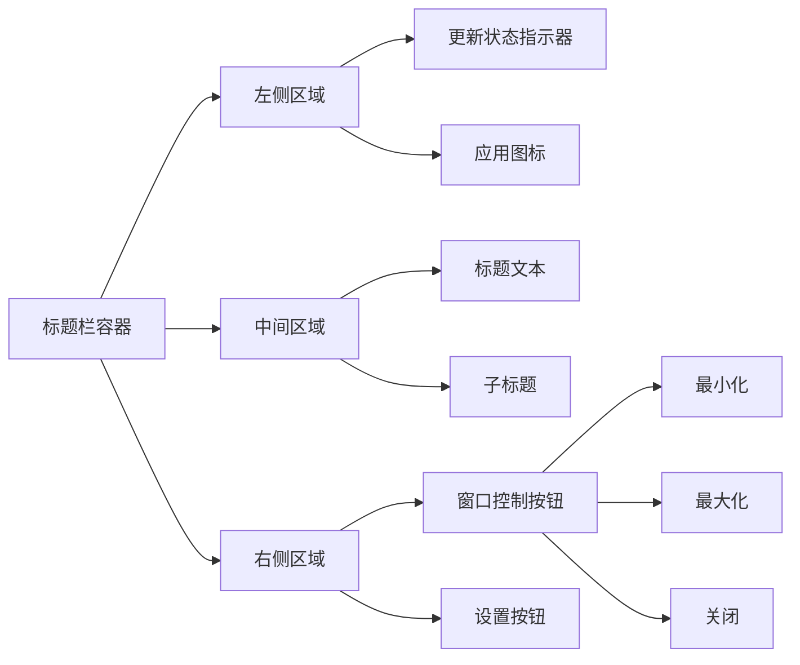
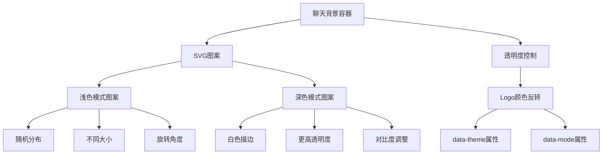

# 样式系统设计

<cite>
**本文档引用的文件**
- [src/styles/main.scss](file://src/styles/main.scss)
- [src/styles/chat-patterns.scss](file://src/styles/chat-patterns.scss)
- [src/App.scss](file://src/App.scss)
- [src/pages/ChatPage.scss](file://src/pages/ChatPage.scss)
- [src/components/TitleBar.scss](file://src/components/TitleBar.scss)
- [src/components/ChatBackground.scss](file://src/components/ChatBackground.scss)
- [src/pages/SettingsPage.scss](file://src/pages/SettingsPage.scss)
- [src/components/ai/AISummaryButton.scss](file://src/components/ai/AISummaryButton.scss)
- [index.html](file://index.html)
- [vite.config.ts](file://vite.config.ts)
- [package.json](file://package.json)
- [src/stores/themeStore.ts](file://src/stores/themeStore.ts)
- [src/components/Sidebar.tsx](file://src/components/Sidebar.tsx)
</cite>

## 目录
1. [简介](#简介)
2. [项目结构](#项目结构)
3. [核心组件](#核心组件)
4. [架构概览](#架构概览)
5. [详细组件分析](#详细组件分析)
6. [依赖关系分析](#依赖关系分析)
7. [性能考虑](#性能考虑)
8. [故障排除指南](#故障排除指南)
9. [结论](#结论)

## 简介

CipherTalk 是一个基于 Electron 和 React 的微信聊天记录查看工具，其样式系统采用了现代化的设计理念和技术栈。该样式系统以 CSS 变量为核心，结合 SCSS 预处理器，实现了完整的主题系统、响应式设计和性能优化。

本系统的核心特点包括：
- 基于 CSS 变量的主题系统，支持 7 种主题和明暗模式切换
- 模块化的 SCSS 架构，采用 BEM 命名规范
- 完整的响应式设计，覆盖桌面端和移动端场景
- 性能优化策略，包括 CSS 压缩和关键路径样式
- 与 React 组件的无缝集成

## 项目结构

CipherTalk 的样式系统采用模块化组织方式，主要分为以下几个层次：



**图表来源**
- [src/styles/main.scss:1-427](file://src/styles/main.scss#L1-L427)
- [src/styles/chat-patterns.scss:1-19](file://src/styles/chat-patterns.scss#L1-L19)
- [index.html:1-37](file://index.html#L1-L37)

**章节来源**
- [src/styles/main.scss:1-427](file://src/styles/main.scss#L1-L427)
- [src/styles/chat-patterns.scss:1-19](file://src/styles/chat-patterns.scss#L1-L19)
- [index.html:1-37](file://index.html#L1-L37)

## 核心组件

### CSS 变量主题系统

CipherTalk 的主题系统基于原生 CSS 变量实现，提供了完整的主题切换机制：



**图表来源**
- [src/stores/themeStore.ts:1-146](file://src/stores/themeStore.ts#L1-L146)
- [src/styles/main.scss:4-320](file://src/styles/main.scss#L4-L320)

系统支持 7 种主题：
- 云上舞白 (Cloud Dancer)
- 刚玉蓝 (Corundum Blue)  
- 冰猕猴桃汁绿 (Kiwi Green)
- 辛辣红 (Spicy Red)
- 明水鸭色 (Teal Water)
- 新年快乐 (New Year)
- 樱雾粉 (Sakura Mist)

每种主题都提供明暗两种模式，共计 14 种组合。

**章节来源**
- [src/stores/themeStore.ts:15-65](file://src/stores/themeStore.ts#L15-L65)
- [src/styles/main.scss:45-320](file://src/styles/main.scss#L45-L320)

### SCSS 配置系统

系统采用 SCSS 作为预处理器，实现了完整的样式架构：

#### 变量系统
- 颜色变量：主色调、悬停状态、透明度变体
- 布局变量：边距、内边距、圆角半径
- 排版变量：字体族、字号、行高
- 阴影变量：多层阴影效果

#### 混合器使用
- 响应式混合器：媒体查询封装
- 动画混合器：过渡效果统一管理
- 布局混合器：Flexbox 和 Grid 布局标准化

#### 嵌套规则
- BEM 命名规范：Block__Element--Modifier 结构
- 层级嵌套：减少选择器重复，提高可维护性
- 媒体查询嵌套：响应式设计的模块化实现

**章节来源**
- [src/styles/main.scss:1-427](file://src/styles/main.scss#L1-L427)
- [src/styles/chat-patterns.scss:1-19](file://src/styles/chat-patterns.scss#L1-L19)

### 模块化样式设计

样式文件按照功能模块进行组织：



**图表来源**
- [src/pages/ChatPage.scss:1-800](file://src/pages/ChatPage.scss#L1-L800)
- [src/pages/SettingsPage.scss:1-800](file://src/pages/SettingsPage.scss#L1-L800)
- [src/components/TitleBar.scss:1-112](file://src/components/TitleBar.scss#L1-L112)

**章节来源**
- [src/pages/ChatPage.scss:1-800](file://src/pages/ChatPage.scss#L1-L800)
- [src/pages/SettingsPage.scss:1-800](file://src/pages/SettingsPage.scss#L1-L800)
- [src/components/TitleBar.scss:1-112](file://src/components/TitleBar.scss#L1-L112)

## 架构概览

CipherTalk 的样式系统采用分层架构设计，确保了良好的可维护性和扩展性：



**图表来源**
- [index.html:7-30](file://index.html#L7-L30)
- [src/stores/themeStore.ts:118-140](file://src/stores/themeStore.ts#L118-L140)
- [src/styles/main.scss:4-320](file://src/styles/main.scss#L4-L320)

### 样式隔离策略

系统采用多种策略确保样式隔离：

1. **作用域隔离**：每个组件拥有独立的样式作用域
2. **CSS 变量隔离**：通过 data 属性限定变量影响范围
3. **BEM 命名隔离**：避免类名冲突
4. **模块化导入**：按需加载样式文件

**章节来源**
- [src/styles/main.scss:322-427](file://src/styles/main.scss#L322-L427)
- [src/components/Sidebar.tsx:193-351](file://src/components/Sidebar.tsx#L193-L351)

## 详细组件分析

### 聊天页面样式系统

聊天页面是样式系统最复杂的组件之一，实现了完整的消息展示和交互功能：



**图表来源**
- [src/pages/ChatPage.scss:1-717](file://src/pages/ChatPage.scss#L1-L717)

#### 消息样式设计

消息系统采用独特的气泡设计：

- **发送消息**：使用渐变背景，右下角圆角
- **接收消息**：使用卡片背景，左下角圆角  
- **系统消息**：透明背景，细字体，居中显示
- **引用消息**：带边框的引用样式，支持多行文本

**章节来源**
- [src/pages/ChatPage.scss:398-657](file://src/pages/ChatPage.scss#L398-L657)

### 设置页面主题系统

设置页面实现了动态背景特效和主题切换功能：



**图表来源**
- [src/pages/SettingsPage.scss:11-63](file://src/pages/SettingsPage.scss#L11-L63)
- [src/pages/SettingsPage.scss:782-800](file://src/pages/SettingsPage.scss#L782-L800)

**章节来源**
- [src/pages/SettingsPage.scss:11-63](file://src/pages/SettingsPage.scss#L11-L63)
- [src/pages/SettingsPage.scss:782-800](file://src/pages/SettingsPage.scss#L782-L800)

### 标题栏样式系统

标题栏实现了窗口控制和应用标识功能：



**图表来源**
- [src/components/TitleBar.scss:1-112](file://src/components/TitleBar.scss#L1-L112)

**章节来源**
- [src/components/TitleBar.scss:1-112](file://src/components/TitleBar.scss#L1-L112)

### 聊天背景图案系统

系统实现了基于 SVG 的聊天背景图案，支持明暗模式切换：



**图表来源**
- [src/styles/chat-patterns.scss:5-18](file://src/styles/chat-patterns.scss#L5-L18)

**章节来源**
- [src/styles/chat-patterns.scss:1-19](file://src/styles/chat-patterns.scss#L1-L19)

## 依赖关系分析

样式系统的依赖关系体现了清晰的层次结构：

```mermaid
graph TB
subgraph "构建工具链"
A[Vite] --> B[SCSS编译]
A --> C[CSS压缩]
A --> D[热重载]
end
subgraph "样式依赖"
E[main.scss] --> F[chat-patterns.scss]
E --> G[全局样式]
H[页面样式] --> E
I[组件样式] --> E
end
subgraph "运行时依赖"
J[React组件] --> K[样式类名]
L[主题存储] --> M[CSS变量]
M --> E
end
subgraph "外部库"
N[@emotion/react] --> O[样式注入]
P[@mui/material] --> Q[UI组件样式]
end
```

**图表来源**
- [vite.config.ts:1-78](file://vite.config.ts#L1-L78)
- [package.json:58-73](file://package.json#L58-L73)
- [src/styles/main.scss:1-4](file://src/styles/main.scss#L1-L4)

**章节来源**
- [vite.config.ts:1-78](file://vite.config.ts#L1-L78)
- [package.json:58-73](file://package.json#L58-L73)

### 样式性能优化

系统在多个层面实现了性能优化：

1. **CSS 变量优化**：减少重复定义，提高维护效率
2. **选择器优化**：避免深层嵌套，减少计算复杂度
3. **动画优化**：使用 transform 和 opacity 属性
4. **资源优化**：SVG 内联，减少 HTTP 请求

**章节来源**
- [src/styles/main.scss:322-427](file://src/styles/main.scss#L322-L427)
- [src/pages/SettingsPage.scss:11-63](file://src/pages/SettingsPage.scss#L11-L63)

## 性能考虑

### CSS 压缩和优化

系统采用多种策略优化 CSS 性能：

- **变量复用**：通过 CSS 变量减少重复代码
- **选择器简化**：避免复杂的层级选择器
- **动画优化**：使用 GPU 加速的 transform 属性
- **资源内联**：SVG 图标直接内联到 CSS 中

### 关键路径样式

系统优化了关键渲染路径：

- **阻塞脚本**：在 DOM 渲染前设置主题，防止 FOUC
- **首屏样式**：确保核心样式优先加载
- **懒加载策略**：非关键样式延迟加载

### 动画性能

系统实现了高效的动画系统：

- **硬件加速**：使用 will-change 属性
- **帧率优化**：保持 60fps 的流畅度
- **内存管理**：及时清理动画事件监听器

**章节来源**
- [index.html:7-30](file://index.html#L7-L30)
- [src/App.scss:24-89](file://src/App.scss#L24-L89)

## 故障排除指南

### 常见问题及解决方案

#### 主题切换失效
**症状**：切换主题后样式不更新
**原因**：CSS 变量未正确更新
**解决**：检查 data-theme 属性是否正确设置

#### 样式闪烁问题
**症状**：页面加载时出现样式闪烁
**原因**：FOUC (Flash of Unstyled Content)
**解决**：使用阻塞脚本预先设置主题

#### 响应式布局异常
**症状**：移动端显示不正常
**原因**：媒体查询优先级问题
**解决**：检查 @media 规则的顺序和条件

#### 动画卡顿
**症状**：动画执行不流畅
**原因**：过度使用昂贵的 CSS 属性
**解决**：优化 transform 和 opacity 动画

**章节来源**
- [index.html:7-30](file://index.html#L7-L30)
- [src/styles/main.scss:322-427](file://src/styles/main.scss#L322-L427)

## 结论

CipherTalk 的样式系统展现了现代前端开发的最佳实践：

### 技术优势

1. **主题系统的完整性**：支持 14 种主题组合，提供丰富的视觉体验
2. **架构设计的合理性**：模块化组织，便于维护和扩展
3. **性能优化的全面性**：从构建到运行时的全方位优化
4. **用户体验的重视**：流畅的动画和响应式设计

### 设计亮点

- **CSS 变量驱动**：实现真正的动态主题切换
- **SCSS 模块化**：提供强大的样式组织能力
- **响应式设计**：覆盖从移动端到桌面端的所有设备
- **性能优先**：在保证功能的同时最大化性能表现

### 扩展建议

1. **增加主题定制功能**：允许用户自定义颜色方案
2. **实现暗色模式自动切换**：基于系统设置自动切换
3. **优化移动端性能**：针对移动设备进一步优化动画
4. **添加样式调试工具**：帮助开发者更好地理解和调试样式

该样式系统为 CipherTalk 提供了坚实的基础，确保了应用在视觉和性能方面的卓越表现，为用户提供了优质的使用体验。