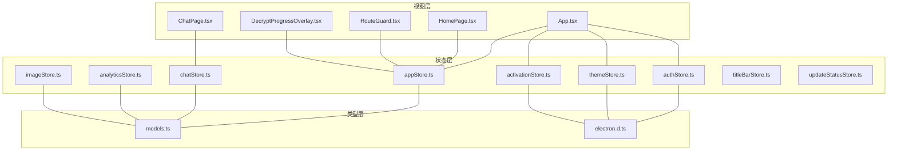
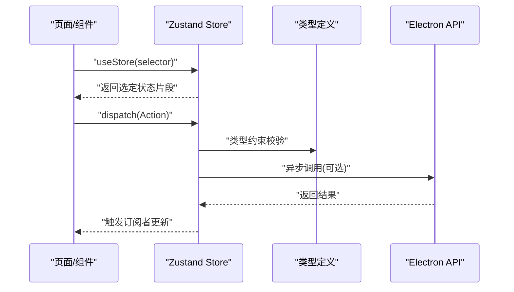
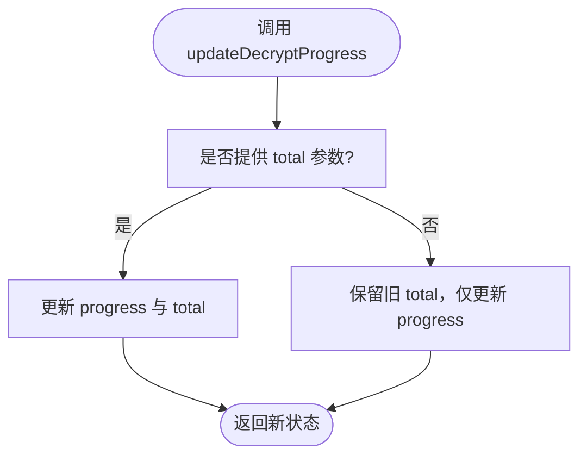
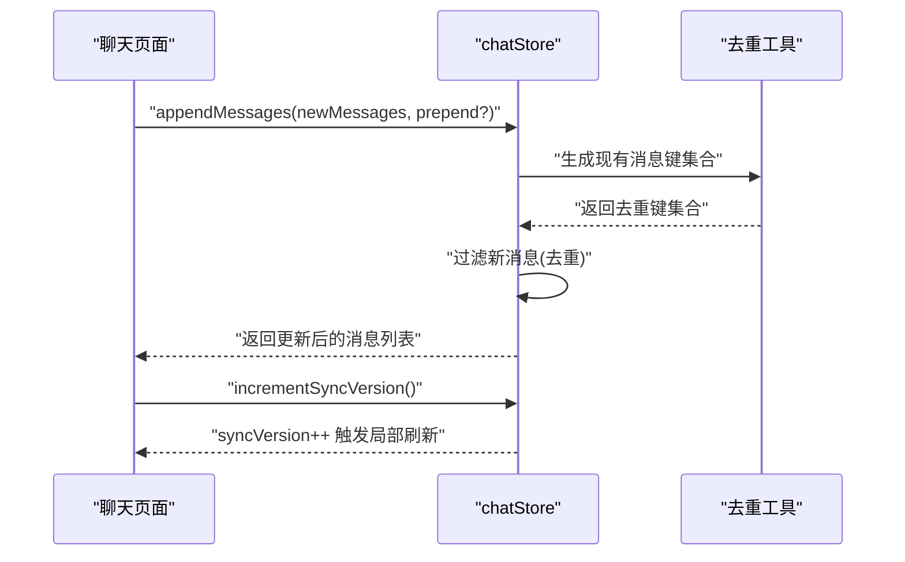
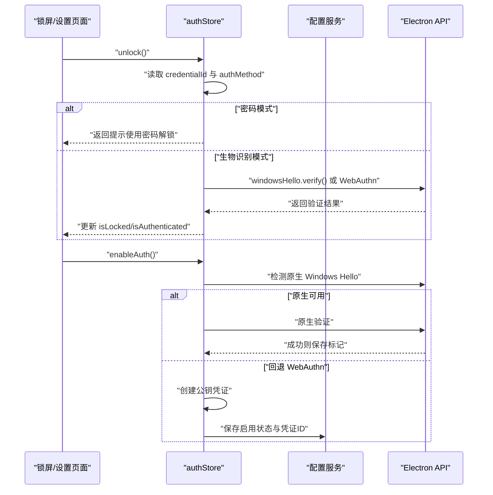
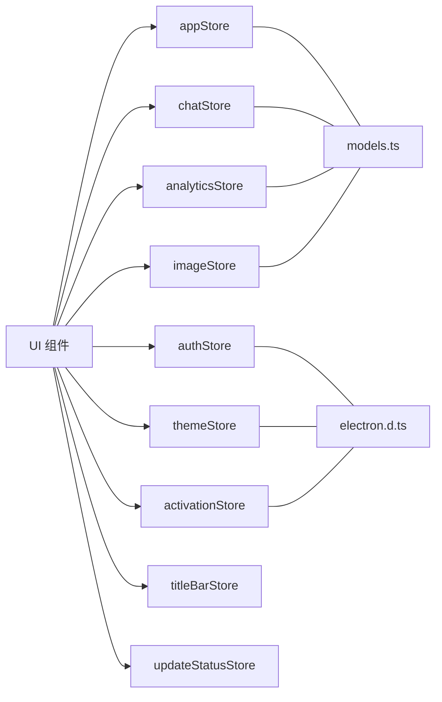

# Zustand Store 设计模式

<cite>
**本文档引用的文件**
- [src/stores/appStore.ts](file://src/stores/appStore.ts)
- [src/stores/chatStore.ts](file://src/stores/chatStore.ts)
- [src/stores/authStore.ts](file://src/stores/authStore.ts)
- [src/stores/themeStore.ts](file://src/stores/themeStore.ts)
- [src/stores/activationStore.ts](file://src/stores/activationStore.ts)
- [src/stores/analyticsStore.ts](file://src/stores/analyticsStore.ts)
- [src/stores/imageStore.ts](file://src/stores/imageStore.ts)
- [src/stores/titleBarStore.ts](file://src/stores/titleBarStore.ts)
- [src/stores/updateStatusStore.ts](file://src/stores/updateStatusStore.ts)
- [src/types/models.ts](file://src/types/models.ts)
- [src/types/electron.d.ts](file://src/types/electron.d.ts)
- [src/App.tsx](file://src/App.tsx)
- [src/pages/HomePage.tsx](file://src/pages/HomePage.tsx)
- [src/components/RouteGuard.tsx](file://src/components/RouteGuard.tsx)
- [src/components/DecryptProgressOverlay.tsx](file://src/components/DecryptProgressOverlay.tsx)
- [src/pages/ChatPage.tsx](file://src/pages/ChatPage.tsx)
</cite>

## 目录
1. [简介](#简介)
2. [项目结构](#项目结构)
3. [核心组件](#核心组件)
4. [架构总览](#架构总览)
5. [详细组件分析](#详细组件分析)
6. [依赖关系分析](#依赖关系分析)
7. [性能考量](#性能考量)
8. [故障排查指南](#故障排查指南)
9. [结论](#结论)
10. [附录](#附录)

## 简介
本文件系统性梳理 CipherTalk 中基于 Zustand 的状态管理模式，覆盖 Store 创建方式、状态结构设计、Action 设计原则、状态选择器模式、模块化与组合设计，以及最佳实践建议。文档面向不同技术背景读者，既提供高层概览，也给出代码级参考与可视化图表。

## 项目结构
- Store 层位于 src/stores，按功能域拆分，每个 Store 独立导出一个 useStore 钩子与对应的接口类型定义。
- 类型定义集中在 src/types，包括模型类型与 Electron API 类型声明，为 Store 提供强类型约束。
- 页面与组件通过 useStore 钩子访问状态与 Action，实现 UI 与状态的解耦。

**图表来源**
- [src/stores/appStore.ts:1-97](file://src/stores/appStore.ts#L1-L97)
- [src/stores/chatStore.ts:1-146](file://src/stores/chatStore.ts#L1-L146)
- [src/stores/authStore.ts:1-271](file://src/stores/authStore.ts#L1-L271)
- [src/stores/themeStore.ts:1-146](file://src/stores/themeStore.ts#L1-L146)
- [src/stores/activationStore.ts:1-45](file://src/stores/activationStore.ts#L1-L45)
- [src/stores/analyticsStore.ts:1-71](file://src/stores/analyticsStore.ts#L1-L71)
- [src/stores/imageStore.ts:1-174](file://src/stores/imageStore.ts#L1-L174)
- [src/stores/titleBarStore.ts:1-13](file://src/stores/titleBarStore.ts#L1-L13)
- [src/stores/updateStatusStore.ts:1-28](file://src/stores/updateStatusStore.ts#L1-L28)
- [src/types/models.ts:1-109](file://src/types/models.ts#L1-L109)
- [src/types/electron.d.ts:1-986](file://src/types/electron.d.ts#L1-L986)
- [src/App.tsx:40-239](file://src/App.tsx#L40-L239)
- [src/pages/HomePage.tsx:15-175](file://src/pages/HomePage.tsx#L15-L175)
- [src/components/RouteGuard.tsx:1-20](file://src/components/RouteGuard.tsx#L1-L20)
- [src/components/DecryptProgressOverlay.tsx:1-10](file://src/components/DecryptProgressOverlay.tsx#L1-L10)
- [src/pages/ChatPage.tsx:2575-2585](file://src/pages/ChatPage.tsx#L2575-L2585)

**章节来源**
- [src/stores/appStore.ts:1-97](file://src/stores/appStore.ts#L1-L97)
- [src/stores/chatStore.ts:1-146](file://src/stores/chatStore.ts#L1-L146)
- [src/stores/authStore.ts:1-271](file://src/stores/authStore.ts#L1-L271)
- [src/stores/themeStore.ts:1-146](file://src/stores/themeStore.ts#L1-L146)
- [src/stores/activationStore.ts:1-45](file://src/stores/activationStore.ts#L1-L45)
- [src/stores/analyticsStore.ts:1-71](file://src/stores/analyticsStore.ts#L1-L71)
- [src/stores/imageStore.ts:1-174](file://src/stores/imageStore.ts#L1-L174)
- [src/stores/titleBarStore.ts:1-13](file://src/stores/titleBarStore.ts#L1-L13)
- [src/stores/updateStatusStore.ts:1-28](file://src/stores/updateStatusStore.ts#L1-L28)
- [src/types/models.ts:1-109](file://src/types/models.ts#L1-L109)
- [src/types/electron.d.ts:1-986](file://src/types/electron.d.ts#L1-L986)
- [src/App.tsx:40-239](file://src/App.tsx#L40-L239)

## 核心组件
- Store 创建与初始化：统一使用 create 函数创建，传入状态初始化对象与 Action 映射，部分 Store 使用 get/set 辅助函数以支持复杂更新与跨字段联动。
- 状态结构设计：每个 Store 定义清晰的接口类型，将状态字段按业务域分组，Action 方法语义明确，便于维护与测试。
- Action 设计：涵盖同步更新、异步处理、批量更新与函数式更新（接收旧状态并返回新状态）。
- 状态选择器：组件通过 useStore(selector) 精准订阅所需字段，减少不必要的重渲染。
- 模块化与组合：Store 之间低耦合，通过共享类型与外部服务（Electron API）交互，避免循环依赖。

**章节来源**
- [src/stores/appStore.ts:40-95](file://src/stores/appStore.ts#L40-L95)
- [src/stores/chatStore.ts:51-145](file://src/stores/chatStore.ts#L51-L145)
- [src/stores/authStore.ts:52-270](file://src/stores/authStore.ts#L52-L270)
- [src/stores/themeStore.ts:79-140](file://src/stores/themeStore.ts#L79-L140)
- [src/stores/activationStore.ts:15-44](file://src/stores/activationStore.ts#L15-L44)

## 架构总览
Zustand Store 在 CipherTalk 中承担“应用状态中枢”的角色，围绕以下关键点构建：

- 类型驱动：通过 TypeScript 接口定义状态与 Action，确保编译期类型安全。
- 分层职责：UI 层仅负责订阅与触发 Action，业务逻辑封装在 Store 内部，必要时调用 Electron API。
- 性能优先：使用状态选择器与函数式更新，避免全局广播导致的过度渲染。
- 可维护性：Store 按功能域拆分，Action 语义化命名，便于单元测试与演进。

**图表来源**
- [src/stores/appStore.ts:40-95](file://src/stores/appStore.ts#L40-L95)
- [src/stores/chatStore.ts:51-145](file://src/stores/chatStore.ts#L51-L145)
- [src/stores/authStore.ts:52-270](file://src/stores/authStore.ts#L52-L270)
- [src/types/models.ts:1-109](file://src/types/models.ts#L1-L109)
- [src/types/electron.d.ts:1-986](file://src/types/electron.d.ts#L1-L986)

## 详细组件分析

### 应用状态 Store（appStore）
- 创建方式：使用 create<AppState> 包装，初始化数据库连接、用户信息、加载与解密进度等字段。
- 状态字段组织：按“数据库状态、用户信息、加载状态、解密进度”分组，职责清晰。
- Action 设计：
  - 同步更新：setDbConnected、setMyWxid、setUserInfo、setLoading、setDecrypting。
  - 函数式更新：updateDecryptProgress。
  - 批量重置：reset。
- 使用场景：主页、路由守卫、解密进度展示等。

**图表来源**
- [src/stores/appStore.ts:77-80](file://src/stores/appStore.ts#L77-L80)

**章节来源**
- [src/stores/appStore.ts:1-97](file://src/stores/appStore.ts#L1-L97)
- [src/components/RouteGuard.tsx:1-20](file://src/components/RouteGuard.tsx#L1-L20)
- [src/components/DecryptProgressOverlay.tsx:1-10](file://src/components/DecryptProgressOverlay.tsx#L1-L10)
- [src/pages/HomePage.tsx:15-175](file://src/pages/HomePage.tsx#L15-L175)

### 聊天状态 Store（chatStore）
- 创建方式：使用 create<ChatState>，内部同时暴露 set/get 辅助函数，支持函数式更新与跨字段联动。
- 状态字段组织：连接状态、会话列表、消息列表、联系人缓存、搜索关键字、同步版本号等。
- Action 设计：
  - 同步更新：setConnected、setConnecting、setConnectionError、setSessions、setCurrentSession、setMessages、setContacts、setSearchKeyword、incrementSyncVersion。
  - 函数式更新：setSessions、setMessages。
  - 批量更新：appendMessages（带去重与前置/后置拼接）、reset。
- 性能优化：通过 syncVersion 触发局部 UI 增量更新，避免全量重渲染。

**图表来源**
- [src/stores/chatStore.ts:89-110](file://src/stores/chatStore.ts#L89-L110)
- [src/stores/chatStore.ts:128-128](file://src/stores/chatStore.ts#L128-L128)

**章节来源**
- [src/stores/chatStore.ts:1-146](file://src/stores/chatStore.ts#L1-L146)
- [src/pages/ChatPage.tsx:2575-2585](file://src/pages/ChatPage.tsx#L2575-L2585)

### 认证状态 Store（authStore）
- 创建方式：使用 create<AuthState>，内部包含 init、enableAuth、unlock、lock 等异步 Action。
- 状态字段组织：认证开关、锁定状态、认证方式、凭证 ID 等。
- Action 设计：
  - 异步处理：init（读取配置并确定认证方式）、enableAuth（优先原生 Windows Hello，回退 WebAuthn）、unlock（原生或 WebAuthn 验证）、verifyPassword（密码哈希校验）。
  - 同步更新：setLocked、disableAuth。
- 错误处理：友好错误消息映射，提升用户体验。

**图表来源**
- [src/stores/authStore.ts:213-261](file://src/stores/authStore.ts#L213-L261)
- [src/stores/authStore.ts:91-153](file://src/stores/authStore.ts#L91-L153)

**章节来源**
- [src/stores/authStore.ts:1-271](file://src/stores/authStore.ts#L1-L271)

### 主题状态 Store（themeStore）
- 创建方式：使用 create<ThemeState>，包含主题、主题模式、应用图标等状态与异步 Action。
- 状态字段组织：currentTheme、themeMode、appIcon、isLoaded。
- Action 设计：
  - 异步持久化：setTheme、setThemeMode、setAppIcon（写入 Electron 配置并触发 UI 更新）。
  - 切换与加载：toggleThemeMode、loadTheme（从配置读取并初始化图标）。
- 依赖管理：与 Electron 配置 API 和应用图标 API 紧密集成。

**章节来源**
- [src/stores/themeStore.ts:1-146](file://src/stores/themeStore.ts#L1-L146)

### 激活状态 Store（activationStore）
- 创建方式：使用 create<ActivationState>，封装激活状态检查与缓存清理。
- 状态字段组织：status、loading、initialized。
- Action 设计：
  - 异步检查：checkStatus（调用 Electron API 检查激活状态，设置 initialized）。
  - 缓存清理：clearCache（清理后重新检查）。
  - 同步更新：setStatus。

**章节来源**
- [src/stores/activationStore.ts:1-45](file://src/stores/activationStore.ts#L1-L45)

### 分析数据 Store（analyticsStore）
- 创建方式：使用 create<AnalyticsState>，存储统计、排行与时间分布等分析数据。
- 状态字段组织：statistics、rankings、timeDistribution、isLoaded、lastLoadTime。
- Action 设计：setStatistics、setRankings、setTimeDistribution、markLoaded、clearCache。

**章节来源**
- [src/stores/analyticsStore.ts:1-71](file://src/stores/analyticsStore.ts#L1-L71)

### 图片状态 Store（imageStore）
- 创建方式：使用 create<ImageState>，包含图片列表、目录、扫描状态与统计信息。
- 状态字段组织：images、directories、selectedDir、isScanning、scanCompleted、error、统计字段。
- Action 设计：
  - 同步更新：setDirectories、setSelectedDir、setScanning、setScanCompleted、setError。
  - 批量更新：addImages（合并新图片并重新计算统计）、clearImages。
  - 单项更新：updateImage（按索引更新并重算已解密数量）、updateStats（重新统计）。
  - 重置：reset。

**章节来源**
- [src/stores/imageStore.ts:1-174](file://src/stores/imageStore.ts#L1-L174)

### 标题栏状态 Store（titleBarStore）
- 创建方式：使用 create<TitleBarState>，维护标题栏右侧内容节点。
- 状态字段组织：rightContent。
- Action 设计：setRightContent。

**章节来源**
- [src/stores/titleBarStore.ts:1-13](file://src/stores/titleBarStore.ts#L1-L13)

### 更新状态 Store（updateStatusStore）
- 创建方式：使用 create<UpdateStatusState>，维护更新状态与日志队列。
- 状态字段组织：isUpdating、logs。
- Action 设计：
  - 同步更新：setIsUpdating。
  - 日志追加：addLog（生成带时间戳的日志条目并限制长度）。

**章节来源**
- [src/stores/updateStatusStore.ts:1-28](file://src/stores/updateStatusStore.ts#L1-L28)

## 依赖关系分析
- Store 间无直接依赖，通过共享类型与 Electron API 间接耦合。
- UI 层通过 useStore(selector) 订阅状态，降低耦合度。
- 类型层（models.ts、electron.d.ts）为 Store 提供强类型保障，避免运行时错误。

**图表来源**
- [src/stores/appStore.ts:1-97](file://src/stores/appStore.ts#L1-L97)
- [src/stores/chatStore.ts:1-146](file://src/stores/chatStore.ts#L1-L146)
- [src/stores/authStore.ts:1-271](file://src/stores/authStore.ts#L1-L271)
- [src/stores/themeStore.ts:1-146](file://src/stores/themeStore.ts#L1-L146)
- [src/stores/activationStore.ts:1-45](file://src/stores/activationStore.ts#L1-L45)
- [src/stores/analyticsStore.ts:1-71](file://src/stores/analyticsStore.ts#L1-L71)
- [src/stores/imageStore.ts:1-174](file://src/stores/imageStore.ts#L1-L174)
- [src/stores/titleBarStore.ts:1-13](file://src/stores/titleBarStore.ts#L1-L13)
- [src/stores/updateStatusStore.ts:1-28](file://src/stores/updateStatusStore.ts#L1-L28)
- [src/types/models.ts:1-109](file://src/types/models.ts#L1-L109)
- [src/types/electron.d.ts:1-986](file://src/types/electron.d.ts#L1-L986)

**章节来源**
- [src/App.tsx:40-239](file://src/App.tsx#L40-L239)
- [src/pages/HomePage.tsx:15-175](file://src/pages/HomePage.tsx#L15-L175)
- [src/components/RouteGuard.tsx:1-20](file://src/components/RouteGuard.tsx#L1-L20)
- [src/components/DecryptProgressOverlay.tsx:1-10](file://src/components/DecryptProgressOverlay.tsx#L1-L10)
- [src/pages/ChatPage.tsx:2575-2585](file://src/pages/ChatPage.tsx#L2575-L2585)

## 性能考量
- 状态选择器：组件通过 useStore(selector) 精准订阅字段，避免无关状态变更引发的重渲染。
- 函数式更新：对复杂状态更新采用函数式 set，减少中间态与重复计算。
- 局部刷新：聊天 Store 通过 syncVersion 触发局部 UI 增量检查，降低全量渲染成本。
- 异步批处理：认证与主题等异步 Action 返回 Promise，避免阻塞 UI 线程。
- 事件监听：App.tsx 中通过 getState() 直接更新状态，确保事件回调内的状态一致性。

**章节来源**
- [src/stores/chatStore.ts:128-128](file://src/stores/chatStore.ts#L128-L128)
- [src/App.tsx:146-161](file://src/App.tsx#L146-L161)

## 故障排查指南
- 认证失败：检查 getFriendlyErrorMessage 映射，确认 WebAuthn 或原生 Windows Hello 配置是否正确。
- 主题加载失败：确认 Electron 配置 API 可用，检查 setThemeMode/setAppIcon 的错误捕获。
- 激活状态异常：使用 checkStatus 的返回值与 initialized 标记定位问题。
- 聊天消息重复：核对 appendMessages 的去重逻辑与多维键生成规则。
- 图片统计异常：确认 detectImageQuality 逻辑与 updateStats 的调用时机。

**章节来源**
- [src/stores/authStore.ts:29-50](file://src/stores/authStore.ts#L29-L50)
- [src/stores/themeStore.ts:118-139](file://src/stores/themeStore.ts#L118-L139)
- [src/stores/activationStore.ts:20-33](file://src/stores/activationStore.ts#L20-L33)
- [src/stores/chatStore.ts:89-110](file://src/stores/chatStore.ts#L89-L110)
- [src/stores/imageStore.ts:146-160](file://src/stores/imageStore.ts#L146-L160)

## 结论
CipherTalk 的 Zustand Store 设计遵循“类型驱动、职责分离、性能优先”的原则，通过清晰的状态结构、语义化的 Action、精准的选择器与模块化拆分，实现了高可维护性与良好性能。建议在新增 Store 时延续现有模式：定义明确接口、使用 create 初始化、合理划分 Action、利用函数式更新与选择器优化渲染。

## 附录

### Store 设计最佳实践
- 命名规范
  - Store 文件：小驼峰，如 appStore.ts、chatStore.ts。
  - Hook 导出：useXxxStore，如 useAppStore、useChatStore。
  - 接口类型：XxxState、XxxInfo 等，与业务语义一致。
- 职责分离
  - UI 仅订阅状态与触发 Action，不直接操作外部服务。
  - Store 内部封装业务逻辑，必要时调用 Electron API。
- 可维护性
  - 按功能域拆分 Store，避免巨型 Store。
  - 对复杂状态更新使用函数式 set，保持不可变性。
  - 为异步 Action 提供错误处理与回退策略。
  - 使用类型层约束输入输出，减少运行时错误。