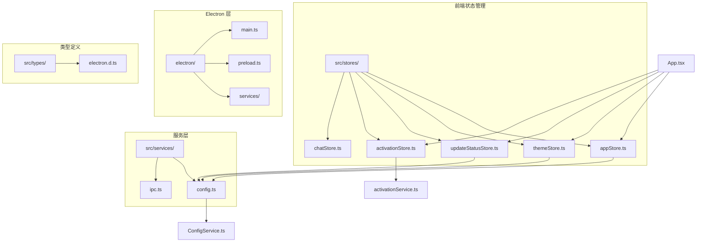
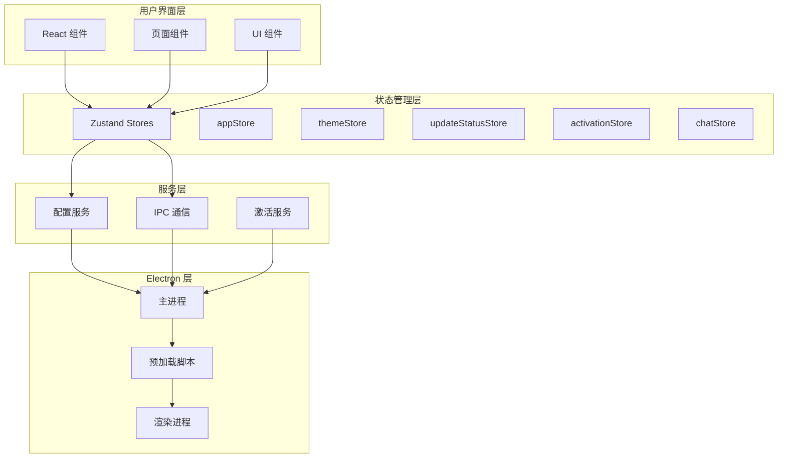
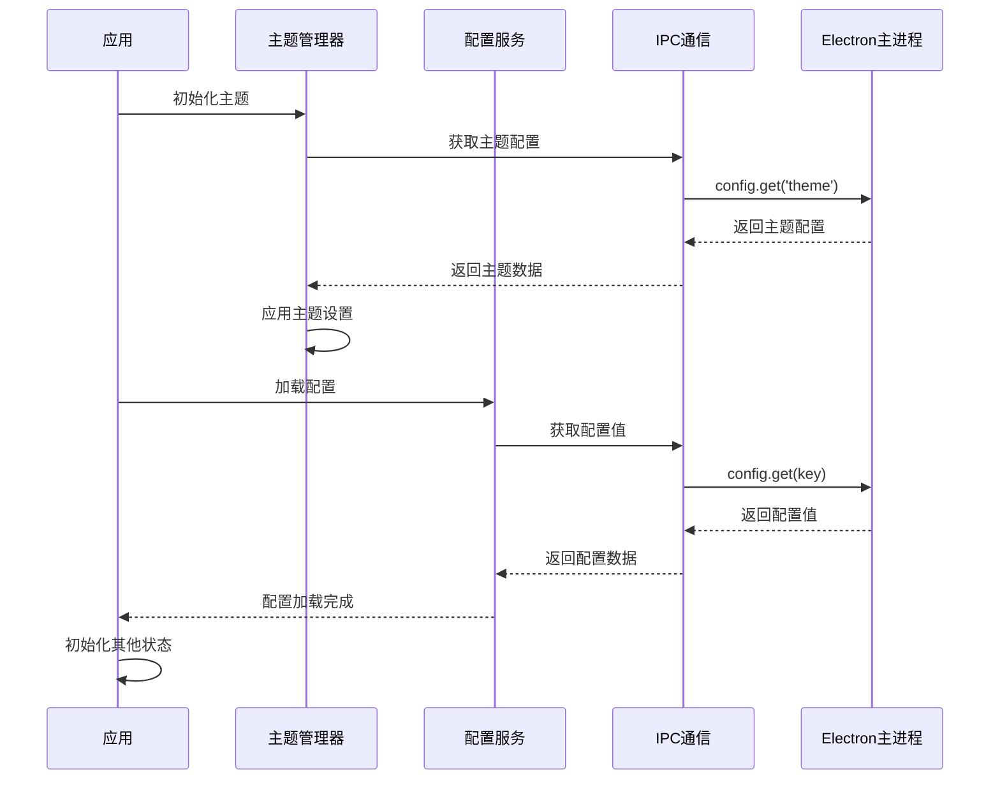
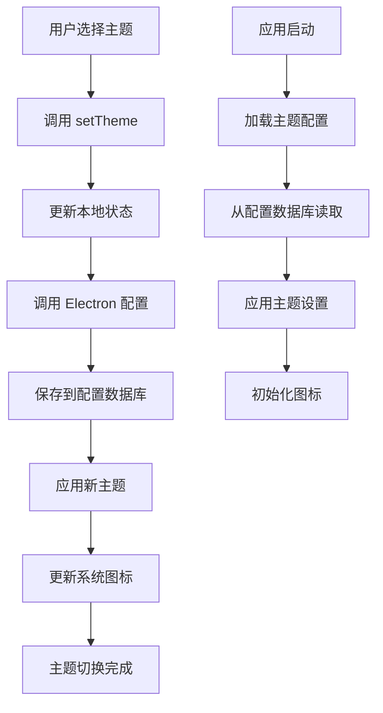
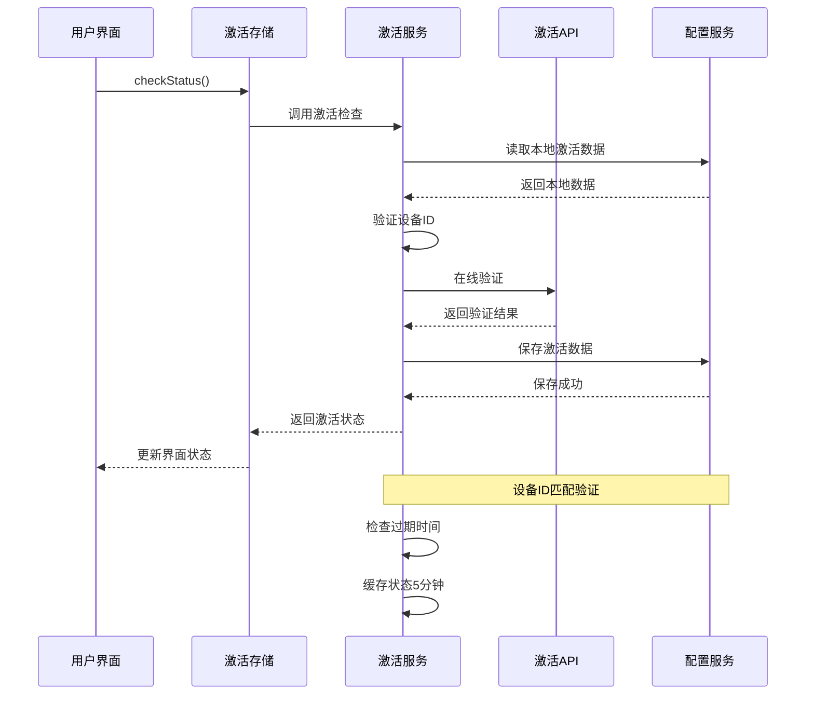
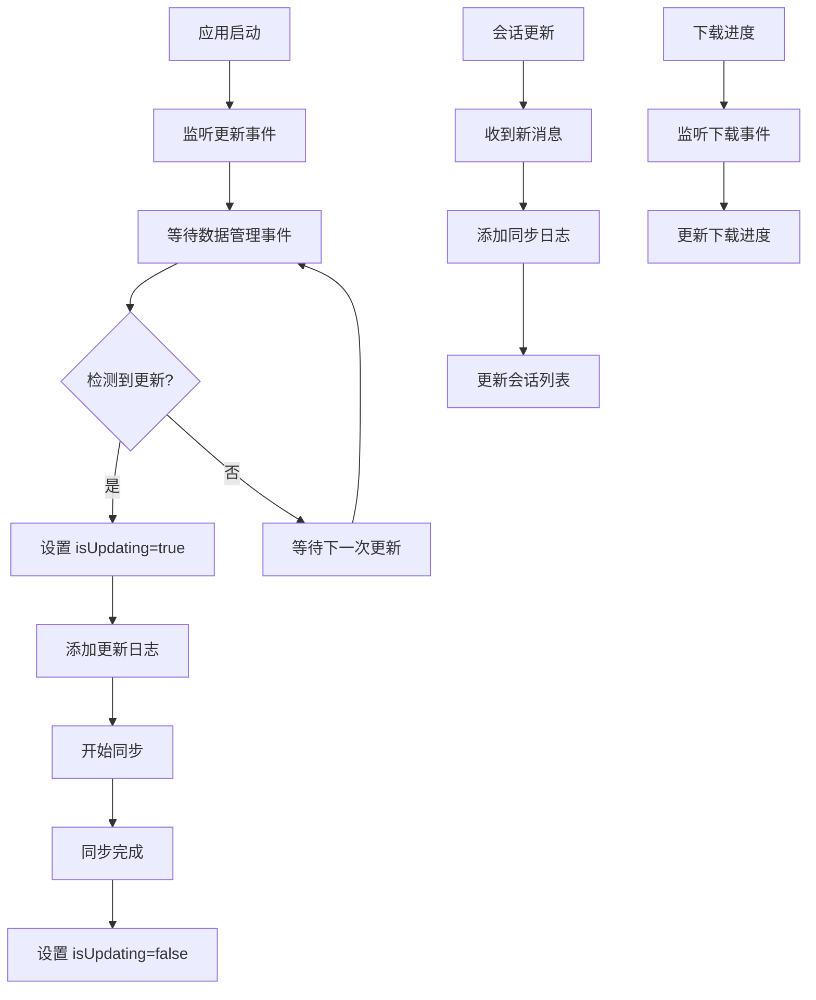
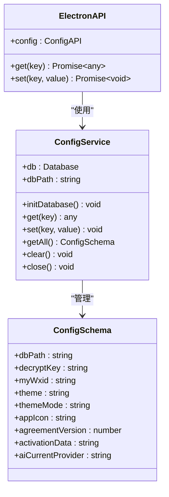
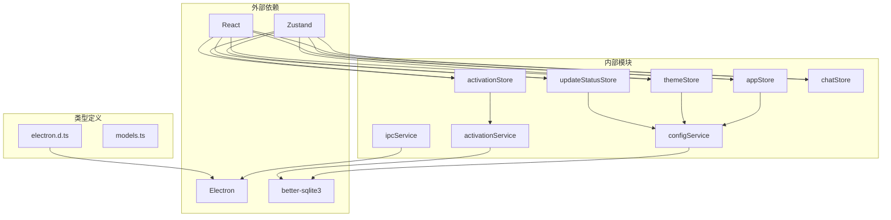

# 应用状态管理

<cite>
**本文档引用的文件**
- [appStore.ts](file://src/stores/appStore.ts)
- [themeStore.ts](file://src/stores/themeStore.ts)
- [updateStatusStore.ts](file://src/stores/updateStatusStore.ts)
- [activationStore.ts](file://src/stores/activationStore.ts)
- [chatStore.ts](file://src/stores/chatStore.ts)
- [config.ts](file://src/services/config.ts)
- [config.ts](file://electron/services/config.ts)
- [activationService.ts](file://electron/services/activationService.ts)
- [ipc.ts](file://src/services/ipc.ts)
- [preload.ts](file://electron/preload.ts)
- [main.ts](file://electron/main.ts)
- [App.tsx](file://src/App.tsx)
- [SettingsPage.tsx](file://src/pages/SettingsPage.tsx)
- [TitleBar.tsx](file://src/components/TitleBar.tsx)
- [electron.d.ts](file://src/types/electron.d.ts)
</cite>

## 目录
1. [简介](#简介)
2. [项目结构](#项目结构)
3. [核心组件](#核心组件)
4. [架构概览](#架构概览)
5. [详细组件分析](#详细组件分析)
6. [依赖关系分析](#依赖关系分析)
7. [性能考虑](#性能考虑)
8. [故障排除指南](#故障排除指南)
9. [结论](#结论)

## 简介

CipherTalk 是一个基于 Electron 和 React 的微信聊天数据分析应用，其状态管理系统采用现代前端架构设计。本文档深入解析应用的状态管理架构，包括全局应用状态、主题状态管理、更新状态、激活状态以及应用生命周期管理。

该系统采用 Zustand 作为状态管理库，结合 Electron 的 IPC 机制，实现了跨进程的状态同步和持久化存储。系统支持多种状态类型：应用配置状态、用户偏好状态、系统设置状态、主题状态、更新状态和激活状态。

## 项目结构

应用状态管理主要分布在以下目录结构中：

**图表来源**
- [appStore.ts:1-97](file://src/stores/appStore.ts#L1-L97)
- [themeStore.ts:1-146](file://src/stores/themeStore.ts#L1-L146)
- [config.ts:1-574](file://src/services/config.ts#L1-L574)

## 核心组件

### 应用状态管理器 (appStore)

应用状态管理器负责管理应用的核心状态，包括数据库连接状态、用户信息、加载状态和解密进度等。

**关键特性：**
- 数据库连接状态跟踪
- 用户信息预加载机制
- 解密进度监控
- 加载状态管理

**状态字段：**
- `isDbConnected`: 数据库连接状态
- `dbPath`: 数据库路径
- `myWxid`: 当前用户微信ID
- `userInfo`: 用户信息对象
- `isLoading`: 加载状态
- `isDecrypting`: 解密状态
- `decryptProgress`: 解密进度

**章节来源**
- [appStore.ts:10-38](file://src/stores/appStore.ts#L10-L38)

### 主题状态管理器 (themeStore)

主题状态管理器实现了完整的主题系统，支持多种主题方案和主题模式切换。

**支持的主题：**
- 云上舞白 (cloud-dancer)
- 刚玉蓝 (corundum-blue)
- 冰猕猴桃汁绿 (kiwi-green)
- 辣椒红 (spicy-red)
- 明水鸭色 (teal-water)
- 新年快乐 (new-year)
- 樱雾粉 (sakura-mist)

**主题模式：**
- light: 浅色模式
- dark: 深色模式
- system: 系统跟随

**章节来源**
- [themeStore.ts:3-65](file://src/stores/themeStore.ts#L3-L65)

### 更新状态管理器 (updateStatusStore)

更新状态管理器专门用于跟踪应用的更新和同步状态。

**功能特性：**
- 实时更新状态监控
- 更新日志记录
- 自动同步状态跟踪

**状态管理：**
- `isUpdating`: 更新状态标志
- `logs`: 更新日志数组（最多保留3条）

**章节来源**
- [updateStatusStore.ts:9-27](file://src/stores/updateStatusStore.ts#L9-L27)

### 激活状态管理器 (activationStore)

激活状态管理器负责应用的许可证验证和功能限制管理。

**核心功能：**
- 激活状态检查
- 缓存清理
- 状态更新

**状态字段：**
- `status`: 激活状态对象
- `loading`: 加载状态
- `initialized`: 初始化状态

**章节来源**
- [activationStore.ts:4-44](file://src/stores/activationStore.ts#L4-L44)

## 架构概览

CipherTalk 的状态管理架构采用分层设计，确保了状态的一致性和可维护性。

**图表来源**
- [App.tsx:28-36](file://src/App.tsx#L28-L36)
- [preload.ts:4-435](file://electron/preload.ts#L4-L435)

## 详细组件分析

### 应用生命周期管理

应用的生命周期通过多个阶段实现，确保状态的正确初始化和清理。

**图表来源**
- [App.tsx:61-105](file://src/App.tsx#L61-L105)
- [preload.ts:438-453](file://electron/preload.ts#L438-L453)

### 主题切换机制

主题切换机制实现了动态主题更新和持久化存储。

**图表来源**
- [themeStore.ts:85-116](file://src/stores/themeStore.ts#L85-L116)
- [config.ts:82-124](file://electron/services/config.ts#L82-L124)

**章节来源**
- [themeStore.ts:79-140](file://src/stores/themeStore.ts#L79-L140)

### 激活状态管理

激活状态管理实现了完整的许可证验证流程。

**图表来源**
- [activationStore.ts:20-33](file://src/stores/activationStore.ts#L20-L33)
- [activationService.ts:247-367](file://electron/services/activationService.ts#L247-L367)

**章节来源**
- [activationStore.ts:15-44](file://src/stores/activationStore.ts#L15-L44)
- [activationService.ts:38-515](file://electron/services/activationService.ts#L38-L515)

### 更新状态监控

更新状态监控实现了实时的数据库同步和更新通知。

**图表来源**
- [App.tsx:136-168](file://src/App.tsx#L136-L168)
- [updateStatusStore.ts:16-27](file://src/stores/updateStatusStore.ts#L16-L27)

**章节来源**
- [App.tsx:136-168](file://src/App.tsx#L136-L168)
- [updateStatusStore.ts:9-27](file://src/stores/updateStatusStore.ts#L9-L27)

### 配置持久化机制

配置持久化机制确保了用户设置的可靠存储和恢复。

**图表来源**
- [config.ts:126-394](file://electron/services/config.ts#L126-L394)
- [electron.d.ts:47-52](file://src/types/electron.d.ts#L47-L52)

**章节来源**
- [config.ts:126-394](file://electron/services/config.ts#L126-L394)

## 依赖关系分析

应用状态管理系统的依赖关系体现了清晰的分层架构。

**图表来源**
- [main.ts:1-800](file://electron/main.ts#L1-L800)
- [preload.ts:1-454](file://electron/preload.ts#L1-L454)

**章节来源**
- [main.ts:1-800](file://electron/main.ts#L1-L800)
- [preload.ts:1-454](file://electron/preload.ts#L1-L454)

## 性能考虑

### 状态更新优化

系统采用了多种性能优化策略：

1. **状态分片**: 将不同功能的状态分离到独立的 store 中，避免不必要的重渲染
2. **批量更新**: 使用函数式更新避免重复的状态对象创建
3. **缓存机制**: 激活状态缓存 5 分钟，减少网络请求
4. **懒加载**: 主题配置在需要时才加载，提高启动速度

### 内存管理

- 使用 WeakMap 存储联系人缓存，便于垃圾回收
- 及时清理事件监听器，防止内存泄漏
- 控制日志数量，避免内存占用过大

## 故障排除指南

### 常见问题及解决方案

**主题切换失效**
- 检查 Electron 配置服务是否正常工作
- 验证配置数据库连接状态
- 确认 IPC 通信正常

**激活状态异常**
- 检查网络连接状态
- 验证设备ID生成逻辑
- 查看激活服务日志

**更新状态卡住**
- 检查数据管理服务状态
- 验证数据库连接
- 监控同步进度事件

**章节来源**
- [activationService.ts:47-98](file://electron/services/activationService.ts#L47-L98)
- [config.ts:136-246](file://electron/services/config.ts#L136-L246)

## 结论

CipherTalk 的应用状态管理系统展现了现代前端架构的最佳实践。通过采用 Zustand 状态管理库、Electron IPC 通信机制和 SQLite 数据库存储，系统实现了高效、可靠的状态管理。

**主要优势：**
- 清晰的分层架构，职责分离明确
- 完善的状态持久化机制
- 实时的状态同步和更新通知
- 灵活的主题系统和用户偏好管理
- 强大的激活状态管理和功能限制

**技术特点：**
- 跨进程状态同步
- 实时更新监控
- 配置热重载
- 错误状态隔离
- 性能优化策略

该系统为开发者提供了完整的状态管理参考实现，涵盖了现代应用开发中的各种状态管理需求。