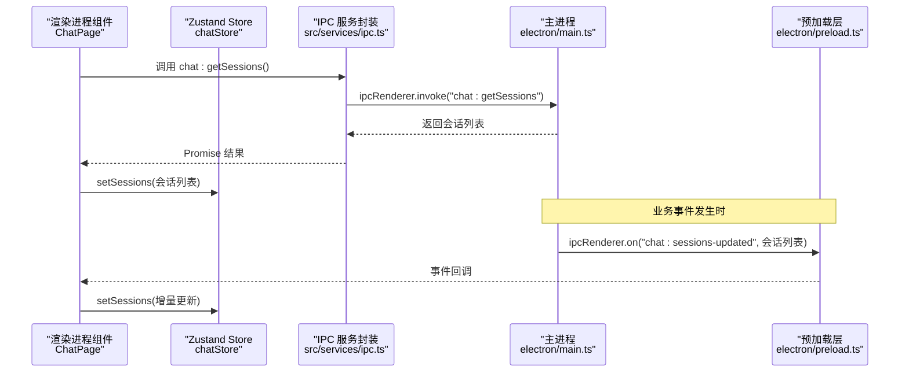
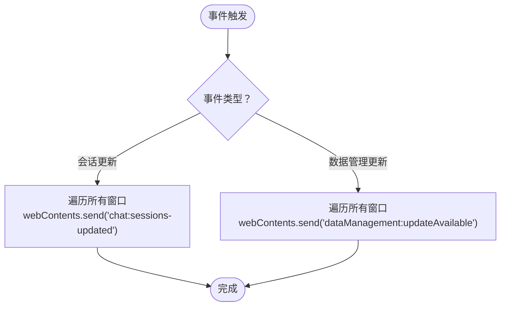
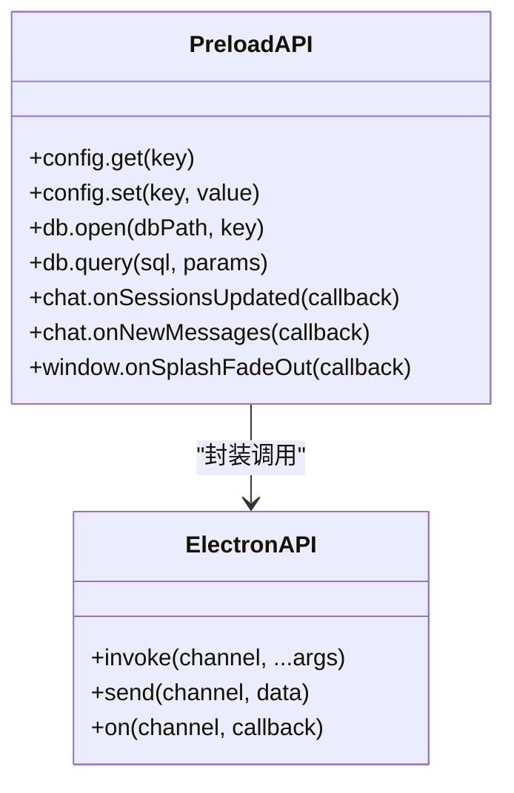
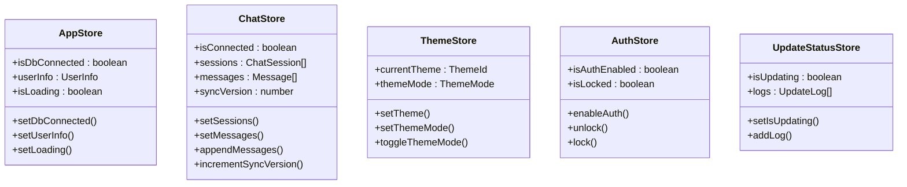
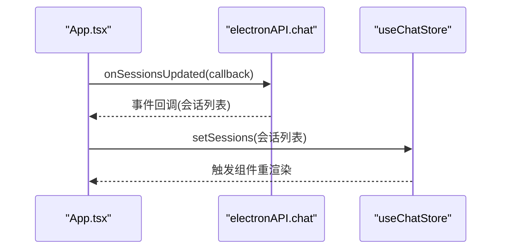
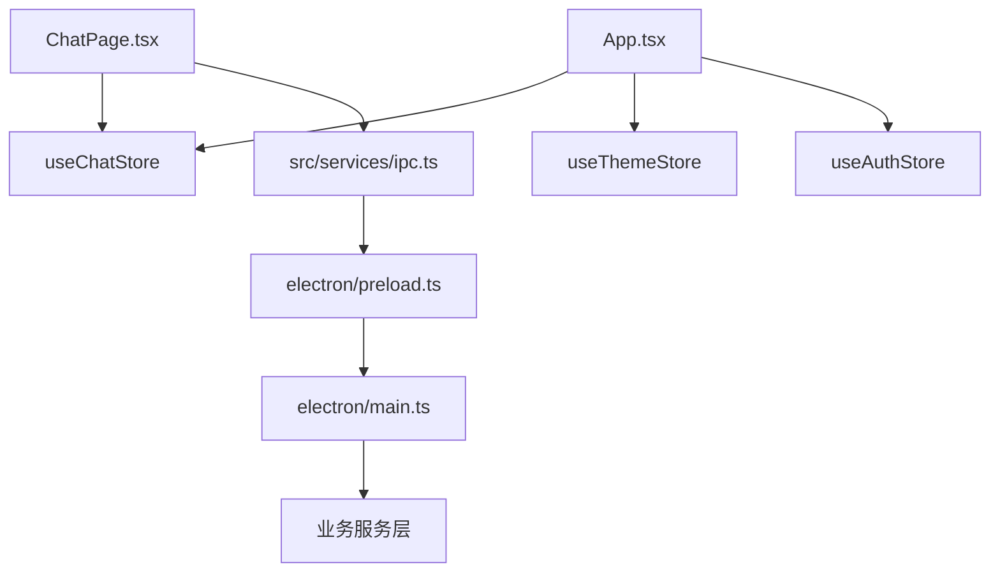

# 状态同步机制

<cite>
**本文档引用的文件**
- [electron/main.ts](file://electron/main.ts)
- [electron/preload.ts](file://electron/preload.ts)
- [src/services/ipc.ts](file://src/services/ipc.ts)
- [src/stores/appStore.ts](file://src/stores/appStore.ts)
- [src/stores/chatStore.ts](file://src/stores/chatStore.ts)
- [src/stores/themeStore.ts](file://src/stores/themeStore.ts)
- [src/stores/authStore.ts](file://src/stores/authStore.ts)
- [src/stores/updateStatusStore.ts](file://src/stores/updateStatusStore.ts)
- [src/App.tsx](file://src/App.tsx)
- [src/pages/ChatPage.tsx](file://src/pages/ChatPage.tsx)
</cite>

## 目录
1. [简介](#简介)
2. [项目结构](#项目结构)
3. [核心组件](#核心组件)
4. [架构总览](#架构总览)
5. [详细组件分析](#详细组件分析)
6. [依赖关系分析](#依赖关系分析)
7. [性能考虑](#性能考虑)
8. [故障排除指南](#故障排除指南)
9. [结论](#结论)

## 简介
本文件针对 CipherTalk 的跨进程状态同步机制进行全面技术解析，重点覆盖：
- Electron 主进程与渲染进程之间的状态共享与 IPC 通信
- 消息传递、事件监听与状态推送的实现模式
- 异步状态更新的 Promise 处理、错误捕获与状态回滚
- 状态订阅机制（useStore 订阅、组件自动更新、性能优化）
- 状态一致性保证（事务处理、原子更新、竞态条件避免）
- 状态同步最佳实践（同步策略、性能考量、调试方法）

## 项目结构
项目采用典型的 Electron + React 架构，状态管理基于 Zustand，IPC 通过 Electron 的 ipcMain/ipcRenderer 实现。核心结构如下：
- 主进程：集中管理业务服务、注册 IPC 处理器、广播事件
- 预加载脚本：通过 contextBridge 暴露受控 API 至渲染进程
- 渲染进程：使用 Zustand stores 管理 UI 状态，通过封装的 ipc 服务与主进程交互

```mermaid
graph TB
subgraph "主进程"
MAIN["electron/main.ts<br/>注册 IPC 处理器/事件广播"]
SERVICES["业务服务层<br/>数据库/聊天/分析等"]
end
subgraph "预加载层"
PRELOAD["electron/preload.ts<br/>contextBridge 暴露 API"]
end
subgraph "渲染进程"
APP["src/App.tsx<br/>全局状态监听与路由"]
STORES["Zustand Stores<br/>appStore/chatStore/themeStore 等"]
PAGES["React 页面组件<br/>ChatPage 等"]
IPC["src/services/ipc.ts<br/>IPC 服务封装"]
end
MAIN --> SERVICES
MAIN <- --> PRELOAD
PRELOAD --> IPC
IPC --> STORES
STORES --> PAGES
APP --> STORES
```

**图表来源**
- [electron/main.ts:1130-1217](file://electron/main.ts#L1130-L1217)
- [electron/preload.ts:4-435](file://electron/preload.ts#L4-L435)
- [src/services/ipc.ts:1-38](file://src/services/ipc.ts#L1-L38)
- [src/stores/appStore.ts:1-97](file://src/stores/appStore.ts#L1-L97)
- [src/stores/chatStore.ts:1-146](file://src/stores/chatStore.ts#L1-L146)
- [src/stores/themeStore.ts:1-146](file://src/stores/themeStore.ts#L1-L146)
- [src/App.tsx:1-200](file://src/App.tsx#L1-L200)

**章节来源**
- [electron/main.ts:1130-1217](file://electron/main.ts#L1130-L1217)
- [electron/preload.ts:4-435](file://electron/preload.ts#L4-L435)
- [src/services/ipc.ts:1-38](file://src/services/ipc.ts#L1-L38)
- [src/stores/appStore.ts:1-97](file://src/stores/appStore.ts#L1-L97)
- [src/stores/chatStore.ts:1-146](file://src/stores/chatStore.ts#L1-L146)
- [src/stores/themeStore.ts:1-146](file://src/stores/themeStore.ts#L1-L146)
- [src/App.tsx:1-200](file://src/App.tsx#L1-L200)

## 核心组件
- 主进程 IPC 注册与事件广播：集中注册 handle/on 处理器，统一向所有窗口广播事件
- 预加载 API 暴露：通过 contextBridge.exposeInMainWorld 暴露受控 API，区分 invoke/send
- 渲染进程 IPC 封装：src/services/ipc.ts 提供统一的调用入口
- Zustand Store：集中管理 UI 状态，提供 set/get 操作与派生状态
- 全局监听与状态推送：App.tsx 监听主进程推送的增量更新，驱动 Store 更新

**章节来源**
- [electron/main.ts:1130-1217](file://electron/main.ts#L1130-L1217)
- [electron/preload.ts:4-435](file://electron/preload.ts#L4-L435)
- [src/services/ipc.ts:1-38](file://src/services/ipc.ts#L1-L38)
- [src/stores/appStore.ts:1-97](file://src/stores/appStore.ts#L1-L97)
- [src/stores/chatStore.ts:1-146](file://src/stores/chatStore.ts#L1-L146)
- [src/App.tsx:136-168](file://src/App.tsx#L136-L168)

## 架构总览
跨进程状态同步的关键流程：
- 渲染进程通过封装的 ipc 服务发起请求（invoke）
- 主进程在 ipcMain.handle 中执行业务逻辑并返回结果
- 主进程在特定事件发生时，通过 ipcMain.on 广播事件至所有窗口
- 预加载层将事件转发给渲染进程（ipcRenderer.on）
- 渲染进程在 App.tsx 中监听事件，更新 Zustand Store
- 订阅了对应 Store 的组件自动重新渲染



**图表来源**
- [src/services/ipc.ts:24-30](file://src/services/ipc.ts#L24-L30)
- [electron/main.ts:2053-2060](file://electron/main.ts#L2053-L2060)
- [electron/preload.ts:277-286](file://electron/preload.ts#L277-L286)
- [src/App.tsx:155-161](file://src/App.tsx#L155-L161)

**章节来源**
- [src/services/ipc.ts:1-38](file://src/services/ipc.ts#L1-L38)
- [electron/main.ts:2053-2060](file://electron/main.ts#L2053-L2060)
- [electron/preload.ts:277-286](file://electron/preload.ts#L277-L286)
- [src/App.tsx:155-161](file://src/App.tsx#L155-L161)

## 详细组件分析

### 主进程 IPC 注册与事件广播
- 注册各类 handle 处理器：配置、数据库、聊天、数据管理、图片解密、视频等
- 注册事件监听器：当业务产生增量更新时，遍历所有窗口并通过 webContents.send 推送
- 统一错误处理：对异常进行日志记录与错误返回，避免崩溃传播



**图表来源**
- [electron/main.ts:1210-1217](file://electron/main.ts#L1210-L1217)
- [electron/main.ts:1812-1817](file://electron/main.ts#L1812-L1817)

**章节来源**
- [electron/main.ts:1130-1217](file://electron/main.ts#L1130-L1217)
- [electron/main.ts:1210-1217](file://electron/main.ts#L1210-L1217)
- [electron/main.ts:1812-1817](file://electron/main.ts#L1812-L1817)

### 预加载 API 暴露与事件转发
- 通过 contextBridge.exposeInMainWorld 暴露 electronAPI，包含 config/db/chat 等模块
- 区分 invoke（请求-响应）与 send（事件通知）两类调用
- 事件监听器通过 ipcRenderer.on 注册，并提供移除监听的清理函数



**图表来源**
- [electron/preload.ts:4-435](file://electron/preload.ts#L4-L435)

**章节来源**
- [electron/preload.ts:4-435](file://electron/preload.ts#L4-L435)

### 渲染进程 IPC 服务封装
- src/services/ipc.ts 提供统一的调用入口，屏蔽底层 ipcRenderer 差异
- 将 invoke/send 映射为语义化的函数，便于组件直接调用

**章节来源**
- [src/services/ipc.ts:1-38](file://src/services/ipc.ts#L1-L38)

### Zustand Store 设计与状态订阅
- appStore：管理数据库连接、用户信息、加载状态、解密进度等
- chatStore：管理会话列表、消息列表、联系人缓存、搜索关键字、同步版本号等
- themeStore：管理主题、主题模式、应用图标等
- authStore：管理认证状态、解锁/加锁等
- updateStatusStore：管理更新状态与日志队列



**图表来源**
- [src/stores/appStore.ts:10-38](file://src/stores/appStore.ts#L10-L38)
- [src/stores/chatStore.ts:4-49](file://src/stores/chatStore.ts#L4-L49)
- [src/stores/themeStore.ts:67-77](file://src/stores/themeStore.ts#L67-L77)
- [src/stores/authStore.ts:5-24](file://src/stores/authStore.ts#L5-L24)
- [src/stores/updateStatusStore.ts:9-14](file://src/stores/updateStatusStore.ts#L9-L14)

**章节来源**
- [src/stores/appStore.ts:1-97](file://src/stores/appStore.ts#L1-L97)
- [src/stores/chatStore.ts:1-146](file://src/stores/chatStore.ts#L1-L146)
- [src/stores/themeStore.ts:1-146](file://src/stores/themeStore.ts#L1-L146)
- [src/stores/authStore.ts:1-271](file://src/stores/authStore.ts#L1-L271)
- [src/stores/updateStatusStore.ts:1-28](file://src/stores/updateStatusStore.ts#L1-L28)

### 全局监听与状态推送
- App.tsx 在挂载时注册多个事件监听器：
  - 应用更新可用：onUpdateAvailable
  - 数据管理更新可用：onUpdateAvailable
  - 聊天会话更新：onSessionsUpdated
- 监听回调中直接更新对应的 Zustand Store，触发组件自动重渲染



**图表来源**
- [src/App.tsx:155-161](file://src/App.tsx#L155-L161)
- [electron/preload.ts:277-286](file://electron/preload.ts#L277-L286)

**章节来源**
- [src/App.tsx:136-168](file://src/App.tsx#L136-L168)
- [src/App.tsx:155-161](file://src/App.tsx#L155-L161)

### 异步状态更新与错误处理
- Promise 处理：所有 invoke 调用均返回 Promise，需在组件中 await 或 .then
- 错误捕获：主进程对异常进行日志记录并返回错误信息；渲染进程在回调中处理错误
- 状态回滚：对于部分可逆操作，可在错误分支中恢复到上一个稳定状态

**章节来源**
- [electron/main.ts:2053-2060](file://electron/main.ts#L2053-L2060)
- [src/App.tsx:170-178](file://src/App.tsx#L170-L178)

### 状态一致性保证
- 事务处理：主进程在执行批量操作时，先执行前置校验，再统一提交
- 原子更新：Store 的 set 函数保证状态更新的原子性，避免部分更新导致的不一致
- 竞态条件避免：通过同步版本号（syncVersion）与去重逻辑（消息键集合）避免重复与乱序问题

**章节来源**
- [src/stores/chatStore.ts:89-110](file://src/stores/chatStore.ts#L89-L110)
- [src/stores/chatStore.ts:128](file://src/stores/chatStore.ts#L128)

## 依赖关系分析
- 渲染进程依赖关系：
  - 组件依赖 stores（Zustand）
  - 组件通过 ipc 服务与主进程通信
  - App.tsx 作为全局监听器，协调各 store 的更新
- 主进程依赖关系：
  - 注册大量 IPC 处理器，依赖业务服务层
  - 通过 BrowserWindow 集中广播事件



**图表来源**
- [src/pages/ChatPage.tsx:1-200](file://src/pages/ChatPage.tsx#L1-L200)
- [src/App.tsx:1-200](file://src/App.tsx#L1-L200)
- [src/services/ipc.ts:1-38](file://src/services/ipc.ts#L1-L38)
- [electron/preload.ts:4-435](file://electron/preload.ts#L4-L435)
- [electron/main.ts:1130-1217](file://electron/main.ts#L1130-L1217)

**章节来源**
- [src/pages/ChatPage.tsx:1-200](file://src/pages/ChatPage.tsx#L1-L200)
- [src/App.tsx:1-200](file://src/App.tsx#L1-L200)
- [src/services/ipc.ts:1-38](file://src/services/ipc.ts#L1-L38)
- [electron/preload.ts:4-435](file://electron/preload.ts#L4-L435)
- [electron/main.ts:1130-1217](file://electron/main.ts#L1130-L1217)

## 性能考虑
- 渲染性能优化：
  - 使用 react-window 等虚拟化组件减少 DOM 数量
  - 通过 LRU 缓存与懒加载优化图片与资源加载
  - 使用 useMemo/useMemo 降低不必要的重渲染
- 状态更新优化：
  - 使用函数式 set（如 setSessions(prev => ...)）避免读取过期状态
  - 通过 syncVersion 触发增量检查，减少全量重绘
  - appendMessages 去重逻辑避免重复渲染
- IPC 通信优化：
  - 将大对象拆分为多次小消息传输
  - 对高频事件使用节流/防抖
  - 仅在必要时广播事件，避免对所有窗口重复推送

**章节来源**
- [src/pages/ChatPage.tsx:169-200](file://src/pages/ChatPage.tsx#L169-L200)
- [src/stores/chatStore.ts:89-110](file://src/stores/chatStore.ts#L89-L110)
- [src/stores/chatStore.ts:128](file://src/stores/chatStore.ts#L128)

## 故障排除指南
- 事件未收到：
  - 检查主进程是否正确注册广播（chat:sessions-updated）
  - 检查预加载层是否正确转发事件
  - 检查渲染进程是否正确注册监听器
- 状态不同步：
  - 确认 Store 的 set 方法是否被调用
  - 检查组件是否正确订阅对应 Store
  - 查看 syncVersion 是否递增
- IPC 调用失败：
  - 检查主进程 handle 是否存在
  - 查看错误日志，确认异常被捕获与返回
  - 确认 invoke 与 send 的使用是否正确

**章节来源**
- [electron/main.ts:1210-1217](file://electron/main.ts#L1210-L1217)
- [electron/preload.ts:277-286](file://electron/preload.ts#L277-L286)
- [src/App.tsx:155-161](file://src/App.tsx#L155-L161)

## 结论
CipherTalk 的状态同步机制通过“主进程集中处理 + 预加载层受控暴露 + 渲染进程 Store 订阅”的架构实现了可靠的跨进程状态共享。其优势在于：
- 明确的职责分离与清晰的 IPC 边界
- 基于事件的增量推送机制，降低全量同步成本
- Zustand Store 提供简洁的状态管理与自动订阅
- 严格的错误处理与日志记录，便于定位问题

建议在实际开发中遵循以下最佳实践：
- 优先使用事件驱动的增量更新，避免频繁全量拉取
- 在 Store 中维护必要的去重与版本控制，确保 UI 一致性
- 对高频 IPC 与渲染操作进行性能优化与节流
- 建立完善的日志与监控体系，快速定位跨进程问题